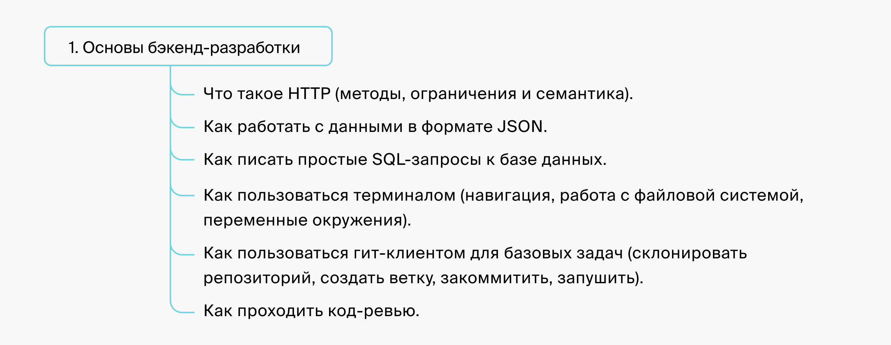
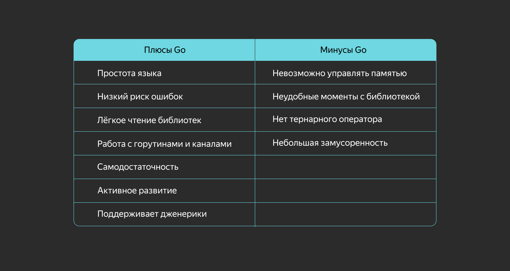
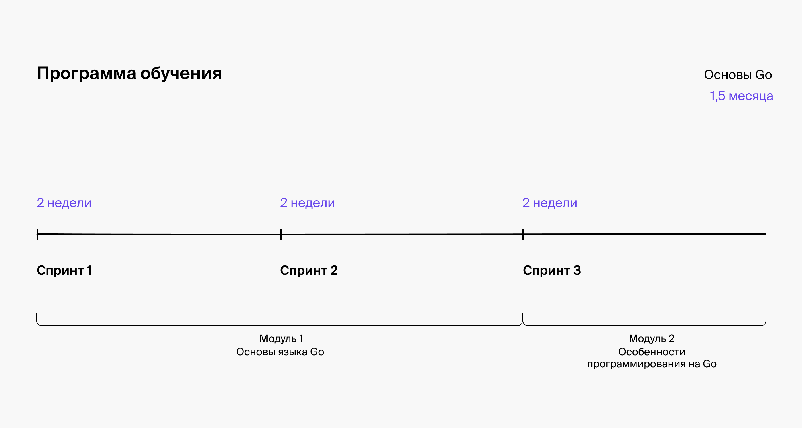
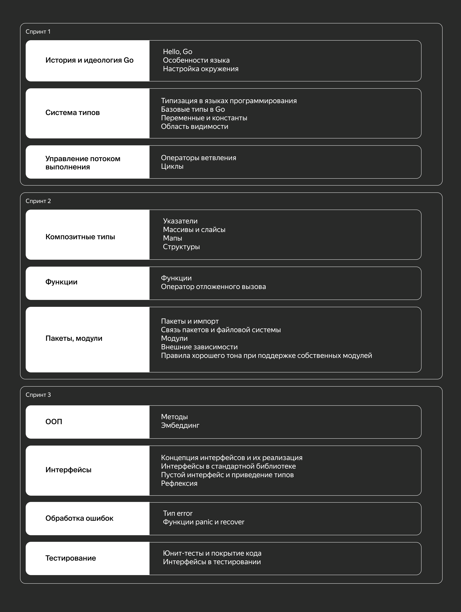
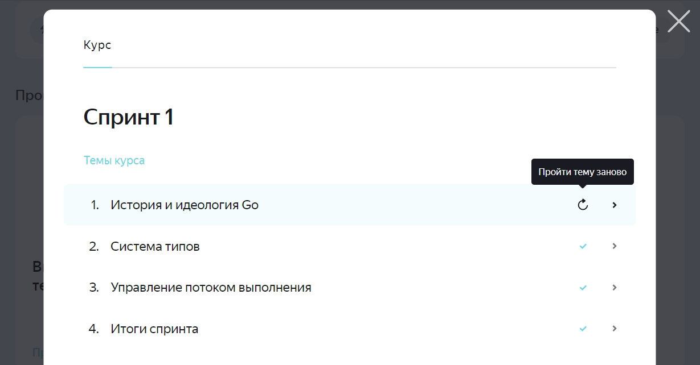
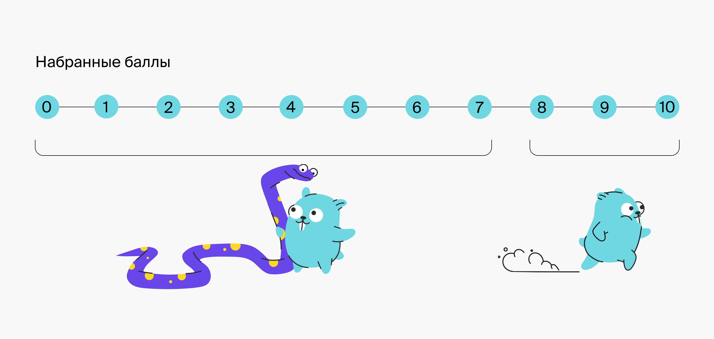

# Добро пожаловать!

Вы находитесь на вводной части курса «Основы Go». Здесь мы расскажем, что ожидает вас на курсе и как будет проходить обучение.

*© Изображение Go gopher, используемое в настоящем курсе, является модификацией изображения маскота, созданного [Renee French](http://reneefrench.blogspot.com/) и лицензируемого на условиях [CC BY 3.0](https://creativecommons.org/licenses/by/3.0/).*

Цель курса — передать практический опыт разработки на Go и подготовить вас к основным курсам в профессии. Мы вложили в этот курс те знания и навыки, которые сами хотели бы видеть, когда изучали Go. И спроектировали программу так, чтобы обучение проходило быстрее и эффективнее.

Вторая цель — способствовать тому, чтобы больше разработчиков писали на Go. Мы хотим внести свой вклад в развитие Go-сообщества в России и за её пределами.

# Завершив наш курс, вы сможете:
- читать код на языке Go;
- портировать простой код с другого языка программирования на Go;
- писать простейшие тесты;
- править мелкие баги под руководством тимлида;

После обучения вы будете готовы проходить основные курсы профессии.

# Для кого курс

Мы сделали этот курс, чтобы помочь программистам на других языках добавить Go в свой стек.

Вот что нужно знать на старте:

Мы включили в программу все основы синтаксиса и экосистемы Go, которые понадобятся для прохождения курса [«Продвинутый Go-разработчик»](https://practicum.yandex.ru/go-advanced/?from=go-basics). 

Продвинутый Go-разработчик — это курс для программистов, которые хотят обучиться на Middle Go Developer. 

Завершив продвинутый курс, вы научитесь:
- проектировать REST API;
- проектировать и писать самостоятельно микросервисы;
- читать код на Go и понимать решаемую им задачу;
- проводить код-ревью приложений на Go;
- портировать часть продакшен-кода с известного вам языка на Go под руководством более опытного разработчика;
- участвовать в проектировании архитектурных решений для новых сервисов на Go;
- писать продвинутые тесты и проверять функциональность и корректность кода;
- перекладывать продуктовые задачи в код на Go;
- внедрять в сервис на Go информативное и высокопроизводительное логирование;
- оптимизировать код на Go;
- реализовывать архитектурные решения и паттерны проектирования на Go;
- находить и исправлять синтаксические и стилистические ошибки кода;
- расширять функциональность существующего сложного сервиса.

Если вы уже знаете основы языка Go и бэкенд-разработки, вы можете пройти вступительный тест в бесплатной части курса «Продвинутый Go-разработчик» и поступить на курс.

# Почему Go?

Здесь мы расскажем, зачем разработчику учить Go. Если вы уже сформулировали для себя ответ, можете переходить дальше.

## Go vs language X

[Go](https://go.dev/) — это высокоуровневый язык программирования, который создавался для быстрого написания микросервисов. Его придумали в Google в качестве замены С++ для тех проектов, где важна скорость разработки и компиляции кода. Go — довольно простой язык, в нём мало ключевых слов и неявных элементов. У него есть два козыря: эффективное использование вычислительных ресурсов при минимальных затратах и написание кода через примитивы многопоточности, встроенные в язык.

На Go можно программировать всё что угодно. В языке есть небольшой набор ключевых слов, но работают они как конструктор. Здесь нет подводных камней: написали `interface` — обратились именно к интерфейсу приложения. Кстати, в этом кроется одно из преимуществ Go перед C++. Если в последнем обнаруживается какая-то проблема, то разработчики языка добавляют новое ключевое слово или составляют хитрые конструкции из старых слов, чем сильно запутывают пользователей.

> Листайте таблицу вниз, чтобы увидеть больше свойств из подборки языков.

 - | Go | Python | PHP | C++ | Java | JavaScript | Rust
---|---|---|---|---|---|---|---
Парадигма | Процедурный, функциональный и конкурентный | Объектно-ориентированный язык общего назначения, императивный, функциональный, процедурный, рефлективный | Мультипарадигмальный, объектно-ориентированный, императивный | Процедурный, объектно-ориентированный | Объектно-ориентированный язык общего назначения | Объектно-ориентированный язык общего назначения, поддерживаются императивный и функциональный стили | Язык общего назначения, сочетает парадигмы функционального и процедурного стиля
Исполнение | Компилируемый | Интерпретируемый | Интерпретируемый | Компилируемый | Компиляция в байт-код, который выполняется на виртуальной машине | Интерпретируемый | Компилируемый 
Типизация | Статическая сильная | Динамическая сильная | Динамическая слабая | Статическая сильная | Статическая сильная | Динамическая слабая | Статическая сильная
Применение | Системные утилиты, веб-приложения (бэкенд) | Веб-приложения (бэкенд), Data Science | Веб-разработка | Микроконтроллеры, операционные системы, игры, бэкенд | Мобильная разработка, кроссплатформенные десктопные приложения, веб-разработка (бэкенд) | Веб-разработка | Системная разработка
Управление памятью | Нет прямого управления памятью | Нет прямого управления памятью | Нет прямого управления памятью | Есть прямое управление памятью | Нет прямого управления памятью | Нет прямого управления памятью | Есть управление памятью
Наследование | Не допускает множественное наследование | Допускает множественное наследование | Допускает множественное наследование | Допускает множественное наследование | Допускает множественную имплементацию интерфейсов | Прототипное наследование | Нет прямого наследования
Синтаксис | Основан на открывающих и закрывающих скобках | Используются отступы для обозначения блоков кода | Основан на открывающих и закрывающих скобках | Основан на открывающих и закрывающих скобках | Основан на открывающих и закрывающих скобках | Основан на открывающих и закрывающих скобках | Основан на открывающих и закрывающих скобках
Конкурентность | Есть встроенная | Не закладывалась изначально | Нет встроенной | Есть встроенная | Есть встроенная | Встроенная асинхронность, всё выполняется в одном потоке | Встроенная многопоточность
Объектная ориентированность | Слабая поддержка объектной ориентированности и функциональных концептов, но сильная типизация | Отличная объектная ориентированность, поддержка функциональных концептов | ООП с поддержкой функционального стиля | ООП с поддержкой функционального стиля | ООП-подход, весь код пишется в таком стиле | ООП с прототипным наследованием | Не является объектно-ориентированным языком
Переход на Go | Средне | Легко | Легко | Сложно | Средне | Легко | Сложно

## Что написано на Go

Если коротко — огромное количество проектов. Одни из самых популярных — инструменты для контейнеризации [Docker](https://www.docker.com/) и оркестрации контейнеров [Kubernetes](https://kubernetes.io/ru/), а также множество DevOps-инструментов для аналитики и сбора данных, например [Prometheus](https://prometheus.io/) или [Grafana](https://grafana.com/). Наверняка вы слышали про [Uber](https://github.com/uber), Ozon, Avito или МТС, которые тоже проголосовали за Go. Язык не зря пользуется спросом среди маркетплейсов, доставки, рекламных сетей и других подобных проектов, ведь все эти области объединяет высокая нагрузка на сервисы.

Go входит в [топ-10](https://www.tiobe.com/tiobe-index/) самых используемых языков, [в рейтинге GitHub](https://madnight.github.io/githut/#/pull_requests/2023/4) он занимает третье место.

## Преимущества и недостатки Go

> Разумеется, все отображённые плюсы и минусы языка Go будут подробнее рассмотрены в следующих уроках.

# Чем удобен Go

Если вам нужно писать многопоточно, проще использовать Go, так как у него есть множество примитивов для обработки таких задач. В языке удобно работать с HTTP, на нём можно быстро создавать API, а также мелкие портативные инструменты. Но чаще всего Go используют для разработки серверных приложений и сервисов, где есть сложные вычисления, многопоточные системы и парсеры.

Go считается статически линкованным языком: после компиляции разработчик получает один бинарник без всяких зависимостей. Представьте, что разработчик написал небольшую утилиту, которая считает количество указанных слов. На вход отдаётся текстовый файл, а на выходе получаем число или частотный анализ. После компиляции готового кода появляется один бинарник весом 10–15 МБ, который можно легко отправить через мессенджер или по почте, чтобы получатель открыл его на своём компьютере и начал пользоваться без установки дополнительных библиотек.

# Как начать писать на Go

Даже без знаний языков программирования можно легко начать писать на Go, потому что у него простейший синтаксис. Достаточно лишь понять логику построения функций и то, как работает компилятор. А программистам С-подобных языков вроде C++, Python, Java или PHP будет ещё проще, ведь там очень много сходств с Go по механике и типам данных. 

Попробуйте начать именно с Go, чтобы затем перейти на другие языки.

# Подробное содержание курса

Представляем [детальную программу курса](https://code.s3.yandex.net/go/Основы_Go_от_Яндекс_Практикума_06.06.2022.pdf). 

Программа объединена в **3 двухнедельных спринта**. Если заниматься по **5 часов в неделю** и изучать по одному уроку в день, можно пройти программу за **полтора месяца** или быстрее, в зависимости от вашего упорства и подготовки.

> Если вы захотите повторить одну из тем курса, чтобы лучше запомнить материал, то сможете воспользоваться опцией «Пройти тему заново». Такая кнопка появляется при условии, что все уроки и задания в теме пройдены. 

> **Внимание:** если вы сбросите свой прогресс по теме, то все задания в уроках вам нужно будет выполнить снова.

# Как проходит обучение

## Главное:
- Вы можете начать учиться **в любой момент: учёба асинхронная**, проходит индивидуально и не привязана к дате старта потока.
- На курсе нет записанных видеолекций, есть **уроки в текстовом формате**.
- На курсе **нет тренажёра**. Практические работы вы выполняете **в своём редакторе кода**.
- Если во время прохождения курса возникнут технические неполадки или вы обнаружите баг на платформе, вам поможет **служба поддержки** — пишите в чат в левом нижнем углу экрана.

# Входной тест

Чтобы начать проходить курс, от вас потребуются знания основ бэкенд-разработки. Поэтому мы разработали входное тестирование. Настоятельно рекомендуем вам пройти его прежде, чем инвестировать время в прохождение курса.

> Входной тест будет полезен и вам, и нам. Вы — сможете убедиться в том, что курс подходит вам по сложности. Мы — будем знать, что наши студенты обладают достаточными навыками для прохождения курса и эффективно используют своё время.

> Этот тест идентичен соответствующим частям входного теста на двух основных курсах профессии.

Тест состоит из **10 вопросов** типа «множественный выбор» или «одиночный выбор» и нацелен на проверку общих навыков бэкенд-разработки. У вас запустится **таймер на 30 минут**, однако в среднем весь тест занимает не более 10 минут, поэтому **времени будет достаточно**.

После окончания теста вы увидите **описание результатов**.

> Время на прохождение: **30 минут**

Ready... Steady...

___
1. Отметьте HTTP-методы, в которые не принято добавлять тело запроса.

- GET ~~Правильный ответ~~
- HEAD ~~Правильный ответ~~
- POST
- PUT
___
2. Отметьте все корректные JSON-объекты.

- `{a: 1}`
- `{"a": [1, 2, {"b": 3}]}` ~~Правильный ответ~~
- `{"a": 1, "b": "2"}` ~~Правильный ответ~~
- `{"a": 1, "b": "2", }`
- `{}` 
___
3. Выберите синтаксически правильные SQL-запросы.

- `SELECT name FROM user WHERE age > 25` ~~Правильный ответ~~
- `FROM user GET name AND age`
- `HAVING age > 25 SELECT name`
- `SELECT max(age) FROM user GROUP BY country` ~~Правильный ответ~~
___
4. Отметьте все команды, которые удалят файл `/tmp/to_remove`.

- `rm /tmp/to_remove` ~~Правильный ответ~~
- `cd /tmp && rm to_remove` ~~Правильный ответ~~
- `mv /tmp/to_remove .`
- `cd /tmp && cp to_remove ..` 
___
5. Какие из приведённых команд позволяют посмотреть в терминале содержимое текстового файла?

- `cat` ~~Правильный ответ~~
- `head` ~~Правильный ответ~~
- `less` ~~Правильный ответ~~
- `mv`
___
6. Отметьте команды, которые установят значение переменной окружения `FOO` в значение `BAR`.

- `export FOO=BAR` ~~Правильный ответ~~
- `FOO := BAR` 
- `export X=BAR && export FOO=$X` ~~Правильный ответ~~
- `var FOO = BAR `
___
7. Есть директория с логами сервиса (каждая строчка лога представляет собой строку с JSON-объектом), где все файлы имеют вид `yyyymmdd.log`. Выберите команду, которая выведет в консоль все строки, содержащие подстроку `"uid": 1` за 2021 год.

- `cat 2021* | grep "uid": 1 `
- `cat 2021* | grep "\"uid\": 1"` ~~Правильный ответ~~
- `SELECT * FROM . WHERE year = 2021 AND uid = 1` 
___
8. Выберите команду, которая склонирует на локальную машину репозиторий https://github.com/systemd/systemd.

- `git fetch --all https://github.com/systemd/systemd.git` 
- `git add https://github.com/systemd/systemd.git` 
- `git clone https://github.com/systemd/systemd.git` ~~Правильный ответ~~
- `git commit -a -m https://github.com/systemd/systemd.git` 
___
9. Выберите команду, которая закоммитит все текущие изменения с сообщением "commit message".

- `git commit -a -m "commit message"` ~~Правильный ответ~~
- `git pull "commit message"`
- `git save -a -m "commit message"`
- `git push -A "commit message"`
___
10. Что можно считать ожидаемой реакцией на ревью типа Request Changes?

- Мёржим код
- Смотрим комментарии от ревьюера и, если считаем их минорными, мёржим код
- Исправляем замечания от ревьюера и запрашиваем повторное ревью ~~Правильный ответ~~
___

# Результаты теста

Что ж, давайте посчитаем баллы! 

За каждый вопрос вы можете получить 1 балл, при условии что выбрали все правильные ответы из возможных. Если в вопросе, где несколько правильных ответов, вы отметили не все или выбрали неправильный, вы получаете 0 баллов.

Если вы набрали от **0 до 6 баллов**, возможно, курс «Основы Go» не оправдает ваших ожиданий и окажется чересчур сложным. Ни в коем случае не сомневаемся в ваших способностях и по-дружески рекомендуем подтянуть основы бэкенд-разработки на одном из базовых языков. Например, на курсе «[Go-разработчик с нуля](https://practicum.yandex.ru/go-developer-basic/)». Когда завершите курс, возвращайтесь к нам и попробуйте пройти тест снова

Если вы набрали **от 7 до 10 баллов**, это значит, что вы владеете основами бэкенд-разработки. Добро пожаловать на курс «Основы Go»! Пусть ваш опыт прохождения этого курса окажется полезным и увлекательным. 
