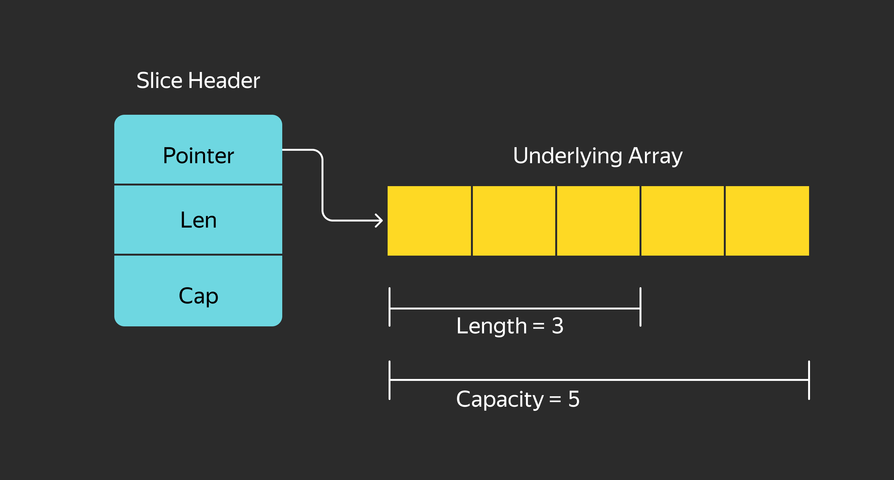
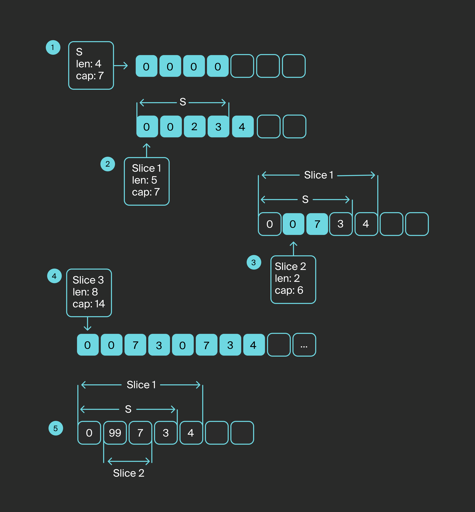

# Массивы

**Массив** — это последовательность фиксированной длины, состоящая из элементов одного типа. Массивы используются для работы с набором элементов, количество которых не изменяется, и там, где нужно иметь набор однотипных элементов известной длины.

Представим, что у нас есть задача хранить набор значений: например, среднесуточную температуру за каждый день недели (всегда 7 дней).

Тогда здесь можно объявить массив:
```go
var lastWeekTemp [7]int
```

Число в скобках определяет длину массива, а литерал после скобок — тип элементов.

В Go количество элементов в массиве — это часть типа, то есть массивы `[3]int` и `[5]int` относятся к разным типам.

Чтобы определить в коде такую переменную, компилятор выделит в памяти область, размер которой будет определяться количеством элементов, умноженным на размер элементов. Каждый элемент будет проинициализирован значением по умолчанию.

Все элементы в памяти расположатся последовательно, поэтому доступ к ним будет иметь константную сложность O(1).

Для обращения к элементам массива используются квадратные скобки `[]`:
```go
tempOnWednesday := lastWeekTemp[2]
```

В Go индексация массивов начинается с нуля, как и в большинстве других языков программирования.

Довольно часто встречается ситуация, когда при объявлении массива требуется задать значения массива сразу. В Go можно совместить объявление и инициализацию в одной конструкции.

Инициализация производится с помощью литерала массива:
```go
thisWeekTemp := [7]int {-3,5,7} // [-3 5 7 0 0 0 0]
rgbColor := [3]uint8 {255, 255, 128} // [255 255 128]
```

Здесь указывается сначала тип массива `[7]int`, а затем в фигурных скобках через запятую — элементы массива, то есть список инициализации.

Для компилятора тип массива в приоритете: если вы указали массив из семи элементов, но в списке инициализации всего три, то оставшиеся элементы будут проинициализированы значениями по умолчанию.

Компилятор следит за размером списка инициализации, и уже такую конструкцию скомпилировать не получится:
```go
rgbColor := [3]uint8{1, 2, 3, 4} // array index 3 out of bounds [0:3]
```

Количество элементов в массиве может быть выведено автоматически по длине списка инициализации. Для этого используется следующая конструкция:
```go
rgbColor := [...]uint8{255, 255, 128} // [255 255 128] len = 3
rgbaColor := [...]uint8{255, 255, 128, 1} // [255 255 128 1] len = 4
```

Три точки указывают компилятору, что размер массива должен быть выведен исходя из размера списка инициализации.

Иногда возникает необходимость указать в списке инициализации только один или несколько элементов массива, а другие не трогать.

Если бы вам понадобилось указать значение среднесуточной температуры в воскресенье, код вряд ли порадовал бы своей утончённостью:
```go
thisWeekTemp := [7]int {0,0,0,0,0,0,11} // [0 0 0 0 0 0 11]
```

Для больших массивов это превратилось бы в нечитаемую конструкцию:
```go
var thisWeekTemp [7]int // [0 0 0 0 0 0 0]
thisWeekTemp[6] = 11 // [0 0 0 0 0 0 11]
```

Однако в списке инициализации можно указать только нужные элементы и их индексы. Индекс и значение указываются через двоеточие. 

```go
thisWeekTemp := [7]int {6:11, 2:3} // [0 0 3 0 0 0 11]
```

Размер массива может быть получен встроенной функцией `len`. Так как размер массива известен на этапе компиляции, то вычисление этой функции при компиляции подменяется конкретным значением.

Если попытаться обратиться к элементу массива за пределами его размера, то сработает механизм защиты памяти в Go и начнётся паника. В отличие от языка C, компилятор и рантайм Go контролируют выход за пределы массива, не позволяя обратиться к недопустимым областям памяти.

# Многомерные массивы

**Многомерные массивы** создаются так же, как и одномерные. Каждая размерность массива указывается в отдельных квадратных скобках.

```go
var thisMonthTemp [4][7]int // массив из четырёх недель, каждая из которых — массив из семи дней 
```

Многомерные массивы удобно представлять себе как массив массивов:
```go
var rgbImage [1080][1920][3]uint8 // изображение — это массив из 1080 строк длиной в 1920 пикселей. Каждый пиксель — массив из трёх байт
            // 1080 — размер массива
            // [1920][3]uint8 — тип элемента
```

Доступ к элементам многомерного массива осуществляется через квадратные скобки:
```go
line := rgbImage [2] // 3-я строка в изображении
pixel := rgbImage[2][3] // 4-й пиксель в третьей строке изображения
red :=  rgbImage[2][3][1] // значение синей компоненты (второй байт) 4-го пикселя в третьей строке изображения
```

# Обход значений массива

Для работы с массивами часто используются циклы. Например, когда нужно посчитать среднюю температуру (округлённо) в течение недели:

```go
var weekTemp = [7]int{5, 4, 6, 8, 11, 9, 5} 

sumTemp := 0

for i:= 0; i < len(weekTemp); i++ {
    sumTemp += weekTemp[i]
}

average := sumTemp / len(weekTemp)
```

Здесь вводится дополнительная переменная `i`, которая увеличивается на каждом шаге. В Go есть более удобная конструкция `for range`, которая позволяет обойти элементы массива последовательно, не используя дополнительные переменные:
```go
var weekTemp = [7]int{5, 4, 6, 8, 11, 9, 5} 

sumTemp := 0

for _, temp := range weekTemp {
    sumTemp += temp
}

average := sumTemp / len(weekTemp)
```

Оператор `range` на каждой итерации возвращает индекс и значение следующего элемента в массиве.

> Обратите внимание на следующий важный момент: конструкция `_, temp := range weekTemp` создаёт новую переменную `temp`, тип которой будет определяться типом элемента массива. 

Этой переменной на каждой итерации цикла будет присваиваться следующее значение из массива. Если изменить значение переменной `temp`, то это не повлияет на значения в массиве. 

Чтобы получить доступ к элементу массива, понадобится индекс:
```go
var weekTemp = [7]int{5, 4, 6, 8, 11, 9, 5} 
// weekTemp [5 4 6 8 11 9 5]
for _, temp := range weekTemp {
   temp = 0 
}
// weekTemp [5 4 6 8 11 9 5] ! — значения не изменились
// если значение элемента не используется, можно опустить вторую переменную
for i := range weekTemp {
   weekTemp[i] = 0 
}
// weekTemp [0 0 0 0 0 0 0] ! — значения изменились
```

Переменные массивов можно присваивать друг другу, однако у них должен быть одинаковый тип, причём количество и тип элементов должны совпадать. 

В процессе присваивания выполняется полное копирование массива, и если программа обрабатывает достаточно большие массивы данных, то эти копирования могут существенно замедлить работу программы и увеличить потребление памяти.

**Передача массива** (как и переменной любого другого типа) в функцию — это копирование его значения в переменную аргумента функции. Здесь тоже будет полное копирование.

> С циклом `for — range` связан ещё один важный момент — операнд `range` копируется во временную переменную, которая уже используется для обхода.

Это также может замедлить выполнение программы для массивов, поэтому следует использовать взятие указателя, чтобы не простаивать:      
```go
for i, temp := range &weekTemp {
    fmt.Println(i, temp)
}
```

Об указателях подробно рассказано в соответствующем уроке.

# Преимущества применения массивов
1. Элементы массива всегда располагаются в памяти последовательно, этому радуется процессор и ускоряет выполнение программы.
1. Массивы имеют фиксированную длину, поэтому выделение памяти под массив происходит ровно один раз в момент его объявления.
1. Время доступа к элементам массива минимальное.
1. Go проверяет выход за пределы массива на этапе компиляции, если может вычислить значение индекса элемента на этапе компиляции, и во время исполнения программы. В первом случае будет ошибка компиляции, а во втором — паника. Панику лучше не допускать.

# Недостатки применения массивов
1. Массивы могут быть только фиксированной длины: если количество элементов нам заранее неизвестно, память придётся выделять с запасом.
1. Массивы передаются и присваиваются с полным копированием элементов, что грозит внезапным ухудшением производительности и увеличенным расходом памяти.
1. Для обработки массивов разных габаритов придётся писать разные функции (если не используются дженерики).

Массивы следует применять крайне обдуманно, когда размеры вашего массива точно известны на этапе компиляции. Это позволяет ускорить работу программы.

Чтобы исправить недостатки массивов, в Go введены слайсы, которые будут рассмотрены ниже.

___
Каких ошибок можно избежать, используя ключевое слово range для итерации через массив?

- Ошибок выхода за пределы диапазона ~~Использование ключевого слова range делает цикл проще, а также помогает избежать ошибок превышения значения допустимого диапазона. range всегда будет возвращать индекс меньше длины массива.~~
- Ошибки переполнения памяти
- Ошибки выделения памяти
___
Когда вместо `range` лучше использовать цикл `for`?

- Когда требуется изменить порядок обхода ~~Верно!~~
- Когда не требуется обход всех элементов ~~Верно!~~
- Никогда ~~Нет, иногда всё-таки нужно.~~
- Если массив слишком большой ~~Неверно. Размер массива не связан с обходом.~~
___

# Слайсы

Раз длина массива — это часть его типа, то массивы не подходят для хранения коллекций данных динамического размера. Эту задачу решает другой тип данных, который гораздо чаще используется на практике, — **слайс** (от англ. slice), или срез. Кроме того, слайс избавит нас от проблемы копирования массивов для присваивания.

**Слайс** — это последовательность переменной длины, состоящая из элементов одного типа. Тип слайса записывается как тип массива без указания размера. Можно инициализировать переменную типа «слайс» значениями, но, в отличие от массива, переменная без инициализации равна `nil`.

Слайс очень похож на `list` в языке Python, но имеет свои особенности.

Слайс — это обёртка над указателем массива, и в Go слайс используется как структура следующего вида:
- указатель на первый элемент базового массива — `ptr`;
- длина слайса — `len`, количество элементов в слайсе;
- ёмкость слайса — `cap`, количество элементов в массиве.



Параметры слайса `len` и `cap` могут быть получены с помощью вызова соответствующих встроенных функций `len()` и `cap()`. 

Если просто объявить такую структуру, то она будет равна `nil`.

Для создания слайса используется встроенная функция `make()`:
```go
mySlice := make([]TypeOfelement, LenOfslice, CapOfSlice)
mySlice := make([]int, 0) // слайс [], базовый массив []
mySlice := make([]int, 5) // слайс [0 0 0 0 0], базовый массив [0 0 0 0 0]
mySlice := make([]int, 5, 10) // слайс [0 0 0 0 0], базовый массив [0 0 0 0 0 0 0 0 0 0]
```

Аргументы функции `make`:
1. Тип слайса (пустые квадратные скобки и тип элемента слайса).
1. Длина слайса. Если не передана, то по умолчанию равна нулю.
1. Ёмкость слайса — размер базового массива. Если значение не передано, то по умолчанию равна длине слайса.

Функция `make` создаёт массив длиной `cap` и записывает указатель на него в структуру слайса. Также она заполняет поля `len` и `cap` в этой структуре и возвращает её в виде переменной типа «слайс».

Даже если `len` и `cap` переданы как нулевые, сама структура уже не будет равна `nil`. Она будет выделена в памяти, и указатель на базовый массив получит значение, отличное от `nil`.

Если передать в функцию `make` параметр `cap` меньше `len`, то будет вызвана ошибка компиляции или паника во время исполнения.

Слайс может быть создан из композитного литерала так же, как и массив. Единственное отличие — не указываем размер массива:
```go
s := []int{1, 2, 3}  // [1 2 3]
```

Длина и ёмкость слайса будут равны композитному литералу.

Новый слайс может быть создан на основе уже существующего слайса или массива. Для этого используется операция взятия слайса.
Она выполняется с помощью двух скобок с двоеточием `[i:j]`, где `i` — индекс первого элемента нового слайса, а `j` — индекс следующего элемента, **не входящего** в новый слайс. 

Допускается не указывать `i` и `j` — в таком случае `i` по умолчанию будет равен `0`, `j` — равен длине массива или слайса.

Таким образом, `[:]` вернёт слайс всего массива, `[:k]` — от начала и до k-го элемента, `[k:]` — от k-го элемента до конца массива.

`i` и `j` должны быть неотрицательны и не больше `len`, причем `i` меньше или равно `j`. Если эти условия не будут выполнены, возникнет ошибка компиляции или паника.

Рассмотрим пример с массивом среднесуточных температур из раздела про массивы.

```go
weekTempArr := [7]int{1, 2, 3, 4, 5, 6, 7}
workDaysSlice := weekTempArr[:5]
weekendSlice := weekTempArr[5:]
fromTuesdayToThursDaySlice := weekTempArr[1:4] 
weekTempSlice := weekTempArr[:]

fmt.Println(workDaysSlice, len(workDaysSlice), cap(workDaysSlice)) // [1 2 3 4 5] 5 7
fmt.Println(weekendSlice, len(weekendSlice), cap(weekendSlice)) // [6 7] 2 2 
fmt.Println(fromTuesdayToThursDaySlice, len(fromTuesdayToThursDaySlice), cap(fromTuesdayToThursDaySlice)) // [2 3 4] 3 6 
fmt.Println(weekTempSlice, len(weekTempSlice), cap(weekTempSlice)) // [1 2 3 4 5 6 7] 7 7
```

___
Попробуйте изменить какой-либо элемент в одном из этих слайсов через операцию `[]`. Убедитесь, что значения изменились и в других слайсах. Все слайсы в этом примере действительно смотрят на один и тот же базовый массив. Обратите внимание на ёмкость — она равна размеру базового массива, кроме первых элементов.

В слайс `workDaysSlice` взяли элементы с 0 по 4, однако 5 и 6 по-прежнему остаются в массиве. 
___

# Изменение размеров слайса

Как вы уже знаете, слайс — последовательность элементов динамического размера.

Уменьшение размера слайса производится через операцию взятия слайса. Результат взятия можно присвоить этому же слайсу:
```go
s := []int{1,2,3} // [1 2 3]
s = s[:len(s)-1] // [1 2]
```

Ёмкость массива при этом не изменяется. 

Для добавления элементов к слайсу используется встроенная функция `append`. Она принимает переменную типа «слайс» и одну или несколько переменных типа элемента слайса, затем возвращает новый слайс, который состоит из копии переданного слайса и переданных в него элементов.

> Внимание: `append` не изменяет переданный ей слайс, а создаёт новый на основе переданного.

Рассмотрим пример:
```go
a := []int{1, 2, 3, 4}
b := a[2:3]   // b = [3]
b = append(b, 7)
fmt.Println(a, len(a), cap(a)) // [1 2 3 7] 4 4
fmt.Println(b, len(b), cap(b)) // [3 7] 2 2
b = append(b, 8, 9, 10)
b[0] = 11
fmt.Println(a, len(a), cap(a)) // [1 2 3 7] 4 4
fmt.Println(b, len(b), cap(b)) // [11 7 8 9 10] 5 6
```

Слайс `a` изменился после выполнения первого `append`, так как слайс b хоть и увеличил свою длину, но не вышел за пределы базового массива.

Дело в механике `append`: если ёмкость слайса позволяет разместить добавляемые элементы (то есть разница между длиной слайса и его ёмкостью больше или равна количеству размещаемых элементов), то `append` возвращает новый слайс, который получен из существующего слайса добавлением новых элементов внутри базового массива.

Если же ёмкость слайса не позволяет разместить эти элементы, то создаётся новый базовый массив подходящего размера, в него копируются все элементы переданного слайса и добавляются новые. Именно поэтому в примере после второго `append` слайс `b` ссылается на новый базовый массив. Разница между ёмкостью нового базового массива и его длиной зависит от количества элементов. В примере длина базового массива для `b` равна 5, а ёмкость — 6. 

Для 1000 элементов разница будет другой:
```go
a := make([]int, 1000)
b := append(a, 7)
fmt.Println(len(a), cap(a))  // 1000 1000
fmt.Println(len(b), cap(b))  // 1001 1536
```

Такой алгоритм работы применяется не только в Go, но и в Python, С++ и многих других языках программирования. Это связано с тем, что выделение нового участка памяти во время работы программы — достаточно дорогостоящая операция с точки зрения затрат вычислительных ресурсов, и выгоднее держать немного памяти про запас. Ёмкость базового массива как раз и задаёт такой запас.

Чтобы соединить два слайса, нужно распаковать слайс `append(a,b...)`. Функция принимает некоторое количество отдельных элементов и преобразует слайс в список через распаковку.

Рассмотрим ещё несколько примеров.

```go
s := make([]int, 4, 7) // [0 0 0 0], len = 4 cap = 7
// 1. Создаём слайс s с базовым массивом на 7 элементов. 
// Четыре первых элемента будут доступны в слайсе.

slice1 := append(s[:2], 2, 3, 4)  
fmt.Println(s, slice1) // [0 0 2 3] [0 0 2 3 4]
// 2. Берём слайс из первых двух элементов s и добавляем к ним три элемента.
// Так как суммарная длина полученного слайса (len == 5) меньше ёмкости s[:2] (cap == 7), 
// то базовый массив остаётся прежним.
// Слайс s тоже изменился, но его длина осталась прежней

slice2 := append(s[1:2], 7) 
fmt.Println(s, slice1, slice2) // [0 0 7 3] [0 0 7 3 4] [0 7]
// 3. Здесь также базовый массив остаётся прежним, изменились все три слайса

slice3 := append(s, slice1[1:]...)
fmt.Println(len(slice3), cap(slice3))  // 8 14
// 4. Длина s и slice1[1:] равна 4, длина нового слайса будет равна 8,  
// что больше ёмкости базового массива.
// Будет создан новый базовый массив ёмкостью 14,
// ёмкость нового базового массива подбирается автоматически 
// и зависит от текущего размера и количества добавленных элементов

// 5. Легко проверить, что slice3 ссылается на новый базовый массив
s[1] = 99
fmt.Println(s, slice1, slice2, slice3) 
// [0 99 7 3] [0 99 7 3 4] [99 7] [0 0 7 3 0 7 3 4]
```

Так этот процесс выглядит на картинке:



Здесь не очень понятно, будут ли новые слайсы ссылаться на тот же базовый массив или отправят свои копии в новый массив. Поэтому на практике функцию `append` рекомендуют лишь для присвоения слайса самому себе: `s = append(s, b)`.

> Чтобы использовать слайсы, нужно понимать механизм их работы. В противном случае вы будете получать ошибки, которые очень трудно найти. Старайтесь избегать ситуаций, когда на базовый массив ссылается несколько слайсов и происходит добавление или изменение элементов.

Операция взятия слайса поддерживает и третий параметр: `[low:high:max]` — третьим параметром указывается ёмкость базового массива, необходимая для создания нового слайса. При этом `max` должна быть меньше или равна ёмкости базового массива или слайса. Вряд ли вы встретите аналогичный пример на практике, но знать про него будет полезно.

# Присваивание слайса и передача в функции 

Присвоение друг другу переменных слайса даже самого внушительного размера не потребляет больших вычислительных мощностей, потому что сама по себе структура слайса всегда содержит всего три поля: `ptr`, `len` и `cap`. Однако надо держать в уме, что эти переменные ссылаются на один и тот же массив, поэтому изменение в данных одного слайса может повлечь за собой изменение другого.

При передаче слайса в аргументы функции структура слайса копируется в локальную переменную внутри функции. Это позволяет изменить данные внутри слайса, переданного в функцию. Но если нужно добавить или удалить элементы из слайса, то эти изменения затронут только локальную переменную слайса. 

Для примера возьмём пару функций из стандартной библиотеки:
```go
s := []int{5, 4, 1, 3, 2}
sort.Ints(s)
fmt.Println(s) // [1 2 3 4 5]
```

Функция `sort.Ints` сортирует полученный слайс целых чисел по возрастанию. Она не меняет размер и ёмкость слайса, поэтому может спокойно работать с ним.

```go
    // Пример взят из стандартной библиотеки
    import (
    "bytes"
    "fmt"
)

func main() {
    bSlice := []byte(" \t\n a lone gopher \n\t\r\n")
    fmt.Printf("%s", bytes.TrimSpace(bSlice)) // a lone gopher
    fmt.Printf("%s", bSlice)  // \t\n a lone gopher \n\t\r\n 
    
}
```

Функция `bytes.TrimSpace` принимает слайс байт и возвращает новый слайс байт, откуда были удалены начальные и конечные пробельные символы. Размер слайса должен измениться, а значит, `bSlice` останется нетронутым. В итоге `bytes.TrimSpace` подарит нам новый слайс.

___
Подумайте, можно ли реализовать функцию, которая всё же будет изменять размер переданного ей слайса?

~~Можно использовать указатель на слайс, то есть тип аргумента должен быть, например, таким: `*[]int`.~~

# Копирование слайсов 

Для копирования элементов из одного слайса в другой применяется функция `copy([]T dest, []T src)`, где `dest` — это слайс-приёмник, а `src` — слайс-источник. Эта функция только перезаписывает элементы, поэтому количество скопированных элементов будет равно меньшей длине из двух слайсов.

```go
var dest []int
dest2, dest3 := make([]int, 3),  make([]int, 5)
src := []int{1, 2, 3, 4}
copy(dest, src)
copy(dest2, src)
copy(dest3, src)
fmt.Println(dest, dest2, dest3, src) // [] [1 2 3] [1 2 3 4 0] [1 2 3 4]
```

# Обход слайсов и доступ к элементам

Обход слайсов и доступ к элементам слайса происходят точно так же, как и для массивов. Чтобы добраться до элементов по индексу, используются квадратные скобки `[]`, циклы `for` и `for range`.

# Полезные приёмы для работы со слайсами

В отличие от других языков программирования, Go не щеголяет обилием функций для работы со слайсами. Гоферы выкрутились и придумали несколько приёмов, которые позволяют решать частые задачи.

Удаление последнего элемента слайса:
```go
s := []int{1, 2, 3}
if len(s) != 0 { // защищаемся от паники
    s = s[:len(s)-1]
}
fmt.Println(s) // [1 2]
```

Удаление первого элемента слайса:
```go
s := []int{1,2,3}
if len(s) != 0 { // защищаемся от паники
    s = s[1:]
} 
fmt.Println(s) // [2 3]
```

Удаление элемента слайса с индексом `i`:
```go
s := []int{1,2,3,4,5}
i := 2

if len(s) != 0 && i < len(s) { // защищаемся от паники
    s = append(s[:i], s[i+1:]...)
} 
fmt.Println(s) // [1 2 4 5]
```

Сравнение двух слайсов:
```go
s1 := []int{1,2,3}
s2 := []int{1,2,4}
s3 := []string{"1","2","3"}
s4 := []int{1,2,3}

fmt.Println(reflect.DeepEqual(s1,s2)) // false
fmt.Println(reflect.DeepEqual(s1,s3)) // false
fmt.Println(reflect.DeepEqual(s1,s4)) // true
```

# Заключение

Слайсы широко применяются в Go для реализации коллекций однотипных элементов, но требуют грамотного применения: без понимания их устройства вы можете нарваться на каверзные ошибки.

# Дополнительные материалы
- [Go Slice Tricks Cheat Sheet](https://ueokande.github.io/go-slice-tricks/)
- [Digital Ocean. Массивы и срезы в Go](https://www.digitalocean.com/community/tutorials/understanding-arrays-and-slices-in-go-ru)

# Вопросы для самопроверки

___
Что такое `len` и `cap`, чем они различаются?

- `len` — длина слайса, то есть количество доступных элементов в слайсе. `cap` — ёмкость базового массива, количество выделенной памяти для слайса ~~Верно!~~
- `cap` — длина слайса, то есть количество доступных элементов в слайсе. `len` — ёмкость базового массива, количество выделенной памяти для слайса ~~Неверно, всё наоборот.~~
- Ничем не различаются, это всё длина слайса ~~Неправильно. Ёмкость слайса больше или равна его длине.~~
___
Как можно создать слайс на основе массива?

- C помощью операции взятия слайса ~~Верно!~~
- С помощью функции `make()` ~~Неверно. С помощью make создаётся новый слайс. Слайс из массива проще всего создать так: `slice := array[:]`.~~
- C помощью функции `getSlice()` ~~В Go нет такой встроенной функции. Слайс из массива проще всего создать так: `slice := array[:]`.~~
___
В чём основная проблема при присваивании массивов?

- Массивы не могут присваиваться друг другу ~~Могут, при этом массив полностью копируется. Это и есть проблема.~~
- Массив полностью копируется ~~Верно!~~
- Копируется только ссылка на массив ~~В отличие от C, массив в Go — не ссылочный тип, он копируется целиком.~~
___
Создайте слайс и заполните его числами от 1 до 100. Оставьте в слайсе первые и последние 10 элементов и разверните слайс в обратном порядке. Подумайте, можно ли подобным образом развернуть строку?

```go
package main

import "fmt"

func main() {
    dim := 100
    s := make([]int, 0, dim)
    // заполняем слайс числами
    for i := 0; i < dim; i++ {
        s = append(s, i+1)
    }
    // оставляем первые и последние 10 элементов
    s = append(s[:10], s[dim-10:]...)
    dim = len(s)
    // разворачиваем слайс
    for i := range s[:dim/2] {
        s[i], s[dim-i-1] = s[dim-i-1], s[i]
    }
    fmt.Println(s)
}

// Разернуть строку таким образом не получится, так как строка — неизменяемый тип данных. 
// Строку можно преобразовать к слайсу байт ([]byte), но это опасно, если строка содержит Unicode-символы
// Лучше создать слайс рун из строки и развернуть его
// Например, так:

func main() {
    input := "The quick brown 狐 jumped over the lazy 犬"
    // Get Unicode code points. 
    n := 0
    // создаём слайс рун 
    runes := make([]rune, len(input))
    // добавляем руны в слайс
    for _, r := range input {
        runes[n] = r
        n++
    }
    // убираем лишние нулевые руны
    runes = runes[0:n]
    // разворачиваем
    for i := 0; i < n/2; i++ {
        runes[i], runes[n-1-i] = runes[n-1-i], runes[i]
    }
    // преобразуем в строку UTF-8. 
    output := string(runes)
    fmt.Println(output)
}
```
___
