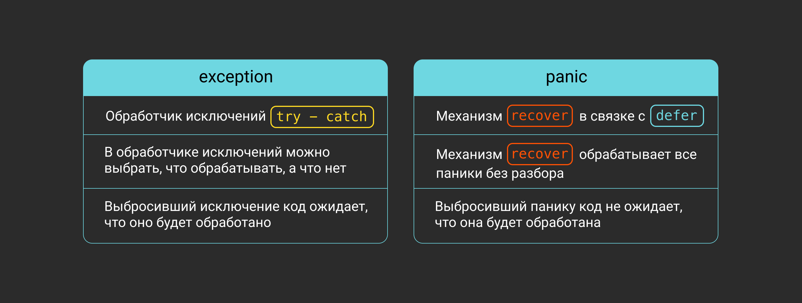
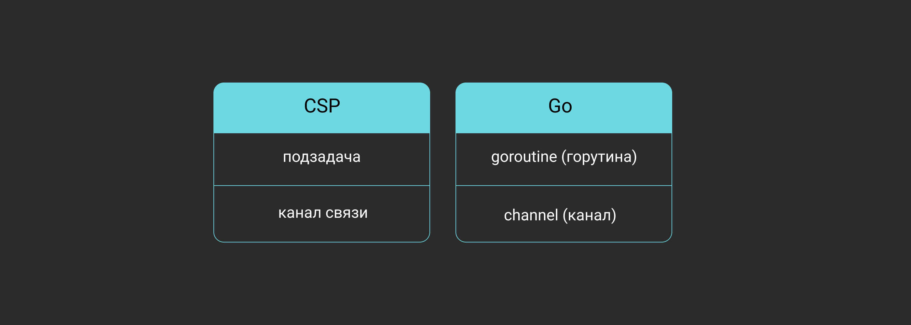

# Особенности языка 

Go — это компилируемый язык программирования со строгой статической типизацией, сборщиком мусора и встроенным менеджером пакетов. Он разработан с упором на многопоточное программирование. 

> В основе идеологии Go лежат минималистичность, простота синтаксиса, высокая скорость сборки и выполнения, удобные абстракции для написания многопоточного кода и эффективная утилизация всех доступных ядер процессора.

# На что похож синтаксис Go?

В Go C-подобный синтаксис с минимумом неочевидных и неявных конструкций. Поощряется читаемость и чистота кода — для этого используется компилятор, который, например, откажется собирать код с неиспользуемыми переменными. Строгая типизация вынуждает выполнять все преобразования (даже алиасов на одни и те же типы) явным образом. 

Также есть подробные гайды по стилизации кода и утилита `fmt`, которая автоматически приводит код к общепринятому виду. Это объясняется тем, что на практике разработчики гораздо чаще читают код, чем пишут, и соглашения по стилизации помогают сэкономить много времени.

Давайте сравним реализации задачи [FizzBuzz](http://www.rosettacode.org/wiki/FizzBuzz) на языках **C** и **Go**.

```c++
#include<stdio.h>
 
/* Реализация FizzBuzz на C */
int main (void)
{
    int i;
    for (i = 1; i <= 100; i++)
    {
        if (!(i % 15))
            printf("FizzBuzz");
        else if (!(i % 3))
            printf("Fizz");
        else if (!(i % 5))
            printf("Buzz");
        else
            printf("%d", i);
 
        printf("\n");
    }
    return 0;
}
```

Сейчас рассмотрим то же самое решение на Go. 
```go
package main

import "fmt"

/* Реализация FizzBuzz на Go */
func main() {
    // переменная i определена и инициализирована с помощью :=
    for i := 1; i <= 100; i++ {
        if i%15 == 0 {
            fmt.Println("FizzBuzz")
        } else if i%3 == 0 {
            fmt.Println("Fizz")
        } else if i%5 == 0 {
            fmt.Println("Buzz")
        } else {
            fmt.Println(i)
        }
    }
}
```

Видно, что код стал «чище», избавился от круглых скобок и символа `;`. Вместе с тем имя главной функции `main`, обозначение комментариев и ключевые слова `for`, `if`, `else` остались такими же. В отличие от C, все переменные в Go сразу имеют начальные значения: например, переменные числовых типов равны 0, а строковые переменные содержат пустую строку. 

> Заметьте, что язык C не накладывает ограничения на использование фигурных скобок, а в языке Go открывающая фигурная скобка должна находиться в той же строке, что и конец объявления управляющих конструкций (`func`, `for`, `if` и т. д.). Более того, даже однострочный блок кода необходимо заключать в фигурные скобки.

# Стандартная библиотека

Несмотря на компактность, стандартная библиотека Go позволяет решать большинство повседневных задач без обращения к сторонним библиотекам. В ней есть: 
- средства для простой и быстрой реализации серверов и клиентов (как TCP/UDP, так и HTTP);
- пакеты для сериализации/десериализации данных в популярные форматы;
- единый интерфейс для потокового ввода-вывода (пакет `io`);
- вспомогательные интерфейсы и функции для обработки и оборачивания ошибок;
- пакет `testing`, предоставляющий инструменты для быстрого и удобного написания unit-тестов и бенчмарков из коробки;
- свой язык шаблонов для кодогенерации и server-side-рендеринга HTML-страниц.

# ООП

Парадигме ООП язык следует лишь частично, оставаясь мультипарадигмальным. Несколько ослабить строгую типизацию призван механизм **interface (интерфейс)**. Он даёт возможность задать ограничения на тип в виде списка методов, которые тот должен реализовывать.

При этом нет необходимости раскрывать и даже явным образом указывать конкретную реализацию. Типизация в этом случае работает по принципу **«утиной» (duck typing)**: «если что-то плавает как утка, крякает как утка и летает как утка, то это, скорее всего, и есть утка». Достаточно реализовать набор методов у типа, чтобы он начал автоматически удовлетворять всем интерфейсам с аналогичными сигнатурами методов:
```go
type Stringer interface {
    String() string
}

type myType int

// myType реализует интерфейс Stringer 
func (t myType) String() string {
    // представление типа myType в виде строки
}
```

Напомним четыре признака объектно-ориентированного программирования:
- **Абстракция** — возможность определить характеристики (свойства и методы) объекта, которые полностью описывают его возможности. В Go нет классов, но структуры с методами служат им неплохой заменой.
- **Инкапсуляция** — возможность скрыть реализацию объекта, предоставив пользователю некую спецификацию (интерфейс) взаимодействия с ним. Go даёт возможность задать область видимости (публичные/приватные) методов структур и позволяет спрятать реализацию.
- **Наследование** — возможность создания производных от родительского объекта, которые будут расширять или изменять свойства и поведение родителя. К сожалению, Go не реализует в полной мере механизм наследования, но есть встраивание — можно создавать типы на основе существующих.
- **Полиморфизм** — возможность одному и тому же фрагменту кода работать с разными типами данных. Это происходит, когда объект может вести себя как другой объект. В Go нет полиморфизма в классическом понимании, однако похожие действия можно реализовать с помощью интерфейсов. Интерфейс определяет список методов, которые должен реализовывать тип, чтобы удовлетворять данному интерфейсу. Это ослабляет строгую типизацию и позволяет передавать в параметрах разные типы данных, поддерживающие один и тот же интерфейс.

Рассмотрим язык Go с точки зрения функционального программирования.
- **Функции высшего порядка** — функции, которые могут в аргументах принимать другие функции и возвращать функции в качестве результата. В Go функции рассматриваются как значения и могут передаваться в другие функции, возвращаясь в виде результата.
- **Замыкания**. Go позволяет определять и использовать функции, которые ссылаются на переменные своей родительской функции.
- **Чистые функции**. В Go можно определять функции, которые зависят только от входящих аргументов и не влияют на глобальное состояние.
- **Рекурсия**. Как и в большинстве языков, в Go можно применять рекурсивные вызовы функций.
- **Ленивые вычисления**. В Go нет поддержки ленивых (отложенных) вычислений.
- **Иммутабельность переменных**. В Go переменные могут изменять своё значение, поэтому иммутабельность (неизменяемость) переменных отсутствует.

Видно, что Go полностью не реализует парадигмы объектно-ориентированного и функционального программирования, но частично это компенсируется похожими возможностями. Поэтому Go считается мультипарадигмальным языком программирования.

# Exceptions

Обработке ошибок в Go нашлось особое место. Во многих других языках ошибки обрабатываются с помощью механизма исключений (exceptions). Если в ходе выполнения функции происходит ошибка, выбрасывается специальное событие, называемое исключением, которое будет либо обработано тут же, в месте вызова функции, либо проброшено вверх по стеку, пока его кто-нибудь не поймает. Для «ловли» этого события нужна конструкция `try — catch` — обработчик исключений:
```python
try:
    foo()
except IndexError:
    # обработка исключений, связанных с выходом за пределы массива
except:
    # обработка всех остальных исключений
```

У этого подхода есть недостаток: выброс исключения происходит неявно для вызывающего функцию кода, поэтому программисту приходится запоминать, какая функция может выбросить исключение. Также существуют uncatchable-исключения — например, относящиеся к выходу программы за пределы доступной ей памяти.

В Go применяется другой подход, который вносит больше ясности в процесс обработки ошибок. Дело в том, что функции в Go могут возвращать больше одного значения. Этим свойством активно пользуются разработчики, используя в качестве последнего возвращаемого значения интерфейс `error`:
```go
package main

import "fmt"

func div(a, b int) (int, error) {
    if b == 0 {
        return 0, fmt.Errorf("делитель равен 0")
    }
    return a / b, nil
}

func main() {
    d, err := div(10, 0)
    if err != nil {
        fmt.Println(err)
    } else {
        fmt.Printf("d = %d", d)
    }
}
```

Тип `error` в Go — встроенный, то есть, чтобы им воспользоваться, не нужно импортировать какой-либо пакет. Наличие отдельного типа позволяет одинаково обрабатывать ошибки, независимо от того, с какой функцией вы работаете — стандартной или сторонней библиотеки. Вы всегда работаете с одним и тем же интерфейсом `error`, а значит, можете сравнить две ошибки или применить к ним функции интроспекции ошибок из библиотеки `errors`.

Так как возможность возникновения ошибки при выполнении функции отражена непосредственно в её сигнатуре (последнее возвращаемое значение имеет тип `error`), пользователь, который обращается к этой функции, вынужден всегда обрабатывать или игнорировать ошибку явно, иначе код не скомпилируется. Добавлять последним (обычно вторым) возвращаемым аргументом ошибку принято везде, где только может произойти ошибка. Чаще всего речь о функциях, в теле которых происходят операции ввода-вывода.

___
Отметьте верные утверждения.

- Язык Go имеет C-подобный синтаксис. ~~Правильно!~~
- В Go полностью реализована парадигма ООП. ~~В Go не поддерживается наследование объектов.~~
- В Go есть исключения. ~~Ошибка должна возвращаться явно и сразу обрабатываться.~~
- Чтобы выполнить Go-программу, нужно скомпилировать её в исполняемый файл. ~~Правильно!~~
- Интерфейсы описывают наборы методов без их конкретной реализации. ~~Правильно! Тип удовлетворяет интерфейсу, если реализует все его методы.~~
___

# Panic

Также в Go существует механизм **паники (panic)**. Если конструкция выше — типичный способ проверить выполнение той или иной функции, то паника выбрасывается только тогда, когда исполняющий код попадает в нестандартную ситуацию, которую невозможно обработать. 

Go даёт возможность перехватывать и обрабатывать панику. Для этого используется конструкция `defer` и встроенная функция `recover`.

`defer` — это ещё одна необычная концепция языка, которая выполняет блоки кода при выходе из функции, например, чтобы закрывать файлы по завершении работы с ними. Можно рассматривать `defer` как замену деструкторов/менеджеров контекста в других языках (`try_with_resources` из Java, `with` из Python). `defer` выполняется даже в случае паники, когда происходит аварийное завершение функций.

```go
func foo() {
    // паникуем
    panic("unexpected!")
}
//...
    // выполняется после срабатывания паники
    defer func() {
        if r := recover(); r != nil {
            // обработка паники, в переменной r будет лежать строка "unexpected"
        }
    }()
    // внутри foo срабатывает паника
    foo()
```

Может показаться, что паника очень похожа на механизм исключений, но это не так. Выбрасывая `exception`, функция обычно ждёт, что исключение будет поймано выше обработчиком исключений. Однако перехват паники происходит не всегда. Если в случае паники, при возвращении управления назад по стеку функции, не будет вызвана `recover()`, то программа завершит свою работу с ошибкой.



Что будет, если в предыдущем примере функция `div` не будет проверять делитель на 0?

```go
func div(a, b int) int {
    return a / b
}
```

Вызов `div(10, 0)` приведёт к завершению работы программы с ошибкой `panic: runtime error: integer divide by zero`. Эта ошибка показывает, что во время работы возникла паника (panic). Если проверка ошибок — типичный способ проверить выполнение той или иной функции, то паника выбрасывается только тогда, когда исполняющий код попадает в нестандартную ситуацию, которую невозможно обработать. 

```go
func main() {
    var a []int

    a[0] = 7 // здесь возникнет паника
}
```

Присваивание в этом примере вызовет панику, так как массив пустой:
```
panic: runtime error: index out of range [0] with length 0

goroutine 1 [running]:
main.main()
    /tmp/sandbox1542797293/prog.go:10 +0x18

Program exited.
```

Аварийную ситуацию можно создать самостоятельно, вызвав функцию `panic` с параметром любого типа. По умолчанию паника будет идти вверх по стеку и завершать все функции, пока не завершит функцию `main`, а вместе с ней и весь процесс. К использованию функции `panic()` следует относиться с осторожностью, о чём напоминает постулат **«Не паниковать»** (Don't panic). Не нужно использовать панику там, где можно просто возвратить ошибку и затем обработать её. 

`recover` — функция, которая позволяет восстановить выполнение программы в случае паники. Если на момент вызова `recover` произошла аварийная ситуация, то `recover` завершает её и возвращает значение ошибки (аргумент при вызове `panic`). Если аварийной ситуации не было, `recover` ничего не делает и возвращает `nil`.

```go
func foo() {
    // паникуем
    panic("unexpected!")
}

func main() {
    // выполняется при завершении main
    defer func() {
        // вызываем recover и сравниваем результат с nil
        if r := recover(); r != nil {
            fmt.Println(r) // выведет "unexpected"
        }
    }()
    foo() // внутри foo срабатывает паника
    fmt.Println("Вы не увидите это сообщение, так как в foo возникла паника")
}
```

___
Отметьте верные утверждения.

- Если паники не было, то recover() возвратит nil. ~~Правильно!~~
- В Go есть конструкция try. ~~В Go нет конструкции try.~~
- Конструкция defer выполняется только при возникновении паники. ~~defer выполняется при любом завершении функции. В том числе при панике.~~
- Ошибки в Go имеют тип error. ~~Правильно!~~
___

# Имеются ли инструменты для тестирования?

Выше упоминалась библиотека `testing`. В Go принято располагать файлы с unit-тестами непосредственно в пакете, функции которого вы тестируете. Например, если код, который вы хотите покрыть тестами, располагается в файле `foo.go`, для тестов нужно создать файл `foo_test.go`:
```
foo/ # пакет foo
    foo.go # файл с тестируемым кодом
    foo_test.go # файл с тестами
```

Содержимое файла `foo.go`:
```go
package foo

func Foo() string {
    return "bar"
}
```

В файле `foo_test.go` реализуем функции определённой сигнатуры:
```go
// файл foo_test.go
package foo

import (
    "testing"
)

func TestFooFunc(t *testing.T) {
    expectedFooResult := "bar"
    if actualFooResult := Foo(); actualFooResult != expectedFooResult {
        t.Errorf("expected %s; got: %s", expectedFooResult, actualFooResult)
    }
}
```

Выполнить их можно, просто вызвав команду `go test`:
```bash
PASS
ok      github.com/Yandex-Practicum/go-freetrack/00_intro/testing/foo   0.240s
```

# Какие элементы многопоточности есть в Go?

Как было сказано ранее, многопоточность в Go реализована согласно модели CSP (Communicating Sequential Processes). При таком подходе программа представляет собой множество одновременно работающих подзадач, которые общаются с помощью каналов связи. Задачами в Go выступают горутины (goroutine), связь организована через каналы (channel). 

Изначально в Go была реализована кооперативная многозадачность: пока код в горутине сам не передаст управление (например, попытавшись выполнить блокирующую операцию), забрать управление у этой горутины невозможно. С версии 1.14 планировщик стал в том числе вытесняющим. Вытесняющий планировщик самостоятельно распределяет процессорное время между горутинами.

**Горутина** — это легковесный поток, который занимает гораздо меньше памяти, чем поток ОС. Среда выполнения Go может выполнять несколько горутин на одном потоке операционной системы и быстро переключаться с выполнения одной горутины на другую благодаря их малому размеру. Вытесняющий планировщик старается равномерно распределять процессорное время между горутинами. 

**Каналы** — это второй ключевой элемент в многопоточности на Go. Каналы не только дают возможность потокам обмениваться данными, но и служат для синхронизации их работы. Одна горутина может записать данные в канал, а другая горутина прочитать их. Кроме этого, стандартная библиотека имеет дополнительные примитивы синхронизации потоков.



Горутины, каналы и примитивы синхронизации делают язык Go чрезвычайно удобным инструментом для создания многопоточных программ и различных сервисов.

___
Отметьте верные утверждения.

- Горутина — это поток операционной системы. ~~Горутина — это поток среды выполнения Go.~~
- Каналы служат для обмена данными между потоками. ~~Правильно!~~
- Горутины без каналов работать не будут. ~~Каналы — только один из инструментов для управления горутинами.~~
___
Отметьте верные утверждения.

- В Go имеются структуры и классы. ~~В Go нет понятия класса.~~
- Исходные коды всех функций стандартной библиотеки находятся в открытом доступе. ~~Правильно! Это проект с открытыми исходными кодами.~~
- Паника сразу прекращает выполнение программы. ~~При панике происходит последовательное прекращение работы функций по стеку с выполнением `defer`.~~
- Горутины — это легковесные потоки, которые могут обмениваться данными через каналы. ~~Правильно!~~
- Функция `recover` исправляет аварийную ситуацию (панику). ~~Правильно!~~
___
