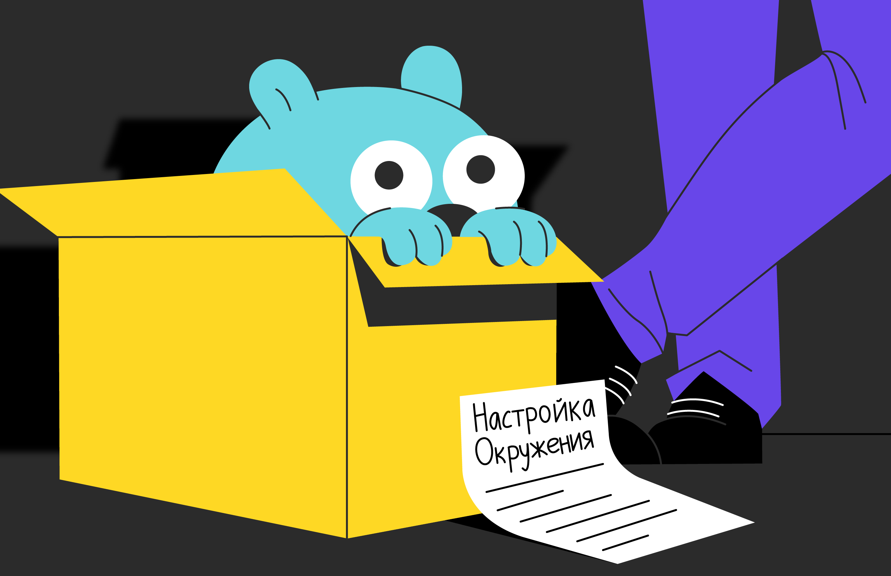
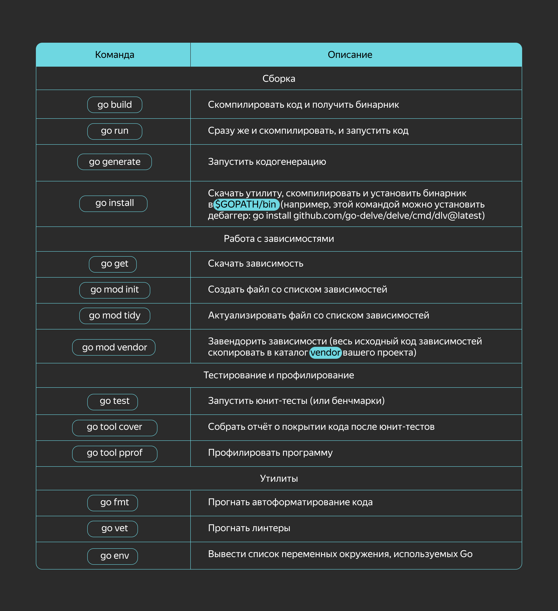

# Настройка окружения

Переходим к практике. Хотелось бы по традиции начать с `"Hello, world!"`, но сперва настроим рабочую среду.



# Установка компилятора

Установочные файлы под разные ОС можно найти на [официальном сайте Go](https://go.dev/doc/install).

Инструкция по установке:
- **Windows**: запустить `.msi`-файл, он установит Go в `Program Files`.
- **macOS**: запустить `.pkg`-файл, он установит Go в `/usr/local/go`.
- **Linux**: распаковать `.tar.gz`-архив и поместить его содержимое в `/usr/local/go`. В архиве уже лежат статически скомпилированные бинарники, поэтому всё готово к использованию. Разве что только добавить в `$PATH` директорию `/usr/local/go/bin`.

После установки в системе появится команда `go`, с помощью которой можно и скомпилировать, и протестировать, и запустить программу. Так выглядит разбивка популярных команд:



В рамках курса, когда дойдёте до подробного изучения каждой темы, заметите подсвеченные нужные команды. Например, в этом спринте при работе с зависимостями или юнит-тестами вам пригодятся команды `go build`, `go run` и `go fmt`.

Справку по любой из команд можно вызвать так: `go help <команда>`. Например: `go help build`.

> Задаётесь вопросом, что такое `$GOPATH`? В ней Go хранит установленные бинарники, скачанные зависимости и свои служебные файлы.

По умолчанию используется каталог `go` в вашей домашней директории. Можно так и оставить — но если вы захотите задать каталог явным образом, то лучше вписать путь в переменную окружения `$GOPATH`.

Структура этого каталога такая:
```
$GOPATH
├──bin # здесь лежат бинарники программ, устанавливаемых командой 'go install'
|    └──foo # исполняемый файл программы foo
├─src
|   └──github.com/user
|       ├──foo
|       |   └──main.go # исходный код программы foo
|       └──bar
|           └──bar.go # исходный код библиотеки bar
└──pkg # тут Go хранит свои служебные файлы
```

# Редакторы кода

Предлагаем установить IDE или подключить плагин к вашему любимому редактору:
- Если хотите IDE — установите [JetBrains GoLand](https://www.jetbrains.com/go/). Но бесплатная триальная версия даётся только на месяц.
- Для редактора Visual Studio Code — [плагин Go](https://code.visualstudio.com/docs/languages/go).
- Для редактора Sublime Text — [плагин LSP](https://packagecontrol.io/packages/LSP) и [плагин LSP-gopls](https://packagecontrol.io/packages/LSP-gopls).
- Для редактора Vim — [плагин vim-go](https://github.com/fatih/vim-go).

# Hello, world!

Напишите следующий код в редакторе и сохраните его в файл `hello.go`:
```go 
package main

import "fmt"

func main() {
    fmt.Println("Hello, world!")
}
```

Теперь попробуем запустить: `go run hello.go`.

Если всё запустилось, то теперь вы в клубе Go!

Кстати, на сайте Go есть онлайн-редактор и компилятор кода, который может пригодиться, когда нужно быстро проверить небольшие части кода или гипотезы относительно работы языка. Называется он [Go Playground](https://go.dev/play/).
