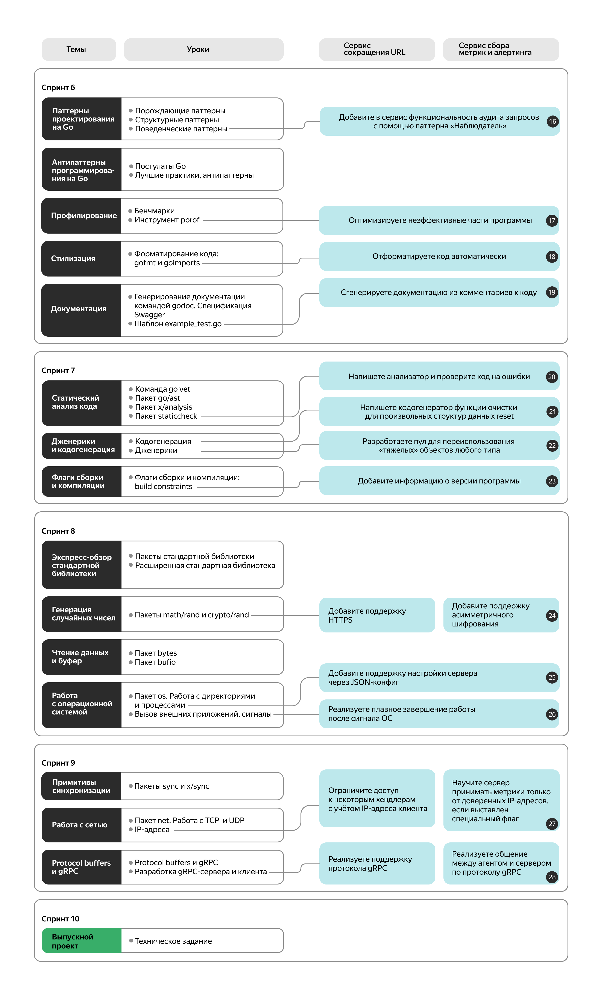
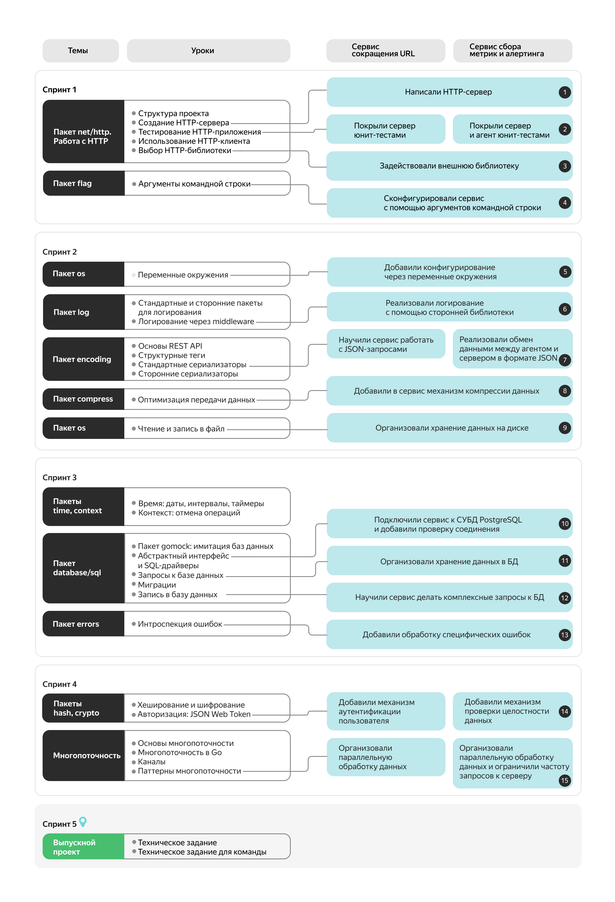
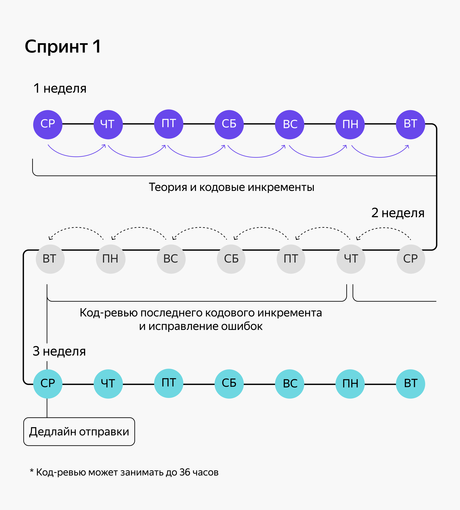
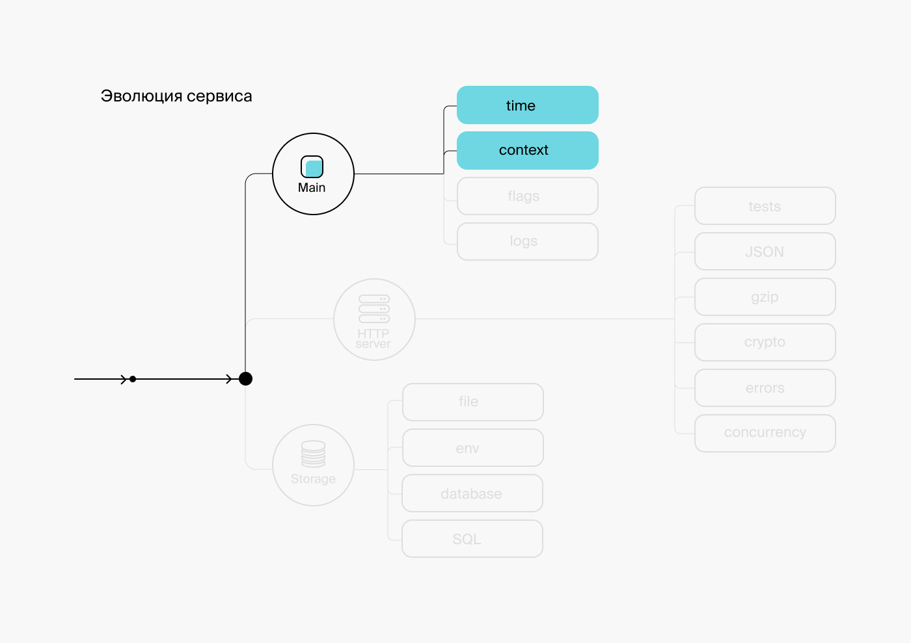

# Что дальше?

Поздравляем! Вы закончили курс по основам языка Go. 

Навыки, которые вы получили здесь, позволят вам комфортно перейти на следующую ступень — курс [«Продвинутый Go-разработчик»](https://practicum.yandex.ru/go-advanced/?from=go-basics).

«Продвинутый Go-разработчик» — это шестимесячный курс, который научит выполнять задачи Go-разработчиков уровня Middle.

**Вы научитесь:**
- проектировать и писать самостоятельно микросервисы;
- реализовывать архитектурные решения и паттерны проектирования на Go;
- писать продвинутые тесты;
- проектировать REST API;
- участвовать в проектировании архитектурных решений для новых сервисов на Go;
- перекладывать продуктовые задачи в код на Go;
- внедрять высокопроизводительное логирование;
- оптимизировать код на Go.

# Учебные проекты

За время обучения вам предстоит написать один большой сервис. Но не сразу, а по частям: каждое новое техническое задание будет уточнять, усложнять или модифицировать уже написанный вами код. Всего таких заданий будет 28.

Мы даём на выбор два практических трека:
- на одном треке вашим проектом будет сервис сокращения URL;
- на другом вы напишете сервис сбора метрик и алертинга.

На треке **«Сервис сокращения URL»** нужно будет написать только сервер. А на треке **«Сервис сбора метрик и алертинга»** придётся реализовать и сервер, и агент.

Вы сможете выбрать подходящий трек в начале обучения — непосредственно перед тем, как делать первое задание.

# Выпускные проекты

На курсе их два: в середине и в конце. Каждый выпускной проект длится месяц. В каждом вы самостоятельно, с нуля напишете сервис, сравнимый по сложности с тем, что вы делали в рамках практического трека. Мы выдадим вам детальное техническое задание, у вас будет одно промежуточное код-ревью с ментором и финальное ревью. После этого вам предстоит защитить проект перед вашим ментором и его коллегами.

**Содержание первого проекта**

Вам предстоит написать HTTP API накопительной системы лояльности для маркетплейса. Суть системы — начислять пользователям баллы за совершённые покупки.

Выпускной проект позволит вам закрепить знания и навыки, которые вы получили во время обучения. Вы будете работать с шаблоном кода для маркетплейса.

Вот что вам нужно будет сделать:
- написать сводное HTTP API, представленное набором хендлеров;
- подключить хранилище данных и конфигурировать его на своё усмотрение;
- подключить базу данных (PostgreSQL) и конфигурировать её;
- написать клиент, который может поддерживать HTTP-запросы и ответы со сжатием данных;
- настроить систему регистрации и аутентификации пользователя в системе;
- создать возможность для пользователя проводить операции со счётом, например, списывать и начислять баллы, просматривать баланс.

# Как проходит обучение?

## Главное:
- Вы будете учиться **синхронно с группой 15-20 человек**.
- Каждые 2 недели вам будут открываться новые **уроки в текстовом формате**.
- Есть **дедлайны** сдачи практических работ.
- Практические работы вы выполняете **в своём редакторе кода**.
- У вас будет **наставник**. Он поможет вам на образовательном пути и ответит на вопросы.
- Вам предстоит сдать на проверку 10 практических заданий и получить обратную связь от эксперта.
- Мы выдадим **диплом о профессиональной переподготовке**, если у вас есть среднее профессиональное или высшее образование. Если нет - отправим сертификат и справку об обучении.

# Организация обучения

Записавшись на курс, вы попадёте ** **, сможете обмениваться опытом и помогать другу другу делать задания. 

Программа курса «Продвинутый Go-разработчик» разбита на спринты.

**Спринт** — это временной отрезок в две недели, за которые нужно пройти 5-10 уроков, выполнить задания и сдать кодовые инкременты на ревью. Доступ к новому спринту открывается по средам до 12:00 по московскому времени.

В спринте есть **дедлайн отправки** инкремента ментору на код-ревью и **дедлайн приёмки**, когда домашняя работа должна быть полностью проверена и принята.

**Дедлайн отправки** наступает на 14-й день после начала спринта. Если вы не успеете отправить кодовый инкремент на проверку к этому времени, мы напишем вам, чтобы:
- напомнить об отклонении от графика;
- узнать, что случилось и какая нужна помощь;
- вместе составить план действий.

**Дедлайн приёмки** наступает на 24-й день после начала спринта. К этому времени нужно обязательно отправить инкремент на ревью и получить зачёт.

**Рекомендуем вам заранее составить график** и уделять учёбе пару часов в день. Например, читать теорию и выполнять задания на первой неделе и в начале следующей, до вторника включительно. Остаток второй недели посвятить доработке кодовых инкрементов спринта, получив обратную связь от ревьюера. Не откладывайте выполнение заданий на последний день перед дедлайном.

Чтобы вы смогли привыкнуть к темпу обучения, составить расписание и при этом соблюсти work-life balance, мы решили дать вам чуть больше времени на старте — **первый спринт будет длиться три недели вместо двух**.

Если вы не успеете сдать работу к дедлайну приёмки, можете оставить заявку на **переход** в другую учебную группу.  Вы сможете решить все препятствующие обучению вопросы, отдохнуть и вернуться в бой. После перевода вы попадёте в следующую когорту и продолжите обучение там, где остановились.

## Время на обучение

Вам потребуется в среднем 10-15 часов в неделю на протяжении 6 месяцев.
- А что, если у меня не получится совмещать учёбу с работой? Или непредвиденные обстоятельства помешают сдавать домашние задания в срок?
- Мы об этом позаботились. Если вам не подойдёт интенсивный формат обучения, вы можете выбрать другой вариант и продолжить учиться без дедлайнов.

# Другой формат: без спринтов и дедлайнов

При формате без дедлайнов студент сам устанавливает границы спринтов и составляет расписание, исходя из своей нагрузки. Обратите внимание, что отсутствие дедлайнов — единственное отличие. Вы по-прежнему сможете задавать вопросы ментору и сдавать ему домашние работы, встречаться с ним один на один в каждом спринте. Также у вас будет возможность посещать вебинары и другие мероприятия, доступные студентам при обучении с дедлайнами.

В случае перехода на формат без дедлайнов вы также получите документ об окончании курса, но с одним условием. Вы должны сдать итоговый проект на проверку не позднее, чем через год после начала обучения. Это единственный дедлайн.

Чтобы перейти на другой формат, достаточно написать куратору, который поможет в переводе. Он добавит вас в отдельный канал, где вы будете общаться с другими студентами, обучающимися в своём темпе.

# Карта программы

Вы будете двигаться от простого к сложному. В конце каждой темы вы увидите карту, которая покажет ваш прогресс: сколько уже прошли и сколько ещё осталось.

- А если мне не понравится, я смогу вернуть деньги?

Короткий ответ — да, причём в любой момент. Правда, если обучение в потоке уже началось, то прошедшие дни придётся оплатить, но остальное вернём.

# Скидка 15%

Благодарим вас за доверие и время, которое вы посвятили изучению основ языка Go!

Для продолжения обучения на «Продвинутом Go-разработчике» мы дарим вам промокод на скидку 10%: **GODEVPL15**. 

See you down the road!

