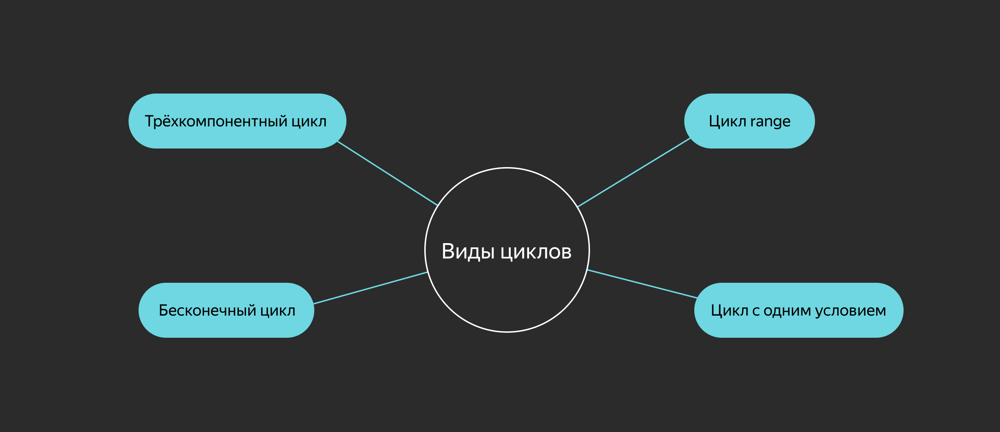

# Циклы 

Опуская области применения циклов, рассмотрим их формы в языке Go. В программировании для циклов используют конструкции `for`, `while`, `do — while` и другие. Создатели Go придерживаются правила «чем проще, тем лучше», поэтому для всех видов цикла в языке есть только одно ключевое слово — `for`.



# Бесконечный цикл 

```go
for {
    // код, выполняемый внутри бесконечного цикла
}
```

Такой цикл чаще всего встречается в worker-паттерне: фрагмент кода должен выполняться до завершения процесса или потока, пока не будет прерван внешним событием.

Использовать фигурные скобки `{ }` для обозначения области видимости цикла обязательно.

# Трёхкомпонентный цикл

```go
// создаём переменную
v := 0
// 
for i := 1; i < 10; i++ {
    // наращиваем переменную
    v++
}
// выводим результат на экран
fmt.Println(v)
```

Классическая форма цикла состоит из трёх компонентов:
- `i := 1` — инициализация (pre-действие): выполняется единожды при входе в scope цикла;
- `i < 10` — основное условие: пока условие `true`, итерации будут продолжаться;
- `i++` — post-действие: выполняется по завершении каждой итерации цикла.

Заполнять каждую компоненту необязательно — можно опускать.

Есть ещё два варианта бесконечного цикла, но в форме трёх компонент:
```go
for ;; {}
for ; true; {}
```

Компоненты цикла могут принимать более комплексный вид:
```go
for a, b := 5, 10; a < 10 && b < 20; a, b = a + 1, b + 2 { 
    // do stuff
}
```

# Цикл с одним условием

В цикле `for` можно указывать только одно условие. В этом случае необходимая начальная инициализация должна происходить перед циклом, а действия, влияющие на условие, — выполняться внутри цикла.

```go
package main

import "fmt"

func main() {
    // начальная инициализация
    i := 0
    for i < 5 {
        // выводим результат на экран
        fmt.Println(i)
        // наращиваем переменную
        i++
    }
}
```

Такой цикл похож на трёхкомпонентный, но здесь оставлено только основное условие. В некоторых языках такие циклы описываются ключевым словом `while`.

# Цикл range

```go
// создаём массив
array := [3]int{1, 2, 3}
// итерируемся
for arrayIndex, arrayValue := range array {
    fmt.Printf("array[%d]: %d\n", arrayIndex, arrayValue)
}
```

Цикл `range` используется для комплексных типов — слайса и мапы (map). Подробнее об этом цикле расскажем в следующей теме, посвящённой композитным типам.

# Ключевые слова break и continue

Текущую итерацию цикла можно прервать ключевыми словами:
- `break` — выход из цикла;
- `continue` — переход к следующей итерации цикла (вызов post-действия, если оно задано).

Для примера посчитаем сумму всех чётных чисел от 0 до заданного предела:
```go
sum, limit := 0, 100
for i := 0; true; i++ {
    if i % 2 != 0 {
        continue // переход к следующему числу, так как i — нечётное
    }
    
    if sum + i > limit {
        break // выход из цикла, так как сумма превысит заданный предел
    }
    
    sum += i
}
fmt.Println(sum)
```

Для примера посчитаем сумму всех чётных чисел от 0 до заданного предела:
```go
sum, limit := 0, 100
for i := 0; true; i++ {
    if i % 2 != 0 {
        continue // переход к следующему числу, так как i — нечётное
    }
    
    if sum + i > limit {
        break // выход из цикла, так как сумма превысит заданный предел
    }
    
    sum += i
}
fmt.Println(sum)
```

Ключевые слова `break` и `continue` относятся к ближайшему по области видимости циклу.

___
Отметьте верное утверждение. 

- В Go отсутствует ключевое слово `while`, но можно реализовать этот цикл самостоятельно ~~Верно!~~
- Ключевое слово `break` прерывает текущую итерацию цикла и вызывает следующую ~~Это делает ключевое слово `continue`.~~
- `for {...}` запускает бесконечный цикл в фигурных скобках. ~~`for` без дополнительных аргументов запустит бесконечный цикл.~~
___

# Метки

В языке Go есть метки (**labels**), которые позволяют перемещаться к разным частям кода. 

Метку можно указать для операторов:
- `break`;
- `continue`;
- `goto` (безусловный оператор перехода, позволяет перейти в любое место кода).

Приведём пример для `break`:
```go
outerLoopLabel:
    for i := 0; i < 5; i++ {
        for j := 0; j < 5; j++ {
            fmt.Printf("[%d, %d]\n", i, j)
            break outerLoopLabel
        }
    }
    fmt.Println("End")
```
```
[0, 0]
End
```

Здесь `break outerLoopLabel` прерывает выполнение внешнего цикла.

А вот пример для `continue`:
```go
outerLoopLabel:
    for i := 0; i < 5; i++ {
        for j := 0; j < 5; j++ {
            fmt.Printf("[%d, %d]\n", i, j)
            continue outerLoopLabel
        }
    }
    fmt.Println("End")
```
```
[0, 0]
[1, 0]
[2, 0]
[3, 0]
[4, 0]
End
```

Здесь `continue outerLoopLabel` вызывает переход к следующей итерации внешнего цикла. Если заменить `continue outerLoopLabel` на `break`, результат будет аналогичный.

Ключевые слова `break` и `continue` без указания метки относятся к текущей (ближайшей) области видимости кода. 

Посмотрите, как можно вывести чётные числа в диапазоне [0:20] с указанием десятка.
```go
group := 0
for i := 0; i < 20; i++ {
    switch {
    case i % 2 == 0:
        if i % 10 == 0 {
            group++
            break // break относится к ближайшему switch
        }
        fmt.Printf("%02d: %d\n", group, i)
    default:
    }
}
```
```
01: 2
01: 4
01: 6
01: 8
02: 12
02: 14
02: 16
02: 18
```

Использование меток в Go, как и во многих других языках, — тема вечных споров. Считается, что метки делают код неочевидным, превращают в так называемый спагетти-код 😄

___
Перед вами классическое задание для собеседований на любом языке программирования — FizzBuzz.

Напишите программу, которая выводит на экран числа от 1 до 100. При этом вместо чисел, кратных трём, программа должна выводить слово Fizz, а вместо кратных пяти — Buzz. Если число кратно и трём, и пяти, программа должна выводить слово FizzBuzz.

Когда выполните задание, нажмите «Готово» и сравните свой вариант с предлагаемым решением.

```go
package main

import "fmt"

func main() {
    for i := 1; i <= 100; i++ {
        found := false

        // проверяем, что кратно 3, и выводим Fizz
        if i%3 == 0 {
            fmt.Printf("Fizz")
            found = true
        }
        // проверяем, что кратно 5, и выводим Buzz
        if i%5 == 0 {
            fmt.Printf("Buzz")
            found = true
        }
        // если число кратно 3 и 5, выводим FizzBuzz

        if !found {
            // если не выполнилось ни одно из условий, выводим число
            fmt.Println(i)
            continue
        }

        fmt.Println()
    }
}
```
