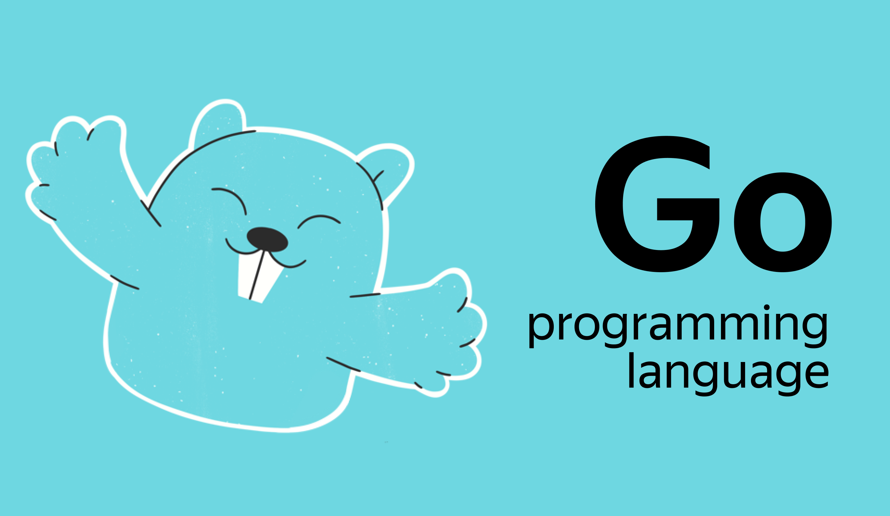

# Добро пожаловать!

Привет! Добро пожаловать в Практикум!

Здесь начинается курс, разработанный для всех желающих научиться писать код на языке Go. 

*Изображение Go gopher, используемое в настоящем курсе, является модификацией изображения маскота, созданного Renee French и лицензируемого на условиях CC BY 3.0.*

Наверняка у вас много вопросов о курсе и профессии — ответы на некоторые из них вы найдёте дальше.

Бесплатная часть курса разбита на две части: 

1. Введение

В этой части речь пойдёт о том, чем курс будет полезен и какие перспективы открываются после его прохождения. Вы узнаете:
- что такое бэкенд- и фронтенд-разработка;
- чем занимаются Go-разработчики;
- почему Go — это перспективно;
- как проходит обучение в Практикуме;
- что ждёт вас в платной части программы;
- кто будет сопровождать вас во время обучения;
- реально ли найти работу после курса;
- какие навыки нужны Go-разработчику для успешного трудоустройства;
- и вообще — что нужно, чтобы начать.

2. Основы Go

Эта часть даст вам первое впечатление о том, как выглядит учебный процесс «на минималках». Здесь вы:
- самостоятельно попробуете написать первую программу на Go;
- научитесь выводить данные на экран;
- узнаете что такое переменные и типы данных.

Если в конце бесплатной части вы поймёте, что профессия Go-разработчика вам подходит, вы можете продолжить обучение на основном курсе.

> **Чем основной курс отличается от вводной части?**
В основной части вам будет доступно больше практики, работа над проектами с чёткими дедлайнами, а ещё сопровождение от кураторов и наставников.

Но сейчас обо всём по порядку.

# Для кого курс

Мы сделали этот курс, чтобы помочь людям без опыта в программировании начать свой путь в IT. Обучение начинается с основ программирования — переменные, циклы, ветвления и другие базовые понятия. 

Если вы планируете сменить работу и научиться программировать, и при этом **у вас нет опыта в разработке**, то курс «Go-разработчик с нуля» именно для вас! 

Если у вас уже есть опыт в программировании и вы пишете на другом языке, советуем обратить внимание на курс «Продвинутый Go-разработчик» — он предназначен **для студентов с опытом**.

Чтобы комфортно обучаться на «Продвинутом Go-разработчике», вам нужно понимать основы backend-разработки и знать синтаксис Go. Не уверены, что справитесь? Советуем пройти бесплатный входной тест внутри курса; он поможет понять, хватит ли вам навыков. 

Если опыт backend-разработки уже есть, **но вы не знаете синтаксиса Go**, советуем присмотреться к курсу «[Основы Go](https://practicum.yandex.ru/go-basics/)». Этот курс позволяет разработчикам с опытом быстро перекатиться в Go-разработку и освоить базу, необходимую для обучения на «Продвинутом Go-разработчике». 
