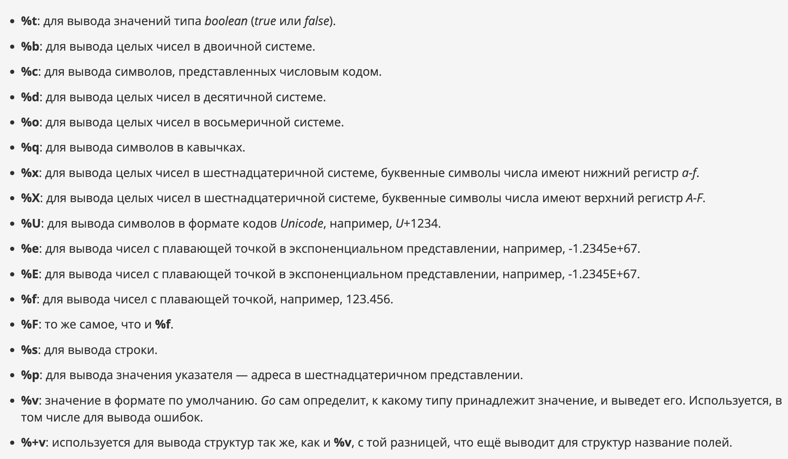
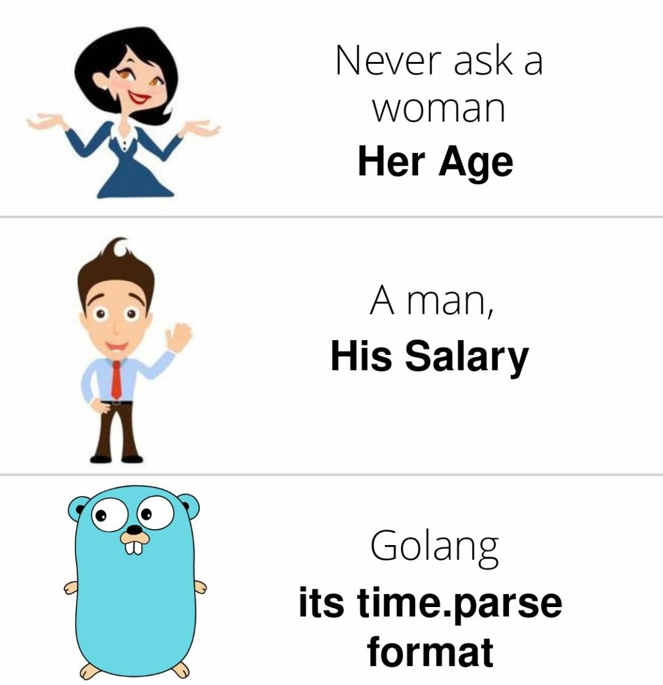
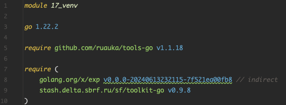
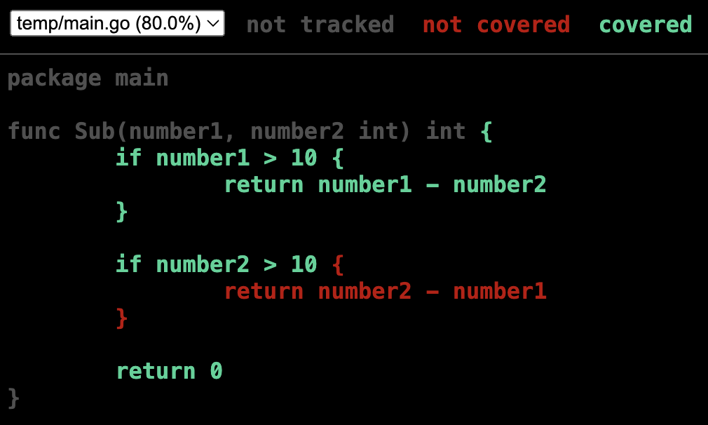
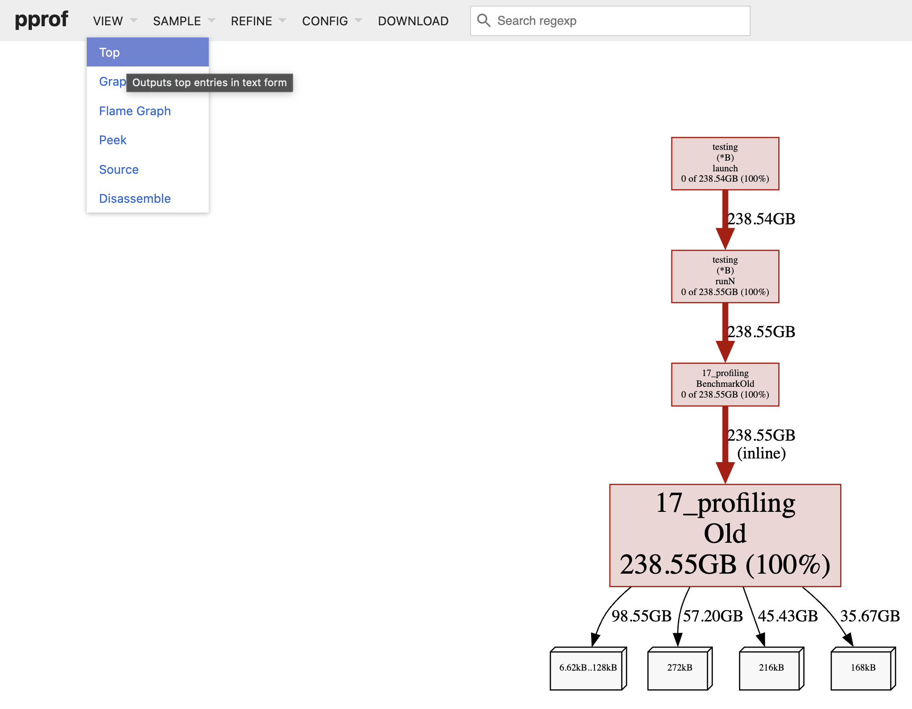
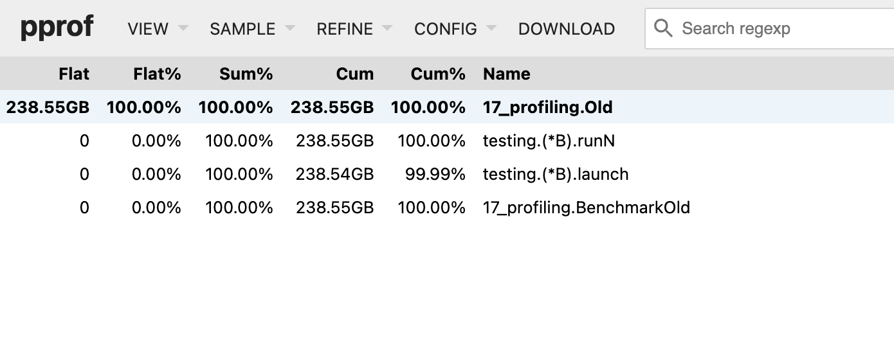
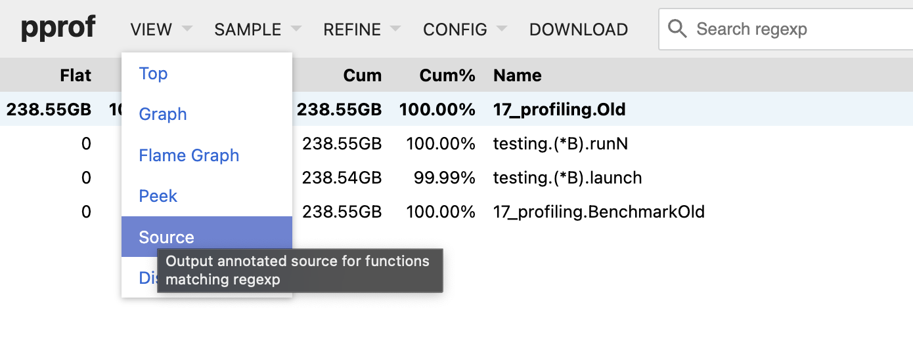
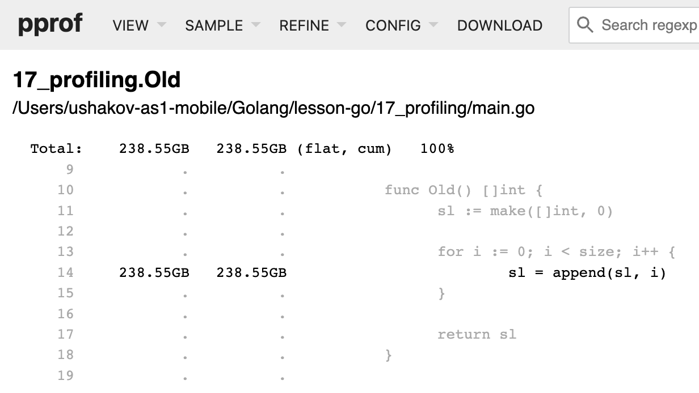
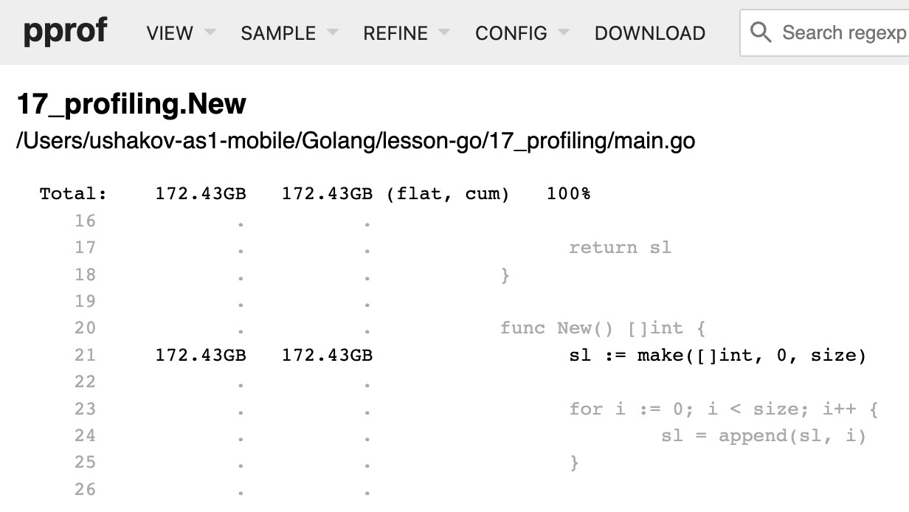
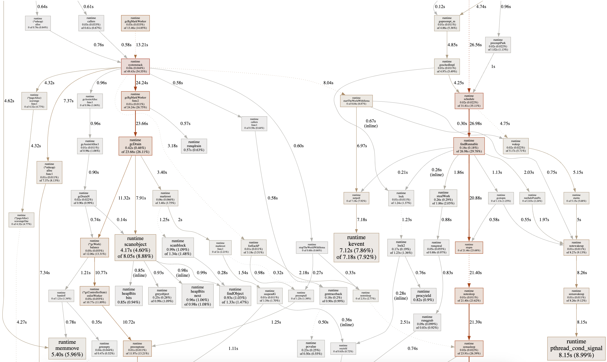

# Туториал по языку программирования Go


# Инициализация проекта

Проект должен иметь:
- Файл `go.mod` = хранит версии зависимостей
- Файл `main.go`: = название проекта. **Название `main` обязательно, если это основной проект!** В остальных случаях название не регламентируется.
    - `package main` = название пакета. **Название `main` обязательно, если это основной пакет!** В остальных случаях пакет называется как и директория, в которой он находится.
    - `func main()` - функция, с которой стартует любой скрипт

Файл `go.mod` cоздается командой:

```bash
go mod init project_name
```

# Компиляция и запуск

Если Golang установлен из `SberUserSoft`, то требуется прописать
```bash
export PATH="$PATH:/usr/local/go/bin"
```

Команда компилирует скрипт, запускает и его и удаляет скомпилированный файл сразу после исполнения:

```bash
go run main.go
```

Компиляция скрипта в исполняемый файл:

```bash
go build main.go
```

Запуск файла:

```bash
./main
```

Компиляция в исполняемый файл с конкретным названием:

```bash
go build -o compiled main.go
```

Запуск файла:

```bash
./compiled
```

# Базовые типы данных


Комментарии в Go:
- Однострочные: `// oneline comment`
- Многострочные: 
```go
/*
manyline 
comment
*/
```

# Переменные

Все переменные в Go должны подчиняться **CamelCase**, ~~snake_case~~ недопустим!

Неиспользуемые переменные недопустимы!

```go
// Наименование пакета.
// В любом проекте обзательно присутствие файла с "package main" и func main()
package main

// Импорты пакетов.
// Служебные методы импортируются из пакетов
import (
    "fmt"
    "reflect"
)

// Объявление глобальной переменной. Единственный способ
var temp = "temp"

// Объявление глобальных констант.
const (
    minRate = 1
    maxRate = 100
)

// Обязательная функция, вход и старт скрипта, зарезирвированное слово.
func main() {
    fmt.Println("hello world")

    // Вариант 1
    a := 10
    fmt.Println(a)
    fmt.Println(reflect.TypeOf(a)) // проверка типа

    // Вариант 2
    var b = 10
    fmt.Println(b)

    // Вариант 3
    var c int // дефолтное значение 0
    fmt.Println(c)
    c = 10
    fmt.Println(c)

    // Нулевые (дефолтные) значения переменных по типам.
    var a1 int  // 0
    var b1 float64  // 0.0
    var c1 string  // ""
    var d1 bool  // false
    var m map[string]int  // nil

    fmt.Println(a1, b1, c1, d1)

    // Множественное присвоение. Вариант 1. Предпочтительный.
    var (
        a2 int     = 10
        b2 string  = "10"
        c2 float64 = 10.0
        d2 bool    = true
        // остальные типы обсудим позже
    )
    fmt.Println(a2, b2, c2, d2)

    // Множественное присвоение. Вариант 2.
    a3, b3, c3, d3 := 10, "10", 10.0, true
    fmt.Println(a3, b3, c3, d3)

    // Объявление одной константы.
    const myConst = 100
    fmt.Println(myConst)

    // Множественное объявление констант.
    const (
        minLimit int = 100
        maxLimit     = 1000.5
    )
    fmt.Println(minLimit, maxLimit)

    // Печать глобальной переменной.
    fmt.Println(temp)

    // Печать глобальных констант.
    fmt.Println(minRate, maxRate)
}
```

# Область видимости


# Сигнатура


# Функции

Именованных аргументов нет!

# Функция без аргументов

```go
package main

import "fmt"

func myFunc() {
    a := 10
    fmt.Println(a)
}

func main() {
    myFunc()
}
```

# Функция с аргументами одинакового типа

```go
package main

import "fmt"

func myFunc(arg1, arg2 int) int {
    return arg1 + arg2
}

func main() {
    result := myFunc(1, 2)
    fmt.Println(result)
}
```

# Функция с аргументами разного типа

```go
package main

import "fmt"

func myFunc(arg1 int, arg2 float64) int {
    return arg1 + int(arg2)  // со строками такой перевод не работает!!!
}

func main() {
    result := myFunc(1, 2)
    fmt.Println(result)
}
```

# Функция с несколькими возвращаемыми значениями

```go
package main

import "fmt"

func myFunc(arg1, arg2 int) (int, bool) {
    if arg1 > 0 {
        return arg1 + arg2, true
    }
    
    return 0, false
}

func main() {
    result, flag := myFunc(1, 2)
    fmt.Println(result, flag)
}
```

# Функция с предварительно известными возвращаемыми переменными

```go
package main

import "fmt"

func myFunc(arg1, arg2 int) (sum int, isPositive bool) {
    sum = arg1 + arg2
    isPositive = sum > 0
    
    return // указывать ничего не нужно: автоматом выйдут sum и isPositive
}

func main() {
    result, flag := myFunc(1, 2)
    fmt.Println(result, flag)
}
```

# Неограниченное количество аргументов

```go
package main

import (
    "fmt"
    "reflect"
)

func myFunc(args ...int) int {
    fmt.Println(args)
    fmt.Println(reflect.TypeOf(args))
    
    var sum int
    
    for _, val := range args {
        sum += val
    }
    
    return sum
}

func main() {
    result := myFunc(1, 2)
    fmt.Println(result)
}
```

# Безымянная функция

```go
package main

import (
    "fmt"
)

// lambda-функция. Вариант 1
var sum = func(foo, bar int) int {
    return foo + bar
}

func main() {
    // lambda-функция. Вариант 1
    result := sum(10, 20)
    fmt.Println(result)
    
    // lambda-функция. Вариант 2
    var lambdaRes int
    
    func(foo, bar int) {
        lambdaRes = foo + bar
    }(10, 20)
    
    fmt.Println("Res: ", lambdaRes)
}
```

# Функция, как аргумент другой функции

```go
package main

import (
    "fmt"
)

func squareOfSums(foo, bar int, sumFunc func(a, b int) int) int {
    return sumFunc(foo, bar) * sumFunc(foo, bar) // 30 * 30 = 900
}

func main() {
    sum := func(foo, bar int) int {
        return foo + bar
    }
    
    fmt.Println(squareOfSums(10, 20, sum))
}
```

# Замыкание = принятие функции и сохранение своего состояния

```go
package main

import (
    "fmt"
)

func closure() func() int {
    counter := 0
    return func() int {
        counter++
        return counter
    }
}

func main() {
    count := closure()  // 0
    
    fmt.Println(count())  // 1
    fmt.Println(count())  // 2
    fmt.Println(count())  // 3
    fmt.Println(count())  // 4
    fmt.Println(count())  // 5
}
```

# Операторы сравнения
```go
package main

import (
    "fmt"
)

func main() {
    var (
        foo = 10
        bar = 20
    )
    
    fmt.Println(foo == bar)
    fmt.Println(foo != bar)
    fmt.Println(foo > bar)
    fmt.Println(foo < bar)
    fmt.Println(foo >= bar)
    fmt.Println(foo <= bar)
    
    fmt.Println(foo > 10 || bar < 20)  // or
    fmt.Println(foo > 10 && bar < 20)  // and
}
```

# Ветвление
```go
package main

import (
    "fmt"
)

func main() {
    num := 10
    
    if num%2 == 0 {
        fmt.Println("divisible by 2")
    } else if num%3 == 0 {  // elif
        fmt.Println("divisible by 3")
    } else if num%5 == 0 {  // elif
        fmt.Println("divisible by 5")
    } else {
        fmt.Println("else branch")
    }
}
```

# Область видимости

Переменная, **объявленная выше**, видна **во вложенных ниже** фигурных скобках.

```go
package main

import (
	"fmt"
)

func main() {
    if true {
        // переменная number объявлена в блоке 'if'
        number := 5
        if number == 5 {
            // переменная видна внутри блока
            fmt.Println(number)
        }
    }
    // Переменная выделена красным цветом, поскольку переменная number существует только в блоке условия.
    // За пределами блока переменная не существует
    // раскомментируйте ниже
    //fmt.Println(number)
}
```

# Switch

## Switch со значением

```go
package main

import (
    "fmt"
)

func main() {
    num := 2
    
	// if. else if. else.
    if num == 0 {
        fmt.Println("0")
    } else if num == 1 {
        fmt.Println("One")
    } else if num == 2 {
        fmt.Println("Two")
    } else {
        fmt.Println("Unknown Number")
    }
	
	// switch
    switch num {
    case 0:
        fmt.Println("Zero")
    case 1:
        fmt.Println("One")
    case 2:
        fmt.Println("Two")
    // case может содержать множество значений для сравнения
    case 3, 4, 5:
        fmt.Println("3, 4, 5")
    // выполняется, если остальные проверки не прошли (else)
    default:
        fmt.Println("Unknown Number")
    }
}
```

```go
package main

import (
    "fmt"
)

func main() {
    var (
        foo = 10
        bar = 20
    )
    
    // switch и каждый его case создаёт новую область видимости
    switch res := 9; {
    case foo-res == bar:
        fmt.Println("foo minus res equals bar")
    case bar%foo == 0:
        fmt.Println("bar is divisible by foo")
    case foo%bar == 2:
        // прерывает switch
        break
    default:
        fmt.Println("default branch")
    }
    
    // переменная res не видна за пределами switch
    //fmt.Println(res)
}
```

## Switch без значения

```go
package main

import "fmt"

func main() {
    var foo = 10
    
    switch {
    case foo > 1:
        fmt.Println("foo > 1")
    case foo < 1:
        fmt.Println("foo < 1")
    default:
    }
}
```

# Bool сравнения
```go
package main

import "fmt"

// Bool сравнения.
func ex8(num1, num2 int) bool {
    if num1+num2 > 20 {
        return true
    }
    
    return false
}

func main() {
    // Bool сравнения.
    if ex8(1, 20) {
        fmt.Println("> 20")
    }
    if !ex8(1, 2) {
        fmt.Println("< 20")
    }
}
```

# Ошибки

Ошибки = отдельный интерфейс

# Инициализация кастомной ошибки

```go
package main

import (
    "errors"
    "fmt"
    "reflect"
)

func main() {
    // Вариант 1. Используется если ошибка встречается часто
    customErr := errors.New("наша ошибка")
    fmt.Println(reflect.TypeOf(customErr))
    fmt.Println(customErr.Error()) // преобразование из ошибки в строку
    fmt.Println(customErr)
    
    // Вариант 2. Использвется если ошибка нужна здесь и сейчас
    customErr1 := fmt.Errorf("наша ошибка 2")
    fmt.Println(reflect.TypeOf(customErr1))
    fmt.Println(customErr1)
    
    // Ошибка с нулевым дефолтным значением типа (nil).
    var customErr2 error
    fmt.Println(reflect.TypeOf(customErr2))
    fmt.Println(customErr2)
    customErr2 = fmt.Errorf("наша ошибка 2")
    fmt.Println(customErr2)
    fmt.Println(reflect.TypeOf(customErr2))
}
```

## Возврат числа и ошибки

```go
package main

import (
    "fmt"
    "log"
)

const (
    maxSumForStudent = 1000
    maxSumForPension = 2000
)

var AgeErr = errors.New("неподходящий возраст")

// Возврат числа и ошибки.
func errReturn(age int) (int, error) {
    switch {
    case age < 18:
        return 0, AgeErr
    case age < 25:
        return maxSumForStudent, nil
    case age < 80 && age > 55:
        return maxSumForPension, nil
    default:
        return 0, fmt.Errorf("возраст не подходит")
    }
}

func main() {
    age := 11
    result, err := errReturn(age)
    // обработка ошибки
    if err != nil {
        log.Fatalln(err)
    }
    
    fmt.Println(result)
}
```

# Оборачивание ошибки

Если функция, которую вызывает другая функция может вернуть ошибку, то считается хорошим тоном ее обработать.

Функция `wrapError()` вызывает функцию `createAndReturnError()`, которая может вернуть ошибку. 

Что бы "прокинуть" эту ошибку дальше по стеку, в нашем случае в функцию `main()`, нужно в функции `wrapError()` создать новую ошибку и добавить к ней текст ошибки из `createAndReturnError()`, упаковать одну ошибку в другую.

Это позволит более разернуто видеть причину, текст ошибки и проще найти место ее возникновения. 

```go
package main

import "fmt"

// создает и возвращает ошибку
func createAndReturnError(num int) (int, error) {
    if num == 0 {
        return 0, fmt.Errorf("my custom error %d", num)
    }
    
    return num, nil
}

// оборачивает ошибку и передает ее дальше
func wrapError(num int) (int, error) {
    res, err := createAndReturnError(num)
    if err != nil {
        return 0, fmt.Errorf("wrap error: %w", err)
    }
    
    return res, nil
}

func main() {
    res, err := wrapError(0)
    fmt.Println(res, err)
    
    res, err = wrapError(1)
    fmt.Println(res, err)
}
```

## Приведение к типу

```go
package main

import (
    "fmt"
    "log"
    "reflect"
    "strconv"
)

// Приведение int к string.
func intToString() string {
    number := 10
    stringResult := strconv.Itoa(number)  // string(number) не работает!!!
    
    return stringResult
}

// Приведение string к int.
func stringToInt(str string) (int, error) {
    intResult, err := strconv.Atoi(str)
    if err != nil {
        return 0, fmt.Errorf("func stringToInt %w", err)
    }
    
    return intResult, nil
}

func main() {
    // Приведение int к string.
    resStr := intToString()
    fmt.Println(resStr)
    fmt.Println(reflect.TypeOf(resStr))
    
    // Приведение string к int.
    resInt, err := stringToInt("1235")
    if err != nil {
        log.Fatalln("ошибка преобразования в строку: %w", err.Error()) // Error() - преобразование к строчке
    }
    
    fmt.Println(resInt)
    fmt.Println(reflect.TypeOf(resInt))

    resInt, err := stringToInt("aa")
    if err != nil {
        log.Fatalln("ошибка преобразования в строку: %w", err.Error()) // Error() - преобразование к строчке
    }
    
    fmt.Println(resInt)
    fmt.Println(reflect.TypeOf(resInt))
}
```

## Обработка ошибки в 1 строку

```go
package main

import (
    "errors"
    "log"
)

func oneLineErr() error {
    return errors.New("error")
}

func main() {
    var err error

    // 2 строчки
    err = oneLineErr()
    if err != nil {
        log.Fatalln(err)
    }

    // 1 строчка
    if err = oneLineErr(); err != nil {
        log.Fatalln(err)
    }
}
```

## Defer = Отложенный вызов

```go
package main

import (
    "fmt"
)

func deferFunc(foo, bar int) int {
    // выполнится после return
    defer fmt.Println("3. Defer call")
    
    fmt.Println("1. Start func")
    res := foo + bar
    fmt.Printf("2. Print res in func %d\n", res)
    
    return foo + bar
    // вот тут случиться defer
}

func main() {
    res := deferFunc(10, 20)
    fmt.Printf("4. Print res in main %d", res)
}
```

## errors.Is()
`errors.Is` позволяет выяснить, содержит ли ошибка `err` текст ошибки `timeOutErr - time out`.

`errors.Is` пройдет по цепочке оберток и вернет bool, если найдет/не найдет текст ошибки. 

```go
package main

import (
    "errors"
    "fmt"
)

func main() {
    timeOutErr := errors.New("time out")
    
    // обертка для timeOutErr
    err := fmt.Errorf("wrap: %w", timeOutErr)
    
    if errors.Is(err, timeOutErr) {
        fmt.Println("my error")
    } else {
        fmt.Println("not my error")
    }
}
```

## errors.As()
`errors.As` проверяет совпадение текущей ошибки `err` с переданным типом `pathError`.

```go
package main

import (
	"errors"
	"fmt"
	"io/fs"
	"os"
)

func main() {
    if _, err := os.Open("non-existing"); err != nil {
        var pathError *fs.PathError
        if errors.As(err, &pathError) {
            fmt.Println("Failed at path:", pathError.Path)
        } else {
            fmt.Println(err)
        }
    }

	//Output: Failed at path: non - existing
}
```

# Паника = авариное завершение программы, если нет recover

```go
package main

import (
    "fmt"
    "log"
)

// Паникующая функция.
func makePanic() {
    panic("my panic")  // вынужденная ошибка
}

// Обращение к несуществующему индексу
func indexOutOfRange() {
    arr := []string{"index0", "index1", "index2"}
    fmt.Println(arr[3])
}

// Разыменование пустого указателя (nil)
func nilPointerException() {
    // nil pointer dereference
    var foo *int
    fmt.Println(*foo)
}

// Обработка паники.
func recoverPanic() {
    defer func() {
        if err := recover(); err != nil {
            log.Println("panic name:", err)
        }
    }()
    
    fmt.Println("do smth dangerous!")
    makePanic()
    //indexOutOfRange()
    //nilPointerException()
    fmt.Println("Ooops!")
}

func main() {
    recoverPanic()
    fmt.Println("Program continues")
}
```

# Указатели


- foo - переменная
- int - тип переменной(целое число)
- значение переменной (20)
- &foo - указатель на переменную foo
- *int - тип указателя(указатель на целое число)
- значение. Условные номер ячейки в памяти.

Вызов `&foo` вернет значение `0xv00000780`. По этому адресу находится значение переменной `foo` 20.

- bar - переменная, указатель на foo
- *int - тип указателя(указатель на целое число)
- значение переменной (0xv00000780)

Вызов `*bar` вернет значение 20, так как мы обратильсь к `0xv00000780` и разыменовали этот указатель, т.е получили
значение.

## Пустой указатель. Дефолтное значение

```go
package main

import (
    "fmt"
    "reflect"
)

func main() {
    // пустой указатель
    var intPointer *int
    
    fmt.Println(intPointer)                 // nil
    fmt.Println(reflect.TypeOf(intPointer)) // *int
}
```

## Указатель со значением
```go
package main

import (
    "fmt"
    "reflect"
)

func main() {
    a := 10
    
    pointerOnA := &a
    fmt.Println(pointerOnA)                 // 0xc00001c088 - услоный номер ячейки в RAM
    fmt.Println(reflect.TypeOf(pointerOnA)) // *int
    
    // разименование
    fmt.Println(*pointerOnA) // 10
}
```

## Передача аргумента по значению (по копии)
```go
package main

import "fmt"

func argByValue(num int) int {
    return num + 100
}

func main() {
    numberValue := 10
    fmt.Println(numberValue) // 10
    
    res := argByValue(numberValue)
    
    fmt.Println(numberValue) // 10
    fmt.Println(res)         // 110
}
```

## Передача аргумента по указателю
```go
package main

import "fmt"

func argByPointer(num *int) {  // возвращать не надо, т.к. модификация происходит в ячеке памяти
    *num += 100  // * = разыменование
}

func main() {
    numberPointer := 10
    
    fmt.Println(numberPointer) // 10
    
    argByPointer(&numberPointer)  // переприсваивать ничего не надо. Все происходит в ячеке памяти
    
    fmt.Println(numberPointer) // 110
}
```

## Ошибка разыменования пустого указателя
```go
package main

import "fmt"

func nilPointerException() {
    a := 10
    // не пустой указатель
    pointerOnA := &a
    // разименование без ошибок
    fmt.Println(*pointerOnA) // 10
    
    // пустой указатель (значение nil)
    var intPointer *int
    // ошибока разименования
    fmt.Println(*intPointer) // panic: runtime error: invalid memory address or nil pointer dereference
}

func main() {
    nilPointerException()
}
```

## Пример. Проверка активности счета

```go
package main

import "fmt"

// Проверка активности счета.
func isActiveAccount(num *int) bool {
    if num != nil {
        return true
    }
    // если значение баланса счета равно nil
    return false
}

func main() {
    // счет активный и его баланс 10
    accountBalance1 := 10
    fmt.Println(isActiveAccount(&accountBalance1))  // true
    
    // счет активный и его баланс 0, явно указан
    accountBalance2 := 0
    fmt.Println(isActiveAccount(&accountBalance2))  // true
    
    // счет активный и его баланс 0, дефолтное значение типа int
    var accountBalance3 int
    fmt.Println(isActiveAccount(&accountBalance3))  // true
    
    // счет не активный, дефолтное значение типа *int (указатель на int) равен nil
    var accountBalance4 *int
    fmt.Println(isActiveAccount(accountBalance4))  // false
}
```

**С простыми (несоставными) типами: int, float, string через указатели работать не надо!** Это итак происходит быстро. Разыменование и взятие адреса лишь дополнительно создаст нагрзку. Указатели показывают себя во всей красе со структурами

```go
type Customer struct {
    Name string
    Surname string
    Age int
}

// хорошая практика: экономия памяти и быстродействие
func DoSmthWithCustomer(c *Customer) {
    fmt.Println(c.Age)
    //Разыменование * для структуры не нужна. Go понимает сам
    c.Age = 0  // я родился!
    fmt.Println(c.Age)
}

func main() {
    customer := Customer{
        Name "Daniil"
        Surname "Andryushin"
        Age 24
    }

    fmt.Println(customer)
    DoSmthWithCustomer(&customer)
    fmt.Println(customer)
}
```

# Массивы

Массив = структра **однотипных** данных, которая выделяет *непрерывню цепь в памяти*.

Массив в Go = **неизменяемая** структра. Метод `append` реализован только для slice!

```go
package main

import (
    "fmt"
    "reflect"
)

func main() {
    // пустой массив смысла не имеет!
    var array0 [0]int
    fmt.Println(array0)
    fmt.Println(reflect.TypeOf(array0))
    
    // пустой массив с дефолтными значениями типа
    var array1 [3]int
    fmt.Println(array1)
    fmt.Println(reflect.TypeOf(array1))
    
    // пустой массив с дефолтными значениями типа
    array2 := [3]int{}
    fmt.Println(array2)
    fmt.Println(reflect.TypeOf(array2))
    
    // массив с заполненными значениями
    array3 := [3]int{1, 2, 34}
    fmt.Println(array3)
    fmt.Println(reflect.TypeOf(array3))
}
```

## Массив, как аргумент функции

```go
package main

import (
    "fmt"
)

func arrArg(arr [3]int) [3]int {
    fmt.Println(arr)
    return arr
}

func main() {
    arr := [3]int{1, 2, 3}
    res := arrArg(arr) // отправляется копия!
    fmt.Println(res)
}
```

## Индексация

```go
package main

import (
    "fmt"
)

func main() {
    arr := [5]int{2, 33, 343, 88, 99}
    fmt.Println(arr[0])
    
    // получить значение
    a := arr[2]
    fmt.Println(a)
    
    // изменить значение
    arr[0] = 1000
    fmt.Println(arr)
}
```

## Длина и вместимость

Длина = количество элементов массива
Вместимость = количество элементов массива
Для slice длина != вместимость

```go
package main

import (
    "fmt"
)

func main() {
    arr := [5]int{2, 33, 343, 88, 99}
    
    // для массивов одинаковые значения
    fmt.Println(len(arr))
    fmt.Println(cap(arr))
}
```

## Передача массива в функцию по указателю
```go
package main

import (
    "fmt"
)

// Аргумент передан по значению (создается копия arr)
func arrOnValue(arr [3]int) [3]int {
    arr[2] = 100
    return arr
}

// Аргумент передан по указателю. Работаем с оригиналом arr из main()
func arrOnPointer(arr *[3]int) {
    arr[2] = 100  // разыменование не нужно! Go все понимает
}

func main() {
    arr := [3]int{1, 2, 3}
    
    fmt.Println(arr) // [1 2 3]
    res := arrOnValue(arr)
    fmt.Println(arr) // [1 2 3]
    fmt.Println(res) // [1 2 100]
    
    fmt.Println(arr) // [1 2 3]
    arrOnPointer(&arr)
    fmt.Println(arr) // [1 2 100]
}
```

## Работа с последним элементом

**Отрицательных индексов в Go нет!**

```go
package main

import (
    "fmt"
    "reflect"
)

func main() {
    // получить последний элемент
    array1 := [5]int{2, 33, 343, 88, 99}
    last1 := array1[len(array1)-1]
    fmt.Println(last1) // 99
    
    // удалить последний элемент. Требуется создание нового слайса
    array2 := [5]int{2, 33, 343, 88, 99}
    newAr := array2[:len(array2)-1]
    fmt.Println(newAr)                 // [2 33 343 88]
    fmt.Println(reflect.TypeOf(newAr)) // []int
}
```

Внимание!
- *[3]int = указатель на массив из 3х элементов
- [3]*int = массив из 3х элементов типа указатель

Срез от массива = slice

```go
import (
    "fmt"
    "reflect"
)
func main() {
    arr := [5]int{1,2,3,4,5}
    fmt.Printf("Type of %v is %T", arr, reflect.TypeOf(arr))
    fmt.Printf("Type of %v is %T", arr[1:3], reflect.TypeOf(arr[1:3]))
}
```

# Slices

## Создание среза (слайса)

```go
package main

import (
    "fmt"
)

func main() {
    var sl1 []int
    fmt.Println(sl1) // []
    
    sl2 := []int{1, 2, 3}
    fmt.Println(sl2) // [1 2 3]
    
    var sl3 = []int{1, 2, 3}
    fmt.Println(sl3) // [1 2 3]

    fmt.Println(sl3[3]) // panic = выход за границу массива
}
```

## Добавление элемента в слайс

```go
package main

import (
    "fmt"
)

func main() {
    sl := []int{1, 2, 3}
    fmt.Println(sl) // [1 2 3]
    
    sl = append(sl, 4)
    fmt.Println(sl) // [1 2 3 4]
    sl = append(sl, 5, 6, 7)  // добавление в конец
    fmt.Println(sl) // [1 2 3 4 5]
}
```

Slice = вид на массив, который имеет длину.

```go
type Slice struct {
    Arr *arr  // настоящий массив на который ссылается Slice
    len int
    cap int
}
```

- Длина = количество элементов в Slice
- Вместимость = количество элементов в массиве, на который смотри Slice

При нехватке места для добавления элементов выделяется **новый** массив двойной вместимости от первоначальной. В обратную сторону вместимость не уменьшается!

## Длина `len()` и вместимость `cap()`
```go
package main

import "fmt"

func main() {
    // cap = 3
    sl := []int{1, 2, 3}
    fmt.Printf("срез:%v, len:%v, cap:%v\n", sl, len(sl), cap(sl)) // срез:[1 2 3], len:3, cap:3
    
    // cap увеличился в 2 раза = 6
    sl = append(sl, 4)
    fmt.Printf("срез:%v, len:%v, cap:%v\n", sl, len(sl), cap(sl)) // срез:[1 2 3 4], len:4, cap:6
    
    // cap = 6
    sl = append(sl, 5)
    sl = append(sl, 6)
    fmt.Printf("срез:%v, len:%v, cap:%v\n", sl, len(sl), cap(sl)) // срез:[1 2 3 4 5 6], len:6, cap:6
    
    // cap увеличился в 2 раза = 12
    sl = append(sl, 7)
    fmt.Printf("срез:%v, len:%v, cap:%v\n", sl, len(sl), cap(sl)) // срез:[1 2 3 4 5 6 7], len:7, cap:12
}
```

## Создание слайса через `make` с заданными len и cap

```go
package main

import (
    "fmt"
)

func main() {
    //  len - 0 cap - 5
    sl1 := make([]int, 0, 5)
    fmt.Printf("срез:%v, len:%v, cap:%v\n", sl1, len(sl1), cap(sl1)) // срез:[], len:0, cap:5
    sl1 = append(sl1, 1)
    sl1 = append(sl1, 2)
    sl1 = append(sl1, 3)
    sl1 = append(sl1, 4)
    sl1 = append(sl1, 5)
    fmt.Printf("срез:%v, len:%v, cap:%v\n", sl1, len(sl1), cap(sl1)) // срез:[1 2 3 4 5], len:5, cap:5
    sl1 = append(sl1, 6)
    fmt.Printf("срез:%v, len:%v, cap:%v\n", sl1, len(sl1), cap(sl1)) // срез:[1 2 3 4 5 6], len:6, cap:10
    
    // 0 0 0
    sl2 := make([]int, 3, 5)
    fmt.Printf("срез:%v, len:%v, cap:%v\n", sl2, len(sl2), cap(sl2)) // срез:[0 0 0], len:3, cap:5
    sl2 = append(sl2, 1)
    sl2 = append(sl2, 2)
    sl2 = append(sl2, 3)
    fmt.Printf("срез:%v, len:%v, cap:%v\n", sl2, len(sl2), cap(sl2)) // срез:[0 0 0 1 2 3], len:6, cap:10
    
    // если задавать только len, то cap будет того же размера
    sl3 := make([]int, 3)
    fmt.Printf("срез:%v, len:%v, cap:%v\n", sl3, len(sl3), cap(sl3)) // срез:[0 0 0], len:3, cap:3
}
```

## Передача слайса в функцию
Слайс передается по указателю, т.к. является указательным типом. 
**Нет необходимости передавать его по указателю!**

```go
package main

import "fmt"

func sliceChange(sl []int) {
    sl[0] = 100
}

func main() {
    sl := []int{1, 2, 3}
    
    fmt.Println(sl) // [1 2 3]
    sliceChange(sl)
    fmt.Println(sl) // [100 2 3]
}
```

## Возврат слайса из функции
Если в функции изменяется len и cap переданного слайса, то требуется возвращать новый.
**При работе со Slice всегда должен быть `return`!** 

```go
package main

import "fmt"

// Если в функции изменяется len и cap, то требуется возвращать новый слайс.
func sliceNewArray(sl []int) []int {
    sl = append(sl, 4)
    fmt.Printf("срез:%v, len:%v, cap:%v\n", sl, len(sl), cap(sl)) // срез:[1 2 3 4], len:4, cap:6
    
    return sl
}

func main() {
    // Return слайса из функции.
    sl1 := []int{1, 2, 3}
    fmt.Printf("срез:%v, len:%v, cap:%v\n", sl1, len(sl1), cap(sl1)) // срез:[1 2 3], len:3, cap:3
    
    // перезаписался
    newSl := sliceNewArray(sl1)
    fmt.Printf("срез:%v, len:%v, cap:%v\n", newSl, len(newSl), cap(newSl)) // срез:[1 2 3 4], len:4, cap:6
}
```

## Получение среза от слайса
```go
package main

import "fmt"

func main() {
    arr := []int{1, 2, 3, 4, 5, 6}
	
    // cap высчитывается от индекса первого взятого элемента до конца массива
    newArr := arr[2:4]
    fmt.Printf("срез:%v, len:%v, cap:%v\n", newArr, len(newArr), cap(newArr)) // срез:[3 4], len:2, cap:4
    
    sl := []int{1, 2, 3, 4, 5, 6}
    newSl := sl[:]
    fmt.Printf("срез:%v, len:%v, cap:%v\n", newSl, len(newSl), cap(newSl)) // срез:[1 2 3 4 5 6], len:6, cap:6
}
```

## Удаление элемента слайса по индексу
```go
package main

import "fmt"

func main() {
    sl := []int{1, 22, 334, 24, 35, 46}
    fmt.Println(sl) // [1 22 334 24 35 46]
    
    index := 2
    // создается новый слайс
    newSl := append(sl[:index], sl[index+1:]...)  // многоточие обязательно
    fmt.Println(newSl) // [1 22 24 35 46]
    fmt.Println(sl) // [1 22 24 35 46 46]
}
```

## Сортировка слайса с типом int

```go
package main

import (
	"fmt"
	"sort"
)

func main() {
	sl := []int{24, 1, 22, 334, 35, 46}

	fmt.Println(sl) // [24 1 22 334 35 46]
	sort.Ints(sl)  // работает по указателям => переприсваивание не нужно
	fmt.Println(sl) // [1 22 24 35 46 334]
}
```

# Циклы

## Цикл for c использованием `range`
```go
package main

import "fmt"

func main() {
    sl := []int{12, 25, 34, 46, 59}
    
    // индекс и значение
    for idx, val := range sl {
        fmt.Printf("index:%v, value:%v\n", idx, val)
    }
    
    // значение
    for _, val := range sl {  // первый всегда индекс!
        fmt.Printf("value:%v\n", val)
    }
    
    // индекс
    for idx := range sl {
        fmt.Printf("index:%v\n", idx)
    }

    // Цикл индексов через range. Доступно с 1.22
    for idx := range 10 {
        fmt.Println(idx)
    }
}
```

## Цикл "while"
```go
package main

import "fmt"

func main() {
    sl := []int{12, 25, 34, 46, 59}
    
    // варинат 1
    j := 0
    for j < len(sl) {
        fmt.Println(sl[j])
        j += 1
    }
    
    // вариант 2
    for i := 0; i < len(sl); i++ {
        fmt.Printf("counter:%v, value:%v\n", i, sl[i])
    }
}
```

## Break
```go
package main

import "fmt"

func main() {
    sl := []int{12, 25, 34, 46, 59}
  
    for _, v := range sl {
        if v == 34 {
            break
        }
        fmt.Println(v)
    }
}
```

## Continue
```go
package main

import "fmt"

func main() {
    sl := []int{12, 25, 34, 46, 59}
    
    for _, v := range sl {
        if v == 34 {
            continue
        }
        fmt.Println(v)
    }
}
```

## Именование цикла
```go
package main

import "fmt"

func main() {
    sl1 := []int{10, 20, 30, 40, 50}
    sl2 := []int{1, 2, 3, 4, 5}
    
    var result []int

mainLoop:
    for _, v := range sl1 {
        for i := 0; i < len(sl2); i++ {
            if v*sl2[i] == 200 {
                break mainLoop  // разрыв цикла mainloop, а не ближайшего цикла for
            }
            result = append(result, v*sl2[i])
        }
    }
    
    fmt.Println(result)
}
```

## ДЗ
Задача-1. 
- Написать функцию task1, которая приниает на вход аргумент типа float64 и его печатает. 

Задача-2.
- Написать функцию task2, которая приниает на вход n int. Вывести все числа от 0 до n.

Задача-3.
- Написать функцию task3, которая принимает на вход два положительных числа k и n (k < n) int. Вывести все числа от k до n

Задача-4.
- Написать функцию task4, которая принимает на вход число n. Найти 2 суммы всех четных и всех нечетных чисел от 0 до n и вернуть из функции 2 значения.

Задача-5
- Написать функции task5ForRange и task5While которые принимают на вход строку и слайс строк.
- Проверить, входит ли строка в список строк. Вернуть true false.
- sl := []string{"abc", "bcd", "xvm", "abc", "abd", "bcd", "abc"}
- Решение в двух вариантах: используя конструкцию for range и for как "while". Питоновского "in" в golang нет :)

Задача-6
- Подсчет количества вхождений заданной строки "abc" в список строк.
- Написать функции task6ForRange и task6While которые принимают на вход строку и слайс строк.
- Посчитать количество вхождений строки в слайс. Если строка не входит в слайс, создать ошибку, вернуть ее и обработать.

Задача-7
- Дан слайс sl := []int{10, 20, 30, 40, 50}, требуетя создать новый перемножив каждое число на множитель.
- Написать функции task7ForRange и task7While которые принимают на вход слайс int и можитель.
- Проверить длинну слайса, если == 0, то создать ошибку, вернуть ее и обработать.
- Требуется избежать ненужных аллокаций памяти(RAM).

Задача-8
- Дан список, заполненный произвольными целыми числами от -50 до 50.
- Написать функцию task8Example1. Получите новый список, элементами которого будут неповторяющиеся(уникальные) элементы
  исходного списка: например, [1, 2, 4, 5, 6, 2, 5, 2], нужно получить [1, 2, 4, 5, 6].
- Написать функцию task8Example2. Вернуть количество элементов списка, значение которых не превышает 3.
- Написать функцию task8Example3. Вернуть сумму всех положительных четных элементов списка.
- Написать функцию task8Example4. Вернуть среднее арифметическое всех положительных нечетных элементов.

Задача-9
- Дан список заполненный произвольными числами от -50 до 50.
- Написать функцию task9, которая принимает на вход список и ищет разницу между самым большим и самым маленьким элементами списка.

# Структуры

## (u User) - value receiver, (u *User) - pointer receiver
```go
package main

import "fmt"

// User структура пользователя.
type User struct {
    ID      int
    Name    string
    Surname string
}
// если в полях не указывать значения, то они будут дефолтными

// New - конструктор структуры User. Нужно писать ручками
func New(id int, name, surname string) *User {
    return &User{  // экономия памяти при передаче через указатель
        ID:      id,
        Name:    name,
        Surname: surname,
    }
}

// SetName - установка пользователю нового имени.
func (u User) SetName1(name string) {  // u = ссылка на структуру. Принято называть первой маленькой буквой 
    u.Name = name  // передача по копии = плохая практика!
}

func (u *User) SetName2(name string) {
    u.Name = name // хорошая практика. Во всех методах надо писать *
}

// GetName - возвращение имени пользователя.
func (u User) GetName1() string {
    return u.Name  
}

func (u *User) GetName2() string {
    return u.Name
}

func main() {
    // Создание пользователя с конструктором.
    user1 := New(1, "Ivan", "Ivanov")
    user2 := User{
        ID: 2
        Name: "Daniil"
        Surname: "Andryushin"
    }

    fmt.Printf("%+v\n", user1) // &{ID:1 Name:Ivan Surname:Ivanov}
    fmt.Printf("%+v\n", user2) // &{ID:2 Name:Daniil Surname:Andryushin}

    // установка нового имени
    user1.SetName1("Andrey")
    user2.SetName1("Andrey")
    fmt.Printf("%+v\n", user1) // &{ID:1 Name:Andrey Surname:Ivanov}
    fmt.Printf("%+v\n", user2) // &{ID:2 Name:Andrey Surname:Andryushin}
    user1.SetName2("Dmitriy")
    user2.SetName2("Dmitriy")
    fmt.Printf("%+v\n", user1) // &{ID:1 Name:Dmitriy Surname:Ivanov}
    fmt.Printf("%+v\n", user2) // &{ID:2 Name:Dmitriy Surname:Andryushin}

    // получение нового имени
    fmt.Println(user1.GetName1()) // Andrey
    fmt.Println(user2.GetName1()) // Andrey
    fmt.Println(user1.GetName2()) // Andrey
    fmt.Println(user2.GetName2()) // Andrey
}
```

# Импорт пакетов

иерархия:
```
temp
|   user
|   |___ user.go
| go.mod
| main.go
```

файл `go.mod`:
```go
module <root> // корневая папка
```

файл main.go
```go
import "temp/user"

u := user.User{
    ...
}
```

# Инкапсуляция

Если обозвать структуру с *маленькой* буквы, то ее импортировать не полчится.
Аналогично для полей структуры.

# Встраивание

```go
package customer

// Customer - структура клента.
type Customer struct {
	ID            int
	Name, Surname string
	Address       Address
	Phones        []Phones
	Scores        Scores
	Account       Account // композиция
}

// Address - структура адреса.
type Address struct {
	Land, City, District string
}

// Phones - структура телефона клиента.
type Phones struct {
	Operator string
	Number   int
}

// Scores - структура скоров клиента.
type Scores struct {
	Score1 []int
	Score2 [5]int
}

// Account - структура активности счета.
type Account struct {
	Balance *int
}

// IsActive - композиция. Проверка активности баланса.
func (a *Account) IsActive() bool {
	return a.Balance != nil
}

// New - конструктор структуры пользователя.
func New(id int, name, surname, land, city, district string) *Customer {
	var balance = 100

	return &Customer{
		ID:      id,
		Name:    name,
		Surname: surname,
		Address: Address{
			Land:     land,
			City:     city,
			District: district,
		},
		Account: Account{Balance: &balance},
		// Phones и Scores оставим пустыми. Они равны дефолтным значениям типа.
	}
}

// AddPhone - добавление полей поля (встроенной структуры) Phones.
func (c *Customer) AddPhone(operator string, phoneNumber int) {
	phone := Phones{
		Operator: operator,
		Number:   phoneNumber,
	}

	c.Phones = append(c.Phones, phone)
}

// AddScores - добавление полей поля (встроенной структуры) Scores.
func (c *Customer) AddScores(scores []int) {
	for i, v := range scores {
		if v%2 == 0 {
			c.Scores.Score1 = append(c.Scores.Score1, v)
		} else {
			c.Scores.Score2[i] = v
		}
	}
}

func main() {
    c := customer.Customer{}
    fmt.Printf("%+v", c)
    c.AddPhone("MTS", 88005553535)
    c.AddPhone("Mgafone", 88009999999)
    fmt.Printf("%+v", c)
}
```

# JSON

## Работа с JSON. Парсинг в структуру

Парсить в map = плохая практика в виду разных типов данных! 
Надо парсить в структуру!


Файл `in.json`:
```json
{
    "score_name": "score_1",
    "score_value": 9999
}
```

Файл `main.go`:
```go
package main

import (
    "encoding/json"
    "fmt"
    "log"
    "os"
)

// Score - структура, в которую парсится json.
type Score struct {
    Name  string `json:"score_name"` // в теге 'json' указаывается поле из json
    Value int    `json:"score_value"`
}

func main() {
    // чтение файла
    file, err := os.ReadFile("in.json")
    if err != nil {
        log.Fatalln(err)
    }
    
    // объект структуры
    s := Score{}
    
    // парсинг json в структуру
    if err := json.Unmarshal(file, &s); err != nil {
        log.Fatalln(err)
    }
    fmt.Printf("%+v\n", s) // {Name:score_1 Value:9999}
    
    // парсинг структуры в json
    payload, err := json.Marshal(s)
    if err != nil {
        log.Fatalln(err)
    }
    
    // payload - []byte, с которым можно работать дальше
    // отправить по сети, записать в файл и тд
    fmt.Println(payload) // [123 34 115 99 111 114 101 95 110 97 109 101 34 58 34 115 99 111 114 101 95 49 34 44 34 115 99 111 114 101 95 118 97 108 117 101 34 58 57 57 57 57 125]
}
```

## Валидация JSON

Указательные поля необходимы только для того, что при условии, что поля не будет => его значение будет дефолтным, (т.е. для int нулевым), а это уже может что-то значить!!! например 0 штрафов.
А дефолтное значение у указателя это `nil`. Тут сразу все ясно.

Указательными типами мы делаем те поля, которые обязательно должны приходить! 

Иерархия:
```go
temp
    customer
        customer.go
        validation.go
    data
        in.json
        out.json
    main.go
```

Файл `customer.go`:
```go
package customer

// Customer - структура клиента.
type Customer struct {
	ID         int      `json:"id"`
	Name       *string  `json:"name"`  // обязательные поля
	Surname    *string  `json:"surname"`  // обязательные поля
	SalaryFlag *int     `json:"salary_flag"`  // обязательные поля
	Address    Address  `json:"address"`
	Phones     []Phones `json:"phones"`
	Scores     Scores   `json:"scores"`
}

type Address struct {
	Land     string `json:"land"`
	City     string `json:"city"`
	District string `json:"district"`
}

type Phones struct {
	Operator string `json:"operator"`
	Number   int    `json:"number"`
}

type Scores struct {
	Score1 []int  `json:"score_1"`
	Score2 [5]int `json:"score_2"`
}

func New() *Customer {
	return &Customer{}
}
```

Файл `validation.go`:
```go
package customer

import (
	"errors"
	"fmt"
)

// ошибки вынесены в глобальные переменные.
var (
	// ErrRequired - обязательное поле.
	ErrRequired = errors.New("field is required")
	// ErrLess1Greater30 - поле меньше 1 или больше 30 символов.
	ErrLess1Greater30 = errors.New("field value is less than 1 or greater than 30")
	// ErrValue - поле должно иметь значение 0 или 1
	ErrValue = errors.New("field value not 0 or 1")
)

// Validate - валидация структуры.
func Validate(c *Customer) error {
	// проверка обязательного поля
	if c.Name == nil {
		return fmt.Errorf("failed check field 'Name': %w", ErrRequired)
	}

	// проверка обязательного поля
	if c.Surname == nil {
		return fmt.Errorf("failed check field 'Surname': %w", ErrRequired)
	}

	// проверка необязательного поля, значение которого может быть 0 или 1
	if c.SalaryFlag != nil {
		if *c.SalaryFlag != 0 && *c.SalaryFlag != 1 {
			return fmt.Errorf("failed check field 'SalaryFlag': %w", ErrValue)
		}
	}

	// проверка необязательного поля на условие значения
	for idx, score := range c.Scores.Score2 {
		if score < 1 || score > 30 {
			return fmt.Errorf("failed check field 'Scores.Score2': %w, err in %dth array index", ErrLess1Greater30, idx)
		}
	}

	return nil
}
```

Файл `main.go`:
```go
package main

func readFile() ([]byte, error) {
    file, err := os.ReadFile("data/in.json")
    if err != nil {
        return nil, fmt.Errorf("file read error: %w", err)
    }
    return file, nil
}

func jsonParse(file []byte) (*customer.Customer, err) {
    c := customer.Customer.New()
    err := json.Unmarshal(file, c)
    if err != nil {
        log.Fatalln(err)
    }
    return c, nil
}

func fileWrite(c *customer.Customer) error {
    payload, err := json.Marshal(c)
    if err != nil {
        return fmt.Errorf("marshal error: %w", err)
    }
    if err = os.WriteFile("out.json", payload, 0644) {
        log.Fatalln(err)
    }
    return nil
}

func main() {
    file, err := readFile()
    if err != nil {
        log.Fatalln(err)
    }
    fmt.Println(file)
    c, err := json.Parse(file)

    fmt.Printf("%+v\n", c)

    if err := fileWrite(c); err != nil {
        log.Fatalln(err)
    }
}
```

`in.json`
```json
{
    "id": 1,
    "name": "Ivan",
    "surname": "Ivanov",
    "salary_flag": 1,
    "address": {
        "land": "Russia",
        "city": "Moscow",
        "district": "Butovo"
    },
    "phones": [
        {
            "operator": "MTS",
            "number": 89850000001
        },
        {
            "operator": "МегаФон",
            "number": 89850000002
        }
    ],
    "scores": {
        "score_1": [
            1,
            2,
            3
        ],
        "score_2": [
            4,
            5,
            30,
            6,
            24
        ]
    }
}
```

`out.json`
```json
{
    "id": 1,
    "name": "Ivan",
    "surname": "Ivanov",
    "salary_flag": 1,
    "address": {
        "land": "Russia",
        "city": "Moscow",
        "district": "Butovo"
    },
    "phones": [
        {
            "operator": "MTS",
            "number": 89850000001
        },
        {
            "operator": "МегаФон",
            "number": 89850000002
        }
    ],
    "scores": {
        "score_1": [
            1,
            2,
            3
        ],
        "score_2": [
            4,
            5,
            30,
            6,
            24
        ]
    }
}
```

# Интерфейсы

**Интерфейс** = контракт, в котором указываются методы, но не указываются поля.

Структуры `Square` и `Circle` имплементируют интерфейс `Shape`, т.к. каждая имеет метод с такой же сигнатурой.

```go
package main

import (
    "fmt"
    "math"
)

// Shape - интерфейс фигуры.
type Shape interface {
    Area() float64
}

//------------------------------

// Square - структура квадрата.
type Square struct {
    side float64
}

// NewSquare - конструктор, возвращающий тип интерфейса.
func NewSquare(side float64) Shape { // возвращвет интерфейс, а не Square!
    return &Square{side: side}
}

// Area - метод вычисления площади квадрата.
func (s *Square) Area() float64 {
    return s.side * s.side
}

//------------------------------

// Circle - структура круга.
type Circle struct {
    radius float64
}

// NewCircle - конструктор, возвращающий тип интерфейса.
func NewCircle(radius float64) Shape { // возвращвет интерфейс, а не Circle!
    return &Circle{radius: radius}
}

// Area - метод вычисления площади круга.
func (c *Circle) Area() float64 {
    return c.radius * c.radius * math.Pi
}

//------------------------------

// ShapeArea - универсальная функция вычисления площади.
func ShapeArea(shape Shape) float64 {
    return shape.Area()
}

func main() {
    // создание объектов интерфейса Shape
    square := NewSquare(123)
    circle := NewCircle(33)
    
    fmt.Println(square.Area()) // 15129
    fmt.Println(circle.Area()) // 3421.194399759285
    
    // вызов методов вычисления площади
    fmt.Println(ShapeArea(square)) // 15129
    fmt.Println(ShapeArea(circle)) // 3421.194399759285
    
    // слайс объектов интерфейса
    slOfShapes := []Shape{square, circle} // = полиморфизм (список с разными типами структур)
    
    for _, shape := range slOfShapes {
        fmt.Println(shape.Area())
    }
    // 15129
    // 3421.194399759285
    
    for _, shape := range slOfShapes {
        fmt.Println(ShapeArea(shape))
    }
    // 15129
    // 3421.194399759285
}
```

## Приведение типов. Пустой интерфейс

```go
package main

import (
    "fmt"
)

// Runner - интерфейс.
type Runner interface {
    Run()
}

type Dog struct {
    Name string
}

func (d *Dog) Run() {
    fmt.Println("Dog runs")
}

type Cat struct {
    Name string
}

func (c *Cat) Run() {
    fmt.Println("Cat runs")
}

// TypeAssertion - функция приведения типов.
// Можно использовать тип runner - Runner, но тогда не получится проверить типы int и string
// так как они не реализуют интерфейс Runner.
// Используем универсальное решение - пустой интерфейс, который реализуют ВСË, но это черевато ошибками и ресурсом
func TypeAssertion(runner interface{}) {
    switch v := runner.(type) {
    case *Dog:
        v.Run()
    case *Cat:
        v.Run()
    case int:
        fmt.Println("это int")
    case string:
        fmt.Println("это string")
    default:
        fmt.Println("незнакомый тип")
    }
}

func main() {
    // создание объекта интерфейса Runner
    var r Runner
    fmt.Printf("Type: %T Value: %#v\n", r, r) // Type: <nil> Value: <nil>
    
    // инициализация структуры Dog через интерфейс, который она реализует
    r = &Dog{Name: "dog"}
    fmt.Printf("Type: %T Value: %#v\n", r, r) // Type: *t.Dog Value: &t.Dog{Name:"dog"}
    TypeAssertion(r)
    
    // инициализация структуры Cat через интерфейс, который она реализует
    r = &Cat{Name: "cat"}
    fmt.Printf("Type: %T Value: %#v\n", r, r) // Type: *t.Cat Value: &t.Cat{Name:"cat"}
    TypeAssertion(r)
    
    // проверка остальных типов
    TypeAssertion(111)   // это int
    TypeAssertion("111") // это string
    TypeAssertion(true)  // незнакомый тип
}
```

# Наследование = Встраивание (Embedding). 

## Пример 1

```go
package main

import "fmt"

// Parent - родительская структура.
type Parent struct {
    ParentField int
}

// Hello - Родительский метод.
func (p *Parent) Hello() {
    fmt.Println("Parent func 'hello'")
}

// Child - Структура наследника.
type Child struct {
    Parent     // встраиваем
    ChildField int
}

// Hello - Метод наследника.
func (c *Child) Hello() {
    fmt.Println("Child func 'hello'")
}

func main() {
    ch := Child{
        Parent:     Parent{ParentField: 1111},
        ChildField: 2222,
    }
    
    fmt.Println(ch.Parent.ParentField) // 1111
    ch.Hello()                         // Child func 'hello'
    ch.Parent.Hello()                  // Parent func 'hello'
}
```

## Пример 2. Pattern Builder

```go
package main

import (
    "fmt"
)

// Decider - интерфейс выбора пути рассчета.
type Decider interface {
    LoanCalc()
}

// Customer - клиент.
type Customer struct {
    Name string
    Age  int
}

// WalkIn - клиент улица.
type WalkIn struct {
    Customer
}

// LoanCalc - расчет кредита для улицы.
func (w WalkIn) LoanCalc() {
    fmt.Println("Расчет для улицы")
}

// Salary - клиент зп.
type Salary struct {
    Customer
}

// LoanCalc - расчет кредита для зарплатника.
func (s Salary) LoanCalc() {
    fmt.Println("Расчет для зарплатника")
}

// Pension - клиент пенсионер.
type Pension struct {
    Customer
}

// LoanCalc - расчет кредита для пенсионера.
func (p Pension) LoanCalc() {
    fmt.Println("Расчет для пенсионера")
}

// Decision - структура со встроенным интерфейсом.
type Decision struct {
    Strategy string
    Decider
}

// New - универсальный конструктор для создания всех типов клиентов.
func New(strategy string, customer Decider) *Decision {
    return &Decision{
        Strategy: strategy,
        Decider:  customer,
    }
}

func main() {
    // Встраивание. Клиент Улица.
    walkInCustomer := New(
        "Улица",
        WalkIn{
            Customer: Customer{
                Name: "walkin customer",
                Age:  30,
            },
        },
    )
    walkInCustomer.LoanCalc()
    
    // Встраивание. Клиент Зарплатник
    salaryCustomer := New(
        "Зарплата",
        Salary{
            Customer: Customer{
                Name: "salary customer",
                Age:  40,
            },
        },
    )
    salaryCustomer.LoanCalc()
    
    // Встраивание. Клиент пенсионер
    pensCustomer := New(
        "Пенсия",
        Pension{
            Customer: Customer{
                Name: "pension customer",
                Age:  70,
            },
        },
    )
    pensCustomer.LoanCalc()
}
```

## Пример 2. Pattern Builder. Правильная иерархия

`choicer.go`
```go
package usecase4

type Strategy struct {
	WalkIn  WalkIn
	Salary  Salary
	Pension Pension
}

func NewStrategy() *Strategy {
	return &Strategy{
		WalkIn:  NewWalkIn(),
		Salary:  NewSalary(),
		Pension: NewPension(),
	}
}
```

`customer.go`
```go
package usecase4

// Customer - клиент.
type Customer struct {
	Name string
	Age  int
}
```

`pension.go`
```go
package usecase4

import "fmt"

type Pension interface {
	PrintPension()
	GetPensionParams() (string, int)
}

type PensionStruct struct {
	Customer
}

func NewPension() Pension {
	return &PensionStruct{
		Customer{
			Name: "Pension",
			Age:  70,
		},
	}
}

func (s *PensionStruct) PrintPension() {
	fmt.Println("This is PensionStruct method")
}

func (s *PensionStruct) GetPensionParams() (string, int) {
	fmt.Println("Pension params")
	return s.Name, s.Age
}
```

`salary.go`
```go
package usecase4

import "fmt"

type Salary interface {
	PrintSalary()
	GetSalaryParams() (string, int)
}

type SalaryStruct struct {
	Customer
}

func NewSalary() Salary {
	return &SalaryStruct{
		Customer{
			Name: "Salary",
			Age:  40,
		},
	}
}

func (s *SalaryStruct) PrintSalary() {
	fmt.Println("This is SalaryStruct method")
}

func (s *SalaryStruct) GetSalaryParams() (string, int) {
	fmt.Println("Salary params")
	return s.Name, s.Age
}
```

`walkin.go`
```go
package usecase4

import "fmt"

type WalkIn interface {
	PrintWalkIn()
	GetWalkInParams() (string, int)
}

type WalkInStruct struct {
	Customer
}

func NewWalkIn() WalkIn {
	return &WalkInStruct{
		Customer{
			Name: "WalkIn",
			Age:  20,
		},
	}
}

func (w *WalkInStruct) PrintWalkIn() {
	fmt.Println("This is WalkInStruct method")
}

func (w *WalkInStruct) GetWalkInParams() (string, int) {
	fmt.Println("WalkIn params")
	return w.Name, w.Age
}
```

# Подробнее про ошибки

`error` = интерфейс с 1 методом:
```go
type error interface {
    Error() string
}
```

```go
// CustomError - структура кастомной ошибки.
type CustomError struct {
	Err string
}

// Error - метод, реализующий интерфейс Error.
func (c *CustomErr) Error() string {
	return c.Err
}

func main() {
    err1 := CustomError{
        Err: "error1",
    }
    res := err1.Error()
    fmt.Println(res) // error1

    err2 := errors.New("error2")
    res := err2.Error()
    fmt.Println(res) // error2
}
```

# Словари = Карты = map

map = хэш-таблицв, где есть ключ-значение.
1. берется хэш от ключа
2. считается отстаток от деления хэша пункта 1. на количество бакетов
3. по полученному значени. пункта 2. как по индексу массива кладется значение

Колизия = ситуация, при которой хэш от разных значений совпадает => проблема => 
- метод цепочек (бакет = связный список, т.е. массив, который не последователен в ячейках памяти)
- метод открытой адресации (кладется колизия в пустой бакет справа)

В Go используется метод цепочек. В каждом бакете должно быть около 6.5 значений. При увеличении данного значения каждый раз при обращении в хэш-таблицу автоматически аллоцируется новая память и таким образом потихоньку переписыватеся в новую хэш-таблицу.

## Инициализация Map (словаря)
```go
package main

import "fmt"

func main() {
    // Вариант с make
    dct1 := make(map[string]int)
    fmt.Printf("dct1:%v, len:%v\n", dct1, len(dct1)) // dct1:map[], len:0
    
    // 5 = вместимость (cap), как у slice, но такого параметра нет! len = 0
    dct2 := make(map[string]int, 5)
    fmt.Printf("dct1:%v, len:%v\n", dct2, len(dct2)) // dct1:map[], len:0
    
    // Инициализация со значениями
    dct3 := map[string]int{
        "Ivanov": 1,
        "Petrov": 2,
    }
    fmt.Printf("dct3:%v, len:%v\n", dct3, len(dct3)) // dct3:map[Ivanov:1 Petrov:2], len:2

    dct4 := map[string]float64{} // фигурные скобки обязательны!
    fmt.Printf("dct4:%v, len:%v\n", dct4, len(dct4)) // dct4:map[], len:0
    dct4["a"] = 1.0
    fmt.Printf("dct4:%v, len:%v\n", dct4, len(dct4)) // dct4:map[a:1.0], len:1

    var dct5 map[string]float64 // нет фигурных скобок => бестолковый способ! т.к. см. ниже
    fmt.Printf("dct5:%v, len:%v\n", dct5, len(dct5)) // dct5:map[], len:0
    dct5["a"] = 1.0 // panic    
}
```

## Получение, добавление, удаление 

```go
package main

import (
    "fmt"
    "log"
)

func main() {
    dct := make(map[string]int)
    fmt.Printf("dct:%v\n", dct) // dct:map[]
    
    // вставка значения по ключу
    dct["Ivanov"] = 1
    dct["Petrov"] = 2
    fmt.Printf("dct:%v\n", dct) // dct:map[Ivanov:1 Petrov:2]
    
    // НЕБЕЗОПАСНОЕ получение значения по ключу
    getFromMap := dct["Petrov"]
    fmt.Println(getFromMap) // 2
    // Если в мапе нет значения по ключу, то вернется дефолтное значение типа
    wtf := dct["Sidorov"]
    fmt.Println(wtf) // вернется дефольное значение типа int = 0 !!!

    // Безопасное получение значения по ключу
    value1, ok := dct["Petrov"] // в bool переменную 'ok' будет записан true, в случае находжения ключа
    if !ok {
        log.Fatalln("пользователя нет в словаре")
    }
    fmt.Println(value1) // 2
    value2, ok := dct["Who are U?"]
    if !ok {
        log.Fatalln("пользователя нет в словаре")
    }
    fmt.Println(value2) // пользователя нет в словаре
    
    // изменение значения по ключу
    dct["Ivanov"] = 1_000
    fmt.Printf("dct:%v\n", dct) // dct:map[Ivanov:1000 Petrov:2]
    
    // удаление значения по ключу
    delete(dct, "Petrov")
    fmt.Printf("dct:%v\n", dct) // dct:map[Ivanov:1000]
}
```

## Итерирование
```go
package main

import (
    "fmt"   
)

func main() {
    dct := map[string]int{
        "Ivanov": 1,
        "Petrov": 2,
    }
    
    for k, v := range dct {
        fmt.Printf("key: %v, value: %v\n", k, v)
    }
    // key: Ivanov, value: 1
    // key: Petrov, value: 2
    // порядок НЕ гаратнирован!!!
}
```

## Использование в map разных типов данных 
Тип пустой интерфейс (`interface{}`) дает возможность записывать в map данные разных типов.
Но, появляется необходимость приведения типа значения при работе с конкретной парой, что создает неудобство.
Для разных типов данных принято использовать **структуры**.

```go
package main

import (
    "fmt"
)

func main() {
    // Тип пустой интерфейс дает возможность записывать в мапу данные разных типов
    dct := map[string]interface{}{
        "Name":    "Ivan",
        "Surname": "Ivanov",
        "Age":     30,
        "Married": true,
    }
    
    for k, v := range dct {
        fmt.Println(k, v)
    }
    
    // неудобство приведения типа
    if dct["Age"].(int) == 30 {
        fmt.Println("ok")
    }
}
```

```go
package main

import (
	"fmt"
)

func main() {
    // мапа с разными типами значений
    dct := map[string]interface{}{
        "Name":    "Ivan",
        "Surname": "Ivanov",
        "Age":     30,
        "Married": true,
    }
    
    // приведение типа
    for _, v := range dct {
        switch v.(type) {
        case int:
            fmt.Printf("type: int, val: %d\n", v)
        case float64:
            fmt.Printf("type: float, val: %f\n", v)
        case string:
            fmt.Printf("type: string, val: %s\n", v)
        default:
            fmt.Printf("незнакомый тип, val: %v\n", v)
        }
    }
}
```

## usecase 1. Unique

```go
package usecase1

type User struct {
	Id   int
	Name string
}

// UniqueUsers - Фильтрации по уникальным именам.
func UniqueUsers() map[int]User {
	users := []User{
		{Id: 1, Name: "Sasha"},
		{Id: 222, Name: "Petya"},
		{Id: 3, Name: "Andrey"},
		{Id: 222, Name: "Petya"},
		{Id: 4, Name: "Sergei"},
	}

	uniqueUsers := make(map[int]User)

	for _, user := range users {
		if _, ok := uniqueUsers[user.Id]; !ok {
			uniqueUsers[user.Id] = user
		}
	}

	// map[1:{1 Sasha} 3:{3 Andrey} 4:{4 Sergei} 222:{222 Petya}]
	return uniqueUsers
}
```

## usecase 2.

```go
package usecase2

// Справочник
var pilotCategories = []string{"walkIn", "salary"}

type Customer struct {
	Name  string
	Score int
}

// MostScore - Поиск клиента с максимальным скором.
func MostScore(data map[string][]Customer) Customer {
	// клиент с максимальным скором
	var mostScoreCustomer Customer

	for _, category := range pilotCategories {
		// проверка на категорию
		customers, ok := data[category]
		if !ok { // перебор только интересующих категорий
			continue
		}
		// поиск клиента с максимальным скором
		for _, customer := range customers {
			if customer.Score > mostScoreCustomer.Score {
				mostScoreCustomer = customer
			}
		}
	}

	return mostScoreCustomer
}
```

## usecase 3.

```json
{
    "id": 1,
    "name": "Ivan",
    "surname": "Ivanov",
    "address": {
        "land": "Russia",
        "city": "Moscow",
        "district": "Butovo"
    },
    "phones": [
        {
            "operator": "MTS",
            "number": 89850000001
        },
        {
            "operator": "МегаФон",
            "number": 89850000001
        }
    ],
    "scores": {
        "score_1": [
            1,
            2,
            3
        ],
        "score_2": [
            4,
            5,
            0,
            6,
            0
        ]
    }
}
```

```go
package usecase3

import (
	"encoding/json"
	"fmt"
	"os"
)

// JSONParse - парсинг json в map.
func JSONParse() {
	// чтение файла
	payload, err := os.ReadFile("usecase3/data/in.json")
	if err != nil {
		fmt.Println(err)
	}
	dct := make(map[string]interface{}) // инициализация мапы
	if err := json.Unmarshal(payload, &dct); err != nil { // парсинг
		fmt.Println(err)
	}
	fmt.Println(dct)
	fmt.Println(dct["name"].(string))
    fmt.Println(dct["phones"].([]interface{})[0]) // это костыль!!
	fmt.Println(dct["phones"][0]) // ошибка. Пустой интерфейс!
    // поэтому парсим ТОЛЬКО в структуры!
}
```

# Строки, руны и байты

**Руна** — это тип данных, представляющий собой **1 символ** Unicode, является псевдонимом для `int32`. Она позволяет работать с любыми символами Unicode, включая сложные, занимающие несколько байтов (например, кириллицу или эмодзи). 
**Строка** — это неизменяемая последовательность байтов (`string`), которая обычно содержит текст в кодировке UTF-8. Она представляет собой набор байтов, а не символов, поэтому один символ Unicode может занимать от одного до четырёх байтов в строке. Итерация по строке по индексам байтов может дать неверные результаты, если в строке есть много байтовые символы.

Анлгийские буквы гарантированно заимают по 1 байту.

## Спецификаторы форматирования



```go
package main

import (
	"fmt"
	"os"
)

type point struct {
	x, y int
}

// Форматирование под разные типы.
func main() {
	p := point{1, 2}
	fmt.Printf("struct1: %v\n", p)

	fmt.Printf("struct2: %+v\n", p)

	fmt.Printf("struct3: %#v\n", p)

	fmt.Printf("type: %T\n", p)

	fmt.Printf("bool: %t\n", true)

	fmt.Printf("int: %d\n", 123)

	fmt.Printf("bin: %b\n", 14)

	fmt.Printf("char: %c\n", 33)

	fmt.Printf("hex: %x\n", 456)

	fmt.Printf("float1: %f\n", 78.9)

	fmt.Printf("float2: %e\n", 123400000.0)
	fmt.Printf("float3: %E\n", 123400000.0)

	fmt.Printf("str1: %s\n", "\"string\"")

	fmt.Printf("str2: %q\n", "\"string\"")

	fmt.Printf("str3: %x\n", "hex this")

	fmt.Printf("pointer: %p\n", &p)

	fmt.Printf("width1: |%6d|%6d|\n", 12, 345)

	fmt.Printf("width2: |%6.2f|%6.2f|\n", 1.2, 3.45)

	fmt.Printf("width3: |%-6.2f|%-6.2f|\n", 1.2, 3.45)

	fmt.Printf("width4: |%6s|%6s|\n", "foo", "b")

	fmt.Printf("width5: |%-6s|%-6s|\n", "foo", "b")

	s := fmt.Sprintf("sprintf: a %s", "string")
	fmt.Println(s)

	fmt.Fprintf(os.Stderr, "io: an %s\n", "error")
}
```

## Конкатенация
```go
package main

import "fmt"

func main() {
    a := "hello"
    b := "world"
    res := a + " " + b
    fmt.Println(res) // hello world
}
```

## Форматирование строки
```go
package main

import "fmt"

func main() {
    url := "ya.ru"
    endpoint := "news"
    request := fmt.Sprintf("%s/%s", url, endpoint)
    fmt.Println(request) // ya.ru/news
}
```

## Преобразование строки в байты
Строка - неизменяемый тип данных и "под капотом" реализована как слайс байт.
```go
package main

import (
    "fmt"
    "reflect"
)

func main() {
    text := "сбер"
    fmt.Println(reflect.TypeOf(text)) // string
    
    // обращение по индексу строки вернет байт
    fmt.Println(text[0]) // 209
    
    // преобразование строки в слайс байт
    slBytes := []byte(text)
    fmt.Println(slBytes) // [209 129 208 177 208 181 209 128]
    // с=[209] б=[129 208] е=[177] р=[208 181 209 128]
    fmt.Println(reflect.TypeOf(slBytes)) // []uint8
    
    // преобразование слайса байт в строку
    back := string(slBytes)
    fmt.Println(back) // сбер
    fmt.Println(text == back) // true
}
```

## Преобразование строки в руны
```go
package main

import (
    "fmt"
    "reflect"
)

func main() {
    text := "сбер"
    
    // преобразование строки в unicode символы
    slRunes := []rune(text)
    fmt.Println(slRunes)                 // [1089 1073 1077 1088]
    fmt.Println(reflect.TypeOf(slRunes)) // []int32
    fmt.Println(string(slRune[0])) // с
    
    // обращение по индексу строки вернет байт
    fmt.Println(text[0]) // 209
    // обращение по индексу строки вернет руну
    fmt.Println(slRunes[0]) // 1089
    
    // синтаксис создания руны
    myRune := 'j' // обязательно одинарные кавычки
    fmt.Println(myRune) // 106
    fmt.Println(string(myRune)) // j
}
```

## Вставка/замена символов по индексу

С рунами можно работать по индексам, со строками - НЕЛЬЗЯ!
*"Хочешь что-то сделать со строчкой - переведи ее в руны!"*

```go
package main

import (
    "fmt"
)

func main() {
    a := "12345"
    a = a + " " + "и какое-то строковое значение неважно в какой кодировке"
    fmt.Println(a) // 12345 и какое-то строковое значение неважно в какой кодировке
    
    // с рунами можно работать по индексам. со строками - НЕЛЬЗЯ!

    b := []rune(a)
    fmt.Println(string(b[0])) // 1
    
    b[0] = 'д'
    fmt.Println(string(b)) // д2345 и какое-то строковое значение неважно в какой кодировке
    
    b[0] = 'q'
    fmt.Println(string(b)) // q2345 и какое-то строковое значение неважно в какой кодировке
}
```

## Прасинг строки в ascii кодировке
Со строкой в ascii-кодировке (англоязычной) можно работать как в питоне, преобразование к слайсу рун не требуется, т.е 1 символ = 1 байт.
```go
package main

import (
    "fmt"
    "unicode/utf8"
)

func main() {
    text := "hello world 123!?"
    
    fmt.Printf("длинна в байтах - %v\n", len(text))                            // длинна в байтах - 17
    fmt.Printf("длинна в рунах медленно - %v\n", utf8.RuneCountInString(text)) // длинна в рунах - 17
    fmt.Printf("длинна в рунах быстро - %м\n", len([]rune(text)))              // длинна в рунах - 17
    
    fmt.Println(text[0])         // 104
    fmt.Println(string(text[0])) // h
    
    for _, letter := range text {
        fmt.Println(string(letter))
    }
    
    // подстрока
    a := text[1:8]
    fmt.Println(a) // ello wo
}
```

## Прасинг строки в unicode кодировке
Для работы со строкой в unicode-кодировке требуется предварительное преобразование в слайс рун, т.к. 1 символ >= 1 байт!
```go
package main

import (
    "fmt"
    "unicode/utf8"
)

func main() {
    text := "привет мир"
    
    fmt.Printf("длинна в байтах - %v\n", len(text))                            // длинна в байтах - 19
    fmt.Printf("длинна в рунах медленно - %v\n", utf8.RuneCountInString(text)) // длинна в рунах - 10
    fmt.Printf("длинна в рунах быстро - %м\n", len([]rune(text)))              // длинна в рунах - 10
    
    // преобразование в слайс рун
    slRune := []rune(text)
    
    fmt.Println(slRune[0])         // 1087
    fmt.Println(string(slRune[0])) // п
    
    // цикл возможен и без преобразования в слайс рун
    for _, letter := range text {
        fmt.Println(string(letter))
    }
    
    // подстрока
    a := slRune[1:4]
    fmt.Println(string(a)) // рив
}
```

## Методы стандартного пакета "strings"
```go
package main

import (
    "fmt"
    "strings"
)

func main() {
    // проверка наличия подстроки
    str1 := "hello world"
    fmt.Println(strings.Contains(str1, "llo ")) // true
    
    // строка начинается с ?
    fmt.Println(strings.HasPrefix(str1, "he")) // true
    
    // склейка строк
    str2 := []string{"foo", "bar", "baz"}
    fmt.Println(strings.Join(str2, ", ")) // foo, bar, baz
    
    // разбиение по разделителю
    str3 := "foo bar baz"
    fmt.Println(strings.Split(str3, " ")) // [foo bar baz]
    
    // replace
    str4 := "hello hello hello"
    // заменяет все вхождения
    fmt.Println(strings.ReplaceAll(str4, "hello", "world")) // world world world
    // заменяет вхождения указанное количество раз - 2
    fmt.Println(strings.Replace(str4, "hello", "world", 2)) // world world hello
    
    // Очистка, обрезка (strip())
    s := "--=hello world=--"
    fmt.Println(strings.Trim(s, "-="))                // hello world
    fmt.Println(strings.TrimLeft(s, "-="))            // hello world=--
    fmt.Println(strings.TrimRight(s, "-="))           // --=hello world
    fmt.Println(strings.TrimSpace(" hello world \n")) // hello world
    
    // изменение регистра
    fmt.Println(strings.ToUpper("hello world")) // HELLO WORLD
    fmt.Println(strings.ToLower("HELLO WORLD")) // hello world
}
```

## String Builder
Т.к. строка является неизменяемым типом данных (read-only), то каждая склейка через `+` или `+=` приводит к переаллокации памяти.

Что бы оптимизировать число аллокаций используйте `strings.Builder`.

```go
package main

import (
    "fmt"
    "strings"
)

func main() {
    str1 := "hello "
    str2 := "world"

    fmt.Println("Больно и долго по памяти:", str1+str2)

    var b strings.Builder
    
    b.WriteString(str1)
    b.WriteString(str2)
    
    resultStr := b.String()
    fmt.Println(resultStr) // hello world
    
    rune1 := 'a'
    rune2 := 'b'
    
    var c strings.Builder
    
    c.WriteRune(rune1)
    c.WriteRune(rune2)
    
    resultRunes := c.String()
    fmt.Println(resultRunes) // ab
}
```

## Боевой пример конкатенации в цикле:
```go
package main

import (
    "fmt"
    "strconv"
    "strings"
)

func main() {
    numbers := [5][3]int{
        {1, 1, 1},
        {0, 0, 1},
        {1, 0, 1},
        {0, 1, 1},
        {0, 1, 1},
    }
    
    var (
        res [3]string
        b   strings.Builder
    )
    
    for i := 0; i < len(res); i++ {
        // подготовка строки
        for j := 0; j < len(numbers); j++ {
            s := strconv.Itoa(numbers[j][i])
            b.WriteString(s)
        }
        // запись в массив готовой строки
        res[i] = b.String()
        // обнуление буфера b
        b.Reset()
    }
    
    fmt.Println(res) // [10100 10011 11111]
}
```

## Метод Count
```go
package main

import "fmt"

// Count - Считает количество элементов в строке.
func Count(text string, elem rune) int {
    var counter int
    
    for _, char := range []rune(text) {
        if char == elem {
            counter++
        }
    }
    
    return counter
}

func main() {
    var (
        text = "hello world"
        elem = 'l'
    )
    
    res := Count(text, elem)
    fmt.Println(res) // 3
}
```

## Метод Insert 
```go
package main

import (
    "fmt"
    "log"
    "unicode/utf8"
)

// Вставка символа по индексу строки.
func insertSymbol(text string, index int, symbol rune) (string, error) {
    newText := []rune(text)

    if index >= len(newText) {
        return "", fmt.Errorf("ошибка индексации")
    }
    
    newText[index] = symbol
    
    return string(newText), nil
}

func main() {
    text := "hello" // he5lo
    //text := "привет" // пр5вет
    //text := "000000" // 005000
    
    text, err := insertSymbol(text, 2, '5')
    if err != nil {
        log.Fatalln(err)
    }
    
    fmt.Println(text)
}
```

## Работа с байтами
```go
package main

import (
    "fmt"
)

func main() {
    s := []byte("1a2b3c4d5")
    for _, v := range s {
        fmt.Println(string(v))
    }
    
    s = s[1:5]
    fmt.Println(string(s))
}
```

## ДЗ 1

Задача-1. 
- Дан список с именами людей. Найдите кол-во имен начинающихся на букву “A”.
- task1Unicode. slOfNames := []string{"Александр", "Сергей", "Андрей", "Станислав", "Рустам"}
- task1ASCII. slOfNames1 := []string{"Alexandr", "Sergey", "Andrey", "Stanislav", "Rustam"}
- Требуется написать функции task1Unicode и task1ASCII которые приниают на вход слайс из строк и возвращают целое число и ошибку.

Задача-2
- Дан произвольный текст, слова разделены пробелами. Найдите самое длинное слово.
- Если есть несколько слов максимальной длины - выведите, то слово, вторая буква которого позже по алфавиту.
- Требуется написать функцию task2, которая приниает на вход строку, а возвращает строку и ошибку.
- text = "aaa bbb cccc dddddddd ffffffffffffff fzffffffffffff fyffffffffffff"

Задача-3
- Дана строка текста, слова разделены пробелами.
- Определить в предоставленном сообщении количество слов длиной более 5-ти символов и отсортировать по длине.
- Требуется написать функцию task3, которая приниает на вход строку, а возвращает число и ошибку.
- text = "aaa bbb cccc dddddddd fffffffffffffffff zffffffffffffffffffff yfffffffffff"

Задача-4

Есть входной JSON файл (in.json).
```json
{
    "staff": [
        {
            "name": "Алексей",
            "surname": "Петров",
            "salary": 200000
        },
        {
            "name": "Николай",
            "surname": "Петров",
            "salary": 120000
        },
        {
            "name": "Иван",
            "surname": "Павлов",
            "salary": 34000
        }
    ]
}
```
Распарсите и напишите функции:
- task4Example1. Имя и Фамилию сотрудника с самой высокой зарплатой
- task4Example2. Среднеарифметическую зарплату всех сотрудников
- task4Example3. Количество однофамильцев в организации
- task4Example4. Список всех сотрудников(Имя и Фамилию) в порядке возрастания их зарплаты
- task4Example5. Получение выходного out.json:

```json
{
    "result": {
        "names": [
            "Алексей",
            "Николай",
            "Иван"
        ],
        "surnames": [
            "Петров",
            "Петров",
            "Павлов"
        ],
        "salaries": [
            200000,
            120000,
            34000
        ],
        "number_of_employees": 3,
        "total_salaries": 354000
    }
}
```

Задача-5
- Написать функцию `func checkBrackets(text string) bool`, которая будет проверять корректность последовательности открытия и закрытия скобок.
- Пример:
- text := `"{[()]}"` // true
- text := `"[](){}"` // true
- text := `"{[()]"` // false
- text := `"[]}"` // false

```go
package main

import (
	"fmt"
	"math"
	"math/rand"
	"time"
)

// Задача-1.
// Написать функцию task1, которая приниает на вход аргумент типа float64 и его печатает.
func task1(arg float64) {
	fmt.Println("Принял и напечатал аргумент типа float64", arg)
}

// Задача-2.
// Написать функцию task2, которая приниает на вход n int. Вывести все числа от 0 до n.
func task2(n int) {
	fmt.Printf("Принял на вход n int = %v и печатаю все числа от 0 до n \n", n)
	for i := range n { // TODO ВКЛЮЧИТЕЛЬНО?
		fmt.Print(i, " ")
	}
}

// Задача-3.
// Написать функцию task3, которая принимает на вход два положительных числа k и n (k < n) int.
// Вывести все числа от k до n
func task3(k, n int) {
	fmt.Printf("Принял на вход два положительных числа k=%v и n=%v (k < n) int и вывожу все числа от k до n \n", k, n)
	if k > n {
		k, n = n, k
	}
	for i := k; i < n; i++ { // TODO ВКЛЮЧИТЕЛЬНО?
		fmt.Print(i, " ")
	}
}

// Задача-4.
// Написать функцию task4, которая принимает на вход число n. Найти 2 суммы всех четных и всех нечетных чисел от 0 до n и вернуть из функции 2 значения.
func task4(n int) (evenSum int, oddSum int) {
	// TODO оптимизировать через арифметическую прогрессию
	fmt.Printf("Принял на вход число n=%v и ищу 2 суммы всех четных и всех нечетных чисел от 0 до n \n", n)
	for i := range n { // TODO ВКЛЮЧИТЕЛЬНО?
		if i%2 == 0 {
			evenSum += i
		} else {
			oddSum += i
		}
	}
	return
}

// Задача-5
/*
- Написать функции task5ForRange и task5While которые принимают на вход строку и слайс строк.
- Проверить, входит ли строка в список строк. Вернуть true false.
- sl := []string{"abc", "bcd", "xvm", "abc", "abd", "bcd", "abc"}
- Решение в двух вариантах: используя конструкцию for range и for как "while". Питоновского "in" в golang нет :)
*/

func task5ForRange(st string, sl []string) bool {
	for _, val := range sl {
		if val == st {
			return true
		}
	}
	return false
}

func task5While(st string, sl []string) bool {
	for idx := 0; idx < len(sl); idx++ {
		if sl[idx] == st {
			return true
		}
	}
	return false
}

// Задача-6
/*
- Подсчет количества вхождений заданной строки "abc" в список строк.
- Написать функции task6ForRange и task6While которые принимают на вход строку и слайс строк.
- Посчитать количество вхождений строки в слайс. Если строка не входит в слайс, создать ошибку, вернуть ее и обработать.
*/

func task6ForRange(st string, sl []string) (int, error) {
	var counter int = 0
	for _, val := range sl {
		if val == st {
			counter += 1
		}
	}

	if counter == 0 {
		return 0, fmt.Errorf("%v not in %v!!!", st, sl)
	}

	return counter, nil
}

func task6While(st string, sl []string) (int, error) {
	var counter int = 0
	for idx := 0; idx < len(sl); idx++ {
		if sl[idx] == st {
			counter += 1
		}
	}

	if counter == 0 {
		return 0, fmt.Errorf("%v not in %v!!!", st, sl)
	}

	return counter, nil
}

// Задача-7
/*
- Дан слайс sl := []int{10, 20, 30, 40, 50}, требуетя создать новый перемножив каждое число на множитель.
- Написать функции task7ForRange и task7While которые принимают на вход слайс int и можитель.
- Проверить длинну слайса, если == 0, то создать ошибку, вернуть ее и обработать.
- Требуется избежать ненужных аллокаций памяти(RAM).
*/

func task7ForRange(sl []int, factor int) ([]int, error) {
	if len(sl) == 0 {
		return sl, fmt.Errorf("len(slice) == 0")
	}
	result := make([]int, len(sl))
	for idx, val := range sl {
		result[idx] = val * factor
	}
	return result, nil
}

func task7While(sl []int, factor int) ([]int, error) {
	if len(sl) == 0 {
		return sl, fmt.Errorf("len(slice) == 0")
	}
	result := make([]int, len(sl))
	for idx := 0; idx < len(result); idx++ {
		result[idx] = sl[idx] * factor
	}
	return result, nil
}

// Задача-8
/*
- Дан список, заполненный произвольными целыми числами от -50 до 50.
- Написать функцию task8Example1. Получите новый список, элементами которого будут неповторяющиеся(уникальные) элементы
  исходного списка: например, [1, 2, 4, 5, 6, 2, 5, 2], нужно получить [1, 2, 4, 5, 6].
- Написать функцию task8Example2. Вернуть количество элементов списка, значение которых не превышает 3.
- Написать функцию task8Example3. Вернуть сумму всех положительных четных элементов списка.
- Написать функцию task8Example4. Вернуть среднее арифметическое всех положительных нечетных элементов.
*/

func generateRandomNumbersInRange(n, min, max int) []int {
	rand.Seed(time.Now().UnixNano()) // сем рандома
	numbers := make([]int, n, n)     // память нужно беречь

	for i := 0; i < n; i++ {
		numbers[i] = rand.Intn(max-min+1) + min // сдвиг
	}
	return numbers
}

func task8Example1(sl []int) []int {
	set := make(map[int]bool) // никто не запрещал использовать готовые инструменты и структуры =)
	unique := make([]int, 0)  // плюс за ачивку сложности О(n)

	for _, num := range sl {
		if !set[num] {
			set[num] = true
			unique = append(unique, num)
		}
	}
	return unique
}

func task8Example2(sl []int) int {
	count := 0
	for _, num := range sl {
		if num <= 3 {
			count++
		}
	}
	return count
}

func task8Example3(sl []int) int {
	sum := 0
	for _, num := range sl {
		if num > 0 && num%2 == 0 {
			sum += num
		}
	}
	return sum
}

func task8Example4(sl []int) float64 {
	sum := 0
	count := 0

	for _, num := range sl {
		if num > 0 && num%2 != 0 {
			sum += num
			count++
		}
	}

	if count == 0 {
		return 0
	}

	return float64(sum) / float64(count)
}

// Задача-9
/*
- Дан список заполненный произвольными числами от -50 до 50.
- Написать функцию task9, которая принимает на вход список и ищет разницу между самым большим и самым маленьким элементами списка.
*/

func task9(sl []int) int {
	//sort.Ints(sl) // а если в данных содержится историчность?
	//return sl[len(sl)-1] - sl[0]

	if len(sl) == 0 {
		return 0
	}

	min := math.MaxInt32
	max := math.MinInt32

	for _, num := range sl {
		if num < min {
			min = num
		}
		if num > max {
			max = num
		}
	}

	return max - min
}

func main() {
	fmt.Println("\nЗадача-1.")
	var num1 float64 = 3.1415
	task1(num1)

	fmt.Println("\nЗадача-2.")
	var n2 int = 10
	task2(n2)
	fmt.Println()

	fmt.Println("\nЗадача-3.")
	var (
		k3 int = 3
		n3 int = 7
	)
	task3(k3, n3)
	fmt.Println()

	fmt.Println("\nЗадача-4.")
	var n4 = 12
	evenSum, oddSum := task4(n4)
	fmt.Printf("Суммы целых чисел от 0 до %v четных чисел=%v, нечетных чисел=%v \n", n4, evenSum, oddSum)

	st := "abc"
	sl := []string{"abc", "bcd", "xvm", "abc", "abd", "bcd", "abc"}

	fmt.Println("\nЗадача-5.")
	fmt.Printf("%v in %v = %v \n", st, sl, task5ForRange(st, sl))
	fmt.Printf("%v in %v = %v \n", st, sl, task5While(st, sl))

	fmt.Println("\nЗадача-6.")
	consistFor, errFor := task6ForRange(st, sl)
	if errFor != nil {
		fmt.Println(errFor)
	} else {
		fmt.Printf("%v in %v = %v \n", st, sl, consistFor)
	}
	consistWhile, errWhile := task6While(st, sl)
	if errWhile != nil {
		fmt.Println(errWhile)
	} else {
		fmt.Printf("%v in %v = %v \n", st, sl, consistWhile)
	}

	fmt.Println("\nЗадача-7.")
	sl7 := []int{10, 20, 30, 40, 50}
	fmt.Println("old slice:", sl7)
	newSlice, err := task7ForRange(sl7, 2)
	if err != nil {
		fmt.Println(err)
	} else {
		fmt.Println("new slice:", newSlice)
	}
	newSlice, err = task7While(sl7, 2)
	if err != nil {
		fmt.Println(err)
	} else {
		fmt.Println("new slice:", newSlice)
	}
	fmt.Println()

	randomNumbers := generateRandomNumbersInRange(10, -50, 50)
	fmt.Println("Исходный список:", randomNumbers)

	fmt.Println("\nЗадача-8.")
	unique := task8Example1(randomNumbers)
	fmt.Println("Уникальные элементы:", unique)
	count := task8Example2(randomNumbers)
	fmt.Println("Количество элементов <= 3:", count)
	sumEvenPos := task8Example3(randomNumbers)
	fmt.Println("Сумма положительных четных:", sumEvenPos)
	avgOddPos := task8Example4(randomNumbers)
	fmt.Printf("Среднее положительных нечетных: %.2f\n", avgOddPos)

	fmt.Println("\nЗадача-9.")
	fmt.Printf("max diff in %v = %v", randomNumbers, task9(randomNumbers))
}
```

# Время



## Создание даты
```go
package main

import (
    "fmt"
    "time"
)

func main() {
    // дефолтное значение типа
    var someDate time.Time // время = структура
    fmt.Println(someDate)  // default time
    fmt.Printf("Is default time %v: %v\n", someDate, someDate.IsZero()) // проверка на дефолтное значение времени
    
    // тукущее время
    currentTime := time.Now()
    fmt.Println(currentTime)

    fmt.Printf("Год: %d\n", currentTime.Year())        // Год: 2023
    fmt.Printf("Месяц: %d\n", currentTime.Month())     // Месяц: 8
    fmt.Printf("День: %d\n", currentTime.Day())        // День: 13
    fmt.Printf("Час: %d\n", currentTime.Hour())        // Час: 11
    fmt.Printf("Минута: %d\n", currentTime.Minute())   // Минута: 6
    fmt.Printf("Секунда: %d\n", currentTime.Second())  // Секунда: 15
    fmt.Printf("Нано: %d\n", currentTime.Nanosecond()) // Нано: 477851000
    
    // создание даты
    customDate := time.Date(2020, 5, 15, 22, 30, 10, 1, time.UTC)
    fmt.Println(customDate)
}
```

## Изменение времени
```go
package main

import (
    "fmt"
    "time"
)

func main() {
    customDate := time.Date(2020, 5, 15, 22, 30, 10, 1, time.UTC)
    fmt.Println(customDate)
    
    // добавить день
    customDate = customDate.AddDate(0, 0, 1)
    fmt.Println(customDate)
    
    // добавить месяц
    customDate = customDate.AddDate(0, 1, 0)
    fmt.Println(customDate)
    
    // добавить час
    customDate = customDate.Add(time.Hour * 1)
    fmt.Println(customDate)
    
    // добавить месяц, день и 20 минут
    customDate = customDate.AddDate(0, 1, 1).Add(time.Minute * 20)
    fmt.Println(customDate)
    
    // вычесть год (вычетание через функцию добавления)
    customDate = customDate.AddDate(-1, 0, 0)
    fmt.Println(customDate)
}
```

## Сравнение дат

Сравнение через `>` и `<` не работает! Используй встроенные методы!
Причем `>=` это `After` || `Equal`

```go
package main

import (
    "fmt"
    "time"
)

func main() {
    // 2020
    date1 := time.Date(2020, 5, 15, 22, 30, 10, 1, time.UTC)
    // 2021
    date2 := time.Date(2021, 5, 15, 22, 30, 10, 1, time.UTC)
    
    fmt.Println(date1.After(date2))  // false
    fmt.Println(date1.Before(date2)) // true
    fmt.Println(date1.Equal(date2))  // false
}
```

## Разница между датами
```go
package main

import (
    "fmt"
    "time"
)

func main() {
    date1 := time.Date(2021, 5, 15, 0, 0, 0, 0, time.UTC)
    date2 := time.Date(2021, 5, 19, 0, 0, 0, 0, time.UTC)
    
    duration := date2.Sub(date1)
    
    fmt.Println(duration) // 96h0m0s
    fmt.Printf("Разница %v дня", int(duration.Hours()/24)) // Разница 4 дня
}
```

## Замер времени
```go
package main

import (
    "fmt"
    "time"
)

func main() {
    start := time.Now()
    
    for i := 0; i < 1_000_000_000; i++ {
    }

    fmt.Printf("время работы: %v mls", time.Since(start).Microseconds()) // время работы: 250 mls
}
```

## string -> time.Time
```go
package main

import (
    "fmt"
    "reflect"
    "time"
)

// Layout - шаблон для преобразования. Даты и не менять! И не спрашивать, почему такой шабон. 
const Layout = "2006-01-02"

func main() {
    dateString := "2021-03-30"
    fmt.Println(dateString)                 // 2021-03-30
    fmt.Println(reflect.TypeOf(dateString)) // string

    dateDate, err := time.Parse(Layout, dateString)
    if err != nil {
        fmt.Println(err)
    }

    fmt.Println(dateDate)                 // 2021-03-30 00:00:00 +0000 UTC
    fmt.Println(reflect.TypeOf(dateDate)) // time.Time
}
```

## time.Time -> string
```go
package main

import (
    "fmt"
    "reflect"
    "time"
)

// Layout - шаблон для преобразования
const Layout = "2006-01-02 15:04:05"

func main() {
    now := time.Now().Format(Layout)
    
    fmt.Println(now) // 2023-08-13 11:38:00
    fmt.Println(reflect.TypeOf(now)) // string
}
```

## usecase 1
```go
package usecase

import (
	"fmt"
	"time"
)

func Use() {
	dateToCompare := time.Date(2022, 6, 15, 0, 0, 0, 0, time.UTC)
	monthToCompare := time.April

	data := []time.Time{
		time.Date(2022, 1, 15, 0, 0, 0, 0, time.UTC),
		time.Date(2022, 2, 15, 0, 0, 0, 0, time.UTC),
		time.Date(2022, 3, 15, 0, 0, 0, 0, time.UTC),
		time.Date(2022, 4, 15, 0, 0, 0, 0, time.UTC),
		time.Date(2022, 5, 15, 0, 0, 0, 0, time.UTC),
		time.Date(2022, 6, 15, 0, 0, 0, 0, time.UTC),
		time.Date(2022, 7, 15, 0, 0, 0, 0, time.UTC),
		time.Date(2022, 8, 15, 0, 0, 0, 0, time.UTC),
		time.Date(2022, 9, 15, 0, 0, 0, 0, time.UTC),
		time.Date(2022, 10, 15, 0, 0, 0, 0, time.UTC),
		time.Date(2022, 11, 15, 0, 0, 0, 0, time.UTC),
		time.Date(2022, 12, 15, 0, 0, 0, 0, time.UTC),
	}

	for _, date := range data {
		if date.After(dateToCompare) {
			fmt.Println(date)
		}
	}

	fmt.Println("================")

	for _, date := range data {
		if date.Before(dateToCompare) {
			fmt.Println(date)
		}
	}

	fmt.Println("================")

	for _, date := range data {
		if date.Month() == monthToCompare {
			fmt.Println(date)
		}
	}
}
```

# Кастомные типы

Кастомный тип - тип, образованный от существующего типа, к которому можно добавить метод как к стурктуре.

```go
package main

import (
    "errors"
    "fmt"
    "log"
    "reflect"
    "strings"
    "unicode"
)

var (
    lengthErr = errors.New("invalid length")
    formatErr = errors.New("invalid format")
)

// Passport - кастомный тип.
type Passport string

// PrintPassport - кастомный тип в аргументе.
func PrintPassport(passport Passport) {
    fmt.Println(passport)
}

// PrintPassport - создание метода у кастомного типа.
func (p Passport) PrintPassport() {
    fmt.Println(p)
}

// Validate - метод валидация.
func (p Passport) Validate() error {
    if len(p) != 11 {
        return lengthErr
    }
    
    // серия и номер
    seriesAndNumber := strings.Split(string(p), " ")
    
    for _, block := range seriesAndNumber {
        for _, char := range block {
            if !unicode.IsDigit(char) {
                return formatErr
            }
        }
    }
    
    return nil
}

func main() {
    var p Passport = "1234 567890"
    fmt.Println(reflect.TypeOf(p)) // main.Passport
    // функция
    PrintPassport(p)
    PrintPassport("0987 654321") // ошибки нет
    // метод
    p.PrintPassport()
    
    if err := p.Validate(); err != nil {
        log.Fatalln(err)
    }
    
    PrintPassport(p)
}
```

# Декораторы

```go

// Чтобы не делать для кадлй функции свой декторатор, используй кастомный тип.

// WrappedFn - кастомный тип.
type WrappedFn = func(stop int) int

// TimeCount - Декоратор.
func TimeCount(next WrappedFn) WrappedFn { // next - принятое название
    return func(stop int) int {
        start := time.Now()
        res := next(stop)
        fmt.Printf("time: %v sec \n", time.Since(start).Seconds())
    
        return res
    }
}

// Sum - Декорируемая функция.
func Sum(stop int) int {
    var sum int
    
    for i := 0; i < stop; i++ {
        sum += i
        time.Sleep(time.Millisecond * 50)
        fmt.Println(i)
    }
    
    return sum
}

func main() {
    // декорация
    Sum := TimeCount(Sum)
    res := Sum(20)
    
    fmt.Printf("res: %d", res)
}
```

# venv. Установка внешних зависимостей

## Go get

Для установки сторонних библиотек используется команда `go get`.

Пример установки библиотеки из `github`:

```bash
go get github.com/ruauka/attrs-go
```

Пример установки библиотеки `toolkit-go` из банковского репозитория:
```bash
GOPRIVATE=stash.delta.sbrf.ru go get stash.delta.sbrf.ru/sf/toolkit-go
```

Библиотеки устанавливаются локально в корневую директорию с Golang и в отличае от питоновского `venv`, в проект библиотека не попадает.

Версия установленной библиотеки записывается в файл `go.mod`. 

Помимо самой библиотеки в `go.mod` записываются зависимости, которые использует эта библиотека.



Запуск `go get` без параметров установит все зависимости проекта (`pip install -r requirements.txt`) на основании анализа импортов всех файлов проекта.

## Go mod
Для актуализации и удаления неактуальных зависимостей только в файле `go.mod` используется команда `go mod tidy`.
Команда удалит из файла `go.mod` зависимости, которые не используюся в проекте и установит недостающиие. 

```bash
go mod tidy
```

Команда `go mod vendor` создаст в проекте папку `vendor`, в которой будут зафиксированы (лежать) все зависимости.

```bash
go mod vendor
```

Усли `vendor` путешествует вместе с проектом, то `go get` делать не надо.
Директория `vendor` зврегистрирована. Использовать для своих других нужд нельзя.

## Потренируемся устанавливать зависимости

```go
package main

import (
	"fmt"
	"log"

	// алиас для импорта
	mylib "github.com/ruauka/tools-go/attrs"
	"stash.delta.sbrf.ru/sf/toolkit-go/xmath"
)

type User struct {
	Username string
}

func Foo() {
	user := User{Username: "username value"}

	value, err := mylib.GetAttr(user, "Username")
	if err != nil {
		log.Fatalln(err)
	}

	fmt.Println(value) // username value
}

func Bar() {
	u := &User{Username: "username value"}

	if err := mylib.SetAttr(u, "new username value", "Username"); err != nil {
		log.Fatalln(err)
	}

	fmt.Println(u.Username) // new username value
}

func Baz() {
	num := 1.23456789
	rounded := xmath.RoundPy(num, 2)

	fmt.Println(rounded)
}

func main() {
	// Вызов сторонний библиотеки
	Foo()
	Bar()
	Baz()
}
```

# Generics

generics = возможность работы с разными типами.

## Ограничения типов в сигнатуре функции

```go
package main

import "fmt"

// SumCount - [V int | float64] - используемые типы.
func SumCount[V int | float64](numbers []V) V {
    var sum V
    
    for _, num := range numbers {
        sum += num
    }
    
    return sum
}

func main() {
    intSl := []int{1, 2, 3, 4}
    floatSl := []float64{1.0, 2.0, 3.0, 4.0}
    
    // int
    intRes1 := SumCount(intSl)
    fmt.Println(intRes1) // 10
    
    // float64
    floatRes1 := SumCount(floatSl) // 10
    fmt.Println(floatRes1)
}
```

## Кастомный интерфейс
В качестве ограничения типов можно использовать интерфейс.

```go
package main

import "fmt"

// Number - кастомный интерфейс, указываемый в качестве constrained в SumCount.
type Number interface {
    int | int32 | int64 | float32 | float64
}

// SumCount - в качестве ограничения типа используется интерфейс Number.
func SumCount[V Number](numbers []V) V {
    var sum V
    
    for _, num := range numbers {
        sum += num
    }
    
    return sum
}

func main() {
    intSl := []int{1, 2, 3, 4}
    floatSl := []float64{1.0, 2.0, 3.0, 4.0}
    
    // int
    intRes1 := SumCount(intSl)
    fmt.Println(intRes1) // 10
    
    // float64
    floatRes1 := SumCount(floatSl) // 10
    fmt.Println(floatRes1)
}
```

## Comparable интерфейс
Comparable - это интерфейс, которого реализуют "comparable" типы данных, т.е. те данные, которые можно сравнить между собой в реальной жизни.
Это - все, кроме:
- map
- slice
- структур, где полями используются map и slice

```go
package main

import "fmt"

func In[T comparable](search T, elems []T) bool {
    for _, elem := range elems {
        if elem == search {
            return true
        }
    }
    
    return false
}

func main() {
    intSl := []int{1, 2, 3, 4}
    strSl := []string{"aaa", "bbb", "ccc", "ddd"}
    
    intRes3 := In(1, intSl)
    fmt.Println(intRes3) // true
    
    strRes3 := In("fff", strSl)
    fmt.Println(strRes3) // false
}
```

## Библиотека slices
```go
package main

import (
    "fmt"
    
    "golang.org/x/exp/slices"
)

func main() {
    intSl := []int{1, 2, 3, 4}
    strSl := []string{"aaa", "bbb", "ccc", "ddd"}
    
    intRes := slices.Contains(intSl, 1)
    fmt.Println(intRes) // true
    strRes := slices.Contains(strSl, "fff")
    fmt.Println(strRes) // false
}
```

## Пустой интерфейс

Пустой интерфейс может принимать все что угодно.
any = пустой интерфейс.

```go
package main

import (
    "fmt"
)

func foo(s any) {
    fmt.Println(s)
}

func bar(s interface{}) {
    fmt.Println(s)
}

func main() {
    var (
        i int32 = 32
        f float64 = 3.1415
        s string = "string"
        sl []bool{true, false, true}
    )

    foo(i)
    bar(i)

    foo(f)
    bar(f)

    foo(s)
    bar(s)

    foo(sl)
    bar(sl)
}
```

## args

`~` означает кастомный тип и все наследуемые от него типы.

```go
package main

func Insert[S ~[]E, E any](s S, i int, v... E) { // *args
    _ = s[i:]
    m:=len(v)
    if m==0 {
        return s
    }
    n:=len(s)
    if i==n {
        return append(s, v...) // * в Python
    }

}
```

# Unit-testing

## Запуск тестов

Простой запуск тестов:

```bash
go test ./...
```

Запуск тестов с детализацией:

```bash
go test ./... -v
```

Запуск тестов с покрытием. Вывод в консоль:
```bash
go test ./... -cover 
```

Запуск тестов с покрытием в разбивке с сохранением в файле `cover.out`. Вывод в консоль:

```bash
go test ./... -coverprofile cover.out && go tool cover -func cover.out 
```

Запуск тестов с сохранением в файле `cover.out` с выводом в HTML:

```bash
go test ./... -coverprofile cover.out && go tool cover -html cover.out 
```



## Тест 1
Файл `main.go`
```go
package main

func Add(number1, number2 int) int {
    return number1 + number2
}
```

Обязательно **в той же директории** нужен файл **с тем же названием + `_test.go`**

Файл `main_test.go`
```go
package main

import (
    "testing"
)

func TestAdd(t *testing.T) { // с большой буквы!
    // набор тесткейсов
    testCases := []struct {
        number1  int
        number2  int
        expected int
        testName string
    }{
        {
            number1:  10,
            number2:  20,
            expected: 30,
            testName: "test-1",
        },
        {
            number1:  1,
            number2:  1,
            expected: 2,
            testName: "test-2",
        },
    }
    
    for _, testCase := range testCases {
        t.Run(testCase.testName, func(t *testing.T) {
            actual := Add(testCase.number1, testCase.number2)
            if actual != testCase.expected {
                t.Errorf("Add actual: %v != expected: %v", actual, testCase.expected)
            }
        })
    }
}
```

## Тест 2
Файл `main.go`

```go
package main

func Sub(number1, number2 int) int {
    if number1 > 10 {
        return number1 - number2
    }
    
    if number2 > 10 {
        return number2 - number1
    }
    
    return 0
}
```

Файл `main_test.go`
```go
package main

import (
    "testing"
    
    "github.com/stretchr/testify/require" // go get github.com/stretchr/testify/require
)

func TestSub(t *testing.T) {
    testCases := []struct {
        number1  int
        number2  int
        expected int
        testName string
    }{
        {
            number1:  20,
            number2:  10,
            expected: 10,
            testName: "test1: a>10",
        },
        {
            number1:  1,
            number2:  20,
            expected: 19,
            testName: "test2: a<10",
        },
        {
            number1:  1,
            number2:  1,
            expected: 0,
            testName: "test-3: a<10 && b<10",
        },
    }
    for _, testCase := range testCases {
        t.Run(testCase.testName, func(t *testing.T) {
            actual := Sub(testCase.number1, testCase.number2)
            require.Equal(t, testCase.expected, actual)
        })
    }
}
```

## Тестирование ошибки
Файл `main.go`
```go
package main

import "errors"

var someErr = errors.New("ошибка")

func ErrFunc(number int) (int, error) {
    if number > 10 {
        return 0, someErr
    }
    return number * 2, nil
}
```

Файл `main_test.go`
```go
package main

import (
    "testing"

    "github.com/stretchr/testify/require" // go get github.com/stretchr/testify/require
)

func TestErrFunc(t *testing.T) {
    testCases := []struct {
        number         int
        expectedNumber int
        expectedErr    error
        testName       string
    }{
        {
            number:         5,
            expectedNumber: 10,
            expectedErr:    nil,
            testName:       "test1: err=nil",
        },
        {
            number:         15,
            expectedNumber: 0,
            expectedErr:    someErr,
            testName:       "test2: err!=nil",
        },
    }
    for _, testCase := range testCases {
        t.Run(testCase.testName, func(t *testing.T) {
            actualNumber, actualErr := ErrFunc(testCase.number)
            require.Equal(t, testCase.expectedNumber, actualNumber)
            require.ErrorIs(t, testCase.expectedErr, actualErr)
        })
    }
}
```

## Тестирование методов
Файл `main.go`
```go
package main

type User struct {
    Name string
}

func New(name string) *User {
    return &User{Name: name}
}

// функция
func GetName(user *User) string {
    return user.Name
}

// метод
func (u *User) SetName(name string) {
    u.Name = name
}
```

Файл `main_test.go`
```go
package main

import (
    "testing"

    "github.com/stretchr/testify/require"
)

func TestGetName(t *testing.T) {
    testCases := []struct {
        user     *User
        expected string
        testName string
    }{
        {
            user:     New("Ivan"),
            expected: "Ivan",
            testName: "test1",
        },
    }
    for _, testCase := range testCases {
        t.Run(testCase.testName, func(t *testing.T) {
            actual := GetName(testCase.user)
            require.Equal(t, testCase.expected, actual)
        })
    }
}

func TestUser_SetName(t *testing.T) {
    testCases := []struct {
        user     *User
        name     string
        expected string
        testName string
    }{
        {
            user:     New("Ivan"),
            name:     "Sergei",
            expected: "Sergei",
            testName: "test1",
        },
    }
    for _, testCase := range testCases {
        t.Run(testCase.testName, func(t *testing.T) {
            testCase.user.SetName(testCase.name)
            require.Equal(t, testCase.expected, testCase.user.Name)
        })
    }
}
```

## Allure-тесты

[Установка плагина Allure](https://allurereport.org/docs/gettingstarted-installation/)

Запуск тестов и открытие UI локально, в этой папке:

```bash
(rm -r allure-results || exit 0) && go test ./... && allure serve allure-results -h 127.0.0.1
```

В пром версии стратегии allure тесты запускаются двумя командами по очереди (команды будут прописаны в `Makefile`):
```bash
make test - запуск тестов и формирование необходимых артефактов для отрисовки allure тестов.
make allure - запуск UI с отрисовкой allure тестов
```

Файл `main.go`
```go
package main

func Sub(number1, number2 int) int {
    if number1 > 10 {
        return number1 - number2
    }
    
    if number2 > 10 {
        return number2 - number1
    }
    
    return 0
}
```

Файл `main_test.go` (требуется установка доп библиотек, указанных в `import`)
```go
package allure

import (
    "fmt"
    "testing"
    
    "github.com/ozontech/allure-go/pkg/allure"
    "github.com/ozontech/allure-go/pkg/framework/provider"
    "github.com/ozontech/allure-go/pkg/framework/runner"
)

func TestSub(t *testing.T) {
    testCases := []struct {
        number1  int
        number2  int
        expected int
        testName string
    }{
        {
            number1:  20,
            number2:  10,
            expected: 10,
            testName: "test1: a>10",
        },
        {
            number1:  1,
            number2:  20,
            expected: 19,
            testName: "test2: a<10",
        },
        {
            number1:  1,
            number2:  1,
            expected: 0,
            testName: "test-3: a<10 && b<10",
        },
    }
    for _, testCase := range testCases {
        test := testCase // обязательно
    
        runner.Run(t, test.testName, func(t provider.T) {
            // задаем allure id
            t.AllureID(fmt.Sprintf("%s_%s", t.Name(), test.testName))
    
            // указываем информацию о тестах для allure отчета
            t.Epic("Main")
            t.Story("Sub")
            t.Description("Проверка функции `Sub`")
    
            t.WithParameters(
                allure.NewParameter("Number1", test.number1),
                allure.NewParameter("Number2", test.number2),
            )
    
            actual := Sub(test.number1, test.number2)
    
            t.Assert().Equal(test.expected, actual, "Проверка функции вычетания")
        })
    }
}
```

# Бенчмарки и профилирование

Файл `main.go`
```go
package main

import (
	// обязательное импортирование!
	_ "net/http/pprof"
)

const size = 32000

func Old() []int {
	var sl []int // bad practice

	for i := 0; i < size; i++ {
		sl = append(sl, i) // аллоцирование памяти после заполнения capacity
	}

	return sl
}

func New() []int {
	sl := make([]int, 0, size) // хорошая практика

	for i := 0; i < size; i++ {
		sl = append(sl, i) // без аллокаций
	}

	return sl
}
```

Файл `main_test.go`
```go
package main

import (
	"testing"
)

func BenchmarkOld(b *testing.B) {
	for i := 0; i < b.N; i++ {
		Old()
	}
}

func BenchmarkNew(b *testing.B) {
	for i := 0; i < b.N; i++ {
		New()
	}
}
```

## Benchmark
1. Запустить определенный бенчмарк с анализом памяти (`-benchmem`):
```bash
go test -bench=BenchmarkOld -benchmem

output:
cpu: Intel(R) Core(TM) i9-9880H CPU @ 2.30GHz
BenchmarkOld-16(кол-во CPU)  7038(кол-во запусков)  147468 ns/op(время на 1 операцию)  1160445 B/op(байт на операцию)  23 allocs/op(колличество аллокаций на куче)
```

количество байт на операцию и колличество аллокаций в куче не зависят от компа!

2. Запустить все бенчмарки:

```bash
go test -bench=. -benchmem

output:
cpu: Intel(R) Core(TM) i9-9880H CPU @ 2.30GHz
BenchmarkOld-16             7038            147468 ns/op         1160445 B/op         23 allocs/op
BenchmarkNew-16            34717             35017 ns/op          262144 B/op          1 allocs/op

```

3. Запустить с параметрами:
    - -benchtime=3s - на 3 секунды
    - -count=5 - прогнать 5 раз
```bash
go test -bench=BenchmarkOld -benchmem -benchtime=3s -count=5

output:
cpu: Intel(R) Core(TM) i9-9880H CPU @ 2.30GHz
BenchmarkOld-16            25966            147195 ns/op         1160444 B/op         23 allocs/op
BenchmarkOld-16            24142            153745 ns/op         1160443 B/op         23 allocs/op
BenchmarkOld-16            24979            150246 ns/op         1160444 B/op         23 allocs/op
BenchmarkOld-16            23869            148327 ns/op         1160444 B/op         23 allocs/op
BenchmarkOld-16            24169            148023 ns/op         1160444 B/op         23 allocs/op
```

## Profiling
**Pprof** - инструмент профилирования.

1. Создание отчетов для профилирования.
Результатом работы команды будут созданы 2 файла:
   - mem.out - отчет использования оперативной памяти (RAM)
   - cpu.out - отчет использования CPU
```bash
go test -bench=BenchmarkOld -benchmem -benchtime=5s -count=5 -cpuprofile cpu.out -memprofile mem.out
```

2. Просмотр отчета RAM.

Результатом работы команды будет открыта браузерная страница с отчетом:

```bash
go tool pprof -http :9000 mem.out
```
Стартовая страница с деревом работы скрипта.

Для просмотра разбвки на что потратилась память, нажмите `VIEW` -> `TOP`



Страница с разбивкой по потребляемым пямять операциям по убыванию.



Для просмотра операции выделите ее и  нажмите `VIEW` -> `SOURCE`



В отчете выделена строчка, на которую была потачена память.

На функцию `New()` было потрачено меньше памяти за счет того, что объект `sl` был инициализирован с заранее установленным `cap`.

```go
sl := make([]int, 0, size)
```

Память была выделена только 1 раз.
```bash
BenchmarkOld-16             7038            147468 ns/op         1160445 B/op         23 allocs/op
BenchmarkNew-16            34717             35017 ns/op          262144 B/op          1 allocs/op
```

Результат:

- экономия 66+ Гб 
- ~ в 5 раз больше вызовов функции
- ~ в 5 раз быстрее отрабатывает функция 





2. Просмотр отчета CPU.

Результатом работы команды будет открыта браузерная страница с отчетом:

```bash
go tool pprof -http :8090 cpu.out
```



## Стек, куча и выравнивание

```go
func foo(num int) int {
    // стек памяти открылся
    a := 10
    return a+num
    // тут стек очистился, т.к. передал в main
}

func bar() *int {
    // стек памяти открылся
    b := 10
    return &b
    // тут стек не может очиститься, т.к. в нем есть выделенная память для b
}

func baz(num *int) {
    *num = *num + *num
    // тут вообще не было аллокаций в стеке, т.к. num ледит в другой памяти (куче)
}

func main() {
    res := foo(3) // отправили, посчитали, вернули, почистили
    _ = res

    b := bar() // вызвали, там создали, вернули, НО НЕ почистили! Плохая практика!
    _ = *b

    num := 999 // создали
    baz(&num) // посчитали
}
```

# ДЗ 2

```go
package main

import (
	"encoding/json"
	"fmt"
	"log"
	"os"
	"path"
	"sort"
	"strings"
)

func stringLen(s string) int {
	return len([]rune(s))
}

/*
Задача-1.
- Дан список с именами людей. Найдите кол-во имен начинающихся на букву “A”.
- task1Unicode. slOfNames := []string{"Александр", "Сергей", "Андрей", "Станислав", "Рустам"}
- task1ASCII. slOfNames1 := []string{"Alexandr", "Sergey", "Andrey", "Stanislav", "Rustam"}
- Требуется написать функции task1Unicode и task1ASCII которые приниают на вход слайс из строк и возвращают целое число и ошибку.
*/

func task1Unicode(sl []string) (int, error) {
	if len(sl) == 0 {
		return 0, fmt.Errorf("Empty slice")
	}

	var sum int = 0

	for _, name := range sl {
		if []rune(name)[0] == 'А' { //Русская!
			sum++
		}
	}

	return sum, nil
}

func task1ASCII(sl []string) (int, error) {
	if len(sl) == 0 {
		return 0, fmt.Errorf("Empty slice")
	}

	var sum int = 0

	for _, name := range sl {
		if []rune(name)[0] == 'A' { // Английская! можно и string(name[0])
			sum++
		}
	}

	return sum, nil
}

/*
Задача-2
- Дан произвольный текст, слова разделены пробелами. Найдите самое длинное слово.
- Если есть несколько слов максимальной длины - выведите, то слово, вторая буква которого позже по алфавиту.
- Требуется написать функцию task2, которая приниает на вход строку, а возвращает строку и ошибку.
- text = "aaa bbb cccc dddddddd ffffffffffffff fzffffffffffff fyffffffffffff"
*/

func SortStrings(slice []string, isReverse bool) []string {
	sorted := make([]string, len(slice))
	copy(sorted, slice)
	if isReverse {
		sort.Sort(sort.Reverse(sort.StringSlice(sorted)))
	} else {
		sort.Sort(sort.StringSlice(sorted))
	}
	return sorted
}

func task2(s string) (string, error) {
	if stringLen(s) == 0 {
		return "", fmt.Errorf("empty string")
	}

	slWords := strings.Split(s, " ")
	slWords = SortStrings(slWords, false)

	maxLenWord := ""
	for _, word := range slWords {
		if stringLen(word) >= stringLen(maxLenWord) {
			maxLenWord = word
		}
	}

	return maxLenWord, nil
}

/*
Задача-3
- Дана строка текста, слова разделены пробелами.
- Определить в предоставленном сообщении количество слов длиной более 5-ти символов и отсортировать по длине.
- Требуется написать функцию task3, которая приниает на вход строку, а возвращает число и ошибку.
- text = "aaa bbb cccc dddddddd fffffffffffffffff zffffffffffffffffffff yfffffffffff"
*/

func task3(s string) (int, error) {
	if stringLen(s) == 0 {
		return 0, fmt.Errorf("empty string")
	}

	slWords := strings.Split(s, " ")

	// непонятно зачем это надо. Возможно, я не так понял задание
	sort.SliceStable(slWords, func(i, j int) bool {
		return stringLen(slWords[i]) > stringLen(slWords[j])
	})
	fmt.Printf("sorted slice of words by len: %v\n", slWords)

	cnt := 0
	for _, word := range slWords {
		if stringLen(word) > 5 {
			cnt++
		}
	}

	return cnt, nil
}

/*
Задача-4

Есть входной JSON файл (in.json).
```json
{
    "staff": [
        {
            "name": "Алексей",
            "surname": "Петров",
            "salary": 200000
        },
        {
            "name": "Николай",
            "surname": "Петров",
            "salary": 120000
        },
        {
            "name": "Иван",
            "surname": "Павлов",
            "salary": 34000
        }
    ]
}
```

Распарсите и напишите функции:
- task4Example1. Имя и Фамилию сотрудника с самой высокой зарплатой
- task4Example2. Среднеарифметическую зарплату всех сотрудников
- task4Example3. Количество однофамильцев в организации
- task4Example4. Список всех сотрудников(Имя и Фамилию) в порядке возрастания их зарплаты
- task4Example5. Получение выходного out.json:

```json
{
    "result": {
        "names": [
            "Алексей",
            "Николай",
            "Иван"
        ],
        "surnames": [
            "Петров",
            "Петров",
            "Павлов"
        ],
        "salaries": [
            200000,
            120000,
            34000
        ],
        "number_of_employees": 3,
        "total_salaries": 354000
    }
}
```
*/

type Request struct {
	Staff []Data `json:"staff"`
}

type Data struct {
	Name    string  `json:"name"`
	Surname string  `json:"surname"`
	Salary  float64 `json:"salary"`
}

func readFile(p string) ([]byte, error) {
	file, err := os.ReadFile(p)
	if err != nil {
		return nil, fmt.Errorf("FileReadError: %w", err)
	}
	return file, nil
}

func jsonParsing(file []byte) (Request, error) {
	r := Request{}

	if err := json.Unmarshal(file, &r); err != nil {
		return Request{}, fmt.Errorf("UnmarshalError: %w", err)
	}

	return r, nil
}

func task4Example1(r *Request) (string, string) {

	var (
		name, surname string
		maxSalary     float64 = 0
	)

	for _, data := range r.Staff {
		if data.Salary > maxSalary {
			maxSalary = data.Salary
			name, surname = data.Name, data.Surname
		}
	}
	return name, surname

}

func task4Example2(r *Request) float64 {
	var sumSalary float64

	for _, data := range r.Staff {
		sumSalary += data.Salary
	}

	return sumSalary / float64(len(r.Staff))
}

func task4Example3(r *Request) int {
	oneSurname := make(map[string]int)

	for _, data := range r.Staff {
		oneSurname[data.Surname]++
	}

	cntOneSurname := 0
	for _, cnt := range oneSurname {
		if cnt > 1 {
			cntOneSurname += cnt
		}
	}

	return cntOneSurname
}

func task4Example4(r *Request) []string {

	// Сортировка стрктры по возрастанию зарплаты
	sort.Slice(r.Staff, func(i, j int) bool {
		return r.Staff[i].Salary < r.Staff[j].Salary
	})

	res := make([]string, 0, len(r.Staff))
	for _, data := range r.Staff {
		res = append(res, data.Surname)
	}

	return res

}

type Response struct {
	Result DB `json:"result"`
}

type DB struct {
	Names             []string  `json:"names"`
	Surnames          []string  `json:"surnames"`
	Salaries          []float64 `json:"salaries"`
	NumberOfEmployees int       `json:"number_of_employees"`
	TotalSalaries     float64   `json:"total_salaries"`
}

func writeFile(r *Response, p string) error {
	file, err := json.Marshal(r)
	if err != nil {
		return fmt.Errorf("MarshalError: %w", err)
	}

	if err := os.WriteFile(path.Join(p), file, 0644); err != nil {
		return fmt.Errorf("WriteFileError: %w", err)
	}
	return nil
}

func task4Example5(req *Request, p string) {
	res := Response{
		DB{
			Names:             make([]string, 0, len(req.Staff)),
			Surnames:          make([]string, 0, len(req.Staff)),
			Salaries:          make([]float64, 0, len(req.Staff)),
			NumberOfEmployees: 0,
			TotalSalaries:     0,
		},
	}

	for _, data := range req.Staff {
		res.Result.Names = append(res.Result.Names, data.Name)
		res.Result.Surnames = append(res.Result.Surnames, data.Surname)
		res.Result.Salaries = append(res.Result.Salaries, data.Salary)
		res.Result.NumberOfEmployees++
		res.Result.TotalSalaries += data.Salary
	}

	if err := writeFile(&res, p); err != nil {
		log.Fatalln(err)
	}
}

/*
Задача-5
- Написать функцию `func checkBrackets(text string) bool`, которая будет проверять корректность последовательности открытия и закрытия скобок.
- Пример:
- text := `"{[()]}"` // true
- text := `"[](){}"` // true
- text := `"{[()]"` // false
- text := `"[]}"` // false
*/

func checkBrackets(text string) bool {
	stack := make([]rune, 0)
	for _, v := range text {
		switch v {
		case '(', '[', '{':
			stack = append(stack, v)
		case ')', ']', '}':
			if len(stack) == 0 {
				return false
			}

			openBracket := stack[len(stack)-1]
			if (openBracket != '(' && v == ')') || (openBracket != '[' && v == ']') || (openBracket != '{' && v == '}') {
				return false
			}

			stack = stack[:len(stack)-1]
		}
	}
	return len(stack) == 0

}

func main() {

	var err error

	fmt.Println("\nЗадача-1.")
	slOfNames := []string{"Александр", "Сергей", "Андрей", "Станислав", "Рустам"}
	fmt.Printf("slOfNames: %v\n", slOfNames)
	count, err := task1Unicode(slOfNames)
	if err != nil {
		log.Fatalln(err)
	} else {
		fmt.Printf("countUnicode 'А': %v\n", count)
	}
	slOfNames = []string{"Alexandr", "Sergey", "Andrey", "Stanislav", "Rustam"}
	fmt.Printf("slOfNames: %v\n", slOfNames)
	count, err = task1ASCII(slOfNames) // []string{}
	if err != nil {
		log.Fatalln(err)
	} else {
		fmt.Printf("countASCII 'A': %v\n", count)
	}

	fmt.Println("\nЗадача-2.")
	text := "aaa bbb cccc dddddddd ffffffffffffff fzffffffffffff fyffffffffffff"
	fmt.Printf("text:%v\n", text)
	maxLenWord, err := task2(text)
	if err != nil {
		log.Fatalln(err)
	} else {
		fmt.Printf("max len word: %v\n", maxLenWord)
	}

	fmt.Println("\nЗадача-3.")
	text = "aaa bbb cccc dddddddd fffffffffffffffff zffffffffffffffffffff yfffffffffff"
	fmt.Printf("text:%v\n", text)
	cntWordsMore5Symbols, err := task3(text)
	if err != nil {
		log.Fatalln(err)
	} else {
		fmt.Printf("count words more 5 symbols: %v\n", cntWordsMore5Symbols)
	}

	fmt.Println("\nЗадача-4.")
	file, err := readFile(path.Join("tutorial/homework2/in.json"))
	if err != nil {
		log.Fatalln(err)
	}

	r, err := jsonParsing(file)
	if err != nil {
		log.Fatalln(err)
	}

	fmt.Printf("json: %+v\n", r)
	bossName, bossSurname := task4Example1(&r)
	fmt.Printf("Самый высокооплачиваемый работник: %s %s\n", bossName, bossSurname)
	fmt.Printf("Средняя ЗП: %v\n", task4Example2(&r))
	fmt.Printf("Количетсво возможных родственникоы: %v\n", task4Example3(&r))
	fmt.Printf("Список сотрудников по возрастанию ЗП: %v\n", task4Example4(&r))
	task4Example5(&r, "tutorial/homework2/out.json")

	fmt.Println("\nЗадача-5.")
	texts := []string{"{[()]}", "[](){}", "{[()]", "[]}"}
	for _, v := range texts {
		fmt.Printf("В строке '%v' скобки стоят верно: %v\n", v, checkBrackets(v))
	}
}
```