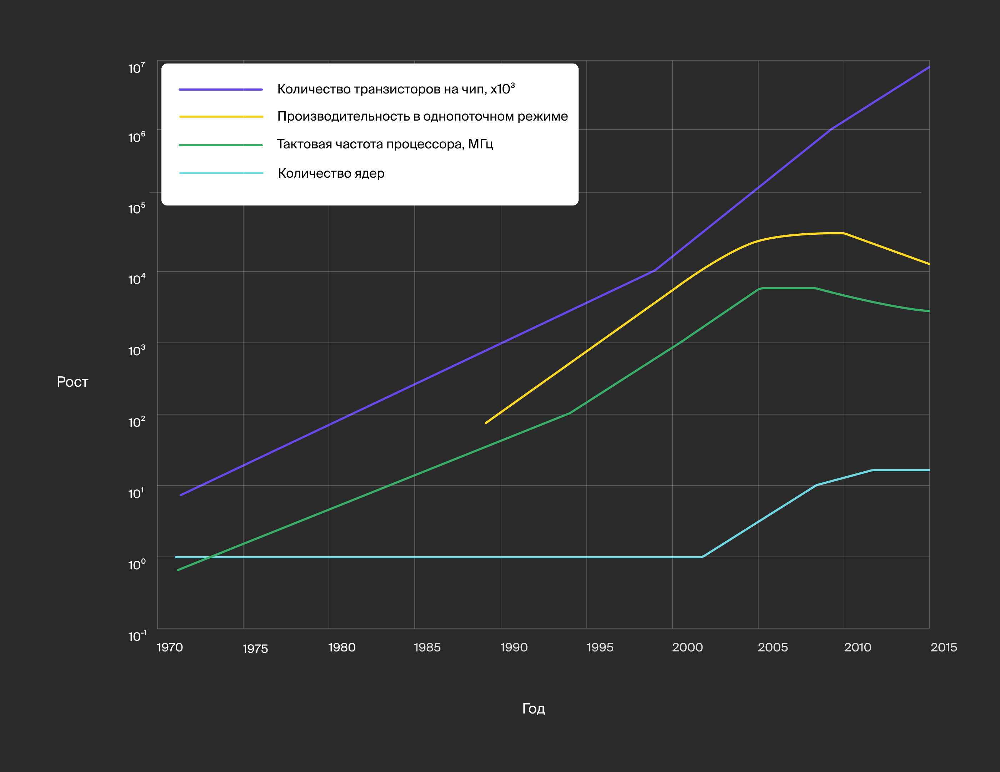
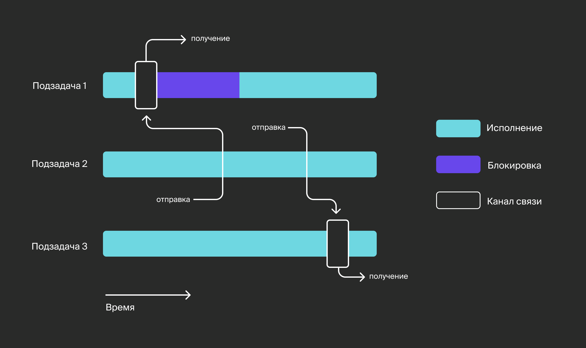
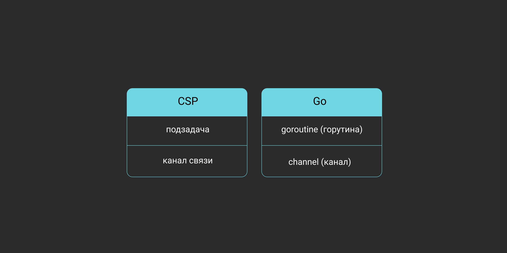
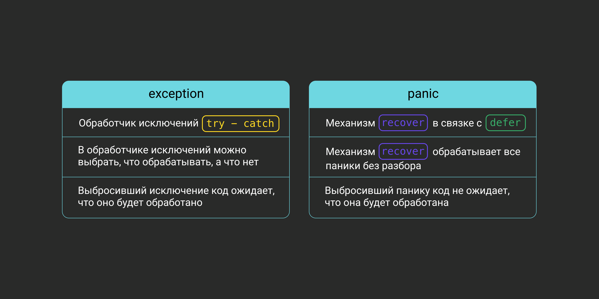

# Hello, Go


Начнём с главного: откуда взялся голубой суслик? По-английски суслик — gopher. Автор оригинального изображения — иллюстратор и писатель Рене Френч, жена Роба Пайка, одного из создателей Go. Изначально она рисовала суслика для промоушена радиостанции WFMU в Нью-Джерси. Спустя несколько лет, когда стартовал проект Go и понадобился маскот, Рене адаптировала рисунок гофера. Так суслик стал талисманом нового языка программирования.

Изначально гофер был светло-коричневого цвета. Но когда решили выпустить мягкие игрушки, первые плюшевые экземпляры покрасили в синий. Так и повелось. Подробнее про гофера можно почитать в официальном блоге Go.

Важно знать, что правильное название языка — Go, а не Golang. Второй вариант используют потому, что go — часто употребляемый английский глагол, это затрудняет поиск в интернете материалов, относящихся к языку программирования. Из тех же соображений выбирали домен для официального сайта: golang.org. Недавно его заменили на go.dev.

## Зачем миру понадобился ещё один язык

Несмотря на то что Go — сравнительно молодой язык (первая версия появилась в 2009 году, а в 2012-м состоялся первый стабильный релиз), потребность в подобном языке возникла на рынке задолго до его создания.
Требования бизнеса к программному продукту начали меняться с появлением интернета. Нужно было создавать веб-страницы быстро, не жертвуя при этом безопасностью. Серверы должны были обслуживать нескольких клиентов одновременно — чем больше, тем лучше. А железо, которое обеспечивало работу большинства программных продуктов того времени, по-прежнему работало с одноядерными процессорами.



С приходом на рынок многоядерных процессоров появилось дополнительное пространство для оптимизации. Новые условия требовали новых подходов к проектированию ПО. В частности, оно должно было эффективно утилизировать доступные ядра процессора. Для этого программистам надо было писать код, который поддерживал многопоточность.

## Совсем чуть-чуть теории

Что такое «поток» в контексте операционной системы? Поток выполнения (native/kernel thread) — это часть процесса, в которой инструкции могут выполняться независимо и иметь доступ к общим ресурсам. За управление потоками отвечает планировщик ОС. 

Многопоточность — свойство железа и софта, при котором несколько потоков могут выполняться параллельно, не мешая друг другу. Если разработчики ПО сумели эффективно распараллелить отдельные части программы, можно рассчитывать на увеличение производительности, кратное количеству доступных ядер процессора.

Одна из первых вещей, с которой сталкиваются разработчики при проектировании многопоточного ПО, — организация доступа к общим ресурсам, а конкретно — к памяти. Неверное разделение доступов между потоками может привести к порче данных. Например, если два потока одновременно и параллельно пишут своё значение в одну и ту же переменную, какое из значений будет записано в результате? Да и в целом необходимость мыслить несколькими потоками осложняет понимание процесса выполнения программы.

Разработчикам хочется избавиться средствами языка от головной боли, которая может возникнуть при переходе на многопоточное программирование. Разные языки предлагали разные решения этой проблемы, но так как большинство существовавших на тот момент языков создавались без учёта многопоточности, её поддержку приделывали «сбоку».

В интерпретируемых языках программирования, занимавших львиную долю рынка того времени, были дополнительные сложности. Нужно было организовать механизмы обращения к глобальному состоянию интерпретатора из нескольких потоков и обмен данными между этими потоками.

Появилось понимание, что необходим новый язык программирования, который был бы изначально создан с расчётом на многопоточность и позволял быстро и удобно писать приложения, утилизирующие доступные ядра процессоров. 

## Как Go ответил на вызовы рынка

Возможность спроектировать язык с нуля позволила на фундаментальном уровне внедрить в язык многие решения, которые позволили бы разработчикам писать многопоточный код.

В язык встроено две абстракции, которые реализуют модель CSP (Communicating Sequential Processes). В этой модели программа представляет собой множество одновременно работающих подзадач, которые общаются между собой с помощью каналов связи.



В Go модель CSP реализована следующими абстракциями:
- Подзадачей в Go именуется goroutine (горутина). Горутины живут в прослойке между программой и средой выполнения, именуемой runtime. Помимо всего прочего, рантайм отвечает за организацию конкурентного доступа множества горутин к общему ограниченному ресурсу — процессорному времени. Его задача — распределить этот ресурс так, чтобы каждая неспящая горутина смогла поработать хотя бы какое-то время, прежде чем управление перейдёт к следующей. Таким образом достигается иллюзия параллельности выполнения задач при количестве горутин, многократно превышающем количество доступных системных потоков.
- Каналом связи в Go выступает такая абстракция, как channel (канал). На каналах построены все механизмы обмена и синхронизации потоков в Go. Канал представляет из себя этакий туннель, в который одна горутина может «положить» значение, а другая — это значение оттуда «вытащить» и что-то с ним сделать.

Ещё раз:



Обе абстракции — не подключаемые библиотеки или фреймворки, а встроенные конструкции синтаксиса, что делает работу с ними «киллер-фичей» для языка и большим преимуществом для программиста.

# Основные фишки языка

Go — это компилируемый язык программирования со строгой статической типизацией, сборщиком мусора и встроенным менеджером пакетов. Он разработан с упором на многопоточное программирование. 

*В основе идеологии Go лежат минималистичность, простота синтаксиса, высокая скорость сборки и выполнения, удобные абстракции для написания многопоточного кода и эффективная утилизация всех доступных ядер процессора.*

## Синтаксис

В Go C-подобный синтаксис с минимумом неочевидных и неявных конструкций. Поощряется читаемость и чистота кода, для этого используется компилятор, который, например, откажется собирать код с неиспользуемыми переменными. Строгая типизация вынуждает выполнять все преобразования (даже алиасов на одни и те же типы) явным образом. 

Также есть подробные гайды по стилизации кода и утилита `fmt`, которая автоматически приводит код к общепринятому виду. Это объясняется тем, что на практике разработчики гораздо чаще читают код, чем пишут, и соглашения по стилизации помогают сэкономить много времени.

## Стандартная библиотека

Несмотря на компактность, стандартная библиотека Go позволяет решать большинство повседневных задач без обращения к сторонним библиотекам. В ней есть: 
- средства для простой и быстрой реализации серверов и клиентов (как TCP/UDP, так и HTTP);
- пакеты для сериализации/десериализации данных в популярные форматы;
- единый интерфейс для потокового ввода-вывода (пакет io);
- вспомогательные интерфейсы и функции для обработки и оборачивания ошибок;
- пакет testing, предоставляющий инструменты для быстрого и удобного написания unit-тестов и бенчмарков из коробки;
- свой язык шаблонов для кодогенерации и server-side рендеринга HTML-страниц.

## ООП

Парадигме ООП язык следует лишь частично, оставаясь мультипарадигмальным. Несколько ослабить строгую типизацию призван механизм interface (интерфейс). Он даёт возможность задать ограничения на тип в виде списка методов, которые должны быть реализованы.

При этом конкретную реализацию раскрывать и даже явным образом указывать нет необходимости. Типизация в этом случае работает по принципу «утиной» (duck typing): «если что-то плавает как утка, крякает как утка и летает как утка, то это, скорее всего, и есть утка». Достаточно реализовать набор методов у типа, чтобы он начал автоматически удовлетворять всем интерфейсам с аналогичными сигнатурами методов:
```go
type Stringer interface {
    String() string
}

type myType int

// myType реализует интерфейс Stringer 
func (t myType) String() string {
    // представление типа myType в виде строки
} 
```

## Exceptions

Обработке ошибок в Go нашлось особое место. Во многих других языках ошибки обрабатываются с помощью механизма исключений (exceptions). Если в ходе выполнения функции происходит ошибка, выбрасывается специальное событие, называемое исключением, которое будет либо обработано тут же, в месте вызова функции, либо проброшено вверх по стеку, пока его кто-нибудь не поймает. Для «ловли» этого события нужна конструкция `try — catch`, именуемая обработчиком исключений:
```python
try:
    foo()
except IndexError:
    # обработка исключений, связанных с выходом за пределы массива
except:
    # обработка всех остальных исключений
```

У этого подхода есть недостаток: выброс исключения происходит неявно для вызывающего функцию кода, поэтому программисту приходится запоминать, какая функция может выбросить исключение. Также существуют uncatchable-исключения, например относящиеся к выходу программы за пределы доступной ей памяти.

В Go применяется другой подход, который вносит больше ясности и явности в процесс обработки ошибок. Дело в том, что функции в Go могут возвращать больше одного значения. Этим свойством активно пользуются разработчики, используя в качестве последнего возвращаемого значения интерфейс `error`:
```go
func foo() (int, error) { 
    // в теле функции может быть ошибка
}

result, err = foo()
if err != nil {
    // handle error
} 
```

Тип `error` в Go — встроенный, то есть, чтобы им воспользоваться, не нужно импортировать какой-либо пакет. Наличие отдельного типа позволяет одинаково обрабатывать ошибки, независимо от того, с какой функцией вы работаете — стандартной или сторонней библиотеки. Вы всегда работаете с одним и тем же интерфейсом `error`, а значит, вы сможете сравнить две ошибки или применить к ним функции интроспекции ошибок из библиотеки `errors`.

Так как возможность возникновения ошибки при выполнении функции отражена непосредственно в её сигнатуре (последнее возвращаемое значение имеет тип `error`), пользователь, который обращается к этой функции, вынужден всегда обрабатывать или игнорировать ошибку явно, иначе код не скомпилируется. Добавлять последним (обычно вторым) возвращаемым аргументом ошибку принято везде, где только может произойти ошибка. Чаще всего речь о функциях, в теле которых происходят операции ввода-вывода. 

## Panic

Также в Go существует механизм паники (panic). Если конструкция выше — типичный способ проверить выполнение той или иной функции, то паника выбрасывается только тогда, когда исполняющий код попадает в нестандартную ситуацию, которую невозможно обработать. Одна из самых частых причин паники — разыменовывание `nil`-указателя или выход за пределы массива. По умолчанию паника будет идти вверх по стеку и завершать все функции, пока не завершит функцию `main`, а вместе с ней и весь процесс.

Однако её можно поймать и обработать, используя конструкцию `defer` и встроенную функцию `recover`.

`defer` — это ещё одна необычная концепция языка, которая позволяет отложенно выполнять блоки кода: например, чтобы закрывать файлы по завершении работы с ними. Можно рассматривать `defer` как замену деструкторов контекста или менеджеров контекста в других языках (`try_with_resources` из Java, `with` из Python).
```go
func foo() {
    // паникуем
    panic("unexpected!")
}
//...
    // выполняется после срабатывания паники
    defer func() {
        if r := recover(); r != nil {
            // обработка паники, в переменной r будет лежать строка "unexpected"
        }
    }()
    // внутри foo срабатывает паника
    foo() 
```

Может показаться, что паника очень похожа на механизм исключений, но это не так. Выбрасывая `exception`, функция обычно ожидает, что исключение будет поймано выше обработчиком исключений (`try — catch`). Однако перехват паники происходит не всегда. Инициировавший панику код обычно не ждёт, что она будет обработана. Следовательно, есть вероятность, что процесс завершится.



## Тестирование

Выше упоминалась библиотека `testing`. В Go принято располагать файлы с unit-тестами непосредственно в пакете, функции которого вы тестируете. Например, если код, который вы хотите покрыть тестами, располагается в файле `foo.go`, для тестов нужно создать файл `foo_test.go`:
```bash
foo/ # пакет foo
    foo.go # файл с тестируемым кодом
    foo_test.go # файл с тестами
```
Содержимое файла `foo.go`:
```go
package foo

func Foo() string {
    return "bar"
}
```
В файле `foo_test.go` реализуем функции определённой сигнатуры:
```go
// файл foo_test.go
package foo

import (
    "testing"
)

func TestFooFunc(t *testing.T) {
    expectedFooResult := "bar"
    if actualFooResult := Foo(); actualFooResult != expectedFooResult {
        t.Errorf("expected %s; got: %s", expectedFooResult, actualFooResult)
    }
}
```
Выполнить их можно, просто вызвав команду `go test`:
```bash
PASS
ok      github.com/Yandex-Practicum/go-freetrack/00_intro/testing/foo   0.240s
```

## Concurrency

Как было сказано ранее, многопоточность в Go реализована согласно модели CSP (Communicating Sequential Processes). При таком подходе программа представляет собой множество одновременно работающих подзадач, которые общаются с помощью каналов связи. Задачами в Go выступают горутины (goroutine), связь организована через каналы (channel). 

Изначально в Go реализована кооперативная многозадачность: пока код в горутине сам не передаст управление (например, попытавшись выполнить блокирующую операцию), забрать управление у этой горутины невозможно. С версии 1.14 планировщик стал в том числе вытесняющим.

# Настройка окружения


Переходим к практике. Для начала настроим рабочую среду.

## Установка компилятора

Установочные файлы под разные ОС, в том числе исходники с инструкцией по сборке, можно найти в разделе Downloads на [официальном сайте Go](https://golang.org/dl/).

## Toolchain

Вместе с компилятором поставляется набор программ и утилит, к которым можно получить доступ командой `go`. Их называют Go Toolchain.

Например, командой `go env` можно проверить установку Go, а заодно вывести список используемых инструментарием переменных окружения вместе с их значениями:
```bash
GO111MODULE=""
GOARCH="amd64"
GOBIN=""
GOCACHE="/Users/user/Library/Caches/go-build"
GOENV="/Users/user/Library/Application Support/go/env"
GOEXE=""
GOFLAGS=""
GOHOSTARCH="amd64"
GOHOSTOS="darwin"
# и так далее
```

Команды `go fmt` и `go test` — тоже часть встроенного инструментария. Скомпилировать исходный код в исполняемый файл можно командой `go build`. Для локального запуска чаще используют команду `go run` — она совмещает в себе компиляцию и запуск программы.

Для вывода справки по работе с конкретной командой можно воспользоваться `go help <command>`.
Подробнее про Go Toolchain — [здесь](https://pkg.go.dev/cmd/go).

## GOPATH

Переменная окружения `GOPATH` указывает на директорию, в которой Go организует работу с пользовательским кодом, сторонними библиотеками, исполняемыми файлами и предкомпилированными компонентами, выступающими своего рода кешем для ускорения компиляции. 
На практике рабочая директория Gо имеет следующую структуру:
```bash
$GOPATH
├──bin # здесь лежат бинарники программ, устанавливаемых командой 'go install'
|    └──foo # исполняемый файл программы foo
├──pkg # тут Go хранит предкомпилированные пакеты — кеш для ускорения сборки программ
|    └──linux_amd64 # внутри /pkg разбит на директории, соответствующие архитектуре и ОС
|       └──github.com/user
|           └──bar.a # предкомпилированная библиотека 'bar'
└──src
    └──github.com/user
        ├──foo
        |   └──main.go # исходный код программы foo
        └──bar
            └──bar.go # исходный код библиотеки bar
```

По умолчанию в качестве `GOPATH` команда `go` использует директорию `$HOME/go` или `%USERPROFILE%\go`. Но рекомендуем задать рабочую директорию явным образом, прописав путь до неё в переменной окружения `$GOPATH`. Вы можете указать любую удобную для вас директорию.

До версии 1.11, в которой появились модули, все файлы исходного кода обязательно должны были находиться в `$GOPATH/src`. При использовании модулей исходный код Go-проектов может находиться в любой директории. Начиная с версии 1.16, модули включены по умолчанию. Используйте в ваших проектах модули — для этого достаточно вызвать `go mod init` в директории пакета.

## Редакторы кода

Предлагаем установить IDE или подключить плагин к вашему любимому редактору:
- Если хотите IDE — установите JetBrains GoLand. Но бесплатная триальная версия даётся только на месяц.
- Для редактора Visual Studio Code — плагин Go.
- Для редактора Sublime Text — плагин LSP и плагин LSP-gopls.
- Для редактора Vim — плагин vim-go.

## Go Style
Теперь расскажем о стилизации кода, принятой в Go. Речь идёт не о форматировании — за него отвечает утилита `fmt`. Конвенции по оформлению касаются в большей степени языковых конструкций и именования создаваемых сущностей.

Как уже было сказано, в больших компаниях разработчики чаще читают код, чем пишут. В сообществе возникло предположение, что рабочий процесс можно оптимизировать, если все будут следовать единым подходам к реализации и оформлению кода. Это должно помочь быстрее вникать в незнакомый код и проводить код-ревью, так как не придётся повторять одни и те же комментарии к ошибкам.

Предположение породило сразу несколько популярных подходов:
- [Uber Go Style Guide](https://github.com/uber-go/guide/blob/master/style.md)
- [Effective Go](https://golang.org/doc/effective_go)
- [CodeReviewComments](https://github.com/golang/go/wiki/CodeReviewComments)

Рекомендуем ознакомиться со всеми тремя, перед тем как делать практические задания курса.

Сейчас важно запомнить: в Go для именования переменных, констант, типов и функций используется `camelCase`. Именование в стиле `snake_case` используется только в генерированном коде. Это позволяет на глаз определить природу происхождения файла, так как в сгенерированный код крайне не рекомендуется вносить правки.

## Playground

[Go Playground](https://play.golang.org/) — это браузерный редактор, который может пригодиться, когда нужно быстро проверить небольшие части кода или гипотезы относительно работы встроенных конструкций языка. 

В Go Playground есть нюансы, о которых тоже важно помнить:
- время в нём некорректно, попытка получить текущее время системы всегда возвращает дату `2009-11-10 23:00:00`;
- random seed менять нельзя.

## Структура проекта

Прежде чем начать писать код, неплохо бы разобраться, что представляет собой Go-проект на уровне структуры файлов и директорий. 

У вашего проекта может быть такая иерархия:

```bash
go_app # корневая директория проекта
├──main_package # пакет main
|   └──main.go # файл с функцией main()
├──foo # пакет foo
|   ├──foobar # можно создавать пакет в пакете, обращение к вложенному пакету — 'foo/foobar'
|   |   └──foobar.go
|   └──foo.go
└──bar # пакет bar
    ├──somefile1.go # ограничений на именование файлов с исходным кодом нет
    ├──somefile1_test.go # при именовании файлов с тестами и бенчмарками нужно придерживаться шаблона *_test.go 
    └──somefile2.go
        #...
```

Несмотря на то что Go — язык про стандарты и конвенции, строгих требований к структуре проектов на Go нет. Есть [рекомендации](https://github.com/golang-standards/project-layout). Отчасти причина в том, что структура директорий и файлов зависит от размера и сложности реализуемой программой задачи. Любая стандартизация в этом случае может как помочь, так и помешать удобной работе с кодом.

### Файлы

Исходный код программы на Go хранится в файлах с расширением `.go` в кодировке `UTF-8`. Код может быть разбит на произвольное количество файлов.

### Пакеты

В Go для разграничения области видимости кода (scope) проект разделяют на пакеты (package). Каждый файл с кодом принадлежит определённому пакету. Имя пакета указывают после ключевого слова `package` в первой строке каждого файла, причём в одной директории не может быть файлов, принадлежащих разным пакетам.

Можно сказать, что пакет в Go — это директория. Рекомендуем указывать имя пакета, совпадающее с именем директории, где лежат файлы.

Код внутри пакета может обращаться к переменным, пользовательским типам, функциям, переменным и константам из соседних файлов без дополнительных действий — точно так же, как если бы они располагались в одном файле.

Особое место занимает пакет `main`, который вместе с функцией `main()` выступает входной точкой выполнения программы. Название директории, где лежат файлы пакета `main`, может быть произвольным. Наличие пакета `main` с функцией `main()` превращает набор пакетов в программу. Набор пакетов без входной точки может использоваться в качестве подключаемой библиотеки.

### Импорт

Подключить пакет с кодом в Go можно ключевым словом `import`. Обращение к компонентам пакета — `<package name>.<component name>`.
```go
import "local/foo"

func main() {
    foo.Foo()
}
```

Важно, чтобы название пакета совпадало с названием директории. Это позволяет узнать имя пакета, не заглядывая в его исходный код.

Часто вы будете импортировать в одном файле сразу несколько пакетов — лучше использовать блочную нотацию объявления импортов. Если у нескольких пакетов одинаковое название, нужно применить псевдонимы (aliases), которые вы можете давать пакетам:
```go
import (
    fooLocal "local/foo"
    fooRemote "github.com/foo"
)

func main() {
    fooRemote.Foo()
    fooLocal.Foo()
}
```
Иногда нужно импортировать пакет для выполнения его кода инициализации, при этом никакие переменные и функции пакета не используются в явном виде. В этом случае компилятор Go откажется собирать программу, ссылаясь на неиспользуемый импорт.

Чтобы обойти это ограничение, вставим `_` перед импортом — явно укажем компилятору на то, что ошибка со стороны программиста отсутствует и код этого пакета нужно добавить в программу:
```go
import (
    _ "foo"
) 
```
Пакеты, импортированные в `main`, становятся частью программы и подхватываются компилятором при сборке. Циклические импорты в Go запрещены.

Перед импортом пакета можно поставить точку, тогда для обращения к объектам этого пакета не придётся указывать его имя:
```go
import . "path/to/package"

func someFunc() {
        funcFromPackage()
}
```