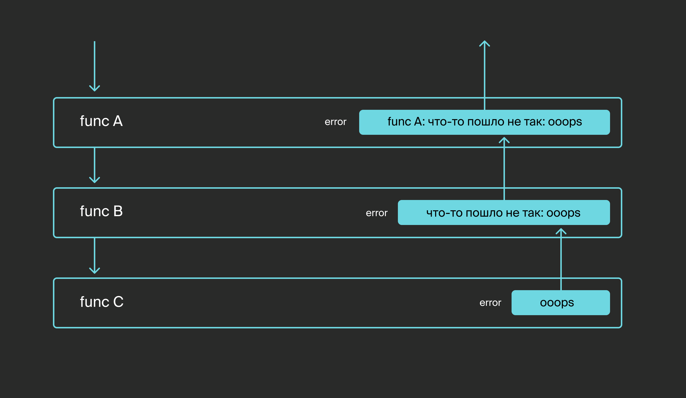

*Полезно знать: если ваш сервер на Go не запускается и при этом ничего не выводится в консоль, проверьте, обрабатываете ли вы ошибку при запуске. Вместо `http.ListenAndServe("127.0.0.1:8080", mux)` пишите `log.Fatal(http.ListenAndServe("127.0.0.1:8080", mux))`. 
Это позволит увидеть сообщение об ошибке. Например, `listen tcp 127.0.0.1:8080: bind: address already in use` может означать, что порт уже занят другой программой.*

# Интроспекция ошибок

Ни одна программа не застрахована от ошибок. Если при неверных входных данных или недоступности ресурсов можно просто вывести сообщение для пользователя, то причины аварийных ситуаций, приводящих к краху программы, бывает сложно установить. Часто игнорирование простых ошибок приводит к серьёзным последствиям. Исправить их стоит гораздо дороже, чем изначально уделить больше внимания потенциальным проблемам.

Поскольку избежать ошибок невозможно, языки программирования предоставляют инструментарий для их обработки. В некоторых языках есть механизм исключений, при котором перехватывать и обрабатывать ошибки можно в любом месте программы. Язык Go предлагает отслеживать ошибки и реагировать на них непосредственно в момент возникновения. Код получается менее компактным, зато разработчик лучше контролирует выполнение программы.

Так как Go позволяет возвращать из функций несколько значений, принято последним значением возвращать ошибку. Если возвращаемое значение ошибки равно `nil`, функция завершилась корректно. В противном случае нужно обработать ошибку и/или вернуть её выше по стеку. Если функция завершилась с ошибкой, не стоит использовать остальные возвращаемые значения: они могут быть не определены, функция может выполниться не полностью и не успеть вычислить значения.

В этой теме вы:
- познакомитесь c типом `error`;
- научитесь обёртывать и разворачивать ошибки;
- изучите функции для интроспекции ошибок.

## Тип error

Ошибкой в языке Go может быть значение любого типа, который совместим с интерфейсным типом `error`:
```go
type error interface {
    Error() string
}
```

Для создания ошибки чаще всего применяют функцию `fmt.Errorf(format string, a ...interface{})`, где указывают шаблон форматирования и дополнительные параметры. Ещё можно использовать функцию `errors.New(text string)`, принимающую в параметре строку:
```go
func GetUser(id int) (*User, error) {
    if id <= 0 {
        return nil, errors.New("invalid user's id")
    }
    // FindUser ищет в БД пользователя с указанным id
    // если пользователь не найден, то user равен nil
    // также может возвращаться ошибка, возникшая в процессе поиска
    user, err := FindUser(id)
    if err != nil {
        return nil, err
    }
    if user == nil {
        return nil, fmt.Errorf("can't find user (id: %d)", id)
    }
    return user, nil
}
```

По умолчанию ошибки имеют тип, который может хранить только строку.

Чтобы сохранить и передать параметры окружения и настройки, при которых произошла ошибка, можно создать свой тип ошибки с нужными полями и определить для него метод `Error() string`. Это позволит включать в ошибку всю необходимую дополнительную информацию.

Например, чтобы сохранить время возникновения ошибки, можно определить такой тип:
```go
// TimeError предназначен для ошибок с фиксацией времени возникновения.
type TimeError struct {
    Time time.Time
    Err  error
}

// Error добавляет поддержку интерфейса error для типа TimeError.
func (te *TimeError) Error() string {
    return fmt.Sprintf("%v %v", te.Time.Format("2006/01/02 15:04:05"), te.Err)
}

// NewTimeError записывает ошибку err в тип TimeError c текущим временем.
func NewTimeError(err error) error {
    return &TimeError{
        Time: time.Now(),
        Err:  err,
    }
}
```

**Важно**
При создании ошибок лучше возвращать не структуру, а указатель на структуру. Если вместо указателя возвращать структуру, то ошибки из разных пакетов, но с одинаковым текстом будут равны. А если возвращать указатель и создавать ошибки с одинаковыми данными, они не будут равны друг другу, так как будут ссылаться на разные области памяти.

Для примера рассмотрим, как по умолчанию определяется ошибка в пакете `errors`:
```go
type errorString struct {
    s string
}

func New(text string) error {
    return &errorString{text}
}

func (e *errorString) Error() string {
    return e.s
}
```

Можно было бы реализовать функцию New() и метод Error() таким образом:
```go
func New(text string) error {
    return errorString{text}
}

func (e errorString) Error() string {
    return e.s
}
```

Но тогда ошибки с одинаковым текстом, созданные в разных пакетах, были бы равны. Например, в этом случае ошибка `errors.New("EOF")` была бы равна ошибке `io.EOF`, которая определяется точно так же в пакете `io`, что могло бы привести к неверной обработке ошибок.

Посмотрите, как на практике используется тип `TimeError`. Допустим, при старте программы нужно прочитать файл конфигурации, а если не удалось его прочитать, то следует вывести ошибку и завершить работу:
```go
package main

import (
    "fmt"
    "os"
    "time"
)

// TimeError предназначен для ошибок с фиксацией времени возникновения.
type TimeError struct {
    Time time.Time
    Err  error
}

// Error добавляет поддержку интерфейса error для типа TimeError.
func (te *TimeError) Error() string {
    return fmt.Sprintf("%v %v", te.Time.Format("2006/01/02 15:04:05"), te.Err)
}

// NewTimeError записывает ошибку err в тип TimeError c текущим временем.
func NewTimeError(err error) error {
    return &TimeError{
        Time: time.Now(),
        Err:  err,
    }
}

func ReadTextFile(filename string) (string, error) {
    data, err := os.ReadFile(filename)
    if err != nil {
        return ``, NewTimeError(err)
    }
    return string(data), nil
}

func main() {
    data, err := ReadTextFile("myconfig.yaml")
    if err != nil {
        fmt.Println(err)
        os.Exit(0)
    }
    // ...
}
```

При отсутствии файла программа будет выводить время возникновения ошибки и текст:
```
2023/01/24 23:00:00 open myconfig.yaml: no such file or directory
```

Создание своих типов ошибок позволяет собирать дополнительную информацию о месте, времени и причинах возникновения ошибки.

## Упаковка ошибок

Часто ошибка возвращается вверх по стеку с дополнительным комментарием. В момент, когда функция хочет её обработать, уже сложно понять, какой была исходная ошибка.



Чтобы решить эту проблему, Go даёт возможность упаковывать ошибки (процесс называется e**rror wrapping**). Для этого достаточно в функции `Errorf()` добавить к ошибке спецификатор `%w`. 

Функция `errors.Unwrap()` снимает один уровень обёртки. Если ошибка была обёрнута несколько раз, то для получения исходной ошибки нужно вызывать `errors.Unwrap()` до тех пор, пока она не начнёт возвращать `nil`.

```go
package main

import (
    "errors"
    "fmt"
    "os"
    "time"
)

func ReadTextFile(filename string) (string, error) {
    data, err := os.ReadFile(filename)
    if err != nil {
        // добавляем время и обёртываем ошибку
        now := time.Now().Format("2006/01/02 15:04:05")
        return "", fmt.Errorf("%s %w", now, err)
    }
    return string(data), nil
}

func main() {
    data, err := ReadTextFile("myconfig.yaml")
    if err != nil {
        fmt.Println(err)
        // можем узнать оригинальную ошибку
        fmt.Println("Original error:", errors.Unwrap(err))
        os.Exit(0)
    }
    fmt.Println(data)
    // ...
}
```

Результат:
```
2025/10/05 10:04:57 open myconfig.yaml: no such file or directory
Original error: open myconfig.yaml: no such file or directory
```

В этом примере исходная ошибка распаковывается функцией `Unwrap()` и выводится в консоль. 

Если тип ошибки не имеет метода `Unwrap()` или упакованная ошибка отсутствует, то `errors.Unwrap()` вернёт `nil`. Поэтому метод `Unwrap()` следует определять для типов ошибок, которые упаковывают исходные ошибки.

Вернёмся к примеру с `TimeError`. Чтобы иметь возможность получать исходную ошибку, добавим для `TimeError` метод `Unwrap()`:
```go
package main

import (
	"errors"
	"fmt"
	"os"
	"time"
)

type TimeError struct {
	Time time.Time
	Err  error
}

func (te *TimeError) Error() string {
	return fmt.Sprintf("%v %v", te.Time.Format("2006/01/02 15:04:05"), te.Err)
}

func NewTimeError(err error) error {
	return &TimeError{
		Time: time.Now(),
		Err:  err,
	}
}

func (te *TimeError) Unwrap() error {
	return te.Err
}

func ReadTextFile(filename string) (string, error) {
	data, err := os.ReadFile(filename)
	if err != nil {
		return ``, NewTimeError(err)
	}
	return string(data), nil
}

func main() {
	data, err := ReadTextFile("myconfig.yaml")
	if err != nil {
		fmt.Println(err)
		// можем узнать оригинальную ошибку для TimeError
		fmt.Println("Original error:", errors.Unwrap(err))
		os.Exit(0)
	}
	fmt.Println(data)
}
```

Результат:
```
2025/10/05 10:07:23 open myconfig.yaml: no such file or directory
Original error: open myconfig.yaml: no such file or directory
```

___
Представьте, что на стажировке вы работаете с программой, в которой определён тип `LabelError`. Он добавляет слева к ошибке строковую метку `[МЕТКА] ошибка`. Например: `[FILE] текст ошибки`.

Опишите для этого типа методы `Error()` и `NewLabelError(label string, err error)`, чтобы программа выводила `[FILE] open mytest.txt: no such file or directory`.

```go
package main

import (
    "fmt"
    "os"
    "strings"
)

// LabelError описывает ошибку с дополнительной меткой.
type LabelError struct {
    Label string // метка должна быть в верхнем регистре
    Err   error
}

// добавьте методы Error() и NewLabelError(label string, err error)

// ...

func main() {
    _, err := os.ReadFile("mytest.txt")
    if err != nil {
        err = NewLabelError("file", err)
    }
    fmt.Println(err)
    // должна выводить
    // [FILE] open mytest.txt: no such file or directory
}
```

Решение:
```go
// Error добавляет поддержку интерфейса error для типа LabelError.
func (le *LabelError) Error() string {
    return fmt.Sprintf("[%s] %v", le.Label, le.Err)
}

// NewLabelError упаковывает ошибку err в тип LabelError.
func NewLabelError(label string, err error) error {
    return &LabelError{
        Label: strings.ToUpper(label),
        Err:   err,
    }
}
```
___

## Интроспекция ошибок

