# Основы многопоточности

Первые компьютеры не отличались быстротой. Вычисления представляли собой длинную последовательность задач, которые выполнялись «в порядке живой очереди». Причём часть операций — в основном ввод-вывод — были медленнее вычислений. Процессор на таких этапах простаивал. 

Тогда возникла идея многозадачности. Вычисления стали делить на процессы, использующие общий ресурс. В таком режиме процессы выполняются конкурентно, то есть порядок их выполнения не предопределён. Представьте, что в привокзальном кафе наняли на работу ещё одну буфетчицу. Пока одна жарит яичницу, другая может резать салат или принимать заказы.

Сегодня умение писать многопоточные программы — одно из базовых требований к программистам. Сложно представить себе собеседование на Go-разработчика без вопросов о горутинах, каналах и мьютексах. Инструменты языка Go очень удобны для создания многопоточных приложений — именно поэтому он так популярен. Но реализовать такие сервисы без знаний о многопоточности в Go невозможно.

В заключительной теме курса расскажем:
- как устроена многопоточность в Go;
- как определяются и вызываются горутины;
- какие примитивы синхронизации есть в стандартной библиотеке;
- что такое каналы и как с ними работать;
- зачем нужны атомарные операции и как их использовать;
- какие паттерны многопоточного кода применяются в Go.

Представьте себе, как работал бы обычный веб-сервер без многопоточности. Вместо параллельной обработки HTTP-запросов он бы последовательно обрабатывал и отвечал на каждый запрос. В этом случае даже одна страница загружалась бы дольше из-за последовательной подгрузки изображений, скриптов и прочих ресурсов. А о тысячах запросах в секунду даже речи не идёт.

С активным развитием интернета и появлением многоядерных процессоров возникли новые требования к проектированию ПО, которое должно было эффективно использовать доступные ядра процессора. Язык Go успешно решает эту задачу, так как содержит готовые решения и инструменты для написания многопоточного кода.

## Процессы и потоки

Для начала разберёмся, что такое многопоточность. Выделим два ключевых понятия — процессы операционной системы и ядра процессора.

**Процесс** — это выполняющаяся программа и её ресурсы: heap-память, дескрипторы и так далее. Сам процесс хотя и хранит исполняемый код, не может его выполнить. За выполнение кода отвечают потоки.

**Поток выполнения** — это часть процесса. Каждый поток имеет доступ к контексту родительского процесса и кроме этого содержит собственные ресурсы: стек, специфические данные потока. 

В одном процессе может быть несколько потоков. Планировщик операционной системы распределяет потоки по **ядрам процессора**, чтобы дать каждому потоку равное время выполнения.

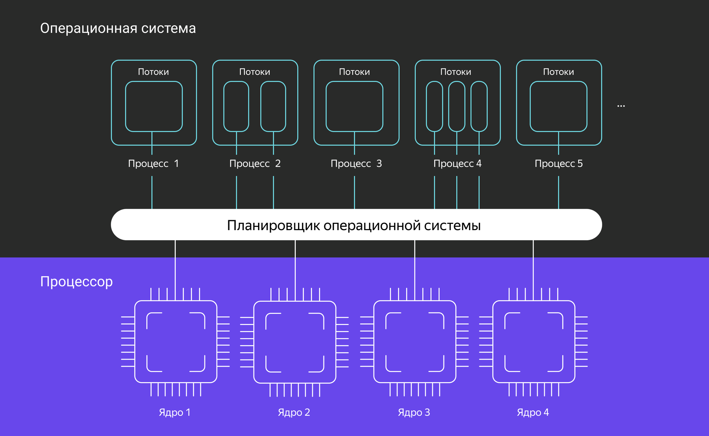

Потоков значительно больше, чем ядер процессора. Когда планировщик переключает ядро с выполнения одного потока на другой, контекст предыдущего потока выгружается из памяти и загружаются данные потока, который будет выполняться. Если потоков слишком много, то на переключение между ними уходит много времени: из-за постоянных операций выгрузки-загрузки контекста программа выполняется дольше.

Поэтому некоторые современные языки программирования реализуют **легковесные потоки (green threads)**. Такие потоки легче, потому что легче их контекст. Они могут занимать меньший объём stack-памяти и использовать не все регистры. 

За планирование работы лёгких потоков отвечает среда выполнения — рантайм. Благодаря оптимизациям языка переключение между лёгкими потоками происходит быстрее, чем переключение между потоками операционной системы. Операционная система ничего не знает о легковесных потоках, поэтому в каждом языке могут быть свои особенности в реализации таких потоков.

## Многопоточность в Go

В Go реализована CSP-модель. Программа представляет собой множество одновременно работающих подзадач, которые общаются друг с другом с помощью каналов связи. 

В Go модель CSP реализована абстракциями:
- **Горутина (goroutine)** — это легковесный поток, который занимает гораздо меньше памяти, чем поток ОС. Среда выполнения Go может выполнять несколько горутин на одном потоке операционной системы и быстро переключаться с выполнения одной горутины на другую благодаря их малому размеру.
- **Канал (channel)** — это второй ключевой элемент в многопоточности на Go. На каналах построены все механизмы обмена и синхронизации потоков в Go. Одна горутина может записать данные в канал, а другая горутина — прочитать их.

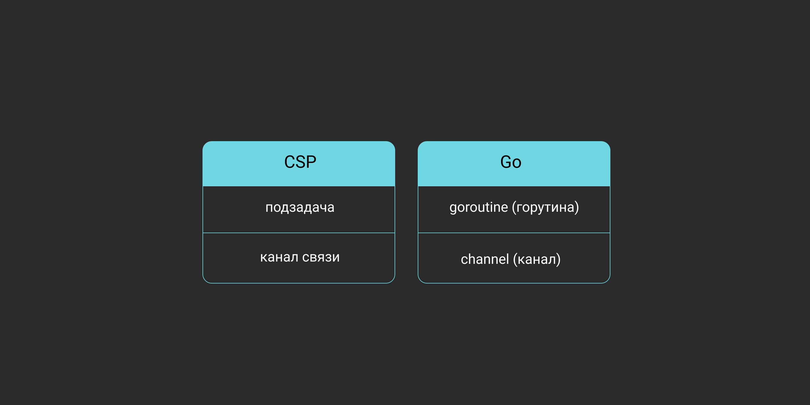

Планировщик рантайма Go управляет всеми создаваемыми горутинами. Он формирует очереди, каждая из которых привязана к потоку операционной системы. При работе программы очередная горутина берётся из очереди и вместе со своим контекстом отправляется на выполнение в поток ОС. 

Вытесняющий планировщик старается равномерно распределять процессорное время между горутинами. Таким образом, достигается иллюзия параллельности выполнения задач при количестве горутин, многократно превышающем количество доступных системных потоков. 

Принцип работы планировщика рантайма Go представлен на схеме:

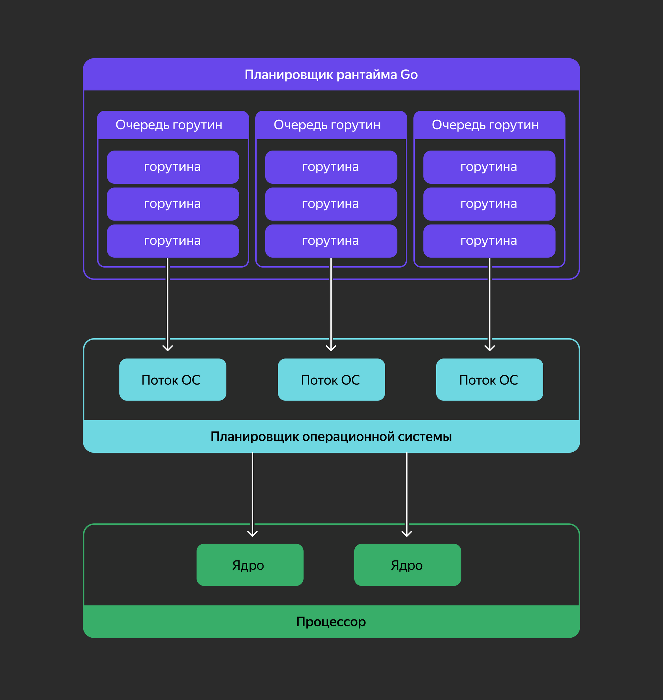

## Проблемы многопоточности

Проблемы с многопоточностью возникают, когда несколько потоков работают с общими данными: обращаются к одной и той же памяти внутри процесса. Самая частая проблема — **состояние гонки (race condition)**.


Все арифметические и логические действия в коде — это неатомарные операции. Если несколько потоков одновременно запустятся на разных ядрах процессора и начнут записывать данные в одну и ту же область памяти, возникнет конкуренция потоков. Один поток скопирует в свой регистр устаревшую копию данных, другой поток перезапишет данные и поменяет на свою версию и так далее.

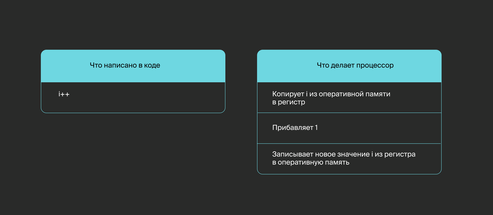

Но есть способы предотвратить состояние гонки. Вот некоторые из них:
- **Мьютексы** (mutex — от mutual exclusion, что переводится как «взаимное исключение»). Мьютекс — это ресурс, который может быть занят только одним потоком. Для других потоков мьютекс заблокируется — они будут ждать, пока он освободится, чтобы продолжить работу.
- **Атомарные операции**. В современных процессорах запрограммированы команды, которые позволяют производить некоторые арифметические и логические действия атомарно. Используя атомарные операции, можно, к примеру, увеличивать целочисленный счётчик из нескольких потоков одновременно без дополнительных блокировок.
- **Обмен сообщениями**. Даёт потокам возможность обмениваться сообщениями или сигналами. Идея обмена сообщениями в том, чтобы создать очередь, в которую один поток может скопировать данные и из которой другой поток может прочитать свою копию.

В Go используются все три способа. Но самый предпочтительный — обмен сообщениями через каналы. Благодаря им можно написать более простой и надёжный многопоточный код. При передаче данных через канал не требуется дополнительное ограничение доступа к ресурсам, поэтому каналы позволяют минимизировать вероятность ошибки программиста.

Перечислим самые частые ошибки:
- **Взаимная блокировка (deadlock)**. Рассмотрим на примере. Представьте, что в буфете осталась одна ложка и одна вилка. Приходят два покупателя, каждому из которых нужна вилка и ложка. Они одновременно подходят к столовым приборам. Один берёт вилку, другой — ложку. Далее оба будут ждать, когда принесут другой прибор и не смогут начать есть свой заказ. Если в коде используются несколько мьютексов или каналов, то может возникнуть ситуация, когда все потоки ожидают сигналов один от другого и не могут продолжить работу.
- **Живая блокировка (livelock)**. Ещё один пример. Вы договорились созвониться с человеком в определённое время. Каждый раз, когда вы набираете его номер, он звонит вам. Вы отменяете вызов и ждёте какое-то время, но он делает то же самое. Живая блокировка — это cостояние программы, при котором потоки что-то делают, но не выполняют полезной работы. Например, два потока пытаются взять несколько мьютексов. Один берёт А и B, а другой B и A. Если второй мьютекс занят, каждый поток откатывается назад. Оба потока формально не будут заблокированы, но они будут постоянно то блокировать, то разблокировать мьютексы.
- **Голодание (starvation)**. Представьте, что человек едет с вокзала в аэропорт. Вместе с билетом на самолёт он взял priority pass (Priority Pass — международная программа доступа в VIP-залы аэропортов), прошёл вне очереди, но его не пускают — из-за большой сумки в ручной клади. Он ругается, занимает время борт-проводников. Из-за этого никто не может пройти дальше. В коде такая ситуация возникает, когда горутина захватывает мьютекс на большее время, чем ей нужно на самом деле. Из-за этого другим потокам приходится ждать разблокировки мьютекса.

___
Посмотрите на псевдокод и определите, к какой ошибке он может привести, если на двух ядрах процессора одновременно выполняются операции:
- `ПеревестиДеньги(счётВаси, счётПети, 10)`;
- `ПеревестиДеньги(счётПети, счётВаси, 15)`.

```go
func ПеревестиДеньги(счёт1, счёт2, сумма) {
    // функция блокироватьСчёт указывает на начало работы со счётом
    // eсли счёт уже заблокирован, то она будет ожидать его
    // разблокировки (функция разблокироватьСчёт)
    блокироватьСчёт(счёт1)
    счёт1.баланс -= сумма
    
    блокироватьСчёт(счёт2)
    счёт2.баланс += сумма
    
    разблокироватьСчёт(счёт2)
    разблокироватьСчёт(счёт1)
}
```

~~Взаимная блокировка (deadlock). (Могут одновременно заблокироваться счета Васи и Пети, как счёт1, и станет невозможна их блокировка, как счёт2.)~~
___
Соедините инструменты с задачами, которые они решают.

- Мьютексы = передача сообщений между горутинами
- Атомарные операции = изменение глобальной числовой переменной из нескольких потоков
- Каналы = передача сообщений между горутинами

В этом уроке вы рассмотрели основы многопоточного программирования. Ознакомились с наиболее распространёнными ошибками, возникающими при работе потоков, и узнали, как их избежать. Далее погрузимся в особенности многопоточного программирования на Go и рассмотрим, как использовать каналы для передачи данных между горутинами.

## Дополнительные материалы
- [Medium | Race condition и Data Race](https://medium.com/german-gorelkin/race-8936927dba20) — о состоянии гонки.
- [Medium | Deadlocks, Livelocks и Starvation](https://medium.com/german-gorelkin/deadlocks-livelocks-starvation-ccd22d06f3ae) — о взаимной блокировке, живой блокировке и голодании.

# Многопоточность в Go

## Горутины

Горутина — это функция, которая выполняется параллельно с другими функциями. В Go выполнить функцию — это `myFunc()`, a выполнить функцию в новой горутине — это `go myFunc()`. Да, всё так просто :) 

При вызове `go myFunc()` программа не дожидается завершения вызываемой функции, а выполняет идущий далее код.

```go
package main

import (
    "fmt"
    "time"
)

func say(s string) {
    for i := 0; i < 5; i++ {
        time.Sleep(time.Millisecond)        
        fmt.Print(s + ` `)
    }
}

func main() {
    // запустим две горутины с функцией say
    go say(`hello`)
    go say(`world`)
    // обычный вызов функции say
    say(`bye`)
}
```

Программа выведет примерно следующее:
```
world hello bye hello bye world bye hello world world hello bye bye
```

Как видите, горутины выполняются в произвольной последовательности. По умолчанию программа завершает работу, не дожидаясь окончательного выполнения горутин.

Если горутина содержит небольшое количество кода, который больше нигде не нужен, то можно определить её с помощью анонимной функции.

```go
package main

import (
    "fmt"
    "time"
)

func main() {
    for _, v := range []string{"hello", "world", "bye"} {
        go func(s string) {
            for i := 0; i < 5; i++ {
                fmt.Print(s + ` `)
                time.Sleep(50 * time.Millisecond)
            }
        }(v)
    }
    time.Sleep(time.Second)
}
```
```
bye hello world world bye hello hello world bye bye hello world world bye hello 
```

## Планировщик горутин

- Как работает планировщик горутин?
- Представьте, что вам дали задачу — выкопать канаву. У вас есть команда из десяти человек, но на всех — всего три лопаты. Прежде чем начать работу, вы подумаете, как организовать процесс быстрее и эффективнее. Примерно этим и занимается планировщик Go.

Планировщик горутин — один из элементов рантайма языка. Он отвечает за выполнение горутин в потоках операционной системы. Планировщик равномерно распределяет процессорное время между горутинами, учитывая их сихронизацию и системные вызовы.

Планировщик горутин работает с тремя типами объектов:
- **Логический процессор**. Это ресурс, который объединяет поток операционной системы и очередь горутин. Для каждого логического процессора планировщик достаёт одну горутину из очереди и запускает её в потоке используя контекст логического процессора.
- **Поток операционной системы**. Это сущность операционной системы, в которой происходит процесс выполнения программного кода. Логический процессор закреплён за определённым потоком. Если горутина сделала системный вызов, который переводит поток в режим ожидания результата, например, чтение файла, то планировщик создаёт дополнительный поток операционной системы. На нём будут запускаться следующие горутины из очереди до разблокировки основного потока.
- **Горутина**.

По умолчанию количество логических процессоров берётся из значения переменной среды `GOMAXPROCS` и равно количеству логических ядер компьютера. Например, если у вас восьмиядерный компьютер, планировщик будет распределять горутины по восьми потокам ОС.

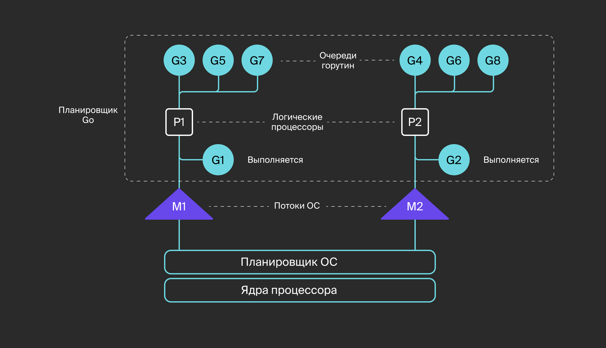

Теперь разберём, как можно влиять на работу горутин. Создатели Go стремятся использовать в планировщике универсальные алгоритмы и настройки. Поэтому для управления планировщиком используют следующие функции пакета `runtime`:
- `GOMAXPROCS(n int) int` — изменяет значение `GOMAXPROCS` и возвращает количество логических процессоров, которое было установлено до вызова функции. Если значение `GOMAXPROCS` больше, чем количество доступных ядер, скорость работы может не измениться. Чтобы узнать количество логических процессоров, укажите в параметре `0`.
- `Gosched()` — приостанавливает текущую горутину, чтобы планировщик переключился на другую. Работа этой горутины возобновится в порядке очерёдности. В версии Go 1.14 появился вытесняющий планировщик: он вытеснит зависшую по процессорному времени горутину. Таким образом, вызывать переключение горутин вручную не нужно.
- `LockOSThread()` — привязывает горутину к текущему потоку операционной системы. Эта функция пригодится при запуске кода на языке C, который требует выполнения в одном и том же потоке.

Стоит упомянуть ещё две функции:
- `NumCPU() int` возвращает количество логических ядер процессора. Можно использовать это значение для ограничения количества горутин.
- `NumGoroutine() int` возвращает количество запущенных горутин. Эта функция будет полезна при наблюдении за работой программы.

Рассмотрим пример, демонстрирующий работу этих функций:
```go
package main

import (
    "fmt"
    "runtime"
    "time"
)

func main() {
    fmt.Println("Ядер:", runtime.NumCPU())
    fmt.Println("Логических процессоров:", runtime.GOMAXPROCS(2), 
        "Горутин:", runtime.NumGoroutine())
    go func() {
        time.Sleep(100 * time.Millisecond)
    }()
    fmt.Println("Логических процессоров:", runtime.GOMAXPROCS(0), 
        "Горутин:", runtime.NumGoroutine())
}
```

На 8-ядерном процессоре получим вывод:
```
Ядер: 8
Логических процессоров: 8 Горутин: 1
Логических процессоров: 2 Горутин: 2
```

*Не удивляйтесь, что количество горутин отображается на одну больше, чем было запущено. Дело в том, что при запуске создаётся основная горутина, в которой выполняется код программы.*

## Типы sync.WaitGroup и sync.Once

Если вы запустили несколько горутин и хотите дождаться их завершения в основной функции, используйте тип `sync.WaitGroup`. Он представляет собой переменную со счётчиком горутин, завершения которых необходимо дождаться. Функциональность `WaitGroup` очень проста, состоит всего из трёх методов:
- `(*WaitGroup) Add(delta int)` — изменить значение счётчика на указанную величину;
- `(*WaitGroup) Done()` — уменьшить значение счётчика на единицу;
- `(*WaitGroup) Wait()` — ожидать, когда значение счётчика будет равно нулю.

Вот пример, в котором программа дожидается завершения запущенных горутин:
```go
package main

import (
    "fmt"
    "sync"
    "time"
)

func main() {
    var wg sync.WaitGroup
    const n = 5

    for i := 0; i < n; i++ {
        wg.Add(1) // инкрементируем счётчик, сколько горутин нужно подождать

        go func(i int) {
            time.Sleep(100 * time.Millisecond)
            fmt.Printf("hi %d\n", i)
            // уменьшаем счётчик, когда горутина завершает работу
            wg.Done()
        }(i)
    }

    wg.Wait() // ждём все горутины
    fmt.Println("Всё готово")
}
```

Порядок выполнения горутин предсказать нельзя, но все они завершат свою работу. Вот один из результатов работы программы:
```
hi 0
hi 3
hi 4
hi 2
hi 1
Всё готово
```

___
Рассмотрите код и определите, каким будет результат работы программы. Выберите вариант ответа, не запуская пример. 

Подсказка: суммарное значение параметров во всех `Add()` должно совпадать с количеством вызовов `Done()`.

```go
func main() {
    var wg sync.WaitGroup

    n := 10
    wg.Add(n)
    for i := 0; i < n-1; i++ {
        go func(v int) {
            fmt.Println(v)
            wg.Done()
        }(i)
    }
    wg.Wait()
}
```

~~Программа зависнет или завершит работу с ошибкой. (В зависимости от платформы программа зависнет или возникнет ошибка (как правило, `fatal error: all goroutines are asleep - deadlock!`), потому что количество `Done()` меньше `n`.)~~
___

Если требуется выполнить определённое действие только один раз — например, вызвать функцию инициализации при первом обращении к структуре — в Go используется тип `sync.Once`.

Для этого создаётся переменная типа `sync.Once`, и у неё вызывается метод `Do()`, которому передаётся функция. Метод гарантирует, что переданная функция будет выполнена только один раз.

Перейдём к примеру. Напишем код, который вычитывает конфиг (англ. config) и инициализирует структуру при первом обращении к ней:
```go
package main

import (
    "fmt"
    "math/rand"
    "sync"
    "time"
)

type Config struct {
    once sync.Once
    vals map[string]string
}

func (c *Config) Get(k string) (string, bool) {
    c.once.Do(func() {
        // эта инициализация выполнится только один раз
        c.vals = map[string]string{
            "host": "127.0.0.1",
            "port": fmt.Sprintf("%d", rand.Intn(65535)),
        }
    })

    v, ok := c.vals[k]
    return v, ok
}

func main() {
    var cfg Config

    keys := []string{"host", "port", "port", "host", "port"}
    for _, k := range keys {
        go func(k string) {
            // в одной из горутин произойдёт инициализация cfg
            // остальные горутины будут ждать завершения инициализации
            v, ok := cfg.Get(k)
            if !ok {
                return
            }
            fmt.Printf("%s = %s\n", k, v)
        }(k)
    }

    time.Sleep(time.Second)
}
```

Результат:
```
port = 63058
host = 127.0.0.1
port = 63058
port = 63058
host = 127.0.0.1
```

Использование переменной типа `sync.Once` позволяет легко реализовать одноразовое выполнение определённых действий.

## Примитивы синхронизации

Горутины могут использовать одни и те же переменные или ресурсы во время работы. Если операции сводятся только к получению значений, они не нарушают целостность данных. Операции, которые можно выполнять одновременно в разных горутинах, называются **потокобезопасными**. Однако ситуация усложняется, когда горутины могут изменять данные.

Попробуйте запустить код, который заполняет мапу в нескольких горутинах.

```go
package main

import (
    "fmt"
    "time"
)

func main() {
    m := make(map[int]int)

    for i := 0; i < 5; i++ {
        go func() {
            for j := 0; j < 1000; j++ {
                if _, ok := m[j]; !ok {
                    m[j] = j
                }
            }
        }()
    }
    time.Sleep(1 * time.Second)
    fmt.Println(len(m))
}
```

С большой долей вероятности вы получите ошибку `concurrent map writes` или `concurrent map read and map write`, так как эта операция не потокобезопасна. Для решения этой проблемы нужно исключить другие операции с мапой. В этом помогает синхронизация горутин. Механизмы, которые позволяют горутине на время получить эксклюзивный доступ к данным, называются **примитивами синхронизации**.

Для синхронизации горутин можно использовать три примитива пакета `sync`:
- `sync.Mutex` — примитив, реализующий **мьютекс** в Go. Мьютекс — это механизм, который позволяет выполнить критические участки кода только одной горутиной;
- `sync.RWMutex` — особый вид мьютекса, который позволяет одновременно выполняться либо произвольному количеству операций чтения, либо одной операции записи;
- `sync.Cond` — переменная условия, которая останавливает горутину до получения сигнала.

Рассмотрим каждый элемент подробнее.

### Тип sync.Mutex

Мьютексы применяются, если горутина читает или изменяет данные, которые могут использоваться другим потоком. Для переменной типа `sync.Mutex` можно вызвать два метода:
- `(m *Mutex) Lock()` — блокирует мьютекс. Занять мьютекс может только одна горутина. Если другие горутины вызовут метод `Lock()` для занятого мьютекса, они будут ждать, пока он освободится.
- `(m *Mutex) Unlock()` — разблокирует мьютекс. Горутина должна освободить мьютекс сразу после того, как она закончила работу с общим ресурсом.

*Если вы применяете мьютексы для сихронизации чтения и записи определённых данных, следите за тем, чтобы не было горутин, работающих с этими данными без мьютекса. Иначе вы также будете получать ошибки конкурентного доступа.*

Покажем на примере, как используется `sync.Mutex`. Предположим, что есть два типа горутин. Одни постоянно меняют мапу, а другие читают. Использование мьютекса синхронизирует все обращения к мапе: только одна горутина может читать или менять её.

```go
package main

import (
    "fmt"
    "math/rand"
    "sync"
    "time"
)

func main() {
    var m sync.Mutex
    cache := map[int]int{}

    // горутины, которые изменяют мапу
    for i := 0; i < 10; i++ {
        go func() {
            for {
                m.Lock()
                cache[rand.Intn(5)] = rand.Intn(100)
                m.Unlock()
                time.Sleep(time.Second / 20)
            }
        }()
    }

    // горутины, которые читают мапу
    for i := 0; i < 10; i++ {
        go func() {
            for {
                m.Lock()
                fmt.Printf("%#v\n", cache)
                m.Unlock()
                time.Sleep(time.Second / 100)
            }
        }()
    }

    time.Sleep(1 * time.Second)
}
```

Результат:
```
map[int]int{}
map[int]int{2:36, 3:7, 4:60}
map[int]int{2:36, 3:7, 4:60}
map[int]int{2:36, 3:7, 4:60}
map[int]int{2:36, 3:7, 4:60}
map[int]int{2:36, 3:7, 4:60}
map[int]int{2:36, 3:7, 4:60}
map[int]int{2:36, 3:7, 4:60}
map[int]int{2:36, 3:7, 4:60}
map[int]int{2:36, 3:7, 4:60}
map[int]int{2:36, 3:7, 4:60}
map[int]int{2:36, 3:7, 4:60}
map[int]int{2:36, 3:7, 4:60}
map[int]int{2:36, 3:7, 4:60}
map[int]int{2:36, 3:7, 4:60}
map[int]int{2:36, 3:7, 4:60}
map[int]int{2:36, 3:7, 4:60}
map[int]int{2:36, 3:7, 4:60}
map[int]int{2:36, 3:7, 4:60}
map[int]int{2:36, 3:7, 4:60}
map[int]int{2:36, 3:7, 4:60}
map[int]int{2:36, 3:7, 4:60}
map[int]int{2:36, 3:7, 4:60}
map[int]int{2:36, 3:7, 4:60}
map[int]int{2:36, 3:7, 4:60}
map[int]int{2:36, 3:7, 4:60}
map[int]int{2:36, 3:7, 4:60}
map[int]int{2:36, 3:7, 4:60}
map[int]int{2:36, 3:7, 4:60}
map[int]int{2:36, 3:7, 4:60}
map[int]int{2:36, 3:7, 4:60}
map[int]int{2:36, 3:7, 4:60}
map[int]int{2:36, 3:7, 4:60}
map[int]int{2:36, 3:7, 4:60}
map[int]int{2:36, 3:7, 4:60}
map[int]int{2:36, 3:7, 4
...
39081 bytes truncated
```

У такого решения есть недостаток: оно неоптимально с точки зрения производительности. Из мапы данные читаются чаще, чем записываются в неё. Представьте такой случай: данные меняются очень редко, но обращаться к мапе мьютекс всё равно позволяет только одной горутине. Эту проблему решает тип `sync.RWMutex`.

### Тип sync.RWMutex

Этот тип мьютекса позволяет выполнять либо произвольное количество операций чтения, либо одну операцию записи. При этом нельзя выполнять две операции записи или одновременно запись и чтение.

Если горутине нужно изменить данные, то вызывается метод `Lock()`. Если горутина собирается читать данные, то она вызывает метод `RLock()`. Метод `RLock()` не даёт начать запись пока не будут завершены все операции чтения. Для разблокировки следует использовать соответствующие методы — `Unlock()` или `RUnlock()`.

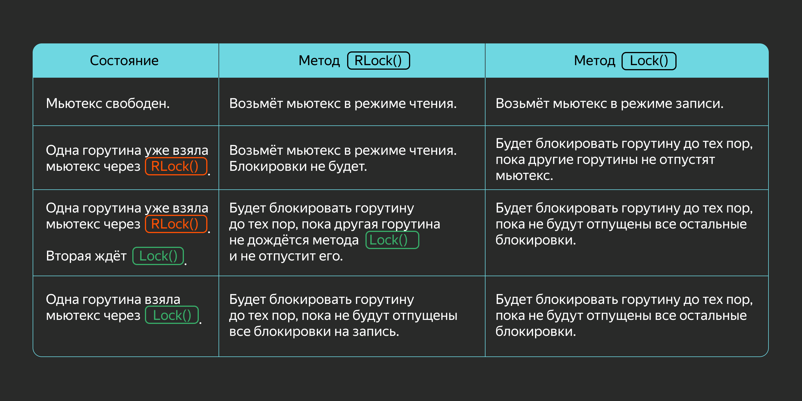

Переделаем наш код таким образом, чтобы читать из мапы могли несколько горутин, а записывать в неё — только одна.

```go
package main

import (
    "fmt"
    "math/rand"
    "sync"
    "time"
)

func main() {
    // меняем тип мьютекса
    var m sync.RWMutex
    cache := map[int]int{}

    for i := 0; i < 10; i++ {
        go func() {
            for {
                // здесь остаются блокировки на запись
                m.Lock()
                cache[rand.Intn(5)] = rand.Intn(100)
                m.Unlock()
                time.Sleep(time.Second / 20)
            }
        }()
    }

    for i := 0; i < 10; i++ {
        go func() {
            for {
                // при чтении используем Rlock() и RUnlock()
                m.RLock()
                fmt.Printf("%#v\n", cache)
                m.RUnlock()
                time.Sleep(time.Second / 100)
            }
        }()
    }

    time.Sleep(1 * time.Second)
}
```

Результат:
```
map[int]int{}
map[int]int{0:85, 1:72, 2:72, 3:75, 4:66}
map[int]int{0:85, 1:72, 2:72, 3:75, 4:66}
map[int]int{0:85, 1:72, 2:72, 3:75, 4:66}
map[int]int{0:85, 1:72, 2:72, 3:75, 4:66}
map[int]int{0:85, 1:72, 2:72, 3:75, 4:66}
map[int]int{0:85, 1:72, 2:72, 3:75, 4:66}
map[int]int{0:85, 1:72, 2:72, 3:75, 4:66}
map[int]int{0:85, 1:72, 2:72, 3:75, 4:66}
map[int]int{0:85, 1:72, 2:72, 3:75, 4:66}
map[int]int{0:85, 1:72, 2:72, 3:75, 4:66}
map[int]int{0:85, 1:72, 2:72, 3:75, 4:66}
map[int]int{0:85, 1:72, 2:72, 3:75, 4:66}
map[int]int{0:85, 1:72, 2:72, 3:75, 4:66}
map[int]int{0:85, 1:72, 2:72, 3:75, 4:66}
map[int]int{0:85, 1:72, 2:72, 3:75, 4:66}
map[int]int{0:85, 1:72, 2:72, 3:75, 4:66}
map[int]int{0:85, 1:72, 2:72, 3:75, 4:66}
map[int]int{0:85, 1:72, 2:72, 3:75, 4:66}
map[int]int{0:85, 1:72, 2:72, 3:75, 4:66}
map[int]int{0:85, 1:72, 2:72, 3:75, 4:66}
map[int]int{0:85, 1:72, 2:72, 3:75, 4:66}
map[int]int{0:85, 1:72, 2:72, 3:75, 4:66}
map[int]int{0:85, 1:72, 2:72, 3:75, 4:66}
map[int]int{0:85, 1:72, 2:72, 3:75, 4:66}
ma
...
39798 bytes truncated
```

*Обратите внимание! Для снятия блокировки на чтение и запись необходимо использовать разные методы: при `RLock()` используется `RUnlock()`, а при `Lock()` — `Unlock()`.*

___
Рассмотрите код. Каким будет результат его работы? Выберите правильный вариант. 

Подсказка: похожий пример мы рассматривали в начале главы о примитивах синхронизации.

```go
func main() {
    m := make(map[int]int)

    for i := 0; i < 100; i++ {
        go func(v int) {
            m[v] = 1
        }(i)
    }
    time.Sleep(1 * time.Second)
    fmt.Println(len(m))
}
```

~~Неопределённое поведение. (Выведет 100 или ошибку `fatal error: concurrent map writes`.)~~
___
Исправьте код из предыдущего задания так, чтобы программа выполнялась корректно и выводила `100`. Подсказка: используйте `sync.Mutex` при изменении мапы.

Решение:
```go
package main

import (
    "fmt"
    "sync"
    "time"
)

func main() {
    var mu sync.Mutex
    m := make(map[int]int)

    for i := 0; i < 100; i++ {
        go func(v int) {
            mu.Lock()
            m[v] = v
            mu.Unlock()
        }(i)
    }
    time.Sleep(1 * time.Second)
    fmt.Println(len(m))
}
```
___

### Тип sync.Cond

Представьте, что горутина ждёт изменения определённых условий. Чтобы она постоянно не делала проверки, можно «усыпить» её до получения сигнала. Для этого используется **переменная условия** (от англ. condition variable) — примитив синхронизации, который блокирует один или несколько потоков до получения сигнала от другого потока.

Мьютекс блокирует другие горутины, а переменная условия работает по обратному принципу. Одна горутина переменной условия блокирует сама себя, а другим горутинам нужно её «пробудить», то есть освободить.

Переменная типа `sync.Cond` содержит локер-поле `L` типа `sync.Locker`, значениями которого выступают типы `*sync.Mutex` или `*sync.RWMutex`. Значение `L` передаётся в функции `sync.NewCond(l Locker) *Cond`. 

Есть три метода для работы с переменной условия:
- `(*Cond) Wait()` — разблокирует локер `L` и вводит текущую горутину в режим ожидания до получения сигнала. При получении сигнала локер `L` блокируется, и выполняется следующий после `Wait` код. Горутина должна заблокировать `L` перед вызовом `Wait`. Чаще всего встречаются такие варианты использования этого метода:
```go
// вариант 1
c.L.Lock()
c.Wait()
// производим нужные действия
// ...
c.L.Unlock()

// вариант 2
c.L.Lock()
for !condition() {
    c.Wait()
}
// производим нужные действия
// ...
c.L.Unlock()
```
- `(*Cond) Signal()` — разблокирует одну из ожидающих горутин, если такие есть.
- `(*Cond) Broadcast()` — разблокирует все горутины в очереди.

Диалог:
- Почему вызывается `Lock()` перед `Wait()`, а `Unlock()` — после? И обязательны ли эти вызовы?
- Дело в том, что в начале метода `Wait()` происходит разблокировка мьютекса `L` и текущая горутина встаёт в режим ожидания сигнала. Когда приходит сигнал, мьютекс `L` блокируется и `Wait()` завершает работу. Именно поэтому мы должны лочить мьютекс перед вызовом `Wait()` и не забывать освобождать его после.
- Нужен пример.
- `sync.Cond` встречается гораздо реже, чем мьютексы или каналы. `sync.Cond` удобно использовать, когда требуется многократное уведомление о событии неопределённого круга подпиcчиков (горутин).

Разберём пример. При изменении значения переменной нужно, чтобы её обработали несколько разных горутин (воркеров). Для оповещения всех ожидающих горутин будем использовать метод `Broadcast()`. Удобно, что функция, которая отправляет Broadcast-сигнал не знает, сколько запущено воркеров и не должна об этом думать:
```go
package main

import (
    "fmt"
    "sync"
    "time"
)

func startWorkers(c *sync.Cond, val *int) {
    workerCount := 3

    for i := 0; i < workerCount; i++ {
        go func(workerId int) {
            c.L.Lock()
            for {
                c.Wait()
                // получили сигнал
                fmt.Printf("val %v processed by worker %v\n", *val, workerId)
            }
        }(i)
    }
}

func main() {
    var m sync.Mutex
    c := sync.NewCond(&m)
    val := 0
    startWorkers(c, &val)
    // ждём, чтобы стартанули все воркеры
    time.Sleep(100 * time.Millisecond)

    for i := 0; i < 4; i++ {
        m.Lock()
        val = i
        fmt.Printf("set val to %v\n", val)
        // отправляем сигнал всем воркерам
        c.Broadcast()
        m.Unlock()
        time.Sleep(time.Millisecond)
    }
}
```

Результат:
```
set val to 0
val 0 processed by worker 1
val 0 processed by worker 2
val 0 processed by worker 0
set val to 1
val 1 processed by worker 0
val 1 processed by worker 1
val 1 processed by worker 2
set val to 2
val 2 processed by worker 2
val 2 processed by worker 0
val 2 processed by worker 1
set val to 3
val 3 processed by worker 1
val 3 processed by worker 2
val 3 processed by worker 0
```

Перечислим ещё раз рассмотренные примитивы синхронизации. 

Если нужно, чтобы часть кода выполнялась только одной горутиной, то следует использовать примитив `sync.Mutex` и управлять его состоянием методами `Lock()` и `Unlock()`. 

Если происходят операции чтения и записи, то можно воспользоваться мьютексом типа `sync.RWMutex`, который позволяет горутинам одновременно читать данные и за счёт этого увеличивает скорость работы. 

Примитив `sync.Cond` даёт горутинам возможность обмениваться сигналами, в том числе отправлять сигнал всем подписчикам. Эта возможность используется редко: в большинстве случаев для обмена сигналами удобнее использовать каналы. О них мы расскажем в следующем уроке.

### Потокобезопасный контейнер для хранения объектов

Представьте ситуацию: в вашей программе постоянно нужно создавать временные объекты для небольшой задачи, после которго они становятся не нужны. 
Например, это могут быть длинные слайсы или буферы с байтами, которые используются для временного хранения данных.

Постоянное создание больших объектов с нуля требует выделения новой памяти, что может сказаться на производительности. 
В таких случаях удобно переиспользовать один объект несколько раз, чтобы избежать новых аллокаций.

Посмотрите на следующий пример. 
В функции foo каждый раз создается новый буфер.

```go
package main

import (
    "bytes"
    "fmt"
)

func main() {
    for i := 0; i < 10; i++ {
        foo()
    }
}

func foo() {
    // Создание нового буфера
    var buff bytes.Buffer
    
    buff.WriteString("Foo")
    buff.WriteString("Bar")
    buff.WriteString("Buzz")
    // ...
    
    fmt.Println(buff.String())
}
```

Результат:
```
FooBarBuzz
FooBarBuzz
FooBarBuzz
FooBarBuzz
FooBarBuzz
FooBarBuzz
FooBarBuzz
FooBarBuzz
FooBarBuzz
FooBarBuzz
```

### Тип sync.Pool

Одно из решений — переиспользовать один буфер несколько раз после создания. 
Для того, чтобы безопасно использовать один объект в нескольких потоков, в Go существует примитив `sync.Pool`.

Его методы `Put` и `Get` позволяют сохранить объект в пул и получить его обратно.

Посмотрите, как можно изменить предыдущий пример с использованием `sync.Pool`:
```go
package main

import (
    "bytes"
    "fmt"
    "sync"
)

var bufferPool = sync.Pool{
    // Функция New сработает, если в пуле нет объекта
    New: func() interface{} {
        return new(bytes.Buffer)
    },
}

func main() {
    for i := 0; i < 10; i++ {
        foo()
    }
}

func foo() {
    buff := bufferPool.Get().(*bytes.Buffer)
    // В конце отправляем буфер обратно в пул, чтобы переиспользовать 
    defer bufferPool.Put(buff)
    
    // Сбрасываем буфер перед использованием, но выделенная память сохранится
    buff.Reset()
    
    buff.WriteString("Foo")
    buff.WriteString("Bar")
    buff.WriteString("Buzz")
    // ...
    
    fmt.Println(buff.String())
}
```

Результат:
```
FooBarBuzz
FooBarBuzz
FooBarBuzz
FooBarBuzz
FooBarBuzz
FooBarBuzz
FooBarBuzz
FooBarBuzz
FooBarBuzz
FooBarBuzz
```

В результате `sync.Pool` дает следующие преимущества:
- Потокобезопасный, можно получать объекты из нескольких потоков,
- Можно настроить функцию-конструктор, которая будет создавать начальные объекты (если контейнер пустой),

К тому же, `sync.Pool` позволяет сохранить несколько объектов. 
Однако пул не гарантирует порядок извлечения этих объектов с помощью метода `Get`.

В следующем сниппете показан пример, в котором в пул помещается и извлекается 10 чисел.

```go
package main

import (
    "fmt"
    "sync"
)

func main() {
    var intPool sync.Pool
    for i := 0; i < 10; i++ {
        intPool.Put(i)
    }
    
    for i := 0; i < 10; i++ {
        fmt.Print(intPool.Get())
    }
}
```
Результат
```
0987654321
```

___
В следующем сниппете функция `concat` использует буфер для конкатенации (объединения нескольких строк в одну) массива строк. Измените код с использованием `sync.Pool`, чтобы переиспользовать буфер между несколькими конкатенациями.

```go
package main

import (
    "bytes"
    "fmt"
    "sync"
)

type StringMerger struct {
    buffPool sync.Pool
}

func NewStringMerger() *StringMerger {
    return &StringMerger{}
}

func (s *StringMerger) Merge(strings ...string) string {
    // TODO Исправьте код так, чтобы один буфер мог быть переиспользован для разных конкатенаций.
    
    var buff bytes.Buffer
    for _, s := range strings {
        buff.WriteString(s)
    }
    return buff.String()
}

func main() {
    stringConcat := NewStringMerger()
    
    firstString := stringConcat.Merge("Foo", "Bar", "Buzz")
    secondString := stringConcat.Merge("This is ", "a test line.")
    thirdString := stringConcat.Merge("Hello", ", ", "World!")
    
    _, _ = firstString, secondString
    fmt.Println(thirdString)
}
```

Результат:
```
Hello, World!
```

Подсказка:
В конструкторе `NewStringMerger` настройте функцию создания нового буфера. 
Используйте этот буфер в функции `Merge`.

Решение:
```go
package main

import (
    "bytes"
    "fmt"
    "sync"
)

type StringMerger struct {
    buffPool sync.Pool
}

func NewStringMerger() *StringMerger {
    merger := StringMerger{}
    // Настраиваем функцию создания нового буфера
    merger.buffPool = sync.Pool{
        New: func() interface{} {
            return new(bytes.Buffer)
        },
    }
    return &merger
}

func (s *StringMerger) Merge(strings ...string) string {
    buff := s.buffPool.Get().(*bytes.Buffer)
    defer s.buffPool.Put(buff)
    
    buff.Reset()
    for _, s := range strings {
        buff.WriteString(s)
    }
    return buff.String()
}

func main() {
    stringConcat := NewStringMerger()
    
    firstString := stringConcat.Merge("Foo", "Bar", "Buzz")
    secondString := stringConcat.Merge("This is ", "a test line.")
    thirdString := stringConcat.Merge("Hello", ", ", "World!")
    
    _, _ = firstString, secondString
    fmt.Println(thirdString)
}
```
___
В последнем задании вы сможете проверить знания по мьютексам и `WaitGroup` — ключевым элементам при работе с горутинами. Найдите в программе ошибки и исправьте их. Программа должна завершаться без ошибок, а мапа всегда должна содержать 100 элементов.

```go
package main

import (
    "fmt"
    "sync"
)

func main() {
    var (
        mu sync.Mutex
        wg sync.WaitGroup
    )
    m := make(map[int]int)
    for i := 0; i < 10; i++ {
        go func(v int) {
            wg.Add(1)
            for j := 0; j < 10; j++ {
                mu.Lock()
                defer mu.Unlock()

                k := 10*v + j
                m[k] = k
            }
            wg.Done()
        }(i)
    }
    wg.Wait()
    fmt.Println(len(m))
}
```

Результат:
```
0
```

Решение:
```go
package main

import (
    "fmt"
    "sync"
)

func main() {
    var (
        mu sync.Mutex
        wg sync.WaitGroup
    )
    m := make(map[int]int)
    for i := 0; i < 10; i++ {
        wg.Add(1)
        go func(v int) {
            for j := 0; j < 10; j++ {
                k := 10*v + j
                mu.Lock()
                m[k] = k
                mu.Unlock()
            }
            wg.Done()
        }(i)
    }
    wg.Wait()
    fmt.Println(len(m))
}
```
___

Это был непростой урок, но вы справились! Вы узнали, как создавать горутины и  разграничивать доступ из горутин к общим ресурсам. Работа с горутинами не всегда проста, но она действительно позволяет значительно ускорить выполнение программы и улучшить её производительность. В следующем уроке расскажем о работе с каналами и атомарными операциями.

## Дополнительные материалы
- [GO Scheduler: теперь не кооперативный?](https://habr.com/ru/post/502506/)
- [Как планировщик горутин управляет очередями.](https://calvinfeng.gitbook.io/gonotebook/concurrency/04-01-go-routines)
- [Как планировщик горутин работает с системными вызовами.](https://medium.com/a-journey-with-go/go-goroutine-os-thread-and-cpu-management-2f5a5eaf518a)
- [Примитивы синхронизации в Go.](https://medium.com/german-gorelkin/synchronization-primitives-go-8857747d9660)
- [Concurrency Synchronization Techniques Provided in the sync Standard Package.](https://go101.org/article/concurrent-synchronization-more.html)
- [Планирование в Go: Часть I — Планировщик ОС.](https://habr.com/ru/post/478168/)
- [Планирование в Go: Часть II — Планировщик Go.](https://habr.com/ru/post/489862/)

# Каналы

В прошлом уроке вы познакомились с горутинами и примитивами синхронизации. В этом вы узнаете о ещё одном инструменте для работы с горутинами — **каналах** (channels). 

Каналы позволяют отправлять значения определённого типа между горутинами и могут синхронизировать их работу. Кроме каналов, в этом уроке рассмотрим оператор `select` и атомарные операции.

## Создание каналов

Каналы создаются функциями `make(chan тип_элемента)` или `make(chan тип_элемента,  ёмкость_канала)`. В первом случае создастся небуферизированный канал, а во втором — буферизированный. 

Операции чтения и записи в небуферизированный канал ожидают, когда другая горутина соответственно запишет или прочитает данные. Буферизированный канал накапливает данные. Когда канал пуст, горутина встаёт в режим ожидания при чтении. Когда канал полон, горутина встаёт в режим ожидания при записи. 

Работа с буферизированным каналом сводится к следующему: горутина записывает данные в канал, пока он не заполнится, а принимающая горутина может читать из этого канала, пока он не станет пустым. Когда канал полон, отправляющая горутина блокируется и ждёт, пока принимающая горутина не заберёт хотя бы одно значение. То же самое происходит и на другой стороне. Принимающая горутина находится в ожидании (блокируется), когда канал пустой, но оживает и начинает читать данные, как только в канал попадает хотя бы одно значение.

```go
// создать канал для значений типа int
ch1 := make(chan int)

// создать буферизированный канал для 5 элементов для значений типа string
ch2 := make(chan string, 5)

// создать канал для структур типа MyType
ch3 := make(chan MyType) 
```

Иногда необходимо получить текущее количество элементов в канале и его ёмкости. Например, если нужно проверить, полон ли канал, чтобы не посылать туда данные, а выполнить другие действия. Для этого используются функции `len(ch)` и `cap(ch)`.

Оператор `ch <- v` отправляет значение `v` в канал `ch`. Для получения значения из канала используется оператор `<- ch`. Этот вариант применяется, когда получаемое значение не важно. Если нужно сохранить значение, то слева указывается оператор присваивания `v := <-ch`.

Все важные отличия буферизированных и небуферизированных каналов представлены в таблице ниже.

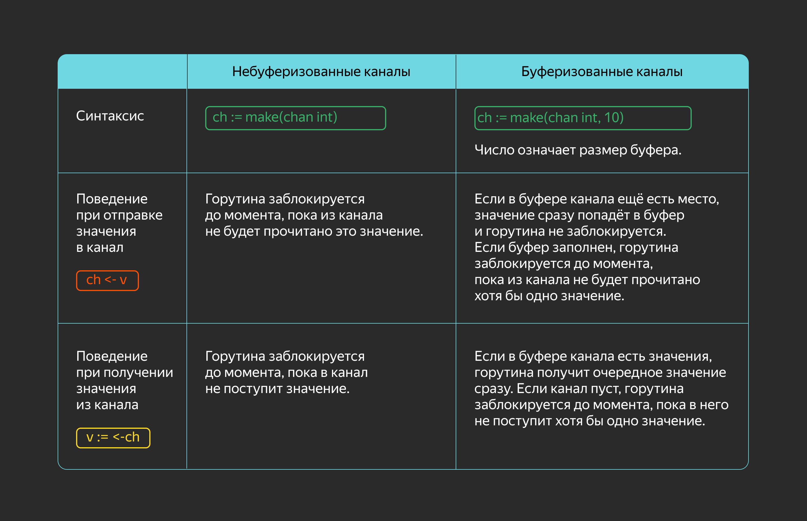

Теперь перейдём к примеру. Предположим, в программе есть два канала. В один записываются числа, в другой — отправляется сумма двух чисел из первого канала.

```go
package main

import (
    "fmt"
    "time"
)

func main() {
    chIn := make(chan int, 50)
    chOut := make(chan int)

    go func() {
        // горутина берёт числа из chIn
        for {
            left := <-chIn
            right := <-chIn
            // получаем два числа из chIn и записываем их сумму в chOut
            chOut <- left + right
        }
    }()

    go func() {
        // горутина берёт числа из chOut
        for {
            s := <-chOut
            // пусть обработка значений из chOut занимает какое-то время
            time.Sleep(20 * time.Millisecond)
            if s%10 == 1 {
                fmt.Printf("%d ", s)
            }
        }
    }()
    // отправляем сто чисел в канал chIn
    for i := 0; i < 100; i++ {
        chIn <- i
    }
    fmt.Printf("# ")
    time.Sleep(time.Second)
}
```

Вывод программы будет отличаться для разных значений ёмкости канала `chIn`.

```
// для chIn := make(chan int)
1 21 41 61 81 101 121 141 161 181 # 

// для chIn := make(chan int, 50)
1 21 41 61 81 # 101 121 141 161 181 

// для chIn := make(chan int, 100)
# 1 21 41 61 81 101 121 141 161 181
```

Чем больше ёмкость канала, тем быстрее происходит отправка чисел. При ёмкости равной 100 все числа сразу помещаются в канал.

Если горутина больше не будет отправлять значения в канал и на это нужно указать принимающим горутинам, то канал следует закрыть. Для этого нужно вызвать функцию `close(ch)`. Когда другие горутины попытаются получить значение из закрытого канала, им будут возвращаться нулевые значения. 

Если горутина отправит данные в закрытый канал, это приведёт к панике. Поэтому каналы закрывать не нужно, если нет увереннности, что туда не будут записываться данные. Когда канал перестанет использоваться и на него не будет активных ссылок, сборщик мусора освободит занимаемую каналом память независимо от того, закрыт он или нет.

Проверить, закрыт канал или нет, можно так: `i, ok := <-ch`. Если канал закрыт, значение `ok` будет равно `false`. Получение двух значений используется, когда необходимо отличать нулевое значение, отправленное в канал, от нулевого значения, возвращаемого из закрытого канала.

```go
package main

import (
    "fmt"
)

func main() {
    ch := make(chan int, 1)
    
    // так как ёмкость канала больше 0, то можно записать
    // одно значение не ожидая, когда оно прочитается
    ch <- 10

    // попробуем закрыть канал, в котором есть значение
    close(ch)

    fmt.Println("len =", len(ch), "cap =", cap(ch))
    
    v, opened := <-ch
    fmt.Println(v, opened, "len =", len(ch))
    
    v, opened = <-ch
    fmt.Println(v, opened, "len =", len(ch))
}
```

Вывод программы показывает, что канал закрылся только после того, как было прочитано значение и его размер стал равен 0.

```
len = 1 cap = 1
10 true len = 0
0 false len = 0 
```

Напомним, что канал создаётся функцией `make()`. Если вы просто определите переменную типа `chan`, она, как и в случае со слайсами, будет равна `nil`. Таким образом, есть три состояния канала: 
- равен `nil`;
- инициализирован и не закрыт;
- закрыт.

Изучите таблицу. В ней — результаты основных операций для каждого состояния:
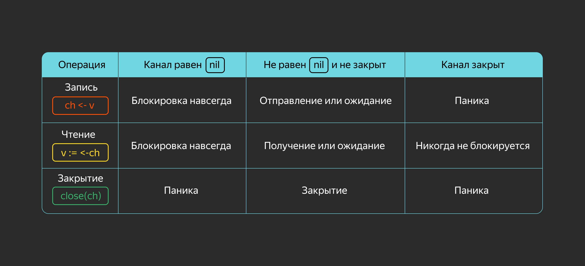

Если ни одна горутина не может продолжить работу, рантайм завершает программу с ошибкой `fatal error: all goroutines are asleep - deadlock!`.

Рассмотрим использование каналов на практике. Допустим, вы разрабатываете сервис, который меняет размер изображения. Ресайзинг картинок — долгая операция. Возникла идея запустить N горутин, где N равно количеству ядер процессора. По задумке каждая горутина будет получать картинку из очереди и менять размер.

В примере рассмотрим три сущности:
- `Queue` — очередь задач, которую реализуем с помощью каналов;
- `Resizer` — модуль, который ресайзит картинки;
- `Worker` — воркер, который вытаскивает задачу из очереди и обрабатывает её.

```go
package main

import (
    "fmt"
    "runtime"
    "time"
)

// Task содержит имя файла для конвертации
type Task struct {
    Filename string
}

// Queue - это очередь задач
type Queue struct {
    ch chan *Task
}

func NewQueue() *Queue {
    return &Queue{
        ch: make(chan *Task, 1),
    }
}

func (q *Queue) Push(t *Task) {
    // добавляем задачу в очередь
    q.ch <- t
}

func (q *Queue) PopWait() *Task {
    // получаем задачу
    return <-q.ch
}

type Resizer struct {
    Width  uint32
    Height uint32
}

func NewResizer(w, h uint32) *Resizer {
    return &Resizer{
        Width:  w,
        Height: h,
    }
}

func (r *Resizer) Resize(filename string) error {
    // пропустим реализацию
    time.Sleep(10 * time.Millisecond)
    return nil
}

type Worker struct {
    id      int
    queue   *Queue
    resizer *Resizer
}

func NewWorker(id int, queue *Queue, resizer *Resizer) *Worker {
    w := Worker{
        id:      id,
        queue:   queue,
        resizer: resizer,
    }
    return &w
}

func (w *Worker) Loop() {
	for {
        t := w.queue.PopWait()

        err := w.resizer.Resize(t.Filename)
        if err != nil {
            fmt.Printf("error: %v\n", err)
            continue
        }

        fmt.Printf("worker #%d resized %s\n", w.id, t.Filename)
    }
}

func main() {
    queue := NewQueue()

    for i := 0; i < runtime.NumCPU(); i++ {
        w := NewWorker(i, queue, NewResizer(1024, 1024))
        go w.Loop()
    }

    for i := 0; i < 50; i++ {
        imagefile := fmt.Sprintf("gopher%d.jpg", i)
        queue.Push(&Task{Filename: imagefile})
    }

    time.Sleep(time.Second)
}
```

Таким образом, используя каналы, удалось реализовать очередь с минимальным количеством кода.

___
Проверьте себя. Не запуская код, определите, каким будет результат его выполнения.
~~В результате получим взаимную блокировку (Взаимная блокировка возникнет потому, что нет другой горутины, которая читает канал.)~~
___

При запуске следующей программы происходит ошибка (взаимная блокировка). Найдите причину и исправьте её. Программа должна выводить 7.

```go
package main

import "fmt"

func main() {
    var ch chan int

    go func() {
        ch <- 7
    }()
    v := <-ch
    fmt.Println(v)
}
```

Подсказка:
Нужно создать канал функцией `make()`.

Решение:
```go
package main

import "fmt"

func main() {
    ch := make(chan int)

    go func() {
        ch <- 7
    }()
    v := <-ch
    fmt.Println(v)
}
```
___

## Операторы для работы с каналами

Оператор `range` позволяет в цикле принимать значения из канала до тех пор, пока он не будет закрыт. Например, горутина должна постоянно получать значения из канала и обрабатывать их определённым образом. `range` используется в канале, который закрывается, иначе он будет эквивалентен бесконечному циклу.

```go
for i := range ch {
    // тело цикла
}
```

Этот оператор эквивалентен такому циклу:
```go
for {
    i, ok := <-ch
    if !ok {
        break
    }
    // тело цикла
}
```

Пример кода:
```go
package main

import "fmt"

func fibonacci(n int, ch chan int) {
    x, y := 0, 1
    for i := 0; i < n; i++ {
        ch <- x // посылаем значения в канал
        x, y = y, x+y
    }

    close(ch) // закрываем канал
}

func main() {
    ch := make(chan int, 7)
    // специально делаем буфер канала меньше,
    // чем количество чисел Фибоначчи
    go fibonacci(15, ch)

    for i := range ch {
        // считываем значения из канала, пока он не будет закрыт
        fmt.Printf("%d ", i)
    }
}
```

Программа выведет: 
```
0 1 1 2 3 5 8 13 21 34 55 89 144 233 377
```

Как уже было сказано, горутина может заблокироваться и ждать готовности канала. Но что делать, если надо ждать сразу несколько каналов: в одном — результата функции, в другом — сигнала, что нужно завершить программу? Можно использовать оператор `select`.

Изучите его синтаксис:
```go
select {
case x := <-ch1:
    // сценарий выполнится, если быстрее всего новое значение окажется в канале ch1
case y := <-ch2:
    // сценарий выполнится, если быстрее всего новое значение окажется в канале ch2
case ch3 <- z:
    // сценарий выполнится, если быстрее отправим значение в канал ch3
}
```

Если не выполняется ни одно из условий, `select` переходит в режим ожидания. Когда без блокировки нужно проверить, есть ли новые сообщения, необходимо добавить секцию `default`. Она выполнится вместо перехода в режим ожидания, и управление перейдёт к следующему после `select` коду.

```go
select {
case x := <-ch1:
    // ...
case ch3 <- z:
    // ...
default:
    // код выполнится, если не подошёл ни один из вариантов выше
    // ...
}
```

**Важно**
В операторе `select` выполняется только один из блоков `case`. Если несколько условий срабатывают одновременно, то вариант выбирается случайным образом: порядок `case` не имеет значения. Если нужно постоянно проверять условия оператора, поместите `select` в цикл.

Оператор `select` позволяет использовать `break` внутри секций, но `break` обеспечивает только выход из `select`. Чтобы прервать цикл с `select`, применяют следующие подходы:
- выход из функции по `return`;
- изменение условия, которое проверяется в цикле;
- `break` с указанием метки цикла.

Пример:
```go
package main

import "fmt"

func fibonacci(ch chan int, quit chan bool) {
    x, y := 0, 1
loop: // метка цикла
    for {
        select {
        case ch <- x: // ждём, когда заберут значение из канала,
                      // чтобы сгенерировать следующее
            x, y = y, x+y
        case <-quit:  // параллельно ждём сигнала об окончании работы
            break loop
        }
    }
    fmt.Println("Выход")
}

func main() {
    ch := make(chan int)
    quit := make(chan bool)

    go func() {
        for i := 0; i < 15; i++ {
            fmt.Println(<-ch)
        }
        // подаём сигнал об окончании работы
        quit <- true
    }()

    fibonacci(ch, quit)
}
```

Результат:
```
0
1
1
2
3
5
8
13
21
34
55
89
144
233
377
Выход
```

`select` может принимать данные из нескольких каналов, но некоторые из этих каналов могут закрыться в процессе работы. Так как из закрытого канала возвращаются нулевые значения, `select` по-прежнему будет выполнять соответствующий ему блок `case`. Чтобы этого избежать, можно присвоить закрытому каналу `nil` — тогда оператор `select` будет пропускать варианты с нулевыми каналами.

```go
for {
    select {
    // этот вариант будет пропускаться, если ch == nil
    case v, ok := <-ch:
        if !ok {
            ch = nil
            continue
        }
        // ...
    }
}
```

Разберём, в каких случаях можно использовать закрытые каналы. Предположим, надо завершить работу программы и оповестить об этом горутины, в которых есть оператор `select`. Для этого создадим канал `done := make(chan struct{})`. Его будут читать все горутины. 

Каналы с пустой структурой часто используются для оповещений о событиях. Если отправить пустую структуру в канал `done`, то его получит только одна горутина. Но нужно отправить сигнал всем горутинам. Так как закрытый канал отдаёт нулевые значения в неблокирующем режиме, достаточно закрыть канал, чтобы оповестить о событии все потоки.

```go
package main

var done = make(chan struct{})

func worker(wg *sync.WaitGroup, i int) {
    for {
        select {
        case <-done:
            fmt.Println("Завершаем", i)
            wg.Done()
            return
        default:
            fmt.Println(i)
        }
        time.Sleep(50 * time.Millisecond)
    }
}

func main() {
    var wg sync.WaitGroup

    // создаём горутины
    for i := 0; i < 10; i++ {
        wg.Add(1)
        go worker(&wg, i)
    }
    time.Sleep(1 * time.Second)
    // сообщаем горутинам о завершении работы
    close(done)
    // ждём завершения всех горутин
    wg.Wait()
}
```

___
Ниже приведена программа, которая получает значения из одного канала и отправляет удвоенные значения в другой канал. Но есть одна проблема: иногда последние значения не печатаются. Пример вывода: `0 2 4 6 8 10 12 14 16 18 20 22 24`. Исправьте код, чтобы он работал правильно. Изменения нужно внести только в горутины.

```go
package main

import "fmt"

func main() {
    chIn := make(chan int)
    chOut := make(chan int)
    quit := make(chan struct{})

    go func() {
        for i := 0; i < 15; i++ {
            chIn <- i
        }
        close(quit)
    }()
    go func(){
       	var x int
        for {
            select {
            case x = <-chIn:
                chOut <- x * 2
            case <-quit:
                return
            }
        }
    }()
    go func() {
        for {
            fmt.Printf("%d ", <-chOut)
        }
    }()
    <-quit
}
```

Подсказка:
Можно обойтись без `select` и использовать операторы `range`.

Решение:
```go
package main

import "fmt"

func main() {
    chIn := make(chan int)
    chOut := make(chan int)
    quit := make(chan struct{})

    go func() {
        for i := 0; i <= 15; i++ {
            chIn <- i
        }
        close(chIn)
    }()
    go func(){
           for x := range chIn {
            chOut <- x * 2
        }
        close(chOut)
    }()
    go func() {
        for x := range chOut {
            fmt.Printf("%d ", x)
        }
        quit <- struct{}{}
    }()
    <-quit
}
```
___

## Однонаправленные каналы

Часто каналы передаются в аргументах функций. Внутри функций каналы используются только для отправки или получения данных. Если передаваемый в аргументе канал будет использоваться только для чтения или записи, то для параметра функции можно указать однонаправленный тип канала:
- `<-chan` — только для получения данных. Например, `par <-chan int`;
- `chan<-` — только для отправки данных. Например, `par chan<- string`.

Пример использования однонаправленных каналов:
```go
package main

import (
    "fmt"
    "strings"
)

// Generate отправляет в канал out односимвольные строки.
func Generate(out chan<- string) {
    for ch := 'a'; ch <= 'z'; ch++ {
        out <- string([]rune{ch})
    }
    close(out)
}

// Process читает строки из канала in, переводит их в верхний регистр
// и отправляет в канал out.
func Process(in <-chan string, out chan<- string) {
    for v := range in {
        out <- strings.ToUpper(v)
    }
    close(out)
}

func main() {
    lower := make(chan string)
    upper := make(chan string)
    go Generate(lower)
    go Process(lower, upper)

    // выводим строки из канала upper по мере получения
    for s := range upper {
        fmt.Print(s)
    }
}
```

Программа выведет: 
```
ABCDEFGHIJKLMNOPQRSTUVWXYZ
```

___
Представьте, что вы написали простенький код с каналами. Пока вы пили чай, ваша кошка прошлась по клавиатуре и удалила часть кода: надеемся, она сделала это неспециально. Теперь вам нужно восстановить текст программы.

```go
package main

import "fmt"

func process(in1, in2 <-chan int, out chan<- int) {
loop:
	for {
		select {
		case x, ok := <-in1:
			if !ok {
				break 
			}
			out <- x * 2
		case x, ok := :
			if !ok {
				break loop
			}
			out <- x * 3
		}
	}
	close()
}

func main() {
	ch1 := make(chan int)
	ch2 := make(chan int)
	chout := make(chan int)

	go func() {
		for i := 0; i <= 20; i++ {
			select {
			case <- i:
			case ch2 <- i:
			}
		}
		close(ch1)
		close()
	}()
	go process(ch1, ch2, )
	for i := range chout {
		fmt.Printf("%d ", i)
	}
}
```

Подсказка:
Были удалены следующие фрагменты: `loop`, `<-in2`, `out`, `ch1`, `ch2`, `chout`.

Решение:
```go
package main

import "fmt"

func process(in1, in2 <-chan int, out chan<- int) {
loop:
    for {
        select {
        case x, ok := <-in1:
            if !ok {
                break loop
            }
            out <- x * 2
        case x, ok := <-in2:
            if !ok {
                break loop
            }
            out <- x * 3
        }
    }
    close(out)
}

func main() {
    ch1 := make(chan int)
    ch2 := make(chan int)
    chout := make(chan int)

    go func() {
        for i := 0; i <= 20; i++ {
            select {
            case ch1 <- i:
            case ch2 <- i:
            }
        }
        close(ch1)
        close(ch2)
    }()
    go process(ch1, ch2, chout)
    for i := range chout {
        fmt.Printf("%d ", i)
    }
}
```

## Атомарные операции

Теперь разберём, что такое атомарные операции. Но для начала рассмотрим пример, в котором будем увеличивать значение общего счётчика одновременно из разных горутин:
```go
package main

import (
    "fmt"
    "sync"
)

func count() {
    var counter int64

    var wg sync.WaitGroup

    // горутины увеличивают значение счётчика
    for i := 0; i < 25; i++ {
        wg.Add(1)
        go func() {
            for i := 0; i < 2000; i++ {
                counter++
            }
            wg.Done()
        }()
    }
    wg.Wait()
    fmt.Printf("%d ", counter)
}

func main() {
    // делаем несколько попыток
    for i := 0; i < 5; i++ {
        count()
    }
}
```

Если запустить эту программу, то она выведет примерно следующее:
```
41131 47906 42555 50000 47864
```

Это происходит из-за поэтапного увеличения счётчика:
1. Берём текущее значение переменной.
1. Увеличиваем его на 1.
1. Записываем новое значение в переменную.

Эти операции очень быстрые. Но если имеется много горутин, которые постоянно меняют значение переменной, то может возникнут такая ситуация:
- горутина 1: получает значение (1);
- горутина 1: увеличивает его на 1 (2);
- горутина 2: получает значение (1);
- горутина 1: записывает значение (2);
- горутина 2: увеличивает значение на 1 (2);
- горутина 2: записывает значение (2).

Обе горутины увеличивали счётчик, но он изменился только на 1. В таких случаях нужно использовать мьютексы. Однако при очень большом количестве операций, мьютексы будут замедлять работу программы. Поэтому для изменения целочисленных значений были добавлены более быстрые **атомарные операции**.

Атомарные операции — это такие операции, которые выполняются за один шаг относительно других горутин. Для корректной работы рассмотренного примера необходимо, чтобы изменение счётчика было атомарной операцией. Только в таком случае можно избежать одновременного увеличения его двумя горутинами. 

В пакете `sync/atomic` стандартной библиотеки реализованы атомарные операции для типов: `int32`, `int64`, `uint32`, `uint64`, `uintptr`, `unsafe.Pointer`.

Ниже перечислены функции для типа `int64`. Пакет `sync/atomic` содержит аналогичные функции и для других типов.

- `AddInt64(addr *int64, delta int64)` — добавить `delta` к значению `addr`. Функция возвращает новое значение.
```go
    var addr int64
    atomic.AddInt64(&addr, 1)
```
- `CompareAndSwapInt64(addr *int64, old int64, new int64)` — сравнить значение `addr` с `old` и заменить на `new`, если они равны. Функция возвращает `true`, если значение `addr` было заменено.
```go
    var addr int64
    atomic.CompareAndSwapInt64(&addr, 0, 77)
```
- `SwapInt64(addr *int64, new int64)` — изменить значение `addr` на `new`. Функция возвращает предыдущее значение.
```go
    var addr int64
    old := atomic.SwapInt64(&addr, 3)
```
- `LoadInt64(addr *int64)` — разыменовать указатель и возвратить значение.
```go
    var addr int64
    val := atomic.LoadInt64(&addr)
```
- `StoreInt64(addr *int64, val int64)` — записать значение по указателю.
```go
    var addr int64
    atomic.StoreInt64(&addr, 5)
```

Переделаем пример с счётчиком, используя атомарные операции.
```go
package main

import (
    "fmt"
    "sync"
    "sync/atomic"
)

func count() {
    var counter int64

    var wg sync.WaitGroup

    // горутины увеличивают значение счётчика
    for i := 0; i < 25; i++ {
        wg.Add(1)
        go func() {
            for i := 0; i < 2000; i++ {
                atomic.AddInt64(&counter, 1)
            }
            wg.Done()
        }()
    }
    wg.Wait()
    fmt.Printf("%d ", atomic.LoadInt64(&counter))
}

func main() {
    // делаем несколько попыток
    for i := 0; i < 5; i++ {
        count()
    }
}
```

Сейчас программа выводит ожидаемый результат:
```
50000 50000 50000 50000 50000 
```

Также в пакете определены типы-обёртки: `atomic.Bool`, `atomic.Int32`, `atomic.Int64`, `atomic.Pointer` и так далее — с соответствующими методами. Перечислим методы для типа `atomic.Bool`:
```go
// CompareAndSwap сравнивает значение с `old` и в случае равенства заменяет
// на `new`. Метод возвращает `true`, если значение было заменено.
func (x *Bool) CompareAndSwap(old, new bool) (swapped bool)

// Load возвращает логическое значение.
func (x *Bool) Load() bool

// Store записывает значение в переменную.
func (x *Bool) Store(val bool)

// Swap изменяет значение на указанное и возвращает предыдущее значение.
func (x *Bool) Swap(new bool) (old bool)
```

Перепишем пример со счётчиком используя тип `atomic.Int64`.
```go
package main

import (
    "fmt"
    "sync"
    "sync/atomic"
)

func count() {
    var counter atomic.Int64

    var wg sync.WaitGroup

    // горутины увеличивают значение счётчика
    for i := 0; i < 25; i++ {
        wg.Add(1)
        go func() {
            for i := 0; i < 2000; i++ {
                counter.Add(1)
            }
            wg.Done()
        }()
    }
    wg.Wait()
    fmt.Printf("%d ", counter.Load())
}

func main() {
    // делаем несколько попыток
    for i := 0; i < 5; i++ {
        count()
    }
}
```

Результат:
```
50000 50000 50000 50000 50000 
```

Согласитесь, что код стал выглядеть приятнее.

___
Перед вами код, в котором горутины увеличивают значение счётчика. Чаще всего программа выводит неверное значение. Исправьте код так, чтобы значение счётчика было правильным.

```go
package main

import (
    "fmt"
    "sync"
)

var counter int64

func worker(wg *sync.WaitGroup) {
    for i := 0; i < 10000; i++ {
        counter++
    }
    wg.Done()
}
func main() {
    var wg sync.WaitGroup
    for i := 0; i < 20; i++ {
        wg.Add(1)
        go worker(&wg)
    }
    wg.Wait()
    // программа должна выводить 200000
    fmt.Println(counter)
}
```

Решение:
```go
// цикл в функции worker нужно изменить так
for i := 0; i < 10000; i++ {
    atomic.AddInt64(&counter, 1)
} 
```
___
Какая функция пакета `atomic` атомарно реализует то же, что функция `Foo`?
```go
func Foo(i *int64, v int64) int64 {
    ret = *i
    *i = v
    return ret
}
```

~~`SwapInt64` присваивает новое значение и возвращает предыдущее.~~
___
Не запуская код, определите, что выведет программа.
```go
func main() {
    ch := make(chan string, 1)
    ch <- "OK"
    fmt.Println(<-ch)
}
```

~~Взаимная блокировка не возникнет, так как канал буферизированный.~~
___

В этом уроке вы изучили основные принципы работы с каналами в Go. Рассмотрели, как создавать каналы, отправлять и получать данные через них, а также использовать операторы `select` и `range` для управления потоком данных. Вы изучили атомарные операции и узнали, как их применять в горутинах. Все эти знания пригодятся при создании эффективных и надежные мнопоточных программ.

## Дополнительные материалы

- [Channels in Go.](https://go101.org/article/channel.html)
- [Анатомия каналов в Go.](https://habr.com/ru/post/490336/)
- [Package sync/atomic.](https://pkg.go.dev/sync/atomic)

# Паттерны многопоточности: Генератор, Стоп-Кран, Паттерн обработки ошибок

В предыдущих уроках вы узнали о примитивах многопоточного программирования: горутинах, каналах, мьютексах. В этом уроке рассмотрим, как их компоновать  в паттерны, поддерживающие масштабируемость и удобство сопровождения будущих систем.

Горутины делают написание многопоточных программ проще. Но если к ним обращаться неосторожно, могут возникнуть ошибки, которые трудно заметить сразу. Избежать этих ошибок позволяют **паттерны** многопоточности. Паттерн (англ. pattern — «шаблон») — это устоявшийся способ решения типовой задачи или проблемы. В более широком смысле паттерн означает общепринятую практику, подход или договор между разработчиками.

**Паттерны многопоточности** — это повторяемая архитектурная конструкция, которая позволяет решать проблемы, связанные с разработкой многопоточных приложений. Как правило, паттерн — пример решения задачи, а не законченный образец, который можно использовать в коде. 

Некоторые паттерны в Go отличаются от распространённых шаблонов ООП. Это список практик, который содержит ответы на вопросы: как обрабатывать ошибки в горутинах, как остановить ненужные горутины, где закрыть канал и как организовать горутины для увеличения производительности программы. Этот список можно продолжать бесконечно. Но меньше слов — больше дела!

## Канал всегда должен быть закрыт ОТПРАВИТЕЛЕМ

Для начала разберём простой паттерн, который в будущем сэкономит ваше время. Каналы всегда нужно закрывать, чтобы избежать **утечки памяти**, или **утечки горутин**. При создании горутины выделяется память в куче. После завершения работы горутины, память освобождается. Утечка памяти происходит, когда горутина не завершается и зависает в фоновом режиме в течение всего времени существования приложения.

**Чтение из закрытого канала** даёт два параметра. Первый — это значение `nil`. Второй — логический параметр, который сообщает, открыт канал или нет (`true`, `false`).

```go
package main

import "fmt"

func main() {
    ch := make(chan int)
    close(ch)

    // чтение из канала: 0, false
    read, open := <-ch

    // отправка в канал: panic
    ch <- 1

    // эта строка никогда не выполнится, так как программа будет паниковать
    fmt.Printf("Прочитанные данные: %d, Канал открыт? %t", read, open)
}
```

**Отправка данных в закрытый канал** вызывает панику. Поэтому канал должен закрывать отправитель, а не получатель. Это предотвращает отправку данных отправителем в закрытый канал и обеспечивает согласованность.

```go
package main

import "fmt"

func main() {
    // создаём канал
    ch := make(chan int)

    // вызываем горутину отправителя
    go sender(ch)

    // вызываем получателя
    recipient(ch)
}

// sender отправляет в канал числа от 0 до 9
func sender(ch chan int) {
    for i := 0; i < 10; i++ {
        ch <- i
    }

    // закрываем канал после отправки
    close(ch)
}

// recipient забирает из канала значения и выводит на экран,
// когда канал закрыт, выходит из цикла и завершает функцию
func recipient(ch chan int) {
    // читаем данные из канала, пока он открыт
    for data := range ch {
        // и выводим их на экран
        fmt.Println(data)
    }
}
```

Результат:
```
0
1
2
3
4
5
6
7
8
9
```

В приведенном выше примере отправитель закрывает канал после отправки всех данных. Получатель автоматически выходит из цикла, когда канал закрывается.

___
Кто должен закрывать канал?
~~Отправитель должен закрывать канал, так как он знает, когда закончилась передача данных. Закрытие канала сообщает получателю, что данных больше не будет.~~

## Паттерн Генератор


Обычно многопоточная программа Go состоит из отправителей (producer) и получателей (consumer), которые общаются через канал. Отправитель генерирует поток данных и отправляет их по каналу для получателей. Паттерн Генератор генерирует данные в отдельной горутине, что позволяет параллельно обрабатывать их и создавать новые.

Механизм работает следующим образом: операция отправки или получения блокируется до тех пор, пока обе стороны - отправитель и получатель - не будут готовы. Это свойство позволяет синхронизировать передачу данных и, например, дождаться запроса следующего значения. Рассмотрим пример:
```go
package main

import "fmt"

func main() {
    // данные в слайсе, которые будем отправлять
    input := []int{1, 2, 3, 4, 5, 6}

    // получаем канал с данными из генератора
    inputCh := generator(input)

    // отправляем данные потребителю через канал inputCh
    consumer(inputCh)
}

// generator — генератор, который создает канал и сразу возвращает его
func generator(input []int) chan int {
    inputCh := make(chan int)

    // через отдельную горутину генератор отправляет данные в канал
    go func() {
        // закрываем канал по завершению горутины — это отправитель
        defer close(inputCh)

        // перебираем данные в слайсе
        for _, data := range input {
            // отправляем данные в канал inputCh
            inputCh <- data
        }
    }()

    // возвращаем канал inputCh
    return inputCh
}

// consumer — потребитель проходит через канал и одновременно обрабатывает
// данные из него (выводит на экран)
func consumer(inputCh chan int) {
    for data := range inputCh {
        fmt.Println(data)
    }
}
```

Результат:
```
1
2
3
4
5
6
```

*Обратите внимание, что генератор — отправитель — закрывает канал `inputCh`.*

Этот паттерн позволяет работать генератору и потребителю параллельно, не накапливая все данные в оперативной памяти. Благодаря этому снижается задержка до получения первого значения на выходе из обработчика, так как не нужно ждать, пока сгенерируются все данные. Такой подход позволяет обрабатывать большие объёмы данных, вплоть до бесконечных, используя небольшой объём памяти, достаточный для обработки одного элемента.

___
Реализуйте функцию `generator()`, используя основную функцию, чтобы получить следующий вывод:
```bash
❯ go run main.go
Hello 0
Hello 1
Hello 2
Hello 3
Hello 4
```

```go
package main

import "fmt"

func main() {
    ch := generator("Hello")
    for msg := range ch {
        fmt.Println(msg)
    }
}

// Тут ваш генератор
func generator(msg string) chan string {

}
```

Решение:
```go
package main

import "fmt"

func main() {
    ch := generator("Hello")
    for msg := range ch {
        fmt.Println(msg)
    }
}

func generator(msg string) chan string {
    ch := make(chan string)

    go func() {
        defer close(ch)
        for i := 0; i < 5; i++ {
            ch <- fmt.Sprintf("%s %d", msg, i)
        }
    }()

    return ch
}
```
___

## Паттерн обработки ошибок в горутинах

Горутины выполняются асинхронно, и их ошибки не передаются автоматически в основной поток. Это усложняет контроль за их выполнением и требует явной обработки ошибок. Для наглядности рассмотрим следующий пример:
```go
package main

import (
    "errors"
    "log"
    "time"
)

func main() {
    input := []int{1, 2, 3, 4}

    // генератор возвращает канал, который потом передаётся получателю
    inputCh := generator(input)

    // получатель, в который передаём канал
    go consumer(inputCh)

    // добавим секунду сна, чтобы выводились сообщения ошибки
    time.Sleep(time.Second)
}

// generator генерирует данные и отправляет их в канал inputCh, который потом закрывает, потому что он отправитель
func generator(input []int) chan int {
    inputCh := make(chan int)

    go func() {
        defer close(inputCh)

        for _, data := range input {
            inputCh <- data
        }
    }()
    return inputCh
}

// consumer читает данные из канала, отправляет в функцию, которая возвращает ошибку
func consumer(ch chan int) {
    // читаем данные из канала ch, пока он открыт
    for data := range ch {
        // получаем ошибку
        err := callDatabase(data)
        if err != nil {
            // не самый лучший способ обработки ошибок — вывод на экран
            log.Println(err)
        }
    }
}

// callDatabase функция обращения к базе данных, которая всегда возвращает ошибку
func callDatabase(data int) error {
    return errors.New("ошибка запроса к базе данных")
}
```

Если запустите этот код, то он выведет следующее:
```bash
$ go run main.go
2023/02/19 20:35:03 ошибка запроса к базе данных
2023/02/19 20:35:03 ошибка запроса к базе данных
2023/02/19 20:35:03 ошибка запроса к базе данных
2023/02/19 20:35:03 ошибка запроса к базе данных
```

В этом примере ошибки выводятся из горутины и никак не обрабатываются. Лучше всего передать ошибки в основной поток и обработать их там.

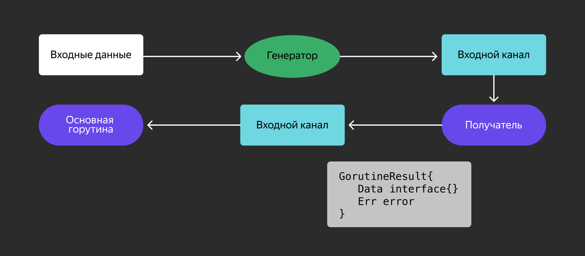

В следующем примере рассмотрим один из способов решения этой проблемы. Создадим новую структуру `Result`, которая объединит в себе результат и ошибку. В функции `consumer()` вызовем функцию `callDatabase()`, которая обращается к базе данных и возвращает определённое значение и ошибку. Далее создадим экземпляр структуры `Result` и отправим его через канал `resultCh`. Основная функция переберёт `resultCh`, обрабатывая результат и ошибку. Обратите внимание, что `consumer()` закрывает канал `resultCh`, так как он отправитель данных в этот канал.

```go
package main

import (
    "fmt"
    "errors"
)

// структура, в которую добавили ошибку
type Result struct {
    data int
    err error
}

func main() {
    // ваши данные
    input := []int{1, 2, 3, 4}

    // канал с результатами работы функции consumer
    resultCh := make(chan Result)

    // получаем канал с данными из генератора
    inputCh := generator(input)

    // порождаем горутину которая отправляет результат в resultCh вместе с ошибкой
    go consumer(inputCh, resultCh)

    // читаем результаты из канала resultCh
    for res := range resultCh {
        if res.err != nil {
            // здесь обрабатываем ошибку как обычно в Go
            log.Println("разберемся с ошибкой здесь")
        }
    }
}

// consumer вызывает другую функцию, которая возвращает ошибку
func consumer(inputCh chan int, resultCh chan Result) {
    // закрваем resultCh при завершении функции consumer
    defer close(resultCh)

    // перебираем данные из канала inputCh
    for data := range inputCh {
        // получаем ошибку
        resp, err := callDatabase(data)

        // создаем структуру
        result := Result{
            data: resp,
            err: err,
        }

        // отправляем структуру в канал
        resultCh <- result
    }
}

// generator отправляет данные в канал inputCh
func generator(input []int) chan int {
    // создаём канал, куда будем отправлять данные из слайса
    inputCh := make(chan int)

    // через отдельную горутину генератор отправляет данные в канал
    go func() {
        defer close(inputCh)

        // перебираем данные из слайса
        for _, data := range input {
            // отправляем данные в канал
            inputCh <- data
        }
    }()

    // возвращаем канал с данными
    return inputCh
}


// callDatabase просто возвращает ошибку как бы из функции обращения к базе данных
func callDatabase(data int) (int, error) {
    return data, errors.New("ошибка запроса к базе данных")
}
```

Запустите код. Получится примерно такой результат:
```bash
$ go run main.go
2023/02/19 20:03:43 разберёмся с ошибкой здесь
2023/02/19 20:03:43 разберёмся с ошибкой здесь
2023/02/19 20:03:43 разберёмся с ошибкой здесь
2023/02/19 20:03:43 разберёмся с ошибкой здесь
```

Ошибки в горутинах передаются обратно в основную горутину, которая уже знает, как их обработать.

Другой способ обработки ошибок — использование пакета `errgroup`. Он обеспечивает синхронизацию, распространение ошибок и отмену контекста для групп горутин, работающих над общей задачей. Если в одной из горутин возникает ошибка, она завершается, а ошибка возвращается. Горутины, которые уже выполняются, продолжат работу до завершения. Но ошибка будет возвращена только из той горутины, которая первая её сгенерировала. Разберём пример:
```go
package main

import (
    "context"
    "errors"
    "log"

    "golang.org/x/sync/errgroup"
)

func main() {
    // создаём переменную errgroup
    g := new(errgroup.Group)

    // наши данные
    input := []int{1, 2, 3, 4}

    // генератор возвращает канал, через который он отправляет данные
    inputCh := generator(input)

    for data := range inputCh {
        // тут объявляем новую переменную внутри цикла, чтобы копировать переменную
        // в замыкание каждой горутины, а не использовать одно общее на всех значение.
        data := data

        // потребитель должен возвращать ошибку.
        // сигнатура анонимной функции всегда такая как в примере.
        g.Go(func() error {
            // получаем ошибку
            err := callDatabase(data)
            if err != nil {
                // возвращаем ошибку
                return err
            }

            return nil
        })
    }

    // здесь ждём выполнения горутин, и если хотя бы в одной из них возникает ошибка,
    // то присваиваем её err и обрабатываем. В этом случае просто выводим на экран.
    // Обратите внимание, что g.Wait() ждёт завершения всех запущенных горутин, даже
    // если приозошла ошибка.
    if err := g.Wait(); err != nil {
        log.Println(err)
    }
}

// generator возвращает канал, а затем отправляет в него данные
func generator(input []int) chan int {
    // создаём канал данных
    inputCh := make(chan int)

    // вызываем горутину в которой отправляем данные в канал inputCh
    go func() {
        // по завершении горутины закрываем канал
        defer close(inputCh)

        // перебираем данные в слайсе
        for _, data := range input {
            // отправляем данные из слайса в канал
            inputCh <- data
        }
    }()

    // возвращаем канал с данными
    return inputCh
}

// callDatabase просто возвращает ошибку
func callDatabase(data int) error {
    // допустим ошибка возникнет когда data = 3
    if data == 3 {
        return errors.New("ошибка запроса к базе данных")
    }

    return nil
}
```

Обратите внимание, при запуске этого кода вывод лога будет состоять из одной ошибки. Это значит, что возвращается только первая ошибка, которая возникла в одной из горутин.

```bash
2025/02/19 21:17:40 ошибка запроса к базе данных
```

Получилось всего одно сообщение об ошибке. Пакет `errgroup` удобно использовать, когда нужно выполнить несколько параллельных задач и убедиться, что они успешно завершены. Если же произошла ошибка, то уже не важно, сколько их было, поскольку дальнейшая работа идёт по сценарию с ошибкой.

___
Чего ожидает `errgroup.Group.Wait()`?
~~Завершения всех горутин в группе, как с ошибками, так и без ошибок. `errgroup.Group.Wait()` позволяет дождаться завершения всех горутин и получить информацию о возникших ошибках. Этот подход к обработке ошибок наиболее удобен и безопасен.~~
___
Попробуем поприветствовать пользователей, имена которых есть в слайсе. Нужно создать метод `Hello() error` для типа `Name`, который выводит на экран приветствие `Hello <name>` и всегда возвращает `nil`. В основной функции нужно перебрать все элементы слайса и для каждого из них вызвать горутину через `errgroup`.

Метод `Group.Go(func() error)` из пакета [errgroup](https://pkg.go.dev/golang.org/x/sync/errgroup) принимает только функции без аргументов. Допишите код, чтобы всё правильно заработало:
```go
package main

import (
    "fmt"
    "golang.org/x/sync/errgroup"
)

type Name string

var names = []Name{"Anna", "Ivan", "Fedor", "Katya", "Gleb"}

// Здесь напишите метод для Name


func main() {
    g := &errgroup.Group{}

    // Вставьте ваш код здесь


    g.Wait()
}
```

Подсказка:
Используйте [method values](https://go.dev/ref/spec#Method_values).

Решение:
```go
package main

import (
    "fmt"

    "golang.org/x/sync/errgroup"
)

type Name string

var names = []Name{"Anna", "Ivan", "Fedor", "Katya", "Gleb"}

// Hello — метод типа Name.
func (n Name) Hello() error {
    fmt.Printf("Hello %v!\n", n)
    return nil
}

func main() {
    g := &errgroup.Group{}

    for _, name := range names {
        // вызываем g.Go с method value в качестве аргумента
        g.Go(name.Hello)
    }

    g.Wait()
}
```
___

## Паттерн Стоп-Кран

Параллельное выполнение задач в Go реализуется просто — достаточно запустить горутину. Однако, когда горутины выполняют сетевые операции, например, делают HTTP-запросы, возникает риск перегрузки: слишком большое количество одновременных запросов может «забить» сетевой стек, вызвать ошибки таймаута или снизить общую производительность системы.

Допустим, вам нужно отправить 100 HTTP запросов к REST API стороннего сервиса. Если запустить их одновременно, это может привести к:
- росту задержек и таймаутов;
- блокировке со стороны сервера (например, rate limiting);
- нехватке системных ресурсов (file descriptors, sockets и т.п.).

В таких случаях на помощь приходит паттерн **Стоп-кран** (иногда называемый throttling или concurrency limiting). Его суть — ограничить количество одновременно работающих горутин, например, до 20. Это означает, что запросы будут обрабатываться "пакетами": 20 запросов выполняются одновременно, остальные ждут своей очереди.

В Go такой контроль можно реализовать с помощью ограниченного пула горутин, управляемого через буферизованный канал. Вот небольшой пример, демонстрирующий этот сценарий:
```go
package main

import (
    "fmt"
    "sync"
    "time"
)

func main() {
    fmt.Println("Отправляем 100 HTTP-запросов с лимитом 20 одновременных")

    // Семафор - ограничиваем до 20 одновременных запросов
    semaphore := make(chan struct{}, 20)
    var wg sync.WaitGroup

    // Запускаем 100 запросов
    for i := 1; i <= 100; i++ {
        semaphore <- struct{}{} // Ждем свободный слот
        wg.Add(1)

        go func(id int) {
            defer wg.Done()
            defer func() { <-semaphore }() // Освобождаем слот

            sendRequest(id)
        } (i)
    }

    wg.Wait()
    fmt.Println("Все запросы завершены!")
}

func sendRequest(id int) {
    fmt.Printf("Запрос %d: начался\n", id)
    time.Sleep(2 * time.Second) // Имитация HTTP-запроса
    fmt.Printf("Запрос %d: завершен\n", id)
}
```

Этот код показывает, как ограничить количество одновременных операций с помощью семафора - буферизованного канала размером 20, который пропускает максимум 20 HTTP-запроса одновременно из 100, заставляя остальные ждать освобождения слотов, что предотвращает перегрузку сети.

Приём из закрытого канала возвращает нулевое значение. Используя это свойство, можно создать канал `Done` и закрыть его для завершения всех горутин. Как это можно реализовать:
```go
package main

import (
 "log"
 "time"
)

func main() {
    input := []int{1, 2, 3, 4, 5, 6}
    handler(input)
    time.Sleep(time.Second)
}

// handler получает данные из слайса
func handler(input []int) {
    // канал для явной отмены
    doneCh := make(chan struct{})
    // когда выходим из handler — сразу закрываем канал doneCh
    defer close(doneCh)

    // теперь передаём и канал отмены doneCh
    inputCh := generator(doneCh, input)

    // забираем данные из канала
    for data := range inputCh {
        // если в данных 3 — выходим из handler
        if data == 3 {
            log.Println("Прекращаем обработку данных из канала")
            return
        }
        log.Println(data)
    }
    log.Println("Данные во входном канале закончились")
}

// generator возвращает канал с данными
func generator(doneCh chan struct{}, input []int) chan int {
    // канал, в который будем отправлять данные из слайса
    inputCh := make(chan int)

    // горутина, в которой отправляются данные в канал inputCh
    go func() {
        // по завершении закрываем канал inputCh
        defer close(inputCh)

        // перебираем данные в слайсе input
        for _, data := range input {
            select {
            // если канал doneCh закрылся - сразу выходим из горутины
            case <-doneCh:
                log.Println("Останавливаем генератор")
                return
            // отправляем данные в канал inputCh
            case inputCh <- data:
            }
        }
    }()

    // возвращаем канал с данными
    return inputCh
}
```

При запуске этой программы будет такой вывод:
```bash
❯ go run main.go
2023/03/08 19:17:50 1
2023/03/08 19:17:50 2
2023/03/08 19:17:50 Прекращаем обработку данных из канала
2023/03/08 19:17:50 Останавливаем генератор
```

Как видите, когда мы доходим до `3`, программа завершается. Заодно завершаются все горутины в `generator`.

В данном примере создаётся канал `doneCh`, который принимает пустую структуру — это принято использовать как способ передать сигнал завершения. Функция `generator()` прослушивает этот канал внутри конструкции `select`, то есть постоянно ожидает сообщение или факт закрытия канала. Когда внешний обработчик (например, `handler`) завершает работу, он закрывает `doneCh`, и `generator()` немедленно выходит из выполнения, реагируя на закрытие канала.

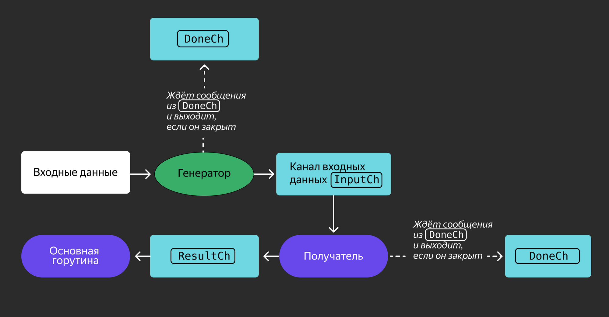

Этот же паттерн можно использовать с контекстом. Используем его вместо канала `doneCh`:
```go
package main

import (
    "log"
    "context"
    "time"
)

func main() {
    ctx, cancel := context.WithCancel(context.Background())

    input := []int{1, 2, 3, 4, 5, 6}

    go func() {
        handler(ctx, input)
        cancel()
    }()

    time.Sleep(time.Second)
}

// передадим контекст и данные из слайса
func handler(ctx context.Context, input []int) {
    // передаём данные и контекст в генератор
    inputCh := generator(ctx, input)

    // теперь канал для отмены не нужен

    for data := range inputCh {
        if data == 3 {
            log.Println("Прекращаем обработку данных из канала")
            return
        }
        log.Println(data)
    }
    log.Println("Данные во входном канале закончились")
}

func generator(ctx context.Context, input []int) chan int {
    inputCh := make(chan int)

    go func() {
        defer close(inputCh)

        for _, data := range input {
            select {
            // вместо отменяющего канала используем Context.Done()
            case <-ctx.Done():
                log.Println("Останавливаем генератор")
                return
            case inputCh <- data:
            }
        }
    }()

    return inputCh
}
```

Если запустить этот код, то он выведет то же самое, что и предыдущий:
```bash
❯ go run main.go
2023/03/08 19:21:50 1
2023/03/08 19:21:50 2
2023/03/08 19:21:50 Прекращаем обработку данных из канала
2023/03/08 19:21:50 Останавливаем генератор
```

Как видите, этот способ мало чем отличается от предыдущего. В предыдущем примере использовали канал отмены `doneCh`, в этом — `Context.Done()`, который передали в `handler`.

___
В каком случае стоит использовать сигнальный канал и паттерн `for — select`?
~~Когда горутина выполняет роль воркера, то есть непрерывно принимает входящую работу, и должна во время ожидания новой работы среагировать на сигнал остановки. Благодаря оператору `select` можно одновременно ожидать данные из канала и реагировать на сигнальный канал.~~
___
Как контекст, переданный горутине аргументом, может остановить её выполнение?
~~Остановить выполнение горутины, снабжённой контекстом, можно, прочитав в канале сигнал от контекста: `<-ctx.Done()`. `ctx.Done()` сигнализирует о завершении задачи.~~
___

Теперь вы знаете, как отменить работу горутин и избежать утечек памяти. Вы научились использовать паттерн `for — select` и сигнальный канал для остановки работы горутин. В следующем уроке рассмотрим ещё несколько паттернов. 

# Паттерны многопоточности: Конвейер, Fan-In, Fan-Out, Семафор

В этом уроке разберём ещё несколько паттернов, которые улучшают производительность многопоточных программ: Конвейер, Fan-In и Fan-Out. Также вы узнаете, как с помощью Семафора управлять максимальным количеством одновременно работающих процессов.

## Паттерн Конвейер

**Конвейер** — шаблон, позволяющий разбить сложную задачу на несколько более простых подзадач. При этом вывод первой подзадачи будет вводом для следующей. Этот процесс повторяется до тех пор, пока все подзадачи не будут выполнены. На схеме ниже вы можете рассмотреть, как выглядит Конвейер без использования каналов и горутин.

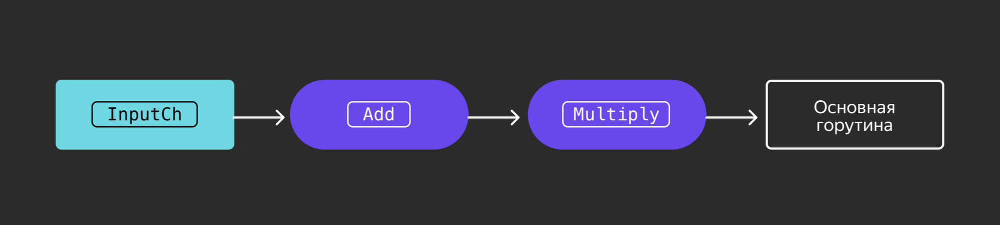

- В чём преимущества конвейера?
- Во-первых, все этапы отвечают только за одну задачу. Во-вторых, эти этапы модульные, поэтому их можно комбинировать.

Рассмотрим пример простого конвейера без горутин:
```go
package main

import "fmt"

func main() {
    input := 1

    // пример 1
    // Вызываем функцию сложения, результат которой становится аргументом первого параметра функции умножения
    fmt.Println(multiply(add(input, 1), 2))

    // пример 2
    // можно поменять местами этапы, чтобы получить другой результат
    fmt.Println(add(multiply(input, 1), 2))
}

// add функция сложения
func add(x int, y int) int {
    return x + y
}

// multiply функция умножения
func multiply(x int, y int) int {
    return x * y
}
```

Результат:
```
4
3
```

В этом коде все этапы выполняются последовательно. Каждый может начаться только после того, как предыдущий этап обработает все данные. При использованиии горутин этапы одновременно обрабатывают данные и выполняются.

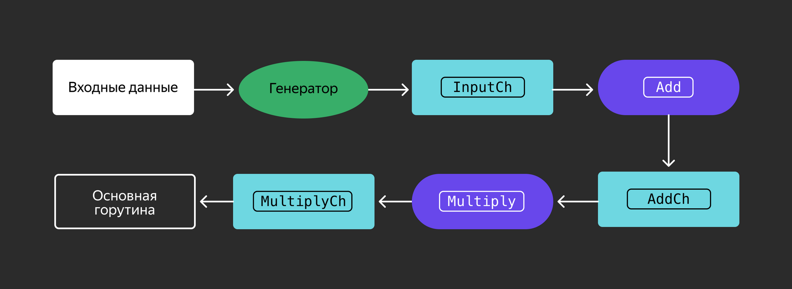

Добавим в предыдущий пример горутины и каналы. Преобразуем функции `add()` и `multiply()` так, чтобы они принимали канал `inputCh` и возвращали канал `resultCh`. Обратите внимание, что код, представленный в примере, работающий. Его можно просто скопировать и запустить.

```go
package main

import "fmt"

// add принимает на вход сигнальный канал для прекращения работы и канал с входными данными для работы, 
// а возвращает канал, в который будет отправляться результат вычислений.
// На фоне будет запущена горутина, выполняющая вычисления до момента закрытия doneCh.
func add(doneCh chan struct{}, inputCh chan int) chan int {
    // канал с результатом
    addRes := make(chan int)

    // горутина, в которой добавляем к значению из inputCh единицу и отправляем результат в addRes
    go func() {
        // закрываем канал, когда горутина завершается
        defer close(addRes)

        // берём из канала inputCh значения, которые надо изменить
        for data := range inputCh {
            result := data + 1

            select {
            // если канал doneCh закрылся, выходим из горутины
            case <-doneCh:
                return
            // если doneCh не закрыт, отправляем результат вычисления в канал результата
            case addRes <- result:
            }
        }
    }()
    // возвращаем канал для результатов вычислений
    return addRes
}


// multiply принимает на вход сигнальный канал для прекращения работы и канал с входными данными для работы, 
// а возвращает канал, в который будет отправляться результат вычислений.
// На фоне будет запущена горутина, выполняющая вычисления до момента закрытия doneCh.
func multiply(doneCh chan struct{}, inputCh chan int) chan int {
    // канал с результатом
    multiplyRes := make(chan int)

    // горутина, в которой значение из inputCh умножаем на 2 и возвращаем в канал multiplyRes
    go func() {
        // закрываем канал multipleRes, когда горутина завершается
        defer close(multiplyRes)

        // берем из канала inputCh значения, которые надо изменить
        for data := range inputCh {
            // изменяем данные
            result := data * 2

            select {
            // если канал doneCh закрылся, выходим из горутины
            case <-doneCh:
                return
            // если doneCh не закрыт, отправляем результат вычисления в канал результата
            case multiplyRes <- result:
            }
        }
    }()

    // возвращаем канал для результатов вычислений
    return multiplyRes
}


// generator возвращает канал с данными
func generator(doneCh chan struct{}, input []int) chan int {
    // канал, в который будем отправлять данные из слайса
    inputCh := make(chan int)

    // горутина, в которой отправляем в канал  inputCh данные
    go func() {
        // как отправители закрываем канал, когда всё отправим
        defer close(inputCh)

        // перебираем все данные в слайсе
        for _, data := range input {
            select {
            // если doneCh закрыт, сразу выходим из горутины
            case <-doneCh:
                return
            // если doneCh не закрыт, кидаем в канал inputCh данные data
            case inputCh <- data:
            }
        }
    }()

    // возвращаем канал для данных
    return inputCh
}

func main() {
    // ваши данные в слайсе
    input := []int{1, 2, 3, 4, 5, 6, 7, 8}

    // канал для сигнала к выходу из горутины
    doneCh := make(chan struct{})
    // при завершении программы закрываем канал doneCh, чтобы все горутины тоже завершились
    defer close(doneCh)

    // получаем канал с данными с помощью генератора
    inputCh := generator(doneCh, input)

    // ваш конвейер, сначала работает add,  потом multiply
    resultCh := multiply(doneCh, add(doneCh, inputCh))

    // выводим результат
    for res := range resultCh {
        fmt.Println(res)
    }
}
```

Результат:
```
4
6
8
10
12
14
16
18
```

Разберём, что происходит в основной функции. Создаём слайс данных и канал `doneCh`, передаём его всем горутинам для их явной отмены. Входной поток данных передаём в `add`, который возвращает канал с результатами обработки. Этот канал подаётся на вход `multiply`, для которого результаты работы `add` будут входными данными. Более развёрнуто этот код выглядит так:
```go
addResults := add(doneCh, inputCh)
resultCh := multiply(doneCh, addResults)
```

При этом фоновые горутины, запущенные в `add` и `multiply`, будут работать параллельно по мере поступления данных.

Каждый этап конвейера обрабатывает порции данных последовательно, при этом поток данных обрабатывается параллельно. Например, если на входе были числа 1, 2, 3, то через несколько шагов в одно и то же время 1 будет ожидать обработки, 2 будет на этапе увеличения на единицу, а 3 будет умножаться на 2. Такой подход сочетает в себе преимущества последовательной и параллельной обработки данных. В том смысле, что можно начать работу по умножению ещё до завершения инкремента всех чисел.

Подзадачи, на которые конвейер разбивает сложную задачу, можно вызывать в нужном порядке. Например, на несколько этапов можно разделить задачу поиска по ключевым словам и сохранения результатов в файлы или базу данных.

**Кстати**
Одним из этапов конвейера может быть генератор.

___
Реализуйте две функции. Первая — генератор, который будет отправлять в канал числа, переданные в параметре. Вторая функция будет принимать этот канал, возводить в квадрат каждое число и отправлять результаты в другой канал, который она возвращает. Основная функция уже реализована и должна читать данные из канала с результатами и выводить их на экран.

```go
package main

import "fmt"

func main() {
    c := gen(2, 3)
    out := square(c)

    for res := range out {
        fmt.Println(res)
    }
}

// реализация генератора gen здесь
func gen(nums ...int) chan int {

}

// реализация square здесь
func square(in chan int) chan int {
    
}
```

Решение:
```go
package main

import "fmt"

func main() {
    c := gen(2, 3)
    out := square(c)

    for res := range out {
        fmt.Println(res)
    }
}

// реализация генератора gen здесь
func gen(nums ...int) chan int {
    out := make(chan int)
    go func() {
        defer close(out)
        for _, n := range nums {
            out <- n
        }
    }()

    return out
}

// реализация square здесь
func square(in chan int) chan int {
    out := make(chan int)
    go func() {
        defer close(out)
        for n := range in {
            out <- n * n
        }
    }()

    return out
}
```
___

## Паттерны Fan-In и Fan-Out

Если один из этапов конвейера занимает больше времени и ресурсов, чем другие, работа всех остальных этапов будет заблокирована. Чтобы избежать этого, можно использовать **паттерн Fan-Out**. Он позволяет увеличить количество рабочих на этапах с наибольшей нагрузкой. Принцип его работы отображён на схеме ниже.

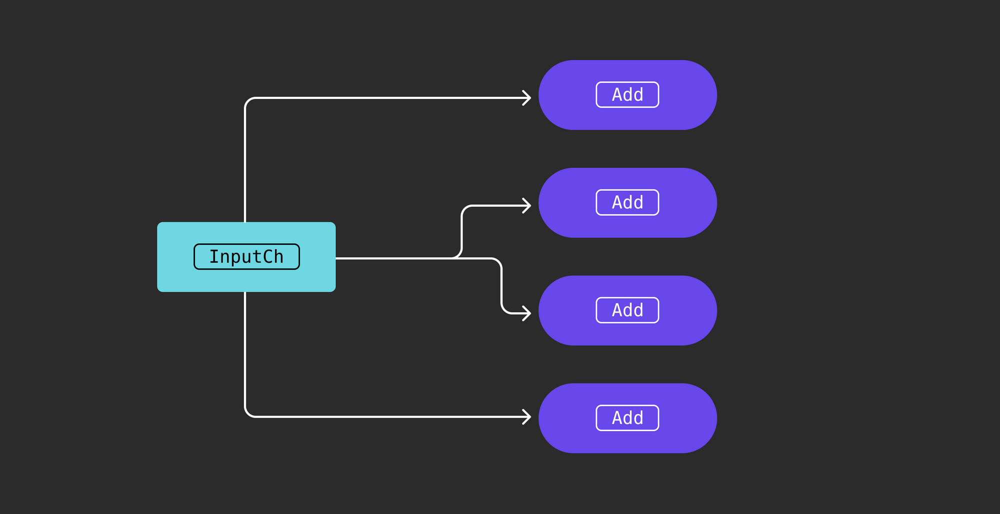

В паттерне Fan-Out создаётся большее количество горутин на определенном этапе, что увеличивает его пропускную способность.

Предположим, что функция `add()` из предыдущего примера требует больших вычислительных ресурсов. Одно из решений — увеличить количество рабочих горутин `add`. Попробуем её замедлить, добавив `time.Sleep(time.Second)`. Функции `generator()`, `add()` и `muliply()` точно такие же, как и в примере паттерна Конвейер:
```go
package main

import (
    "fmt"
)

// generator функция из предыдущего примера, делает то же, что и делала
func generator(doneCh chan struct{}, input []int) chan int {
    inputCh := make(chan int)

    go func() {
        defer close(inputCh)

        for _, data := range input {
            select {
            case <-doneCh:
                return
            case inputCh <- data:
            }
        }
    }()

    return inputCh
}

// multiply функция из предыдущего примера, делает то же, что и делала
func multiply(doneCh chan struct{}, inputCh chan int) chan int {
    multiplyRes := make(chan int)

    go func() {
        defer close(multiplyRes)

        for data := range inputCh {
            result := data * 2

            select {
            case <-doneCh:
                return
            case multiplyRes <- result:
            }
        }
    }()
    return multiplyRes
}

// add функция из предыдущего примера, делает то же, что и делала
func add(doneCh chan struct{}, inputCh chan int) chan int {
    addRes := make(chan int)

    go func() {
        defer close(addRes)

        for data := range inputCh {
            // замедлим вычисление, как будто функция add требует больше вычислительных ресурсов
            time.Sleep(time.Second)

            result := data + 1

            

            select {
            case <-doneCh:
                return
            case addRes <- result:
            }
        }
    }()
    return addRes
}


// fanOut принимает канал данных, порождает 10 горутин
func fanOut(doneCh chan struct{}, inputCh chan int) []chan int {
    // количество горутин add
    numWorkers := 10
    // каналы, в которые отправляются результаты
    channels := make([]chan int, numWorkers)


    for i := 0; i < numWorkers; i++ {
        // получаем канал из горутины add
        addResultCh := add(doneCh, inputCh)
        // отправляем его в слайс каналов
        channels[i] = addResultCh
    }

    // возвращаем слайс каналов
    return channels
}
```

Функция `fanOut()` принимает канал с входными данными `inputCh` и порождает десять горутин `add` для одновременной обработки входного потока. Так как каждая горутина `add` возвращает свой канал `addRes`, можно сохранить каналы результатов в срезе и возвращать его основной функции.

**Паттерн Fan-In** объединяет несколько результатов в один канал. Этот процесс также называют **мультиплексированием**. На схеме ниже — принцип работы этого паттерна.

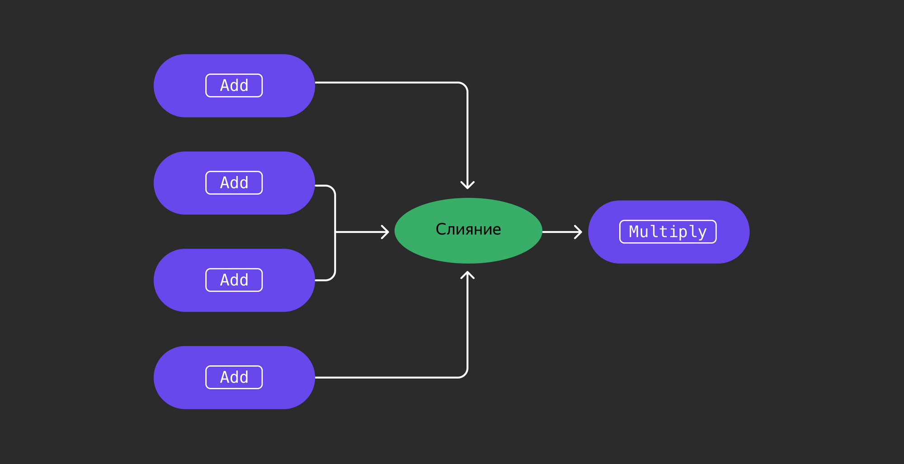

Рассмотрим код, а после — подробно его разберём:
```go
// fanIn объединяет несколько каналов resultChs в один.
func fanIn(doneCh chan struct{}, resultChs ...chan int) chan int {
    // конечный выходной канал в который отправляем данные из всех каналов из слайса, назовём его результирующим
    finalCh := make(chan int)

    // понадобится для ожидания всех горутин
    var wg sync.WaitGroup

    // перебираем все входящие каналы
    for _, ch := range resultChs {
        // в горутину передавать переменную цикла нельзя, поэтому делаем так 
        chClosure := ch

        // инкрементируем счётчик горутин, которые нужно подождать
        wg.Add(1)

        go func() {
            // откладываем сообщение о том, что горутина завершилась
            defer wg.Done()

            // получаем данные из канала
            for data := range chClosure {
                select {
                // выходим из горутины, если канал закрылся
                case <-doneCh:
                    return
                // если не закрылся, отправляем данные в конечный выходной канал
                case finalCh <- data:
                }
            }
        }()
    }

    
    go func() {
        // ждём завершения всех горутин
        wg.Wait()
        // когда все горутины завершились, закрываем результирующий канал
        close(finalCh)
    }()

    // возвращаем результирующий канал
    return finalCh
}
```

Функция `fanIn()` принимает слайс каналов, который создает функция `fanOut()`. Для каждого канала создаём отдельную горутину: они будут извлекать данные и передавать их в канал `finalCh`.

Другими словами, выполняются несколько функций, и  каждая функция читает данные из своего канала до его закрытия. В конце функции порождаем отдельную горутину, чтобы дождаться завершения всех горутин и закрыть канал `finalCh`. Затем возвращаем объединенный результирующий канал `finalCh` основной функции. На каждой итерации цикла создаётся новый экземпляр `chClosure`, поэтому каждая горутина получает ссылку на тот канал, для которого запускалась.

Теперь настала пора основной функции:
```go
func main() {
    // слайс данных
    input := []int{1, 2, 3, 4, 5, 6, 7, 8, 9, 10, 11, 12, 13, 14, 15}

    // сигнальный канал для завершения горутин
    doneCh := make(chan struct{})
    // закрываем его при завершении программы
    defer close(doneCh)

    // канал с данными
    inputCh := generator(doneCh, input)

    // получаем слайс каналов из 10 рабочих add
    channels := fanOut(doneCh, inputCh)

    // а теперь объединяем десять каналов в один
    addResultCh := fanIn(doneCh, channels...)

    // передаём тот один канал в следующий этап обработки
    resultCh := multiply(doneCh, addResultCh)

    // выводим результаты расчетов из канала
    for res := range resultCh {
        fmt.Println(res)
    }
}
```

Запустив этот пример, получим такой вывод:
```bash
❯ go run main.go
10
16
14
8
18
12
6
4
```

В основной функции создаём данные в `input`, создаём сигнальный канал `doneCh` и делаем отложенное закрытие этого канала. Далее, используя генератор, создаём канал данных `inputCh` и десять каналов для функции `add()`. Для этого используем `fanOut()`. Затем объединяем все каналы в `addResultCh`. Передаем канал `addResultCh` в `multiply` для обработки и выводим результат из канала `resultCh`.

Паттерны Fan-In и Fan-Out увеличивают количество рабочих процессов для одного этапа конвейера. На схеме ниже изображен конвейер, включающий в себя несколько стадий обработки данных. На каждой стадии данные обрабатываются параллельно несколькими рабочими процессами, что повышает пропускную способность программы. Но при этом порядок выходных данных не будет соответствовать порядку входных данных.

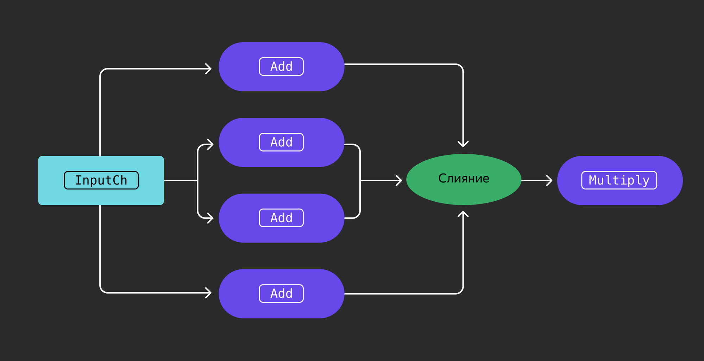

___
Реализуйте функцию `fanIn()`, чтобы объединить результаты функций `square()` и `gen()`. Используйте функции `gen()` и `square()` из кода предыдущего задания. Основная функция уже реализована. После запуска программы, вывод должен быть таким:
```bash
❯ go run main.go
4
9
```

```go
package main

import (
    "fmt"
    "sync"
)

func main() {
    inCh := gen(2, 3)
    ch1 := square(inCh)
    ch2 := square(inCh)
    for n := range fanIn(ch1, ch2) {
        fmt.Println(n)
    }
}

func gen(nums ...int) chan int {
    outCh := make(chan int)
    go func() {
        defer close(outCh)
        for _, n := range nums {
            outCh <- n
        }
    }()

    return outCh
}

func square(inCh chan int) chan int {
    outCh := make(chan int)
    go func() {
        defer close(outCh)
        for n := range inCh {
            outCh <- n * n
        }
    }()

    return outCh
}

// эту функцию нужно реализовать
func fanIn(chs ...chan int) chan int {
    // здесь реализация
}
```

Решение:
```go
package main

import (
    "fmt"
    "sync"
)

func main() {
    inCh := gen(2, 3)
    ch1 := square(inCh)
    ch2 := square(inCh)
    for n := range fanIn(ch1, ch2) {
        fmt.Println(n)
    }
}

func gen(nums ...int) chan int {
    outCh := make(chan int)
    go func() {
        defer close(outCh)
        for _, n := range nums {
            outCh <- n
        }
    }()

    return outCh
}

func square(inCh chan int) chan int {
    outCh := make(chan int)
    go func() {
        defer close(outCh)
        for n := range inCh {
            outCh <- n * n
        }
    }()

    return outCh
}

// fanIn принимает несколько каналов, в которых итоговые значения
func fanIn(chs ...chan int) chan int {
    var wg sync.WaitGroup
    outCh := make(chan int)

    // определяем функцию output для каждого канала в chs
    // функция output копирует значения из канала с в канал outCh, пока с не будет закрыт 
    output := func(c chan int) {
        for n := range c {
            outCh <- n
        }
        wg.Done()
    }

    // добавляем в группу столько горутин, сколько каналов пришло в fanIn
    wg.Add(len(chs))
    // перебираем все каналы, которые пришли и отправляем каждый в отдельную горутину 
    for _, c := range chs {
        go output(c)
    }

    // запускаем горутину для закрытия outCh после того, как все горутины отработают 
    go func() {
        wg.Wait()
        close(outCh)
    }()

    // возвращаем общий канал
    return outCh
}
```
___

## Паттерн Семафор

При создании множества горутин для обработки запросов может возникнуть проблема с общим доступом к ресурсам, таким как база данных. **Паттерн Семафор** поможет избежать отправки неограниченного количества запросов к базе данных.

Вы уже знакомы с мьютексами и знаете, что мьютекс позволяет только одному потоку обращаться к ресурсу за раз. Семафор позволяет `N` потокам обращаться к ресурсу за раз. На схеме ниже — работа Семафора.

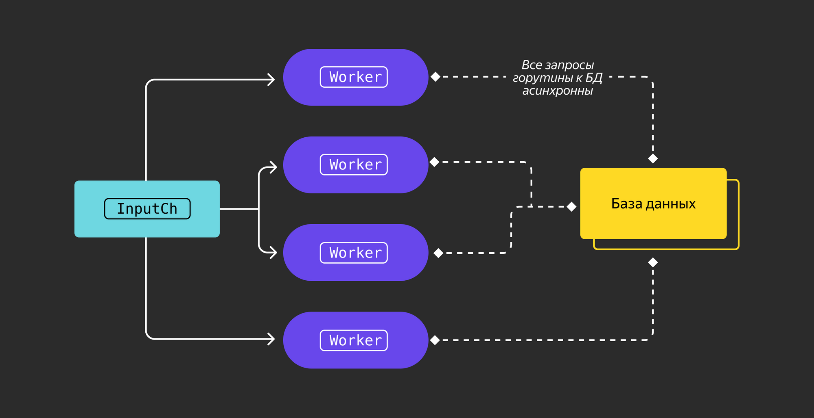

Коротко описать принцип работы этого паттерна можно так:
1. Создаётся Семафор с счётчиком из `N` элементов. Это количество горутин, которые могут одновременно работать с ресурсом.
1. Когда горутина хочет начать работу с ресурсом, она сначала пытается увеличить счётчик на 1.
1. Если счётчик уже максимального размера, горутина ждёт, пока счётчик уменьшится.
1. Когда одна из работающих горутин заканчивает работу с ресурсом, она уменьшает счётчик Семафора. Затем начинает выполняться другая горутина, которая, в свою очередь, снова увеличивает счётчик семафора.

Используя концепцию буферизованного канала, можно спроектировать Семафор:
```go
package main

import (
    "fmt"
    "sync"
    "time"
)

// Semaphore структура семафора
type Semaphore struct {
    semaCh chan struct{}
}

// NewSemaphore создает семафор с буферизованным каналом емкостью maxReq
func NewSemaphore(maxReq int) *Semaphore {
    return &Semaphore {
        semaCh: make(chan struct{}, maxReq),
    }
}

// когда горутина запускается, отправляем пустую структуру в канал semaCh
func (s *Semaphore) Acquire() {
    s.semaCh <- struct{}{}
}

// когда горутина завершается, из канала semaCh убирается пустая структура
func (s *Semaphore) Release() {
    <-s.semaCh
}
```

В приведенном примере создали структуру Семафора — `Semaphore`. Функция `NewSemaphore()` создаёт семафор с буферизованным каналом. Размер канала задан в параметре функции. Когда запускается любая горутина, выполняем метод `Acquire()` и в канал семафора помещаем пустую структуру. Если буферизованный канал заполнен, вызов метода `Acquire` блокируется. Поэтому горутина будет ждать, пока не освободится канал в семафоре. Когда горутина завершает свою работу, вызывается метод `Release()`, который забирает пустую структуру из канала семафора `semaCh`, освобождая место для других горутин, которые ждали выполнения метода `Acquire()`.

Рассмотрим пример использования семафора. С помощью функции `NewSemaphore()` создадим семафор ёмкостью `2`. И в цикле —  десять горутин:
```go
func main() {
    // чтобы дождаться всех горутин
    var wg sync.WaitGroup

    // создаём семафор емкостью 2: он будет пропускать только 2 горутины
    semaphore := NewSemaphore(2)

    // создаем 10 горутин
    for idx := 0; idx < 10; idx++ {
        wg.Add(1)

        // горутина в которую помещаем её порядковый номер
        go func(taskID int) {
            // отправляем в канал семафора пустую структуру
            semaphore.Acquire()

            // откладываем уменьшение счетчика в WaitGroup, когда завершится горутина
            defer wg.Done()

            // забираем из канала семафора пустую структуру, дав возможность запуститься другим горутинам
            defer semaphore.Release()

            log.Println("Запущен рабочий %d", taskID)

            time.Sleep(1 * time.Second)
        }(idx)
    }

    // ждём завершения всех горутин
    wg.Wait()
}
```

Каждая горутина получает семафор, прежде чем начать работу. Максимальное количество одновременно выполняемых задач — две. Все задачи могут быть выполнены за пять секунд, поскольку каждая задача выполняется за одну секунду.

Запустим код. Получим результат, который подтверждает расчеты:
```bash
❯ go run main.go
20:32:44 Запущен рабочий 0
20:32:44 Запущен рабочий 1
20:32:45 Запущен рабочий 9
20:32:45 Запущен рабочий 5
20:32:46 Запущен рабочий 7
20:32:46 Запущен рабочий 6
20:32:47 Запущен рабочий 8
20:32:47 Запущен рабочий 2
20:32:48 Запущен рабочий 3
20:32:48 Запущен рабочий 4
```

## Паттерн Worker Pool

Паттерн **Worker Pool**, или **Пул рабочих процессов** (также известный как **Пул потоков**) — это шаблон многопоточности, в котором создаётся пул из рабочих процессов для одновременной обработки задач из очереди. Главные компоненты паттерна: система очередей для доставки задач воркерам (работникам) и логика получения задач. Обычно система очередей представляет собой канал, а логика получения задач заключается в том, что бездействующие воркеры (работники) будут брать задачи в порядке очереди.

У Пула рабочих процессов есть ряд преимуществ. Он прост и позволяет разработчикам не думать о рутинной работе: правильно закрывать каналы, предотвращать голодание рабочих процессов и так далее. Достаточно обработать задачи и вызвать несколько функций. Разберём простой пример этого паттерна:
```go
package main

import (
    "fmt"
    "time"
)

// worker это наш рабочий, который принимает два канала:
// jobs - канал задач, это входные данные для обработки
// results - канал результатов, это результаты работы воркера
func worker(id int, jobs <-chan int, results chan<- int) {
    for j := range jobs {
        // для наглядности будем выводить какой рабочий начал работу и его задачу
        fmt.Println("рабочий", id, "запущен задача", j)
        // немного замедлим выполнение рабочего
        time.Sleep(time.Second)
        // для наглядности выводим какой рабочий завершил какую задачу
        fmt.Println("рабочий", id, "закончил задача", j)
        // отправляем результат в канал результатов
        results <- j + 1
    }
}

func main() {
    // допустим у вас 5 задач, которые нужно выполнить
    const numJobs = 5
    // создаем буферизованный канал для принятия задач в воркер
    jobs := make(chan int, numJobs)
    // создаем буферизованный канал для отправки результатов
    results := make(chan int, numJobs)

    // создаем и запускаем 3 воркера, это и есть пул, 
    // передаем id, это для наглядности, канал задач и канал результатов
    for w := 1; w <= 3; w++ {
        go worker(w, jobs, results)
    }

    // в канал задач отправляем какие-то данные
    // задач у нас 5, а воркера 3, значит одновременно решается только 3 задачи
    for j := 1; j <= numJobs; j++ {
        jobs <- j
    }
    // как вы помните, закрываем канал на стороне отправителя
    close(jobs)

    // забираем из канала результатов результаты ;)
    // можно присваивать переменной, или выводить на экран, но мы не будем 
    for a := 1; a <= numJobs; a++ {
        <-results
    }
}
```

Когда вы запустите код, вывод должен быть таким:
```bash
> go run main.go
рабочий 3 запустился задача 1
рабочий 1 запустился задача 2
рабочий 2 запустился задача 3
рабочий 2 закончил задача 3
рабочий 3 закончил задача 1
рабочий 3 запустился задача 4
рабочий 1 закончил задача 2
рабочий 2 запустился задача 5
рабочий 3 закончил задача 4
рабочий 2 закончил задача 5
```

Пример показывает, что запускается всего три воркера, которые выполняют пять задач.

Ещё одно преимущество паттерна: Worker pool может повышать производительность программы. Вместо выделения горутины для каждой задачи можно использовать определенный набор воркеров. Это позволяет уменьшить накладные расходы, особенно для длительных заданий обработки, таких как обработка входящих запросов API.

# Обучение Алисы 13

Пришло время значительно улучшить производительность навыка Алисы, используя принципы многопоточности в Go. Научим его сохранять отправленные сообщения в базу данных и накапливать их там. Тем самым существенно снизим нагрузку на БД при большом количестве отправляемых сообщений в секунду.

Усовершенствуем интерфейс хранилища, заменив метод `SaveMessage` на `SaveMessages`. Для этого обновим файл `internal/store/store.go`:
```go
package store

import (
 "context"
 "errors"
 "time"
)

var ErrConflict = errors.New("data conflict")

type MessageStore interface {
 FindRecepient(ctx context.Context, username string) (userID string, err error)
 ListMessages(ctx context.Context, userID string) ([]Message, error)
 GetMessage(ctx context.Context, id int64) (*Message, error)
 // SaveMessages сохраняет несколько сообщений
 SaveMessages(ctx context.Context, messages ...Message) error
 RegisterUser(ctx context.Context, userID, username string) error
}

type Message struct {
 ID        int64
 Sender    string
 Recepient string    // получатель
 Time      time.Time
 Payload   string
}
```

Реализуем метод `SaveMessages` хранилища `PostgreSQL`. Добавим в файл `internal/store/pg/store.go` следующий код:
```go
func (s *Store) SaveMessages(ctx context.Context, messages ...store.Message) error {
 // соберём данные для создания запроса с групповой вставкой
 var values []string
 var args []any
 for i, msg := range messages {
  // в нашем запросе по 4 параметра на каждое сообщение
  base := i * 4
  // PostgreSQL требует шаблоны в формате ($1, $2, $3, $4) для каждой вставки
  params := fmt.Sprintf("($%d, $%d, $%d, $%d)", base+1, base+2, base+3, base+4)
  values = append(values, params)
  args = append(args, msg.Sender, msg.Recepient, msg.Payload, msg.Time)
 }

 // составляем строку запроса
 query := `
  INSERT INTO messages
  (sender, recepient, payload, sent_at)
  VALUES ` + strings.Join(values, ",") + `;`

 // добавляем новые сообщения в БД
 _, err := s.conn.ExecContext(ctx, query, args...)

 return err
}
```

Следующим шагом обновим файл с хендлером — `cmd/skill/app.go`:
```go
...

// app инкапсулирует в себя все зависимости и логику приложения
type app struct {
 store store.MessageStore

 // канал для отложенной отправки новых сообщений
 msgChan chan store.Message
}

func newApp(s store.MessageStore) *app {
 instance := &app{
  store:   s,
  msgChan: make(chan store.Message, 1024), // установим каналу буфер в 1024 сообщения
 }

 // запустим горутину с фоновым сохранением новых сообщений
 go instance.flushMessages()

 return instance
}

func (a *app) webhook(w http.ResponseWriter, r *http.Request) {
 ...

 switch true {
 // пользователь попросил отправить сообщение
 case strings.HasPrefix(req.Request.Command, "Отправь"):
  // гипотетическая функция parseSendCommand вычленит из запроса логин адресата и текст сообщения
  username, message := parseSendCommand(command)

  // найдём внутренний идентификатор адресата по его логину
  recepientID, err := a.store.FindRecepient(ctx, username)
  if err != nil {
   logger.Log.Debug("cannot find recepient by username", zap.String("username", username), zap.Error(err))
   w.WriteHeader(http.StatusInternalServerError)
   return
  }

  // отправим сообщение в очередь на сохранение
  a.msgChan <- store.Message{
   Sender:    req.Session.User.UserID,
   Recepient: recepientID,
   Time:      time.Now(),
   Payload:   message,
  }

  // оповестим отправителя об успешности операции
  text = "Сообщение успешно отправлено"

 // пользователь попросил прочитать сообщение
 case strings.HasPrefix(req.Request.Command, "Прочитай"):
  ...

 case strings.HasPrefix(req.Request.Command, "Зарегистрируй"):
  ...

 // если не поняли команду, просто скажем пользователю, сколько у него новых сообщений
 default:
  ...
 }

 // заполним модель ответа
 resp := models.Response{
  Response: models.ResponsePayload{
   Text: text, // Алиса проговорит текст
  },
  Version: "1.0",
 }

 w.Header().Set("Content-Type", "application/json")

 // сериализуем ответ сервера
 enc := json.NewEncoder(w)
 if err := enc.Encode(resp); err != nil {
  logger.Log.Debug("error encoding response", zap.Error(err))
  return
 }
 logger.Log.Debug("sending HTTP 200 response")
}

// flushMessages постоянно сохраняет несколько сообщений в хранилище с определённым интервалом
func (a *app) flushMessages() {
 // будем сохранять сообщения, накопленные за последние 10 секунд
 ticker := time.NewTicker(10 * time.Second)

 var messages []store.Message

 for {
  select {
  case msg := <-a.msgChan:
   // добавим сообщение в слайс для последующего сохранения
   messages = append(messages, msg)
  case <-ticker.C:
   // подождём, пока придёт хотя бы одно сообщение
   if len(messages) == 0 {
    continue
   }
   // сохраним все пришедшие сообщения одновременно
   err := a.store.SaveMessages(context.TODO(), messages...)
   if err != nil {
    logger.Log.Debug("cannot save messages", zap.Error(err))
    // не будем стирать сообщения, попробуем отправить их чуть позже
    continue
   }
   // сотрём успешно отосланные сообщения
   messages = nil
  }
 }
}
```

В коде выше добавили в экземпляр приложения канал, в который будут добавляться новые сообщения от пользователей. Также при создании экземпляра приложения запустим в фоновом режиме горутину. Она будет накапливать отосланные в канал сообщения и сохранять их через заданные интервалы времени в хранилище одним запросом.

Теперь навык Алисы сможет обрабатывать больше запросов на одном сервере, что существенно сэкономит аппаратный бюджет. Заодно осчастливим больше пользователей!

## Послесловие

Ну вот и закончилась основная веха в реализации нашего сервиса, теперь он умеет выполнять свою маленькую, но очень нужную задачу. Конечно, в реальной жизни это было бы только начало, ведь нет предела совершенству: столько еще полезных функций можно добавить, столько архитектурных решений придётся переосмыслить. Тем не менее на данный момент мы, как программисты, получили самое ценное — навык написания сложного, многопоточного и производительного кода. А не к этому ли мы стремимся в своей работе?

# Инкремент 15

## Задание по треку «Сервис сокращения URL»

Сделайте в таблице базы данных с сокращёнными URL дополнительное поле с флагом, указывающим на то, что URL должен считаться удалённым. Например, так:
```go
type Storage struct {
  UUID          string  `db:"user_id"`
  ShortURL      string  `db:"short_url"`
  OriginslURL   string  `db:"original_url"`
  DeletedFlag   bool    `db:"is_deleted"`
}
```

Добавьте в сервис новый хендлер `DELETE /api/user/urls`, который в теле запроса принимает список идентификаторов сокращённых URL для асинхронного удаления. Запрос может быть таким:
```
DELETE http://localhost:8080/api/user/urls
Content-Type: application/json

["6qxTVvsy", "RTfd56hn", "Jlfd67ds"]
```

В случае успешного приёма запроса хендлер должен возвращать HTTP-статус `202 Accepted`. Фактический результат удаления может происходить позже — оповещать пользователя об успешности или неуспешности не нужно.

Успешно удалить URL может пользователь, его создавший. При запросе удалённого URL с помощью хендлера `GET /{id}` нужно вернуть статус `410 Gone`.

Совет:
- Для эффективного проставления флага удаления в БД используйте множественное обновление (batch update).
- Для максимального наполнения буфера объектов обновления используйте паттерн `fanIn`.

## Задание по треку «Сервис сбора метрик и алертинга»

Перепланируйте архитектуру агента таким образом, чтобы сбор метрик (опрос runtime) и их отправка осуществлялись в разных горутинах. При этом количество одновременно исходящих запросов на сервер нужно ограничивать «сверху».

Соответствующее значение должно задаваться аргументами:
- Через флаг `-l=<ЗНАЧЕНИЕ>` и переменную окружения `RATE_LIMIT`.

Совет: 
- Используйте паттерн worker pool.

Добавьте ещё одну горутину, которая будет использовать пакет [gopsutil](https://github.com/shirou/gopsutil) и собирать дополнительные метрики типа `gauge`:
- `TotalMemory`,
- `FreeMemory`,
- `CPUutilization1` (точное количество — по числу CPU, определяемому во время исполнения).

# Что вы узнали

Порефлексируйте над тем, что вы изучили в теме про многопоточность.

Теперь вы знаете:
- в чём идея горутин и почему горутины можно запускать миллионами, а потоки операционной системы — нет;
- какие проблемы связаны с многопоточностью и почему инкрементирование счётчика в разных горутинах ведёт к неожиданному результату;
- какие средства для синхронизации горутин реализованы в Go.

Теперь вы умеете:
- использовать горутины;
- использовать примитивы синхронизации и атомарные операции;
- использовать каналы;
- комбинировать подходы и решать более комплексные задачи благодаря паттернам многопоточности.

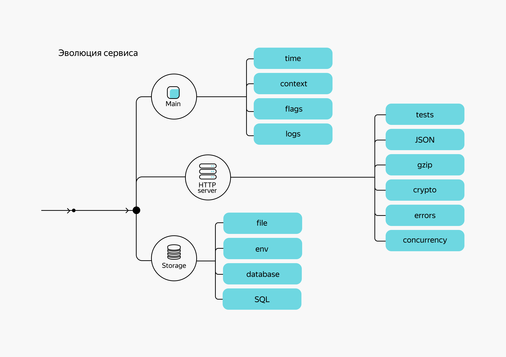

# Заключение

Троекратное «ура» в вашу честь! Вы закончили первую часть курса, впереди — выпускной проект!


Взгляните на карту. Вы проделали длинный путь.

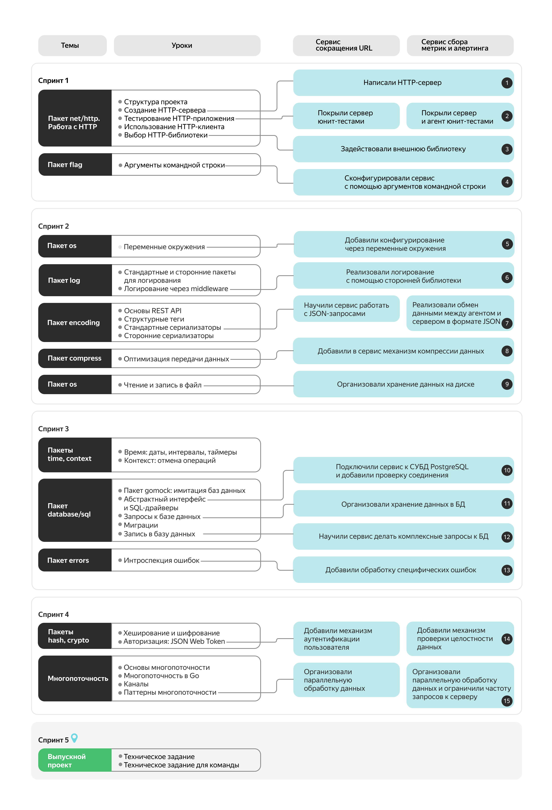
