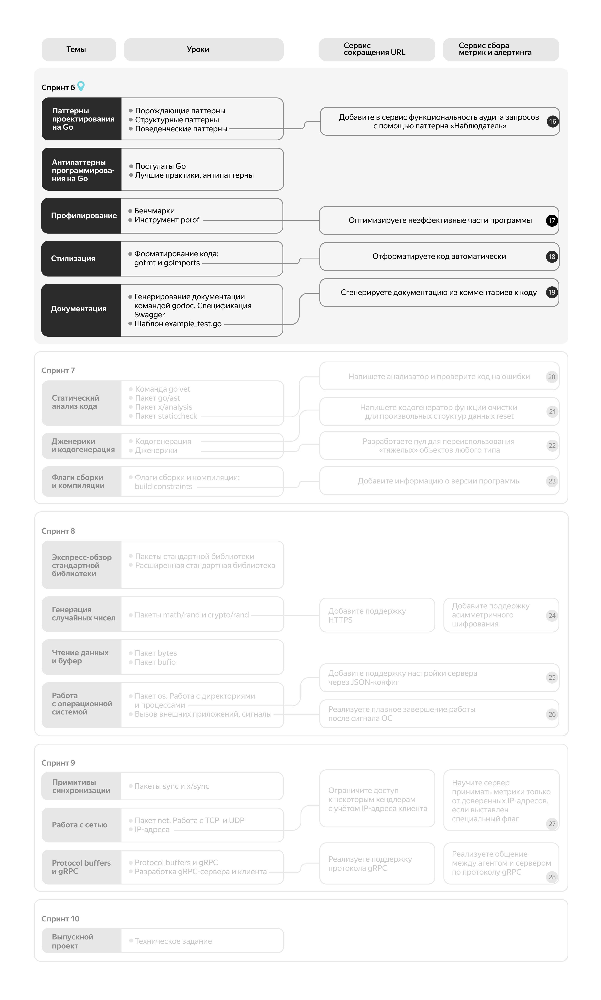

# Паттерны проектирования

# Введение в спринт 6

Вы готовы продолжить путь Go-разработчика? Если нет, то вдохните, медленно выдохните... и поверьте — у вас всё получится!

## Что вас ждёт?

Вы освоите материал пяти тем: паттерны и антипаттерны программирования на Go, профилирование, стилизация и документация.

Из этих тем вы узнаете:
- как реализовать на Go наиболее популярные паттерны проектирования;
- как избежать ошибок при написании кода на Go;
- какими инструментами пользоваться для форматирования кода и его статического анализа;
- как генерировать документацию с помощью `godoc`;
- как и зачем производить профилирование.

## Проектные инкременты

Практика в этом спринте будет одинаковой для обоих треков — «Сервиса сбора метрик и алертинга» и для «Сервиса сокращения URL». Выполняя эти задания, вы:
- примените поведенческий паттерн «Наблюдатель»;
- добавите в проект бенчмарки — тесты, которые измеряют скорость выполнения важнейших компонентов вашей системы и исправите неэффективные части кода;
- приведёте проект к стандарту форматирования;
- добавите документацию в формате `godoc`.

## Покрытие кода тестами

Обратите внимание: во второй части курса автотесты на GitHub предусмотрены не для всех инкрементов. Обновите автотесты.

А также напоминаем, что теперь требование к покрытию тестами становится обязательным условием для сдачи проекта.

### Покрытие кода по спринтам

Обязательно: 
Спринт 6: 40% 
Спринт 7: 50% 
Спринт 8: 60% 
Спринт 9: 70%

**Внимание**: к концу спринта ваш код должен быть покрыт тестами на **40%**.

## Карта курса

Помните: обучение — это трудный и ресурсозатратный процесс. Поэтому не стесняйтесь обращаться за помощью в чаты, обмениваться опытом с другими студентами и оказывать друг другу поддержку. К тому же, у вас есть замечательный куратор и опытный наставник, которые всегда готовы вам помочь. Мы верим в вас!

# Порождающие паттерны

Паттерн (шаблон) — это решение часто встречающейся проблемы при проектировании программ. В отличие от алгоритмов, паттерны не описывают конкретную последовательность действий, а дают общую концепцию, реализация которой зависит от задачи. Использование шаблонов упрощает разработку и снижает количество ошибок за счёт проверенных решений. Но следует избегать их неоправданного применения, так как это, наоборот, усложнит программу. Паттерны можно реализовать на разных языках программирования.

В теме «Паттерны проектирования на Go» вы изучите следующие паттерны:
- порождающие — абстрагируют процесс создания объектов;
- структурные — служат для построения удобных иерархий типов и объектов;
- поведенческие — решают задачи взаимодействия между объектами.

Обратите внимание, в этом курсе не описаны подробно паттерны как таковые, а лишь показаны примеры их реализации на Go. Мы предполагаем, что вы уже знакомы с шаблонами проектирования. Почитать о них подробнее можно в культовой книге Банды четырёх «Паттерны объектно-ориентированного проектирования».
