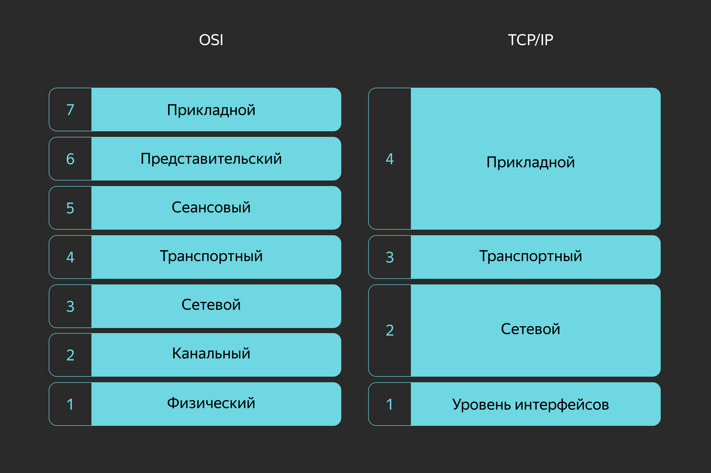
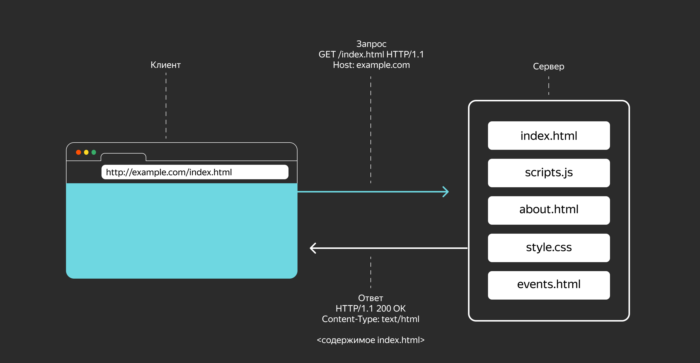
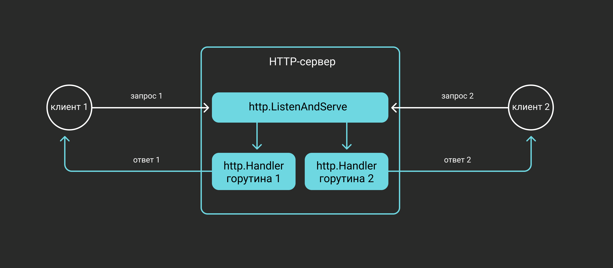
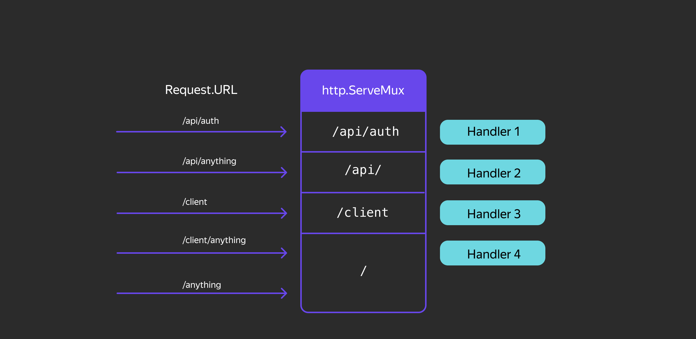
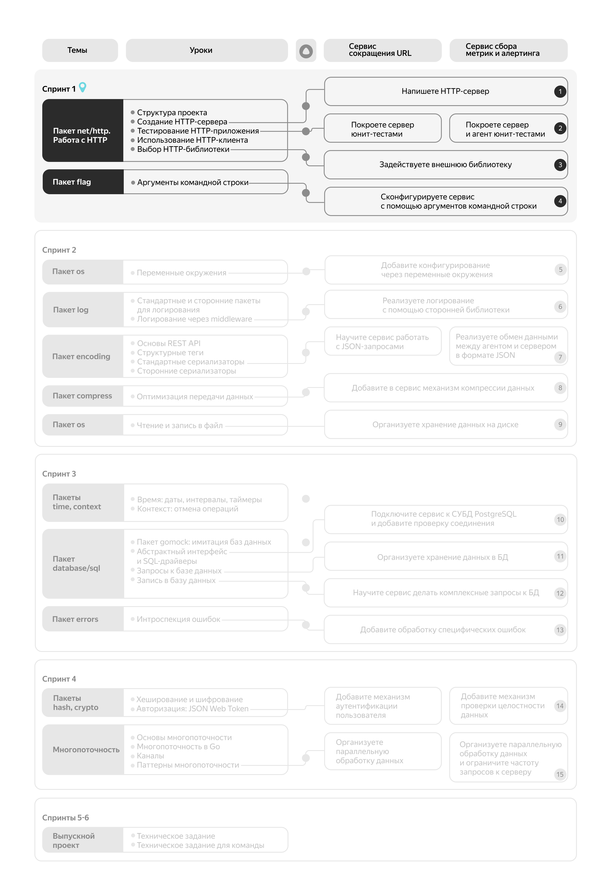
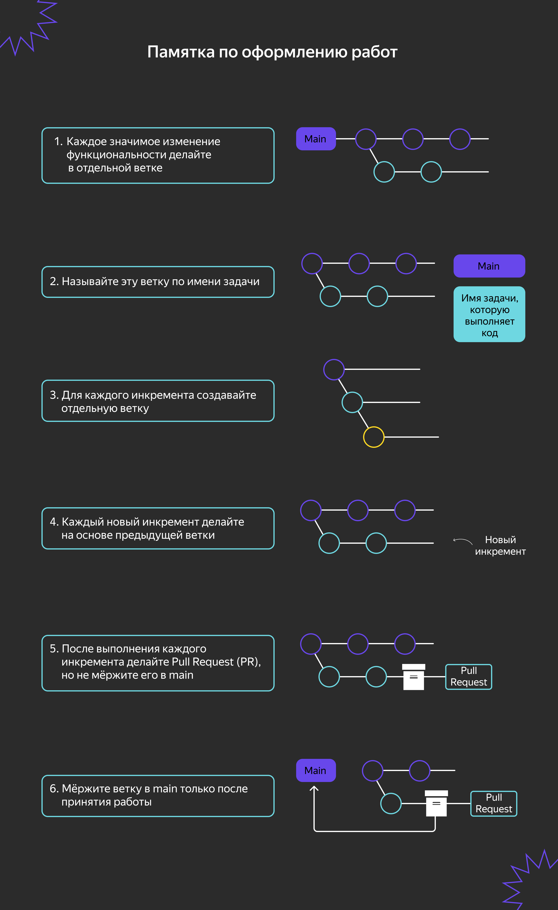
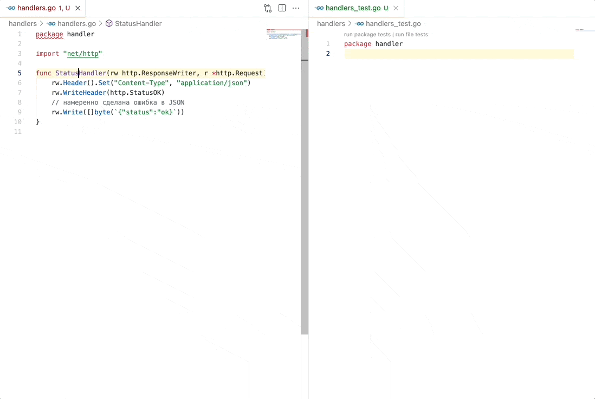
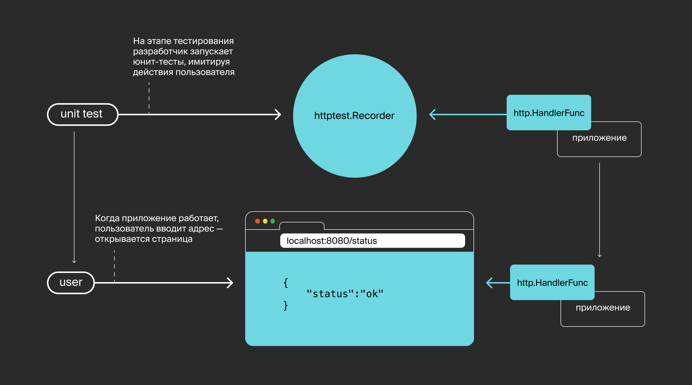
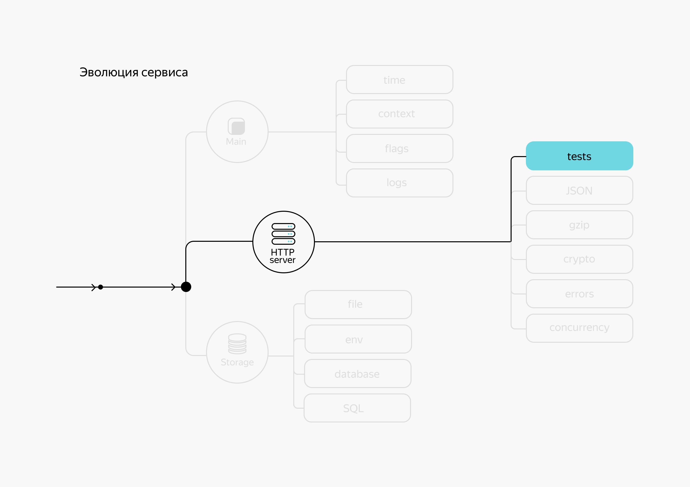

# Пакет net/http. Работа с HTTP

## Структура проекта


Мем, основанный на реальных событиях. Чтобы не оказаться в такой ситуации, нужно серьёзно подойти к архитектуре проекта.

Вы приступаете к теме `net/http` — одной из самых объёмных и сложных в программе. От вас потребуется максимум концентрации, чтобы изучить теорию и в первых кодовых инкрементах реализовать поставленные задачи. В этой теме вы создадите HTTP-сервер на Go и заложите фундамент вашего проекта.

Вначале вы познакомитесь с принципами организации Go-пакетов — это поможет правильно сформировать структуру проекта. Затем вы узнаете, как отправлять HTTP-запросы и обрабатывать ответы, — это пригодится при тестировании HTTP-сервера. В конце вы перепишете первую версию сервиса, используя сторонний HTTP-пакет, и добавите набор тестов для проверки работоспособности кода.

Итого вы реализуете клиентскую и серверную часть для HTTP-протокола, а также:
- изучите основы тестирования Go-программ и напишете первые тесты;
- научитесь тестировать сервер с помощью пакета `httptest`;
- перепишете тесты, используя стороннюю библиотеку `testify`;
- узнаете, как работать с клиентскими и серверными HTTP-библиотеками.

В этом уроке речь пойдёт о файловой структуре проекта на Go. Расскажем, как выстраивать иерархию директорий и где размещать исходные файлы.

Структура проекта может быть следующей:

### metrics
```bash
> tree ./go-musthave-metrics-trainer
./go-musthave-metrics-trainer
├── README.md
├── cmd
│   ├── agent
│   │   ├── main.go
│   │   └── main_test.go
│   └── server
│       ├── gzip.go
│       ├── handler.go
│       ├── main.go
│       ├── main_test.go
│       └── router.go
├── go.mod
├── go.sum
├── internal
│   ├── agent
│   │   ├── interfaces.go
│   │   ├── keymap.go
│   │   ├── scope.go
│   │   └── stats.go
│   ├── misc
│   │   └── env.go
│   └── store
│       ├── file.go
│       ├── sql.go
│       └── store.go
└── models
    └── metrics.go

9 directories, 20 files
```

### shortener
```bash

> tree ./go-musthave-shortener-trainer
./go-musthave-shortener-trainer
├── README.md
├── cmd
│   └── shortener
│       ├── README.md
│       ├── gzip.go
│       ├── main.go
│       ├── main_test.go
│       ├── router.go
│       └── router_test.go
├── go.mod
├── go.sum
├── internal
│   ├── app
│   │   ├── README.md
│   │   ├── app.go
│   │   ├── handler.go
│   │   └── handler_test.go
│   ├── auth
│   │   ├── codec.go
│   │   ├── codec_test.go
│   │   └── context.go
│   ├── config
│   │   └── config.go
│   └── store
│       ├── errors.go
│       ├── file.go
│       ├── memory.go
│       ├── sql.go
│       └── store.go
└── models
    └── shorten.go
```

Это базовый шаблон для организации проектов, разработанных на языке Go в рамках этого курса. Он не является официальным стандартом, установленным командой разработчиков Go, но соответствует исторически сложившимся практикам организации проектов в экосистеме. Некоторые из этих практик могут быть более распространёнными, чем другие.

В этом шаблоне также есть несколько улучшений, включая дополнительные директории, которые используются в крупных реальных проектах.

Если вы только начинаете изучать Go или создаёте небольшой учебный проект для личного использования, то этот шаблон может показаться избыточным. Начните с чего-то простого, например, с одного файла `main.go`. Когда ваш проект начнёт расти, подумайте о важности структурирования кода, чтобы избежать беспорядка и скрытых зависимостей. А когда над проектом будут работать другие люди, вам понадобится ещё более тщательная структуризация.

В этот момент важно определить стандартный способ организации пакетов и библиотек. Если вы разрабатываете проект с открытым исходным кодом или знаете, что ваш код будет использоваться в других проектах, то вам нужно понимать важность создания личных (internal) пакетов и кода. Клонируйте репозиторий, используйте только то, что вам нужно, и удалите всё остальное! Наличие «всего остального» не означает, что это обязательно использовать.

Обратите внимание, что ни один из этих шаблонов не является обязательным для использования в каждом проекте. Даже шаблон для организации зависимостей не универсален для всех случаев.

---

Почему важно разбивать проект на несколько пакетов, а не писать всё в одном файле?
~~Разделение кода на логические модули облегчает навигацию, тестирование и рефакторинг.~~

---

В спецификации языка Go нет жёстких требований к структуре директорий. Но команды, которые начинаются с `go ...`, например `go get`, в их текущей реализации работают только с репозиториями, где соблюдается ряд условий.

В репозитории обычно размещают не больше одного модуля, а в корневой директории этого модуля — файл `go.mod`.

В модуль включают один или несколько пакетов, и для каждого пакета создают свою директорию с файлами. Имя пакета должно быть идентично имени директории — для исполняемых приложений в исходных файлах достаточно внутреннего именования `package main`. 

Команда `go build`, запущенная без аргументов, собирает пакет из файлов той директории, в которой вызвана, — это основное правило. Если вы пишете черновик или совсем маленький пакет, то вполне можете обойтись одной директорией.

Директория пакета может содержать поддиректории с другими пакетами. Например, в директории пакета `net` исходников стандартной библиотеки находится поддиректория `http`. Соответственно, их пути импорта — `net` и `net/http`. Файлы пакета `net/http` не могут использовать функции пакета `net`, не импортировав его, — и наоборот.

## Директория cmd

В директорию `cmd` помещают пакеты исполняемых команд. Если вы откроете директорию с установленным Go, то в `src/cmd` вы найдёте, к примеру, пакеты команд `go` и `gofmt`.

## Директория internal

В директории `internal` размещают внутренние пакеты проекта.

Из этой директории можно импортировать только в те пакеты, которые расположены в соседних директориях, то есть у соседей должен быть общий с `internal` родитель. Например, пакет `/a/b/c/internal/d/e/f` можно импортировать только из `/a/b/c` и `/a/b/c/...` и нельзя из `/a/b/g`.

Начиная с версии Go 1.4, пакеты `internal` нельзя импортировать во внешние репозитории. Это сделано для гранулированного доступа и «подчистки» API в большой базе кода. Например, в директории `net/internal` в исходниках Go лежит непубличный пакет `socktest`, функции которого используют пакеты `net/http` и `net/http/httputil`.

Если вы опубликуете свой проект на GitHub, учитывайте, что пакеты из директории `internal` не будут доступны для импорта в другие Go-проекты.

## Директория vendor

В корневой директории модуля иногда создают поддиректорию `vendor` и сохраняют туда локальные копии зависимостей. Копии нужны для того, чтобы обезопасить свой проект от удаления или некачественной поддержки внешних библиотек. Если внешние репозитории вдруг станут недоступны, это не вызовет проблем при сборке проекта. Вы можете воспользоваться командой `go mod vendor` и создать такую директорию.

___
Может ли pkg2 импортировать util при такой структуре, если util лежит в internal?
```bash
— MyProject
    |
    — pkg1
         |
         — internal
               |
               — util
    — pkg2
```
~~Нет, internal доступен только для пакетов внутри pkg1.~~
___

Вы можете организовать структуру вашего проекта с учётом приведённых выше особенностей и ограничений. Вот один из возможных примеров:
```bash
— project
    |
    — go.mod
    — cmd
        |
        — client
            |
            — main.go
            — main_test.go
        — server
            |
            — main.go
            — main_test.go
    — internal
        |
        — handlers
            |
            — handlers.go
        |
        — util
            |
            — util.go
```

Кроме технических условий, которые должны соблюдаться для правильной работы команд, есть принятые в Go-сообществе соглашения по организации проектов. Они описаны на странице [Standard Go Project Layout](https://github.com/golang-standards/project-layout/blob/master/README_ru.md). Единообразие в структуре проектов облегчает их понимание и поддержку. Но не все разработчики используют предложенные шаблоны, так как эта инициатива носит рекомендательный, а не обязательный характер.

___
Могут ли файлы одного пакета лежать в разных директориях?
~~Нет, не могут. Все файлы пакета должны лежать в одной директории.~~

Зачем в Go используют cmd/ для главных приложений?
~~Чтобы чётко отделить точку входа от библиотечного кода. Например, cmd/server и cmd/cli могут использовать общие пакеты из /pkg.~~
___

Чтобы лучше представлять себе, как выглядит структура директорий в Go, изучите несколько популярных проектов:
- [project-layout](https://github.com/golang-standards/project-layout/blob/master/README_ru.md) — Стандартный макет Go проекта.
- [Syncthing](https://github.com/syncthing/syncthing) — приложение для синхронизации файлов. Заметьте, что для служебных пакетов вместо `internal` используется директория `lib`.
- [Kubernetes](https://github.com/kubernetes/kubernetes) — программное обеспечение для развёртывания и управления контейнерами. Пакеты размещены в директории `pkg`, что позволяет использовать их в других проектах.
- [Rclone](https://github.com/rclone/rclone) — программа для синхронизации файлов с облачными хранилищами. Есть директория cmd с командами приложения и lib со служебными пакетами.

Эти примеры подтверждают отсутствие единого стандарта: структура в них совпадает разве что на 10%. Старайтесь планировать структуру вашего проекта так, чтобы расположение файлов и директорий было понятно другим разработчикам и не требовало от них много времени на поиски и исследования.

*Но изучение Go этим не ограничивается. Для погружения в специфику языка можно читать блоги и статьи, смотреть отрывки из выступлений на конференциях, слушать авторитетных разработчиков и лидеров Go-сообщества. А это целый мир! И да, многие из этих материалов на английском — заодно и в нём можно практиковаться. Так или иначе, большая часть русскоязычных материалов по Go — это переводы статей англоязычных коллег. Читать первоисточник всегда лучше.*

*А ещё в Go очень хорошо написана стандартная библиотека — если вы откроете исходники, то увидите адекватный читаемый код. Его полезно изучать, чтобы, во-первых, лучше понимать, как работают библиотечные функции. А во-вторых, чтобы знать приёмчики по написанию Go-шного кода, ведь изменения в стандартной библиотеке контролируются Go-сообществом, поэтому там, можно сказать, эталонный код. Навык поиска, навигации и чтения документации будет большим плюсом в вашем резюме.*

## Дополнительные материалы

- [go.dev | Go Modules Reference. Vendoring](https://go.dev/ref/mod#vendoring) — о директории `vendor` на официальном сайте Go.
[Dave Cheney's Blog | Use internal packages to reduce your public API surface](https://dave.cheney.net/2019/10/06/use-internal-packages-to-reduce-your-public-api-surface) — о том, зачем нужна директория `internal`, на сайте одного из самых известных Go-разработчиков. Советуем добавить блог Дейва Чейни в избранные и следить за его публикациями и выступлениями.
[GitHub | Standard Go Project Layout](https://github.com/golang-standards/project-layout/blob/master/README_ru.md) — рекомендации по структуре проектов от Go-сообщества.

## Создание HTTP-сервера

Когда-то каждый производитель оборудования разрабатывал свои собственные протоколы — наборы семантических и синтаксических правил для обмена информацией между устройствами. Но предприятиям, которые организовывали первые компьютерные сети, вскоре потребовалось наладить взаимодействие с системами других предприятий. И вот тут возникла проблема: обмениваться данными по сети могли только устройства одного производителя. 

Несовместимость оборудования вынудила производителей договориться о единой системе протоколов. Так появилось две модели:
- **Сетевая модель взаимодействия открытых систем (Open Systems Interconnection — OSI)**, разработанная Международной организацией по стандартизации (International Organization for Standardization — ISO).
- **Сетевая модель TCP/IP (Transmission Control Protocol/Internet Protocol — TCP/IP)**, разработанная учёными в области информатики, которых называют отцами интернета: Винтоном Серфом (Vinton Cerf) и Робертом Каном (Robert Kahn). Модель получила своё название от двух протоколов: протокола управления передачей (TCP) и интернет-протокола (IP).



В сетевой модели OSI выделяют семь уровней. Каждому уровню соответствуют свои протоколы.

Уровень модели OSI:	Протоколы
- Прикладной: DNS, DHCP, FTP, HTTP, HTTPS, LDAP, NTP, IMAP, POP, SSH, SMTP, NFS
- Представления: JPEG, MIDI, MPEG, TIFF, GIF, SSL, ASCII, Unicode
- Сеансовый: SOCKS, RPC, NetBIOS, PAP
- Транспортный: TCP, UDP
- Сетевой: ICMP, IGMP, IPsec, IPv4, IPv6, IPX, RIP
- Канальный: ARP, HDLC, SLIP, PPP, ATM, CDP, FDDI, MPLS, STP
- Физический: Bluetooth, Ethernet, DSL, ISDN, 802.11, Wi-Fi

Например, уровень представления содержит кодировки, алгоритмы сжатия данных и шифрования, а сеансовый уровень позволяет приложениям взаимодействовать друг с другом длительное время, поддерживая сеанс связи. Разработчикам интересны протоколы прикладного уровня HTTP и HTTPS. Большая часть контента в сети, будь то статьи на Хабре или картинки с гоферами, передаётся по этим протоколам.

Они базируются на транспортном протоколе TCP, который, в свою очередь, использует протокол сетевого уровня IP. Протокол IP позволяет адресовать устройства в сети. А TCP гарантирует отправителю, что «посылки» (пакеты данных) дойдут до адресата, причём в том порядке, в котором были отправлены. Этого уже достаточно для информационного обмена.

Протокол HTTP, используя гарантии TCP/IP, формализует стороны обмена схемой «клиент-сервер» (client–server), а сам обмен данными — схемой «запрос-ответ» (request–response).
- Роль клиента — отправлять запросы и получать ответы. Можно вспомнить утилиты `wget` и `curl` из мира Unix. Да и браузер — это клиент сетевого взаимодействия.
- Роль сервера — принимать запросы и возвращать валидные ответы. Сервер необязательно должен обладать огромной вычислительной мощностью, это просто роль в протоколе обмена данными.

Когда браузер делает HTTP-запрос к серверу, он отправляет данные по определённому адресу и порту. 

**HTTP-сервер** — это программа, которая прослушивает порт компьютера со статическим или динамическим IP-адресом и отвечает на входящие HTTP-запросы по тому же соединению.



В стандартной библиотеке Go есть всё для того, чтобы создать сервер любой сложности. Но начнём с простого: в этом уроке рассмотрим лишь самое необходимое для реализации HTTP-сервера.

В первую очередь будем использовать пакет `net/http` стандартной библиотеки, который позволяет не только создавать HTTP-сервер, но и выполнять HTTP-запросы от лица клиента.

## Принцип работы HTTP-сервера

Реализация HTTP-сервера на Go включает в себя сам сервер, который слушает порт и принимает запросы, поступающие от HTTP-клиентов, и одну или несколько функций-обработчиков, которые отвечают на эти запросы. Функции-обработчики называются **хендлерами (handlers)**.



Чтобы запустить HTTP-сервер, достаточно вызвать функцию `http.ListenAndServe(addr string, handler Handler) error`. Она начинает слушать сетевой порт по указанному адресу, разбирает запросы и передаёт их обработчикам `http.Handler`. Запросы могут обрабатываться параллельно: для каждого из них создаётся отдельная горутина. 

Параметр `addr` содержит IP-адрес компьютера, на котором будет создан сервер, и номер порта. Записывается в формате `IP-адрес:порт` — например, `127.0.0.1:8080` или `192.168.1.101:55121`. Вместо `127.0.0.1` можно указать `localhost`, который по умолчанию будет перенаправлять на этот IP-адрес. Поскольку у компьютера обычно несколько IP-адресов и нужно, чтобы сервер был доступен с каждого из них, лучше указать `0.0.0.0:порт` или просто `:порт`. 

В случае успешного запуска сервера `http.ListenAndServe()` останавливает выполнение текущего потока до момента, пока не возникнет ошибка или программа не завершит свою работу. В случае неудачного запуска функция возвращает ошибку — `error`. Например, указанный порт уже прослушивается другим приложением.

Скопируйте пример кода на свой компьютер и запустите:
```go
package main

import "net/http"

func main() {
    err := http.ListenAndServe(`:8080`, nil)
    if err != nil {
        panic(err)
    }
}
```
**Прослушивать порт по определённому адресу может только одна программа (сервер). Если вы запустите вторую копию этого примера, то получите ошибку `panic: listen tcp :8080: bind: address already in use` — «адрес уже используется».**

Чтобы проверить, работает ли созданный сервер, достаточно открыть в браузере `http://localhost:8080`. Страница должна показать `404 page not found`. Это значит, что сервер работает, но, так как отсутствуют обработчики запросов, он пока не может ответить ничего толкового.


___
Допустим, есть две программы. Одна из них запускает `http.ListenAndServe("127.0.0.1:3000", nil)`, а другая — `http.ListenAndServe("192.168.1.101:3000", nil)`, где 192.168.1.101 — другой IP-адрес этого же компьютера. Будут ли эти программы работать одновременно?
~~Да, потому что указаны разные IP-адреса.~~

Представьте, что запущен HTTP-сервер вызовом `http.ListenAndServe("localhost:8090", nil)`. Выберите URL, на которые он ответит.
- `http://localhost:8090`
- `http://127.0.0.1:8090` (`127.0.0.1` эквивалентен `localhost`)
___

## Обработка HTTP-запросов

Теперь добавим к серверу обработчик — хендлер.

Тип `http.Handler` — это интерфейсный тип с единственной функцией `ServeHTTP(...)`. Она будет вызвана для обработки любого HTTP-запроса.

Обработчику нужно передать:
- `http.ResponseWriter` — интерфейс потоковой записи, куда обработчик может писать ответные данные для клиента;
- `http.Request` — данные запроса.
```go
type Handler interface {
    ServeHTTP(ResponseWriter, *Request)
}
```

В первом параметре передаётся переменная интерфейсного типа `ResponseWriter`. Здесь методы `Header` и `WriteHеader` используются для работы с заголовками, а метод `Write` выводит тело ответа:
```go
type ResponseWriter interface {
    Header() Header
    Write([]byte) (int, error)
    WriteHeader(statusCode int)
}
```

Второй параметр — типа `*Request` — это указатель на структуру, которая содержит информацию о заголовках HTTP-запроса и данные, отправленные клиентом.

Добавим обработчик в пример и соберём всё вместе:

```go
package main

import "net/http"

type MyHandler struct{}

func (h MyHandler) ServeHTTP(res http.ResponseWriter, req *http.Request) {
    data := []byte("Привет!")
    res.Write(data)
}

func main() {
    var h MyHandler

    err := http.ListenAndServe(`:8080`, h)
    if err != nil {
        panic(err)
    }
}
```

Сейчас сервер выводит `Привет!`. Недостаток в том, что эта строка выводится в ответ на любой запрос: `http://localhost:8080/`, `http://localhost:8080/api`, `http://localhost:8080/users/cabinet`. А можно сделать так, чтобы ответ был разным в зависимости от пути, указанного в запросе.

## Маршрутизация запросов

Если использовать один `Handler` для всех запросов, обработчик сильно разрастётся и его трудно будет поддерживать. Чтобы этого избежать, применяют маршрутизацию запросов.

Запросы расходятся к разным обработчикам в соответствии с совпадениями в URL. За маршрутизацию отвечает структура `http.ServeMux`. Метод `ServeHTTP()` для этой структуры прописан в стандартной библиотеке. 

`http.ServeMux` — это одновременно обработчик и мультиплексор, распределяющий задачи обработки другим `http.Handler`. Он смотрит на URL запроса, ищет совпадения в списке зарегистрированных URL (паттерн) и вызывает соответствующий обработчик.

Примерно так мы обычно вспоминаем местоположение наших вещей, когда в спешке собираемся на работу.


По умолчанию в Go доступен маршрутизатор `http.DefaultServeMux`, который имеет тип `*http.ServeMux`. Например, в том коде, где вы запускали `ListenAndServe()` с параметром `nil`, работает именно этот маршрутизатор.

Добавить маршруты и функции-обработчики к `http.DefaultServeMux` можно функцией `http.HandleFunc(pattern string, handler func(ResponseWriter, *Request))`.

```go
package main

import "net/http"

func mainPage(res http.ResponseWriter, req *http.Request) {
    res.Write([]byte("Привет!"))
}

func apiPage(res http.ResponseWriter, req *http.Request) {
    res.Write([]byte("Это страница /api."))
}

func main() {
    http.HandleFunc(`/api`, apiPage)
    http.HandleFunc(`/`, mainPage)

    err := http.ListenAndServe(`:8080`, nil)
    if err != nil {
        panic(err)
    }
}
```

Запросы `http://localhost:8080/api` будет обрабатывать функция `apiPage()`. Все остальные запросы будут приходить обработчику по умолчанию `mainPage()`, так как у него указан маршрут `/`. 

**Вызываемый обработчик определяется по максимально совпадающему пути маршрута, но есть одна тонкость. Обратите внимание: в первом `HandleFunc()` указан маршрут `/api` без слеша в конце. Это значит, что запросы `http://localhost:8080/api/` и `http://localhost:8080/api/getid` будет обрабатывать функция mainPage.**

**Если вместо `/api` указать маршрут `/api/`, то эти запросы придут функции `apiPage()` — из-за последнего слеша этот маршрут будет перехватывать маршруты с префиксом `/api/`. При этом запрос `http://localhost:8080/api` будет перенаправляться на `http://localhost:8080/api/` и тоже обрабатываться функцией `apiPage()`.**

Регистрация разных обработчиков с одинаковым паттерном будет пропущена компилятором, но вызовет панику на этапе выполнения.

```go
    // иcпользование этого фрагмента приведёт к ошибке
    // panic: http: multiple registrations for /api
    http.HandleFunc(`/api`, apiPage)
    http.HandleFunc(`/`, mainPage)
    http.HandleFunc(`/api`, mainPage)
```

В маршруте, который указывается в `HandleFunc()`, нельзя использовать регулярные выражения и маски, так как маршрутизатор стандартной библиотеки не проводит их разбор. 

Порядок определения шаблонов для маршрутизатора неважен.

```go
    // этот вариант будет работать так же, 
    // как вариант в примере
    http.HandleFunc(`/`, mainPage)
    http.HandleFunc(`/api`, apiPage)
```



Поэтому на практике не рекомендуется использовать `http.DefaultServeMux`. Лучше создать свою переменную-маршрутизатор функцией `NewServeMux() *ServeMux` и вызвать для неё методы `HandleFunc()` с маршрутами и обработчиками.

```go
mux := http.NewServeMux()
mux.HandleFunc(`/api/auth`, authHandler)
mux.HandleFunc(`/api/`, apiHandler)
// ...
err := http.ListenAndServe(`:8080`, mux)
// ...
```

___
Перепишите предыдущий пример, используя свой маршрутизатор `*http.ServeMux`. Измените маршрут для обработчика `apiPage` таким образом, чтобы он обрабатывал запросы `/api/`, `/api/getid` и подобные.

Скопируйте себе пример, выполните задание, затем вернитесь в урок, чтобы сравнить свой вариант с предлагаемым решением.

```go
package main

import "net/http"

func mainPage(res http.ResponseWriter, req *http.Request) {
    res.Write([]byte("Привет!"))
}

func apiPage(res http.ResponseWriter, req *http.Request) {
    res.Write([]byte("Это страница /api."))
}

func main() {
    http.HandleFunc(`/api`, apiPage)
    http.HandleFunc(`/`, mainPage)

    err := http.ListenAndServe(`:8080`, nil)
    if err != nil {
        panic(err)
    }
}
```

Решение:
```go
package main

import "net/http"

func mainPage(res http.ResponseWriter, req *http.Request) {
    res.Write([]byte("Привет!"))
}

func apiPage(res http.ResponseWriter, req *http.Request) {
    res.Write([]byte("Это страница /api."))
}

func main() {
    mux := http.NewServeMux()
    mux.HandleFunc(`/api/`, apiPage)
    mux.HandleFunc(`/`, mainPage)

    err := http.ListenAndServe(`:8080`, mux)
    if err != nil {
        panic(err)
    }
}
```

Верные утверждения:
+ В паттернах маршрутизации нельзя использовать регулярные выражения. (Маршрутизатор стандартной библиотеки не проводит разбор регулярных выражений)
+ Если URL запроса частично совпадает с несколькими маршрутами, вызывается обработчик с максимально длинным совпадающим паттерном. (Вызывается обработчик, в маршруте которого максимальное количество символов совпадает с URL запроса)

Неверные утверждения:
- Обработчик запросов с маршрутом `/assets` будет вызываться и при запросе `/assets/`.
(Путь `/assets/` длиннее, чем `/assets`, на один слеш).
- Во время поиска обработчика маршруты перебираются в порядке их определения в коде до первого подходящего. (Порядок определения не играет роли, ищется обработчик с максимально подходящим паттерном)
___

## Структура http.Request

Метод `Handler.ServeHTTP()` и функции типа `http.HandlerFunc` принимают параметрами запрос `http.Request` и поток записи ответа `http.ResponseWriter`. Покажем, как с ними работать.

Детальную информацию о запросе обработчик получает из полей и методов структуры `http.Request`. 
```go
type Request struct {
    // указаны некоторые поля структуры
    Method        string
    URL           *url.URL
    Header        Header
    Body          io.ReadCloser
    ContentLength int64
    Host          string
    // ...
}
```

Так, поле `Method` содержит метод HTTP-запроса. Чтобы избежать ошибок, лучше использовать предопределённые константы пакета `net/http`:
```go
const (
    MethodGet     = "GET"
    MethodHead    = "HEAD"
    MethodPost    = "POST"
    MethodPut     = "PUT"
    MethodPatch   = "PATCH"
    MethodDelete  = "DELETE"
    MethodConnect = "CONNECT"
    MethodOptions = "OPTIONS"
    MethodTrace   = "TRACE"
)
```
```go
func GetHandler(w http.ResponseWriter, r *http.Request) {
   // этот обработчик принимает только запросы, отправленные методом GET
   if r.Method != http.MethodGet {
      http.Error(w, "Only GET requests are allowed!", http.StatusMethodNotAllowed)
       return
   }
   // продолжаем обработку запроса
   // ...
}
```

Заголовки запроса лежат в поле `Header` в виде мапы `map[string][]string`. Так как заголовок может содержать несколько значений, то используется мапа слайсов, а не строк:
- метод `(h Header) Values(key string) []string` возвращает слайс значений указанного заголовка;
- метод `(h Header) Get(key string) string` возвращает первое значение.

Полный URL запроса хранится в поле `URL`. 

Получить параметры GET-запроса можно методом `Query() url.Values`, который возвращает значение типа `type Values map[string][]string`. Метод `(v Values) Get(key string) string` возвращает первое значение. Если запрашиваемый параметр не был указан, то `Get()` вернёт пустую строку.

```go
package main

import (
    "fmt"
    "net/http"
)

func mainPage(res http.ResponseWriter, req *http.Request) {
    body := fmt.Sprintf("Method: %s\r\n", req.Method)
    body += "Header ===============\r\n"
    for k, v := range req.Header {
        body += fmt.Sprintf("%s: %v\r\n", k, v)
    }
    body += "Query parameters ===============\r\n"
    for k, v := range req.URL.Query() {
        body += fmt.Sprintf("%s: %v\r\n", k, v)
    }
    res.Write([]byte(body))
}

func main() {
    mux := http.NewServeMux()
    mux.HandleFunc(`/`, mainPage)

    err := http.ListenAndServe(`:8080`, mux)
    if err != nil {
        panic(err)
    }
}
```

Запустите эту программу и посмотрите, что отобразится в браузере, например, при таком запросе: `http://localhost:8080/?id=12345&name=John%20Doe&filter=town&filter=country`.

Параметры POST-запроса можно получить методом `(r *Request) FormValue(key string) string`. Чтобы получить все значения параметра, используйте поле `Form`, которое имеет тип `url.Values`. В этом случае нужно предварительно вызвать метод `(r *Request) ParseForm() error`.

Тело запроса хранится в поле `Body io.ReadCloser` и читается стандартными методами — например, `body, err := io.ReadAll(req.Body)`. Вызывать `Body.Close()` не нужно, так как это автоматически делает сервер.

```go
func mainPage(res http.ResponseWriter, req *http.Request) {
    body := fmt.Sprintf("Method: %s\r\n", req.Method)
    body += "Header ===============\r\n"
    for k, v := range req.Header {
        body += fmt.Sprintf("%s: %v\r\n", k, v)
    }
    body += "Query parameters ===============\r\n"
    if err := req.ParseForm(); err != nil {
        res.Write([]byte(err.Error()))
        return
    }
    for k, v := range req.Form {
        body += fmt.Sprintf("%s: %v\r\n", k, v)
    }
    res.Write([]byte(body))
}
```

## Интерфейсный тип http.ResponseWriter

В примерах этого урока уже использовался параметр типа `http.ResponseWriter` для вывода ответа сервера. Но можно записывать не только тело ответа, но и возвращать нужные заголовки и код статуса. Интерфейсный тип `http.ResponseWriter` содержит следующие методы:
```go
type ResponseWriter interface {
    Header() Header
    Write([]byte) (int, error)
    WriteHeader(statusCode int)
}
```

Метод `Header()` возвращает объект типа `http.Header`. Как вы уже знаете, он состоит из имён и значений заголовков. Для записи нужных заголовков можно использовать такие методы:
- `(h Header) Set(key, value string)` — установить заголовок;
- `(h Header) Add(key, value string)` — добавить значение заголовка;
- `(h Header) Del(key string)` — удалить заголовок.

Метод `WriteHeader()` записывает в ответ сервера текущие заголовки и код статуса. После вызова этой функции изменения заголовков не будут влиять на ответ сервера. Как обычно, из правил есть исключения: например, значения заголовков `Trailer` можно устанавливать в самом конце. Если вызов WriteHeader отсутствует, то заголовки автоматически запишутся с кодом статуса 200. 
В пакете `net/http` для кодов статуса определены соответствующие константы. Вот некоторые из них:
```go
StatusOK                  = 200
StatusBadRequest          = 400
StatusUnauthorized        = 401
StatusForbidden           = 403
StatusNotFound            = 404
StatusMethodNotAllowed    = 405
StatusInternalServerError = 500
```

Как используется метод `Write`, вы уже видели. Но получается, что параметр типа `http.ResponseWriter` удовлетворяет интерфейсному типу `io.Writer`, а значит, можно выводить тело ответа и таким образом:
```go
io.WriteString(res, "Привет!")
fmt.Fprint(res, "Привет!")
```

Приведём пример обработчика, который возвращает ответ в формате JSON. Добавьте его к любому из рассмотренных выше примеров HTTP-сервера и проверьте результат в браузере.

```go
type Subj struct {
   Product string `json:"name"`
   Price   int    `json:"price"`
}

func JSONHandler(w http.ResponseWriter, req *http.Request) {
    // собираем данные
    subj := Subj{"Milk", 50}
    // кодируем в JSON
    resp, err := json.Marshal(subj)
    if err != nil {
        http.Error(w, err.Error(), 500)
        return
    }
    // устанавливаем заголовок Content-Type
    // для передачи клиенту информации, кодированной в JSON
    w.Header().Set("content-type", "application/json")
    // устанавливаем код 200
    w.WriteHeader(http.StatusOK)
    // пишем тело ответа
    w.Write(resp)
}
```

В этом примере сначала собираем и кодируем данные, чтобы в случае проблем вернуть код ошибки, и только если всё прошло хорошо, пишем заголовки, статус и тело ответа в `ResponseWriter`. Функция `Error(w ResponseWriter, error string, code int)` возвращает ответ в виде текста с cообщением об ошибке и указанным кодом статуса.

Рассмотрим пример сервера с формой ввода логина и пароля. В случае `GET`-запроса обработчик будет возвращать форму авторизации, а при передаче данных методом `POST` — проверять логин и пароль.

```go
package main

import (
    "io"
    "net/http"
)

const form = `<html>
    <head>
    <title></title>
    </head>
    <body>
        <form action="/" method="post">
            <label>Логин <input type="text" name="login"></label>
            <label>Пароль <input type="password" name="password"></label>
            <input type="submit" value="Login">
        </form>
    </body>
</html>`

func Auth(login, password string) bool {
    return login == `guest` && password == `demo`
}

func mainPage(w http.ResponseWriter, r *http.Request) {
    if r.Method == http.MethodPost {
        login := r.FormValue("login")
        password := r.FormValue("password")
        if Auth(login, password) {
            io.WriteString(w, "Добро пожаловать!")
        } else {
            http.Error(w, "Неверный логин или пароль", http.StatusUnauthorized)
        }
        return
    } else {
        io.WriteString(w, form)
    }
}

func main() {
    err := http.ListenAndServe(`:8080`, http.HandlerFunc(mainPage))
    if err != nil {
        panic(err)
    }
}
```

В этом примере функция `mainPage` приведена к типу `http.HandlerFunc`, который выступает адаптером и позволяет использовать функцию-обработчик как `http.Handler`.

___
Верные утверждения:
- Метод HTTP-запроса можно получить из поля `Request.Method`. 
- Любой заголовок в `http.Header` может содержать несколько значений.
(`http.Header` — это мапа слайсов, поэтому для каждого ключа может быть указано несколько значений)

Неверные утверждения:
- Заголовок `Content-Type` можно установить после вызова `ResponseWriter.WriteHeader()`. (Метод `WriteHeader()` записывает в ответ сервера текущие заголовки, поэтому Content-Type уже не изменится)
- Если вызов `ResponseWriter.WriteHeader()` отсутствует, то код статуса ответа будет 404. (При отсутствии `ResponseWriter.WriteHeader()` возвращается ответ с кодом статуса 200)
___
Что выведет функция?
```go
func WriteHandle(w http.ResponseWriter, r *http.Request) {
    io.WriteString(w, "1")
    fmt.Fprint(w, "2")
    w.Write([]byte("3"))
}
```
Выполнятся все функции, и выведется `123`.
___

## Middleware

Среди бэкенд-разработчиков популярна концепция **middleware** — конвейерной обработки запросов несколькими хендлерами. Иногда её называют «мидлварь». Например, чтобы в каждом обработчике не проверять авторизацию или не логировать запрос, можно вынести эти действия в отдельные функции-обёртки. 

В разработке часто используют сторонние маршрутизаторы, которые предоставляют удобный интерфейс для создания и подключения `middleware`, — об этом расскажем в следующих уроках темы. А сейчас покажем, как сделать конвейерную обработку запросов средствами стандартной библиотеки.

Соберём конвейер. Для этого понадобится такая сигнатура:
```go
// middleware принимает параметром Handler и возвращает тоже Handler.
func middleware(next http.Handler) http.Handler {
    // получаем Handler приведением типа http.HandlerFunc
    return http.HandlerFunc(func(w http.ResponseWriter, r *http.Request) {
        // здесь пишем логику обработки
        // например, разрешаем запросы cross-domain
        // w.Header().Set("Access-Control-Allow-Origin", "*")
        // ...
        // замыкание: используем ServeHTTP следующего хендлера
        next.ServeHTTP(w, r)
    })
}
```

Функция `middleware()` принимает и возвращает значения типа `http.Handler`. Для связи маршрута и `http.Handler` используется функция `Handle(pattern string, handler Handler)`. Соответственно, функцию-обработчик, которую будем передавать в `middleware()`, нужно также привести к `http.Handler`.

```go
func rootHandle(w http.ResponseWriter, r *http.Request) {
    w.Write([]byte("Привет"))
}

func main() {
   http.Handle("/", middleware(http.HandlerFunc(rootHandle)))
   //...
}
```

Если функций-обёрток много, можно подключить их с помощью вспомогательной функции.

```go
type Middleware func(http.Handler) http.Handler

func Conveyor(h http.Handler, middlewares ...Middleware) http.Handler {
    for _, middleware := range middlewares {
        h = middleware(h)
    }
    return h
} 

func main() {
    http.Handle("/", Conveyor(http.HandlerFunc(rootHandle), middleware1, middleware2, middleware3))
    // ...
}
```

## Вспомогательные функции

Для решения типовых задач при написании обработчиков используют вспомогательные функции `http.Error()`, `http.NotFound()`, `http.Redirect()` из пакета `net/http`. Функция `http.Error()` уже упоминалась в этом уроке, a `NotFound(w ResponseWriter, r *Request)` возвращает конкретную ошибку 404.

Функцию `Redirect(w ResponseWriter, r *Request, url string, code int)` можно использовать для перенаправления следующим образом:
```go
func redirect(w http.ResponseWriter, r *http.Request) {
    http.Redirect(w, r, "https://yandex.ru/", http.StatusMovedPermanently)
}

func main() {
    http.HandleFunc("/search/", redirect)
    log.Fatal(http.ListenAndServe(":8080", nil))
}
```

Также есть несколько функций, которые возвращают готовый `http.Handler`:
- `NotFoundHandler() Handler` — выдаёт ошибку `404`;
- `RedirectHandler(url string, code int) Handler` — перенаправляет;
- `TimeoutHandler(h Handler, dt time.Duration, msg string) Handler` — выдаёт ошибку `503 Service Unavailable`, если ответ не успел отправиться в течение указанного интервала времени.

```go
http.Handle("/dummy", http.RedirectHandler("https://google.com", http.StatusMovedPermanently))
```

## Работа с файлами

Нередко веб-сайт состоит только из статических страниц, но даже если ваш сервер динамически генерирует контент, то всё равно нужно возвращать готовые JS-файлы со скриптами и изображениями. Никто не запрещает самостоятельно читать файлы и возвращать их содержимое, но в пакете `net/http` есть специальные возможности для работы с файлами.

Функция `FileServer(root FileSystem) Handler` принимает параметром переменную интерфейсного типа `http.FileSystem`:
```go
type FileSystem interface {
    Open(name string) (File, error)
}
```

И возвращает готовый к использованию `http.Handler`. Самый простой способ получить для директории переменную типа `http.FileSystem` — это привести путь к типу `http.Dir`, который поддерживает этот интерфейс. 
```go
package main

import (
    "net/http"
)

func main() {
   // простейший сервер, которому доступны все файлы в поддиректории static
    err := http.ListenAndServe(":8080", http.FileServer(http.Dir("./static")))
    if err != nil {
        panic(err)
    }
}
```

Если запустить этот пример и открыть в браузере `http://localhost:8080`, то будет показано содержимое директории `static` в виде ссылок на файлы и поддиректории.

Если этому файл-серверу послать запрос `http://localhost:8080/assets/images/image.png`, то он будет искать файл `./static/assets/images/image.png`.

Если все статические файлы хранятся в поддиректории `static`, но нужно, чтобы они были привязаны не к корневому пути, а, например, к директории `assets`, используйте функцию `StripPrefix(prefix string, h Handler) Handler`. Она возвращает обработчик, который удаляет префикс из пути запроса.
```go
fs := http.FileServer(http.Dir("./static"))
http.Handle("/assets/", http.StripPrefix("/assets/", fs))
```

Можно определять несколько обработчиков `FileServer()` для разных директорий. Если при определённом запросе нужно вернуть содержимое конкретного файла, стоит использовать функцию `ServeFile(w ResponseWriter, r *Request, name string)`.
```go
http.HandleFunc("/favicon.ico", func(w http.ResponseWriter, r *http.Request){
   http.ServeFile(w, r, "./public/favicon.ico")
})
```
___
Реализуйте сервер, который при запросе главной страницы возвращает свой исходный код из файла `main.go`, при этом путь `/golang/` привязан к содержимому родительской директории.
```txt
- projects    <--- /golang/
   ...
   - task7
   - task8    <--- текущая директория
     - main.go  <--- /
```
```go
package main

import (
    "net/http"
)

func main() {
    mux := http.NewServeMux()
    fs := http.FileServer(http.Dir(".."))
    mux.Handle(`/golang/`, http.StripPrefix(`/golang/`, fs))
    mux.HandleFunc("/", func(w http.ResponseWriter, r *http.Request) {
        http.ServeFile(w, r, "./main.go")
    })
    err := http.ListenAndServe(":8080", mux)
    if err != nil {
        panic(err)
    }
}
```
___
Верные утверждения:
- Сервер может одновременно отдавать динамический контент и статические файлы. (Достаточно создать соответствующие обработчики для каждого типа контента)
- Можно перенаправлять запрос, используя `http.Handle("/search/", http.RedirectHandler("https://yandex.ru/", http.StatusMovedPermanently))`. (`http.RedirectHandler` возвращает `http.Handler`, который передаётся в `http.Handle`.)
- В качестве `http.Handler` можно использовать любой тип с реализацией метода `ServeHTTP(http.ResponseWriter, *http.Request)`. (`http.Handle` — это интерфейсный тип с методом `ServeHTTP(http.ResponseWriter, *http.Request)`)

Неверные утверждения:
- `middleware` используется для кодирования и декодирования JSON-запросов. (`middleware` позволяет производить действия за пределами функций-обработчиков: логирование, проверку прав доступа и другие)
___

## Дополнительные материалы

- [go.dev/net/http](https://pkg.go.dev/net/http) — документация пакета `net/http`.
- [go.dev | Writing Web Applications](https://go.dev/doc/articles/wiki/) — о создании веб-приложений.
- [GitHub | Build web application with golang](https://github.com/astaxie/build-web-application-with-golang/blob/master/ru/preface.md) — о веб-приложениях от авторитетного Go-разработчика @astaxie, автора библиотеки `beego`.
- [IANA | HTTP Status Code Registry](https://www.iana.org/assignments/http-status-codes/http-status-codes.xhtml) — список кодов статуса.

## Обучение Алисы 1

Перед вами первый урок в серии «Обучение Алисы». Эти уроки пошагово описывают разработку готового сервиса с нуля — навыка для устройства с виртуальным помощником Алисой, который позволит двум пользователям обмениваться голосовой почтой. 

Представьте, что вы наблюдаете за работой опытного программиста, который шаг за шагом объясняет вам свои действия. Следуйте инструкциям в уроках на своём компьютере и следите за развитием сервиса. Это необязательно, но вы сможете почерпнуть для себя хорошие примеры реализации кода и лучше понять, как применять изученные концепции на практике.

Итак, нам нужно разработать навык для устройства с виртуальным помощником Алисой — неважно, колонка это или мобильное приложение. Этот навык позволял бы двум пользователям обмениваться голосовой почтой. Документацию по написанию навыка для Алисы вы можете найти в [Яндекс Технологиях](https://yandex.ru/dev/dialogs/alice/doc/request.html).

В этом уроке мы создадим структуру проекта.

Предположим, есть директория `~/dev/alice-skill`. Внутри этой директории создадим следующую структуру:
```txt
> ~/dev/alice-skill
     |
     |--- cmd
     |     |--- skill
     |--- internal
```

Теперь рассмотрим каждую директорию подробнее.

По соглашению между разработчиками, исходные коды компилируемых исполняемых файлов хранятся в директориях `cmd/<name>`, где `<name>` — название результирующего бинарного файла после компиляции. Бинарный файл с веб-сервером навыка Алисы будет называться просто `skill` (или `skill.exe` для Windows), поэтому в проекте есть директория `cmd/skill`.

В директории `internal` хранится код, доступный для использования только в данном проекте, — это гарантирует сам компилятор языка Go. В этой директории будут храниться модели данных и детали реализации навыка, о которых не стоит знать какому-либо внешнему коду.

Представленная выше структура — минимально оговорённая между разработчиками. Все остальные директории и их иерархии никак не регламентируются, разработчику предоставлена полная творческая свобода.

Для начала работы с навыком нужно создать файл `go.mod` в корне проекта. В этом файле описывается название модуля, минимальная версия компилятора и внешние зависимости проекта. Файл можно создать командой `$ go mod init <project_address>`, где `<project_address>` — адрес проекта без префикса протокола. 

Предположим, вы будете публиковать проект на GitHub по адресу `https://github.com/bluegopher/alice-skill`. Тогда команда будет выглядеть так: `$ go mod init github.com/bluegopher/alice-skill`. А файл go.mod — так:
```go
module github.com/bluegopher/alice-skill

go 1.24.1
```

Теперь создадим файл с веб-сервером по пути `cmd/skill/main.go`. По соглашению между разработчиками, файл, содержащий входную функцию `main()`, называют `main.go`. В  файле напишем:
```go
// пакеты исполняемых приложений должны называться main
package main

import (
    "net/http"
)

// функция main вызывается автоматически при запуске приложения
func main() {
    if err := run(); err != nil {
        panic(err)
    }
}

// функция run будет полезна при инициализации зависимостей сервера перед запуском
func run() error {
    return http.ListenAndServe(`:8080`, http.HandlerFunc(webhook))
}

// функция webhook — обработчик HTTP-запроса
func webhook(w http.ResponseWriter, r *http.Request) {
    if r.Method != http.MethodPost {
        // разрешаем только POST-запросы
        w.WriteHeader(http.StatusMethodNotAllowed)
        return
    }

    // установим правильный заголовок для типа данных
    w.Header().Set("Content-Type", "application/json")
    // пока установим ответ-заглушку, без проверки ошибок
    _, _ = w.Write([]byte(`
      {
        "response": {
          "text": "Извините, я пока ничего не умею"
        },
        "version": "1.0"
      }
    `))
}
```

Скомпилируем и запустим сервер, чтобы проверить базовую работоспособность. Выполним в директории ё команду:
```bash
$ go run .
```

Если при запуске не выводится ошибка, значит, сервер успешно запустился по адресу `http://localhost:8080/`. Попробуем отправить запрос:
```bash
$ curl -v -X POST 'http://localhost:8080'
*   Trying 127.0.0.1:8080...
* Connected to localhost (127.0.0.1) port 8080 (#0)
> POST / HTTP/1.1
> Host: localhost:8080
> User-Agent: curl/7.79.1
> Accept: */*
>
* Mark bundle as not supporting multiuse
< HTTP/1.1 200 OK
< Content-Type: application/json
< Date: Wed, 12 Oct 2022 20:42:50 GMT
< Content-Length: 233
<

      {
        "response": {
          "text": "Извините, я пока ничего не умею"
        },
        "version": "1.0"
      }
```

Кажется, всё работает так, как задумано. Первый шаг к полноценному навыку сделан, но предстоит ещё много работы. В следующий раз займёмся тестированием.

## Инкремент 1

### Выбор трека

Вам предстоит выбрать один из практических треков: 
- Сервис сокращения URL. [шаблон для размещешния кода инкрементов](https://github.com/Yandex-Practicum/go-musthave-shortener-tpl)
- Сервис сбора метрик и алертинга. [шаблон для размещешния кода инкрементов](https://github.com/Yandex-Practicum/go-musthave-metrics-tpl)

Используйте соответствующий шаблон. Он поможет вам заложить правильную структуру проекта и создаст основу для работы автотестов.
В одном из следующих уроков вы узнаете, как именно будет организован процесс отправки вашего кода на ревью.

Теория одинакова на обоих треках, и её достаточно, чтобы написать любой из этих сервисов.

Чем отличаются треки?
- Во-первых, практические треки отражают две разные области применения Go. «Сервис сокращения URL» ближе к созданию веб-приложений, а «Сервис сбора метрик и алертинга» — к разработке DevOps-утилит. Подумайте, какая сфера больше отвечает вашим профессиональным интересам.
- Во-вторых, на треке «Сервис сокращения URL» вам нужно будет написать только сервер, а на треке «Сервис сбора метрик и алертинга» — и сервер, и агент. Поэтому выполнение заданий на втором треке может занять больше времени — будьте к этому готовы.

Написать сервис с нуля непросто, поэтому мы разбили работу над проектом по частям — по инкрементам. В каждом спринте нужно выполнять по несколько инкрементов. Чтобы лучше понять объём работы и спланировать своё время, в начале каждого спринта вы получите карту спринтов и техническое задание по всем инкрементам.



В случае необходимости воспользуйтесь прекодом для определённого трека, который представлен в шаблоне. Он станет вашим помощником на начальном этапе работы, наглядно демонстрируя структуру проекта и позволяя разделить код на ключевые составляющие.

Последний инкремент спринта проверит один из ревьюеров. Когда вы его завершите, нужно будет отправить ссылку на репозиторий через платформу — ревьюер проверит работу и оставит комментарии в вашем Pull Request. 

Обратите внимание, что ревьер тщательно проверяет код только для последнего инкремента спринта. Например, если в первом спринте четыре инкремента, проверяется только четвёртый. Но если понадобится проследить, где были допущены ошибки, ревьюер посмотрит и предыдущие.

### Автотесты

**Все инкременты спринта, включая последний, вам нужно самостоятельно проверить автотестами**, которые мы подготовили для вас на GitHub. Их запуск уже организован в представленных шаблонах кода. Номер автотеста на GitHub соответствует номеру инкремента на платформе.

Перед отправкой работы убедитесь, что автотесты текущего спринта пройдены. Вам не нужно «озеленять» тесты всего курса сразу: они будут «зеленеть» по мере выполнения заданий. Следите за тем, чтобы уже пройденные автотесты не «краснели», когда вы добавляете новый инкремент.

Если у вас возникнут трудности с прохождением автотестов, вы сможете заглянуть в их исходный код — для вашего удобства мы сделали его открытым. Но рекомендуем пользоваться этой возможностью только в крайнем случае: когда вы уже попытались разобраться самостоятельно, испробовали все варианты, обратились за помощью к ментору, но не смогли решить проблему. Самостоятельный поиск решения — наилучшая практика для вас.

[Как работать с автотестами](https://github.com/Yandex-Practicum/go-autotests/blob/main/README.md)

Почему мы рекомендуем не открывать код автотестов сразу

Задания на курсе построены по принципу максимального приближения к реальным процессам разработки ПО. К сожалению, в реальной жизни крайне редко удаётся получить доступ к исходному коду системы, в которую вам предстоит интегрировать своё приложение. Именно поэтому разработчики обмениваются между собой различными спецификациями (методов API, форматов данных и так далее). 

В рамках курса такими спецификациями служат описания инкрементов. Автотесты, которые по сути являются клиентами вашего сервиса, опираются в своей работе исключительно на те фичи, которые описаны в соответствующем инкременте. Для поиска и обработки ошибок автотесты будут выводить исчерпывающие диагностические сообщения в интерфейс GitHub Actions.

Если вы сталкиваетесь с непонятным поведением тестов или невозможностью запустить автотестами ваш сервис, **добавьте в свой код диагностические сообщения в ключевых местах бизнес-логики** (старт приложения, подключение к БД, получение запроса, формирование ответа). Каждый автотест выводит диагностические сообщения от тестируемого сервиса в конце своей работы.

[Код автотестов](https://github.com/Yandex-Practicum/go-autotests)

Прочитайте задания для обоих треков и выберите один из них — тот, на котором вы будете сдавать инкременты на код-ревью. После этого вам откроется инструкция, как создать репозиторий на GitHub.

## Задание по треку «Сервис сокращения URL»

Чтобы написать сервис, который будет сжимать длинные URL до нескольких символов, для начала вам нужно разработать сервер.

Сервер должен быть доступен по адресу `http://localhost:8080` и предоставлять два эндпоинта:
- Эндпоинт с методом `POST` и путём `/`. Сервер принимает в теле запроса строку URL как `text/plain` и возвращает ответ с кодом `201` и сокращённым URL как `text/plain`.

Пример запроса к серверу:
```
POST / HTTP/1.1
Host: localhost:8080
Content-Type: text/plain

https://practicum.yandex.ru/
```

Пример ответа от сервера:
```
HTTP/1.1 201 Created
Content-Type: text/plain
Content-Length: 30

http://localhost:8080/EwHXdJfB
```

- поинт с методом `GET` и путём `/{id}`, где `id` — идентификатор сокращённого URL (например, `/EwHXdJfB`). В случае успешной обработки запроса сервер возвращает ответ с кодом `307` и оригинальным URL в HTTP-заголовке `Location`.

Пример запроса к серверу:
```
GET /EwHXdJfB HTTP/1.1
Host: localhost:8080
Content-Type: text/plain
```

Пример ответа от сервера:
```
HTTP/1.1 307 Temporary Redirect
Location: https://practicum.yandex.ru/
```

На любой некорректный запрос сервер должен возвращать ответ с кодом `400`.

## Задание по треку «Сервис сбора метрик и алертинга»

Разработайте сервер для сбора рантайм-метрик, который будет собирать репорты от агентов по протоколу HTTP. Агент вы реализуете в следующем инкременте — в качестве источника метрик вы будете использовать пакет `runtime`.

Сервер должен быть доступен по адресу `http://localhost:8080`, а также:
- Принимать и хранить произвольные метрики двух типов:
    - Тип `gauge`, `float64` — новое значение должно замещать предыдущее.
    - Тип `counter`, `int64` — новое значение должно добавляться к предыдущему, если какое-то значение уже было известно серверу.
- Принимать метрики по протоколу HTTP методом `POST`.
- Принимать данные в формате `http://<АДРЕС_СЕРВЕРА>/update/<ТИП_МЕТРИКИ>/<ИМЯ_МЕТРИКИ>/<ЗНАЧЕНИЕ_МЕТРИКИ>`, `Content-Type: text/plain`.
- При успешном приёме возвращать `http.StatusOK`.
- При попытке передать запрос без имени метрики возвращать `http.StatusNotFound`.
- При попытке передать запрос с некорректным типом метрики или значением возвращать `http.StatusBadRequest`.

Редиректы не поддерживаются.

Для хранения метрик объявите тип `MemStorage`. Рекомендуем использовать тип `struct` с полем-коллекцией внутри (`slice` или `map`). В будущем это позволит добавлять к объекту хранилища новые поля — например, логгер или мьютекс, чтобы можно было использовать их в методах. Опишите интерфейс для взаимодействия с этим хранилищем.

Пример запроса к серверу:
```
POST /update/counter/someMetric/527 HTTP/1.1
Host: localhost:8080
Content-Length: 0
Content-Type: text/plain
```

Пример ответа от сервера:
```
HTTP/1.1 200 OK
Date: Tue, 21 Feb 2023 02:51:35 GMT
Content-Length: 11
Content-Type: text/plain; charset=utf-8
```

## Полезные материалы

### Важно
Во всех заданиях нужно обрабатывать все пограничные случаи и негатив-кейсы. С каждым инкрементом автотесты будут становиться строже. Темплейты могут обновляться — с добавлением всё более строгих проверок.

Чтобы ничего не забыть, сохраните себе памятку.



## Как работать на GitHub

1. Перейдите по ссылке к шаблону репозитория:
    - [для трека «Сервис сокращения URL»](https://github.com/Yandex-Practicum/go-musthave-shortener-tpl),
    - [для трека «Сервис сбора метрик и алертинга»](https://github.com/Yandex-Practicum/go-musthave-metrics-tpl).
1. Нажмите зелёную кнопку `Use this template`.
1. Дайте имя вашему репозиторию. При выборе названия воспользуйтесь рекомендациями [с официального сайта Go](https://go.dev/blog/package-names).
1. Клонируйте созданный репозиторий командой `git clone`.
1. Сделайте репозиторий публичным.
1. В корне репозитория выполните команду `go mod init <name>`, где `<name>` — адрес вашего репозитория без префикса `https://`, для создания модуля.
1. Перед началом выполнения инкремента создайте новую ветку. Вы можете использовать команду `git checkout -b iter1`, где `iter1` — название ветки. Эта команда создаст новую ветку в вашем репозитории и переключит репозиторий на неё. Каждый инкремент следует выполнять в отдельной ветке.
1. Выполните задание по инкременту и проверьте командой `go test` отсутствие ошибок компиляции. На этом этапе локальные тесты отсутствуют, но в одном из заданий первого спринта вам предстоит их реализовать.
1. Запушьте код в репозиторий на GitHub — командами `git add .`, `git commit -m 'текст коммита'` и `git push`.
1. Создайте Pull Request (PR) для ветки этого инкремента. В дальнейшем создавайте отдельный PR для каждого нового инкремента.
1. Дождитесь, пока завершится проверка кода автотестами. Автотесты запускаются при открытии PR и на каждый новый коммит в текущей ветке.

Не все тесты будут пройдены сразу. Это ожидаемое поведение. Тесты будут «зеленеть» по мере того, как вы будете выполнять задания.

Мы понимаем, что автотесты иногда вызывают больше трудностей, чем хотелось бы. Просим вас прибегать [к исходному коду автотестов](https://github.com/Yandex-Practicum/go-autotests) только при необходимости. Если вы справляетесь с прохождением спринта и без него, советуем отложить просмотр кода.

1. Перед сдачей последнего инкремента на ревью убедитесь, что тесты за текущий и предыдущие инкременты успешно пройдены. Это минимальное требование для принятия работы.
1. Если ваш ревьюер запросил изменения в работе, то после внесения правок загрузите ссылку на PR повторно — в соответствующем уроке на платформе. Только так получится взять вашу работу на повторное ревью.
1. После принятия работы смёржите PR в основную ветку вашего проекта — `main`. Таким образом, в `main` будет находиться только одобренный код, а в новом PR для проверки — код, имплементированный в рамках сдаваемого спринта.

Если у вас возникнут трудности при работе с Git, вы можете подтянуть свои знания в тренажёре [LearnGitBranching](https://learngitbranching.js.org/?locale=ru_RU).

## Тестирование HTTP-приложения

По мере роста сложности проекта возрастает и необходимость в автоматических тестах. Они помогают убедиться, что всё работает как нужно, и экономят время — ваше и всей команды. Вот почему стоит их использовать:
- Если ваш проект покрыт тестами, вам реже нужно пользоваться отладчиком — просто добавьте ещё один тест-кейс, и баг проявится сам.
- Благодаря тестам код становится более живучим и устойчивым к сбоям, так как проходит дополнительные проверки.
- Тесты позволяют убедиться, что вы ничего не сломали своими изменениями.
- Тесты — это ещё и отличная документация, которая не устаревает.
Работать с любым проектом проще и приятнее, когда в нём есть тесты: всегда понятно, в каком он состоянии.

Написание тестов — такой же непрерывный процесс, как и добавление новой функциональности. Чем больше кода — тем больше тестов: новые проверяют работу новых функций, а старые помогают убедиться, что существующий код по-прежнему работает корректно.

Сначала поговорим о том, как тесты устроены в Go. Расскажем о методах пакета `testing`, возможноcтях команды `go test` и сторонней библиотеки `testify`. Затем покажем, как протестировать HTTP-сервер и проверить работу хендлеров с помощью пакета `httptest`.

### Тесты

Для запуска тестов используется команда `go test`. Она ищет файлы, название которых заканчивается на `_test.go`, и запускает в них функции вида:
```go
func TestXxx(t *testing.T)
```

Префикс `Test` обязателен — после него, как правило, следует имя тестируемой функции.

Рекомендуется размещать файлы `*_test.go` в одной директории с тестируемым пакетом. Тестовые файлы не влияют на сам пакет, так как игнорируются при сборке программы.

Тип `*testing.T` предоставляет доступ к нескольким базовым методам:
- `Errorf(...)` — записывает сообщение в `error`-лог и помечает тест как непройденный. Исполнение теста продолжается.
- `Fatalf(...)` — делает то же самое. Но исполнение теста немедленно завершается. Этот метод часто используется в рабочих проектах при обработке ошибок.
- `Skipf(...)` — пропускает тест и выводит сообщение. Используется, когда окружение для теста не задано. Типичный сценарий — пропускать интеграционные тесты при локальном запуске, когда нет доступа к внешним сервисам.
- `Logf(...)` — позволяет выводить лог-сообщения внутри теста. Преимущество перед методами пакета `fmt` в том, что из лога сразу видно, к какому тесту относится сообщение.

Всё это реализовано в пакете `testing` стандартной библиотеки.

Для примера напишем тест для функции, которая считает сумму переданных ей целых чисел.

**Важно**
В некоторых примерах есть опечатки и неточности. Это сделано намеренно: будем искать ошибки в коде с помощью тестов 😉

```go
// sum.go
package sum

// Sum возвращает сумму элементов.
func Sum(values ...int) int {
    var sum int
    for _, v := range values {
        sum += v
    }
    return sum
}
```
```go
// sum_test.go
package sum

import "testing"

func TestSum(t *testing.T) {
    if sum := Sum(1, 2); sum != 3 {
        t.Errorf("sum expected to be 3; got %d", sum)
    }
}
```

В этом тесте проверяется сумма двух конкретных чисел, но хотелось бы проверить множество разных вариантов, в том числе пограничные случаи. Например, что будет, если передать функции только одно число? А если передать отрицательные числа? 

Для этого удобно использовать **таблицу тестов**. Это слайс, элементы которого содержат входящие параметры и соответствующий ожидаемый результат. Тестовая функция по очереди выполняет один и тот же код для каждого элемента и сравнивает полученное значение с эталонным результатом.

Переделаем файл `sum_test.go` таким образом:
```go
// sum_test.go
package sum

import "testing"

func TestSum(t *testing.T) {
    tests := []struct { // добавляем слайс тестов
        name   string
        values []int
        want   int
    }{
        {
            name:   "simple test #1", // описываем каждый тест:
            values: []int{1, 2},      // значения, которые будет принимать функция,
            want:   3,                // и ожидаемый результат
        },
        {
            name:   "one",
            values: []int{1},
            want:   1,
        },
        {
            name:   "with negative values",
            values: []int{-1, -2, 3},
            want:   0,
        },
        {
            name:   "with negative zero",
            values: []int{-0, 3},
            want:   3,
        },
        {
            name:   "a lot of values",
            values: []int{1, 2, 3, 4, 5, 6, 7, 8, 9, 10, 11, 12, 13,
                          14, 15, 16, 17, 18, 18},
            want:   189,
        },
    }
    for _, test := range tests { // цикл по всем тестам
        t.Run(test.name, func(t *testing.T) {
            if sum := Sum(test.values...); sum != test.want {
                t.Errorf("Sum() = %d, want %d", sum, test.want)
            }
        })
    }
}
```

Метод `t.Run(name string, f func(t *testing.T)) bool` используется для запуска вложенных тестов (подтестов). Первым аргументом передаётся имя подтеста, а вторым — функция, которая будет запущена в отдельной горутине. По умолчанию `t.Run()` ожидает завершения работы функции. Если тест обнаружит ошибку, это будет выглядеть примерно так:
```txt
--- FAIL: TestSum (0.00s)
    --- FAIL: TestSum/a_lot_of_values (0.00s)
        sum_test.go:41: Sum() = 189, want 190
```

В первую очередь `t.Run()` нужен для создания подтестов, которые можно запускать отдельно. Но использовать его необязательно — если убрать `t.Run()`, функциональность теста не изменится:
```go
for _, test := range tests {
    if sum := Sum(test.values...); sum != test.want {
        t.Errorf("%s: Sum() = %d, want %d", test.name, sum, test.want)
    }
}
```

Таблица тестов позволяет проверять работу функции за счёт подстановки различных параметров и при необходимости добавлять новые проверки.

### Команда go test

Написали тест — теперь нужно его запустить. Для этого достаточно сохранить его в файл `sum_test.go` и выполнить `go test` в той же директории. Когда требуется запустить только определённые тесты или проверить сразу несколько пакетов, нужно передать команде `go test` дополнительные параметры.

Итого есть два режима запуска тестов:
- `go test` запускает все тесты в текущей директории;
- `go test [package list]` запускает тесты в нескольких указанных пакетах.

Чтобы запустить тесты в нескольких пакетах, команде `go test` надо передать пути импорта этих пакетов, разделённые пробелами. Например, `go test . github.com/username/packagename github.com/username/packagename2` запустит тесты в текущей директории и ещё двух пакетах, а `go test ./...` выполнит тесты во всех пакетах всех поддиректорий.

На первый взгляд, команды `go test` и `go test .` очень похожи, но между ними есть одно принципиальное различие. Если вы запустите `go test .` два раза подряд, то получите такой вывод:
```txt
$ go test .
ok      sum     0.002s
$ go test .
ok      sum     (cached)
```

Дело в том, что в режиме тестирования пакетов `go test [package list]` кеширует результат прогона тестов и, если код и тесты не были изменены, второй раз показывает закешированный результат. 

Избежать использования кеша можно двумя способами:
- При запуске `go test` указать флаг `-count` cо значением `1`. Флаг `-count` определяет, сколько раз нужно запустить каждый тест (по умолчанию — один), соответственно, `-count 1` не меняет количество запусков (если сравнивать со значением по умолчанию), но выключает кеширование.
- Запустить команду `go clean -testcache`. Она очистит кеш.

По умолчанию команда `go test` запускает все тесты пакета. При желании можно запускать их выборочно, используя параметр `-run` с регулярным выражением. Тогда будут выполняться только те тесты, имя которых удовлетворяет регулярному выражению. Например:
- `go test -run Sum` — запустит все тесты, в имени которых есть `Sum`: `TestSum`, `TestSumFloat` и другие.
- `go test -run Sum$` — запустит все тесты, имя которых заканчивается на `Sum`.
- `go test -run ^TestSum$` — запустит только тест с именем `TestSum`.

С помощью `-run` можно даже управлять запуском подтестов `t.Run`. Для этого нужно после имени теста через слеш указать регулярное выражение для подтестов:
- `go test -v -run "Sum/^with negative values$"` — запустит только подтест с именем `with negative values`.
- `go test -v -run "Sum/negative"` — запустит только подтесты с `negative` в имени.

Параметр `-v` выводит в консоль cписок запущенных тестов и время выполнения каждого из них. Так можно проверить, какие именно тесты и подтесты были запущены:
```go
// пример вывода go test .
ok      sum     0.002s

// пример вывода go test -v .
=== RUN   TestSum
--- PASS: TestSum (0.00s)
PASS
ok      sum     0.002s
```
___
Представьте, что на стажировке вам поставили задачу: протестировать три функции.

Скопируйте эти фрагменты в свой редактор кода. Создайте файл `main_test.go` и напишите тесты для каждой функции. Потренируйтесь составлять именно таблицу тестов — например, работу функции `Abs()` стоит проверить на значениях -3, 3, -2.000001, -0.000000003 и так далее.

Фрагмент 1

В первом фрагменте нужно покрыть тестами функцию `Abs(value float64)`. Она возвращает абсолютное значение числа типа `float64`.

```go
package main

import (
    "fmt"
    "math"
)

func main() {
    v := Abs(3)
    fmt.Println(v)
}

// Abs возвращает абсолютное значение.
// Например: 3.1 => 3.1, -3.14 => 3.14, -0 => 0.
func Abs(value float64) float64 {
    return math.Abs(value)
}
```
```go
package main

import (
    "testing"
)

func TestAbs(t *testing.T) {
    tests := []struct {
        name  string
        value float64
        want  float64
    }{
        {name: "simple negative value", value: -10, want: 10},
        {name: "simple positive value", value: 10, want: 10},
        {name: "zero", value: -0, want: 0},
        {name: "small value", value: -0.000000001, want: 0.000000001},
    }
    for _, tt := range tests {
        t.Run(tt.name, func(t *testing.T) {
            if got := Abs(tt.value); got != tt.want {
                t.Errorf("Abs() = %v, want %v", got, tt.want)
            }
        })
    }
}
```

Фрагмент 2

Во втором фрагменте покрыть тестами нужно метод `User.FullName()`. Он возвращает имя и фамилию пользователя, соединяя значения полей `FirstName` и `LastName` типа `User`.

```go
package main

import "fmt"

// User — пользователь в системе.
type User struct {
    FirstName string
    LastName  string
}

// FullName возвращает имя и фамилию пользователя.
func (u User) FullName() string {
    return u.FirstName + " " + u.LastName
}

func main() {
    u := User{
        FirstName: "Misha",
        LastName:  "Popov",
    }

    fmt.Println(u.FullName())
}
```
```go
package main

import "testing"

func TestUser_FullName(t *testing.T) {
    type fields struct {
        FirstName string
        LastName  string
    }
    tests := []struct {
        name   string
        fields fields
        want   string
    }{
        {
            name: "simple test",
            fields: fields{
                FirstName: "Misha",
                LastName:  "Popov",
            },
            want: "Misha Popov",
        },
        {
            name: "long name",
            fields: fields{
                FirstName: "Pablo Diego KHoze Frantsisko de Paula KHuan" +
                    " Nepomukeno Krispin Krispiano de la Santisima Trinidad Ruiz",
                LastName: "Picasso",
            },
            want: "Pablo Diego KHoze Frantsisko de Paula KHuan Nepomukeno" +
                " Krispin Krispiano de la Santisima Trinidad Ruiz Picasso",
        },
    }
    for _, tt := range tests {
        t.Run(tt.name, func(t *testing.T) {
            u := User{
                FirstName: tt.fields.FirstName,
                LastName:  tt.fields.LastName,
            }
            if got := u.FullName(); got != tt.want {
                t.Errorf("FullName() = %v, want %v", got, tt.want)
            }
        })
    }
}
```

Фрагмент 3

В последнем фрагменте нужно покрыть тестами функцию `Family.AddNew()`. Она добавляет нового члена семьи в переменную типа `*Family`. Как минимум, проверьте в тесте, что функция успешно добавляет первого члена семьи и выдаёт ошибку, если уже добавлен член семьи с такой же ролью.

```go
package main

import (
    "errors"
    "fmt"
)

// Relationship определяет положение в семье.
type Relationship string

// Возможные роли в семье.
const (
    Father      = Relationship("father")
    Mother      = Relationship("mother")
    Child       = Relationship("child")
    GrandMother = Relationship("grandMother")
    GrandFather = Relationship("grandFather")
)

// Family описывает семью.
type Family struct {
    Members map[Relationship]Person
}

// Person описывает конкретного человека в семье.
type Person struct {
    FirstName string
    LastName  string
    Age       int
}

var (
    // ErrRelationshipAlreadyExists возвращает ошибку, если роль уже занята.
    ErrRelationshipAlreadyExists = errors.New("relationship already exists")
)

// AddNew добавляет нового члена семьи.
// Если в семье ещё нет людей, создаётся пустая мапа.
// Если роль уже занята, метод выдаёт ошибку.
func (f *Family) AddNew(r Relationship, p Person) error {
    if f.Members == nil {
        f.Members = map[Relationship]Person{}
    }
    if _, ok := f.Members[r]; ok {
        return ErrRelationshipAlreadyExists
    }
    f.Members[r] = p
    return nil
}

func main() {
    f := Family{}
    err := f.AddNew(Father, Person{
        FirstName: "Misha",
        LastName:  "Popov",
        Age:       56,
    })
    fmt.Println(f, err)

    err = f.AddNew(Father, Person{
        FirstName: "Drug",
        LastName:  "Mishi",
        Age:       57,
    })
    fmt.Println(f, err)
}
```
```go
package main

import "testing"

func TestFamily_AddNew(t *testing.T) {
    type newPerson struct {
        r Relationship
        p Person
    }
    tests := []struct {
        name           string
        existedMembers map[Relationship]Person
        newPerson      newPerson
        wantErr        bool
    }{
        {
            name: "add father",
            existedMembers: map[Relationship]Person{
                Mother: {
                    FirstName: "Maria",
                    LastName:  "Popova",
                    Age:       36,
                },
            },
            newPerson: newPerson{
                r: Father,
                p: Person{
                    FirstName: "Misha",
                    LastName:  "Popov",
                    Age:       42,
                },
            },
            wantErr: false,
        },
        {
            name: "catch error",
            existedMembers: map[Relationship]Person{
                Father: {
                    FirstName: "Misha",
                    LastName:  "Popov",
                    Age:       42,
                },
            },
            newPerson: newPerson{
                r: Father,
                p: Person{
                    FirstName: "Ken",
                    LastName:  "Gymsohn",
                    Age:       32,
                },
            },
            wantErr: true,
        },
    }
    for _, tt := range tests {
        t.Run(tt.name, func(t *testing.T) {
            f := &Family{
                Members: tt.existedMembers,
            }
            err := f.AddNew(tt.newPerson.r, tt.newPerson.p)
            if (err != nil) != tt.wantErr {
                t.Errorf("AddNew() error = %v, wantErr %v", err, tt.wantErr)
            }
        })
    }
}
```

### Библиотека testify

Тесты могут включать в себя множество проверок, в том числе сравнение JSON-объектов и массивов. И каждая проверка требует времени на написание соответствующего кода. Упростить разработку тестов помогает сторонняя библиотека `testify`, которая часто используется для тестирования Go-пакетов.

Установить библиотеку можно командой `go get github.com/stretchr/testify`.

Вот какие пакеты из этой библиотеки могут вам пригодиться:
- `assert` — содержит функции, которые проверяют выполнение условий, сравнивают числа, строки и более сложные объекты (JSON, YAML). Эти функции возвращают значение типа `bool`. Если проверяемое условие не выполнено, тест выдаёт ошибку, но продолжает свою работу.
- `require` — содержит тот же набор функций, но они не возвращают значения. Если проверка не пройдена, работа теста прекращается.

Функции пакета `assert` выполняют следующие действия:
- проверяют на `true` или `false`;
- сравнивают два значения;
- проверяют возвращаемые ошибки: на наличие, отсутствие или наследование от заранее известной ошибки;
- проверяют одно значение: на `nil`, ноль и так далее.

Посмотрите на примеры функций:
```go
// проверяет, что myCompare() возвращает true
assert.True(t, myCompare())

// сравнивает числа, строки
assert.Equal(t, Mul(2, 3), 6)

// сравнивает два JSON-объекта
// обратите внимание, что ключи в JSON расположены в разном порядке
assert.JSONEq(t, `{"name": "Alice", "role": "Admin"}`, 
                 `{"role": "Admin", "name": "Alice"}`)

// проверяет, что объект не nil, "", false, 0 и что длина слайса не равна 0
assert.NotEmpty(t, GetList())

// сравнивает элементы в двух массивах, если неважен их порядок
assert.ElementsMatch(t, []int{1, 2, 3, 4}, []int{2, 3, 4, 1})

// проверяет, что err равна nil
assert.NoError(t, err)
```

В случае ошибки будет отображаться информация о тесте, причина ошибки, а также ожидаемое и полученное значение. Поэтому необязательно добавлять для каждой проверки дополнительный параметр — строковое сообщение.

Если всё-таки нужно выводить дополнительную информацию об ошибке, можно указать строку форматирования и подставляемые значения, как в `fmt.Printf()`:
```go
assert.Equal(t, Mul(2, 3), 6, "Почему-то %d x %d != %d", 2, 3, 6)

assert.False(t, MyFunc(50), "MyFunc(50) должна возвращать false")
```

Напомним код для тестирования функции `Sum()`, которая рассматривалась в начале урока:
```go
for _, test := range tests { // цикл по всем тестам
    t.Run(test.name, func(t *testing.T) {
        if sum := Sum(test.values...); sum != test.want {
            t.Errorf("Sum() = %d, want %d", sum, test.want)
        }
    })
}
```
Используя пакет assert, код можно переписать так:
```go
for _, test := range tests {
    t.Run(test.name, func(t *testing.T) {
        assert.Equal(t, Sum(test.values...), test.want)
    })
}
```

Начинающие Go-разработчики используют для сравнения результатов только функцию `Equal()`. Но не забывайте, что кроме неё в библиотеке `testify` есть множество других функций для сравнения значений различных типов данных: ошибок, JSON-объектов, слайсов и так далее.

Вот пример более сложной проверки:
```go
if assert.NotNil(t, object) {
    // удостовериться, что объект существует,
    // и затем безопасно проверять значения в нём
    assert.Equal(t, "Something", object.Value)
}
```

Если в случае ошибки нужно прекратить выполнение теста, то лучше использовать аналогичные функции из пакета `require`. 

Например, если использовать `assert`, то тест ниже сообщит о двух ошибках:
```go
func TestSum(t *testing.T) {
    assert.Equal(t, 7, Sum(3, 4, 1))
    assert.Equal(t, 7, Sum(1, 2, 3, 4))
}
```
```
--- FAIL: TestSum (0.00s)
    sum_test.go:19: 
                Error Trace:    /.../sum_test.go:19
                Error:          Not equal: 
                                expected: 7
                                actual  : 8
                Test:           TestSum
    sum_test.go:20: 
                Error Trace:    /.../sum_test.go:20
                Error:          Not equal: 
                                expected: 7
                                actual  : 10
                Test:           TestSum
FAIL
FAIL    sum     0.004s
FAIL
```

При замене `assert` на `require` выполнение теста остановится после первой ошибки:
```go
func TestSum(t *testing.T) {
    require.Equal(t, 7, Sum(3, 4, 1))
    require.Equal(t, 7, Sum(1, 2, 3, 4))
}
```
```
--- FAIL: TestSum (0.00s)
    sum_test.go:19: 
                Error Trace:    /.../sum_test.go:19
                Error:          Not equal: 
                                expected: 7
                                actual  : 8
                Test:           TestSum
FAIL
FAIL    sum     0.003s
FAIL
```

___
Как сравнить две строки, например `abs` и `abc`?
~~assert.Equal()~~


Как проверить, что функция `AddNew(u User) error` не возвращает ошибку?
~~assert.NoError()~~


Функция `Generate(count int)[]Object` генерирует слайс объектов. Как проверить все элементы в массиве, не обращая внимания на их порядок?
~~assert.ElementsMatch()~~


Функция `Generate() *Object` может вернуть объект или `nil`. Как проверить, что вернётся объект, а не `nil`?
~~assert.NotNil()~~


Функция `Generate() (*Object, error)` может вернуть объект или ошибку. Как проверить, что вернётся объект, а в случае ошибки остановить тест?
~~require.NoError()~~
___
Используя пакеты `assert` и `require`, перепишите тесты, которые вы сделали в первом задании.
Например, для первой функции тест можно переписать так:
```go
package main

import (
    "github.com/stretchr/testify/assert"
    "testing"
)

func TestAbs(t *testing.T) {
    tests := []struct {
        name  string
        value float64
        want  float64
    }{
        {
            name:  "negative value",
            value: -3.001,
            want:  3.001,
        },
        {
            name:  "small value",
            value: -0.00000001,
            want:  0.00000001,
        },
    }
    for _, test := range tests {
        t.Run(test.name, func(t *testing.T) {
            // меняем на функцию Equal из пакета assert
            assert.Equal(t, test.want, Abs(test.value)) 
        })
    }
}
```

Тесты для второй и третьей функций перепишите самостоятельно.

```go
package main

import (
    "testing"

    "github.com/stretchr/testify/assert"
)

func TestUser_FullName(t *testing.T) {
    type fields struct {
        FirstName string
        LastName  string
    }
    tests := []struct {
        name   string
        fields fields
        want   string
    }{
        {
            name: "simple test",
            fields: fields{
                FirstName: "Misha",
                LastName:  "Popov",
            },
            want: "Misha Popov",
        },
        {
            name: "long name",
            fields: fields{
                FirstName: "Pablo Diego KHoze Frantsisko de Paula KHuan" +
                    " Nepomukeno Krispin Krispiano de la Santisima Trinidad Ruiz",
                LastName: "Picasso",
            },
            want: "Pablo Diego KHoze Frantsisko de Paula KHuan Nepomukeno" +
                " Krispin Krispiano de la Santisima Trinidad Ruiz Picasso",
        },
    }
    for _, tt := range tests {
        t.Run(tt.name, func(t *testing.T) {
            u := User{
                FirstName: tt.fields.FirstName,
                LastName:  tt.fields.LastName,
            }
            v := u.FullName()
            // как и в предыдущем тесте сроки сравниваются с помощью функции Equal
            assert.Equal(t, tt.want, v)
        })
    }
}
```
```go
package main

import (
    "github.com/stretchr/testify/assert"
    "github.com/stretchr/testify/require"
    "testing"
)

func TestFamily_AddNew(t *testing.T) {
    type newPerson struct {
        r Relationship
        p Person
    }
    tests := []struct {
        name           string
        existedMembers map[Relationship]Person
        newPerson      newPerson
        wantErr        bool
    }{
        {
            name: "add father",
            existedMembers: map[Relationship]Person{
                Mother: {
                    FirstName: "Maria",
                    LastName:  "Popova",
                    Age:       36,
                },
            },
            newPerson: newPerson{
                r: Father,
                p: Person{
                    FirstName: "Misha",
                    LastName:  "Popov",
                    Age:       42,
                },
            },
            wantErr: false,
        },
        {
            name: "catch error",
            existedMembers: map[Relationship]Person{
                Father: {
                    FirstName: "Misha",
                    LastName:  "Popov",
                    Age:       42,
                },
            },
            newPerson: newPerson{
                r: Father,
                p: Person{
                    FirstName: "Ken",
                    LastName:  "Gymsohn",
                    Age:       32,
                },
            },
            wantErr: true,
        },
    }
    for _, tt := range tests {
        t.Run(tt.name, func(t *testing.T) {
            f := &Family{
                Members: tt.existedMembers,
            }
            err := f.AddNew(tt.newPerson.r, tt.newPerson.p)
            if !tt.wantErr {
                // обязательно проверяем на ошибки
                require.NoError(t, err)
                // дополнительно проверяем, что новый человек был добавлен
                assert.Contains(t, f.Members, tt.newPerson.r)
                return
            }

            assert.Error(t, err)
        })
    }
}
```

### Тестирование HTTP-сервера

В стандартной библиотеке Go для тестирования сервера и клиента есть пакет `net/http/httptest`. Покажем, как с помощью этого пакета организовать проверку обработчика запросов.

Допустим, есть сервер с простым хендлером, который при обращении к нему выводит `{"status":"ok"}`.

```go
// handler.go
package main

import "net/http"

func StatusHandler(rw http.ResponseWriter, r *http.Request) {
    rw.Header().Set("Content-Type", "application/json")
    rw.WriteHeader(http.StatusOK)
    // намеренно добавлена ошибка в JSON
    rw.Write([]byte(`{"status":"ok}`))
}
```
```go
// main.go
package main

import (
    "log"
    "net/http"
)

func main() {
    http.HandleFunc("/status", StatusHandler)
    log.Fatal(http.ListenAndServe(":8080", nil))
}
```

Создаём файл `handler_test.go` с тестовой функцией `TestStatusHandler`. Лучше сразу использовать таблицу тестов, поэтому определяем массив структур, который содержит:
- название теста,
- желаемый ответ:  
    - код статуса,
    - тело ответа,
    - заголовок `Content-Type`.

Эталонный ответ описываем в отдельной структуре `want`.

```go
package main

import "testing"

func TestStatusHandler(t *testing.T) {
    type want struct {
        code        int
        response    string
        contentType string
    }
    tests := []struct {
        name string
        want want
    }{
        {
            name: "positive test #1",
            want: want{
                code:        200,
                response:    `{"status":"ok"}`,
                contentType: "application/json",
            },

        },
    }
    for _, test := range tests {
        t.Run(test.name, func(t *testing.T) {
            // здесь будет запрос и проверка ответа
        })
    }
}
```

**На заметку**
Чтобы каждый раз не писать тест с нуля, вы можете генерировать шаблон. Например, в GoLand или Visual Studio Code можно кликнуть правой кнопкой мыши и выбрать “Go: Generate Unit Tests For Function”.



Особенность пакета `httptest` заключается в том, что он проверяет работу отдельных обработчиков — без запуска самого сервера.



Общая схема тестирования обработчика выглядит так:
1. Создать запрос для обработчика функцией `httptest.NewRequest(method, target string, body io.Reader) *http.Request`.
1. Вызвать функцию `NewRecorder() *ResponseRecorder`, которая возвращает переменную типа `*httptest.ResponseRecorder`. Она будет использоваться для получения ответа. Тип `ResponseRecorder` реализует интерфейс `http.ResponseWriter`.
1. Вызвать проверяемый обработчик, которому передаются запрос и переменная для получения ответа.
1. Вызвать метод `(rw *ResponseRecorder) Result() *http.Response`, чтобы получить ответ типа `*http.Response`.
1. Сверить параметры ответа с ожидаемыми значениями.

Реализуем эти шаги в примере теста:
```go
package main

import (
    "github.com/stretchr/testify/assert"
    "github.com/stretchr/testify/require"
    "io"
    "net/http"
    "net/http/httptest"
    "testing"
)

func TestStatusHandler(t *testing.T) {
    type want struct {
        code        int
        response    string
        contentType string
    }
    tests := []struct {
        name string
        want want
    }{
        {
            name: "positive test #1",
            want: want{
                code:        200,
                response:    `{"status":"ok"}`,
                contentType: "application/json",
            },
        },
    }
    for _, test := range tests {
        t.Run(test.name, func(t *testing.T) {
            request := httptest.NewRequest(http.MethodGet, "/status", nil)
            // создаём новый Recorder
            w := httptest.NewRecorder()
            StatusHandler(w, request)

            res := w.Result()
            // проверяем код ответа
            assert.Equal(t, test.want.code, res.StatusCode)            
            // получаем и проверяем тело запроса
            defer res.Body.Close()
            resBody, err := io.ReadAll(res.Body)

            require.NoError(t, err)
            assert.JSONEq(t, test.want.response, string(resBody))
            assert.Equal(t, test.want.contentType, res.Header.Get("Content-Type"))
        })
    }
}
```

**Важно**
Обратите внимание на метод `httptest.NewRequest`. В тестах он используется вместо `http.NewRequest`. Отличие в том, что метод из пакета `httptest` в случае ошибки вызывает функцию `panic()`.

Запускаем тест в консоли командой `go test -v` и получаем ответ:
```
--- FAIL: TestStatusHandler (0.00s)
    --- FAIL: TestStatusHandler/positive_test_#1 (0.00s)
        handler_test.go:46: 
            Error Trace:    /home/.../handler_test.go:46
            Error:          Expected value ('{"status":"ok}') is not valid json.
                            JSON parsing error: 'unexpected end of JSON input'
            Test:           TestStatusHandler/positive_test_#1
```

Ура, вот и ошибка! В JSON не хватает кавычек `"` после `ok`.


Исправляем и запускаем тест второй раз:

```
$ go test -v
=== RUN   TestStatusHandler
=== RUN   TestStatusHandler/positive_test_#1
--- PASS: TestStatusHandler (0.00s)
    --- PASS: TestStatusHandler/positive_test_#1 (0.00s)
PASS
ok      handlers        0.004s
```

Таким образом, используя пакет `httptest`, мы нашли и исправили ошибку в обработчике запросов простейшего сервера. Плюс такого подхода в том, что можно без запуска сервера проверить работу отдельных обработчиков. Но в этом и минус: мы не можем проверить реальную работу сервера. Чтобы протестировать сервер в рабочих условиях, нужно отправлять запросы с использованием HTTP-клиента и обрабатывать полученные ответы.

___
Напишите тесты для хендлера. Найдите ошибки, не запуская приложение.

Ваши тесты должны проверить:
- возвращаемый JSON;
- код ответа (`200`, `400` ,`404`, `500`);
- заголовок `Content-Type` (должен быть `application/json`).

```go
package main

import (
    "encoding/json"
    "log"
    "net/http"
)

// User — основной объект для теста.
type User struct {
    ID        string
    FirstName string
    LastName  string
}

// UserViewHandler — хендлер, который нужно протестировать.
func UserViewHandler(users map[string]User) http.HandlerFunc {
    return func(rw http.ResponseWriter, r *http.Request) {
        userId := r.URL.Query().Get("user_id")
        if userId == "" {
            http.Error(rw, "user_id is empty", http.StatusBadRequest)
            return
        }

        user, ok := users[userId]
        if !ok {
            http.Error(rw, "user not found", http.StatusNotFound)
            return
        }

        jsonUser, err := json.Marshal(user)
        if err != nil {
            http.Error(rw, "can't provide a json. internal error", 
            http.StatusInternalServerError)
            return
        }

        rw.WriteHeader(http.StatusOK)
        rw.Write(jsonUser)
    }
}

func main() {
    users := make(map[string]User)
    u1 := User{
        ID:        "u1",
        FirstName: "Misha",
        LastName:  "Popov",
    }
    u2 := User{
        ID:        "u2",
        FirstName: "Sasha",
        LastName:  "Popov",
    }
    users["u1"] = u1
    users["u2"] = u2

    http.HandleFunc("/users", UserViewHandler(users))
    log.Fatal(http.ListenAndServe(":8080", nil))
}
```
```go
package main

import (
    "encoding/json"
    "io/ioutil"
    "net/http"
    "net/http/httptest"
    "testing"

    "github.com/stretchr/testify/assert"
    "github.com/stretchr/testify/require"
)

func TestUserViewHandler(t *testing.T) {
    type want struct {
        contentType string
        statusCode  int
        user        User
    }
    tests := []struct {
        name    string
        request string
        users   map[string]User
        want    want
    }{
        {
            name: "simple test #1",
            users: map[string]User{
                "id1": {
                    ID:        "id1",
                    FirstName: "Misha",
                    LastName:  "Popov",
                },
            },
            want: want{
                contentType: "application/json",
                statusCode:  200,
                user: User{ID: "id1",
                    FirstName: "Misha",
                    LastName:  "Popov",
                },
            },
            request: "/users?user_id=id1",
        },
    }
    for _, tt := range tests {
        t.Run(tt.name, func(t *testing.T) {
            request := httptest.NewRequest(http.MethodPost, tt.request, nil)
            w := httptest.NewRecorder()
            h := http.HandlerFunc(UserViewHandler(tt.users))
            h(w, request)

            result := w.Result()

            assert.Equal(t, tt.want.statusCode, result.StatusCode)
            assert.Equal(t, tt.want.contentType, result.Header.Get("Content-Type"))

            userResult, err := ioutil.ReadAll(result.Body)
            require.NoError(t, err)
            err = result.Body.Close()
            require.NoError(t, err)

            var user User
            err = json.Unmarshal(userResult, &user)
            require.NoError(t, err)

            assert.Equal(t, tt.want.user, user)
        })
    }
}
```

### Дополнительные материалы
- [go.dev/testing](https://pkg.go.dev/testing) — документация пакета `testing`.
- [go.dev/net/http/httptest](https://pkg.go.dev/net/http/httptest) — документация пакета `httptest`.
- [go.dev | Testing flags](https://pkg.go.dev/cmd/go#hdr-Testing_flags) — о команде `go test` и флагах.
- [GitHub | Testify](https://github.com/stretchr/testify) — Thou Shalt Write Tests — библиотека `testify`.
- [Ilija Eftimov | Testing in Go: go test](https://ieftimov.com/posts/testing-in-go-go-test/) — о тестировании в Go.
- [YouTube | Unit testing HTTP servers](https://www.youtube.com/watch?v=hVFEV-ieeew) — выпуск “justforfunc: Programming in Go” о тестировании сервера.

## Обучение Алисы 2

Вы узнали, как устроены тесты в Go. Теперь расскажем, как внедрять их в реальный проект, — на примере навыка для Алисы.

Создадим файл `cmd/skill/main_test.go`, в котором будут лежать тесты для хендлера. Должна получиться такая структура проекта:
```
 > ~/dev/alice-skill
      |
      |--- cmd
      |     |--- skill
      |            |--- main.go
      |            |--- main_test.go
      |--- internal
      |--- go.mod
```

В файл `main_test.go` поместим следующий код:
```go
package main

import (
    "net/http"
    "net/http/httptest"
    "testing"

    "github.com/stretchr/testify/assert"
)

func TestWebhook(t *testing.T) {
    // описываем ожидаемое тело ответа при успешном запросе
    successBody := `{
        "response": {
            "text": "Извините, я пока ничего не умею"
        },
        "version": "1.0"
    }`

    // описываем набор данных: метод запроса, ожидаемый код ответа, ожидаемое тело
    testCases := []struct {
        method       string
        expectedCode int
        expectedBody string
    }{
        {method: http.MethodGet, expectedCode: http.StatusMethodNotAllowed, expectedBody: ""},
        {method: http.MethodPut, expectedCode: http.StatusMethodNotAllowed, expectedBody: ""},
        {method: http.MethodDelete, expectedCode: http.StatusMethodNotAllowed, expectedBody: ""},
        {method: http.MethodPost, expectedCode: http.StatusOK, expectedBody: successBody},
    }

    for _, tc := range testCases {
        t.Run(tc.method, func(t *testing.T) {
            r := httptest.NewRequest(tc.method, "/", nil)
            w := httptest.NewRecorder()

            // вызовем хендлер как обычную функцию, без запуска самого сервера
            webhook(w, r)

            assert.Equal(t, tc.expectedCode, w.Code, "Код ответа не совпадает с ожидаемым")
            // проверим корректность полученного тела ответа, если мы его ожидаем
            if tc.expectedBody != "" {
                // assert.JSONEq помогает сравнить две JSON-строки
                assert.JSONEq(t, tc.expectedBody, w.Body.String(), "Тело ответа не совпадает с ожидаемым")
            }
        })
    }
}
```

Поскольку для тестов используется сторонняя библиотека `testify`, нужно обновить список внешних зависимостей проекта. Для этого выполним команду `$ go mod tidy`. Она сама найдёт в коде новые зависимости, определит их подходящие версии и запишет необходимые метаданные в файлы `go.mod` и `go.sum`.

Теперь начнём тестирование. Чтобы запустить все доступные тесты, выполним из корня проекта команду `$ go test -v ./...`.

В консоли получим такой результат:
```shell
=== RUN   Test_webhook
--- PASS: Test_webhook (0.00s)
=== RUN   Test_webhook/GET
    --- PASS: Test_webhook/GET (0.00s)
=== RUN   Test_webhook/PUT
    --- PASS: Test_webhook/PUT (0.00s)
=== RUN   Test_webhook/DELETE
    --- PASS: Test_webhook/DELETE (0.00s)
=== RUN   Test_webhook/POST
    --- PASS: Test_webhook/POST (0.00s)

PASS

Process finished with the exit code 0
```

Слово `PASS` в конце вывода означает, что все тесты завершились успешно. То есть код работает ровно так, как и задумано.

На данном этапе мы тестируем только сам код, вызывая хендлер `webhook` как обычную функцию, без запуска сервера. Это проще для программиста, но не совсем правильно с точки зрения тестирования. Ведь в реальной жизни хендлер будет обрабатывать реальные входящие запросы. 

О том, как использовать настоящий HTTP-клиент и отправлять запросы к реально запущенному HTTP-серверу, поговорим в следующий раз.

## Использование HTTP-клиента

HTTP-клиенты используются для парсинга данных, работы со сторонним API, тестирования HTTP-серверов, микросервисной архитектуры и так далее.

Самый простой способ сделать HTTP-запрос средствами стандартной библиотеки Go выглядит так:
```go
response, err := http.Get("http://example.com/index.html")
if err != nil {
    fmt.Println(err)
}
```

Функция `http.Get(url string)` возвращает указатель на структуру `http.Response` (ответ сервера) и `error` (ошибку, если что-то пошло не так). В URL-параметре указывают HTTP- или HTTPS-протокол.

### Ответ сервера

Структура типа `http.Response` содержит заголовки ответа, тело и дополнительную информацию. В уроке «Создание HTTP-сервера» вы научились устанавливать кода статуса и заголовки ответа. Эти данные хранятся в полях `StatusCode` и `Header` соответственно. 

Для примера посмотрим, что возвращает запрос `practicum.yandex.ru`:
```go
package main

import (
	"fmt"
	"net/http"
)

func main() {
	response, err := http.Get("https://practicum.yandex.ru")
	if err != nil {
		fmt.Println(err)
	}
	fmt.Printf("Status Code: %d\r\n", response.StatusCode)
	for k, v := range response.Header {
      // заголовок может иметь несколько значений,
      // но для простоты запросим только первое
		fmt.Printf("%s: %v\r\n", k, v[0])
	}
}
```
Программа выведет примерно следующее:
```
Status Code: 200
X-Request-Id: 1663854943634850-3617306141716402244
Date: Thu, 22 Sep 2022 13:55:45 GMT
Set-Cookie: _yasc=6xwp8F8yEKot/1Zso72AZeQrdloTNG4Cl/s+EnMNncw3og==; domain=.yandex.ru; path=/; expires=Sat, 22-Oct-2022 13:55:43 GMT; secure
Vary: Accept-Encoding
Etag: W/"742df-+H+2A9iCP7aCMRNI7y9HsHaKzfI"
Keep-Alive: timeout=5
Strict-Transport-Security: max-age=31536000; includeSubDomains
X-Powered-By: Express
Content-Security-Policy: 
Content-Type: text/html; charset=utf-8
Report-To: {"group":"default-group","endpoints":[{"url":"https://csp.yandex.net/csp?from=wirth&project=practicum"}],"max_age":1800,"include_subdomains":true}
```

Здесь есть по крайней мере один знакомый вам по предыдущим урокам заголовок — `Content-Type: text/html; charset=utf-8`. 

Как правило, нет необходимости обрабатывать все заголовки ответа. Значения конкретного заголовка можно узнать методом `(h Header) Values(key string) []string`, а самое первое значение — методом `(h Header) Get(key string) string`.

```go
contentType := response.Header.Get("Content-Type")
// это может быть, например, "application/json; charset=UTF-8"
```

Тело ответа представлено в поле `Response.Body` интерфейсом потокового чтения `io.ReadCloser`, который содержит два метода: `Read(p []byte) (n int, err error)` (интерфейс Reader) и `Close() error` (интерфейс Closer). Если клиент успешно получил ответ, то нужно закрыть `Body` независимо от того, прочитаете вы его или нет. 

Получить тело ответа в виде `[]byte` можно функцией `io.ReadAll(r Reader) ([]byte, error)`:
```go
response, err := http.Get("http://example.com")
if err != nil {
    fmt.Println(err)
    return
}
body, err := io.ReadAll(response.Body)
response.Body.Close()
if err != nil {
    fmt.Println(err)
    return
}
```

Содержимое ответа должно соответствовать значению заголовка `Content-Type`. Если, например, `Content-Type` равен `text/html; charset=utf-8`, это значит, что тело ответа содержит текст в формате HTML и кодировке UTF-8.

Если нужно отправить запрос методом `POST`, можно использовать функцию `Post(url, contentType string, body io.Reader) (resp *Response, err error)`.

```go
data := `{"name": "Иванов Иван", "email": "ivan@example.com"}`
resp, err := http.Post("https://example.com/adduser", "application/json", strings.NewReader(data))
if err != nil {
    return err
}
```

___
Выведите в консоль первые 512 байт тела ответа `https://practicum.yandex.ru`
```go
package main

import (
    "fmt"
    "io"
    "net/http"
    "os"
)

func main() {
    response, err := http.Get("https://practicum.yandex.ru")
    if err != nil {
        fmt.Println(err)
        return
    }
    defer response.Body.Close()
    if _, err = io.CopyN(os.Stdout, response.Body, 512); err != nil {
        fmt.Println(err)
    }
    /* другой вариант
    body, err := io.ReadAll(response.Body)
    if err != nil {
        fmt.Println(err)
        return
    }
    if len(body) > 512 {
        body = body[:512]
    }
    fmt.Print(string(body)) 
    */
}
```
___
Сопоставьте Content-Type с HTTP-методом, который чаще всего используется с этим типом контента.
text/html = GET
application/json = POST (REST API)
image/png = GET
image/svg+xml = GET
application/pdf = GET
multipart/form-data = POST (загрузка файлов)
x-www-form-urlencoded = POST (формы)
application/xml = PUT (SOAP/XML-RPC)
text/event-stream = GET (Server-Sent Events)
application/grpc+proto = CONNECT (gRPC-Web)
___

### Клиент

За отправку запросов отвечают методы типа `http.Client`, а функции `http.Get()` и `http.Post()` — обёртки над вызовом этих методов у глобальной переменной `http.DefaultClient`.

Вот как с помощью `http.Client` можно обратиться к серверу и получить `http.Response`:
```go
client := &http.Client{}
response, err := client.Get("https://golang.org")
```

При использовании собственного клиента можно указать специфические настройки, что позволяет отправлять запросы с разными настройками единовременно.

Рассмотрим поля для настройки клиента.

`Timeout time.Duration` — максимальная задержка ответа, после которой клиент отменяет запрос. Если это поле имеет нулевое значение, то лимит на ожидание не установлен. 

```go
client := http.Client{
   Timeout: time.Second * 1, // интервал ожидания: 1 секунда
}
```

Часто в ответе на запрос сервер возвращает перенаправление на другой адрес, и таких перенаправлений может быть несколько. Например, `http://example.com` → `https://example.com` → `https://www.example.com`. По умолчанию клиент переходит только по 10 адресам. Поле `CheckRedirect func(req *Request, via []*Request) error` позволяет контролировать редиректы.

Для тренировки возьмите этот фрагмент кода, сделайте из него программу и посмотрите редиректы при запросе к разным сайтам.

```go
client := &http.Client{
    CheckRedirect: func(req *http.Request, via []*http.Request) error {
        fmt.Println(req.URL)
        return nil
    },
}
response, err := client.Get("http://ya.ru")
```

Например, для сайта `http://ya.ru` программа может вывести:
```
https://ya.ru/
https://ya.ru/?nr=1 
```

Или запросить капчу: `https://ya.ru/showcaptcha?cc=1&...`

За отправку запроса и получение ответа по сети отвечает интерфейс `RoundTripper`. Стандартная библиотека предоставляет реализацию этого интерфейса структурой `http.Transport`, где можно указать тайм-ауты соединения и другие низкоуровневые настройки. 

По умолчанию используется глобальная переменная `http.DefaultTransport`. При необходимости можно задать свой вариант реализации через поле `http.Client.Transport`. 

Структура `http.Transport` позволяет переиспользовать уже открытые TCP-подключения (их называют HTTP keep-alive), поэтому `http.Client` обычно применяют повторно, а не создают заново для каждого запроса. К тому же один экземпляр клиента можно параллельно использовать из разных горутин.

Чтобы TCP-соединение использовалось повторно, клиент должен обязательно прочитать тело ответа до конца и закрыть `response.Body`, даже если оно не нужно.

```go
// io.Discard выступает в качестве приёмника ненужных данных
_, err := io.Copy(io.Discard, response.Body)
response.Body.Close()
if err != nil {
    fmt.Println(err)
}
```
___
Как вы думаете, будут ли несколько вызовов `http.Get()` переиспользовать один клиент?
~~Да, один `http.DefaultClient`.~~
___

### Запрос

Если для отправки запроса недостаточно методов `client.Get()` или `client.Post()`, то можно сформировать нужный запрос `*http.Request` и отправить его с помощью метода `(c *Client) Do(req *Request) (*Response, error)`.

Для создания запроса используется функция `NewRequest(method, url string, body io.Reader) (*Request, error)`, где `method` — имя метода запроса, `url` — адрес. Третьим параметром указывается переменная интерфейсного типа `io.Reader`, из которой будет прочитано тело запроса. Если тело запроса отправлять не нужно (например, для метода `GET`), можно указывать значение `nil` или переменную `http.NoBody`.

Вот как может выглядеть запрос к локальному HTTP-серверу с использованием `client.Do()`:
```go
request, err := http.NewRequest(http.MethodGet, "http://localhost:8080", nil)
if err != nil {
   panic(err)
}
response, err := client.Do(request)
if err != nil {
    panic(err)
}
io.Copy(os.Stdout, response.Body) // вывод ответа в консоль
response.Body.Close()
```

В созданном `*http.Request` можно установить значения заголовков через поле `Header` типа `http.Header`. Чтобы задать содержимое заголовка, используют один из двух методов:
- `(h Header) Set(key, value string)` — установить значение заголовка;
- `(h Header) Add(key, value string)` — добавить значение заголовка к уже существующим.

В примере ниже запрос будет иметь заголовок `MyHeader` c двумя значениями — `Hello` и `Привет`.
```go
req, err := http.NewRequest(http.MethodGet, `http://localhost:8080`, nil)
if err != nil {
   panic(err)
}
req.Header.Set(`MyHeader`, "Hello")
req.Header.Add(`MyHeader`, "Привет")
response, err := client.Do(req)
```

Рассмотрим три примера `POST`-запроса с часто встречающимися заголовками `"Content-Type"`.

1. `"application/json"`

Данные передаются в формате JSON. В качестве `io.Reader` используется `bytes.Buffer`, а `"Content-Type"` равен `"application/json"`. Чаще всего этот подход можно встретить в современных REST API, где запросы и ответы передаются в JSON-формате.

```go
var body = []byte(`{"message":"Hello"}`)
request, err := http.NewRequest(http.MethodPost, url, bytes.NewBuffer(body))
if err != nil {
    // обрабатываем ошибку
}
request.Header.Set("Content-Type", "application/json; charset=UTF-8")
response, err := client.Do(request)
```

2. `"multipart/form-data"`

Этот формат используется браузерами для отправки файлов.
```go
file, _ := os.Open(filename) // открываем файл
defer file.Close() // не забываем закрыть
body := &bytes.Buffer{} // создаём буфер
// на основе буфера конструируем multipart.Writer из пакета mime/multipart
writer := multipart.NewWriter(body)
// готовим форму для отправки файла на сервер
part, err := writer.CreateFormFile("uploadfile", filename)
if err != nil {
    // обрабатываем ошибку
}
// копируем файл в форму
// multipart.Writer отформатирует данные и запишет в предоставленный буфер
_, err = io.Copy(part, file)
if err != nil {
    // обрабатываем ошибку
}
writer.Close()

// пишем запрос
request, err := http.NewRequest(http.MethodPost, url, body)
if err != nil {
    // обрабатываем ошибку
}
// добавляем заголовок запроса
request.Header.Set("Content-Type", writer.FormDataContentType())
response, err := client.Do(request)
```

3. `"application/x-www-form-urlencoded"`

Это простой способ добавить к запросу параметры в формате `ключ=значение`. Данные кодируются в виде строки `key1=value1&key2=value2`. При `GET`-запросе параметры указываются после адреса: `example.com/endpoint?key1=value1&key2=value2`. Этот формат кодировки по умолчанию используется в браузерах.
```go
// готовим контейнер для данных
// используем тип url.Values из пакета net/url
data := url.Values{}
// устанавливаем данные
data.Set("key1", "value1")
data.Set("key2", "value2")
// пишем запрос
request, err := http.NewRequest(http.MethodPost, url, strings.NewReader(data.Encode()))
if err != nil {
    // обрабатываем ошибку
}
// устанавливаем заголовки
request.Header.Set("Content-Type", "application/x-www-form-urlencoded")
request.Header.Set("Content-Length", strconv.Itoa(len(data.Encode())))
response, err := client.Do(request)
```
___
Верные утверждения:
- Метод `Transport.RoundTrip()` может быть переопределён для кастомной логики обработки запросов
- При использовании C`lient.Timeout` таймер начинает отсчёт после установки TCP-соединения
- Для повторного использования TCP-соединения необходимо полностью прочитать и закрыть `Body`
- При кастомном Transport нужно явно управлять жизненным циклом соединений
- Заголовок в запросах может иметь несколько значений. (У заголовка может быть одно или несколько значений.)

Невверные утверждения:
- Методы `Add()` и `Set()` для поля `Header` не различаются. (Метод `Set()` устанавливает значение заголовка, а `Add()` добавляет значение к уже существующим.)
- При использовании `client.Do()` нужно обязательно устанавливать заголовок `Content-Type`. (Как правило, `Content-Type` устанавливается, когда нужно указать тип данных в теле запроса, а у `GET`-запросов тела нет.)
___
Есть ли ошибка в этом фрагменте кода?
```go
body := `{"id":"101"}`
request, err := http.NewRequest(http.MethodPost, url, strings.NewReader(body))
if err != nil {
    panic(err)
}
request.Header.Set("Content-Type", "multipart/form-data")
response, err := client.Do(request)
io.Copy(os.Stdout, response.Body)
response.Body.Close()
```
~~Да. (Данные отправляются в JSON-формате, правильное значение заголовка `"Content-Type"` — `"application/json"`.)~~
___

### Куки

**Куки (cookies)** — это способ хранения информации на стороне клиента. Это может быть информация о действиях пользователя, регистрационные данные, токены и так далее. Управлять куками можно как на стороне клиента, так и на стороне сервера. Кука привязывается к домену, и дальше в заголовок любого запроса добавляются куки, сохранённые для этого домена. 

В стандартной библиотеке Go с куками можно работать через структуру `http.Cookie`. Вот её обязательные поля:
- `Name string` — имя куки.
- `Value string` — значение куки.
А вот опциональные:
- `Path string` — путь URL, начиная с которого распространяется действие куки.
- `Domain string` — хост. Если он не задан, то берётся доменная часть адреса.
- `Expires time.Time` — дата и время, когда истекает срок действия куки. После этого кука удаляется.
- `MaxAge int` — время жизни куки в секундах. Если значение равно 0, то атрибут не указан. Это альтернатива полю `Expires`.
- `Secure bool` — если `true`, то кука будет доступна только по протоколу HTTPS.
- `HttpOnly bool` — если `true`, то кука будет недоступна для чтения из JavaScript, при этом браузер всё равно будет отправлять её на сервер.

На стороне сервера можно получить и установить куки, используя следующие методы и функции:
- `(r *Request) Cookie(name string) (*Cookie, error)` — получить структуру куки с указанным именем.
- `(r *Request) Cookies() []*Cookie` — получить список всех кук.
- `http.SetCookie(w ResponseWriter, cookie *Cookie)` — установить куку в ответ сервера.

Для клиента есть такие методы: 
- `(r *Request) AddCookie(c *Cookie)` — добавить в запрос нужные куки.
- `(r *Response) Cookies() []*Cookie` — получить куки из ответа сервера.

```go
client := &http.Client{}
req, err := http.NewRequest(http.MethodGet, `http://localhost:8080`, nil)
if err != nil {
    panic(err)
}
req.AddCookie(&http.Cookie{ 
   Name: "ID",
   Value: "3675",
})
req.AddCookie(&http.Cookie{
   Name: "Token", 
   Value: "TEST_TOKEN",
   MaxAge: 360,
})
response, err := client.Do(req)
```

Можно самостоятельно указывать куки и обновлять их в соответствии с ответами сервера, но лучше использовать пакет `net/http/cookiejar`. Он позволяет автоматически обновлять куки, полученные от сервера, и отправлять их при каждом запросе. 

Для этого нужно определить поле `Jar` в переменной типа `http.Client`:
```go
jar, err := cookiejar.New(nil)
if err != nil {
   panic(err)
}
client := &http.Client{
   Jar: jar,
}

req, err := http.NewRequest(http.MethodGet, `http://localhost:8080`, nil)
if err != nil {
    panic(err)
}
cookie := &http.Cookie{
    Name:   "Token",
    Value:  "TEST_TOKEN",
    MaxAge: 300,
}
req.AddCookie(cookie)
response, err := client.Do(req)
```

При использовании `Jar` клиент после запроса запомнит куки, полученные от сервера, и добавит их в следующий запрос к этому доменному имени.
___
Выберите все корректные утверждения о куках:

Верные утверждения:
- Куки с атрибутом Secure не будут отправляться по HTTP
- HttpOnly куки недоступны через document.cookie в JavaScript
- При использовании cookiejar куки автоматически сохраняются между запросами

Неверные утрверждения:
- Куки с одинаковым Name но разными Domain перезапишут друг друга
- Куки с MaxAge=0 будут удалены немедленно
- Куки можно устанавливать только в ответах сервера
___

### Применение

На практике HTTP-клиент — это больше, чем просто имитация браузера или cURL. Клиент используют в сложных информационных системах, так как он может обращаться к сторонним сервисам, разнообразным специализированным Web API или вашим собственным микросервисам.

Напишем пример кода — консольный клиент, способный прочитать в stdin очень длинный URL, отправить его методом `POST` «Сервису сокращения URL» и получить ответ — короткий псевдоним.

Если вы выбрали трек «Сервис сокращения URL», вы можете сохранить код в файле `main.go` поддиректории `cmd/client` вашего проекта. Тогда у вас всегда будет под рукой программа для проверки сервиса.

```go
package main

import (
    "bufio"
    "fmt"
    "io"
    "net/http"
    "net/url"
    "os"
    "strconv"
    "strings"
)

func main() {
    endpoint := "http://localhost:8080/"
    // контейнер данных для запроса
    data := url.Values{}
    // приглашение в консоли
    fmt.Println("Введите длинный URL")
    // открываем потоковое чтение из консоли
    reader := bufio.NewReader(os.Stdin)
    // читаем строку из консоли
    long, err := reader.ReadString('\n')
    if err != nil {
        panic(err)
    }
    long = strings.TrimSuffix(long, "\n")
    // заполняем контейнер данными
    data.Set("url", long)
    // добавляем HTTP-клиент
    client := &http.Client{}
    // пишем запрос
    // запрос методом POST должен, помимо заголовков, содержать тело
    // тело должно быть источником потокового чтения io.Reader
    request, err := http.NewRequest(http.MethodPost, endpoint, strings.NewReader(data.Encode()))
    if err != nil {
        panic(err)
    }
    // в заголовках запроса указываем кодировку
    request.Header.Add("Content-Type", "application/x-www-form-urlencoded")
    // отправляем запрос и получаем ответ
    response, err := client.Do(request)
    if err != nil {
        panic(err)
    }
    // выводим код ответа
    fmt.Println("Статус-код ", response.Status)
    defer response.Body.Close()
    // читаем поток из тела ответа
    body, err := io.ReadAll(response.Body)
    if err != nil {
        panic(err)
    }
    // и печатаем его
    fmt.Println(string(body))
}
```
___
Может ли один клиент оправлять запросы на разные URL?
~~Да. URL устанавливается для запроса, а не для клиента.~~
___
Методы `http.Get(url string)`, `Client.Get(url string)`, `Client.Do(req *Request)` возвращают `(*http.Response, error)` — ответ сервера и ошибку. Вернётся ли ошибка при ответе сервера с кодом 404?
~~Нет, запрос успешно обработался, ошибка равна `nil`. Коды ответа и ошибка отправки запроса не связаны между собой.~~
___
Есть ли ошибка в этом фрагменте кода?
```go
resp, err := http.Get(`http://localhost:8080`)
if err != nil {
    panic(err)
}

for _, v := range resp.Cookies() {
    fmt.Printf("%s = %s\r\n", v.Name, v.Value)
}

resp.Body.Close()
```
~~Нет~~
___

### Дополнительные материалы
- [go.dev/net/http/cookiejar](https://pkg.go.dev/net/http/cookiejar) — документация пакета `cookiejar`.
- [go.dev | Type Client](https://pkg.go.dev/net/http#Client) — описание HTTP-клиента.
- [Golang By Example | Cookies in Go](https://golangbyexample.com/cookies-golang/) — о куках в Go.

## Инкремент 2

### Задание по треку «Сервис сокращения URL»

Покройте сервис юнит-тестами. Сконцентрируйтесь на покрытии тестами функций-обработчиков (хендлеров, которых пока два), чтобы защитить API сервиса от случайных изменений.

### Задание по треку «Сервис сбора метрик и алертинга»

Разработайте агент (HTTP-клиент) для сбора рантайм-метрик и их последующей отправки на сервер по протоколу HTTP.

Агент должен собирать метрики двух типов:
- Тип `gauge`, `float64`.
- Тип `counter`, `int64`.

В качестве источника метрик используйте пакет `runtime`.

Нужно собирать следующие метрики типа `gauge`:
- `Alloc`
- `BuckHashSys`
- `Frees`
- `GCCPUFraction`
- `GCSys`
- `HeapAlloc`
- `HeapIdle`
- `HeapInuse`
- `HeapObjects`
- `HeapReleased`
- `HeapSys`
- `LastGC`
- `Lookups`
- `MCacheInuse`
- `MCacheSys`
- `MSpanInuse`
- `MSpanSys`
- `Mallocs`
- `NextGC`
- `NumForcedGC`
- `NumGC`
- `OtherSys`
- `PauseTotalNs`
- `StackInuse`
- `StackSys`
- `Sys`
- `TotalAlloc`

К метрикам пакета `runtime` добавьте ещё две:
- `PollCount` (тип `counter`) — счётчик, увеличивающийся на 1 при каждом обновлении метрики из пакета `runtime` (на каждый `pollInterval` — см. ниже).
- `RandomValue` (тип `gauge`) — обновляемое произвольное значение.

По умолчанию приложение должно:
- Обновлять метрики из пакета `runtime` с заданной частотой: `pollInterval` — 2 секунды.
- Отправлять метрики на сервер с заданной частотой: `reportInterval` — 10 секунд.

Чтобы приостанавливать работу функции на заданное время, используйте вызов `time.Sleep(n * time.Second)`. Подробнее о пакете `time` и его возможностях вы узнаете в третьем спринте.

Метрики нужно отправлять по протоколу HTTP методом `POST`:
- Формат данных — `http://<АДРЕС_СЕРВЕРА>/update/<ТИП_МЕТРИКИ>/<ИМЯ_МЕТРИКИ>/<ЗНАЧЕНИЕ_МЕТРИКИ>`.
- Адрес сервера — `http://localhost:8080`.
- Заголовок — `Content-Type: text/plain`.

Пример запроса к серверу:
```
POST /update/counter/someMetric/527 HTTP/1.1
Host: localhost:8080
Content-Length: 0
Content-Type: text/plain
```
Пример ответа от сервера:
```
HTTP/1.1 200 OK
Date: Tue, 21 Feb 2023 02:51:35 GMT
Content-Length: 11
Content-Type: text/plain; charset=utf-8
```

Покройте код агента и сервера юнит-тестами.

**Важно**
Перед выполнением этого инкремента убедитесь, что структура сервиса представляет собой набор пакетов и структур, разделённых на отдельные части с продуманным интерфейсом — например, `handlers`, `storage` и `server`. С примером, демонстрирующим организацию структуры проекта и его отдельных компонентов, вы уже знакомились ранее в уроке «Структура проекта». Воспользуйтесь этим прекодом, чтобы упростить разработку. Вы также можете ознакомиться и с другими примерами организации структуры проекта по следующей ссылке: [Стандартный макет Go проекта](https://github.com/golang-standards/project-layout/blob/master/README_ru.md).

Обратите внимание, что компонент `storage` должен имплементировать интерфейс хранения — например, `repositories`. Это пригодится для подмены хранилища моком в тестах и использования внедрения зависимостей (DI). Названия пакетов, структур, интерфейсов и методов можно задать любые, исходя из опыта и личных предпочтений.

## Выбор HTTP-библиотеки

Стандартный пакет `net/http` покрывает большинство базовых задач: создание HTTP-сервера, отправку запросов `GET`, `POST`, `PUT`, `DELETE`. Но на практике его возможностей бывает недостаточно. В таких случаях на помощь приходят сторонние библиотеки — они упрощают рутину и расширяют функциональность.

В этом уроке рассмотрим два типа HTTP-библиотек:
- клиентские — позволяют отправлять запросы;
- серверные — позволяют принимать запросы.

## Клиентские библиотеки

Представьте, что вам поставили задачу — сделать код читабельным при сложных последовательных запросах, быстро разработать алгоритм загрузки файлов или настроить механизм повторения и лимитирования запросов.

Простые запросы с помощью пакета `net/http` реализовать легко:
```go
resp, err := http.Get("https://yandex.ru/")

resp, err := http.Post("http://yandex-example.ru/upload", "image/png", &buf)

resp, err := http.PostForm("http://yandex-example.com/form",
    url.Values{"key": {"Value"}, "id": {"123"}})
```

Но чтобы добавить, например, авторизацию, нужно написать дополнительный код, который выглядит сложнее:
```go
package main

import (
    "fmt"
    "io"
    "log"
    "net/http"
)

var bearer = "Bearer <Token>"

func main() {
    // создаём новый запрос
    req, err := http.NewRequest("GET", "https://yandex.ru", nil)
    if err != nil {
        log.Println(err)
        return
    }

    // добавляем авторизацию
    req.Header.Add("Authorization", bearer)

    // создаём клиент
    client := &http.Client{}
    resp, err := client.Do(req)
    if err != nil {
        log.Println("Error on response.\n[ERROR] -", err)
        return
    }
    defer resp.Body.Close()

    if resp.StatusCode != http.StatusOK {
        log.Println("Bad status code on response: ", resp.StatusCode)
        return
    }

    body, err := io.ReadAll(resp.Body)
    // продолжаем работу
    fmt.Println(body)
}
```

А что, если нужно использовать запросы с параметрами, тайм-ауты и прочие настройки? Всё это усложняет код — читать его становится трудно. К тому же уходит много времени на решение второстепенных задач вместо основной.

И вот тут как раз пригодятся готовые решения. На Go написано много пакетов для выполнения HTTP-запросов. Актуальный список можно посмотреть на [Awesome Go](https://github.com/avelino/awesome-go#http-clients).

Перечислим самые популярные из них:
- [gentleman](https://github.com/h2non/gentleman): Полнофункциональный, управляемый плагинами, ориентированный на `middleware` пакет для создания универсальных и композитных HTTP-клиентов
- [grequests](https://github.com/levigross/grequests): «Клон» библиотеки Requests, ориентированный на Python-разработчиков
- [heimdall](https://github.com/gojektech/heimdall): Пакет, ориентированный на высоконагруженные проекты
- [pester](https://github.com/sethgrid/pester): Пакет, ориентированный на клиентские вызовы HTTP-запросов с повторными попытками, backoff-стратегиями и параллелизмом
- [request](https://github.com/monaco-io/request): Пакет, ориентированный на разработчиков, знакомых с Axios или Requests
- [resty](https://github.com/go-resty/resty): Пакет, ориентированный на построение REST-приложений на Go
- [rq](https://github.com/ddo/rq): Обёртка для пакета `net/http`, которая предлагает более красивый интерфейс
- [sling](https://github.com/dghubble/sling): Пакет, ориентированный на взаимодействие со сторонними API

Конкретных рекомендаций по выбору пакета нет. Всё зависит от того, какую задачу вы хотите решить. Если вы знаете Python и хотите ближе познакомиться с Go, выбирайте пакет `grequests`. Для высоконагруженных проектов подойдёт `heimdall`, а если вы начинающий разработчик, выбирайте `resty`.

### Библиотека resty

Для примера перепишем запрос к серверу с использованием библиотеки `resty`. Она поддерживает много дополнительных функций:
- запросы `GET`, `POST`, `PUT`, `PATCH`, `OPTIONS`;
- автоматическую сериализацию и десериализацию структур: `SetError()` для ошибок, `SetResult()` для результата;
- лимитирование запросов;
- максимальное одновременное количество запросов;
- простую загрузку нескольких файлов.

```go
package main

import (
    "fmt"
    "github.com/go-resty/resty/v2"
)

func main() {
    // создаём новый клиент
    client := resty.New()

    resp, err := client.R().
        SetAuthToken("Bearer <TOKEN>").
        Get("https://my-example-site.ru")

    fmt.Println("Исследуем объект Response:")
    fmt.Println("Error      :", err)
    fmt.Println("Status Code:", resp.StatusCode())
    fmt.Println("Status     :", resp.Status())
    fmt.Println("Time       :", resp.Time())
    fmt.Println("Received At:", resp.ReceivedAt())
    fmt.Println("Body       :\n", resp)
    fmt.Println("----")
}
```

Такой код читать легче, не правда ли?

Можно настроить автоматическую конвертацию ошибок и результата в объект — методами `SetError()` и `SetResult()`. Например, так:
```go
package main

import (
    "fmt"
    "github.com/go-resty/resty/v2"
    "time"
)

// MyApiError — описание ошибки при неверном запросе.
type MyApiError struct {
    Code      int       `json:"code"`
    Message   string    `json:"message"`
    Timestamp time.Time `json:"timestamp"`
}

// Post — модель, описание основного объекта.
type Post struct {
    UserID int    `json:"userId"`
    ID     int    `json:"id"`
    Title  string `json:"title"`
    Text   string `json:"text"`
}

func main() {
    client := resty.New()

    var responseErr MyApiError
    var post Post

    _, err := client.R().
        SetError(&responseErr).
        SetResult(&post).
        Get("https://jsonplaceholder.typicode.com/posts/1")

    if err != nil {
        fmt.Println(responseErr)
        panic(err)
        return
    }

    fmt.Println(post)
}
```

Пока не обращайте внимания на JSON-конструкции, в следующих уроках расскажем о них подробнее.

Можно передавать параметры URL в понятном виде:
```go
package main

import (
    "fmt"
    "github.com/go-resty/resty/v2"
)

func main() {
    client := resty.New()

    resp, err := client.R().SetPathParams(map[string]string{
        "postID": "1",
    }).Get("https://jsonplaceholder.typicode.com/posts/{postID}")

    if err != nil {
        panic(err)
    }

    fmt.Println(resp)
}
```

Можно в несколько строчек реализовать повторную отправку запроса в случае ошибки и отправлять `POST`-запросы разными способами:
```go
package main

import (
    "fmt"
    "github.com/go-resty/resty/v2"
    "time"
)

func main() {
    client := resty.New()

    client.
        // устанавливаем количество повторений
        SetRetryCount(3).
        // длительность ожидания между попытками
        SetRetryWaitTime(30 * time.Second).
        // длительность максимального ожидания
        SetRetryMaxWaitTime(90 * time.Second)

    resp, err := client.R().
      SetHeader("Content-Type", "application/json").
      SetBody(`{"title":"foo", "body":"bar", "userId": 7}`).
      Post("https://jsonplaceholder.typicode.com/posts")

    if err != nil {
        panic(err)
    }
    fmt.Println(resp)

    // другой вариант POST-запроса
    // если передаётся map, то по умолчанию используется JSON 
    resp, err = client.R().
      SetBody(map[string]interface{}{"title":"My title", "body":"Content", "userId": 7}).
      Post("https://jsonplaceholder.typicode.com/posts")

    if err != nil {
        panic(err)
    }
    fmt.Println(resp)
}
```
___
Выберите любую библиотеку из списка и сделайте запрос к `https://jsonplaceholder.typicode.com/users`. 

Результатом должен быть массив структур `User` c `ID`, `Username`, `Email`. Выведите в консоль `Username` пользователей через пробел.
```go
package main

type User struct {
    ID       int     `json:"id"`
    Username string  `json:"username"`
    Email    string  `json:"email"`
}

func main() {
    var users []User
    url := "https://jsonplaceholder.typicode.com/users"

    // если выбрали resty, используйте SetResult(&users)
    // для получения результата сразу в виде массива
    // ...
}
```
```go
package main

import (
    "fmt"
    "strings"

    "github.com/go-resty/resty/v2"
)

type User struct {
    ID       int    `json:"id"`
    Username string `json:"username"`
    Email    string `json:"email"`
}

func main() {
    var users []User
    url := "https://jsonplaceholder.typicode.com/users"

    client := resty.New()

    _, err := client.R().SetResult(&users).Get(url)
    if err != nil {
        panic(err)
    }
    var out []string
    for _, v := range users {
        out = append(out, v.Username)
    }
    fmt.Println(strings.Join(out, ` `))
}
```

### Серверные библиотеки

Итак, ваши друзья хотят сделать интернет-магазин по продаже автомобилей. Машин у них немного. В приложение вам нужно добавить две функции:
- показать определённую машину;
- показать все автомобили на одной странице.


Решить эту задачу можно с помощью пакета `net/http` в одном файле:
```go
package main

import (
    "io"
    "net/http"
    "strings"
)

var cars = map[string]string{
    "id1": "Renault Logan",
    "id2": "Renault Duster",
    "id3": "BMW X6",
    "id4": "BMW M5",
    "id5": "VW Passat",
    "id6": "VW Jetta",
    "id7": "Audi A4",
    "id8": "Audi Q7",
}

// carsListFunc — вспомогательная функция для вывода всех машин.
func carsListFunc() []string {
    var list []string
    for _, c := range cars {
        list = append(list, c)
    }
    return list
}

// carFunc — вспомогательная функция для вывода определённой машины.
func carFunc(id string) string {
    if c, ok := cars[id]; ok {
        return c
    }
    return "unknown identifier " + id
}

func carsHandle(rw http.ResponseWriter, r *http.Request) {
    carsList := carsListFunc()
    io.WriteString(rw, strings.Join(carsList, ", "))
}

func carHandle(rw http.ResponseWriter, r *http.Request) {
    carID := r.URL.Query().Get("id")
    if carID == "" {
        http.Error(rw, "carID param is missed", http.StatusBadRequest)
        return
    }
    rw.Write([]byte(carFunc(carID)))
}

func main() {
    // определяем хендлер, который выводит все машины
    http.HandleFunc("/cars", carsHandle)
    // определяем хендлер, который выводит определённую машину
    http.HandleFunc("/car", carHandle)

    log.Fatal(http.ListenAndServe(":8080", nil))
}
```

На первый взгляд, это элегантное решение, но в реальных проектах требуются и другие возможности:
- добавлять пагинацию (постраничный вывод), если будет больше 50 машин;
- использовать вместо запросов `/car?id=123` красивый URL `/car/lada-priora-black-2021`;
- поддерживать RESTful и разделять запросы `GET`, `POST`, `PUT`, `DELETE`;
- поддерживать логи для ошибок;
- предоставлять документацию по работе с API;
- разграничивать права доступа для пользователей: администратор, модератор, посетитель.

Кроме этого, в других проектах может понадобиться:
- поддержка статических файлов,
- поддержка `CORS`,
- поддержка `OPTIONS`,
- JWT,
- rate limiter,
- и многое другое.

Реально ли всё это сделать с помощью пакета `net/http`? Да. Но нужно ли изобретать велосипед и отлавливать ошибки?

В Go есть готовые роутеры и фреймворки для решения подобных задач. Вот некоторые из них:

**Название (Описание) [Совместим ли с пакетом net/http] (Для чего используется)**
- [gin](https://github.com/gin-gonic/gin) (Веб-фреймворк на Go. Реализован свой API. Высокая производительность благодаря `httprouter`) [да] (REST API, бэкенд-сервис)
- [chi](https://github.com/go-chi/chi) (Лёгкий композитный пакет для создания HTTP-сервисов. Помогает писать крупные сервисы REST API, которые поддерживаются по мере развития проекта)	[да]	(REST API, бэкенд-сервис)
- [echo](https://github.com/labstack/echo)	(Высокопроизводительный и минималистичный веб-фреймворк) [да] (REST API, бэкенд-сервис)
- [fasthttp](https://github.com/valyala/fasthttp) (Высокопроизводительная библиотека для обработки огромного количества запросов: например, 200 тысяч запросов в секунду) [нет]	(highload-сервис)
- [beego](https://github.com/beego/beego) (Полноценный веб-фреймворк, использующий модель MVC (Model–View–Controller). Помогает, когда нужно быстро разработать проект) [нет] (веб-сайт)
- [buffalo](https://gobuffalo.io/en/) (Экосистема, которая включает роутинг net/http, работу с темплейтами, ORM и вспомогательные инструменты) [нет] (веб-сайт)

На Awesome Go можно посмотреть другие [фреймворки](https://github.com/avelino/awesome-go#web-frameworks) и [роутеры](https://github.com/avelino/awesome-go#routers).

Выбор пакета зависит от конкретной задачи. Для разработки проекта «на коленке» подойдёт `buffalo`, для бэкенд-микросервиса — `gin` или `chi`, для решения проблем highload — `fasthttp` (хотя часто проблема RPS — в базах данных или алгоритмах).

Поскольку вы разрабатываете бэкенд-сервис, давайте перепишем сервер для магазина автомобилей, используя роутер `chi`, чтобы разобраться с его базовыми возможностями.

### Роутер chi

Итак, встречайте — роутер `chi`:
- лёгкий, быстрый, надёжный;
- на 100% совместим с `net/http`;
- разработан для модульных и композитных API;
- автоматически генерирует документацию с помощью пакета `docgen`;
- обходится без внешних зависимостей.

```go
package main

import (
    "fmt"
    "io"
    "net/http"

    "github.com/go-chi/chi/v5"
)

func main() {
    r := chi.NewRouter()
    r.Get("/", func(rw http.ResponseWriter, r *http.Request) {
        rw.Write([]byte("chi"))
    })
    r.Get("/item/{id}", func(rw http.ResponseWriter, r *http.Request) {
        // получаем значение URL-параметра id
        id := chi.URLParam(r, "id")
        io.WriteString(rw, fmt.Sprintf("item = %s", id))
    })
    // r передаётся как http.Handler
    http.ListenAndServe(":8080", r)
}
```

Можно использовать в `chi` написанные ранее хендлеры — они будут полностью совместимы.

___
Перепишите код из первого примера с машинами, используя роутер `chi`. Переделайте функцию получения машины по ID с запроса `/car?id=id1` на запрос вида `/car/id1`.
```go
package main

import (
    "io"
    "log"
    "net/http"
    "strings"

    "github.com/go-chi/chi/v5"
)

// пропущенные функции не изменились

func carHandle(rw http.ResponseWriter, r *http.Request) {
    // при запросе "/car" вернётся ошибка 404,
    // поэтому не нужно проверять id на пустоту
    rw.Write([]byte(carFunc(chi.URLParam(r, "id"))))
}

func main() {
    r := chi.NewRouter()

    r.Get("/cars", carsHandle)
    r.Get("/car/{id}", carHandle)

    log.Fatal(http.ListenAndServe(":8080", r))
}
```
___

### Роутинг

В пакете `chi` есть дополнительные возможности для настройки маршрутизации запросов, то есть для роутинга. 

В частности, можно объединять обработчики запросов в древовидную структуру методом `Route()`. Например, так:
```go
r.Get("/cars", carsHandle) // GET /cars 
r.Get("/cars/{brand}", brandHandle) // GET /cars/renault
r.Get("/cars/{brand}/{model}", modelHandle) // GET /cars/renault/duster

// то же самое можно описать, используя Route
r.Route("/cars", func(r chi.Router) {
    r.Get("/", carsHandle) // GET /cars
    // Route можно вкладывать один в другой
    r.Route("/{brand}", func(r chi.Router) {
        r.Get("/", brandHandle)     // GET /cars/renault
        r.Get("/{model}", modelHandle) // GET /cars/renault/duster
    })
})
```

Ещё `Route()` позволяет группировать разные HTTP-методы для одного и того же запроса:
```go
r.Post("/car", newCar)           // POST /car
r.Get("/car/{id}", getCar)       // GET /car/1234
r.Put("/car/{id}", updateCar)    // PUT /car/1234
r.Delete("/car/{id}", deleteCar) // DELETE /car/1234

// то же самое, используя Router
r.Route("/car", func(r chi.Router) {
    r.Post("/", newCar)      // POST /car
    r.Route("/{id}", func(r chi.Router) {
        r.Get("/", getCar)       // GET /car/1234
        r.Put("/", updateCar)    // PUT /car/1234
        r.Delete("/", deleteCar) // DELETE /car/1234
    })
})
```

___
Добавьте к решению предыдущего задания обработчики для получения всех машин и конкретной модели указанного бренда. 

Нужно, чтобы сервер обрабатывал запросы вида `GET cars/{brand}` и `GET cars/{brand}/{model}`. Считайте, что имя машины состоит из названия бренда и модели, разделённых пробелом. 

Для маршрутизации используйте метод `Route()`. Не забывайте, что в запросе название бренда и модели может указываться в нижнем регистре.

```go
// пропущенный код остался без изменений

func brandHandle(rw http.ResponseWriter, r *http.Request) {
    list := make([]string, 0)
    brand := strings.ToLower(chi.URLParam(r, "brand"))
    for _, c := range cars {
        bm := strings.Split(strings.ToLower(c), ` `)
        if bm[0] == brand {
            list = append(list, c)
        }
    }
    io.WriteString(rw, strings.Join(list, ", "))
}

func modelHandle(rw http.ResponseWriter, r *http.Request) {
    car := strings.ToLower(chi.URLParam(r, "brand") + ` ` + chi.URLParam(r, "model"))
    for _, c := range cars {
        if strings.ToLower(c) == car {
            io.WriteString(rw, c)
            return
        }
    }
    http.Error(rw, "unknown model: " + car, http.StatusNotFound)
}

func main() {
    r := chi.NewRouter()

    r.Route("/cars", func(r chi.Router) {
        r.Get("/", carsHandle)
        r.Route("/{brand}", func(r chi.Router) {
            r.Get("/", brandHandle)        // GET /cars/renault
            r.Get("/{model}", modelHandle) // GET /cars/renault/duster
        })
    })
    r.Get("/car/{id}", carHandle)

    log.Fatal(http.ListenAndServe(":8080", r))
}
```
___

## Middleware

В уроке про HTTP-сервер вы познакомились с концепцией `middleware`. Напомним, что `middleware` — это функции-фильтры для обработки запросов. Они совершают дополнительные действия (аутентификация, логирование, сжатие и другие) и не мешают выполнению основного обработчика. Например, они помогают проверять авторизацию пользователя: если посетитель не авторизован, `middleware` перенаправляют его на страницу авторизации.

В пакете `chi` есть встроенные `middleware` — можно использовать их или написать свои. 

Вот некоторые из встроенных middleware:
- `AllowContentType` — допускает запросы только c определёнными заголовками `Content-Type`.
- `BasicAuth` — реализует базовую (Basic) схему аутентификации.
- `Compress` — сжимает тело ответа в соответствии с заголовком запроса `Accept-Encoding`.
- `Logger` — отвечает за логирование запросов.
- `RealIP` — устанавливает `RemoteAddr` запроса в соответствии с заголовком `X-Forwarded-For` или `X-Real-IP`.
- `Recoverer` — восстанавливается после `panic`, регистрирует `panic` и обратную трассировку, возвращает статус `HTTP 500` (внутренняя ошибка сервера), если это возможно.

Подключить `middleware` можно функцией `Use(middlewares ...func(http.Handler) http.Handler)`. Если подключается несколько функций, то они будут выполняться в том же порядке, в каком были добавлены.

Посмотрите на пример использования:
```go
import (
    // ...

    "github.com/go-chi/chi/v5/middleware"
    "github.com/go-chi/chi/v5"
)

func main() {
    r := chi.NewRouter()
    
    r.Use(middleware.RealIP)
    r.Use(middleware.Logger)
    r.Use(middleware.Recoverer)
    // или
    // r.Use(middleware.RealIP, middleware.Logger, middleware.Recoverer)
 
    // ...
}
```

А вот так может выглядеть собственная `middleware`-функция, которая фиксирует время выполнения запросов:
```go
func TimerTrace(next http.Handler) http.Handler {
    return http.HandlerFunc(func(w http.ResponseWriter, r *http.Request) {
        // перед началом выполнения функции сохраняем текущее время
        start := time.Now()
        // вызываем следующий обработчик
        next.ServeHTTP(w, r)
        // после завершения замеряем время выполнения запроса
        duration := time.Since(start)
        // сохраняем или сразу обрабатываем полученный результат
        // ...
    })
}
```

### Тестирование хендлеров с роутером chi

Теперь вернёмся к примеру с машинами и протестируем сервер, который использует роутер `chi`. Для простоты проверим только один обработчик на поиск машины по бренду и модели: `/cars/{brand}/{model}`. 
```go
package main

import (
    "net/http"

    "github.com/go-chi/chi/v5"
)

var cars = map[string]string{
    "id1": "Renault Logan",
    "id2": "Renault Duster",
    "id3": "BMW X6",
    "id4": "BMW M5",
    "id5": "VW Passat",
    "id6": "VW Jetta",
    "id7": "Audi A4",
    "id8": "Audi Q7",
}

func modelHandle(rw http.ResponseWriter, r *http.Request) {
    car := strings.ToLower(chi.URLParam(r, "brand") + ` ` +
                           chi.URLParam(r, "model"))
    for _, c := range cars {
        if strings.ToLower(c) == car {
            io.WriteString(rw, c)
            return
        }
    }
    http.Error(rw, "unknown model: "+car, http.StatusNotFound)
}

func CarRouter() chi.Router {
    r := chi.NewRouter()

    r.Get("/cars/{brand}/{model}", modelHandle) // GET /cars/renault/duster
    return r
}

func main() {
    http.ListenAndServe(":8080", CarRouter())
}
```

Можно запустить эту программу и отправлять запросы через клиент, а можно воспользоваться функцией `httptest.NewServer` и передать ей `CarRouter`. 

Также напишем общую функцию для отправки тестовых запросов — `testRequest`:
```go
// model_test.go
package main

import (
    "io"
    "net/http"
    "net/http/httptest"
    "testing"

    "github.com/stretchr/testify/assert"
    "github.com/stretchr/testify/require"
)

func testRequest(t *testing.T, ts *httptest.Server, method,
                    path string) (*http.Response, string) {
    req, err := http.NewRequest(method, ts.URL+path, nil)
    require.NoError(t, err)

    resp, err := ts.Client().Do(req)
    require.NoError(t, err)
    defer resp.Body.Close()

    respBody, err := io.ReadAll(resp.Body)
    require.NoError(t, err)

    return resp, string(respBody)
}

func TestRouter(t *testing.T) {
    ts := httptest.NewServer(CarRouter())
    defer ts.Close()
    // ниже добавим тестовые запросы
    // ...
}
```

Осталось добавить тестовую таблицу и сравнить полученный ответ с эталоном для каждого указанного в ней запроса.

```go
func TestRouter(t *testing.T) {
    ts := httptest.NewServer(CarRouter())
    defer ts.Close()

    var testTable = []struct {
        url    string
        want   string
        status int
    }{
        {"/cars/renault/Logan", "Renault Logan", http.StatusOK},
        {"/cars/audi/a4", "Audi A4", http.StatusOK},
        // проверим на ошибочный запрос
        {"/cars/audi/a6", "unknown model: audi a6\n", http.StatusNotFound},
        {"/cars/BMW/M5", "BMW M5", http.StatusOK},
        {"/cars/bmw/X6", "BMW X6", http.StatusOK},
        {"/cars/Vw/Passat", "VW Passat", http.StatusOK},
    }
    for _, v := range testTable {
        resp, get := testRequest(t, ts, "GET", v.url)
        assert.Equal(t, v.status, resp.StatusCode)
        assert.Equal(t, v.want, get)
    }
}
```

В этом уроке вы познакомились с клиентской библиотекой `resty` и научились применять её для отправки HTTP-запросов. Также вы разобрали примеры использования серверной библиотеки `chi`, которая расширяет возможности маршрутизации при разработке веб-сервера.

### Дополнительные материалы

[go.dev | resty](https://pkg.go.dev/github.com/go-resty/resty/v2) — документация пакета `resty`.
[go.dev | chi](https://pkg.go.dev/github.com/go-chi/chi/v5) — документация роутера `chi`.
[go.dev | middleware](https://pkg.go.dev/github.com/go-chi/chi/middleware) — список доступных `middleware` для роутера `chi`.
[GitHub | HTTP clients](https://github.com/avelino/awesome-go#http-clients) — список клиентских пакетов на Awesome Go.
[GitHub | Routers](https://github.com/avelino/awesome-go#routers) — список серверных пакетов на Awesome Go.
[JSONPlaceholder](https://jsonplaceholder.typicode.com/) — бесплатный тестовый API.

## Обучение Алисы 3

В прошлом уроке мы написали первый юнит-тест для навыка Алисы и в какой-то мере подтвердили его работоспособность. Но тест не совсем корректен, ведь хендлер вызывается как функция, а не с помощью правильно сформированного HTTP-запроса. Сегодня мы это исправим.

Заменим содержимое файла `cmd/skill/main_test.go` на новый код:
```go
package main

import (
    "net/http"
    "net/http/httptest"
    "testing"

    "github.com/go-resty/resty/v2"
    "github.com/stretchr/testify/assert"
)

func TestWebhook(t *testing.T) {
    // тип http.HandlerFunc реализует интерфейс http.Handler
    // это поможет передать хендлер тестовому серверу 
    handler := http.HandlerFunc(webhook)
    // запускаем тестовый сервер, будет выбран первый свободный порт
    srv := httptest.NewServer(handler)
    // останавливаем сервер после завершения теста
    defer srv.Close()

    // ожидаемое содержимое тела ответа при успешном запросе
    successBody := `{
        "response": {
            "text": "Извините, я пока ничего не умею"
        },
        "version": "1.0"
    }`

    // описываем набор данных: метод запроса, ожидаемый код ответа, ожидаемое тело
    testCases := []struct {
        method       string
        expectedCode int
        expectedBody string
    }{
        {method: http.MethodGet, expectedCode: http.StatusMethodNotAllowed, expectedBody: ""},
        {method: http.MethodPut, expectedCode: http.StatusMethodNotAllowed, expectedBody: ""},
        {method: http.MethodDelete, expectedCode: http.StatusMethodNotAllowed, expectedBody: ""},
        {method: http.MethodPost, expectedCode: http.StatusOK, expectedBody: successBody},
    }

    for _, tc := range testCases {
        t.Run(tc.method, func(t *testing.T) {
            // делаем запрос с помощью библиотеки resty к адресу запущенного сервера, 
            // который хранится в поле URL соответствующей структуры
            req := resty.New().R()
            req.Method = tc.method
            req.URL = srv.URL

            resp, err := req.Send()
            assert.NoError(t, err, "error making HTTP request")

            assert.Equal(t, tc.expectedCode, resp.StatusCode(), "Response code didn't match expected")
            // проверяем корректность полученного тела ответа, если мы его ожидаем
            if tc.expectedBody != "" {
                assert.JSONEq(t, tc.expectedBody, string(resp.Body()))
            }
        })
    }
}
```

Посмотрите на строчку `srv := httptest.NewServer(handler)`: мы запускаем тестовый сервер с хендлером в качестве обработчика запросов. Это настоящий HTTP-сервер, запрос к которому можно отправить с помощью любого HTTP-клиента, что мы и делаем в обновлённом тесте.

Поскольку для тестов мы подключили стороннюю библиотеку `resty` — не забудем обновить зависимости нашего проекта с помощью команды `$ go mod tidy`.

Вывод результатов теста никак не изменится — это говорит о том, что тесты продолжают выполнять свою задачу, как и раньше.

Как итог в данной итерации мы привели тесты нашего кода к более правильному состоянию. В таком виде тесты будут проверять корректность работы нашего сервиса в наиболее приближенном к реальному взаимодествию с ним внешних пользователей.

В следующей итерации мы добавим в наш сервис возможность конфигурации с помощью аргументов командной строки.

## Инкремент 3

### Задание по треку «Сервис сокращения URL»

Вы написали приложение с помощью пакета стандартной библиотеки `net/http`. Используя любой внешний пакет (роутер или фреймворк), совместимый с `net/http`, перепишите ваш код.

Задача направлена на рефакторинг приложения с помощью готовой библиотеки.

Обратите внимание, что необязательно запускать приложение вручную: тесты, которые вы написали до этого, помогут вам в рефакторинге.

### Задание по треку «Сервис сбора метрик и алертинга»

Вы написали приложение с помощью пакета стандартной библиотеки `net/http`. Используя любой внешний пакет (роутер или фреймворк), совместимый с `net/http`, перепишите ваш код.

Доработайте сервер так, чтобы в ответ на запрос `GET http://<АДРЕС_СЕРВЕРА>/value/<ТИП_МЕТРИКИ>/<ИМЯ_МЕТРИКИ>` он возвращал аккумулированное значение метрики в текстовом виде со статусом `http.StatusOK`.

При попытке запроса неизвестной метрики сервер должен возвращать `http.StatusNotFound`.

По запросу `GET http://<АДРЕС_СЕРВЕРА>/` сервер должен отдавать HTML-страницу со списком имён и значений всех известных ему на текущий момент метрик.

Хендлеры должны взаимодействовать с экземпляром `MemStorage` при помощи соответствующих интерфейсных методов.

## Что вы узнали

Поздравляем! Вы закончили изучение сложной и объёмной темы, посвящённой работе с HTTP. Возможно, это оказалось не так просто, как вы ожидали. Уроки были составлены таким образом, чтобы вы смогли разработать свой HTTP-сервер и начать реализацию учебного проекта.

Вы научились:
- создавать HTTP-сервер с использованием `net/http`;
- отправлять HTTP-запросы и разбирать полученные ответы;
- тестировать Go-программы;
- подключать сторонние библиотеки.

Вы познакомились:
- с роутерами и фреймворками для создания HTTP-сервера;
- со сторонними пакетами, которые дают дополнительные возможности для формирования HTTP-запросов и обработки ответов;
- с пакетом `testing` стандартной библиотеки;
- с пакетом `testify`, который упрощает написание тестов.

Язык Go идеально подходит для создания сервисов, в том числе использующих HTTP-протокол, а покрытие тестами — неотъемлемая часть любой разработки. Cчитайте, что вы уже освоили основы разработки и тестирования HTTP-сервисов на Go 😉



