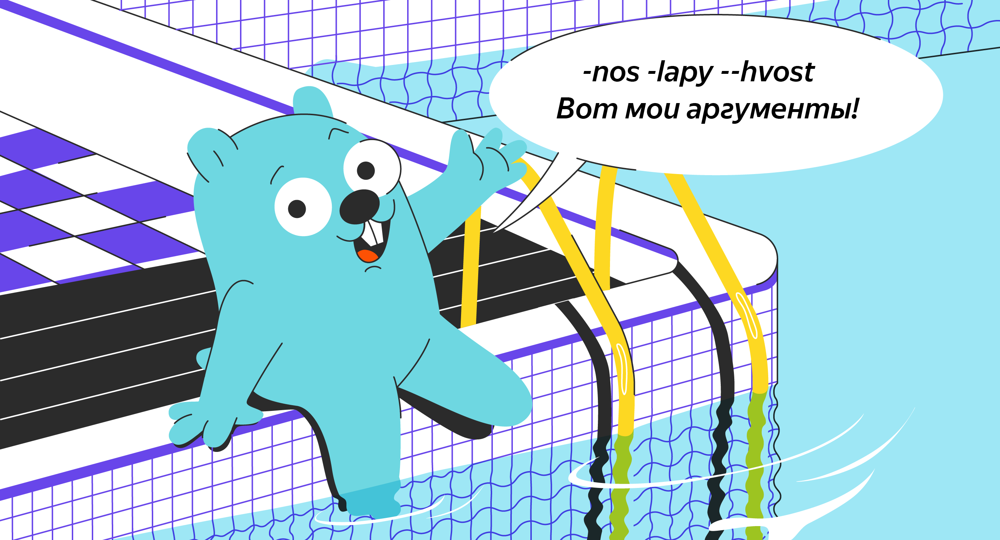
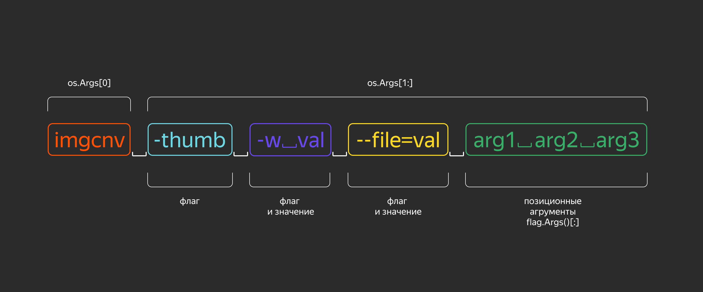
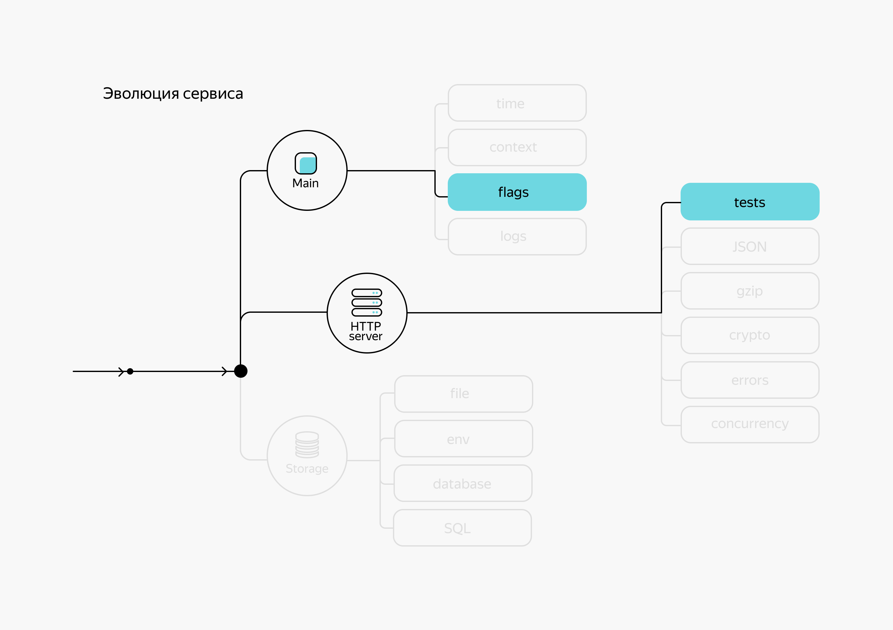
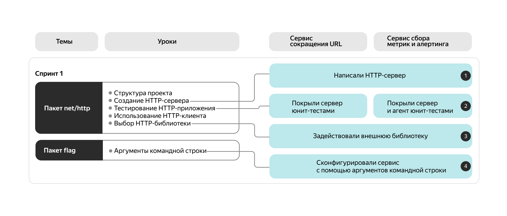

# Аргументы командной строки

Чтобы при запуске программы передать ей какие-то параметры, можно использовать переменные окружения или файлы конфигурации. Представьте, что руководитель поставил вам задачу — написать консольную программу для конвертации и оптимизации изображений перед размещением на сайте.

Так как программа будет запускаться очень часто и в разных ситуациях, переменные окружения и файлы конфигурации не помогут. Нужно использовать аргументы командной строки, которые ещё называют флагами. Уже известен минимальный набор параметров требуемой программы:
- `file` — имя файла с изображением;
- `dest` — директория для сохранения обработанного изображения;
- `w` — ширина обработанного изображения;
- `thumb` — дополнительный параметр, если нужно создать миниатюру.



В этой теме рассмотрим, как реализовать обработку передаваемых параметров с помощью пакета flag и как использовать аргументы командной строки для конфигурирования приложения. Вы узнаете:
- какой синтаксис флагов поддерживает Go;
- какие функции для разбора флагов предлагает стандартная библиотека;
- как получить значения всех параметров, переданных программе при запуске.

Изучив этот урок, вы легко сможете прочитать аргументы командной строки при подобном вызове:
```bash
$ imgcnv -thumb -w 1024 -file "./in/img0001.jpg" -dest "/home/user/images"
```

Если требования к реализации программы будут выходить за рамки пакета `flag`, то на помощь придут сторонние библиотеки. Обзор одной из них вы также найдёте в этом уроке.

У консольных утилит нет графического интерфейса как у оконных программ. Зато их быстрее писать, отлаживать и запускать. Сервисы, работающие в облаке или на удалённых машинах в дата-центрах, чаще всего запускаются из консоли. Язык Go проектировали именно как серверный, поэтому он хорошо подходит для таких задач. Параметры выполнения консольной программы задаются с помощью флагов — аргументов, передаваемых программе при запуске.

**На заметку**
Формат параметров командной строки регламентируется различными международными соглашениями. Например, [серия стандартов POSIX](https://ru.wikipedia.org/wiki/POSIX) допускает только односимвольные имена параметров (`-x`). [Стандарт GNU](https://ru.wikipedia.org/wiki/Стандарты_кодирования_GNU) расширяет POSIX за счёт использования имён с двойным дефисом (`--name`). А для Windows распространён вариант написания параметров через слеш (`/x`). Объединяет эти соглашения, пожалуй, только то, что значение параметра следует заключать в кавычки, если оно содержит пробел (`-p "значение с пробелами"`).

В Go cамый простой способ получить аргументы командной строки — это использовать глобальную переменную `os.Args []string`. Она содержит все параметры командной строки, начиная с имени запущенного приложения. При этом вы можете работать с параметрами и интерпретировать их как вам угодно.

```go
package main

import (
    "fmt"
    "os"
)

func main() {
    // первый аргумент — имя запущенного файла
    fmt.Printf("Command: %v\n", os.Args[0])
    // выведем остальные параметры
    for i, v := range os.Args[1:] {
        fmt.Println(i+1, v)
    }
}
```

Если запустить g`o run main.go -thumb -w 1024 -file "./in/img0001.jpg" -dest "/home/user/images"`, то компилятор создаст исполняемый файл во временной директории и передаст ему указанные параметры. В результате получится примерно следующее:
```
Command: /tmp/go-build3250572125/b001/exe/imgcnv
1 -thumb
2 -w
3 1024
4 -file
5 ./in/img0001.jpg
6 -dest
7 /home/user/images
```

Если вы хотите просто передать программе список файлов, то можно обойтись переменной `os.Args`. Но если есть несколько флагов, которые могут определяться в любом порядке, то разбор `os.Args` становится гораздо сложнее. Придётся искать каждый параметр в списке доступных аргументов, а ещё учитывать ошибочное указание флагов.

Облегчить работу с флагами поможет пакет `flag` стандартной библиотеки, который содержит функции для парсинга аргументов командной строки.

## Пакет flag

Функции пакета позволяют получать числовые, строковые, логические значения флагов и допускают следующий синтаксис параметров:
```
-flag    // логический флаг без значения
-flag=x  // значения можно указывать через = или пробел
-flag x  // не подходит для логических флагов
```

Можно использовать два дефиса вместо одного: формы `--flag` и `-flag` эквивалентны. Чаще всего однобуквенные флаги пишут с одним дефисом, а длинные формы — с двумя и знаком равенства, но для пакета `flag` формы `-f value` и `--f=value` означают одно и то же. 

С логическими флагами можно указывать, например, такие значения: `1`, `0`, `t`, `f`, `true`, `false`. Если у логического флага не указано значение, то ему присваивается `true`. 

Флаги `-h` и `--help` пакет добавляет в программу автоматически и при обращении к ним выводит список доступных флагов. Например, `./imgcnv -h` будет выводить все флаги, которые вы определите с помощью пакета `flag`.

Рассмотрим пример получения имени файла в параметре `-file`:
```go
package main

import (
    "flag"
    "fmt"
)

func main() {
    // указываем имя флага, значение по умолчанию и описание
    imgFile := flag.String("file", "", "input image file")
    // делаем разбор командной строки
    flag.Parse()
    fmt.Println("Image file:", *imgFile)
}
```

Скомпилированная программа, вызванная с флагом `--help`, выведет:
```
$ ./imgcnv --help
Usage of ./imgcnv:
  -file string
        input image file
```

Если её вызвать с флагом `--file`, получим:
```
$ ./imgcnv --file /home/user/input/img001.png
Image file: /home/user/input/img001.png
```

Теперь перейдём к более детальному изучению возможностей пакета `flag`.

## Декларация флага

Декларировать флаги можно функциями вида:
- `Bool(name string, value bool, usage string) *bool`,
- `Int(name string, value int, usage string) *int`,
- `String(name string, value string, usage string) *string`.

Аналогичные функции есть для `int64`, `float64` и других типов. 

Такие функции принимают в качестве аргументов имя флага, значение по умолчанию и строку расшифровки, предназначенную для вывода в подсказке `usage`. А возвращают адрес переменной, с которой связывается значение флага. 

**Важно**
Функции возвращают не сами значения, а указатели на значения. Это связано с тем, что разбор параметров командной строки и подстановка значений происходят при вызове функции `flag.Parse()`. До этого переменным присвоены значения по умолчанию.

Функция `flag.Parse()` делает парсинг аргументов командной строки `os.Args[1:]` в соответствии с декларациями флагов: если флаг был определён, он будет распарсен соответствующим образом. Затем функция заполняет значениями связанные переменные, после чего их можно использовать в логике кода.

Несоблюдение синтаксиса флагов может привести к ошибке парсинга. Например, если при парсинге обнаружится неизвестный флаг, то программа закончит работу с сообщением об ошибке и выведет список доступных флагов.

Для эксперимента скомпилируйте этот пример кода и запустите его с разными аргументами командной строки.
```go
package main

import (
    "flag"
    "fmt"
)

func main() {
    imgFile := flag.String("file", "", "input image file")
    destDir := flag.String("dest", "./output", "destination folder")
    width := flag.Int("w", 1024, "width of the image")
    isThumb := flag.Bool("thumb", false, "create thumb")

    // разбор командной строки
    flag.Parse()
    fmt.Println("Image file:", *imgFile)
    fmt.Println("Destination folder:", *destDir)
    fmt.Println("Width:", *width)
    fmt.Println("Thumbs:", *isThumb)
}
```

А теперь запустите пример из начала урока: `imgcnv -thumb -w 1024 -file "./in/img0001.jpg" -dest "/home/user/images"`.

___
Какие значения будут у переменных, связанных с флагами, до вызова `flag.Parse()`?
~~Значения флагов по умолчанию. Значения по умолчанию устанавливаются для связанных переменных при декларации флагов.~~
___

Если у вас уже есть переменная, которая должна содержать значение аргумента, то стоит использовать следующие варианты функций для определения флагов:
- `BoolVar(p *bool, name string, value bool, usage string)`,
- `IntVar(p *int, name string, value int, usage string)`,
- `StringVar(p *string, name string, value string, usage string)`.

Первым аргументом эти функции принимают указатель на переменную, где будет храниться значение флага.

Например, можно держать значения флагов в полях одной структуры:
```go
var options struct {
    width int
    thumb bool
}

// связывать так
flag.IntVar(&options.width, "width", 1024, "width of the image")
flag.BoolVar(&options.thumb, "thumb", false, "create thumb")
```

Декларации флагов можно помещать в `init()`-функции пакета или сразу присваивать значения глобальным переменным:
```go
var (
    width *int
    thumb *bool
)

func init() {
    // используем init-функцию
    width = flag.Int("width", 1024, "width of the image")
    thumb = flag.Bool("thumb", false, "create thumb")
}
```
```go
// сразу используем глобальные переменные
var (
    width = flag.Int("width", 1024, "width of the image")
    thumb = flag.Bool("thumb", false, "create thumb")
)
```

Тогда в `main()` останется только вызвать `flag.Parse()`. Вызывать `flag.Parse()` в `init()`-функциях не следует, потому что порядок выполнения этих функций трудно предсказать.
___
Что будет, если привязать несколько флагов к одной переменной?
```go
ptr := flag.String("file", "", "input image file")
flag.StringVar(ptr, "dest", "./output", "destination folder")
flag.StringVar(ptr, "prefix", "cnv_", "prefix for output image file")
flag.Parse()
```
~~Успешная компиляция. Переменная примет значение последнего переданного флага. А `cnv_` будет значением по умолчанию. Переменная будет равна последнему переданному флагу среди `-file`, `-dest` и `-prefix` со значением по умолчанию `cnv_`.~~

## Позиционные аргументы

Функция `flag.Parse()` обрабатывает флаги. Но не у всех аргументов командной строки обязательно должен быть синтаксис и семантика флагов. 

Допустим, нужно изменить программу обработки картинок так, чтобы можно было указывать сразу несколько изображений для конвертации. Для этого можно убрать параметр `-file`, а файлы для обработки указать после флагов. Тогда у имён файлов не будет семантики флага — это просто аргументы. 

Когда функция `flag.Parse()` встречает аргумент, не соответствующий стандарту парсинга, этот и все последующие аргументы становятся для неё позиционными. Они рассматриваются как слайс строк, и их можно получить функциями `flag.Arg()` и `flag.Args()`:
- `Arg(i int) string` возвращает i-й позиционный аргумент в виде строки,
- `Args() []string` возвращает все позиционные аргументы в виде слайса строк.



Соответственно, программа должна измениться следующим образом:
```go
func main() {
    destDir := flag.String("dest", "./output", "destination folder")
    width := flag.Int("w", 1024, "width of the image")
    isThumb := flag.Bool("thumb", false, "create thumb")

    flag.Parse()
    // получаем список файлов
    for i, v := range flag.Args() {
        fmt.Printf("Image file (%d):\r\n", i, v)
    }
    fmt.Println("Destination folder:", *destDir)
    fmt.Println("Width:", *width)
    fmt.Println("Thumbs:", *isThumb)
}
```

___
Как программа обработает флаги `imgcnv --dest my pictures --file=img002.jpg`?
~~`dest` примет значение `my`. Всё остальное, начиная с `pictures`, программа будет считать позиционными аргументами. Аргумент `pictures` нарушает синтаксис флагов. Поэтому `pictures` и все последующие аргументы функция `flag.Parse()` трактует как позиционные.~~
___

## Наборы флагов

Предположим, что в компании реализовано несколько программ, отвечающих за работу с изображениями. Их можно объединить в одну утилиту, при запуске которой нужно указать конкретное действие и соответствующие параметры. Например:
```bash
img cnv -w 1024 -dest "/home/user/images" "./in/img0001.jpg" 
img filter -gray -dest "./output" "./in/img0003.jpg" 
```

Архитектура пакета `flag` позволяет создавать наборы флагов. Нужно это в основном для реализации концепции **подкоманд (subcommands)**. Впервые такую форму применили разработчики утилиты git (git add, git commit), после чего она стала очень популярной.

Структура `flag.FlagSet` представляет собой набор декларированных флагов. Верхнеуровневые функции пакета вроде `flag.Int()` работают на наборе `flag.CommandLine`, который определён так:
```go
var CommandLine = NewFlagSet(os.Args[0], ExitOnError)
```

Функция `flag.NewFlagSet(name string, errorHandling ErrorHandling)` принимает аргументами имя нового набора и стратегию поведения в случае ошибки в методе `Parse()`:
- `ContinueOnError()` — вернёт ошибку;
- `ExitOnError()` — прекратит работу программы;
- `PanicOnError()` — создаст панику.

Функция `NewFlagSet()` возвращает новый набор флагов, для которого можно задать свои правила обработки.

Допустим, в программе `img` должны быть подкоманды `cnv` и `filter` со своими наборами флагов:
```go
// декларируем наборы флагов для подкоманд
cnvFlags := flag.NewFlagSet("cnv", flag.ExitOnError)
filterFlags := flag.NewFlagSet("filter", flag.ExitOnError)
// декларируем флаги набора cnvFlags
destDir := cnvFlags.String("dest", "./output", "destination folder")
width := cnvFlags.Int("w", 1024, "width of the image")
isThumb := cnvFlags.Bool("thumb", false, "create thumb")

// флаги набора filterFlags
isGray := filterFlags.Bool("gray", false, "convert to grayscale")
isSepia := filterFlags.Bool("sepia", false, "convert to sepia")
// проверяем, задана ли подкоманда
// os.Arg[0] имя команды
// os.Arg[1] имя подкоманды
if len(os.Args) < 2 {
    fmt.Println("set or get subcommand required")
    os.Exit(1)
}
// в зависимости от переданной подкоманды
// делаем парсинг флагов соответствующего набора,
// передаём функции FlagSet.Parse() аргументы командной строки
// os.Args[2:] содержит все аргументы, 
// следующие за os.Args[1], за именем подкоманды
switch os.Args[1] {
case "cnv":
    cnvFlags.Parse(os.Args[2:])
case "filter":
    filterFlags.Parse(os.Args[2:])
default:
    // PrintDefaults выводит параметры командной строки
    flag.PrintDefaults()
    os.Exit(1)
}
// проверяем, какой набор флагов использовался,
// то есть какая подкоманда была передана, 
// функция FlagSet.Parsed() возвращает false, если
// парсинг флагов набора не проводился
if cnvFlags.Parsed() {
    // логика для img cnv
}
if filterFlags.Parsed() {
    // логика для img filter
} 
```

## Пользовательские правила обработки

Кроме парсинга флагов в базовые типы языка, в Go возможна обработка значения флага пользовательской функцией:
```go
func Func(name, usage string, fn func(string) error)
```

Функция `flag.Func()` принимает в качестве аргументов имя флага, информативную строку `usage` и функцию-обработчик. Если при парсинге параметров командной строки встречается флаг с указанным именем, его значение передаётся строкой функции-обработчику.

Внутри обработчика можно толковать значение флага произвольным образом. Ошибка, возвращаемая функцией-обработчиком, трактуется как ошибка парсинга.

Например, в программу конвертации картинок потребовалось добавить возможность поворачивать и отражать изображения в виде параметров `imgcnv -effects=rot90,mirh,mirv,rot270`. Чтобы это сделать, нужно дописать код:
```go
// готовим переменную для аргументов
var effects []string
// декларируем функцию-обработчик
flag.Func("effects", "Rotation and mirror", func(flagValue string) error {
    // разбиваем значение флага на слайс строк через запятую
    // и заливаем в переменную
    effects = strings.Split(flagValue, ",")
    return nil
})
// запускаем парсинг
flag.Parse()
```

## Интерфейс пользовательской обработки

Для обработки параметра `flag.Func()` предлагает указать функцию. Но в пакете `flag` также есть инструмент, основанный на статической типизации. Функция `Var(value Value, name string, usage string)` допускает процессинг флагов в произвольные пользовательские типы, удовлетворяющие интерфейсу `flag.Value`.

```go
type Value interface {
    String() string
    Set(string) error
}
```

Перепишем парсинг `-effects=rot90,mirh,mirv,rot270` с использованием функции `flag.Var()`. Допустим, уже есть тип:
```go
type Options struct {
    width   int
    thumb   bool
    effects []string
}
```

Для этого типа определим методы интерфейса `flag.Value`:
```go
// String должен уметь сериализовать переменную типа в строку.
func (o *Options) String() string {
    return fmt.Sprint(strings.Join(o.effects, ","))
}

// Set связывает переменную типа со значением флага
// и устанавливает правила парсинга для пользовательского типа.
func (o *Options) Set(flagValue string) error {
    o.effects = strings.Split(flagValue, ",")
    return nil
}
```

После этого можно сделать парсинг флага в пользовательский тип функцией `flag.Var()`:
```go
options := new(Options)
// декларируем парсинг флага effects в переменную типа Options
flag.Var(options, "effects", "Rotation and mirror")
// запускаем парсинг
flag.Parse()
```

Так можно определить правила парсинга для любого пользовательского типа. Этот метод лучше структурирован и имеет более строгую типизацию, чем `flag.Func()`.

___
Реализуйте интерфейс `flag.Value` для типа:
```go
type NetAddress struct {
    Host string
    Port int
}
```
И разберите флаг `--addr=example.com:60`:
```go
package main

import (
    "flag"
    "fmt"
)

type NetAddress struct {
    Host string
    Port int
}

// допишите код реализации методов интерфейса
// ...

func main() {
    addr := new(NetAddress)
    // если интерфейс не реализован,
    // здесь будет ошибка компиляции
    _ = flag.Value(addr)
    // проверка реализации
    flag.Var(addr, "addr", "Net address host:port")
    flag.Parse()
    fmt.Println(addr.Host)
    fmt.Println(addr.Port)
}
```
Решение:
```go
import (
    "errors"
    "strings"
    "strconv"
)

func (a NetAddress) String() string {
    return a.Host + ":" + strconv.Itoa(a.Port)
}

func (a *NetAddress) Set(s string) error {
    hp := strings.Split(s, ":")
    if len(hp) != 2 {
        return errors.New("Need address in a form host:port")
    }
    port, err := strconv.Atoi(hp[1])
    if err != nil{
        return err
    }
    a.Host = hp[0]
    a.Port = port
    return nil
}
```

## Сторонние библиотеки

Пакет `flag` прост в применении, и часто его функций достаточно для решения рабочих задач. А если нет — в Go-сообществе есть другие популярные библиотеки для работы с параметрами командной строки.

Например, библиотека [Cobra](https://github.com/spf13/cobra) упрощает создание программ командной строки. Она содержит свой пакет обработки флагов [pflag](https://github.com/spf13/pflag), полностью совместимый со стандартной библиотекой, но с расширениями и дополнениями.

Преимущества пакета `pflag`:
- соответствие расширений `pflag` стандарта POSIX рекомендациям GNU;
- более точная спецификация типов — например, `uint8`, `uint16`, `int32`;
- поддержка из коробки большего количества типов — например, `ip`, `ip mask`, `ip net`, `count` и всех типов слайсов;
- наличие вспомогательных хелпер-функций — `shorthand`, `deprecated`, `hidden`.

Можно, например, декларировать такой флаг:
```go
var myIp *net.IP
myIp = pflag.IP(ip, net.ParseIP("192.168.0.1"), "Host IP address")
```

Чтобы соблюсти рекомендации GNU, `pflag` позволяет использовать такой синтаксис:
```bash
-aon "jack"
-aon="jack"
-aon"jack"
-aonjack
```

В процессе развития и доработки утилиты параметры могут меняться. Обычно разработчики оставляют устаревшие флаги валидными для обратной совместимости. Пакет `pflag` предоставляет вспомогательную функцию `MarkDeprecated()` для таких ситуаций:
```go
// помечает параметр badflag вышедшим из употребления,
// предлагает новый флаг des-detail
flag.CommandLine.MarkDeprecated("badflag", "please use --des-detail instead")
```

При этом пакет `pflag` можно использовать вместе со стандартным `flag`:
```go
import (
    goflag "flag"
    flag "github.com/spf13/pflag"
)

var ip *int = flag.Int("flagname", 1234, "help message for flagname")

func main() {
    // для использования флагов stdlib/flag
    // набор нужно добавить к pflag.FlagSet
    flag.CommandLine.AddGoFlagSet(goflag.CommandLine)
    flag.Parse()
}
```

___
Функция `flag.Usage()` отвечает за вывод доступных параметров при `-h/--help`. Она объявлена в пакете как переменная, то есть её можно модифицировать:
```go
var Usage = func() {
    fmt.Fprintf(CommandLine.Output(), "Usage of %s:\n", os.Args[0])
    PrintDefaults()
}
```
Напишите собственную функцию, которая, кроме имени, будет выводить ещё и версию программы:
```go
package main

import (
    "flag"
    "fmt"
)

var version = "0.0.1"

func main() {
    // допишите код
    flag.Parse()
}
```
Решение:
```go
package main

import (
    "flag"
    "fmt"
    "os"
)

var version = "0.0.1"

func main() {
    flag.Usage = func() {
        fmt.Fprintf(flag.CommandLine.Output(), "Version: %v\nUsage of %s:\n", version, os.Args[0])
        flag.PrintDefaults()
    }

    flag.Parse()
}
```

## Дополнительные материалы
- [go.dev/flag](https://pkg.go.dev/flag) — документация пакета flag.
- [GitHub | Cobra](https://github.com/spf13/cobra) — о библиотеке Cobra.
- [GitHub | pflag](https://github.com/spf13/pflag) — о пакете pflag.
- [GNU.org | Program Argument Syntax Conventions](http://www.gnu.org/software/libc/manual/html_node/Argument-Syntax.html) — рекомендации GNU.

## Обучение Алисы 4

Пока что сервер с навыком Алисы запускается на локальном порту `8080`. Этот порт ещё называют `http_alt`. Он часто используется для запуска и тестирования HTTP-сервисов, что резко повышает вероятность ситуации, когда порт окажется занят и наш сервис не сможет запуститься. Поэтому добавим в проект возможность задать адрес и порт с помощью аргументов командной строки.

Для начала создадим новый файл `cmd/skill/flags.go`. Должна получиться такая структура проекта:
```
> ~/dev/alice-skill
    |
    |--- cmd
    |     |--- skill
    |            |--- flags.go
    |            |--- main.go
    |            |--- main_test.go
    |--- internal
    |--- go.mod
    |--- go.sum
```

Файл `flags.go` добавлен непосредственно в директорию с исходным кодом, потому что аргументы, которые будут описаны в этом файле, имеют отношение только к исполняемому приложению. Хорошая практика — ограничивать методы конфигурации только конфигурируемым кодом.

Внутри файла `flags.go` напишем:
```go
package main

import (
    "flag"
)

// неэкспортированная переменная flagRunAddr содержит адрес и порт для запуска сервера
var flagRunAddr string

// parseFlags обрабатывает аргументы командной строки 
// и сохраняет их значения в соответствующих переменных
func parseFlags() {
    // регистрируем переменную flagRunAddr 
    // как аргумент -a со значением :8080 по умолчанию
    flag.StringVar(&flagRunAddr, "a", ":8080", "address and port to run server")
    // парсим переданные серверу аргументы в зарегистрированные переменные
    flag.Parse()
}
```

Кроме этого, нужно изменить код в файле `cmd/skill/main.go` так, чтобы использовать переменную `flagRunAddr` в качестве источника адреса:
```go
func main() {
    // обрабатываем аргументы командной строки
    parseFlags()

    if err := run(); err != nil {
        panic(err)
    }
}

func run() error {
    fmt.Println("Running server on", flagRunAddr)
    return http.ListenAndServe(flagRunAddr, http.HandlerFunc(webhook))
}
```

Теперь можно скомпилировать приложение и протестировать работоспособность аргумента `-a`:
```bash
$ go build -o skill
$ ./skill
Running server on :8080

$ ./skill -a :8081
Running server on :8081
```

Без указания аргумента `-a` сервер, как и раньше, будет запускаться на локальном порту `8080`. А при передаче аргумента будет использоваться указанное значение.

В этой итерации мы добавили возможность конфигурировать наш сервис с помощью аргументов командной строки. Теперь мы можем как минимум запустить несколько экземпляров нашего сервиса, что потенциально позволяет нам эмулировать взаимодействие двух пользователей локально.

В следующей итерации, в дополнение к аргументам командной строки, мы добавим возможность конфигурации сервиса с помощью переменных окружения.

## Инкремент 4

### Задание по треку «Сервис сокращения URL»

Добавьте возможность конфигурировать сервис с помощью аргументов командной строки.

Создайте конфигурацию или переменные для запуска со следующими флагами:
- Флаг `-a` отвечает за адрес запуска HTTP-сервера (значение может быть таким: `localhost:8888`).
- Флаг `-b` отвечает за базовый адрес результирующего сокращённого URL (значение: адрес сервера перед коротким URL, например, `http://localhost:8000/qsd54gFg`).

Совет: создайте отдельный пакет `config`, где будет храниться структура с вашей конфигурацией и функция, которая будет инициализировать поля этой структуры. По мере усложнения конфигурации вы сможете добавлять необходимые поля в вашу структуру и инициализировать их.

### Задание по треку «Сервис сбора метрик и алертинга»

Доработайте код, чтобы он умел принимать аргументы с использованием флагов.

Аргументы сервера:
- Флаг `-a=<ЗНАЧЕНИЕ>` отвечает за адрес эндпоинта HTTP-сервера (по умолчанию `localhost:8080`).

Аргументы агента:
- Флаг `-a=<ЗНАЧЕНИЕ>` отвечает за адрес эндпоинта HTTP-сервера (по умолчанию `localhost:8080`).
- Флаг `-r=<ЗНАЧЕНИЕ>` позволяет переопределять `reportInterval` — частоту отправки метрик на сервер (по умолчанию 10 секунд).
- Флаг `-p=<ЗНАЧЕНИЕ>` позволяет переопределять `pollInterval` — частоту опроса метрик из пакета `runtime` (по умолчанию 2 секунды).

При попытке передать приложению незвестные флаги оно должно завершаться с сообщением о соответствующей ошибке.

Значения интервалов времени должны задаваться в секундах.

Во всех случаях должны присутствовать значения по умолчанию.

## Что вы узнали

Вот и закончилась ещё одна тема. Она состояла из небольшого, но важного урока. Аргументы командной строки — то, с чем часто приходится сталкиваться Go-разработчику. 

На примере вымышленной программы для обработки изображений вы увидели, как на практике может происходить работа с параметрами командной строки, и добавили поддержку флагов в разрабатываемый вами сервис.

В этой теме вы научились:
- получать значения флагов, используя функции пакета `flag`;
- писать собственные функции для разбора аргументов командной строки;
- разбирать командную строку с произвольным количеством параметров;
- работать с наборами флагов;
- использовать интерфейс `flag.Value` для сохранения значений в нужной структуре.



## Заключение

Поздравляем, первый спринт пройден! Посмотрим на карту спринта и подведём итоги: что вы успели сделать за это время.



