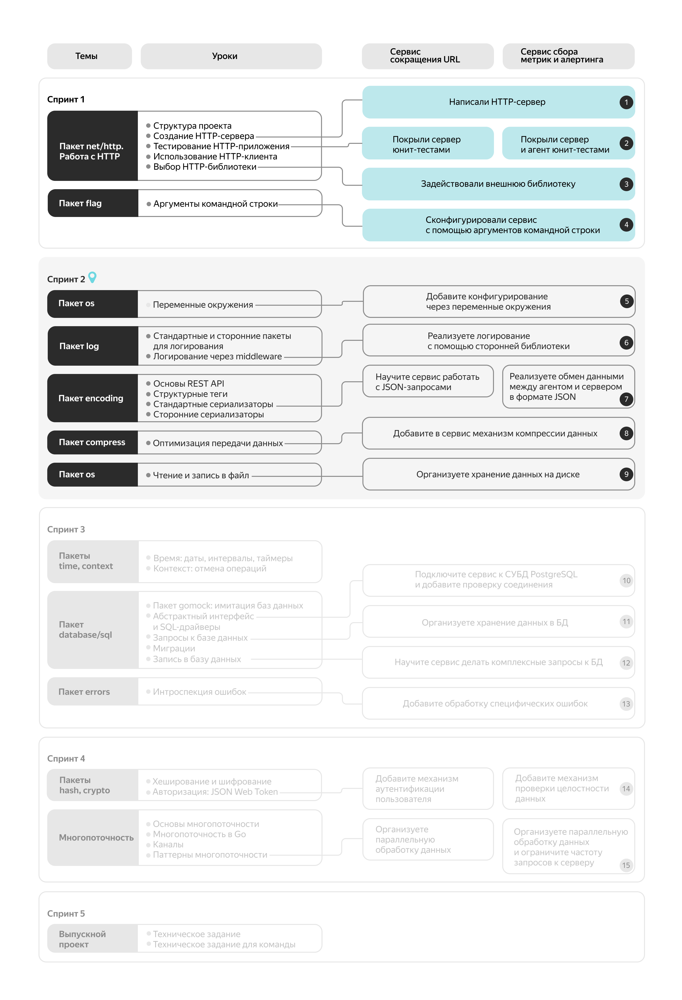
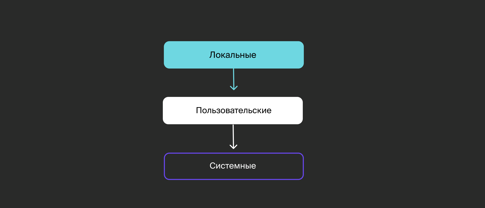

# Введение в спринт 2

Приветствуем вас во втором спринте курса по языку Go!

## Что вас ждёт?
- научитесь работать с переменными окружения и файлами с помощью пакета `os`;
- будете логировать события в вашем приложении с помощью пакета стандартной библиотеки `log`, а также сторонних логгеров;
- познакомитесь с паттерном `middleware` и основами проектирования REST API;
- узнаете, что такое структурные тэги и как с их помощью управлять кодированием и декодированием данных в различные форматы — на примере JSON, XML, gob и MessagePack;
- начнете экономить трафик в вашем приложении путём сжатия данных через пакет `compress`.

## Проектные инкременты

В этом спринте вы продолжите развивать практический проект по выбранному треку и решите следующие задачи:
- расширение функции конфигрурирования сервиса с помощью переменных окружения;
- логирование внутренних процессов сервиса;
- добавление новой функциональности в соответствии с правилами проектирования REST;
- поддержка работы с данными в формате JSON;
- поддержка работы со сжатыми данными.

## Покрытие кода тестами

Помните совет из Введения в первый спринт: «тестируйте сразу»? Тестирование — важная часть работы Go-разработчика, поэтому мы призываем вас оттачивать свои навыки в написании тестов.
В первой половине курса мы **рекомендуем** покрывать код вашего проекта тестами на определённый процент, но во второй части это станет **обязательным условием** для сдачи проекта. Мы уверены, что вы будете к этому готовы.

### Покрытие кода по спринтам
Рекомендуется:
- Спринт 2: 10%
- Спринт 3: 20%
- Спринт 4: 30%

Обязательно:
- Спринт 6: 40%
- Спринт 7: 50%
- Спринт 8: 60%
- Спринт 9: 70%

**Внимание**: к концу спринта рекомендуется покрыть код тестами на **10%**.

## Карта курса

Перед вами — карта курса, которая поможет отслеживать путь вашего обучения и прогресс в проектной работе. Вы можете обращаться к ней в любой момент, чтобы понимать, на каком этапе находитесь.

Ориентир задан — пора двигаться вперед, навстречу новым знаниям!



# Переменные окружения

Передать параметры программе можно не только с помощью флагов, но и через переменные окружения. Выбор подхода зависит от задачи. Если приложение будет запускаться с одними и теми же параметрами, лучше использовать переменные окружения — так не придётся указывать аргументы при запуске. А если параметры часто меняются, лучше подойдут флаги: их проще настраивать при каждом запуске.

Новая тема как раз посвящена переменным окружения. В уроке вы: 
- познакомитесь с пакетом `os` и сторонним пакетом `caarlos0/env`;
- узнаете, как получать переменные окружения на Go;
- научитесь использовать переменные окружения для конфигурирования сервисов.

Эти знания пригодятся вам для выполнения инкремента. Вы делаете учебный проект, в котором нет необходимости указывать разные адреса сервера. Поэтому вы будете передавать адрес (например, `localhost:8080`) через переменную окружения.

Переменные окружения — это средство операционной системы для конфигурирования программ. Через них можно:
- передавать параметры программе;
- получать конфигурацию операционной системы — например, имя текущего пользователя и путь к домашней директории.

Выделяют три уровня переменных окружения:
- локальные — определённые для текущей сессии;
- пользовательские — определённые для конкретного пользователя;
- системные — доступные во всей системе.

Переменные каждого уровня наследуют переменные уровнем ниже, могут их дополнять и переопределять в рамках своего уровня. 



Для начала выведем в консоль значение какой-нибудь переменной окружения — например, имя текущего пользователя. Чтобы лучше разобраться в теме и сразу набить руку, повторяйте описываемые действия на своём компьютере. 

Обратите внимание, что работа с переменными окружения в терминале различается на Linux, Windows и macOS:
- **Linux**. Имя пользователя хранится в переменной `USER`. Чтобы получить её значение, запустите в консоли `echo $USER`. Список всех переменных окружения можно вывести командой `env`.
- **Windows**. Имя пользователя хранится в переменной `USERNAME`. В отличие от Linux, на Windows имя переменной можно указывать в любом регистре. Поэтому `echo %USERNAME%` и `echo %UserName%` выведут одно и то же значение. Чтобы увидеть все переменные окружения, используйте команду `set`. Если у вас Windows 11, попробуйте использовать следующие команды: `$Env:UserName`, `$Env:UserDomain`, `$Env:ComputerName`.
- **macOS**. Как и на Linux, имя пользователя хранится в переменной `USER`. Для получения значения переменной примените `echo $USER`. Команда `printenv` выводит список всех переменных окружения.

## Работа с переменными окружения с помощью пакета os

Теперь выведем значение переменной `USER` в примере на Go. Получить значение переменной можно функцией `os.Getenv(key string) string`:
```go
package main

import (
    "fmt"
    "os"
)

func main() {
    u := os.Getenv("USER")
    fmt.Println(u)
}
```

Если переменной `USER` нет, функция `GetEnv()` вернёт пустую строку. Чтобы определить, отсутствует ли переменная или существует с пустым значением, используйте функцию `os.LookupEnv(key string) (string, bool)`.

Получить значения всех переменных окружения можно функцией `Environ() []string`:
```go
package main

import (
    "fmt"
    "os"
)

func main() {
    envList := os.Environ()
    // выводим первые пять элементов
    for i := 0; i < 5 && i < len(envList); i++ {
        fmt.Println(envList[i])
    }
}
```

Каждый элемент результирующего слайса представляет собой запись вида `имя=значение`. Вывод может выглядеть так:
```bash
SHELL=/bin/bash
SESSION_MANAGER=local/ak-desktop:@/tmp/.ICE-unix/1265,unix/ak-desktop:/tmp/.ICE-unix/1265
QT_ACCESSIBILITY=1
COLORTERM=truecolor
XDG_CONFIG_DIRS=/etc/xdg/xdg-cinnamon:/etc/xdg
```

## Работа с переменными окружения с помощью сторонних пакетов

Чтобы вручную не парсить и не валидировать переменные окружения, можно воспользоваться сторонними пакетами. Один из самых популярных — `github.com/caarlos0/env`.

Этот пакет может парсить следующие типы данных:
- базовые типы (`string`, `int`, `bool`, `float32` и т. д.);
- комплексные типы (`time.Duration`, `url.URL`);
- типы, реализующие интерфейс `encoding.TextUnmarshaler`;
- слайсы.

Пакет `caarlos0/env` позволяет проверить, существует ли переменная окружения и соответствует ли её значение определённому типу данных.

Он принимает параметры через структурные теги вида `env:"NAME"` от структуры, которую нужно заполнить значениями из окружения.

Рассмотрим пример использования пакета. Предположим, для конфигурации требуются следующие переменные окружения:
- `FILES` — список файлов, разделённых двоеточием;
- `HOME` — домашняя директория;
- `TASK_DURATION` — интервал запуска задач (если эта переменная отсутствует, программа завершается с ошибкой).

```go
package main

import (
    "github.com/caarlos0/env/v6"
    "log"
    "time"
)

type Config struct {
    Files        []string      `env:"FILES" envSeparator:":"`
    Home         string        `env:"HOME"`
    // required требует, чтобы переменная TASK_DURATION была определена
    TaskDuration time.Duration `env:"TASK_DURATION,required"`
}

func main() {
    var cfg Config
    err := env.Parse(&cfg)
    if err != nil {
        log.Fatal(err)
    }

    log.Println(cfg)
}
```
```
2025/08/30 11:33:59 env: required environment variable "TASK_DURATION" is not set
```

Если вы запустите эту программу, она выведет ошибку `env: required environment variable "TASK_DURATION" is not set`. Задайте на своём компьютере переменные окружения `FILES` и `TASK_DURATION`.

На Windows переменные окружения задаются командой `SET`:
```bat
SET FILES=test1.txt:test2.txt
SET TASK_DURATION=5s
```

На Linux, как и на macOS, это можно сделать командой `export`:
```bash
export FILES=test1.txt:test2.txt
export TASK_DURATION=5s
```

Теперь снова запустите программу и посмотрите на результат.
```
```

___
Выведите имя текущего пользователя в консоль с помощью пакета `caarlos0/env`.
```go
package main

import (
    "fmt"
    "github.com/caarlos0/env/v6"
)

type Config struct {
    User string  // укажите тег env
}

func main() {
    var cfg Config
    // допишите код

    fmt.Printf("Current user is %s\n", cfg.User)
}
```
```go
package main

import (
    "fmt"
    "log"
    "github.com/caarlos0/env/v6"
)

type Config struct {
    User string `env:"USER"`
}

func main() {
    var cfg Config
    err := env.Parse(&cfg)
    if err != nil {
        log.Fatal(err)
    }

    fmt.Printf("Current user is %s\n", cfg.User)
}
```
___
В каких случаях стоит использовать пакет `github.com/caarlos0/env`, а не `os.Getenv`?

Верные:
- Когда нужно распарсить `time.Duration` из переменной окружения. (`caarlos0/env` умеет автоматически преобразовывать строки в `time.Duration` в отличие от `os.Getenv`.)
- Когда нужно проверить, что переменная окружения задана, и завершить программу с ошибкой, если её нет. (`caarlos0/env` поддерживает флаг `required`, который делает это автоматически.)
- Когда переменные окружения нужно парсить в структуру со слайсами и кастомными типами. (caarlos0/env как раз создан для такого сценария — умеет парсить даже слайсы.)

Неверные:
- Когда хочется вручную проверить значение переменной и при необходимости задать значение по умолчанию
- Когда нужно просто вывести значение одной переменной в консоль
___
Какой результат вернёт функция `os.Getenv("USERNAME")`, если переменная окружения отсутствует?
~~Пустую строку~~
___

## Дополнительные материалы

- [go.dev/os](https://pkg.go.dev/os) — документация пакета `os`.
- [Losst | Переменные окружения в Linux](https://losst.pro/peremennye-okruzheniya-v-linux) — подробная статья о переменных окружения.
- [GitHub | caarlos0/env](https://github.com/caarlos0/env) — пакет `caarlos0/env`.
- [GitHub | kelseyhightower/envconfig](https://github.com/kelseyhightower/envconfig) — пакет `kelseyhightower/envconfig`.

## Обучение Алисы 5

В некоторых системах развёртывания приложений может не быть возможности передавать исполняемому файлу аргументы командной строки. В таком случае для конфигурирования программы используют переменные окружения. 

Добавим возможность конфигурировать навык Алисы с помощью переменных окружения. Для этого понадобится немного изменить файл `cmd/skill/flags.go`:
```go
package main

import (
    "flag"
    "os"
)

var flagRunAddr string

func parseFlags() {
    flag.StringVar(&flagRunAddr, "a", ":8080", "address and port to run server")
    flag.Parse()

    // для случаев, когда в переменной окружения RUN_ADDR присутствует непустое значение,
    // переопределим адрес запуска сервера,
    // даже если он был передан через аргумент командной строки
    if envRunAddr := os.Getenv("RUN_ADDR"); envRunAddr != "" {
        flagRunAddr = envRunAddr
    }
} 
```

Теперь можем скомпилировать приложение и протестировать переопределение конфигурации:
```shell
$ go build -o skill
$ RUN_ADDR=:8081 ./skill
Running server on :8081

$ RUN_ADDR=:8082 ./skill -a :8081
Running server on :8082
```

Вот и всё! Теперь мы можем конфигурировать навык Алисы любым удобным способом — через аргументы командной строки или с помощью переменных окружения.

В следующей итерации мы добавим логирование действий нашего сервиса с помощью пакета `log`.

## Инкремент 5

### Задание по треку «Сервис сокращения URL»

Добавьте возможность конфигурировать сервис с помощью переменных окружения:
- Адрес запуска HTTP-сервера — с помощью переменной `SERVER_ADDRESS`.
- Базовый адрес результирующего сокращённого URL — с помощью переменной `BASE_URL`.

Приоритет параметров сервера должен быть таким:
- Если указана переменная окружения, то используется она.
- Если нет переменной окружения, но есть аргумент командной строки (флаг), то используется он.
- Если нет ни переменной окружения, ни флага, то используется значение по умолчанию.

### Задание по треку «Сервис сбора метрик и алертинга»

Доработайте агент, чтобы он мог изменять свои параметры запуска по умолчанию через переменные окружения:
- `ADDRESS` отвечает за адрес эндпоинта HTTP-сервера.
- `REPORT_INTERVAL` позволяет переопределять `reportInterval`.
- `POLL_INTERVAL` позволяет переопределять `pollInterval`.

Значения интервалов времени должны задаваться в секундах.

Доработайте сервер, чтобы он мог изменять свои параметры запуска по умолчанию через переменные окружения:
- `ADDRESS` отвечает за адрес эндпоинта HTTP-сервера.

Приоритет параметров должен быть таким:
- Если указана переменная окружения, то используется она.
- Если нет переменной окружения, но есть аргумент командной строки (флаг), то используется он.
- Если нет ни переменной окружения, ни флага, то используется значение по умолчанию.

Допускаем, что прохождение автотестов может вызывать сложности, — это нормально. Рекомендуем попытаться выполнить задание самостоятельно и только в случае тупиковой ситуации написать ментору — он поможет разобраться.
