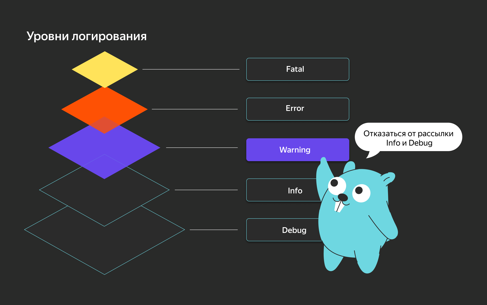
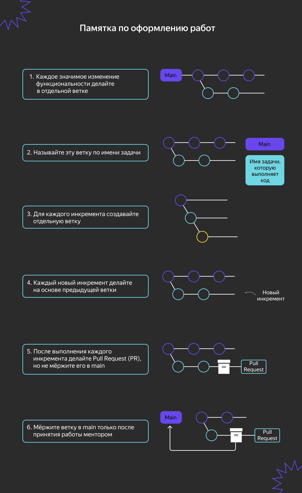
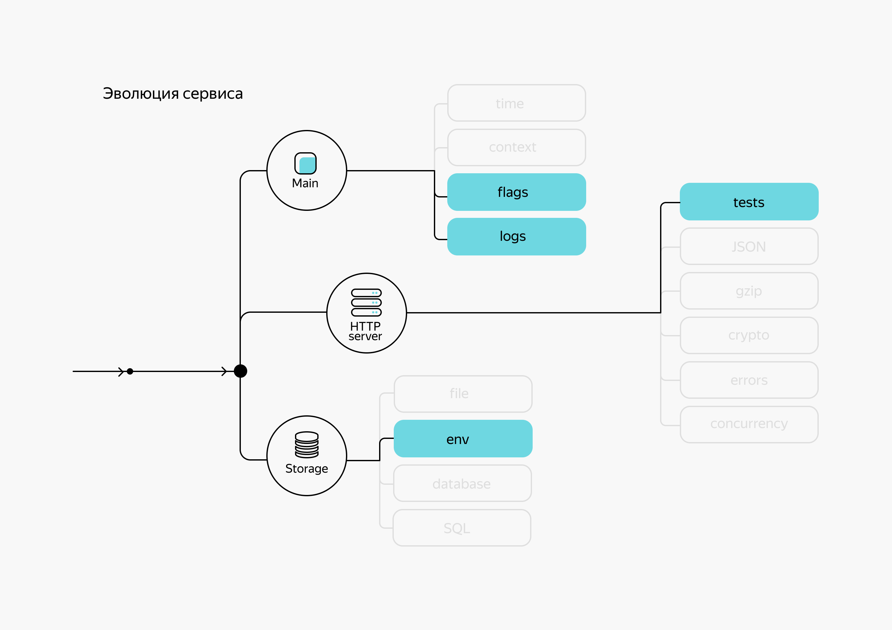

# Пакет log. Логирование в приложении

## Стандартные и сторонние пакеты для логирования

Логирование — отличный способ найти ошибки и узнать, как работает (или почему не работает) ваше приложение. Другими словами, логи — это глаза и уши программиста.

В процессе написания сервиса ошибки возникают постоянно. Когда они обнаруживаются на этапе разработки, это не страшно. Но представьте, что сбой произошёл уже в продакшене: ваш сервис перестал работать и вам срочно нужно найти причину, чтобы скорее починить его. Придётся понервничать. 

Хорошо, если вы с самого начали писали логи: вы можете посмотреть журналы, выявить причину ошибки и понять, как её исправить. А что, если таких журналов нет? Это только прибавит стресса. Вот почему важно использовать логгер в своём приложении.

В этой теме вы:
- изучите пакет `log` стандартной библиотеки Go;
- познакомитесь со сторонними пакетами для более удобного и быстрого логирования;
- напишете полноценный веб-сервер, где реализуете промежуточное ПО со сторонним пакетом `zap` — одним из самых быстрых.

В рамках курса логирование поможет вам быстрее проходить автотесты и вовремя сдавать инкременты на ревью. Поскольку это один из способов находить баги, старайтесь логировать практически всё. После тестирования вы сможете удалить избыточные проверки и оставить только те логи, которые, по вашему мнению, нужны в продакшене. Это хорошая практика, которая не раз вас выручит и сэкономит ваше время и нервы.

В Go есть несколько пакетов для логирования. Поскольку выбор зависит от задачи и от того, какая скорость работы и какие дополнительные возможности вам нужны, расскажем о преимуществах и недостатках каждого пакета.

## Пакет log

Самый простой способ начать работу — использовать пакет стандартной библиотеки под названием `log`. Этот пакет поставляется вместе с Go, прост в применении и генерирует полезные временные метки без какой-либо настройки.

Покажем работу с пакетом `log` на примере:
```go
package main

import (
  "log"
)

func main() {
  log.Print("Logging in Go!")
}
```
```
2025/08/30 16:07:13 Logging in Go!
```

Если вы скомпилируете и запустите исполняемый файл, он выведет такое сообщение:
```bash
$ go build basicLog.go
$ ./basicLog
2022/03/07 09:01:51 Logging in Go!
```

Конечно, это лучше, чем ничего, но по сути это неструктурированная строка с отметкой времени. Хотя `log.Print()` и `log.Println()` — наиболее часто используемые функции в пакете `log`, он не поддерживает уровни без дополнительных действий. В то же время пакет предлагает другие функции, которые выводят сообщения об ошибках в сочетании с другим действием.

Такие функции, как `log.Fatal()`, регистрируют сообщение на уровне `Fatal`, а затем завершают процесс. `log.Panic()` регистрирует сообщение на уровне `Panic`, за которым следует вызов `panic()` — встроенной функции Go.

### Логирование в пользовательский вывод

Использовать консоль для вывода логов можно только в демонстрационных целях, так как информация не сохраняется и может легко потеряться.

Пакет `log` по умолчанию печатает в `stderr`. Но что, если вы хотите вести журналы в другом месте? Функция `log.SetOutput()` позволяет указать место назначения вывода `io.Writer` для логгера. Пакет `log` даёт возможность делать запись в любой объект, который реализует интерфейс `io.Writer`.

Вот, например, реализация записи логов в файл:
```go
package main

import (
    "log"
    "os"
)

func main() {
    // создаём файл info.log и обрабатываем ошибку, если что-то пошло не так
    file, err := os.OpenFile("info.log", os.O_CREATE|os.O_APPEND|os.O_WRONLY, 0644)
    if err != nil {
        log.Fatal(err)
    }
    // откладываем закрытие файла
    defer file.Close()

    // устанавливаем назначение вывода в файл info.log
    log.SetOutput(file)
    log.Print("Logging to a file in Go!")
}
```

Когда вы выполните этот код, он создаст файл с именем `info.log` и сообщения будут записаны в этот файл.

То же самое можно сделать с использованием функции `log.New()`:
```go
func main() {
    flog, err := os.OpenFile(`server.log`, os.O_APPEND|os.O_CREATE|os.O_WRONLY, 0644)
    if err != nil {
        log.Fatal(err)
    }
    defer flog.Close()
    mylog := log.New(flog, `serv `, log.LstdFlags|log.Lshortfile)
    mylog.Println(`Start server`)
    mylog.Println(`Finish server`)
}
```

Если запустить эту программу, в консоли вывода не будет, но в текущей директории будет создан файл `server.log` со следующим содержимым:
```txt
serv 2021/06/24 09:44:42 main.go:15: Start server
serv 2021/06/24 09:44:42 main.go:16: Finish server
```

У функции `log.New()` есть несколько параметров — рассмотрим их подробнее:
- В первом параметре указывается переменная интерфейсного типа `io.Writer`. В примере это открытый для записи файл `flog`, точнее указатель на объект `os.File`, который реализует интерфейс `io.Writer`.
- Второй параметр содержит префикс, который будет добавляться перед каждой записью в лог. В данном случае это префикс `serv`.
- В третьем параметре указываются флаги. Пакет `log` даёт возможность добавлять контекстную информацию (например, имя файла, номер строки, дату и время) — это делается с помощью флагов логгера. В примере указаны следующие флаги: 
    - `log.LstdFlags` — добавляет вывод даты и времени;
    - `log.Lshortfile` — добавляет вывод имени файла и строки, в которой произошла запись в лог.

Функция `log.New()` возвращает указатель на потокобезопасную переменную типа `log.Logger`, которую нужно использовать для логирования в указанный вами файл.

Добавить или изменить набор флагов можно и другим способом. Например, с помощью функции `log.SetFlags()`:
```go
func main(){
    // создаём файл info.log и обрабатываем ошибку, если что-то пошло не так
    file, err := os.OpenFile("info.log", os.O_CREATE|os.O_APPEND|os.O_WRONLY, 0644)
    if err != nil {
        log.Fatal(err)
    }

    // откладываем закрытие файла
    defer file.Close()

    // устанавливаем назначение вывода в файл info.log 
    log.SetOutput(file)

    // добавляем флаги для вывода даты, времени, имени файла
    log.SetFlags(log.Ldate | log.Ltime | log.Lshortfile)
    log.Print("Logging to a file in Go!")
}
```
```bash
$ ./logs 
$ cat info.log
2022/03/07 15:43:22 logs.go:17: Logging to a file in Go!
```

Теперь вывод включает в себя дату, время, имя файла и номер строки.

Если вы хотите записывать разные логи в разные файлы (например, вести лог ошибок и лог HTTP-запросов на сервере), достаточно создать ещё один файл и ещё одну переменную функцией `log.New()`. Тогда ошибки будут записываться в один логгер, а информация о запросах — в другой.

___
Создайте переменную типа `*log.Logger`, которая будет использовать `bytes.Buffer` для записи данных. В результате работы программы в буфере должно быть две строки произвольного содержания — можете использовать, например, названия любимых групп или песен.
```txt
mylog: Hello, world!
mylog: Goodbye
```
```go
package main

import (
    "bytes"
    "fmt"
    "log"
)

func main() {
    var buf bytes.Buffer
    // допишите код
    // 1) создайте переменную типа *log.Logger
    // 2) запишите в неё нужные строки

    // ...

    fmt.Print(&buf)
    // должна вывести
    // mylog: Hello, world!
    // mylog: Goodbye
}
```
```go
    logger := log.New(&buf, "mylog: ", 0)
    logger.Print("Hello, world!")
    logger.Print("Goodbye")
```

Если вам нужно логировать много разной информации и по определённым критериям её группировать, функциональности пакета `log` может быть недостаточно. Он не поддерживает работу с уровнями — чтобы их настроить, следует выбрать внешний пакет. Перед тем как рассматривать сторонние библиотеки, расскажем, что такое уровни логирования, где и когда их использовать.

### Уровни логирования

В лог может записываться информация об ошибках, возможных сбоях или нейтральных событиях в системе. Чтобы разделить её на группы, применяют уровни логирования:

#### Fatal
`Fatal`/`Panic` — это ошибки, которые вызывают аварийную ситуацию или приводят к выходу из программы. При таких ошибках дальнейшая работа программы невозможна. На этом уровне фиксируются события только с уровнем `Fatal`.

**Куда ставить?** Такие логи нужно писать в начале работы вашего проекта — при запуске сервера, подключении к базе данных, инициализации конфигурации приложения. Ошибки должны выводиться тогда, когда продолжать работу нельзя: в случае непредвиденных ситуаций, которые ведут к полному отказу системы. Например, проект не смог запуститься, потому что недоступна база данных или неправильно подгрузилась конфигурация.

#### Error
`Error` — это неожиданные ошибки, требующие выяснения причины и устранения. На этом уровне фиксируются события с уровнями `Error` и `Fatal`.

**Куда ставить?** Нужно писать такие логи, когда фактический результат может не соответствовать ожидаемому. Например, запрос в базу данных упал с ошибкой синтаксиса, сторонний сервис отработал неправильно или нет обработки некорректных данных, поступивших на сервер.

#### Warning
`Warning` — это предупреждения. Они не влияют на работу программы, но могут напомнить о причинах ошибок в будущем. На этом уровне фиксируются события с уровнями `Warning`, `Error` и `Fatal`.

**Куда ставить?** Лучше никуда. Предполагается, что этим уровнем должно покрываться всё, на что стоит обратить внимание или что может вызвать ошибку. Но на практике этот уровень используется редко, так как он неоднозначен: можно перепутать с сообщением `Info` или ошибкой `Error`. Может так случиться, что вы зарегистрируете ошибку на уровне `Warning` и будете долго её искать, потому что это вроде как не ошибка, а предупреждение.

#### Info
`Info` — это информационные сообщения о возникающих событиях. На этом уровне фиксируются события с уровнями `Info`, `Warning`, `Error` и `Fatal`.

**Куда ставить?** Уровень `Info` можно устанавливать везде, где хочется вставить информацию о работе приложения. Этот уровень тоже не рекомендуют из-за его неоднозначности, так как он может означать всё что угодно. Лучше использовать уровень `Debug`/`Trace`.

#### Debug
`Debug` — это служебная информация для отладки и настройки программы. На этом уровне фиксируются события с уровнями `Debug`, `Info`, `Warning`, `Error` и `Fatal`.

**Куда ставить?** `Debug`/`Trace` стоит использовать там, где нужно показать больше информации о происходящем в проекте. Например, какие приходят запросы, как они обрабатываются, какие возвращаются ответы, какие значения имеют переменные на определённых уровнях бизнес-логики. Всё это может помочь в случае поломки (или непройденного автотеста) определить, как менялись данные и почему они приняли такие значения. Поскольку это отладочная информация, в продакшене уровень `Debug` лучше отключать.

___
События каких уровней логирования будут фиксироваться при установке уровня `Warning`?
~~`Fatal`, `Error`, `Warning`~~
___
Укажите правильный порядок уровней логирования от самого общего к самому частному:
~~`Debug`, `Info`, `Warning`, `Error`, `Fatal`~~
___



Теперь поговорим про сторонние пакеты, которые поддерживают уровни логирования. Два самых популярных из них — это `logrus` и `zap`.

## Пакет logrus

Пакет `logrus` предназначен для структурированного логирования и хорошо подходит для работы с JSON. В этом формате удобно анализировать журналы событий.

Пакет находится в режиме обслуживания: новые функции больше не добавляются, но старые поддерживаются для обеспечения безопасности, обратной совместимости и производительности.

Используя `logrus`, вы можете определить стандартные поля для добавления в журналы функцией `WithFields()`. Пакет поставляется с семью уровнями логирования: `Trace`, `Debug`, `Info`, `Warn`, `Error`, `Fatal` и `Panic`. Вы можете совершать вызовы к регистратору с соответствующими уровнями. Уровни не только дают больше контекста регистрируемым сообщениям, распределяя их по группам, но и бывают полезны, когда вам не нужна вся информация о поведении приложения.

Рассмотрим применение `logrus` на практике. Начнём с загрузки и установки пакета в рабочей среде:
```bash
go get github.com/sirupsen/logrus
```

Приведём пример кода, чтобы показать, как `logrus` работает с уровнями:
```go
package main

import (
    "os"

    log "github.com/sirupsen/logrus"
)

func main() {
    // создаём файл info.log и обрабатываем ошибку
    file, err := os.OpenFile("info.log", os.O_CREATE|os.O_APPEND|os.O_WRONLY, 0644)
    if err != nil {
        log.Fatal(err)
    }

    // откладываем закрытие файла
    defer file.Close()

    // устанавливаем вывод логов в файл
    log.SetOutput(file)
    // устанавливаем вывод логов в формате JSON 
    log.SetFormatter(&log.JSONFormatter{})
    // устанавливаем уровень предупреждений
    log.SetLevel(log.WarnLevel)

    // определяем стандартные поля JSON
    log.WithFields(log.Fields{
        "genre": "metal",
        "name": "Rammstein",
    }).Info("Немецкая метал-группа, образованная в январе 1994 года в Берлине.")

    log.WithFields(log.Fields{
        "omg": true,
        "name": "Garbage",
    }).Warn("В 2021 году вышел новый альбом No Gods No Masters.")

    log.WithFields(log.Fields{
        "omg": true,
        "name": "Linkin Park",
    }).Fatal("Группа Linkin Park взяла паузу после смерти вокалиста Честера Беннингтона 20 июля 2017 года.")
}
```

Когда вы выполните этот код, он создаст файл с именем `info.log`:
```json
{"level":"warning","msg":"В 2021 году вышел новый альбом No Gods No Masters.","name":"Garbage","omg":true,"time":"2022-03-10T10:56:04-08:00"}
{"level":"fatal","msg":"Группа Linkin Park взяла паузу после смерти вокалиста Честера Беннингтона 20 июля 2017 года.","name":"Linkin Park","omg":true,"time":"2022-03-10T10:56:04-08:00"}
```

В файл добавляются предупреждающие и аварийные сообщения, потому что для логов установлен уровень `Warn`: `log.SetLevel(log.WarnLevel)`.

___
Посмотрите на фрагмент кода. В зависимости от того, чему равна переменная `level`, в лог будут записываться разные данные.
```go
package main

import (
    "os"
    "github.com/sirupsen/logrus"
)


func DifferentLevels(level logrus.Level) {
    logrus.SetOutput(os.Stdout)
    logrus.SetLevel(level)

    logrus.WithFields(logrus.Fields{
        "genre": "metal",
        "name": "Rammstein",
    }).Info("Ich Will")

    logrus.WithFields(logrus.Fields{
        "genre": "post-grunge",
        "name": "Garbage",
    }).Warn("I Think I’m Paranoid")


    contextLogger := logrus.WithFields(logrus.Fields{
        "common": "Any music is awesome",
        "other": "I also should be logged always",
    })

    contextLogger.Warn("I will be logged with common and other fields")
    contextLogger.Error("Me too, maybe")


    logrus.WithFields(logrus.Fields{
        "genre": "rock",
        "name": "The Rasmus",
    }).Fatal("Livin' in a World Without You")
}
``` 
Допустим, есть три уровня логирования:
- `logrus.InfoLevel`;
- `logrus.ErrorLevel`;
- `logrus.WarnLevel`.

Соедините каждый уровень с номерами тех записей, которые попадут в лог при установке этого уровня.
```txt
1. INFO[0000] Ich Will                                        genre=metal name=Rammstein
2. WARN[0000] I Think I’m Paranoid                            genre=post-grunge name=Garbage
3. WARN[0000] I will be logged with common and other fields   common="Any music is awesome" other="I also should be logged always"
4. ERRO[0000] Me too, maybe                                   common="Any music is awesome" other="I also should be logged always"
5. FATA[0000] Livin' in a World Without You                   genre=rock name="The Rasmus"
```

- `logrus.InfoLevel` = 1 2 3 4 5
- `logrus.ErrorLevel` = 4 5
- `logrus.WarnLevel` = 2 3 4 5
___

## Пакет zap

Логгер `zap` предназначен для минимального использования рефлексии и форматирования строк. Без рефлексии нужно было бы явным образом указывать все имена полей и ссылаться на их значения для сериализации. Рефлексия позволяет программе самой определить все имеющиеся поля и получить их текстовые имена.

Пакет `zap` известен своей скоростью и малым выделением памяти, что очень важно для высоконагруженных сервисов. Если судить по бенчмарку, `zap` примерно в пять раз быстрее, чем `logrus`.

Пакет поставляется с двумя типами логгеров. В приложениях, где не очень важна производительность, вы можете использовать `SugaredLogger`, который в 4–10 раз быстрее, чем другие структурированные логгеры. Этот вариант поддерживает как структурированное логирование, так и обычное, в стиле `printf()`. Ещё `SugaredLogger` удобен тем, что его API-интерфейсы свободно типизированы и принимают переменное количество пар `"ключ", значение`.

Установить пакет `zap` можно командой `go get`:
```bash
go get -u go.uber.org/zap
```

Обычно логгер перед использованием нужно настроить. Но `zap` предлагает предустановленный логгер, если вам нужно использовать его сразу же. Вот пример:
```go
package main

import (
    "go.uber.org/zap"
)

func main() {
    // добавляем предустановленный логгер NewDevelopment
    logger, err := zap.NewDevelopment()
    if err != nil {
        // вызываем панику, если ошибка
        panic("cannot initialize zap")
    }
    // это нужно добавить, если логгер буферизован
    // в данном случае не буферизован, но привычка хорошая
    defer logger.Sync()

    // для примера берём простой URL
    const url = "http://example.com"

    // делаем логгер SugaredLogger
    sugar := logger.Sugar()

    // выводим сообщение уровня Info с парой "url": url в виде JSON, это SugaredLogger
    sugar.Infow(
        "Failed to fetch URL",
        "url", url,
    )

    // выводим сообщение уровня Info, но со строкой URL, это тоже SugaredLogger
    sugar.Infof("Failed to fetch URL: %s", url)
    // выводим сообщение уровня Error со строкой URL, и это SugaredLogger
    sugar.Errorf("Failed to fetch URL: %s", url)

    // переводим в обычный Logger
    plain := sugar.Desugar()

    // выводим сообщение уровня Info обычного регистратора (не SugaredLogger)
    plain.Info("Hello, Go!")
    // также уровня Warn (не SugaredLogger)
    plain.Warn("Simple warning")
    // и уровня Error, но добавляем строго типизированное поле "url" (не SugaredLogger)
    plain.Error("Failed to fetch URL", zap.String("url", url))
}
```
Выполним код:
```
2025-08-30T16:52:36.208Z	INFO	b43531233fcd4ded869b2a2292039e37/main.go:25	Failed to fetch URL	{"url": "http://example.com"}
2025-08-30T16:52:36.208Z	INFO	b43531233fcd4ded869b2a2292039e37/main.go:31	Failed to fetch URL: http://example.com
2025-08-30T16:52:36.208Z	ERROR	b43531233fcd4ded869b2a2292039e37/main.go:33	Failed to fetch URL: http://example.com
main.main
    /go/src/sandbox/b43531233fcd4ded869b2a2292039e37/main.go:33
runtime.main
    /usr/local/go/src/runtime/proc.go:283
2025-08-30T16:52:36.208Z	INFO	b43531233fcd4ded869b2a2292039e37/main.go:39	Hello, Go!
2025-08-30T16:52:36.208Z	WARN	b43531233fcd4ded869b2a2292039e37/main.go:41	Simple warning
main.main
    /go/src/sandbox/b43531233fcd4ded869b2a2292039e37/main.go:41
runtime.main
    /usr/local/go/src/runtime/proc.go:283
2025-08-30T16:52:36.208Z	ERROR	b43531233fcd4ded869b2a2292039e37/main.go:43	Failed to fetch URL	{"url": "http://example.com"}
main.main
    /go/src/sandbox/b43531233fcd4ded869b2a2292039e37/main.go:43
runtime.main
    /usr/local/go/src/runtime/proc.go:283
```

В этом примере `zap.NewDevelopment()` возвращает предустановленный логгер разработки, который печатает сообщения в удобном для чтения формате. По умолчанию логгеры не буферизованы, но, поскольку низкоуровневые API-интерфейсы `zap` допускают буферизацию, вызывать `Sync` перед завершением процесса — это хорошая практика.

Сначала добавляем `SugaredLogger` и выводим три сообщения: два из них — уровня `Info`, одно — уровня `Error`. После этого используем методы `Info()`, `Warn()` и `Error()` для вывода сообщений обычного логгера.

Для уровня `Info` выводится обычное сообщение. Оно содержит временную метку, уровень, местоположение кода, откуда был сделан вызов, и текст сообщения.

Для уровней `Warn` и `Error` выводится ещё и трассировка стека вызовов. Так можно определить место возникновения ошибки или предупреждения.

## Дополнительные материалы

- [go.dev/log](https://pkg.go.dev/log) — документация пакета `log`.
- [go.dev/go.uber.org/zap](https://pkg.go.dev/go.uber.org/zap) — документация пакета `zap`.
- [GitHub | zap](https://github.com/uber-go/zap) — пакет `zap`.
- [GitHub | logrus](https://github.com/Sirupsen/logrus) — пакет `logrus`.
- [GitHub | Awesome Go | Logging](https://github.com/avelino/awesome-go#logging) — библиотеки для логирования.

## Логирование через middleware

В этом уроке покажем, как реализовать логирование с использованием стороннего пакета `zap`. Он позволяет более гибко и эффективно логировать события в вашем приложении. Добавим логирование через функцию `middleware`, что позволит регистрировать сведения о запросах и ответах — без необходимости вручную добавлять повторяющиеся логи в каждый обработчик.

Для демонстрации возможностей пакета `zap` создадим приложение, которое имеет только один эндпоинт `/ping` и при обращении к нему возвращает `pong`:
```go
package main

import (
    "fmt"
    "net/http"

    "go.uber.org/zap"
)

var sugar zap.SugaredLogger

func main() {
    // создаём предустановленный регистратор zap
    logger, err := zap.NewDevelopment()
    if err != nil {
        // вызываем панику, если ошибка
        panic(err)
    }
    defer logger.Sync()

    // делаем регистратор SugaredLogger
    sugar = *logger.Sugar()

    http.Handle("/ping", pingHandler())

    addr := "127.0.0.1:8080"
    // записываем в лог, что сервер запускается
    sugar.Infow(
        "Starting server",
        "addr", addr,
    )
    if err := http.ListenAndServe(addr, nil); err != nil {
        // записываем в лог ошибку, если сервер не запустился
        sugar.Fatalw(err.Error(), "event", "start server")
    }
}

// хендлер для /ping
func pingHandler() http.Handler {
    fn := func(w http.ResponseWriter, r *http.Request) {
        w.WriteHeader(http.StatusOK)
        _, _ = fmt.Fprintf(w, "pong\n")
    }
    return http.HandlerFunc(fn)
}
```

Запустим сервер:
```bash
$go run main.go
2022-11-18T00:09:33.999+0300    
INFO    zap-logger-project/main.go:26    Starting server    {"addr": "127.0.0.1:8080"}
```

Теперь в другом терминале выполним команду `curl --include localhost:8080/ping`:
```bash
$curl --include localhost:8080/ping
HTTP/1.1 200 OK
Date: Mon, 31 Oct 2022 18:21:33 GMT
Content-Length: 5
Content-Type: text/plain; charset=utf-8

pong
```

При запуске curl обратной связи не будет:
```bash
$go run main.go
2022-11-18T00:09:33.999+0300    
INFO    zap-logger-project/main.go:26    Starting server    {"addr": "127.0.0.1:8080"}
```

### Сведения о запросе

Чтобы сведения о запросе отражались в логгере, нужно зарегистрировать детали запроса: URI, метод и время, затраченное на его выполнение. Для этого напишем функцию-оболочку `WithLogging()`, которая оборачивает `http.Handler`, добавляет дополнительный код для регистрации сведений и возвращает новый `http.Handler`. Это и есть `middleware`.

```go
// WithLogging добавляет дополнительный код для регистрации сведений о запросе
// и возвращает новый http.Handler.
func WithLogging(h http.Handler) http.Handler {
    logFn := func(w http.ResponseWriter, r *http.Request) {
        // функция Now() возвращает текущее время
        start := time.Now()

        // эндпоинт /ping
        uri := r.RequestURI
        // метод запроса
        method := r.Method

        // точка, где выполняется хендлер pingHandler 
        h.ServeHTTP(w, r) // обслуживание оригинального запроса

        // Since возвращает разницу во времени между start 
        // и моментом вызова Since. Таким образом можно посчитать
        // время выполнения запроса.
        duration := time.Since(start)

        // отправляем сведения о запросе в zap
        sugar.Infoln(
            "uri", uri,
            "method", method,
            "duration", duration,
        )
        
    }
    // возвращаем функционально расширенный хендлер
    return http.HandlerFunc(logFn)
}
```

Теперь в функции `main` нужно обернуть обработчик `pingHandler()` функцией `WithLogging()`:
```go
http.Handle("/ping", WithLogging(pingHandler()))
```

Сделано! Запустим сервер и, как в прошлый раз, выполним в другом терминале команду `curl --include localhost:8080/ping`. Там, где запустили сервер, будет вот такой вывод в stdout: 
```bash
go run main.go
2022-11-18T01:20:43.511+0300    
INFO    zap-logger-project/main.go:28   Starting server {"addr": "127.0.0.1:8080"}
2022-11-18T01:20:48.332+0300    
INFO    zap-logger-project/main.go:62   uri /ping method GET duration 4.417µs
```

### Сведения об ответе

Теперь добавим в логгер детали ответа: код статуса и размер содержимого. Это будет немного сложнее, потому что нужно каким-то образом получить эти детали после вызова обработчика `ServeHTTP(w http.ResponseWriter, r *http.Request)`. 

Первый аргумент `w http.ResponseWriter` отвечает за запись тела ответа и кода состояния. Он реализует интерфейс `http.ResponseWriter`:
```go
type ResponseWriter interface {
    Header() Header
    Write([]byte) (int, error)
    WriteHeader(statusCode int)
}
```

Идея состоит в том, чтобы внедрить собственную реализацию в методы интерфейса `http.ResponseWriter`:
- `Write()` — метод для получения размера ответа;
- `WriteHeader()` — метод для получения кода состояния.

```go
type (
    // берём структуру для хранения сведений об ответе
    responseData struct {
        status int
        size int
    }

    // добавляем реализацию http.ResponseWriter
    loggingResponseWriter struct {
        http.ResponseWriter // встраиваем оригинальный http.ResponseWriter
        responseData *responseData
    }
)

func (r *loggingResponseWriter) Write(b []byte) (int, error) {
    // записываем ответ, используя оригинальный http.ResponseWriter
    size, err := r.ResponseWriter.Write(b) 
    r.responseData.size += size // захватываем размер
    return size, err
}

func (r *loggingResponseWriter) WriteHeader(statusCode int) {
    // записываем код статуса, используя оригинальный http.ResponseWriter
    r.ResponseWriter.WriteHeader(statusCode) 
    r.responseData.status = statusCode // захватываем код статуса
}
```

Готово! Переопределили два метода из интерфейса `http.ResponseWriter`: внутри каждого из них вызвали оригинальный метод, а затем добавили дополнительную функциональность, чтобы сохранить нужные сведения в структуре `responseData`. 

Теперь осталось обновить функцию `WithLogging()`, используя `loggingResponseWriter`:
```go
func WithLogging(h http.Handler) http.Handler {
    logFn := func(w http.ResponseWriter, r *http.Request) {
        start := time.Now()

        responseData := &responseData {
            status: 0,
            size: 0,
        }
        lw := loggingResponseWriter {
            ResponseWriter: w, // встраиваем оригинальный http.ResponseWriter
            responseData: responseData,
        }
        h.ServeHTTP(&lw, r) // внедряем реализацию http.ResponseWriter

        duration := time.Since(start)

        sugar.Infoln(
            "uri", r.RequestURI,
            "method", r.Method,
            "status", responseData.status, // получаем перехваченный код статуса ответа
            "duration", duration,
            "size", responseData.size, // получаем перехваченный размер ответа
        )
    }
    return http.HandlerFunc(logFn)
}
```

Вот и всё! Запустим сервер и посмотрим логи. Для этого снова потребуется два терминала. В первом запускаем сервер, во втором выполняем команду `curl --include localhost:8080/ping`:
```bash
$ go run main.go
2022-11-18T01:36:23.259+0300    
INFO    zap-logger-project/main.go:28    Starting server {"addr": "127.0.0.1:8080"}
2022-11-18T01:36:35.672+0300    
INFO    zap-logger-project/main.go:68    uri /ping method GET status 200 duration 9.5µs size 5
```

## Обучение Алисы 6

В этом уроке нам нужно проверить, работает ли написанный для Алисы навык и есть ли в нём ошибки. Для этого добавим к нему логи.

Создадим новый файл `internal/logger/logger.go`, в котором будет содержаться синглтон логера:
```
> ~/dev/alice-skill
       |
       |--- cmd
       |     |--- skill
       |            |--- flags.go
       |            |--- main.go
       |            |--- main_test.go
       |--- internal
       |       |--- logger
       |              |--- logger.go
       |--- go.mod
       |--- go.sum
```

Расположение пакета `logger` в директории `internal` не позволит никакому другому коду, кроме того, который находится в директории `~/dev/alice-skill`, использовать объекты этого пакета. 

В файл `logger.go` поместим следующий код:
```go
package logger

import (
    "net/http"

    "go.uber.org/zap"
)

// Log будет доступен всему коду как синглтон.
// Никакой код навыка, кроме функции Initialize, не должен модифицировать эту переменную.
// По умолчанию установлен no-op-логер, который не выводит никаких сообщений.
var Log *zap.Logger = zap.NewNop()

// Initialize инициализирует синглтон логера с необходимым уровнем логирования.
func Initialize(level string) error {
    // преобразуем текстовый уровень логирования в zap.AtomicLevel
    lvl, err := zap.ParseAtomicLevel(level)
    if err != nil {
        return err
    }
    // создаём новую конфигурацию логера
    cfg := zap.NewProductionConfig()
    // устанавливаем уровень
    cfg.Level = lvl
    // создаём логер на основе конфигурации
    zl, err := cfg.Build()
    if err != nil {
        return err
    }
    // устанавливаем синглтон
    Log = zl
    return nil
}

// RequestLogger — middleware-логер для входящих HTTP-запросов.
func RequestLogger(h http.HandlerFunc) http.Handler {
    return http.HandlerFunc(func(w http.ResponseWriter, r *http.Request) {
        Log.Debug("got incoming HTTP request",
            zap.String("method", r.Method),
            zap.String("path", r.URL.Path),
        )
        h(w, r)
    })
}
```

Чтобы иметь возможность задавать уровень логирования, поправим файл `cmd/skill/flags.go`:
```go
package main

import (
    "flag"
    "os"
)

var (
    flagRunAddr  string
    flagLogLevel string
)

func parseFlags() {
    flag.StringVar(&flagRunAddr, "a", ":8080", "address and port to run server")
    flag.StringVar(&flagLogLevel, "l", "info", "log level")
    flag.Parse()

    if envRunAddr := os.Getenv("RUN_ADDR"); envRunAddr != "" {
        flagRunAddr = envRunAddr
    }
    if envLogLevel := os.Getenv("LOG_LEVEL"); envLogLevel != "" {
        flagLogLevel = envLogLevel
    }
}
```

Теперь нужно инициализировать логер при запуске сервера. Для этого обновим код в файле `cmd/skill/main.go`. Добавим в секцию `import` пакет с логером:
```go
import (
    "net/http"
    
    "go.uber.org/zap"
    
    "github.com/bluegopher/alice-skill/internal/logger"
)
```

После этого можно инициализировать логер в функции `run()`:
```go
func run() error {
    if err := logger.Initialize(flagLogLevel); err != nil {
        return err
    }
    
    logger.Log.Info("Running server", zap.String("address", flagRunAddr))
    // оборачиваем хендлер webhook в middleware с логированием
    return http.ListenAndServe(flagRunAddr, logger.RequestLogger(webhook))
}

func webhook(w http.ResponseWriter, r *http.Request) {
    if r.Method != http.MethodPost {
        logger.Log.Debug("got request with bad method", zap.String("method", r.Method))
        w.WriteHeader(http.StatusMethodNotAllowed)
        return
    }

    w.Header().Set("Content-Type", "application/json")
    _, _ = w.Write([]byte(`
          {
            "response": {
              "text": "Извините, я пока ничего не умею"
            },
            "version": "1.0"
          }
        `))
    logger.Log.Debug("sending HTTP 200 response")
}
```

Теперь при запуске сервера вывод будет примерно таким:
```shell
$ ./skill -a :8081 -l debug
2022-11-19T12:30:04.242Z    INFO    skill/main.go:11    Running server    {"address": ":8081"}
```

А при получении запроса — таким:
```shell
2022-11-19T12:30:15.242Z    DEBUG    logger/logger.go:24    got incoming HTTP request    {"method": ":POST", "path": "/"}
2022-11-19T12:30:15.243Z    DEBUG    skill/main.go:32    sending HTTP 200 response
```

В результате этих изменений мы можем более детально видеть происходящие в нашем сервисе процессы и находить таким образом непредвиденные ошибки.

## Инкремент 6

### Задание по треку «Сервис сокращения URL»

Реализуйте логирование сведений о запросах и ответах на сервере для всех эндпоинтов, которые у вас уже есть. 
- Сведения о запросах должны содержать URI, метод запроса и время, затраченное на его выполнение.
- Сведения об ответах должны содержать код статуса и размер содержимого ответа.

Эту функциональность нужно реализовать через `middleware`. Используйте один из сторонних пакетов для логирования:
- `github.com/rs/zerolog`,
- `go.uber.org/zap`,
- `github.com/sirupsen/logrus`.

Все сообщения логгера должны быть на уровне `Info`.

### Задание по треку «Сервис сбора метрик и алертинга»

Реализуйте логирование сведений о запросах и ответах на сервере для всех эндпоинтов, которые у вас уже есть. 
- Сведения о запросах должны содержать URI, метод запроса и время, затраченное на его выполнение.
- Сведения об ответах должны содержать код статуса и размер содержимого ответа.

Эту функциональность нужно реализовать через `middleware`. Используйте один из сторонних пакетов для логирования:
- `github.com/rs/zerolog`,
- `go.uber.org/zap`,
- `github.com/sirupsen/logrus`.

Все сообщения логгера должны быть на уровне `Info`.



## Что вы узнали

В этой теме вы научились:
- вести журналы событий, используя логер из стандартной библиотеки;
- использовать сторонние пакеты для удобства и скорости;
- добавлять middleware;
- проверять, работает ли логер;
- переопределять два метода из интерфейса `http.ResponseWriter`: `Write()` и `WriteHeader()`.

Также вы научились работать с уровнями логирования и добавили логер в свой учебный проект.



