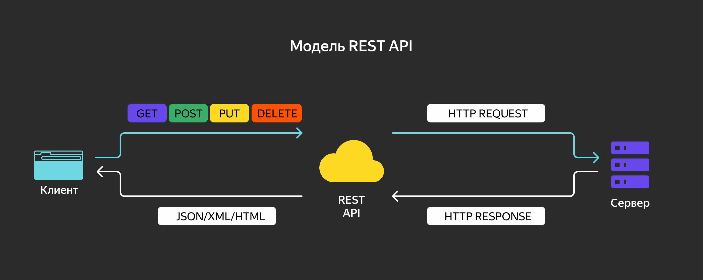

# Основы REST API

Сложно представить себе программу, в которой ничего не надо было бы конвертировать. Часто требуется читать настройки из YAML-файла и использовать JSON-формат в HTTP-запросах и ответах. Поэтому для разработчика важно уметь работать с разными форматами представления данных, знать возможности и ограничения сериализации и десериализации.

В начале темы `encoding`, состоящей из четырёх уроков, разберём основные принципы архитектурного стиля REST, который чаще всего используется для обмена сообщениями в формате JSON. Затем рассмотрим структурные теги — они позволяют указывать метаинформацию об объекте или типе объекта, что даёт возможность соотносить поля структур и конечные данные при сериализации и обратном преобразовании. Два последних урока посвящены стандартным и сторонним сериализаторам данных.

В этой теме вы узнаете:
- как применять пакеты сериализации из стандартной библиотеки Go (для форматов JSON, XML и gob);
- как добавлять поддержку сериализации пользовательских типов данных и работать с динамическими спецификациями;
- в каких случаях альтернативные решения лучше стандартных (на примере внешнего пакета `easyjson`);
- какие внешние библиотеки можно использовать для работы с форматами YAML, TOML, MessagePack и Protocol Buffers.

Упомянутые в уроках форматы применяются в разработке одинаково часто, но вам стоит уделить особое внимание работе с JSON — с ним будут связаны задания по учебному проекту.

В этом уроке расскажем, что представляют собой API и архитектурный стиль REST, из каких элементов состоит REST API и каким критериям должна удовлетворять архитектура REST. Также поговорим о преимуществах стиля REST перед другими стандартами взаимодействия систем и рассмотрим, как работает REST API. 

## Что такое REST API

**API (Application Programming Interface, программный интерфейс приложения)** — это набор правил и функций, позволяющих приложениям взаимодействовать друг с другом.

API выступает посредником между приложениями, перенаправляя запросы (requests) и ответы (responses) от клиента к серверу и обратно. Например, аутентификация пользователя в приложении через существующий аккаунт в Яндексе происходит через API Yandex, который разработчики интегрировали в своё приложение.

**REST (Representational State Transfer, передача состояния представления)** — это программная архитектура, которая определяет условия работы API.

API, соответствующие архитектурному стилю REST, называют REST API. 

REST API — это интерфейс, который используют две компьютерные системы для безопасного обмена информацией через HTTP.

Веб-службы, реализующие архитектуру REST, называют RESTful. Как правило, термин RESTful API относится к сетевым API. Но в целом REST API и RESTful API — это взаимозаменяемые понятия.

Архитектура REST не привязана к конкретным технологиям и протоколам, но построение RESTful API почти всегда подразумевает использование методов HTTP и распространённых форматов представления данных — например, JSON или XML.

Схематически REST API можно представить так:


## Элементы REST API

Сетевой API функционирует как шлюз между основными элементами архитектуры REST — клиентами, ресурсами и серверами.

**Клиент (client)** — это программа, которая позволяет пользователю получить доступ к информации в интернете и задействует для этого API. Например, разработчики создают приложение, которое получает доступ к данным новостей. Этот доступ можно получить и в браузере, посетив новостной сайт.

**Ресурс (resource)** — это информация, которую приложение предоставляет своим клиентам. Ресурсами могут быть изображения, видео, тексты, числа и любые другие данные. 

**Сервер (server)** — это компьютер, который отправляет ресурсы клиенту. 

API позволяет клиентам совместно использовать ресурсы и предоставляет веб-службы, которые обеспечивают безопасность, контроль и аутентификацию. Кроме того, API помогает определить, какие клиенты могут получить доступ к внутренним ресурсам, а какие нет.

## Принципы REST

Теперь приведём основные принципы архитектурного стиля REST. Чтобы распределённая система соответствовала этому стилю, она должна удовлетворять следующим критериям:
1. **Клиент-серверная архитектура (client–server architecture).** Система должна быть разделена на клиент и сервер таким образом, чтобы клиент не был связан с хранением данных на сервере, а сервер — с интерфейсом и состоянием клиента. Это позволяет разрабатывать клиент и сервер независимо друга от друга, а также делать сервер простым и масштабируемым.
1. **Отсутствие состояния (statelessness).** Сервер не должен хранить данные о состоянии сессии между запросами и ответами. Информация, необходимая для обработки запроса и идентификации клиента, должна передаваться в самом запросе. Это помогает снизить нагрузку на сервер.
1. **Возможность кешировать ответ (cacheability).** Кеширование позволяет повысить производительность за счёт использования сохранённых ранее данных. При этом клиент должен точно знать, какая информация закеширована, а какая нет, чтобы при повторном запросе к серверу не использовать устаревшие или некорректные данные.
1. **Многослойная система (layered system).** Между клиентом и сервером можно добавлять промежуточный сервер — это позволяет обеспечивать безопасность и балансировку нагрузки, использовать общий кеш и улучшать масштабируемость. Система может быть разделена на иерархию слоёв, при этом каждый компонент системы должен видеть только компоненты следующего слоя. Например, если вы вызываете службу PayPal, а она — службу Visa, то вы не увидите вызова Visa.
1. **Код по требованию (code-on-demand).** Допускается загрузка и выполнение кода или программы на стороне клиента, но это необязательно.
1. **Единый интерфейс (uniform interface).** Это упрощает архитектуру и позволяет каждой её части развиваться самостоятельно. Вот четыре принципа единого интерфейса:
    - **Идентификация ресурса.** В REST ресурсом является всё, чему можно дать имя: пользователь, изображение, предмет и так далее. У каждого ресурса есть идентификатор, который не меняется при изменении состояния ресурса. Идентификатор в REST — это URI (Uniform Resource Identifier).
    - **Манипуляции над ресурсами через представления.** Представление — это текущее или желаемое состояние ресурса. Например, если ресурсом является пользователь, то представлением может быть XML- или HTML-описание этого пользователя.
    - **Самодостаточные сообщения.** Запрос и ответ содержат всю необходимую информацию для их обработки. Дополнительные сообщения или запись состояния не нужны.
    - **Гипермедиа как средство управления состоянием.** Состояние ресурса передаётся через тело ответа, параметры, заголовки и URI — это и есть гипермедиа. В само XML- или JSON-представление ресурса добавляются гиперссылки, по которым клиент может переходить к другим доступным на данный момент ресурсам.

## Преимущества REST API

API можно проектировать в соответствии с разными протоколами и стандартами. Вот несколько из них:
- RPC (Remote Procedure Call, удалённый вызов процедур) — класс технологий, позволяющих программам вызывать функции или процедуры в другом адресном пространстве, на удалённых узлах либо в независимой сторонней системе на том же узле.
- XML-RPC — вид RPC, который позволяет организовать обмен функциями между двумя или более сетями, передаёт информацию от клиента серверу по протоколу HTTP, а для описания запросов и ответов использует формат XML.
- JSON-RPC — облегчённый RPC, использующий для запросов и ответов формат JSON и предоставляющий возможность асинхронных ответов.
- SOAP (Simple Object Access Protocol, простой протокол доступа к объектам) — фреймворк для обмена структурированной информацией при реализации веб-сервисов в компьютерных сетях. SOAP использует формат XML, позволяет клиентам вызывать веб-сервисы и получать ответы независимо от языка и платформы.

Протоколы и стандарты задают жёсткие рамки по форматам сообщений, используемым технологиям и способам взаимодействия. Тогда как архитектурный стиль REST лишь предлагает придерживаться нескольких принципов и ограничений. 

Перечислим преимущества REST перед описанными стандартами:
1. **Масштабируемость.** Отсутствие хранения состояния снижает нагрузку на сервер: ему не нужно фиксировать информацию о предыдущих запросах клиента. Кеширование уменьшает количество взаимодействий между сервером и клиентом. В конечном счёте это позволяет увеличить пропускную способность сервиса, не уменьшив при этом производительность.
1. **Гибкость.** Большинство программных интерфейсов работают в формате «приложение — приложение», а веб-службы REST API поддерживают полное разделение сервера и клиента. Это позволяет каждому компоненту системы развиваться независимо. Изменения платформы или технологии в серверном приложении не влияют на клиентское приложение. Возможность разделять функции на уровни ещё больше повышает гибкость. Например, разработчики могут вносить изменения в уровень базы данных, не переписывая логику приложения.
1. **Независимость.** REST API не зависит от используемой технологии. Можно создавать как клиентские, так и серверные приложения на разных языках программирования, не затрагивая структуру API.
1. **Разноформатность.** Обычно API используют конкретные форматы сообщений — например, SOAP использует XML. В REST обмен сообщениями может быть организован в JSON, XML и любом другом формате.

Далее разберём подробнее, как работает REST API: что содержит запрос, ответ и что такое идемпотентность. Перед продолжением рекомендуем вам провести небольшой перерыв —  размяться, отвести взгляд от экрана и дать голове отдохнуть, чтобы вернуться к изучению материала с новыми силами.

## Как работает REST API

Клиент связывается с сервером через API, когда ему требуется доступ к какому-либо ресурсу. Вот основные этапы работы REST API:
1. Клиент отправляет запрос к серверу.
1. Сервер аутентифицирует клиента и подтверждает, что он имеет право запрашивать информацию.
1. Сервер получает запрос и обрабатывает его.
1. Сервер возвращает ответ клиенту. Ответ содержит сведения о том, был ли запрос успешным: если да, в ответ включаются запрошенные данные.

## Что содержит клиентский запрос

В RESTful API запросы должны содержать следующие компоненты: уникальный идентификатор ресурса, метод, заголовки, данные, параметры.

### Уникальный идентификатор ресурса

Сервер присваивает каждому ресурсу уникальный идентификатор. В случае со службами REST сервер идентифицирует ресурсы с помощью URL, который указывает путь к ресурсу. Путь аналогичен адресу веб-страницы, который вы вводите в браузере для её посещения. URL также называют адресом запроса — он чётко указывает серверу, что требуется клиенту.

### Метод

Как правило, разработчики реализуют RESTful API с помощью HTTP. Метод HTTP сообщает серверу, что ему необходимо сделать с ресурсом. Ниже приведены четыре распространённых метода HTTP:
- `GET` — используется для доступа к ресурсам, расположенным на сервере по указанному URL. Клиенты могут кешировать запросы `GET` и отправлять в запросе параметры, чтобы сообщить серверу о необходимости фильтровать данные перед отправкой.
- `POST` — используется для отправки данных на сервер. При этом клиенты включают в запрос представление данных. Отправка одного и того же запроса `POST` несколько раз имеет побочный эффект — многократное создание одного и того же ресурса.
- `PUT` — используется для обновления существующих на сервере ресурсов. В отличие от POST, отправка одного и того же запроса PUT несколько раз даёт одинаковый результат в веб-службе.
- `DELETE` — используется для удаления ресурса.

Здесь стоит упомянуть про CRUD-операции RESTful API. CRUD — это аббревиатура от команд `Create`, `Read`, `Update` и `Delete`. Эти четыре основные операции помогают разработчикам взаимодействовать с базами данных. Несмотря на то что термин CRUD пришёл из баз данных, сегодня он отражает принцип разработки динамических приложений — например, HTTP, SQL и DDS (Data Distribution Service, cлужба распространения данных). 

Вот какие задачи выполняют команды CRUD:
- `Create` — создаёт новую запись.
- `Read` — читает данные на основе требуемых входных параметров.
- `Update` — изменяет запись (без перезаписи).
- `Delete` — удаляет одну или несколько записей.

### Заголовки

Заголовки запросов — это метаданные, которыми обмениваются клиент и сервер. Например, заголовок может указывать формат запроса и ответа или предоставлять информацию о статусе запроса.

### Данные

Запросы REST API могут включать данные для успешной работы `POST`, `PUT` и других методов HTTP.

### Параметры

Запросы RESTful API могут включать параметры, которые предоставляют серверу более подробную информацию о необходимых действиях:
- Параметры пути — определяют детали URL.
- Параметры запроса — запрашивают дополнительную информацию о ресурсе.
- Параметры cookie — быстро аутентифицируют клиентов.

## Что содержит ответ сервера

Принципы REST требуют, чтобы ответ сервера содержал следующие компоненты: строку состояния, текст сообщения и заголовки.

### Строка состояния

Строка состояния содержит трёхзначный код, который сообщает об успешном или неудачном выполнении запроса. Например, коды `2XX` указывают на успешное выполнение, а коды `4XX` и `5XX` — на ошибки. Коды `3XX` указывают на перенаправление URL.

### Текст сообщения

Текст ответа содержит представление ресурса. Сервер выбирает подходящий формат представления на основе заголовков запроса. Клиенты могут запрашивать информацию в XML или JSON — они определяют запись данных в виде обычного текста. 

Например, если клиент запрашивает имя и возраст человека по имени Саша, сервер возвращает текст сообщения в формате JSON:
```json
{"name":"Sasha", "age":30}
```

### Заголовки

Заголовки или метаданные об ответе дают более подробный контекст и включают в себя название сервера, кодировку, дату и тип контента.

## Идемпотентность

В RESTful-сервисе операция (или вызов сервиса) считается идемпотентной, если многократная отправка идентичных запросов имеет такой же эффект, как отправка одного.

Несмотря на то что идемпотентные операции производят один и тот же результат на сервере, ответ может быть разным: например, состояние ресурса может меняться между запросами.

Методы `PUT` и `DELETE` по определению идемпотентны. Тем не менее есть нюанс с методом `DELETE`. Успешный `DELETE`-запрос возвращает статус `200 OK` или `204 No Content`, но для последующих запросов будет всё время возвращать `404 Not Found`. Состояние на сервере после вызова `DELETE` остаётся тем же, но ответы разные.

Методы `GET`, `HEAD`, `OPTIONS` и `TRACE` определены как безопасные. Это значит, что они нужны только для получения информации и не меняют состояние сервера. Они не должны иметь побочных эффектов, за исключением безобидных, таких как логирование, кеширование, показ баннерной рекламы или увеличение веб-счётчика.

Безопасные операции идемпотентны, так как они приводят к одному и тому же результату на сервере. Безопасные методы реализованы как операции только для чтения. Однако безопасность не означает, что сервер должен возвращать всегда одинаковый результат.

## Почему именно REST API

REST — самый распространённый способ создания API для серверных приложений. 

Кроме прочих, к его плюсам можно отнести и то, что он простой в реализации и понимании. Большинство пользователей интернета интуитивно понимают, как он устроен. Когда пользователь вводит URL в строку браузера и нажимает Enter, он отправляет запрос на REST API сервера. REST API представляет собой множество эндпоинтов, отправляя запрос на которые клиент получает ответ от сервера.

В то же время REST API не всегда подходит для сложных или ресурсоёмких задач. На практике сервисы лишь частично соответствуют REST-принципам, а следование REST как догме может привести к неоптимальным решениям. Выбор подхода зависит от конкретных требований и условий.

## Дополнительные материалы

- [Хабр | Архитектура REST](https://habrahabr.ru/post/38730/) — статья о стиле REST.
- [Хабр | Hypermedia — то, без чего ваше API не совсем REST](https://habr.com/ru/companies/aligntechnology/articles/281206/) — подробнее о гиперссылках в сообщениях.
- [REST API Tutorial](https://restapitutorial.com/resources.html) — лучшие практики в разработке RESTful-сервисов.

# Структурные теги

В этом уроке расскажем о правилах работы со структурными тегами — они позволяют добавлять к полям структуры дополнительную текстовую информацию. Чаще всего структурные теги применяются при сериализации данных — например, при конвертации в JSON, XML, YAML и обратно.

## Формат описания

Набор тегов (struct tags) указывают после типа поля и заключают в грависы ` `` `. 

Набор тегов — это строковый литерал, который может принимать любую форму. Так как Go-компилятор не проверяет формат тегов, а `gofmt` не приводит их к стандартному виду, стоит руководствоваться принятыми в Go-сообществе правилами оформления тегов:
- теги разделяют пробелом;
- имя тега и его значения разделяют двоеточием без пробелов;
- значения тега разделяют запятой и заключают в кавычки;
- имя и значения тега пишут в формате snake_case или camelCase.

Для любого поля структуры можно задать набор тегов с дополнительной метаинформацией, например:
```go
type User struct {
    ID        string `json:"id" format:"uuid"`
    Name      string `json:"name"`
    CreatedAt int64  `json:"created_at" format:"unixtime,seconds"`
}
```

В этом примере заданы два набора тегов:
- `json` — имя поля JSON-представления объекта (используется JSON-сериализаторами);
- `format` — дополнительные данные о формате поля (могут использоваться другими библиотеками).

У каждого тега есть уникальное имя и ряд значений — они зависят от пакета (или внешней библиотеки) и описываются в документации. 


Набор тегов — как швейцарский нож. Это многофункциональный инструмент, и цели его применения могут быть разными:
- **Сериализация объектов.** Тег указывает на имя поля для конкретного сериализатора — `json`, `yaml`, `xml`, `protobuf`. Как правило, сериализаторы не требуют обязательного указания тегов. Имя поля в результирующем формате данных будет совпадать с именем поля структуры.
```go
// Person содержит информацию о пользователе
// и описывает сериализацию в JSON и YAML.
type Person struct {
  ID    int
  Name  string `yaml:"name"`
  Email string `json:"email" yaml:"email"`
}
```

- **Описание объекта таблицы для ORM-библиотек.** Определённый тег задаёт имя таблицы, а другие теги описывают свойства колонки (например, `nullable`). Есть пакеты, которые используют структурные теги для работы с базами данных: [gorm](https://github.com/go-gorm/gorm), [bun](https://bun.uptrace.dev/).
```go
// User демонстрирует пример описания GORM-модели.
type User struct {
  ID    uuid.UUID `gorm:"type:uuid;default:uuid_generate_v4()"`
  Name  string    `gorm:"size:255"` // указывает размер поля
  Email string    `gorm:"type:varchar (100);unique_index"`
  Phone string    `gorm:"index:phone"` // создаёт индекс для этого поля
  mark  int       `gorm:"-"`           // не участвует в модели
}
```

- **Валидации значений полей.** Например, в пакете [govalidator](https://github.com/asaskevich/govalidator) тег `valid` описывает тип поля и допустимые значения.
```go
type Example struct {
  Name  string `valid:"-"`
  Email string `valid:"email"`
  URL   string `valid:"url"`
}

func main() {
  // проверяем на валидность email и URL
  result, err := govalidator.ValidateStruct(Example{
      Email: "johndoe@example.com",
      URL:   "https://www.ya.ru",
  })
  if err != nil {
      log.Fatal(err)
  }
  fmt.Println(result)
}
```

## Работа с тегами

Парсинг и обработка значений тегов производятся при выполнении программы, в рантайме. Это значит, что компилятор не обрабатывает и не проверяет теги полей. Чтобы получить динамическую информацию о типе (в том числе набор тегов и их значений), нужно воспользоваться пакетом `reflect` стандартной библиотеки Go.

Для работы с тегами в пакете `reflect` определён `type StructTag string` со следующими публичными методами:
- `Lookup(key string) (value string, ok bool)` — возвращает значение тега по имени и флаг присутствия искомого тега в наборе.
- `Get(key string) string` — аналогичен Lookup, но не возвращает информацию о наличии тега. Если тег не найден, функция вернёт пустую строку.

Предположим, что есть переменная `obj` структурного типа и нужно получить теги полей соответствующей структуры:
```go
obj := MyType{}
// получаем тип переменной — st имеет тип reflect.Type
st := reflect.TypeOf(obj) 
// Type.NumField() — возвращает количество полей
for i:=0; i < st.NumField(); i++ {
    // field содержит информацию о поле с i-м индексом (с 0)
    field := st.Field(i)
 
    // field.Tag имеет тип StructTag и содержит все теги i-го поля
    // выводим имя поля и значение тега `json`
    fmt.Println(field.Name, field.Tag.Get("json"))
}
```

Если нужно найти поле не по индексу, а по имени, то следует использовать метод `(*Type) FieldByName(name string) (StructField, bool)`. Вот пример того, как можно получить тег конкретного поля:
```go
package main

import (
    "fmt"
    "reflect"
    "time"
)

type MyType struct {
    User      string    `json:"user,omitempty" example:"Bob"`
    CreatedAt time.Time `json:"created_at"`
}

const (
    targetField = "User" // имя поля, о котором нужно получить информацию
    targetTag   = "json" // тег, значение которого нужно получить
)

func main() {

    obj := MyType{}

    // получаем Go-описание типа
    objType := reflect.TypeOf(obj)

    // ищем поле по имени
    field, ok := objType.FieldByName(targetField)
    if !ok {
        panic(fmt.Errorf("field (%s): not found", targetField))
    }

    // ищем тег по имени
    tagValue, ok := field.Tag.Lookup(targetTag)
    if !ok {
        panic(fmt.Errorf("tag (%s) for field (%s): not found", targetTag, targetField))
    }

    fmt.Printf("Значение тега %s поля %s: %s\n", targetTag, targetField, tagValue)
    fmt.Printf("Теги поля %s: %s\n", targetField, field.Tag)
}
```
```
Значение тега json поля User: user,omitempty
Теги поля User: json:"user,omitempty" example:"Bob"
```

Чтобы получить конкретные значения тега (`"user"` и `"omitempty"` для поля `User`), нужно дополнительно разобрать строку — это можно сделать функцией `strings.Split(tagValue, ",")`.

## Скорость работы

Операции с рефлексией снижают производительность программы, но этого можно избежать, если оптимизировать процессы сериализации.

Один из примеров такой оптимизации — работа пакета `json` стандартной библиотеки. При операциях сериализации код пакета пробегает по всем полям структуры, а также рекурсивно по вложенным структурам, если они есть. Чтобы оптимизировать этот процесс, пакет использует кеширование: если он уже разобрал один раз определённый тип, то последующие операции сериализации с использованием этого типа (или его составляющих) пакет выполняет быстрее.

Другой пример — описание SQL-таблицы для ORM-библиотеки. Используя теги, разработчик описывает имя таблицы, её алиас и конкретные свойства колонок — например, столбец служит внешним ключом для другой таблицы, он может быть `nullable` и так далее. Для формирования SQL-запроса библиотека должна пробежать по всем полям типа и собрать нужные ей аннотации — например, получить все возможные имена столбцов для `SELECT`-запроса. 

Этот процесс можно оптимизировать, если вынести подготовку метаинформации о каждом типе в инициализацию программы (`func init()`) — спарсить все теги один раз на старте, создать метахранилище и использовать готовые данные для формирования запроса или других операций.

*Важно помнить, что получение имени и типа поля структуры через пакет `reflect` происходит в рантайме. Способа оптимизировать эту операцию нет. Поэтому любая работа с рефлексией — это всегда поиск баланса между удобством (generic code) и скоростью.*

## Подводные камни (gotchas)

Итак, набор тегов — это строковый литерал, который не валидируется компилятором и формат которого задаёт разработчик.

Чтобы разобрать типичные ошибки, приведём примеры некорректного описания `json`-тегов. Код с таким типом скомпилируется, но сериализация будет работать не так, как ожидается, или приведёт к панике:
```go
type MyStruct struct {
    // дубликат тега
    ID int `json:"id" yaml:"id" json:"myid"`
    // разделение запятыми, а не пробелом
    Name string `json:"name", yaml:"name"`
    // лишние пробелы
    Key string `json: "key" yaml :"key"`
    // перепутаны виды кавычек
    Company string "json:`key`"
    // encoding/json игнорирует неэкспортируемые поля
    hidden string `json:"hidden"`
}
```

Дубликаты тегов разрешаются методами `reflect.StructTag` по принципу «кто первый, тот и прав»: ищется первое вхождение искомого тега в набор.

Лишние пробелы около двоеточия, перенос строки или `\` в значении тега останавливают парсинг строки, выполняемый методом `StructTag.Lookup()`. Разработчик может не придерживаться принятых правил, но тогда он должен разбирать теги, не используя этот метод. Это плохая практика, лучше её избегать.

*Пока что компилятор Go не проверяет синтаксис описания тегов (но мы верим и ждём). Чтобы найти опечатки в описании структурных тегов, можно воспользоваться утилитой [go vet](https://pkg.go.dev/cmd/vet) с флагом `-structtag` — она проверит, согласуются ли используемые теги с методом `reflect.StructTag.Get()`.*

___
Перед вами объект:
```go
type Connection struct {
    ID   string  `json:"id,omitempty"`
    Url  UrlType `json:"url" json:"URL"`
    Port int     `json:"port" default:"8080"`
}
```
Выберите верные утверждения.

Верные:
- Тег `json` поля `ID` принимает значения `id` и `omitempty` (Значения тега пишутся после двоеточия, разделяются запятой и заключаются в кавычки.)
- Значение тега `default` поля `Url` не задано (пустая строка) (Для этого поля тег `default` не задан, поэтому метод `Get()` пакета `reflect` вернёт пустую строку.)
- Для поля `Port` определены теги `json` и `default` (Тег `json` имеет значение `port`, а тег `default` — `8080`.)

Неверные:
- Тег `json` поля `Url` принимает значения `url` и `URL`
___
Отметьте верные утверждения.
Верные:
- Значения тегов можно получить только методами пакета `reflect` (Получить динамическую информацию о типе, в том числе теги, можно только методами пакета `reflect`.)
- Вызов методов `reflect` происходит в рантайме (Получение информации о типе происходит в рантайме.)
- Формат описания тегов не определён языком, но есть общепринятые правила оформления тегов  (Общепринятый формат такой: теги разделяются пробелами, а значения тегов — запятыми без пробелов и символов переноса строки. Например, `json:"name" yaml:"name,omitempty"`.)

Неверные:
- Теги валидируются и обрабатываются компилятором
- Теги описанной в коде структуры можно задать динамически по ходу выполнения программы
___
Допишите функцию валидации `Validate()`, которая использует для проверки значений тег `limit`. Для полей типа `int` тег может определять:
- только минимальное значение (`limit:"min"`),
- максимальное и минимальное значения (`limit:"min,max"`).
```go
package main

import (
    "reflect"
    "strconv"
    "strings"
    "testing"
)

// User используется для тестирования.
type User struct {
    Nick string
    Age  int `limit:"18"`
    Rate int `limit:"0,100"`
}

// Str2Int конвертирует строку в int.
func Str2Int(s string) int {
    v, err := strconv.Atoi(s)
    if err != nil {
        panic(err)
    }
    return v
}

// Validate проверяет min и max для int c тегом limit.
func Validate(obj interface{}) bool {
    vobj := reflect.ValueOf(obj)
    objType := vobj.Type() // получаем описание типа

    // перебираем все поля структуры
    for i := 0; i < objType.NumField(); i++ {
        // берём значение текущего поля и проверяем, что это int
        if v, ok := vobj.Field(i).Interface().(int); ok {
            // подсказка: тег limit надо искать в поле objType.Field(i)
            // objType.Field(i).Tag.Lookup или objType.Field(i).Tag.Get

            // допишите код
            // ...
        }
    }
    return true
}

func TestValidate(t *testing.T) {
    var table = []struct {
        name string
        age  int
        rate int
        want bool
    }{
        {"admin", 20, 88, true},
        {"su", 45, 10, true},
        {"", 16, 5, false},
        {"usr", 24, -2, false},
        {"john", 18, 0, true},
        {"usr2", 30, 200, false},
    }
    for _, v := range table {
        if Validate(User{v.name, v.age, v.rate}) != v.want {
            t.Errorf("Не прошла проверку запись %s", v.name)
        }
    }
}
```
```go
    limitTag, isLimit := objType.Field(i).Tag.Lookup("limit")
    if !isLimit {
        continue
    }
    limits := strings.Split(limitTag, ",")
    if v < Str2Int(limits[0]) {
        return false
    }
    if len(limits) > 1 && v > Str2Int(limits[1]) {
        return false
    }
```

## Дополнительные материалы

- [go.dev/reflect](https://pkg.go.dev/reflect) — документация пакета `reflect`.
- [go.dev/encoding/json](https://pkg.go.dev/encoding/json) — документация пакета `json`, который использует структурные теги для определения параметров JSON-преобразования.
- [GitHub | Gorm](https://github.com/jinzhu/gorm) — ORM-библиотека, которая использует структурные теги для указания SQL-связей.
- [GitHub | Govalidator](https://github.com/asaskevich/govalidator) — пакет для валидации значений полей на основе описания структурных тегов.
- [Курс по основам Go](https://start.practicum.yandex/go-basics/) — в этом курсе вы можете повторить, как работать с рефлексией в языке Go (спринт 3, тема 2, урок 4). Чтобы открыть курс, перейдите по ссылке и нажмите «Начать учиться».

# Стандартные сериализаторы: JSON

В разделе `encoding` стандартной библиотеки Go одиннадцать пакетов. Часть из них служит для конвертации двоичных данных в строку и обратно, остальные — для сериализации в популярные форматы. В этом уроке расскажем о пакете `encoding/json`, который обеспечивает конвертацию структур, слайсов и мап любой вложенности в формат JSON.

**Важно**
Все `encoding`-пакеты стандартной библиотеки работают только с экспортируемыми полями структуры, имя которых начинается с заглавной буквы.

## JSON

Пакет `json` предоставляет набор методов для работы с JSON-форматом, который начинал свою историю как подмножество синтаксиса языка JavaScript, а затем стал одним из самых популярных форматов представления данных в иерархическом виде.

```js
// это пример на JavaScript, где JSON представляется частью кода
var user = {
    "id": 10,
    "name": "Gopher",
    "items": [10, 20, 30]
}
console.log(user)
```

Как и другие сериализаторы, `encoding/json` позволяет кодировать объект в слайс байт (`[]byte`) и декодировать обратно. В первую очередь рассмотрим функцию `Marshal()` для сериализации данных в формат JSON и функцию `Unmarshal()` для преобразования JSON в мапу, слайс или структуру.

## Функция Marshal

Функция `json.Marshal()` рекурсивно проходит по объекту и возвращает его JSON-представление в виде слайса байт:
```go
func Marshal(v interface{}) ([]byte, error)
```

В этой функции реализовано преобразование в JSON-формат для структур и большинства встроенных типов. Если для объекта (или вложенного объекта) не заданы правила сериализации, то может возникнуть ошибка. 

Посмотрите правила JSON-сериализации для основных типов:

|ТИП|ВО ЧТО ПРЕОБРАЗУЕТСЯ|
|---|---|
|`bool`|`JSON boolean`|
|`float`, `int`|`JSON number`|
|`string`|`JSON string` в кодировке UTF-8 с экранированием специальных символов, например, добавлением обратного слеша перед двойными кавычками (`"` → `\"`)|
|`[]byte`|`Base64`-строка|
|структуры|`JSON object`|
|массивы и слайсы|`JSON array`|
|`map`|`JSON object` с условием, что ключ — это `int` или `string`|
|`interface{}`|`JSON null` для `nil`-значений или формат в соответствии с типом значения|

Каналы, комплексные числа, функции и циклические структуры данных не поддерживают сериализацию в JSON, так как для них не существует соответствующего JSON-представления.

*Если мапа или слайс равны `nil`, они будут преобразованы в `JSON null`. Если они инициализированы и пусты, они конвертируются в `{}` или `[]` соответственно.*

Рассмотрим работу функции `Marshal()` на примере простейшего HTTP-сервера. Допустим, компания организует IT-конференцию и составляет список гостей. На входе в зал сканер считывает идентификатор с QR-кода бейджика и отправляет запрос к серверу, который должен вернуть информацию о посетителе в JSON-формате:
```go
package main

import (
    "encoding/json"
    "net/http"
)

type Visitor struct {
    ID      int
    Name    string
    Phones  []string
    Company string
}

var visitors = map[string]Visitor{
    "1": {
        ID:   1,
        Name: "Guest",
        Phones: []string{
            `789-673-56-90`,
            `612-934-77-23`,
        }},
}

func JSONHandler(w http.ResponseWriter, req *http.Request) {
    id := req.URL.Query().Get("id")
    resp, err := json.Marshal(visitors[id])
    if err != nil {
        http.Error(w, err.Error(), http.StatusInternalServerError)
        return
    }
    w.Header().Set("Content-Type", "application/json")
    w.WriteHeader(http.StatusOK)
    w.Write(resp)
}

func main() {
    http.ListenAndServe("localhost:8080", http.HandlerFunc(JSONHandler))
}
```


Если вы запустите этот сервер и откроете в браузере `http://localhost:8080/?id=1`, то увидите такой результат:
```json
{"ID":1,"Name":"Guest","Phones":["789-673-56-90","612-934-77-23"],"Company":""}
```

Сериализовались все экспортируемые поля с сохранением их имён. При необходимости имена ключей можно задавать с помощью тега `json`. Так как в примере ни у одного из полей этот тег не был указан, ключи совпадают с именами полей. 

Вот какие значения могут быть у структурного тега `json`:
- `json:"name"` — при таком значении ключ поля в JSON будет равен `name`.
- `json:"-"` — дефис заставляет пакет игнорировать поле. Если вам нужно, чтобы поле было экспортируемым, но не фигурировало в JSON-представлении, то при десериализации такое поле будет пропущено и сохранит прежнее значение.
- `json:"name,omitempty"` — здесь добавлена опция `omitempty`. Если значение поля равно нулевому значению для соответствующего типа (например, `nil` для указателя, пустая строка для `string`, 0 для `int` и так далее), то при сериализации поле будет пропущено, а JSON-ключ не будет создан.

Укажем `json`-теги для структуры `Visitor` из примера выше:
```go
type Visitor struct {
    ID      int      `json:"id"`
    Name    string   `json:"name,omitempty"`
    Phones  []string `json:"phones,omitempty"`
    Company string   `json:"company,omitempty"`
}
```
После изменений получим такой результат:
```json
{"id":1,"name":"Guest","phones":["789-673-56-90","612-934-77-23"]}
```

В выводе отсутствует поле `company` и изменились имена ключей. Если отправить запрос `http://localhost:8080/?id=2`, то результатом будет `{"id":0}`. 

Тег `omitempty` стоит использовать с осторожностью. Если поле `company` отсутствует, то при обработке полученных данных другая программа может возвращать ошибку. А если значение этого поля равно пустой строке, то программа будет работать.

___
Опишите структуру `Data` так, чтобы программа вывела `[{"name":"Gopher"},{"name":"Вася","comp":"Яндекс"}]`.
```go
package main

import (
    "encoding/json"
    "fmt"
    "log"
)

type Data struct {
    // определите здесь нужные поля
    // ...
}

func main() {
    foo := []Data{
        {
            ID:   10,
            Name: "Gopher",
        },
        {
            Name:    "Вася",
            Company: "Яндекс",
        },
    }
    out, err := json.Marshal(foo)
    if err != nil {
        log.Fatal(err)
    }
    fmt.Println(string(out))
}
```
- Так как `ID` в JSON отсутствует, нужно поставить тег пропуска `json:"-"`.
- Так как поле `name` в JSON написано в нижнем регистре, нужно указать JSON-тег `json:"name"`.
- Если компания отсутствует, она не выводится, поэтому нужно указать `json:"comp,omitempty"`.
___

## Функция Unmarshal

Пакет `encoding/json` содержит функцию `Unmarshal()`, которая выполняет десериализацию JSON-объекта:
```go
func Unmarshal(data []byte, v interface{}) error
```

Здесь `data` — это данные в JSON-формате, а аргумент `v` — указатель на значение или переменную, куда будет записан результат десериализации.

Все правила сериализации, указанные для `json.Marshal()`, действуют и для обратной операции. При этом, если точного совпадения имени поля не найдено, поиск поля выполняется ещё раз, но уже без учёта регистра. Если поле структуры не найдено в JSON-объекте, функция оставит значение этого поля без изменений.

Вернёмся к примеру с конференцией и перепишем обработчик `JSONHandler` таким образом, чтобы он обрабатывал `POST`-запросы и добавлял данные посетителя, переданные в JSON-формате:
```go
func JSONHandler(w http.ResponseWriter, req *http.Request) {
    var id string

    if req.Method == http.MethodPost {
        var visitor Visitor
        var buf bytes.Buffer
        // читаем тело запроса
        _, err := buf.ReadFrom(req.Body)
        if err != nil {
            http.Error(w, err.Error(), http.StatusBadRequest)
            return
        }
        // десериализуем JSON в Visitor
        if err = json.Unmarshal(buf.Bytes(), &visitor); err != nil {
            http.Error(w, err.Error(), http.StatusBadRequest)
            return
        }
        id = strconv.Itoa(visitor.ID)
        // добавляем в мапу
        visitors[id] = visitor
    } else {
        id = req.URL.Query().Get("id")
    }
    resp, err := json.Marshal(visitors[id])
    if err != nil {
        http.Error(w, err.Error(), http.StatusInternalServerError)
        return
    }
    w.Header().Set("Content-Type", "application/json")
    w.WriteHeader(http.StatusOK)
    w.Write(resp)
}
```

Теперь добавим отправку `POST`-запроса:
```go
func main() {
    go func() {
        time.Sleep(time.Second)
        http.Post(`http://localhost:8080`, `application/json`,
      // ключи указаны в разных регистрах, но данные сконвертируются правильно
            bytes.NewBufferString(`{"ID": 10, "NaMe": "Gopher", "company": "Don't Panic"}`))
    }()
    http.ListenAndServe("localhost:8080", http.HandlerFunc(JSONHandler))
}
```

В ответ на запрос `http://localhost:8080/?id=10` браузер выведет:
```json
{"id":10,"name":"Gopher","company":"Don't Panic"}
```

___
Что выведет этот фрагмент?
```go
var unknownJSON any
err := json.Unmarshal([]byte(`[0, 10, 30]`), &unknownJSON)
fmt.Printf("%T, %v, %v", unknownJSON, unknownJSON, err)
```
~~[]interface {}, [0 10 30], <nil>~~
___

## Функция MarshalIndent

`json.Marshal()` генерирует JSON в одну строку. При обмене данными это скорее плюс: нет переводов строки, табуляции и лишних пробелов — объём передаваемой информации меньше. Однако такой формат сложно воспринимать человеку. 

Функция `json.MarshalIndent()` приводит результат обработки данных к понятному человеку виду — разбивает на строки, добавляет префикс и отступ к каждому ключу:
```go
func MarshalIndent(v interface{}, prefix, indent string) ([]byte, error)
```

Если в примере заменить вызов `json.Marshal(visitors[id])` на `json.MarshalIndent(visitors[id], "", "   ")`, то вывод будет таким:
```json
{
   "id": 1,
   "name": "Guest",
   "phones": [
      "789-673-56-90",
      "612-934-77-23"
   ]
}
```

## Интерфейсы json.Marshaler, json.Unmarshaler

Чтобы задать для типа собственные правила сериализации, нужно добавить методы `MarshalJSON()` и `UnmarshalJSON()`:
```go
type Marshaler interface {
    MarshalJSON() ([]byte, error)
}

type Unmarshaler interface {
    UnmarshalJSON([]byte) error
}
```

Рассмотрим работу этих методов на примерах.

### 1. Переопределение JSON-сериализации

В примере с конференцией поле `Visitor.ID` имеет тип `int` и преобразуется в число в JSON-формате. Предположим, надо сделать так, чтобы `id` в JSON был строкой. Для этого добавим свою реализацию интерфейсов `json.Marshaler` и `json.Unmarshaler` для типа `Visitor`:
```go
// MarshalJSON реализует интерфейс json.Marshaler.
func (v Visitor) MarshalJSON() ([]byte, error) {
    // чтобы избежать рекурсии при json.Marshal, объявляем новый тип
    type VisitorAlias Visitor

    aliasValue := struct {
        VisitorAlias
        // переопределяем поле внутри анонимной структуры
        ID string `json:"id"`
    }{
        // встраиваем значение всех полей изначального объекта (embedding)
        VisitorAlias: VisitorAlias(v),
        // задаём значение для переопределённого поля
        ID: strconv.Itoa(v.ID),
    }

    return json.Marshal(aliasValue) // вызываем стандартный Marshal
}
```

Добавление только одного этого метода изменит ответ сервера:
```json
{"name":"Guest","phones":["789-673-56-90","612-934-77-23"],"id":"1"}
```

Аналогично нужно добавить `UnmarshalJSON()`, чтобы принимать `POST`-запросы с `id` в виде строки:
```go
// UnmarshalJSON реализует интерфейс json.Unmarshaler.
func (v *Visitor) UnmarshalJSON(data []byte) (err error) {
    // чтобы избежать рекурсии при json.Unmarshal, объявляем новый тип
    type VisitorAlias Visitor

    aliasValue := &struct {
        *VisitorAlias
        // переопределяем поле внутри анонимной структуры
        ID string `json:"id"`
    }{
        VisitorAlias: (*VisitorAlias)(v),
    }
    // вызываем стандартный Unmarshal
    if err = json.Unmarshal(data, aliasValue); err != nil {
        return
    }
    v.ID, err = strconv.Atoi(aliasValue.ID)
    return
}
```

### 2. Динамический JSON-объект

В этом примере используем динамический тип `MyType`, где поле `Value` статически не задано и тип его значения зависит от значения поля `Type`:
```go
type (
    // MyType использует динамическую типизацию своих полей
    MyType struct {
        // Type задаёт тип объекта поля Value
        Type int `json:"type"`
        // Value содержит объект типа {TypeA, TypeB}
        Value interface{} `json:"value"`
    }

    // TypeA используется полем Value типа MyType при Type == 1
    TypeA struct {
        StrValue string `json:"str_value"`
    }

    // TypeB используется полем Value типа MyType при Type == 2
    TypeB struct {
        FloatValue float32 `json:"float_value"`
    }
)
```

Сериализуем и десериализуем экземпляр этого типа и посмотрим на результат:
```go
func main() {
    tOrig := MyType{
        Type: 1,
        Value: TypeA{
            StrValue: "some_string",
        },
    }

    tOrigJSON, _ := json.MarshalIndent(tOrig, "", "  ")
    fmt.Printf("tOrigJSON:\n%s\n", string(tOrigJSON))

    tCopy := MyType{}
    json.Unmarshal(tOrigJSON, &tCopy)
    fmt.Printf("tCopy Go: %+v\n", tCopy)
    fmt.Printf("tCopy.Value Go: %+v\n", tCopy.Value)
}
```
```bash
tOrigJSON:
{
  "type": 1,
  "value": {
    "str_value": "some_string"
  }
}
tCopy Go: {Type:1 Value:map[str_value:some_string]}
tCopy.Value Go: map[str_value:some_string]
```

Сериализация прошла успешно и привела к ожидаемому результату!

А вот обратная операция не столь успешна, что тоже ожидаемо, так как `json.Unmarshal()` не знает, какому типу соответствует `interface{}` поля `Value`.

Стандартная реализация `json.Unmarshal()` десериализует тип `interface{}` в `map[string]interface{}`. На практике такое поведение можно применить для десериализации любого JSON-объекта, не описывая предварительно его Go-представление. После десериализации объекта в `map[string]interface{}` вы получите ключи и значения первого уровня вложенности. Объект можно «разворачивать» и дальше для получения нужного ключа первого уровня, если использовать преобразование типов (type assertion).

Теперь реализуем для типа `MyType` интерфейс `json.Unmarshaler` — добавим метод `UnmarshalJSON(data []byte) error`. В методе укажем все возможные типы объектов, которые могут содержаться в поле `Value`:
```go
func (t *MyType) UnmarshalJSON(data []byte) error {
    // чтобы избежать рекурсии при json.Unmarshal, объявляем новый тип
    type MyTypeAlias MyType

    // переопределяем поле внутри анонимной структуры
    aliasValue := &struct {
        *MyTypeAlias
        Value json.RawMessage `json:"value"`
    }{
        // встраиваем указатель на целевой объект для заполнения его полей (кроме Value)
        MyTypeAlias: (*MyTypeAlias)(t),
    }
    if err := json.Unmarshal(data, aliasValue); err != nil {
        return err
    }

    // создаём экземпляр конкретного типа
    switch t.Type {
    case 1:
        t.Value = &TypeA{}
    case 2:
        t.Value = &TypeB{}
    }
    if t.Value != nil {
        // производим Unmarshal json.RawMessage значения
        if err := json.Unmarshal(aliasValue.Value, t.Value); err != nil {
            return fmt.Errorf("value of type (%T): unmarshal: %w", t.Value, err)
        }
    }

    return nil
}
```
```bash
tOrigJSON:
{
  "type": 1,
  "value": {
    "str_value": "some_string"
  }
}
tCopy Go: {Type:1 Value:0xc000014470}
tCopy.Value Go: &{StrValue:some_string}
```

В реализации используется тип `json.RawMessage` — переопределение типа `[]byte`. Функция `json.Unmarshal()` не выполняет автоматическую десериализацию полей этого типа, что даёт возможность по-разному обрабатывать эти значения в дальнейшем.

Временный тип `MyTypeAlias` переопределяет поле `Value` типом `json.RawMessage`, что позволяет десериализовать «сырой» JSON в конкретный тип (`TypeA` или `TypeB`).

___
Представьте, что на стажировке вам дали задание: сделать так, чтобы тип `[]byte` в JSON-представлении выводился в виде шестнадцатеричной строки.

Вставьте недостающий код в программу, чтобы она выводила:
```txt
{"ID":7,"Slice":"0102030a0bff"}
{7 [1 2 3 10 11 255]}
```

```go
package main

import (
    "encoding/hex"
    "encoding/json"
    "fmt"
)

type Slice []byte

// MarshalJSON реализует интерфейс json.Marshaler.
func (s Slice) MarshalJSON() ([]byte, error) {
    // используйте hex.EncodeToString для преобразования в hex-строку
    // и затем json.Marshal
    // ...
}

// UnmarshalJSON реализует интерфейс json.Unmarshaler.
func (s *Slice) UnmarshalJSON(data []byte) error {
    var tmp string
    if err := json.Unmarshal(data, &tmp); err != nil {
        return err
    }
    // используйте hex.DecodeString, чтобы получить из hex-строки слайс,
    // и присвойте этот слайс значению указателя s
    // ...
}

type MySlice struct {
    ID    int
    Slice Slice
}

func main() {
    ret, err := json.Marshal(MySlice{ID: 7, Slice: []byte{1, 2, 3, 10, 11, 255}})
    if err != nil {
        panic(err)
    }
    fmt.Println(string(ret))
    var result MySlice
    if err = json.Unmarshal(ret, &result); err != nil {
        panic(err)
    }
    fmt.Println(result)
}
```

```go
// MarshalJSON реализует интерфейс json.Marshaler.
func (s Slice) MarshalJSON() ([]byte, error) {
    return json.Marshal(hex.EncodeToString(s))
}

// UnmarshalJSON реализует интерфейс json.Unmarshaler.
func (s *Slice) UnmarshalJSON(data []byte) error {
    var tmp string
    if err := json.Unmarshal(data, &tmp); err != nil {
        return err
    }
    v, err := hex.DecodeString(tmp)
    if err == nil {
        *s = v
    }
    return err
}
```

## Объекты json.Encoder и json.Decoder

Объекты `json.Encoder` и `json.Decoder` читают и записывают результат сериализации в объект, реализующий интерфейс `io.Writer`:
```go
var buf bytes.Buffer
var v MyType

jsonEncoder := json.NewEncoder(&buf)
jsonEncoder.Encode(v)

jsonDecoder := json.NewDecoder(&buf)
jsonDecoder.Decode(&v)
```

Основная сфера применения энкодера и декодера — потоковое чтение и запись JSON-данных. За одну итерацию декодер производит десериализацию не всего JSON-текста, а лишь той части, которая находится внутри блока `{...}`. Остальные блоки будут десериализованы в следующей итерации.

На примере с конференцией рассмотрим использование декодера для обработки `Body` HTTP-запроса. В обработчике `JSONHandler()` тело запроса читалось методом `ReadFrom()`, а затем вызывалась функция `Unmarshal()`. Если заменить это решение на `json.NewDecoder`, то код обработчика сократится:
```go
func JSONHandler(w http.ResponseWriter, req *http.Request) {
    var id string

    if req.Method == http.MethodPost {
        var visitor Visitor
        
        if err := json.NewDecoder(req.Body).Decode(&visitor); err != nil {
            http.Error(w, err.Error(), http.StatusBadRequest)
            return
        }
        id = strconv.Itoa(visitor.ID)
        // добавляем в мапу
        visitors[id] = visitor
    } 
    // код ниже остался без изменений
    // ...
}
```

## Дополнительные материалы

- [go.dev/encoding/json](https://pkg.go.dev/encoding/json) — документация пакета `encoding/json`.
- [Developer 2.0 | JSON in Go](https://developer20.com/json/) — статья о работе с JSON в Go.

# Стандартные сериализаторы: XML и gob

В этом уроке рассмотрим пакеты, которые обеспечивают сериализацию структур и массивов любой вложенности в форматы XML и gob. XML — это распространённый текстовый формат данных. Он может использоваться как для хранения информации, так и для обмена данными между приложениями, в том числе написанными на разных языках программирования. А gob сохраняет и читает данные в двоичном виде и используется программами, написанными на Go.

## XML

Пакет `encoding/xml` предоставляет набор методов для работы с XML-форматом структурированных данных. Чаще всего язык разметки XML используется для создания и обработки отчётов и других документов. 

Разберём работу с XML на примере отчёта о гонках трассовых автомоделей.


```xml
<report>
  <competition>
    <location>РФ, Санкт-Петербург, Дворец творчества юных техников</location>
    <class>ТА-24</class>
  </competition>
  <racer global_id="100">
    <nick>RacerX</nick>
    <best_lap_ms>61012</best_lap_ms>
    <laps>52.3</laps>
  </racer>
  <racer global_id="127">
    <nick>Иван The Шумахер</nick>
    <best_lap_ms>61023</best_lap_ms>
    <laps>51</laps>
  </racer>
  <racer global_id="203">
    <nick>Петя Иванов</nick>
    <best_lap_ms>63000</best_lap_ms>
    <laps>49.9</laps>
    <!--Болид не соответствует техническому регламенту, 
    результат не учитывается в общем рейтинге-->
  </racer>
  <racer>
    <nick>Гость 1</nick>
    <best_lap_ms>123001</best_lap_ms>
    <laps>25.8</laps>
  </racer>
</report>
```

Для начала создадим Go-представление этих данных, которое затем будем использовать в приложении на Go. Вот возможное Go-представление с применением специфичных для `encoding/xml` структурных тегов и типов:
```go
type (
    RaceReport struct {
        XMLName             xml.Name      `xml:"report"`
        CompetitionLocation string        `xml:"competition>location"`
        CompetitionClass    string        `xml:"competition>class"`
        Results             []RacerResult `xml:"racer"`
    }

    RacerResult struct {
        XMLName   xml.Name `xml:"racer"`
        GlobalId  int      `xml:"global_id,attr,omitempty"`
        Nick      string   `xml:"nick"`
        BestLapMs int64    `xml:"best_lap_ms"`
        Laps      float32  `xml:"laps"`
        Comment   string   `xml:",comment"`
    }
)
```

### Тип xml.Name

Тип `xml.Name` содержит информацию об XML-элементе. Тег к полю `XMLName` типа `xml.Name` задаёт имя XML-элемента, а теги рядом с остальными полями структуры задают названия атрибутов и дочерних элементов. Когда тег для поля `xml.Name` отсутствует, в качестве имени элемента используется имя структуры.

### Тег xml

Первое значение тега `xml` задаёт имя XML-элемента (`xml:"element_name"`). По аналогии с пакетом `encoding/json`, если явно не указать это имя, пакет `encoding/xml` будет использовать имя поля.

Значение тега `xml` можно комбинировать с другими опциями — например, вот так:
- `xml:"a>b>c"`
Эта форма записи определяет вложенность XML-элементов. Поля структуры с общим родителем, расположенные рядом в Go-описании, объединяются в один XML-элемент. В примере выше такая форма использована для полей `CompetitionLocation` и `CompetitionClass`: поскольку у них общий родитель (`competition`), в XML-представлении они объединяются в один тег.
```go
type RaceReport struct {
  XMLName             xml.Name      `xml:"report"`
  CompetitionLocation string        `xml:"competition>location"`
  CompetitionClass    string        `xml:"competition>class"`
}
```
```xml
<report>
<competition>
  <location>РФ, Санкт-Петербург, Дворец творчества юных техников</location>
  <class>ТА-24</class>
</competition>
</report>
```
Подобная форма — синтаксический сахар, который позволяет не объявлять отдельный Go-тип (`type RaceReportCompetition struct` для примера выше).
- `xml:",attr"`
В такой форме записи значение `attr` подсказывает пакету, что Go-поле описывает атрибут XML-тега.
```go
type RacerResult struct {
      XMLName   xml.Name `xml:"racer"`
      GlobalId  int      `xml:"global_id,attr,omitempty"`
      //...
}
```
```xml
<racer global_id="100">
</racer>
```
- `xml:",omitempty"`
Если XML-элемент отсутствует на входе при десериализации, соответствующее Go-поле примет значение по умолчанию. Если при сериализации Go-поле принимает значение по умолчанию (для своего типа), данные не отражаются в конечном XML-документе. Как и в случае JSON-преобразования, с этой опцией стоит работать осторожно.
- `xml:",comment"`
Эта форма записи говорит о том, что Go-поле содержит XML-комментарий.

### Функции xml.Marshal, xml.Unmarshal, интерфейс xml.Unmarshaler

В работе с XML- и JSON-сериализацией применяют похожие методы и интерфейсы.

Чтобы конвертировать данные, используют следующие функции:
```go
func Marshal(v interface{}) ([]byte, error)

func MarshalIndent(v interface{}, prefix, indent string) ([]byte, error)

func Unmarshal(data []byte, v interface{}) error
```

Вернёмся к примеру с автомоделями. Напишем функцию, которая получает XML-данные о гонках, отфильтровывает гонщиков, проехавших больше заданного числа кругов, и возвращает новый XML-документ:
```go
// FilterXML оставляет в XML только тех гонщиков, у которых больше, чем laps, кругов.
func FilterXML(input string, laps float32) (output string, err error) {
    var rp RaceReport

    // десериализуем XML
    err = xml.Unmarshal([]byte(input), &rp)
    if err != nil {
        return
    }
    // создаём новый список гонщиков 
    filter := make([]RacerResult, 0, len(rp.Results))
    for _, racer := range rp.Results {
        if racer.Laps > laps {
            filter = append(filter, racer)
        }
    }
    rp.Results = filter

    // сериализуем данные в XML c оступами
    var data []byte
    data, err = xml.MarshalIndent(rp, "", "   ")
    if err != nil {
        return
    }
    output = string(data)
    return
}
```

Эту функцию можно использовать как в веб-сервере для обработки поступающих отчётов, так и в отдельной утилите с интерфейсом командной строки. Если передать ей указанный выше XML-отчёт и `50` во втором параметре, то она вернёт такие данные:
```xml
<report>
   <competition>
      <location>РФ, Санкт-Петербург, Дворец творчества юных</location>
      <class>ТА-24</class>
   </competition>
   <racer global_id="100">
      <nick>RacerX</nick>
      <best_lap_ms>61012</best_lap_ms>
      <laps>52.3</laps>
   </racer>
   <racer global_id="127">
      <nick>Иван The Шумахер</nick>
      <best_lap_ms>61023</best_lap_ms>
      <laps>51</laps>
   </racer>
</report>
```

Здесь полностью сохранилась общая структура XML-документа.

___
В XML есть параметры вида `<item>Значение</item>`. Как описать поля для корректной работы `Unmarshal()`?
~~Item  string `xml:"item"`~~ 
(Если имя поля не совпадает с именем XML-тега, нужно его указать.)
___

```go
package main

import (
    "bytes"
    "encoding/xml"
    "errors"
    "fmt"
    "io"
)

const MockXMLDocument = `
<?xml version="1.0" encoding="UTF-8"?>
<storage-report version="1.0" exported-on="2021-01-31" location-id="001">
<item barcode="000000000001">
  <quantity>100</quantity>
</item>
<item barcode="000000000002">
  <quantity>500</quantity>
</item>
</storage-report>
`

// Item — XML-представление складской единицы.
type Item struct {
    XMLName  xml.Name `xml:"item"`
    Barcode  string   `xml:"barcode,attr"`
    Quantity int64    `xml:"quantity"`
}

// ProcessStorageReportStream обрабатывает XML-отчёт по складу.
func ProcessStorageReportStream(stream io.Reader) error {
    decoder := xml.NewDecoder(stream)
    for {
        // получаем следующий XML-токен
        xmlToken, err := decoder.Token()
        if err != nil {
            // проверка на конец файла
            if errors.Is(err, io.EOF) {
                break
            }
            // ошибка чтения
            return fmt.Errorf("reading XML token: %w", err)
        }

        switch xmlElement := xmlToken.(type) {
        case xml.StartElement:
            // идентифицируем XML-элемент по имени
            if xmlElement.Name.Local == "item" {
                var item Item
                if err := decoder.DecodeElement(&item, &xmlElement); err != nil {
                    return fmt.Errorf("XML decode to (%T): %w", item, err)
                }
                HandleReportItem(item)
            }
        default:
        }
    }

    return nil
}

// HandleReportItem обрабатывает складскую единицу из отчёта.
func HandleReportItem(item Item) {
    fmt.Printf("Обработка складской позиции (%s):\n", item.Barcode)
    fmt.Printf("  Количество [шт]: %d\n", item.Quantity)
}

func main() {
    reader := bytes.NewReader([]byte(MockXMLDocument))
    if err := ProcessStorageReportStream(reader); err != nil {
        panic(err)
    }
}
```
```bash
Обработка складской позиции (000000000001):
  Количество [шт]: 100
Обработка складской позиции (000000000002):
  Количество [шт]: 500
```

В этом примере последовательно обрабатываются XML-элементы с использованием `xml.Token`. XML-токен содержит информацию о прочитанном из потока XML-элементе. В цикле обрабатываются только элементы с типом `xml.StartElement`, так как для решения задачи не нужны другие типы (комментарий, директива).

___
Представьте, что вам поставили задачу: получить из XML и вывести в консоль информацию о клиентах. Определите XML-теги полей `Person` и `List` так, чтобы программа выводила:
```txt
1 Carla Mitchel  [123-45-67 890-12-34]
2 Michael Smith msmith@example.com []
```
```go
package main

import (
    "encoding/xml"
    "fmt"
    "log"
)

type Person struct {
    ID     int // ...
    Name   string
    Email  string
    Phones []string // ...
}

type List struct {
    Persons []Person // ...
}

func main() {
    var v List
    data := `
    <List>
        <Person id="1">
            <Name>Carla Mitchel</Name>
            <Phones>
                <Phone>123-45-67</Phone>
                <Phone>890-12-34</Phone>
            </Phones>
        </Person>
        <Person id="2">
            <Name>Michael Smith</Name>
            <Email>msmith@example.com</Email>
        </Person>
    </List>
    `
    err := xml.Unmarshal([]byte(data), &v)
    if err != nil {
        log.Fatal(err)
    }
    for _, item := range v.Persons {
        fmt.Println(item.ID, item.Name, item.Email, item.Phones)
    }
}
```
- Поскольку атрибут `id` записан в нижнем регистре, нужно указать `xml:"id,attr"`.
- Требуется получить значения вложенных тегов `Phone`, значит, нужно указать `xml:"Phones>Phone"`.
- Так как имя поля `Persons` отличается от имени тега `Person`, определяем `xml:"Person"`.
___

## Gob

Пакет `encoding/gob` предоставляет возможности бинарного кодирования объектов. Этот специфичный для языка формат был разработан авторами Go и чаще всего используется для реализации удалённых вызовов процедур (RPC) между Go-сервисами. 

Работа gob проста и не требует дополнительных утилит для генерации кода. Кроме обмена данными между Go-программами, формат gob можно использовать, например, для записи в файл и последующего чтения настроек, которые нужно защитить от изменений вне программы.

*В этом уроке коснёмся только бинарной сериализации, опуская возможности RPC-вызовов и создания клиент-серверного общения. Подробнее тема RPC рассматривается в конце курса «Продвинутый Go-разработчик».*

Как и другие стандартные средства сериализации, gob работает только с экспортируемыми полями структуры. Каждое значение в формате gob хранит своё описание (упрощённо — имя поля) и тип. Это позволяет добиться совместимости при передаче данных между отправителем и получателем. 

Перечислим основные правила работы с форматом gob:
- Если в структуре получения нет закодированных полей или, наоборот, есть дополнительные поля, то это не приведёт к ошибке — такие поля будут проигнорированы.
- Пересекающиеся по имени поля исходной и целевой структур должны совпадать по типу, иначе операция декодирования приведёт к ошибке.
- Поскольку формат gob хранит как информацию о поле, так и его значение, то нет необходимости использовать структурные теги.
- Пакет допускает использование смежных (конвертируемых друг в друга) типов для исходной и целевой структур (например, `int` и `int64`, `float32` и `float64`). Подобного неявного преобразования типов стоит избегать. Если у поля исходной структуры тип `int64` имеет значение `math.MaxInt64`, а у целевого поля тип `int32`, это приведёт к ошибке декодирования `out of range`.
- Если при кодировании встречается указатель, то он будет разыменован.
- Значения типов `chan` и `func` не кодируются.

Приведём пример с кодированием и декодированием gob-данных в структуры, которые имеют одинаковые имена полей только для имени пользователя и его баланса:
```go
package main

import (
    "bytes"
    "encoding/gob"
    "fmt"
)

// SendData — структура для кодирования.
type SendData struct {
    Value   int
    Balance *float64
    Name    string
    private int
}

// GetData — структура для декодирования.
type GetData struct {
    Name    string
    Balance float64
    Ext     []byte
    value   int
}

func main() {
    // создаём исходный объект
    floatValue := 50.0
    data := SendData{Value: 100, Balance: &floatValue, Name: "Василий Кузнецов", 
                     private: 1}	// создаём хранилище байт и энкодер/декодер
    var buffer bytes.Buffer
    // кодирование
    if err := gob.NewEncoder(&buffer).Encode(data); err != nil {
        panic(err)
    }
    // сейчас buffer содержит data в формате gob

    // декодирование будет в переменную типа GetData
    var out GetData
    if err := gob.NewDecoder(&buffer).Decode(&out); err != nil {
        panic(err)
    }
    fmt.Printf("out: %+v\n", out)
}
```
Результат:
```
out: {Name:Василий Кузнецов Balance:50 Ext:[] value:0}
```

Если изменить тип переменной `out` на `SendData`, то результат будет примерно таким:
```
out: {Value:100 Balance:0xc00001c418 Name:Василий Кузнецов private:0}
```

В примере использован `bytes.Buffer` для организации промежуточного хранилища. Обратите внимание, что значение поля `Balance` декодировалось успешно, несмотря на то что это не указатель в принимающей структуре. Поле `value` осталось без изменений, так как оно неэкспортируемое и игнорируется функциями пакета.

Теперь рассмотрим пример ошибки из-за несовпадения типов полей с одинаковым именем:
```go
type GetData struct {
    SendData
    Balance *string
}
```

Если определить `GetData` таким образом, то получим ошибку:
```
panic: gob: wrong type (*string) for received field SendData.Balance
```

___
Предположим, некая структура упакована в формат gob. В каких случаях будет работать распаковка? Если у принимающей структуры:

Верные:
- Изменён порядок полей (В формате gob порядок полей не важен.)
- Добавилось в начало ещё одно поле (Структура декодирования может иметь дополнительные поля.)
- Удалилось одно поле (Отсутствующее поле при декодировании игнорируется.)

Неверные:
- Одно из полей сменило тип с `int` на `string`
___
Слайс строк был упакован с помощью gob. Распакуйте его и выведите в консоль.
```go
package main

import (
    "bytes"
    "encoding/gob"
    "fmt"
)

func main() {
    // data содержит данные в формате gob
    data := []byte{12, 255, 129, 2, 1, 2, 255, 130, 0, 1, 12,
        0, 0, 17, 255, 130, 0, 2, 6, 72, 101, 108, 108,
        111, 44, 5, 119, 111, 114, 108, 100}

    // напишите код, который декодирует data в массив строк
    // 1. создайте буфер `bytes.NewBuffer(data)` для передачи в декодер
    // 2. создайте декодер `dec := gob.NewDecoder(buf)`
    // 3. определите `make([]string, 0)` для получения декодированного слайса
    // 4. декодируйте данные используя функцию `dec.Decode`

    // ...
}
```
Что у вас получилось?
```
[Hello, world]
```
```go
    buf := bytes.NewBuffer(data)
    dec := gob.NewDecoder(buf)
    m := make([]string, 0)
    if err := dec.Decode(&m); err != nil {
        panic(err)
    }
    fmt.Println(m) 
```
___
Отметьте верные утверждения.

Верные:
- Исходные и конечные структуры при gob-сериализации могут иметь разные имена и наборы полей (Несовпадающие поля будут игнорироваться.)
- При JSON- и XML-сериализации можно задать величину отступа для вложенных объектов (Функции `json.MarshalIndent()` и `xml.MarshalIndent()` позволяют задать префикс и отступ.)

Неверные:
- Поле `ID int` без `json`-тега будет JSON-сериализовано в идентификатор `"id"`
- При JSON-сериализации обязательно наличие у полей `json`-тегов
___

## Дополнительные материалы

- [go.dev/encoding/xml](https://pkg.go.dev/encoding/xml) — документация пакета `encoding/xml`.
- [go.dev/encoding/xml#Token](https://pkg.go.dev/encoding/xml#Token) — описание XML-токена.
- [go.dev/encoding/gob](https://pkg.go.dev/encoding/gob) — документация пакета `encoding/gob`.
- [XMLBeans | Understanding XML Tokens](https://xmlbeans.apache.org/docs/3.0.0/guide/conUnderstandingXMLTokens.html) — статья о том, что такое XML-токен на примере Java.

# Обучение Алисы 7

Сейчас в навыке для Алисы мы никак не обрабатываем входящий запрос от пользователя, а ответ передаём в виде предопределённых байт. Чтобы это исправить, добавим модели запроса-ответа и обработаем данные с помощью сериализаторов.

Создадим файл `internal/models/models.go`, в котором будут описаны модели данных:
```
> ~/dev/alice-skill
       |
       |--- cmd
       |     |--- skill
       |            |--- flags.go
       |            |--- main.go
       |            |--- main_test.go
       |--- internal
       |       |--- logger
       |       |      |--- logger.go
       |       |--- models
       |              |--- models.go
       |--- go.mod
       |--- go.sum
```

В файл `models.go` поместим следующий код:
```go
package models

const (
    TypeSimpleUtterance = "SimpleUtterance"
)

// Request описывает запрос пользователя.
// см. https://yandex.ru/dev/dialogs/alice/doc/request.html
type Request struct {
    Request SimpleUtterance `json:"request"`
    Version string          `json:"version"`
}

// SimpleUtterance описывает команду, полученную в запросе типа SimpleUtterance.
type SimpleUtterance struct {
    Type    string `json:"type"`
    Command string `json:"command"`
}

// Response описывает ответ сервера.
// см. https://yandex.ru/dev/dialogs/alice/doc/response.html
type Response struct {
    Response ResponsePayload `json:"response"`
    Version  string          `json:"version"`
}

// ResponsePayload описывает ответ, который нужно озвучить.
type ResponsePayload struct {
    Text string `json:"text"`
}
```

Теперь изменим код в файле `cmd/skill/main.go`. Для начала импортируем модели:
```go
import (
    "encoding/json"
    "net/http"
    
    "go.uber.org/zap"
    
    "github.com/bluegopher/alice-skill/internal/logger"
    "github.com/bluegopher/alice-skill/internal/models"
)
```

Затем обновим код хендлера:
```go
func webhook(w http.ResponseWriter, r *http.Request) {
    if r.Method != http.MethodPost {
        logger.Log.Debug("got request with bad method", zap.String("method", r.Method))
        w.WriteHeader(http.StatusMethodNotAllowed)
        return
    }
    
    // десериализуем запрос в структуру модели
    logger.Log.Debug("decoding request")
    var req models.Request
    dec := json.NewDecoder(r.Body)
    if err := dec.Decode(&req); err != nil {
        logger.Log.Debug("cannot decode request JSON body", zap.Error(err))
        w.WriteHeader(http.StatusInternalServerError)
        return
    }
    
    // проверяем, что пришёл запрос понятного типа
    if req.Request.Type != models.TypeSimpleUtterance {
        logger.Log.Debug("unsupported request type", zap.String("type", req.Request.Type))
        w.WriteHeader(http.StatusUnprocessableEntity)
        return
    }
    
    // заполняем модель ответа
    resp := models.Response{
        Response: models.ResponsePayload{
            Text: "Извините, я пока ничего не умею",
        },
        Version: "1.0",
    }
    
    w.Header().Set("Content-Type", "application/json")
    
    // сериализуем ответ сервера
    enc := json.NewEncoder(w)
    if err := enc.Encode(resp); err != nil {
        logger.Log.Debug("error encoding response", zap.Error(err))
        return
    }
    logger.Log.Debug("sending HTTP 200 response")
}
```

Теперь хендлер может десериализовать и проверять содержимое запроса, а также сериализовать свой ответ в формат JSON через структуру модели.

Однако вместе с изменением кода мы сломали юнит-тесты, поскольку хендлер теперь проверяет корректность тела запроса. Исправим тесты:
```go
package main

import (
  "net/http"
  "net/http/httptest"
  "testing"

  "github.com/go-resty/resty/v2"
  "github.com/stretchr/testify/assert"
)

func TestWebhook(t *testing.T) {
  handler := http.HandlerFunc(webhook)
  srv := httptest.NewServer(handler)
  defer srv.Close()

  successBody := `{
        "response": {
            "text": "Извините, я пока ничего не умею"
        },
        "version": "1.0"
    }`

  testCases := []struct {
    name         string // добавляем название тестов
    method       string
    body         string // добавляем тело запроса в табличные тесты
    expectedCode int
    expectedBody string
  }{
    {
      name:         "method_get",
      method:       http.MethodGet,
      expectedCode: http.StatusMethodNotAllowed,
      expectedBody: "",
    },
    {
      name:         "method_put",
      method:       http.MethodPut,
      expectedCode: http.StatusMethodNotAllowed,
      expectedBody: "",
    },
    {
      name:         "method_delete",
      method:       http.MethodDelete,
      expectedCode: http.StatusMethodNotAllowed,
      expectedBody: "",
    },
    {
      name:         "method_post_without_body",
      method:       http.MethodPost,
      expectedCode: http.StatusInternalServerError,
      expectedBody: "",
    },
    {
      name:         "method_post_unsupported_type",
      method:       http.MethodPost,
      body:         `{"request": {"type": "idunno", "command": "do something"}, "version": "1.0"}`,
      expectedCode: http.StatusUnprocessableEntity,
      expectedBody: "",
    },
    {
      name:         "method_post_success",
      method:       http.MethodPost,
      body:         `{"request": {"type": "SimpleUtterance", "command": "sudo do something"}, "version": "1.0"}`,
      expectedCode: http.StatusOK,
      expectedBody: successBody,
    },
  }

  for _, tc := range testCases {
    t.Run(tc.method, func(t *testing.T) {
      req := resty.New().R()
      req.Method = tc.method
      req.URL = srv.URL

      if len(tc.body) > 0 {
        req.SetHeader("Content-Type", "application/json")
        req.SetBody(tc.body)
      }

      resp, err := req.Send()
      assert.NoError(t, err, "error making HTTP request")

      assert.Equal(t, tc.expectedCode, resp.StatusCode(), "Response code didn't match expected")
      // проверяем корректность полученного тела ответа, если мы его ожидаем
      if tc.expectedBody != "" {
        assert.JSONEq(t, tc.expectedBody, string(resp.Body()))
      }
    })
  }
}
```

Успех! Теперь тесты проверяют корректность обработки запроса с телом и снова успешно проходят.

В данной итерации мы существенно упростили работу с JSON данными, заменив константное строковое представление на динамическую структуру. Это позволит нам принимать и обрабатывать любые пользовательские данные, а также повысить интерактивность нашего сервиса за счет разнообразных ответов.

В следующей итерации мы добавим в наш сервис возможность работы со сжатыми данными для экономии трафика между сервисом и пользователем.

# Инкремент 7

