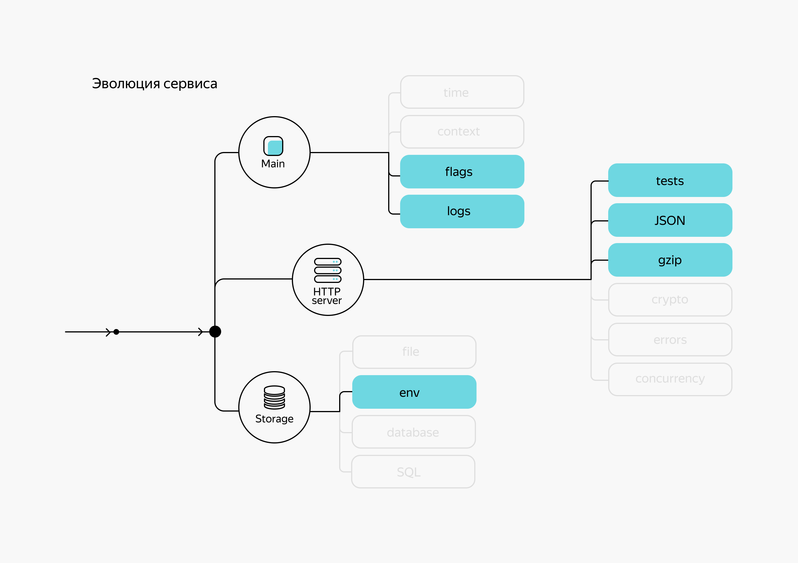

# Оптимизация передачи данных

Сжатие данных — это преобразование данных, которое помогает уменьшить занимаемый ими объём. Оно позволяет не только экономить место на устройстве, но и увеличивать скорость передачи данных. Сжатие особенно эффективно при передаче HTML-страниц и данных в формате JSON, поскольку текстовая информация сжимается очень хорошо.


Алгоритмы сжатия данных определяют, как именно данные преобразуются — сжимаются и разжимаются, превращая одну последовательность байт в другую. Форматы сжатия используются для хранения и передачи упакованных данных. В каждом из них имеются служебные заголовки с дополнительной информацией, такой как: алгоритм сжатия, имена упакованных файлов, размер, время и так далее. 

Для примера можно рассмотреть простейший формат сжатия – `gzip`, который широко используется в Linux. У него следующая структура: 
- 10-байтовый заголовок, содержащий флаги, временную метку, идентификаторы;
- дополнительные заголовки с именем исходного файла и комментариями;
- данные, сжатые с помощью алгоритма сжатия Deflate;
- 8-байтовый блок с контрольной суммой и размером несжатых данных.

Формат `gzip` по умолчанию предназначен для сжатия одного файла, поэтому коллекцию файлов предварительно объединяют в один архив `tar` и сжимают в формате `gzip`. У сжатого файла будет расширение `.tar.gz`.

В одном формате сжатия могут использоваться разные алгоритмы, а один и тот же алгоритм сжатия может применяться в разных форматах.

## Пакеты для сжатия данных

В Go алгоритмы сжатия реализованы в следующих пакетах стандартной библиотеки:
- [compress/bzip2](https://pkg.go.dev/compress/bzip2) — распаковка сжатых данных в формате `bzip2`;
- [compress/lzw](https://pkg.go.dev/compress/lzw) — реализация алгоритма сжатия данных LZW;
- [compress/flate](https://pkg.go.dev/compress/flate) — реализация алгоритма сжатия данных Deflate;
- [compress/gzip](https://pkg.go.dev/compress/gzip) — поддержка сжатия данных в формате `gzip` (использует алгоритм Deflate);
- [compress/zlib](https://pkg.go.dev/compress/zlib) — поддержка сжатия данных в формате `zlib` (использует алгоритм Deflate).

В `zip`-архивах используются алгоритмы bzip2, LZW и Deflate, а формат `gzip` применяется в `gz`-архивах.

Рассмотрим подробнее пакеты `compress/flate` и `compress/gzip`. Первый пакет реализует часто используемый алгоритм сжатия Deflate, а второй обеспечивает поддержку формата `gzip`, используемого при сжатии HTML-страниц. Работа с остальными пакетами аналогична.

Функции пакетов `compress` принимают в качестве параметров переменные, которые реализуют интерфейсы [io.Reader и io.Writer](https://habr.com/ru/post/306914/). В каждом пакете обычно есть два типа: `Writer` для сжатия и `Reader` для распаковки данных.

Так при создании `*gzip.Reader` в функцию `gzip.NewReader(r io.Reader)` передаётся `io.Reader` со сжатыми данными. При этом тип `*gzip.Reader` тоже реализует интерфейс `io.Reader`, из него можно читать уже распакованные данные.

Аналогично со сжатием. `gzip.NewWriter(w io.Writer)` принимает `io.Writer`, в который будут сохраняться сжатые данные. Сам `*gzip.Writer` реализует интерфейс `io.Writer`, в который пишутся исходные данные.

Таким образом, выстраивая цепочки читателей и писателей, не нужно сохранять полные данные в промежуточных переменных. Это особенно важно, когда нужно работать с большим объёмом данных.  

Разберём на примере. Напишем функции сжатия и распаковки с методом Deflate:
```go
// Compress сжимает слайс байт.
func Compress(data []byte) ([]byte, error) {
    var b bytes.Buffer
    // создаём переменную w — в неё будут записываться входящие данные,
    // которые будут сжиматься и сохраняться в bytes.Buffer
    w, err := flate.NewWriter(&b, flate.BestCompression)
    if err != nil {
        return nil, fmt.Errorf("failed init compress writer: %v", err)
    }
    // запись данных
    _, err = w.Write(data)
    if err != nil {
        return nil, fmt.Errorf("failed write data to compress temporary buffer: %v", err)
    }
    // обязательно нужно вызвать метод Close() — в противном случае часть данных
    // может не записаться в буфер b; если нужно выгрузить все упакованные данные
    // в какой-то момент сжатия, используйте метод Flush()
    err = w.Close()
    if err != nil {
        return nil, fmt.Errorf("failed compress data: %v", err)
    }
    // переменная b содержит сжатые данные
    return b.Bytes(), nil
}

// Decompress распаковывает слайс байт.
func Decompress(data []byte) ([]byte, error) {
    // переменная r будет читать входящие данные и распаковывать их
    r := flate.NewReader(bytes.NewReader(data))
    defer r.Close()

    var b bytes.Buffer
    // в переменную b записываются распакованные данные
    _, err := b.ReadFrom(r)
    if err != nil {
        return nil, fmt.Errorf("failed decompress data: %v", err)
    }

    return b.Bytes(), nil
}
```

Функция `flate.NewWriter()` принимает переменную интерфейсного типа `io.Writer`. В нашем примере это `bytes.Buffer`. Если указать переменную типа `os.File`, сжатые данные будут сразу записываться в файл.

То же самое делает функция `flate.NewReader()`. Для неё источником сжатых данных может быть переменная типа `os.File` или другого типа с поддержкой интерфейса `io.Reader`.

Теперь создадим текст, в котором функция `strings.Repeat()` создаст большое количество повторяющихся подстрок. Вызовем функцию `Compress()`.
```go
func main() {
    data := []byte(strings.Repeat(`This is a test message`, 20))
    // сжимаем содержимое data
    b, err := Compress(data)
    if err != nil {
        log.Fatal(err)
    }
    fmt.Printf("%d bytes has been compressed to %d bytes\r\n", len(data), len(b))

    // распаковываем сжатые данные
    out, err := Decompress(b)
    if err != nil {
        log.Fatal(err)
    }
    // сравниваем начальные и полученные данные
    if !bytes.Equal(data, out) {
        log.Fatal(`original data != decompressed data`)
    }
}
```

На экран выведется: `440 bytes has been compressed to 33 bytes`. Получилось сжать строчку в 13 раз!


*Разбавим урок историческим мемом — как раз в тему сжатия данных.
Существует легенда про царя Филиппа II, отца Александра Македонского. Он грозился завоевать всю Лаконию и написал спартанцам длинное письмо: «Если в Лаконию войду, я изгоню вас за пределы…».
Спартанцы были очень лаконичны — и ответили одним словом. Если.*


Но всё же данные нужно не только хранить. Ими нужно обмениваться. Для этой цели существуют алгоритмы с быстрым сжатием и распаковкой: 
- [Brotli](https://pkg.go.dev/github.com/andybalholm/brotli),
- [LZ4](https://pkg.go.dev/github.com/pierrec/lz4),
- [Snappy](https://pkg.go.dev/github.com/golang/snappy),
- [Zstandard](https://pkg.go.dev/github.com/klauspost/compress/zstd).

Brotli от Google и Zstandard сжимают данные значительно быстрее, чем Deflate, и превосходят его по степени сжатия и скорости распаковки. Но это не означает, что они лучше. Идеального по всем параметрам алгоритма сжатия просто не существует. У каждого из них есть дополнительные настройки, которые влияют на степень и скорость компрессии. 

В таблице ниже мы привели результаты работы разных упаковщиков с примерно одинаковыми настройками на одном и том же текстовом наборе. Эти данные позволят вам лучше оценить характеристики каждого алгоритма сжатия. Строки отсортированы в порядке ухудшения степени компрессии.

|Алгоритм|Степень сжатия,%|Скорость упаковки, MiB/sec|Скорость распаковки, MiB/sec| 
|---|---|---|---|
|Zstandard|18.54|0.64|322.88|
|Brotli|19.49|0.34|201.15|
|gzip|26.31|7.72|122.91|
|LZ4|30.24|12.06|1258.51|
|Snappy|41.29|132.59|882.18|

Методы сжатия и распаковки в этих пакетах тоже принимают переменные интерфейсов `io.Writer` и `io.Reader`. Благодаря этому при разработке можно переключаться с одного алгоритма на другой без больших изменений в коде и выбирать оптимальный вариант для конкретной задачи.

Вот как может выглядеть функция сжатия алгоритмом Brotli:
```go
func BrotliCompress(data []byte) ([]byte, error) {
    var buf bytes.Buffer

    w := brotli.NewWriterLevel(&buf, brotli.BestCompression)
    _, err := w.Write(data)
    if err != nil {
        return nil, err
    }
    err = w.Close()
    if err != nil {
        return nil, err
    }
    return buf.Bytes(), err
}
```

Она почти идентична функции `Compress`, которая была рассмотрена выше. Фактически замена функции `flate.NewWriter()` на `brotli.NewWriterLevel()` позволяет переключиться с одного алгоритма сжатия на другой.

Как вы могли заметить, в пакетах сжатия данных часто встречается метод `Flush()`. Он принудительно сбрасывает остаток данных в буфере и записывает их в выходной `io.Writer`. Отметим, что при вызове `Close()` не нужно вызывать `Flush()`.

___
Отметьте верные утверждения.

Верные:
- Можно создать и распаковать gz-файл, используя пакет `compress/gzip` (Пакет `compress/gzip` позволяет создавать и распаковывать gz-файлы.)
- В `zip`-архивах может использоваться любой из этих алгоритмов сжатия — LZW, bzip2 и Deflate

Неверные:
- Только LZW и Deflate поддерживаются форматом `zip`
- Для сжатия создаётся переменная с реализацией интерфейса `io.Reader`, а для распаковки — `io.Writer`
___

## Сжатие данных сервером

Рассмотрим, как применяется сжатие данных в работе сервера. Пусть по умолчанию должны сжиматься все ответы сервера, поэтому используем middleware-обработчик. Вы уже встречались с понятием middleware в теме `net/http`. Напомним основные принципы. 

Предположим, вы определили несколько обработчиков запросов для вашего сервера. На очередном этапе разработки потребовалось добавить аутентификацию пользователя. Добавлять функцию проверки в каждый обработчик — долго и нерационально (к тому же об этом можно забыть при добавлении новых функций). Именно для таких задач используется middleware. Он может служить обработчиком как для всех запросов, так и только для определённых — например, для страницы админки. 

Middleware применяется для аутентификации, логирования, проксирования, балансировки нагрузки и восстановления сервера после panic. Чтобы добавить в HTTP-сервер сжатие данных, не нужно вносить никаких изменений в существующие обработчики. Middleware-обработчик сжатия подменит `http.ResponseWriter` и на лету сможет упаковывать данные в нужный формат.

Размер HTML-страницы может превышать один мегабайт, поэтому есть смысл её уменьшить. Поскольку передаётся текст, сервер может отправлять браузеру страницу в сжатом виде, предварительно убедившись, что клиент способен распаковать такой ответ. Для этого нужно проверить наличие и значение заголовка [Accept-Encoding](https://developer.mozilla.org/en-US/docs/Web/HTTP/Headers/Accept-Encoding) в запросе.

`Accept-Encoding` указывает на то, какой формат сжатых данных поддерживается клиентом:
- `gzip` — сжатие gzip;
- `compress` — сжатие LZW;
- `deflate` — сжатие zlib;
- `br` — сжатие brotli.

В заголовке может быть указан один или несколько поддерживаемых форматов сжатия, а также коэффициент предпочтения `;q=` для конкретных форматов.

```
Accept-Encoding: gzip
Accept-Encoding: gzip, deflate, br
Accept-Encoding: deflate, gzip;q=1.0
```

После того как сервер проверил заголовок `Accept-Encoding` и обнаружил поддержку нужного формата сжатия, он может сжать тело ответа и отправить клиенту. Поскольку сжатие данных — необязательная операция, сервер должен в ответе указать признак, по которому клиент поймёт, что ответ сервера нужно распаковать.

Для этого к ответу нужно добавить заголовок [Content-Encoding](https://developer.mozilla.org/en-US/docs/Web/HTTP/Headers/Content-Encoding). Значение `Content-Encoding` должно равняться одному из значений `Accept-Encoding` и указывать на используемый формат сжатия.

```
Content-Encoding: gzip
```

Теперь рассмотрим реализацию простого сервера с поддержкой `gzip`-сжатия. Пусть сервер возвращает страницу с 20 строками `Hello, world`.

```go
func defaultHandle(w http.ResponseWriter, r *http.Request) {
    w.Header().Set("Content-Type", "text/html")
    io.WriteString(w, "<html><body>"+strings.Repeat("Hello, world<br>", 20)+"</body></html>")
}
```

Поскольку требуется перехватывать и сжимать все страницы, упаковщик `gzip` должен подменить `http.ResponseWriter` и сразу же упаковать данные в нужный формат.

Опишем тип `gzipWriter`, поддерживающий интерфейс `http.ResponseWriter`.

```go
type gzipWriter struct {
    http.ResponseWriter
    Writer io.Writer
}

func (w gzipWriter) Write(b []byte) (int, error) {
    // w.Writer будет отвечать за gzip-сжатие, поэтому пишем в него
    return w.Writer.Write(b)
}
```

Так как `http.ResponseWriter` указан без имени поля, он встраивается в тип `gzipWriter`, который содержит все методы этого интерфейса. В противном случае нужно было бы описать методы `Header` и `WriteHeader`. В примере для `gzipWriter` достаточно переопределить метод `Write`.

Напишем обработчик, который будет сжимать данные, и подключим его к серверу как middleware. Для этого определим функцию, которая принимает в параметре обработчик `http.Handler` и возвращает себя как новый обработчик. Таким образом, запрос к серверу попадёт в эту функцию, где при необходимости можно заменить обычный `Writer` на `gzip.Writer`, и он обеспечит сжатие данных. Если вы используете для управления HTTP-сервером внешний пакет, то подключение middleware может отличаться от приведённого примера.

```go
func gzipHandle(next http.Handler) http.Handler {
    return http.HandlerFunc(func(w http.ResponseWriter, r *http.Request) {
        // проверяем, что клиент поддерживает gzip-сжатие
        // это упрощённый пример. В реальном приложении следует проверять все
        // значения r.Header.Values("Accept-Encoding") и разбирать строку
        // на составные части, чтобы избежать неожиданных результатов
        if !strings.Contains(r.Header.Get("Accept-Encoding"), "gzip") {
            // если gzip не поддерживается, передаём управление
            // дальше без изменений
            next.ServeHTTP(w, r)
            return
        }

        // создаём gzip.Writer поверх текущего w
        gz, err := gzip.NewWriterLevel(w, gzip.BestSpeed)
        if err != nil {
            io.WriteString(w, err.Error())
            return
        }
        defer gz.Close()

        w.Header().Set("Content-Encoding", "gzip")
        // передаём обработчику страницы переменную типа gzipWriter для вывода данных
        next.ServeHTTP(gzipWriter{ResponseWriter: w, Writer: gz}, r)
    })
}

func main() {
    mux := http.NewServeMux()
    mux.HandleFunc("/", defaultHandle)
    http.ListenAndServe(":3000", gzipHandle(mux))
}
```

Минимальным кодом получилось создать сервер с поддержкой `gzip`. Если добавить в сервер другие страницы, они тоже будут автоматически сжиматься. Запустите программу и посмотрите в браузере, как работает сжатие.


Созданный сервер далёк от идеала и не учитывает некоторые моменты. 

Во-первых, перед сжатием нужно убедиться, что передаваемые данные имеет смысл сжимать — что это не изображение, документ или архивный файл. Лучше определить и использовать массив значений `Content-Type`, при которых будет происходить сжатие. Например:
```
application/javascript
application/json
text/css
text/html
text/plain
text/xml
```

И нужно дополнительно проверять заголовок `Content-Type` на соответствие данному списку.

Во-вторых, стоит решить вопрос о сжатии маленьких файлов (до 1400 байт), так как особой выгоды здесь нет: данные всё равно передаются пакетами определённого размера. Если этот момент не описан в ТЗ, он остаётся на усмотрение разработчика.

В-третьих, нужно подумать о том, как отказаться от постоянного вызова `gzip.NewWriterLevel` и использовать метод `gzip.Reset`, чтобы избежать выделения памяти при каждом запросе.

Можно найти готовые фреймворки и пакеты, которые учитывают эти проблемы при работе с `gzip`, и изучить их реализацию.

___
Реализуйте аналог обработчика `gzipHandle` в разобранном выше примере, который использует `zlib` формат вместо `gzip`. Помните, что в этом случае нужно проверять `Accept-Encoding` на наличие `deflate`.
```go
package main

import (
    "compress/flate"
    "compress/zlib"
    "io"
    "net/http"
    "strings"
)

type zlibWriter struct {
    http.ResponseWriter
    Writer io.Writer
}

func (w zlibWriter) Write(b []byte) (int, error) {
    // w.Writer будет отвечать за zlib-сжатие, поэтому пишем в него
    return w.Writer.Write(b)
}

func defaultHandle(w http.ResponseWriter, r *http.Request) {
    w.Header().Set("Content-Type", "text/html")
    io.WriteString(w, "<html><body>"+strings.Repeat("Hello, world<br>", 20)+"</body></html>")
}

func deflateHandle(next http.Handler) http.Handler {
    return http.HandlerFunc(func(w http.ResponseWriter, r *http.Request) {
        // проверяем, что клиент поддерживает deflate-сжатие
        if !strings.Contains(r.Header.Get("Accept-Encoding"), "deflate") {
            next.ServeHTTP(w, r)
            return
        }
        flatew, err := zlib.NewWriterLevel(w, flate.BestCompression)
        if err != nil {
            io.WriteString(w, err.Error())
            return
        }
        defer flatew.Close()

        w.Header().Set("Content-Encoding", "deflate")
        next.ServeHTTP(zlibWriter{ResponseWriter: w, Writer: flatew}, r)
    })
}

func main() {
    mux := http.NewServeMux()
    mux.HandleFunc("/", defaultHandle)
    http.ListenAndServe(":3000", deflateHandle(mux))
}
```

___
Выберите верные утверждения.

Верные:
- `middleware` может прекратить обработку запроса и вернуть ответ (Для этого не нужно вызывать следующий обработчик. Чаще всего это происходит в случае ошибочной ситуации.)
- Отдавать сжатый ответ можно только при наличии соответствующего формата в Accept-Encoding (Сжатие данных можно делать только тогда, когда принимающая сторона может их распаковать.)

Неверные:
- gzip-сжатие на сервере нельзя реализовать без middleware
- Использование заголовка Content-Encoding для сжатых данных опционально
___


## Распаковка данных

Если вы отправляете запрос HTTP-серверу стандартным Go-клиентом, он автоматически добавляет заголовок `Accept-Encoding: gzip` и распаковывает полученный ответ. В этом случае не нужно добавлять распаковку в код клиента. 

Рассмотрим ситуацию, когда серверу может прийти запрос со сжатыми данными. Приведённый ниже обработчик получает в теле запроса сжатые данные в формате `gzip`, распаковывает и возвращает их оригинальный размер.

```go
// LengthHandle возвращает размер распакованных данных.
func LengthHandle(w http.ResponseWriter, r *http.Request) {
    // создаём *gzip.Reader, который будет читать тело запроса
    // и распаковывать его
    gz, err := gzip.NewReader(r.Body)
    if err != nil {
        http.Error(w, err.Error(), http.StatusInternalServerError)
        return
    }
    // закрытие gzip-читателя опционально, так как все данные уже прочитаны и 
    // текущая реализация не требует закрытия, тем не менее лучше это делать -
    // некоторые реализации могут рассчитывать на закрытие читателя
    // gz.Close() не вызывает закрытия r.Body - это будет сделано позже, http-сервером
    defer gz.Close()

    // при чтении вернётся распакованный слайс байт
    body, err := io.ReadAll(gz)
    if err != nil {
        http.Error(w, err.Error(), http.StatusInternalServerError)
        return
    }
    fmt.Fprintf(w, "Length: %d", len(body))
}
```

Распаковка сжатых `gzip`-данных не сильно отличается от распаковки Deflate. Этот обработчик считает, что к нему приходят только упакованные данные. Если в запросе отправить обычный текст, вернётся ошибка.

___
Измените обработчик `LengthHandle` так, чтобы он распаковывал тело запроса только при наличии заголовка `Content-Encoding: gzip`. Если заголовка нет, должен возвращаться размер тела запроса без декомпрессии.
```go
func LengthHandle(w http.ResponseWriter, r *http.Request) {
    // переменная reader будет равна r.Body или *gzip.Reader
    var reader io.Reader

    if r.Header.Get(`Content-Encoding`) == `gzip` {
        gz, err := gzip.NewReader(r.Body)
        if err != nil {
            http.Error(w, err.Error(), http.StatusInternalServerError)
            return
        }
        reader = gz
        defer gz.Close()
    } else {
        reader = r.Body
    }

    body, err := io.ReadAll(reader)
    if err != nil {
        http.Error(w, err.Error(), http.StatusInternalServerError)
        return
    }
    fmt.Fprintf(w, "Length: %d", len(body))
}
```
___
Отметьте верные утверждения.

Верные:
- Вызов метода `Close()` обязателен после сжатия (Важно вызвать метод `Close()`, потому что он отправляет оставшиеся данные.)
- На сервере можно сжать только нужные типы данных, чтобы не сжимать всё подряд (Используя значение заголовка `Content-Type`, можно реализовать выборочное сжатие данных.)

Неверные:
- Метод `Header.Get(key string)` возвращает все значения указанного ключа
- Наличие `Accept-Encoding` в заголовке разрешает отправлять контент в `gzip`-формате
___

## Дополнительные материалы

В стандартной библиотеке Go есть ещё два пакета, которые имеют отношение к сжатию данных. Пакеты `archive/tar` и `archive/zip` предназначены для создания и распаковки архивных файлов соответствующих форматов. Если нужна поддержка других архивов, можно воспользоваться пакетом [mholt/archives](https://github.com/mholt/archives).

В этом уроке не рассматривалась работа с архивами, но вы можете попрактиковаться самостоятельно. Например, заставить сервер на лету генерировать документ, упаковывать его в `zip` и отдавать для скачивания. Или, не прибегая к внешним зависимостям, найти и заменить текст в docx- или xlsx-файле.

- [Хабр | Интерфейсные типы io.Reader и io.Writer](https://habr.com/ru/post/306914/) — статья об интерфейсных типах.
- [Echo | Gzip Middleware](https://echo.labstack.com/middleware/gzip/) — пример реализации gzip в HTTP-сервере.
- [GitHub | Zstandard](https://facebook.github.io/zstd/) — алгоритм сжатия Zstandard.
- [GitHub | NYTimes/gziphandler](https://pkg.go.dev/github.com/NYTimes/gziphandler) — пакет `gziphandler`.
- [GitHub | mholt/archiver](https://github.com/mholt/archiver) — пакет `mholt/archiver` для работы с архивами.
- [GitHub | Squash Compression Benchmark](https://quixdb.github.io/squash-benchmark/) — Squash Compression Benchmark.
- [MDN Web Docs | Accept-Encoding](https://developer.mozilla.org/en-US/docs/Web/HTTP/Headers/Accept-Encoding) — спецификация заголовка Accept-Encoding.
- [MDN Web Docs | Content-Encoding](https://developer.mozilla.org/en-US/docs/Web/HTTP/Headers/Content-Encoding) — спецификация заголовка Content-Encoding.

# Обучение Алисы 8

Запросы от клиента, как и ответы от сервера, могут весить очень много — вплоть до десятков мегабайт. Чтобы сократить время передачи данных, можно применить эффективный алгоритм сжатия. Например, распространённый формат gzip.

Поскольку HTTP/1.1 — это текстовый протокол, передаваемые по нему данные отлично поддаются компрессии. Причём с невысоким расходом процессора на обработку алгоритма сжатия.

Добавим в навык Алисы поддержку сжатия и декомпрессии данных. Сделаем это через механизм `middleware`, чтобы отделить реализацию хендлера запросов от реализации сжатия и декомпрессии. Тогда хендлер не будет заботиться о том, сжимались ли данные на стороне клиента. Он просто продолжит пользоваться стандартными объектами `http.ResponseWriter` и `*http.Request`, как и раньше.

Создадим файл `cmd/skill/gzip.go`:
```
> ~/dev/alice-skill
       |
       |--- cmd
       |     |--- skill
       |            |--- flags.go
       |            |--- gzip.go
       |            |--- main.go
       |            |--- main_test.go
       |--- internal
       |       |--- logger
       |       |      |--- logger.go
       |       |--- models
       |              |--- models.go
       |--- go.mod
       |--- go.sum
```

В новый файл поместим код, который будет реализовывать `http.ResponseWriter`, и поле Body объекта `*http.Request`:
```go
package main

import (
    "compress/gzip"
    "io"
    "net/http"
)

// compressWriter реализует интерфейс http.ResponseWriter и позволяет прозрачно для сервера
// сжимать передаваемые данные и выставлять правильные HTTP-заголовки
type compressWriter struct {
    w  http.ResponseWriter
    zw *gzip.Writer
}

func newCompressWriter(w http.ResponseWriter) *compressWriter {
    return &compressWriter{
        w:  w,
        zw: gzip.NewWriter(w),
    }
}

func (c *compressWriter) Header() http.Header {
    return c.w.Header()
}

func (c *compressWriter) Write(p []byte) (int, error) {
    return c.zw.Write(p)
}

func (c *compressWriter) WriteHeader(statusCode int) {
    if statusCode < 300 {
        c.w.Header().Set("Content-Encoding", "gzip")
    }
    c.w.WriteHeader(statusCode)
}

// Close закрывает gzip.Writer и досылает все данные из буфера.
func (c *compressWriter) Close() error {
    return c.zw.Close()
}

// compressReader реализует интерфейс io.ReadCloser и позволяет прозрачно для сервера
// декомпрессировать получаемые от клиента данные
type compressReader struct {
    r  io.ReadCloser
    zr *gzip.Reader
}

func newCompressReader(r io.ReadCloser) (*compressReader, error) {
    zr, err := gzip.NewReader(r)
    if err != nil {
        return nil, err
    }

    return &compressReader{
        r:  r,
        zr: zr,
    }, nil
}

func (c compressReader) Read(p []byte) (n int, err error) {
    return c.zr.Read(p)
}

func (c *compressReader) Close() error {
    if err := c.r.Close(); err != nil {
        return err
    }
    return c.zr.Close()
}
```

Теперь нужно дополнить код в файле `main.go`. Добавим в него `middleware`-функцию и обернём ею хендлер:
```go
func gzipMiddleware(h http.HandlerFunc) http.HandlerFunc {
    return func(w http.ResponseWriter, r *http.Request) {
        // по умолчанию устанавливаем оригинальный http.ResponseWriter как тот,
        // который будем передавать следующей функции
        ow := w

        // проверяем, что клиент умеет получать от сервера сжатые данные в формате gzip
        acceptEncoding := r.Header.Get("Accept-Encoding")
        supportsGzip := strings.Contains(acceptEncoding, "gzip")
        if supportsGzip {
            // оборачиваем оригинальный http.ResponseWriter новым с поддержкой сжатия
            cw := newCompressWriter(w)
            // меняем оригинальный http.ResponseWriter на новый
            ow = cw
            // не забываем отправить клиенту все сжатые данные после завершения middleware
            defer cw.Close()
        }

        // проверяем, что клиент отправил серверу сжатые данные в формате gzip
        contentEncoding := r.Header.Get("Content-Encoding")
        sendsGzip := strings.Contains(contentEncoding, "gzip")
        if sendsGzip {
            // оборачиваем тело запроса в io.Reader с поддержкой декомпрессии
            cr, err := newCompressReader(r.Body)
            if err != nil {
                w.WriteHeader(http.StatusInternalServerError)
                return
            }
            // меняем тело запроса на новое
            r.Body = cr
            defer cr.Close()
        }

        // передаём управление хендлеру
        h.ServeHTTP(ow, r)
    }
}

// ...

func run() error {
    if err := logger.Initialize(flagLogLevel); err != nil {
    return err
    }

    logger.Log.Info("Running server", zap.String("address", flagRunAddr))
    // оборачиваем хендлер webhook в middleware с логированием и поддержкой gzip
    return http.ListenAndServe(flagRunAddr, logger.RequestLogger(gzipMiddleware(webhook)))
}
```

Затем нужно убедиться, что всё работает как надо. Для этого напишем юнит-тест с проверкой поддержки сжатых данных. Добавим в файл `main_test.go` следующий код:
```go
// ...

func TestGzipCompression(t *testing.T) {
    handler := http.HandlerFunc(gzipMiddleware(webhook))
    
    srv := httptest.NewServer(handler)
    defer srv.Close()
    
    requestBody := `{
        "request": {
            "type": "SimpleUtterance",
            "command": "sudo do something"
        },
        "version": "1.0"
    }`

    // ожидаемое содержимое тела ответа при успешном запросе
    successBody := `{
        "response": {
            "text": "Извините, я пока ничего не умею"
        },
        "version": "1.0"
    }`
    
    t.Run("sends_gzip", func(t *testing.T) {
        buf := bytes.NewBuffer(nil)
        zb := gzip.NewWriter(buf)
        _, err := zb.Write([]byte(requestBody))
        require.NoError(t, err)
        err = zb.Close()
        require.NoError(t, err)
        
        r := httptest.NewRequest("POST", srv.URL, buf)
        r.RequestURI = ""
        r.Header.Set("Content-Encoding", "gzip")
        r.Header.Set("Accept-Encoding", "")
        
        resp, err := http.DefaultClient.Do(r)
        require.NoError(t, err)
        require.Equal(t, http.StatusOK, resp.StatusCode)
        
        defer resp.Body.Close()
        
        b, err := io.ReadAll(resp.Body)
        require.NoError(t, err)
        require.JSONEq(t, successBody, string(b))
    })

    t.Run("accepts_gzip", func(t *testing.T) {
        buf := bytes.NewBufferString(requestBody)
        r := httptest.NewRequest("POST", srv.URL, buf)
        r.RequestURI = ""
        r.Header.Set("Accept-Encoding", "gzip")
        
        resp, err := http.DefaultClient.Do(r)
        require.NoError(t, err)
        require.Equal(t, http.StatusOK, resp.StatusCode)
        
        defer resp.Body.Close()
        
        zr, err := gzip.NewReader(resp.Body)
        require.NoError(t, err)
        
        b, err := io.ReadAll(zr)
        require.NoError(t, err)
        
        require.JSONEq(t, successBody, string(b))
    })
}
```

Также добавим новый импорт пакета тестирования `require`:
```go
import "github.com/stretchr/testify/require"
```

Запустим тесты и убедимся, что все проверки завершаются успешно:
```shell
=== RUN   Test_webhook
--- PASS: Test_webhook (0.00s)
...
=== RUN   TestGzipCompression
--- PASS: TestGzipCompression (0.00s)
=== RUN   TestGzipCompression/sends_gzip
    --- PASS: TestGzipCompression/sends_gzip (0.00s)
=== RUN   TestGzipCompression/accepts_gzip
    --- PASS: TestGzipCompression/accepts_gzip (0.00s)
PASS
Process finished with the exit code 0
```

Мы добавили в наш сервис поддержку компрессии данных. Теперь можно не беспокоиться, что хостер нашего приложения отключит нам услуги размещения за перерасход трафика.

В следующей итерации мы добавим в наш сервис работу со временем, чтобы он стал более интерактивным.

# Инкремент 8

## Задание по треку «Сервис сокращения URL»

Добавьте поддержку gzip в ваш сервис. Научите его:
- Принимать запросы в сжатом формате (с HTTP-заголовком `Content-Encoding`).
- Отдавать сжатый ответ клиенту, который поддерживает обработку сжатых ответов (с HTTP-заголовком `Accept-Encoding`).

Функция сжатия должна работать для контента с типами `application/json` и `text/html`.

Вспомните `middleware` из урока про HTTP-сервер, это может вам помочь.

## Задание по треку «Сервис сбора метрик и алертинга»

Добавьте поддержку gzip в код сервера и агента. Научите:
- Агента передавать данные в формате gzip.
- Сервер опционально принимать запросы в сжатом формате (при наличии соответствующего HTTP-заголовка `Content-Encoding`).
- Отдавать сжатый ответ клиенту, который поддерживает обработку сжатых ответов (с HTTP-заголовком `Accept-Encoding`).

Функция сжатия должна работать для контента с типами `application/json` и `text/html`.

Вспомните `middleware` из урока про HTTP-сервер — это может вам помочь.

# Что вы узнали

В теме `compress` вы познакомились с алгоритмами и форматами сжатия данных, реализованными в стандартной библиотеке Go. А ещё:
- узнали про некоторые другие алгоритмы сжатия данных и области их применения;
- изучили принцип работы алгоритма Deflate;
- рассмотрели примеры реализации веб-сервера с поддержкой gzip;
- научились распаковывать сжатое тело запроса.

Вы добавили gzip-сжатие в ваш сервис, а значит, сможете в дальнейшем использовать компрессию в любых проектах на Go. Так держать!



