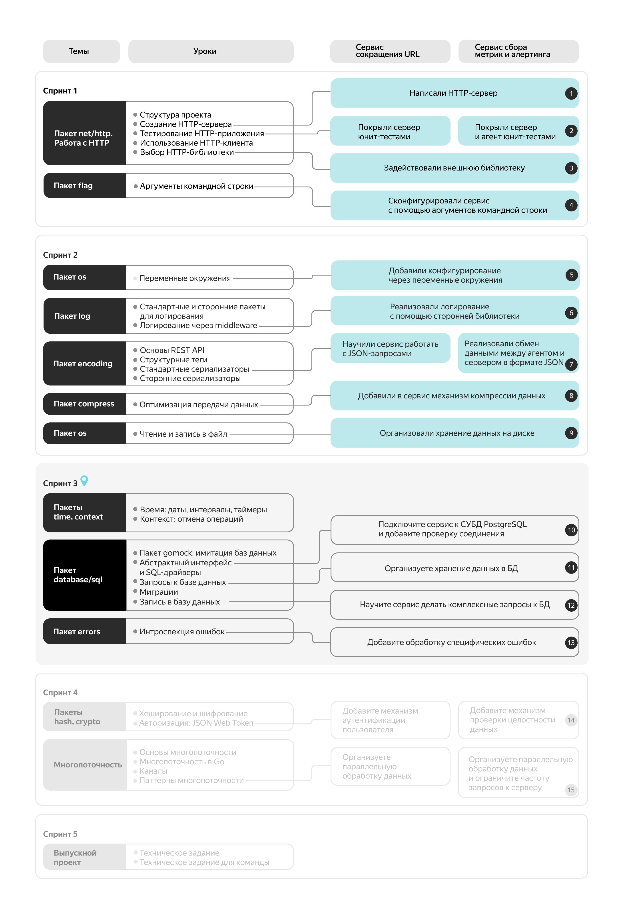
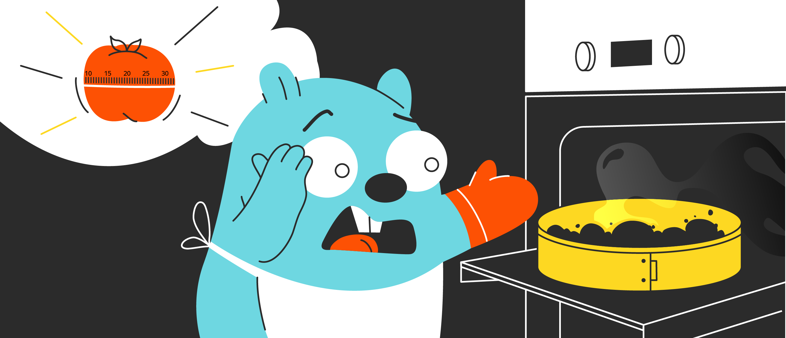
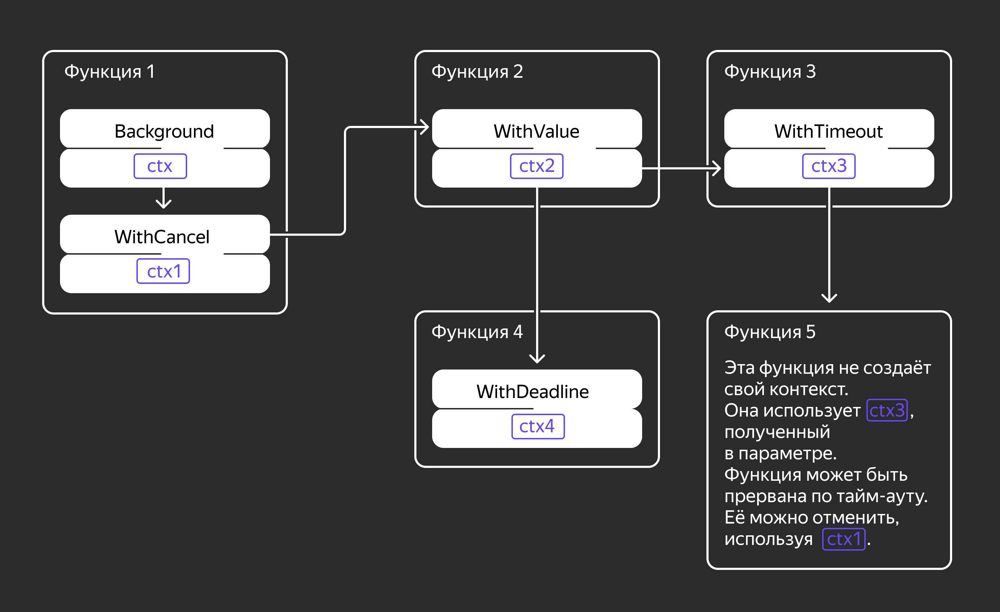
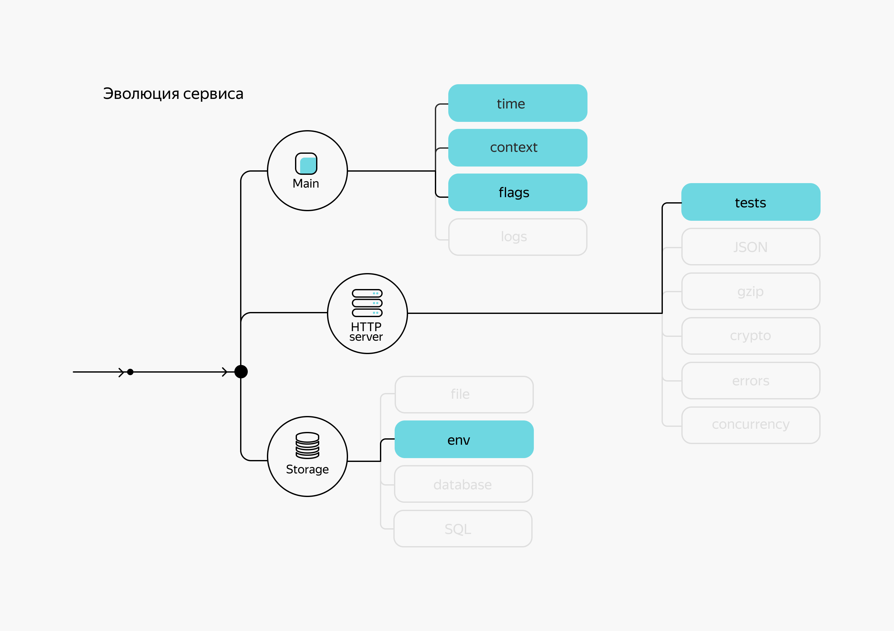

# Введение в спринт 3

Приветствуем вас в третьем спринте нашего курса по языку Go!

## Что вас ждёт?

В этом спринте вы:
- научитесь работать с пакетом `time` из стандартной библиотеки;
- изучите `context` для контроля выполнения и отмены операций;
- подробно разберёте основные возможности работы с базой данных в языке Go;
- узнаете о продвинутых техниках обработки ошибок и пакете `error`;
- рассмотрите одну из реализаций классификатора ошибок на Retryable и Non-Retryable.

## Проектные инкременты

В рамках спринта вы продолжите развивать свой проект и реализуете следующие новые возможности:
- добавите поддержку базы данных PostgreSQL;
- реализуете поддержку множественных запросов;
- добавите обработку Retryable-ошибок.

## Покрытие кода тестами

**Внимание:** к концу спринта рекомендуется покрыть код тестами на **20%**.

## Карта курса

Напоминаем, что с помощью карты курса вы можете отслеживать свой прогресс по проектной работе: какие задачи сделаны, что осталось добавить.



Посылаем вам лучи поддержки и желаем продуктивной работы в новом спринте! 

# Время: даты, интервалы, таймеры

В предыдущих спринтах вы узнали, как создавать HTTP-сервер, использовать структурные теги и сериализаторы, изучили сжатие данных и работу с файлами. Настала очередь пакетов `time` и `context` стандартной библиотеки Go.

Первый пакет предоставляет функции для операций с датой и временем. Он позволяет получить текущее время и узнать любую дату (например, какое число будет через `n` дней). Ещё благодаря этому пакету можно создать таймер, который будет напоминать, что пора сделать паузу в работе. И это далеко не все возможности.

Пакет `time` используется, даже если функциональность программы не связана с временем напрямую. Если приложение просто копирует файлы из одной папки в другую, `time` может потребоваться для записи логов, сбора метрик, приостановки программы или запуска горутин по таймеру.

Другой пакет, который вы изучите в этой теме, — `context`. Без него не обходится ни один серьёзный проект. Пакет `context` даёт возможность установить дополнительные признаки для завершения работы горутины — например, когда пользователь отменил запущенную задачу или истекло время ожидания соединения с сервером.

С помощью этого пакета можно установить дедлайн или максимальное время выполнения горутины, а также сообщить о прекращении её работы из других потоков. На примере пакета `context` вы увидите, как могут применяться на практике функции для работы с временем.

Подробно о горутинах расскажем в теме, посвящённой многопоточности. А пока вы узнаете:
- как работать с временем, интервалами и часовыми поясами в Go;
- как приостанавливать работу горутины, запускать её несколько раз через определённые промежутки;
- как преобразовывать дату и время в строку в соответствии с нужным форматом и конвертировать обратно;
- как создавать и использовать `context` для отмены исполнения ветвей программы.

Почти в любом проекте нужно считать продолжительность выполнения кода, ожидать определённого события в программе или просто выводить время в логах. В Go за это отвечает пакет [time](https://pkg.go.dev/time). Он содержит:
- тип `Time` и методы для работы с датой и временем;
- тип `Duration` и методы для работы с интервалами;
- типы `Timer`, `Ticker` и функции для работы с таймерами;
- тип `Location` и методы для работы с часовыми поясами.

Для начала расскажем, как получить значения текущих даты и времени. Предположим, нужно зафиксировать время наступления события или определённого действия. Для этого используем функцию `time.Now()`, которая возвращает переменную типа `Time`:
```go
package main

import (
    "fmt"
    "time"
)

func main() {
    now := time.Now()
    fmt.Println(now)
}
```
Программа выведет текущее время в таком формате: `2021-11-10 18:48:38.08749 +0300 MSK m=+0.000092583`. Тип `Time` реализует интерфейс `fmt.Stringer`, поэтому функция `fmt.Println()` выводит время в виде строки.

Кроме даты и времени, в структуре `Time` хранится информация о часовом поясе — по умолчанию это часовой пояс операционной системы, в которой запущен код. Для переменной типа `Time` можно вызвать множество методов, чтобы работать с содержащимся в ней временем.

Для установки произвольных значений даты и времени воспользуемся функцией `time.Date()`:
```go
func Date(year int, month Month, day, hour, min, sec, nsec int, loc *Location) Time
```

Получим такой результат:
```go
package main

import (
    "fmt"
    "time"
)

func main() {
    t := time.Date(2003, time.May, 1, 7, 1, 24, 0, time.UTC)
    fmt.Println(t)
}
```
Результат:
```
2003-05-01 07:01:24 +0000 UTC
```

## Форматирование даты и времени

Макет формата времени в Go отличается от того, как он выглядит в других языках программирования. Каждый элемент даты и времени представлен либо в виде цифры с форматированием, либо в виде аббревиатуры. Символы, которые нельзя использовать в макете, будут подставлены как есть.

Вот список основных обозначений в макете:
- `1` — месяц;
- `2` — день;
- `3`, `15` — час в 12- и 24-часовом формате соответственно;
- `4` — минуты;
- `5` — секунды;
- `06`, `2006` — год;
- `-0700` — часовой пояс;
- `pm`, `PM` — время суток;
- `MST` — аббревиатура часового пояса.

Чаще всего к цифре месяца, дня, часа, минуты и секунды добавляют ноль, чтобы значение занимало два символа. 

Преобразовать время в строку требуемого формата можно методом `Format()`. Он возвращает текстовое представление времени в соответствии с переданным макетом: 
```go
func (t Time) Format(layout string) string
```

Для сравнения преобразуем в строки разного формата одно и то же время. Например, 1 мая 2003 года 17:01:21:
```go
package main

import (
    "fmt"
    "time"
)

func main() {
    t := time.Date(2003, time.May, 1, 17, 1, 21, 0, time.UTC)
    fmt.Println("Сложно воспринимать: ", t.Format("2.1.06 3:4:5 PM"))
    fmt.Println("Привычный для нас формат: ", t.Format("02.01.06 15:04:05"))
}
```
Программа выведет:
```
Сложно воспринимать:  1.5.03 5:1:21 PM
Привычный для нас формат:  01.05.03 17:01:21
```

Если ко дню добавить слева два нуля или два символа подчёркивания (`__`), то программа выведет день относительно начала года — в формате трёх символов с нулями или пробелами:
```go
package main

import (
    "fmt"
    "time"
)

func main() {
    t := time.Date(2003, time.May, 1, 17, 1, 21, 0, time.UTC)
    fmt.Printf("%s — это %s-й день в году", t.Format("02.01.06"), t.Format("__2"))
}
```
Получим:
```
01.05.03 — это 121-й день в году
```

Чтобы запомнить, чему соответствуют числа в макете формата времени, можно использовать мнемонические представления:
```
01/02 03:04:05PM '06 -0700
MM/DD HH:MM:SSPM 'YY -ZONE
```

Также есть дополнительные обозначения:
- `Jan`, `January` — месяц в виде строки на английском;
- `Mon`, `Monday` — день в виде строки на английском;
- `.0-000000000`, `.9-999999999` — доли секунды, будет выводиться столько цифр, сколько указано;
- `-0700`, `-07:00`, `-07`, `Z0700`, `Z07:00`, `Z07` — часовой пояс;
- `MST` — аббревиатура часового пояса.

Вот некоторые константы пакета `time` с готовыми макетами:
|Константа|Макет|Пример результата|
|---|---|---|
|UnixDate|`Mon Jan _2 15:04:05 MST 2006`|`Thu May  1 17:01:21 UTC 2003`|
|RFC822|`02 Jan 06 15:04 MST`|`01 May 03 17:01 UTC`|
|RFC850|`Monday, 02-Jan-06 15:04:05 MST`|`Thursday, 01-May-03 17:01:21 UTC`|
|RFC1123|`Mon, 02 Jan 2006 15:04:05 MST`|`Thu, 01 May 2003 17:01:21 UTC`|
|RFC3339|`2006-01-02T15:04:05Z07:00`|`2003-05-01T17:01:21Z`|

___
Обычно в компаниях для упрощения чтения и парсинга логов стандартизируют формат логирования. В том числе стандартизируют формат вывода времени. Представьте, что вы начали писать свой сервис и ваша задача — вывести время в формате, принятом в компании.

Выведите на экран текущее время в формате `Sun, 19 Sep 2021 15:42:00 MSK`: день недели в краткой форме, число в виде двух цифр, месяц в краткой форме, год в виде четырёх цифр, часы в 24-часовом формате, минуты и секунды в виде двух цифр, аббревиатуру часового пояса.

```go
package main

import (
    "fmt"
    "time"
)

func main() {
    now := time.Now()
    // допишите код здесь
    // ...
}
```
Решение:
```go
func main() {
    now := time.Now()
    fmt.Println(now.Format(time.RFC1123))
    // или
    // fmt.Println(now.Format("Mon, 02 Jan 2006 15:04:05 MST"))
}
```
___

## Парсинг даты и времени

Допустим, программа получила значения даты и времени в виде строки. Чтобы работать дальше с этим временем, нужно преобразовать строку в переменную типа `Time`. Это можно сделать функцией `Parse()`:
```go
func Parse(layout, value string) (Time, error)
```

Функция `Parse()` позволяет получить время из строки, но для этого нужно знать макет, который соответствует данному строковому представлению:
```go
package main

import (
	"fmt"
	"time"
)

func parseTime(layout, value string) {
	t, err := time.Parse(layout, value)
	if err != nil {
		panic(err)
	}
	fmt.Println(t.Format(`02.01.06 15:04:05`))
}

func main() {
	parseTime(time.UnixDate, "Tue Jun 1 22:16:03 MSK 2022")
	parseTime("01/02/2006 15:04:05", "01/26/2023 14:43:00")
}
```
Результат:
```
01.06.22 22:16:03
26.01.23 14:43:00
```

___
Один из сторонних сервисов, взаимодействующих с вашим, передаёт время в виде строки другого формата. Ваша задача — достать объект типа `Time` из строки `2021-09-19T15:59:41+03:00` и вывести его в консоль.
```go
package main

import (
    "fmt"
    "time"
)

func main() {
    currentTimeStr := "2021-09-19T15:59:41+03:00"
    // допишите код
    // ...
}
```

Решение:
```go
func main() {
    currentTimeStr := "2021-09-19T15:59:41+03:00"
    currentTime, err := time.Parse(time.RFC3339, currentTimeStr)
    // или
    // currentTime, err := time.Parse("2006-01-02T15:04:05Z07:00", currentTimeStr)
    if err != nil {
        panic(err)
    }
    fmt.Println(currentTime)
}
```
___

## Интерфейсы типа Time

Так как у типа `Time` есть метод `String()`, он реализует интерфейс `fmt.Stringer`. Благодаря этому тип `Time` можно выводить в консоль и преобразовывать в строку. 

Кроме `fmt.Stringer`, тип `Time` реализует следующие интерфейсы:
- `encoding.BinaryMarshaler`
- `encoding.BinaryUnmarshaler`
- `json.Marshaler`
- `json.Unmarshaler`
- `encoding.TextMarshaler`
- `encoding.TextUnmarshaler`

Тип `Time` может участвовать в преобразовании структуры в двоичное, текстовое или JSON-представление. По умолчанию для текстового и JSON-преобразования используется макет `time.RFC3339`.

Из значения типа `Time` можно получить год, месяц, число, день недели, время, часовой пояс и timestamp с помощью одноимённых методов. Наглядно это можно увидеть на примере:
```go
package main

import (
    "fmt"
    "time"
)

func main() {
    now := time.Now()
    fmt.Println("Год:", now.Year())
    fmt.Println("Месяц:", now.Month())
    fmt.Println("Число:", now.Day())
    fmt.Println("День недели:", now.Weekday())
    hour, min, sec := now.Clock()
    fmt.Printf("Время: %d:%d:%d\n", hour, min, sec)
    fmt.Println("Часовой пояс:", now.Location())
    fmt.Println("timestamp в секундах:", now.Unix())
    fmt.Println("timestamp в наносекундах:", now.UnixNano())
}
```
Результат:
```
Год: 2025
Месяц: September
Число: 10
День недели: Wednesday
Время: 20:46:4
Часовой пояс: UTC
timestamp в секундах: 1757537164
timestamp в наносекундах: 1757537164934546042
```

Значения времени можно сравнивать между собой с помощью методов `Equal()`, `After()` и `Before()`:
```go
// Equal проверяет, равны ли два момента времени.
func (t Time) Equal(u Time) bool

// After проверяет, наступил ли момент времени t после u.
func (t Time) After(u Time) bool

// Before проверяет, наступил ли момент времени t перед u.
func (t Time) Before(u Time) bool
```

___
В предыдущем задании вы получили время из строки. Теперь нужно понять, отличается ли время, которое вам передали, от текущего. Сравните текущее время с полученным результатом, используя методы `Equal()`, `After()` и `Before()`.

```go
package main

import (
    "fmt"
    "log"
    "time"
)

func main() {
    currentTimeStr := "2021-09-19T15:59:41+03:00"
    currentTime, err := time.Parse(time.RFC3339, currentTimeStr)
    if err != nil {
        log.Fatal(err)
    }
    fmt.Println(currentTime)

    now := time.Now()

    fmt.Println("Is", now, "before", currentTime, "? Answer:", now.Before(currentTime))
    // добавьте проверки для методов After и Equal
    // ...
}
```
Решение:
```go
fmt.Println("Is", now, "after", currentTime, "? Answer:", now.After(currentTime))
fmt.Println("Is", now, "equal", currentTime, "? Answer:", now.Equal(currentTime))
```
___

## Тип Duration

Для определения интервала времени используют тип `Duration`, который содержит количество наносекунд. Это переопределение типа `int64`.

```go
type Duration int64
```

Чтобы получить нужный интервал, можно воспользоваться следующими методами:
```go
// Sub возвращает интервал: t — u.
func (t Time) Sub(u Time) Duration

// Since возвращает интервал: текущее время — t.
func Since(t Time) Duration

// Until возвращает интервал: t — текущее время.
func Until(t Time) Duration
```

Вот простой пример использования `Duration` — замер времени выполнения функции:
```go
start := time.Now()
anyFunction()
duration := time.Since(start)
```

Такой подход часто применяют, чтобы собрать метрики по времени выполнения критически важного кода. Например, когда нужно посчитать длительность обращений в базу данных или продолжительность обработки HTTP-запросов.

В пакете `time` есть несколько предопределённых интервалов:
```go
const (
    Nanosecond  Duration = 1
    Microsecond          = 1000 * Nanosecond
    Millisecond          = 1000 * Microsecond
    Second               = 1000 * Millisecond
    Minute               = 60 * Second
    Hour                 = 60 * Minute
)
```

*Чтобы сделать код понятным для других разработчиков, лучше использовать предопределённые интервалы вместо числовых значений и определения собственных констант.*

Ещё с помощью `Duration` можно модифицировать дату и время: 
```go
// Add добавляет интервал ко времени.
func (t Time) Add(d Duration) Time

// Round округляет время до начала ближайшего указанного интервала.
func (t Time) Round(d Duration) Time

// Truncate округляет время в меньшую сторону до начала
// ближайшего указанного интервала.
func (t Time) Truncate(d Duration) Time
```

Покажем на примере:
```go
package main

import (
    "fmt"
    "time"
)

func main() {
    now := time.Now()
    // добавим 20 секунд к текущему времени
    fmt.Println(now.Add(20*time.Second))       
    // округлим время до часа
    fmt.Println(now.Round(time.Hour))          
    // округлим время в меньшую сторону до начала трёхминутного интервала
    fmt.Println(now.Truncate(3 * time.Minute)) 
}
```
Результат:
```
2025-09-10 21:00:12.984879448 +0000 UTC m=+20.000017908
2025-09-10 21:00:00 +0000 UTC
2025-09-10 20:57:00 +0000 UTC
```

Из `Duration` можно получить количественные интервалы — наносекунды, микросекунды, миллисекунды, секунды, минуты и часы — с помощью одноимённых методов. Стоит учитывать, что секунды, минуты и часы возвращаются в виде числа с плавающей точкой — `float64`.

При округлении времени интервалы отсчитываются от начала Unix-эпохи — это полночь 1 января 1970 года в UTC. Например, для 24-часовых форматов интервалы будут округляться до полуночи по UTC, а не до полуночи в локальном часовом поясе.

Для примера запустим программу на компьютере с московским часовым поясом:
```go
package main

import (
    "fmt"
    "time"
)

func main() {
	trunc := time.Date(2022, 1, 1, 0, 0, 0, 0, time.Local).Truncate(24 * time.Hour)
	fmt.Println(trunc)
}
```
Результат:
```
2022-01-01 00:00:00 +0000 UTC
```

___
Округлите текущее время до начала дня (полуночи), используя метод `Truncate()`.

```go
package main

import (
    "fmt"
    "time"
)

func main() {
    var today time.Time
    // допишите код
    // ...
    fmt.Println(today)
}
```
Обратите внимание на время и часовой пояс в выводе.

Решение:
```go
func main() {
    var today time.Time
    today = time.Now().Truncate(24 * time.Hour)
    fmt.Println(today)
}
```

## Тип Location

Тип `Location` предназначен для хранения информации о часовом поясе. Например, если в логе указано время, нужно учитывать часовой пояс, который использовался при записи в этот лог.

Получить часовой пояс из строки можно функцией `LoadLocation()`:
```go
func LoadLocation(name string) (*Location, error)
```

В пакете `time` есть два предопределённых часовых пояса:
- `Local` — часовой пояс операционной системы;
- `UTC` — часовой пояс UTC.

По умолчанию информация о часовых поясах берётся из файлов операционной системы. В macOS и Linux такая информация, как правило, есть. На Windows чаще всего доступны только зоны `time.UTC` и `time.Local`. Но если на компьютере установлен Go, компилятор может брать информацию о часовом поясе из папки `golang`.

Чтобы на любом компьютере был доступ к информации о временных зонах, нужно импортировать пакет `time/tzdata`:
```go
import _ "time/tzdata"
```

Тогда в бинарник добавится информация о временных зонах из текущей версии базы `golang` (прибавит примерно 0,5 Мб к размеру итогового файла).

Конвертировать время в нужный часовой пояс можно так:
```go
package main

import (
	"fmt"
	"time"
)

func main() {
	layout := "02.01.06 15:04:05 -07 MST"
	now := time.Now()
	fmt.Println(now.Format(layout))
	loc, _ := time.LoadLocation("Europe/Moscow")
	fmt.Println(now.In(loc).Format(layout))
}
```
Результат:
```
10.09.25 21:03:12 +00 UTC
11.09.25 00:03:12 +03 MSK
```

Здесь конструкция `now.In(loc)` приводит время к нужному часовому поясу.

Также можно создать свой часовой пояс методом `FixedZone()`:
```go
func FixedZone(name string, offset int) *Location
```

В качестве аргумента `offset` нужно поставить сдвиг в секундах:
```go
now := time.Now()
// 2021-07-14 22:30:27.478879 +0300 MSK

loc := time.FixedZone("My best zone", 30*60)
fmt.Println(now.In(loc))
// 2021-07-14 20:00:27.478879 +0030 My best zone
```

**Важно**
В этом примере задан часовой пояс, смещённый на 30 минут относительно UTC.

Разобравшись с типами `Time` и `Location`, вы можете создать собственную временную точку. Например, время начала 2023 года в UTC:
```go
newYear := time.Date(2023, time.January, 1, 0, 0, 0, 0, time.UTC)
```

Метод `Until()` возвращает интервал между текущим временем и указанным моментом в будущем. Например, вы можете передать ему дату своего ближайшего дня рождения и разделить количество часов из полученного интервала на 24 — так вы узнаете, сколько дней осталось до праздника.

___
Разработчик Андрей родился 26 ноября 1993 года. Посчитайте количество дней до его 100-летия — относительно сегодняшнего дня.

```go
package main

import (
    "fmt"
    "time"
)

func main() {
    // допишите код здесь
    // birthday := time.Date(... , time.Local)
    // days := ...
    // fmt.Println(days)
}
```

Подсказка: Обратите внимание на функции `Date` и `Until` в пакете `time`.

Решение:
```go
package main

import (
    "fmt"
    "time"
)

func main() {
    birthday := time.Date(1993 + 100, time.November, 26, 0, 0, 0, 0, time.Local)
    duration := time.Until(birthday)
    days := int(duration.Hours() / 24)
    // альтернативный вариант
    // days := int(duration / time.Hour / 24)
    fmt.Println(days)
}
```

## Типы Month и Weekday

Ещё в пакете `time` есть типы, которые упрощают работу с календарём, — `Month` и `Weekday`, переопределения типа `int`. Они представляют месяц и день недели:
```go
type Month int

const (
    January Month = 1 + iota
    February
    March
    April
    May
    June
    July
    August
    September
    October
    November
    December
)

type Weekday int

const (
    Sunday Weekday = iota
    Monday
    Tuesday
    Wednesday
    Thursday
    Friday
    Saturday
)
```

Типы `Month` и `Weekday` реализуют интерфейс `fmt.Stringer`, а значит, их можно выводить в человекочитаемом формате.

## Остановка программы на время

Иногда нужно приостановить выполнение программы и дождаться определённого момента. Допустим, нужно выводить в консоль `Hello, world!` каждые две секунды десять раз подряд.

Функция `Sleep()` приостанавливает выполнение текущей горутины как минимум на интервал, переданный в качестве параметра. Реальное время остановки может быть чуть больше, но в большинстве практических задач этой погрешностью можно пренебречь. 

Код будет выглядеть так:
```go
package main

import (
    "fmt"
    "time"
)

func main() {
    for i := 0; i < 10; i++ {
        time.Sleep(2 * time.Second)
        fmt.Println("Hello, world!")
    }
}
```

## Время и горутины

Go — язык, изначально созданный с расчётом на многопоточность. Вы уже знаете, что в него встроены две абстракции, которые реализуют модель CSP. В Go одновременно работающие подзадачи — это горутины.

В пакете `time` есть функция `AfterFunc()`, которая запускает горутину спустя указанный промежуток времени:
```go
func AfterFunc(d Duration, f func()) *Timer
```

Приведём пример. Пока главная функция занята работой, функция `AfterFunc()` позволяет параллельно запустить горутину:
```go
package main

import (
    "fmt"
    "time"
)

func main() {
    time.AfterFunc(1*time.Second, func() {
        fmt.Println("Hi from AfterFunc")
    })
    fmt.Println("Hi")
    // ожидаем 2 секунды, чтобы успела запуститься функция в AfterFunc
    time.Sleep(2 * time.Second)
    fmt.Println("Goodbye")
}
```
Результат:
```
Hi
Hi from AfterFunc
Goodbye
```

## Типы Timer и Ticker

Пакет `time` содержит типы `Timer` и `Ticker`, которые позволяют реализовать таймеры. `Timer` срабатывает только один раз, а `Ticker` будет работать до момента, пока его не закроют. 

У обоих типов есть поле `C` — канал, через который можно получать сигнал по истечении времени. Канал представляет собой «туннель», в который одна горутина может «положить» значение определённого типа, а другая — «взять». В обоих типах канал `C` позволяет только читать значение типа `Time`, которое равно времени события. 

Переменная типа `*Timer` создаётся функцией `NewTimer()` и отправляет время в канал `C` только один раз через указанный промежуток времени:
- `NewTimer(d Duration) *Timer` — создать таймер;
- `(t *Timer) Stop() bool` — остановить таймер.

Переменная типа `*Ticker` создаётся функцией `NewTicker()` и отправляет время в канал `C` постоянно с указанным интервалом: 
- `NewTicker(d Duration) *Ticker` — создать тикер;
- `(t *Ticker) Stop()` — остановить тикер.

Данные из канала можно прочитать так:
```go
// прочитать значение из канала
v := <-ch 
// прочитать, если получаемое значение неважно
<- ch 
```

Операция чтения из канала приостанавливает текущую горутину до тех пор, пока в канале не появится значение.

А вот так может выглядеть код, ожидающий срабатывания таймера: 
```go
package main

import (
    "fmt"
    "time"
)

func main() {
    start := time.Now()
    timer := time.NewTimer(2 * time.Second) // создаём таймер
    t := <-timer.C                          // ожидаем срабатывания таймера
    fmt.Println(t.Sub(start).Seconds())     // выводим разницу во времени
}
```



___
Используя `Ticker`, напишите программу, которая десять раз с интервалом в две секунды выведет разницу в секундах между текущим временем и временем запуска программы. Лучше выводить только целую часть секунд.
```go
package main

import (
    "fmt"
    "time"
)

func main() {
    // допишите код здесь
    // ...
}
```

**Подсказка:**
Обратите внимание на пример в разделе «Типы `Timer` и `Ticker`». Привести к целому числу можно с помощью `int(seconds)`.

Решение:
```go
package main

import (
    "fmt"
    "time"
)

func main() {
    start := time.Now()
    ticker := time.NewTicker(2 * time.Second)
    for i := 0; i < 10; i++ {
        t := <-ticker.C
        fmt.Println(int(t.Sub(start).Seconds()))
    }
}
```

## Дополнительные материалы

- [go.dev/time](https://pkg.go.dev/time) — документация пакета `time`.

# Обучение Алисы 9

Cегодня мы хотим сделать навык Алисы чуть более дружелюбным. Научим её начинать первый ответ в новой пользовательской сессии с указания текущего времени. При этом Алиса будет учитывать часовой пояс.

Для этого поправим структуру `Request` в файле `internal/models/models.go`.

Добавим строковое поле `Timezone`, в которое, согласно документации по написанию навыков для Алисы, приходит строковое представление временной зоны пользователя. Также добавим новую вложенную структуру `Session` — в ней будут храниться данные о сессии пользователя:
```go
// Request описывает запрос пользователя.
// См. https://yandex.ru/dev/dialogs/alice/doc/request.html
type Request struct {
        // тут будет, например, строка "Europe/Moscow" для часового пояса Москвы
        Timezone string          `json:"timezone"` 
        Request  SimpleUtterance `json:"request"`
        Session  Session         `json:"session"`
        Version  string          `json:"version"`
}

type Session struct {
        New bool `json:"new"`
}
```

Сейчас в структуре `Session` нас интересует только флаг `New`. Он сообщит нам, будет ли сессия новой.

Теперь обработаем новые поля внутри хендлера в файле `cmd/skill/main.go`:
```go
func webhook(w http.ResponseWriter, r *http.Request) {
    //...

    text := "Для вас нет новых сообщений."

    // первый запрос новой сессии
    if req.Session.New {
        // обрабатываем поле Timezone запроса
        tz, err := time.LoadLocation(req.Timezone)
        if err != nil {
            logger.Log.Debug("cannot parse timezone")
            w.WriteHeader(http.StatusBadRequest)
            return
        }
        
        // получаем текущее время в часовом поясе пользователя
        now := time.Now().In(tz)
        hour, minute, _ := now.Clock()
        
        // формируем текст ответа
        text = fmt.Sprintf("Точное время %d часов, %d минут. %s", hour, minute, text)
    }
    
    // заполняем модель ответа
    resp := models.Response{
      Response: models.ResponsePayload{
        Text: text, // Алиса проговорит новый текст
      },
      Version: "1.0",
    }
  
    w.Header().Set("Content-Type", "application/json")
  
    // сериализуем ответ сервера
    enc := json.NewEncoder(w)
    if err := enc.Encode(resp); err != nil {
      logger.Log.Debug("error encoding response", zap.Error(err))
      return
    }
    logger.Log.Debug("sending HTTP 200 response")
  }
```

Осталось исправить автотесты в файле `cmd/skill/main_test.go`:
```go
package main

import (
    "bytes"
    "compress/gzip"
    "io"
    "net/http"
    "net/http/httptest"
    "testing"

    "github.com/go-resty/resty/v2"
    "github.com/stretchr/testify/assert"
    "github.com/stretchr/testify/require"
)

func TestWebhook(t *testing.T) {
  handler := http.HandlerFunc(webhook)
  srv := httptest.NewServer(handler)
  defer srv.Close()

  testCases := []struct {
    name         string
    method       string
    body         string
    expectedCode int
    expectedBody string
  }{
    {
      name:         "method_get",
      method:       http.MethodGet,
      expectedCode: http.StatusMethodNotAllowed,
      expectedBody: "",
    },
    {
      name:         "method_put",
      method:       http.MethodPut,
      expectedCode: http.StatusMethodNotAllowed,
      expectedBody: "",
    },
    {
      name:         "method_delete",
      method:       http.MethodDelete,
      expectedCode: http.StatusMethodNotAllowed,
      expectedBody: "",
    },
    {
      name:         "method_post_without_body",
      method:       http.MethodPost,
      expectedCode: http.StatusInternalServerError,
      expectedBody: "",
    },
    {
      name:         "method_post_unsupported_type",
      method:       http.MethodPost,
      body:         `{"request": {"type": "idunno", "command": "do something"}, "version": "1.0"}`,
      expectedCode: http.StatusUnprocessableEntity,
      expectedBody: "",
    },
    {
      name:         "method_post_success",
      method:       http.MethodPost,
      body:         `{"request": {"type": "SimpleUtterance", "command": "sudo do something"}, "session": {"new": true}, "version": "1.0"}`,
      expectedCode: http.StatusOK,
      // ответ стал сложнее, поэтому сравниваем его с шаблоном вместо точной строки
      expectedBody: `Точное время .* часов, .* минут. Для вас нет новых сообщений.`,
    },
  }

  for _, tc := range testCases {
    t.Run(tc.method, func(t *testing.T) {
      req := resty.New().R()
      req.Method = tc.method
      req.URL = srv.URL

      if len(tc.body) > 0 {
        req.SetHeader("Content-Type", "application/json")
        req.SetBody(tc.body)
      }

      resp, err := req.Send()
      assert.NoError(t, err, "error making HTTP request")

      assert.Equal(t, tc.expectedCode, resp.StatusCode(), "Response code didn't match expected")
      if tc.expectedBody != "" {
        // сравниваем тело ответа с ожидаемым шаблоном
        assert.Regexp(t, tc.expectedBody, string(resp.Body()))
      }
    })
  }
}

func TestGzipCompression(t *testing.T) {
    handler := http.HandlerFunc(gzipMiddleware(webhook))

    srv := httptest.NewServer(handler)
    defer srv.Close()

    requestBody := `{
        "request": {
            "type": "SimpleUtterance",
            "command": "sudo do something"
        },
        "version": "1.0"
    }`

    // ожидаемое содержимое тела ответа при успешном запросе
    successBody := `{
        "response": {
            "text": "Для вас нет новых сообщений."
        },
        "version": "1.0"
    }`

    t.Run("sends_gzip", func(t *testing.T) {
        buf := bytes.NewBuffer(nil)
        zb := gzip.NewWriter(buf)
        _, err := zb.Write([]byte(requestBody))
        require.NoError(t, err)
        err = zb.Close()
        require.NoError(t, err)

        r := httptest.NewRequest("POST", srv.URL, buf)
        r.RequestURI = ""
        r.Header.Set("Content-Encoding", "gzip")
        r.Header.Set("Accept-Encoding", "")

        resp, err := http.DefaultClient.Do(r)
        require.NoError(t, err)
        require.Equal(t, http.StatusOK, resp.StatusCode)

        defer resp.Body.Close()

        b, err := io.ReadAll(resp.Body)
        require.NoError(t, err)
        require.JSONEq(t, successBody, string(b))
    })

    t.Run("accepts_gzip", func(t *testing.T) {
        buf := bytes.NewBufferString(requestBody)
        r := httptest.NewRequest("POST", srv.URL, buf)
        r.RequestURI = ""
        r.Header.Set("Accept-Encoding", "gzip")

        resp, err := http.DefaultClient.Do(r)
        require.NoError(t, err)
        require.Equal(t, http.StatusOK, resp.StatusCode)

        defer resp.Body.Close()

        zr, err := gzip.NewReader(resp.Body)
        require.NoError(t, err)

        b, err := io.ReadAll(zr)
        require.NoError(t, err)

        require.JSONEq(t, successBody, string(b))
    })
}
```

Кажется, нам удалось сделать Алису заботливее! А навык — полезнее: теперь его можно использовать как часы.

В следующем инкременте мы добавим в наш сервис поддержку работы с базой данных для хранения данных о пользовательских сообщениях.

# Контекст: отмена операций

Часто в рабочем проекте нужно контролировать исполнение отдельных веток программы и иметь возможность их отменять. Разберём на примере.

Предположим, есть сайт для поиска авиабилетов, сам поисковый сервис и база данных со всей необходимой информацией. Пользователь заходит на сайт и ищет билеты из Москвы в Санкт-Петербург на 8 мая. Нажимает на кнопку «Найти» и запускает процесс поиска и расчёта стоимости билетов в сервисе. Сервис идёт в базу данных за информацией, но база перегружена — поиск занимает несколько десятков секунд.

Пользователь через пару секунд понимает, что хочет полететь в Санкт-Петербург не 8 мая, а 7-го, так как договорился встретиться с другом. Он отменяет поиск, нажав на кнопку «Назад», и начинает искать билеты на 7 мая.

Что происходит в сервисе?

Сервис всё ещё выполняет поиск и расчёт стоимости билетов на 8-е число, одновременно выполняя на 7-е. А что, если таких клиентов тысячи или десятки тысяч? Получается, сервис тратит ресурсы на неактуальные запросы, что снижает стабильность и скорость его работы. Пользователи отменяют запросы, делают новые — из-за длительного ожидания отмен становится ещё больше, а нагрузка только увеличивается. 

Чтобы решить эту проблему, нужен инструмент, который может прервать цепочку поиска и расчёта стоимости билетов, если пользователь отменил запрос. В Go такой инструмент называют **контекстом** — он представлен в стандартной библиотеке языка в виде пакета `context`.

Контекст — это объект, который позволяет отменять выполнение операции извне. Причиной отмены могут быть долгое выполнение функции или поступивший сигнал. В примере с поисковым сервисом таким сигналом служит отмена запроса пользователем. После того как пользователь нажимает на кнопку «Назад» и прерывает соединение, нужно отменить поиск и расчёт стоимости билета в сервисе. Это, в свою очередь, отменит поиск информации в базе данных. 

В этом уроке рассмотрим, что такое родительский контекст и как его создавать. Разберём, как вручную отменять выполнение операции, останавливать операцию через определённый промежуток времени или в указанный момент. И как с помощью контекста передавать данные между функциями.

## Родительский контекст

Любой контекст должен наследоваться от родительского. Чтобы создать контекст самого верхнего уровня, в Go применяют две функции-заглушки: `Background() Context` и `TODO() Context`. Они идентичны, и обе возвращают пустой контекст. 

Как правило, для создания родительского контекста используют функцию `Background()`. Функцию `TODO()` выбирают в тех случаях, когда ещё непонятно, как получить нужный контекст: например, внутри функции используется контекст, который должен передаваться в её параметре, но пока такой параметр не определён.

Дочерние контексты создаются с навешиванием новых условий на родительский контекст. Вот какие функции создают дочерние контексты:
- `WithCancel()` — дочерний контекст можно отменить вызовом функции;
- `WithDeadline()` — дочерний контекст отменяется в указанное время;
- `WithTimeout()` — дочерний контекст отменяется по тайм-ауту;
- `WithValue()` — дочерний контекст содержит пару «ключ-значение».



Дочерний контекст не может влиять на условия отмены, которые определены в родительских контекстах. При отмене контекста будут автоматически отменены все его дочерние контексты в дереве. Например, при отмене контекста `ctx1` будет отменён контекст `ctx3`, даже если указанный для него тайм-аут ещё не истёк. 

## Контекст WithCancel

Вернёмся к примеру с поиском авиабилетов и рассмотрим, как отменить контекст вручную. Допустим, сервер получил сигнал, что надо отменить выполнение операции. Чтобы это действие сработало корректно, нужно создать дочерний контекст функцией `WithCancel(parent Context) (ctx Context, cancel CancelFunc)`. Она вернёт новый дочерний контекст и функцию `cancel()`, с помощью которой можно отменить этот дочерний контекст и всё его дерево.

**Важно**
Функцию `cancel()` нужно обязательно выполнить в коде, иначе сборщик мусора не удалит созданный дочерний контекст и произойдёт утечка памяти. Чтобы отменить контекст в конце выполнения функции, часто используют конструкцию `defer cancel()`.

Если контекст передаётся функции, она должна следить, не произошла ли его отмена. Для этого у переменной контекста можно использовать метод `Done()`, который возвращает канал пустых структур. При отмене контекста этот канал закроется и операция чтения `<-ctx.Done()` будет успешной.

Закрытие канала в Go — это способ однократно оповестить всех его читателей о том, что событие наступило. При закрытии канала все команды чтения из него будут успешно завершаться с получением пустого значения. Это позволяет известить о закрытии канала неопределённый круг читателей. Уведомить их об этом через сообщения было бы сложнее — потребовалось бы знать точное число читателей, чтобы отправить такое же количество сообщений. Конструкция получилась бы более запутанной и менее надёжной.

Если просто указать `<-ctx.Done()`, то выполнение функции в этом месте остановится до закрытия канала. Если нужно дождаться наступления события, но при этом отреагировать на отмену контекста (если он отменится раньше), можно использовать оператор `select`. Он позволяет ожидать наступления первого из нескольких событий. 

По синтаксису `select` похож на `switch`, только он проверяет не условия, а события: получение и запись значений или закрытие канала. Например:
```go
select {
case <-ctx.Done(): 
   fmt.Println("Контекст отменён, следовательно, канал, " + 
               "возвращаемый из Done(), закрыт")
case x: <-ch1:
   fmt.Println("Канал ch1 закрыт или в него записано значение, " + 
               "прочитанное значение:", x)
case <-ch2:
   fmt.Println("Канал ch2 закрыт или в него записано значение, " + 
               "само значение игнорируется")
default:
   fmt.Println("Ни одно из событий не произошло")
}
```

В этом коде всегда выполняется только одна из веток. Если произошли одновременно несколько событий, выполнится одна из веток наступивших событий. Когда в `select` указана ветка `default`, она начинает выполняться, если не наступило ни одно событие `case`. В этом случае нет задержки на ожидание события.

Если к моменту вызова `select` ни одно из событий не наступило и не будет `default`, выполнение кода остановится до наступления как минимум одного из событий.

Рассмотрим пример:
```go
package main

import (
    "context"
    "fmt"
    "time"
)

func doSomething(ctx context.Context) {
    fmt.Println("Начало работы")
    for i := 0; i < 5; i++ {
        select {
        case <-ctx.Done():
            fmt.Println("Прервали работу")
            return
        default:
            fmt.Println(i)
            time.Sleep(100 * time.Millisecond)
        }
    }
    fmt.Println("Конец работы")
}

func main() {
    ctx, cancel := context.WithCancel(context.Background())
    defer cancel()
    // через 0,5 секунды вызываем cancel для отмены операции
    // если cancel вызовется два раза, это не приведёт к ошибке
    time.AfterFunc(500*time.Millisecond, cancel)
     
    doSomething(ctx)
}
```
Результат
```
Начало работы
0
1
2
3
4
Конец работы
```

Другой способ определить отмену контекста — вызвать метод `Context.Err() error`. Если контекст отменён, то вернётся ошибка. Функцию `doSomething()` из примера можно реализовать, используя этот метод:
```go
func doSomething(ctx context.Context) {
    fmt.Println("Начало работы")
    for i := 0; i < 5; i++ {
        if ctx.Err() != nil {
            fmt.Println("Прервали работу")
            return
        }
        fmt.Println(i)
        time.Sleep(1 * time.Second)
    }
    fmt.Println("Конец работы")
}
```

**Важно**
При передаче контекста между функциями лучше передавать его первым аргументом с именем `ctx`.

Контекст — это инструмент контроля исполнения. Не следует хранить его в качестве поля структуры, так как это может привести к ошибке. Один и тот же контекст может влиять на независимые ветки исполнения программы, что противоречит его сути.

___
Перед вами код-сниппет, в котором есть два типа: `DB` — слой обращения к базе данных, `Handler` — слой бизнес-логики.

Вместо реального запроса в базу данных в код-сниппете стоит заглушка: код просто ждёт секунду и затем отдаёт константу.

Допишите строчки кода:
1. Получение сигнала отмены контекста.
1. Отмена контекста через 500 миллисекунд.
```go
package main

import (
    "context"
    "fmt"
    "time"
)

type DB struct {
}

type User struct {
    Name string
}

func (d *DB) SelectUser(ctx context.Context, email string) (User, error) {
    timer := time.NewTimer(1 * time.Second)
    select {
    case <-timer.C:
        return User{Name: "Gosha"}, nil
    case // 1. допишите здесь получение сигнала отмены контекста
        return User{}, fmt.Errorf("context canceled")
    }
}

type Handler struct {
    db *DB
}

type Request struct {
    Email string
}

type Response struct {
    User User
}

func (h *Handler) HandleAPI(ctx context.Context, req Request) (Response, error) {
    u, err := h.db.SelectUser(ctx, req.Email)
    if err != nil {
        return Response{}, err
    }

    return Response{User: u}, nil
}

func main() {
    db := DB{}
    handler := Handler{db: &db}
    ctx, cancel := context.WithCancel(context.Background())

    // 2. допишите код, который отменяет контекст через 500 миллисекунд

    // когда код запустится и успешно выполнится,  
    // попробуйте заменить длительность на 2000 миллисекунд

    req := Request{Email: "test@yandex.ru"}
    resp, err := handler.HandleAPI(ctx, req)
    fmt.Println(resp, err)
}
```

Решение:
```go
    // строка 1
    case <-ctx.Done()

    // строка 2
    time.AfterFunc(500*time.Millisecond, cancel)
```
Код должен вывести в консоль:
```
{{}} context canceled
```
При изменении числа с 500 на 2000 код должен вывести в консоль:
```
{{Gosha}} <nil>
```
___

## Контексты WithTimeout и WithDeadline

В Go можно отменять контекст автоматически по истечении времени. Такая возможность полезна, когда приложение отправляет запрос к внешнему сервису и не может ждать ответа больше определённого времени.

Функция `WithTimeout(parent Context, timeout time.Duration) (Context, CancelFunc)` создаёт дочерний контекст, который отменяется самостоятельно после указанного интервала времени. Если требуется завершить контекст в определённый момент, нужно использовать функцию `WithDeadline(parent Context, d time.Time) (Context, CancelFunc)`.

```go
ctx, cancel := context.WithTimeout(context.Background(), 2*time.Second)
// эквивалентно
ctx, cancel := context.WithDeadline(context.Background(), time.Now().Add(2*time.Second))
```

Обе функции, как и `WithCancel()`, возвращают дочерний контекст и функцию отмены контекста. Чтобы узнать, как именно отменили контекст, можно получить ошибку методом `ctx.Err()`. Этот метод отдаёт одно из значений:
- `context.Canceled` — контекст отменён функцией `cancel()`;
- `context.DeadlineExceeded` — контекст отменён автоматически по истечении времени.

В Go версии 1.20 добавились тип `CancelCauseFunc func(cause error)` и две функции:
```go
Cause(c Context) error
WithCancelCause(parent Context) (ctx Context, cancel CancelCauseFunc)
```

У контекста, созданного с помощью `WithCancelCause()`, при вызове функции `cancel()` требуется указать ошибку. 

А функция `Cause()` позволяет узнать подробности отмены контекста. Если контекст отменён с указанием ошибки, то `Cause()` возвращает эту ошибку. В противном случае она возвращает то же, что и `ctx.Err()`.

Добавим возможность автоматической отмены контекста в пример с поиском авиабилетов. Переделаем код, используя функцию `WithTimeout()`:
```go
package main

import (
    "context"
    "fmt"
    "time"
)

func doSomething(ctx context.Context) {
    fmt.Println("Начало работы")
    for i := 0; i < 5; i++ {
        select {
        case <-ctx.Done():
            return
        default:
            fmt.Println(i)
            time.Sleep(1 * time.Second)
        }
    }
    fmt.Println("Конец работы")
}

func main() {
    // если указать интервал 1500 миллисекунд, то doSomething
    // успеет выполниться полностью
    ctx, cancel := context.WithTimeout(context.Background(), 1500*time.Millisecond)
    defer cancel()
    doSomething(ctx)

    // проверяем, как завершился контекст
    switch ctx.Err() {
    case context.Canceled:
        fmt.Println("Прервали работу")
    case context.DeadlineExceeded:
        fmt.Println("Истекло время работы")
    }
}
```
___
В первом задании контекст отменялся функцией `cancel()` через 500 миллисекунд. Это эквивалентно отмене контекста по тайм-ауту. 

Создайте контекст с использованием `WithTimeout()` и избавьтесь от вызова `time.AfterFunc()`. Внесите соответствующие изменения в код предыдущего задания.

```go
package main

import (
    "context"
    "fmt"
    "time"
)

type DB struct {
}

type User struct {
    Name string
}

func (d *DB) SelectUser(ctx context.Context, email string) (User, error) {
    timer := time.NewTimer(1 * time.Second)
    select {
    case <-timer.C:
        return User{Name: "Gosha"}, nil
    case <-ctx.Done():
        return User{}, fmt.Errorf("context canceled")
    }
}

type Handler struct {
    db *DB
}

type Request struct {
    Email string
}

type Response struct {
    User User
}

func (h *Handler) HandleAPI(ctx context.Context, req Request) (Response, error) {
    u, err := h.db.SelectUser(ctx, req.Email)
    if err != nil {
        return Response{}, err
    }

    return Response{User: u}, nil
}

func main() {
    db := DB{}
    handler := Handler{db: &db}
    ctx, cancel := context.WithCancel(context.Background())

    time.AfterFunc(500*time.Millisecond, cancel)

    req := Request{Email: "test@yandex.ru"}
    resp, err := handler.HandleAPI(ctx, req)
    fmt.Println(resp, err)
}
```

Решение:
```go
// достаточно изменить только функцию main
func main() {
    db := DB{}
    handler := Handler{db: &db}
    ctx, cancel := context.WithTimeout(context.Background(), 500*time.Millisecond)
    defer cancel()

    req := Request{Email: "test@yandex.ru"}
    resp, err := handler.HandleAPI(ctx, req)
    fmt.Println(resp, err)
}
```
___

## Передача значений через контекст

С помощью контекста можно не только отменять операции, но и передавать значения. Такой подход встречается в трейсерах, логгерах и middleware. 

**Важно**
Не стоит применять этот механизм, если значения можно передать в параметрах функции. При использовании контекста значения передаются неявно, что порождает ошибки и приводит к трудностям в дальнейшем сопровождении. 

Функция `WithValue(parent Context, key, val any) Context` создаёт дочерний контекст с указанным ключом и значением. Для получения значения применяют метод `Value(key any) any`, а поиск значения происходит в обратную сторону по всей цепочке контекстов. Если значение не найдено, возвращается `nil`.

Рассмотрим пример:
```go
package main

import (
    "context"
    "fmt"
)

func doValue(ctx context.Context) {
    fmt.Println(ctx.Value("group"), ctx.Value("name"))
}

func main() {
    ctx := context.WithValue(context.Background(), "group", "admin")
    ctxuser := context.WithValue(ctx, "name", "Dima")

    doValue(ctxuser)
}
```

Программа выведет:
```
admin Dima
```

## Контекст для запроса

Вы уже знаете, как реализовать клиент и отправить запросы сторонним серверам. Если запрос обрабатывается слишком долго, контекст позволяет прервать «зависший» запрос. 

```go
// NewRequestWithContext создаёт запрос с контекстом
func NewRequestWithContext(ctx context.Context, method, url string, 
                           body io.Reader) (*Request, error)
// WithContext устанавливает контекст для запроса
func (r *Request) WithContext(ctx context.Context) *Request
// Context возвращает контекст запроса
func (r *Request) Context() context.Context
```

Разбёрем на примере. Укажем нужный контекст для запроса `http.Request`:
- вместо `NewRequest()` используем функцию `NewRequestWithContext()`;
- вызовем метод `WithContext()` для уже созданного запроса.

```go
package main

import (
    "context"
    "io"
    "log"
    "net/http"
    "time"
)

func main() {
    // создаём контекст с максимальным временем запроса
    ctx, cancel := context.WithTimeout(context.Background(), 
                         time.Duration(time.Millisecond*500))
    defer cancel()
    // создаём запрос к серверу http://httpbin.org, ответ будет возвращаться
    // с задержкой в одну секунду, которая указана в запросе /delay/1
    req, err := http.NewRequestWithContext(ctx, http.MethodGet, 
                                "http://httpbin.org/delay/1", nil)
    // эквивалентно
    // req, err := http.NewRequest(http.MethodGet, 
    //                          "http://httpbin.org/delay/1", nil)
    // ...
    // req.WithContext(ctx)
    if err != nil {
        log.Fatal(err)
    }
    c := &http.Client{}
    res, err := c.Do(req)
    if err != nil {
        log.Fatal(err)
    }
    defer res.Body.Close()
    out, err := io.ReadAll(res.Body)
    if err != nil {
        log.Fatal(err)
    }
    log.Println(string(out))
}
```

Программа выведет:
```
2022/11/28 17:24:19 Get "http://httpbin.org/delay/1": context deadline exceeded
exit status 1
```

Если увеличить тайм-аут контекста до 1,5 секунд, то запрос выполнится успешно.

## Лучшие практики по использованию контекста

Контекст однозначно стоит использовать, когда функция отправляет запрос к серверу или выполняется длительное время. Если контекст может потребоваться в дальнейшем, то лучше добавить его сразу. 

Вот несколько советов, которые помогут использовать контекст более эффективно:
- Контекст рекомендуется передавать первым аргументом в функции. Не храните контексты в структурах.
- Используйте `context.Background()` только для создания родительского контекста — он находится на самом верху в иерархии контекстов.
- Не указывайте `nil` в качестве контекста. Если не знаете, что передать, используйте `context.TODO()`.
- По возможности избегайте `context.WithValue()`. Значения лучше передавать через параметры функций.
- Не забывайте вызывать функцию `cancel()`. Отмена контекста должна происходить в функции, которая его порождает.

___
Для чего стоит использовать контекст?

Выставлять тайм-аут для сетевых вызовов
~~Стоит~~

Прокидывать статистику для трейсеров и логгеров
~~Стоит~~

Посылать сигнал об отмене горутинам
~~Стоит~~

Передавать соединение с базой данных между функциями
~~Не стоит~~

Хранить данные об авторизованном пользователе
~~Не стоит~~
___

## Дополнительные материалы

- [go.dev/context](https://pkg.go.dev/context) — документация пакета `context`.
- [go.dev/github.com/jmoiron/sqlx#DB.SelectContext](https://pkg.go.dev/github.com/jmoiron/sqlx#DB.SelectContext) — контекст в запросах к БД на примере пакета `sqlx`.
- [go.dev/net/http#NewRequestWithContext](https://pkg.go.dev/net/http#NewRequestWithContext) — контекст в HTTP-запросах на примере пакета `net/http`.
- [go.dev/runtime/trace](https://pkg.go.dev/runtime/trace) — трассировка на примере пакета `runtime/trace`.
- [DigitalOcean | How To Use Contexts in Go](https://www.digitalocean.com/community/tutorials/how-to-use-contexts-in-go) — об использовании контекста в Go.
- [Ильдар Карымов | Разбираемся с контекстами в Go](https://blog.ildarkarymov.ru/posts/context-guide/) — конспект видео про контексты.
- [Хабр | Разбираемся с пакетом Context в Golang](https://habr.com/ru/company/nixys/blog/461723/) — о лучших практиках и подводных камнях при использовании контекста.

# Что вы узнали

Поздравляем, вы прошли ещё одну тему курса! Узнали об основных функциях пакетов `time`, `context` и научились:
- работать с типом `Time` и интервалами `Duration`;
- создавать таймеры;
- преобразовывать дату и время в строку и обратно в соответствии с шаблонами;
- запускать горутины разово или регулярно через определённое время;
- создавать и использовать нужный контекст;
- прекращать работу горутин после указанного времени, интервала или вызова функции `cancel()`.



