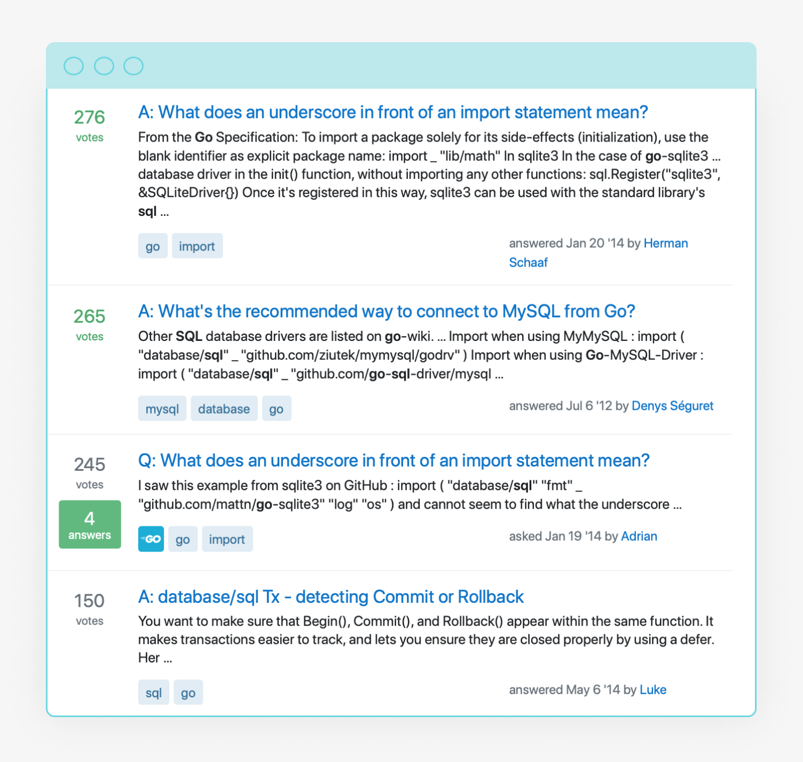
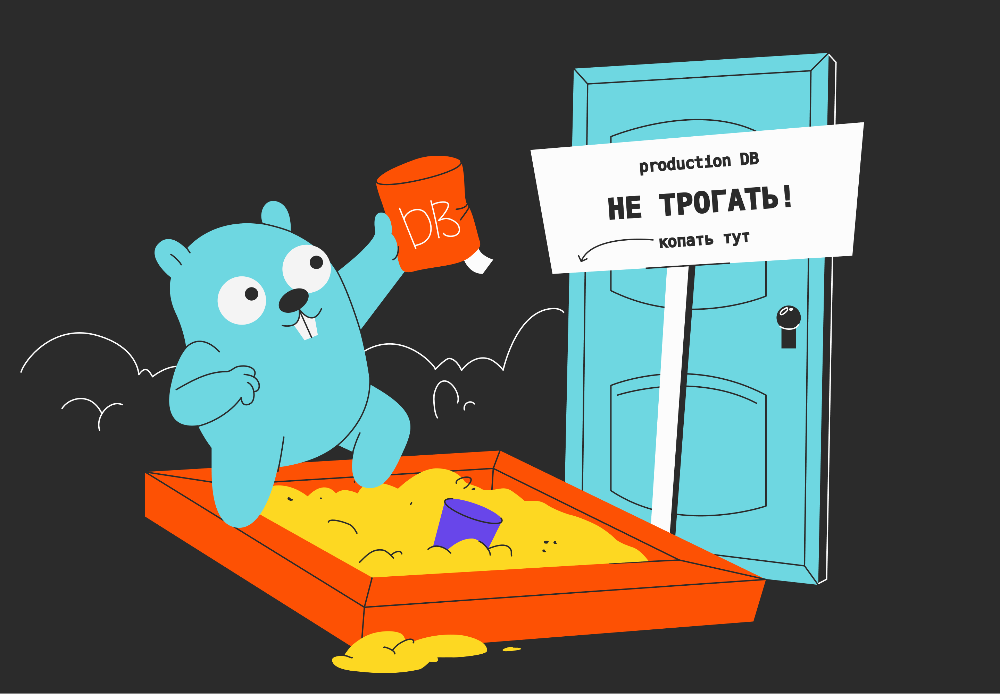
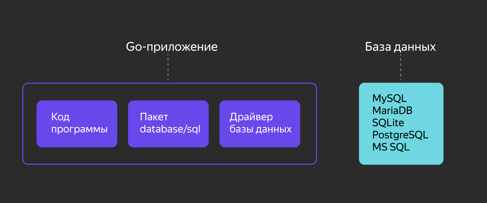

# Пакет gomock: имитация баз данных

Обычно разработчики спрашивают, что означает символ `_` перед импортом пакета для работы с базой данных. Или как подключиться к базе данных на Go. Одних интересуют транзакции в SQL, других — конвертация записи из базы данных в структуру. 



Следующая тема посвящена взаимодействию с SQL-базами данных. В рамках её изучения вы: 
- узнаете, как тестировать код, когда база данных еще не готова, но уже почти написана бизнес-логика приложения;
- создадите базы данных и наполните их;
- научитесь выполнять запросы к БД и получать информацию из неё;
- узнаете, как изменять, добавлять и удалять записи из базы данных;
- изучите транзакции и научитесь их применять.

Начнём с инструмента `gomock`, который позволяет имитировать работу базы данных при тестировании.

Как вы знаете, код нужно тестировать, чтобы он был надёжным и живучим. Для юнит-тестирования предназначен пакет `testing`, который обеспечивает поддержку автоматического тестирования пакетов Go. 

Хотя пакет `testing` справляется со своими задачами, есть ситуации, когда нужно прибегнуть к дополнительным инструментам тестирования. Например, когда тестируемый код активно работает с внешним окружением. Не всегда тесты могут отправлять множество запросов к базе данных или сервисам. Более того, запускать тесты на рабочей БД нельзя. Иначе можно поломать производственные процессы. 

Приходится создавать тестовое окружение — песочницу. Чтобы протестировать код, работающий с БД, нужно установить базу данных, создать копию или срез рабочей базы или сгенерировать базу со случайными данными. Эти действия выходят за рамки юнит-тестов: получается интеграционное тестирование. 



Бывает, что в базе данных или сервисе ещё не реализованы нужные возможности, а код, требующий тестирования, уже написан. Во всех этих ситуациях помогут заглушки — **моки** (от англ. mock — «пародия», «имитация»).

Использование моков — это стандартный подход в юнит-тестировании. Мок заменяет реальный объект — зависимость тестируемого класса. 

Сервис описывают интерфейсом. В тестовой среде этот сервис подменивают моком. Заглушка реализует интерфейс, но фактических вычислений не выполняет. 

Писать заглушки вручную — занятие трудоёмкое. Для экономии времени используют пакеты, которые создают моки. Код заглушек автоматически генерируется из объявленных интерфейсов. Один из таких пакетов рассмотрим подробнее. 

## Создаём моки с помощью пакета gomock

Вы уже знакомы с библиотекой [testify](https://github.com/stretchr/testify), которая содержит различные пакеты для тестирования, в том числе пакет `mock`. Рассмотрим другой популярный пакет для работы с моками — [gomock](https://github.com/golang/mock).

Пакет устанавливается так же, как и другие инструменты в Go: 
`go install github.com/golang/mock/mockgen@latest`

Получаем исполняемую команду `mockgen`, которая и генерирует заглушки. `mockgen` работает в двух основных режимах:
1. Режим исходного кода. Мок-интерфейсы генерируются из файла-исходника, указанного в параметре `-source`. Этот режим может работать с неэкспортируемыми интерфейсами.
`mockgen -source=src_file.go`
1. Режим рефлексии (англ. reflection). Мок-интерфейсы генерируются через анализ интерфейсов. Код сначала компилируется, потом разбирается при помощи пакета `reflect`. Вы уже сталкивались с этим пакетом в уроках про структурные теги и encoding. Для запуска в режиме рефлексии нужно указать два позиционных аргумента: путь тестируемого пакета (такой же, как в инструкции `import`) и список разделённых запятой интерфейсов, для которых требуется сгенерировать заглушки. Режим рефлексии можно использовать с директивами `go:generate`.
`mockgen github.com/user/project Store,Driver`

Чтобы сохранить сгенерированные заглушки в файл, укажите его имя в параметре `-destination`.

У `mockgen` есть и другие флаги, детализирующие поведение утилиты. Их описание можно открыть на сайте разработчика или вызвать командой `mockgen -help`.

Попробуем `gomock` в деле. Будем использовать режим рефлексии. Он даёт больше контроля над тем, что, где и когда генерируется.

Рассмотрим хранилище, описанное интерфейсом:
```go
// файл store/store.go

package store

type Store interface {
   Set(key string, value []byte) error
   Get(key string) ([]byte, error)
   Delete(key string) error
}
```

А вот использующая его функция, которую нужно протестировать:
```go
// файл persistent/persistent.go

package persistent

import (
   "project/store"
)

func Lookup(s store.Store, key string) ([]byte, error) {
   // ...
   return s.Get(key)
}
```

Предположим, что пакеты проекта организованы следующим образом:
```
project
|___ store
|    |___ store.go
|
|___ mocks
|    |___ mock_store.go
|
|___ persistent
     |___ persistent.go
     |___ persistent_test.go
```

Папку `mocks` для заглушек нужно создать вручную, а файл `mock_store.go` создаст `mockgen`.

Теперь, чтобы запустить `mockgen` в режиме рефлексии, выполним в корневой директории проекта команду:
`mockgen -destination=mocks/mock_store.go -package=mocks project/store Store`

Разберём параметры этой команды:
- `-destination` указывает имя файла, куда нужно записать сгенерированный код. Если этот флаг не указать, результаты будут просто выведены в консоль.
- `-package` — путь пакета сгенерированных заглушек. По умолчанию будет `mock_store`.
- `project/store` — имя пакета, для интерфейсов которого делаем заглушки.
- `Store` — имя интерфейса, для которого будут созданы моки.

В результате должен сгенерироваться файл `mocks/mock_store.go` с примерно таким кодом:
```go
// Code generated by MockGen. DO NOT EDIT.
// Source: project/store (interfaces: Store)

// Package mocks is a generated GoMock package.
package mocks

import (
   reflect "reflect"

   gomock "github.com/golang/mock/gomock"
)

// MockStore is a mock of Store interface.
type MockStore struct {
   ctrl     *gomock.Controller
   recorder *MockStoreMockRecorder
}

// MockStoreMockRecorder is the mock recorder for MockStore.
type MockStoreMockRecorder struct {
   mock *MockStore
}

// NewMockStore creates a new mock instance.
func NewMockStore(ctrl *gomock.Controller) *MockStore {
   mock := &MockStore{ctrl: ctrl}
   mock.recorder = &MockStoreMockRecorder{mock}
   return mock
}

// EXPECT returns an object that allows the caller to indicate expected use.
func (m *MockStore) EXPECT() *MockStoreMockRecorder {
   return m.recorder
}

// ...

// Get mocks base method.
func (m *MockStore) Get(arg0 string) ([]byte, error) {
   m.ctrl.T.Helper()
   ret := m.ctrl.Call(m, "Get", arg0)
   ret0, _ := ret[0].([]byte)
   ret1, _ := ret[1].(error)
   return ret0, ret1
}

// Get indicates an expected call of Get.
func (mr *MockStoreMockRecorder) Get(arg0 interface{}) *gomock.Call {
   mr.mock.ctrl.T.Helper()
   return mr.mock.ctrl.RecordCallWithMethodType(mr.mock, "Get", reflect.TypeOf((*MockStore)(nil).Get), arg0)
}

// ...
```

`MockStore` — это тип-заглушка, реализующий интерфейс `Store`. Объекты этого типа создаются функцией `NewMockStore(...)`.  У каждого объекта есть метод `EXPECT()`, который возвращает экземпляр объекта для записи действий — в нашем случае `MockStoreMockRecorder`. `MockStoreMockRecorder` также имеет все методы интерфейса `Store`, но типы параметров у них — `interface{}`.

Чтобы подключить мок к тесту, нужно:
1. Создать контроллер с помощью функции `gomock.NewController(t)`.
1. Создать фиктивный объект. В нашем случае — вызвать `NewMockStore(ctrl)`.
1. Вызвать для объекта метод `EXPECT()`, затем метод-заглушку с нужными параметрами и метод `Return()` c требуемыми возвращаемыми значениями. Например: `m.EXPECT().Get("key").Return("value", nil)`. Это гарантирует, что при вызове конкретного метода с указанными параметрами будут возвращены именно такие значения.

Теперь можно передать объект-заглушку в тестируемую функцию. Реализуем это в тесте:
```go
// файл persistent/persistent_test.go

package persistent

import (
   "project/mocks"
   "testing"

   "github.com/golang/mock/gomock"
   "github.com/stretchr/testify/require"
)

func TestGet(t *testing.T) {
   // создаём контроллер
   ctrl := gomock.NewController(t)
   defer ctrl.Finish()

   // создаём объект-заглушку
   m := mocks.NewMockStore(ctrl)

   // гарантируем, что заглушка
   // при вызове с аргументом "Key" вернёт "Value"
   value := []byte("Value")
   m.EXPECT().Get("Key").Return(value, nil)

   // тестируем функцию Lookup, передав в неё объект-заглушку
   val, err := Lookup(m, "Key")
   // и проверяем возвращаемые значения
   require.NoError(t, err)
   require.Equal(t, val, value)
}
```

У пакета `gomock` есть функции и методы для создания разнообразных сценариев тестирования. Он позволяет: 
- установить максимальное и минимальное количество вызовов метода,
```go
   m.EXPECT().Get("key").Return("value", nil).MaxTimes(5)
   m.EXPECT().Get("key").MinTimes(1).MaxTimes(10)
```
- принимать любые параметры,
```go
   m.EXPECT().Get(gomock.Any())
```
- вызывать методы в определённом порядке.
```go
gomock.InOrder(
   m.EXPECT().Get("1"),
   m.EXPECT().Get("2"),
   m.EXPECT().Get("3"),
   m.EXPECT().Get("4"),
)
```

Вот так будет выглядеть пример теста с моками:
```go
func TestGet(t *testing.T) {
   ctrl := gomock.NewController(t)
   defer ctrl.Finish()

   m := mocks.NewMockStore(ctrl)

   value := []byte("Value")
   m.EXPECT().
      Get(gomock.Any()).
      Return(value, nil).
      MaxTimes(5)

   for _, s := range []string{"Валерия", "Иван", "Екатерина"} {
      val, err := Lookup(m, s)
      require.NoError(t, err)
      require.Equal(t, val, value)
   }
}
```

___
Реализуйте сценарий тестирования, во время которого заглушка вернёт ошибку при пустом ключе.
```go
package persistent

import (
   "errors"
   "project/mocks"
   "testing"

   "github.com/golang/mock/gomock"
   "github.com/stretchr/testify/require"
)

func TestGet(t *testing.T) {
   ctrl := gomock.NewController(t)
   defer ctrl.Finish()

   m := mocks.NewMockStore(ctrl)

   // возвращаемая ошибка
   errEmptyKey := errors.New("Указан пустой ключ")

   // допишите код
   // ...
}
```

Решение:
```go
   m.EXPECT().Get("").Return([]byte(""), errEmptyKey)
   _, err := Lookup(m, "")
   require.ErrorIs(t, err, errEmptyKey)
```

## Дополнительные материалы

- [go.dev/github.com/golang/mock/gomock](https://pkg.go.dev/github.com/golang/mock/gomock) — документация пакета `gomock`.
- [GitHub | Testing with GoMock: A Tutorial](https://gist.github.com/thiagozs/4276432d12c2e5b152ea15b3f8b0012e) — руководство по тестированию с пакетами `testing` и `gomock`.
- [Medium | A GoMock Quick Start Guide](https://readmedium.com/a-gomock-quick-start-guide-71bee4b3a6f1) — гайд по тестированию с пакетом `gomock`.

# Обучение Алисы 10

Навык Алисы принимает голосовые сообщения и передаёт их между пользователями. Поэтому нам надо позаботиться о том, куда будут сохраняться сообщения и откуда их при необходимости предстоит извлекать. Создадим постоянное хранилище.  

Спроектируем абстрактное хранилище, используя интерфейсы Go. Также добавим новые сценарии в автотесты.

Создадим директорию `internal/store` и поместим туда файл `store.go`:
```
> ~/dev/alice-skill
       |
       |--- cmd
       |     |--- skill
       |            |--- flags.go
       |            |--- gzip.go
       |            |--- main.go
       |            |--- main_test.go
       |--- internal
       |       |--- logger
       |       |      |--- logger.go
       |       |--- models
       |       |      |--- models.go
       |       |--- store
       |              |--- store.go
       |--- go.mod
       |--- go.sum
```

Добавим в новый файл следующий код:
```go
package store

import (
    "context"
    "time"
)

// MessageStore описывает абстрактное хранилище сообщений пользователей
type MessageStore interface {
    // FindRecipient возвращает внутренний идентификатор пользователя по человекопонятному имени
    FindRecipient(ctx context.Context, username string) (userID string, err error)
    // ListMessages возвращает список всех сообщений для определённого получателя
    ListMessages(ctx context.Context, userID string) ([]Message, error)
    // GetMessage возвращает сообщение с определённым ID
    GetMessage(ctx context.Context, id int64) (*Message, error)
    // SaveMessage сохраняет новое сообщение
    SaveMessage(ctx context.Context, userID string, msg Message) error
}

// Message описывает объект сообщения
type Message struct {
    ID      int64     // внутренний идентификатор сообщения
    Sender  string    // отправитель
    Time    time.Time // время отправления
    Payload string    // текст сообщения
}
```

Также, для сохранения данных пользователя в наше хранилище, нам потребуется принимать идентификатор пользователя в запросе к нашему навыку. Для это обновим файл `internal/models/models.go`:
```go
type Session struct {
    New  bool        `json:"new"`
    User RequestUser `json:"user"`
}

// RequestUser содержит данные об авторизованном пользователе навыка
type RequestUser struct {
    UserID string `json:"user_id"`
}
```

Теперь можем добавить интерфейс `store.MessageStore` как зависимость навыка и обновить код для работы с хранилищем сообщений.

Лучше всего при проектировании приложения с внешними зависимостями инкапсулировать их внутрь объекта, реализующего бизнес-логику приложения.
Для этого вынесем `webhook` из файла `cmd/skill/main.go` в файл `cmd/skill/app.go` и превратим его в метод структуры вашего приложения:
```go
package main

import (
    "encoding/json"
    "fmt"
    "net/http"
    "time"

    "github.com/bluegopher/alice-skill/internal/logger"
    "github.com/bluegopher/alice-skill/internal/models"
    "github.com/bluegopher/alice-skill/internal/store"
    "go.uber.org/zap"
)

// app инкапсулирует в себя все зависимости и логику приложения
type app struct {
    store store.MessageStore
}

// newApp принимает на вход внешние зависимости приложения и возвращает новый объект app
func newApp(s store.MessageStore) *app {
    return &app{store: s}
}

func (a *app) webhook(w http.ResponseWriter, r *http.Request) {
    ctx := r.Context()

    if r.Method != http.MethodPost {
        logger.Log.Debug("got request with bad method", zap.String("method", r.Method))
        w.WriteHeader(http.StatusMethodNotAllowed)
        return
    }

    // десериализуем запрос в структуру модели
    logger.Log.Debug("decoding request")
    var req models.Request
    dec := json.NewDecoder(r.Body)
    if err := dec.Decode(&req); err != nil {
        logger.Log.Debug("cannot decode request JSON body", zap.Error(err))
        w.WriteHeader(http.StatusInternalServerError)
        return
    }

    // проверим, что пришёл запрос понятного типа
    if req.Request.Type != models.TypeSimpleUtterance {
        logger.Log.Debug("unsupported request type", zap.String("type", req.Request.Type))
        w.WriteHeader(http.StatusUnprocessableEntity)
        return
    }

    // получаем список сообщений для текущего пользователя
    messages, err := a.store.ListMessages(ctx, req.Session.User.UserID)
    if err != nil {
        logger.Log.Debug("cannot load messages for user", zap.Error(err))
        w.WriteHeader(http.StatusInternalServerError)
        return
    }

    // формируем текст с количеством сообщений
    text := "Для вас нет новых сообщений."
    if len(messages) > 0 {
        text = fmt.Sprintf("Для вас %d новых сообщений.", len(messages))
    }

    // первый запрос новой сессии
    if req.Session.New {
        // обработаем поле Timezone запроса
        tz, err := time.LoadLocation(req.Timezone)
        if err != nil {
            logger.Log.Debug("cannot parse timezone")
            w.WriteHeader(http.StatusBadRequest)
            return
        }

        // получим текущее время в часовом поясе пользователя
        now := time.Now().In(tz)
        hour, minute, _ := now.Clock()

        // формируем новый текст приветствия
        text = fmt.Sprintf("Точное время %d часов, %d минут. %s", hour, minute, text)
    }

    // заполним модель ответа
    resp := models.Response{
        Response: models.ResponsePayload{
            Text: text, // Алиса проговорит наш новый текст
        },
        Version: "1.0",
    }

    w.Header().Set("Content-Type", "application/json")

    // сериализуем ответ сервера
    enc := json.NewEncoder(w)
    if err := enc.Encode(resp); err != nil {
        logger.Log.Debug("error encoding response", zap.Error(err))
        return
    }
    logger.Log.Debug("sending HTTP 200 response")
}
```

Теперь структура приложения выглядит так:
```
> ~/dev/alice-skill
       |
       |--- cmd
       |     |--- skill
       |            |--- app.go
       |            |--- flags.go
       |            |--- gzip.go
       |            |--- main.go
       |            |--- main_test.go
       |--- internal
       |       |--- logger
       |       |      |--- logger.go
       |       |--- models
       |       |      |--- models.go
       |       |--- store
       |              |--- store.go
       |--- go.mod
       |--- go.sum
```

Изменим код в файле `cmd/skill/main.go`, удалив функцию `webhook`, которая теперь является методом структуры `app`. Добавим следующие строчки:
```go
func run() error {
    if err := logger.Initialize(flagLogLevel); err != nil {
        return err
    }
    
    // создаём экземпляр приложения, пока без внешней зависимости хранилища сообщений
    appInstance := newApp(nil)

    logger.Log.Info("Running server", zap.String("address", flagRunAddr))
    // обернём хендлер webhook в middleware с логированием и поддержкой gzip
    return http.ListenAndServe(flagRunAddr, logger.RequestLogger(gzipMiddleware(appInstance.webhook)))
}
```

Последним шагом нужно удостовериться, что код хендлера корректно работает с хранилищем. Для этого сгенерируем мок для интерфейса хранилища и обновим зависимости проекта:
```bash
$ mockgen -source=internal/store/store.go -destination=internal/store/mock/store.go -package=mock MessageStore
$ go mod tidy
```

Если в дереве проекта появился файл `internal/store/mock/store.go`, значит, операция прошла успешно:
```
> ~/dev/alice-skill
       |
       |--- cmd
       |     |--- skill
       |            |--- app.go
       |            |--- flags.go
       |            |--- gzip.go
       |            |--- main.go
       |            |--- main_test.go
       |--- internal
       |       |--- logger
       |       |      |--- logger.go
       |       |--- models
       |       |      |--- models.go
       |       |--- store
       |              |--- mock
       |                    |--- store.go
       |              |--- store.go
       |--- go.mod
       |--- go.sum
```

Теперь осталось выполнить последний шаг. Дополним автотесты, чтобы они учитывали последние изменения в коде.

Для этого исправим файл `cmd/skill/main_test.go`:
```go
package main

import (
    "bytes"
    "compress/gzip"
    "io"
    "net/http"
    "net/http/httptest"
    "testing"
    "time"

    "github.com/bluegopher/alice-skill/internal/store"
    "github.com/bluegopher/alice-skill/internal/store/mock"
    "github.com/go-resty/resty/v2"
    "github.com/stretchr/testify/assert"
    "github.com/stretchr/testify/require"
    "go.uber.org/mock/gomock"
)

func TestWebhook(t *testing.T) {
    // создадим конроллер моков и экземпляр мок-хранилища
    ctrl := gomock.NewController(t)
    s := mock.NewMockMessageStore(ctrl)

    // определим, какой результат будем получать от «хранилища»
    messages := []store.Message{
        {
            Sender:  "411419e5-f5be-4cdb-83aa-2ca2b6648353",
            Time:    time.Now(),
            Payload: "Hello!",
        },
    }

    // установим условие: при любом вызове метода ListMessages возвращать массив messages без ошибки
    s.EXPECT().
        ListMessages(gomock.Any(), gomock.Any()).
        Return(messages, nil)

    // создадим экземпляр приложения и передадим ему «хранилище»
    appInstance := newApp(s)

    handler := http.HandlerFunc(appInstance.webhook)
    srv := httptest.NewServer(handler)
    defer srv.Close()

    testCases := []struct {
        name         string // добавим название тестов
        method       string
        body         string // добавим тело запроса в табличные тесты
        expectedCode int
        expectedBody string
    }{
        {
            name:         "method_get",
            method:       http.MethodGet,
            expectedCode: http.StatusMethodNotAllowed,
            expectedBody: "",
        },
        {
            name:         "method_put",
            method:       http.MethodPut,
            expectedCode: http.StatusMethodNotAllowed,
            expectedBody: "",
        },
        {
            name:         "method_delete",
            method:       http.MethodDelete,
            expectedCode: http.StatusMethodNotAllowed,
            expectedBody: "",
        },
        {
            name:         "method_post_without_body",
            method:       http.MethodPost,
            expectedCode: http.StatusInternalServerError,
            expectedBody: "",
        },
        {
            name:         "method_post_unsupported_type",
            method:       http.MethodPost,
            body:         `{"request": {"type": "idunno", "command": "do something"}, "version": "1.0"}`,
            expectedCode: http.StatusUnprocessableEntity,
            expectedBody: "",
        },
        {
            name:         "method_post_success",
            method:       http.MethodPost,
            body:         `{"request": {"type": "SimpleUtterance", "command": "sudo do something"}, "session": {"new": true}, "version": "1.0"}`,
            expectedCode: http.StatusOK,
            expectedBody: `Точное время .* часов, .* минут. Для вас 1 новых сообщений.`,
        },
    }

    for _, tc := range testCases {
        t.Run(tc.method, func(t *testing.T) {
            req := resty.New().R()
            req.Method = tc.method
            req.URL = srv.URL

            if len(tc.body) > 0 {
                req.SetHeader("Content-Type", "application/json")
                req.SetBody(tc.body)
            }

            resp, err := req.Send()
            assert.NoError(t, err, "error making HTTP request")

            assert.Equal(t, tc.expectedCode, resp.StatusCode(), "Response code didn't match expected")
            if tc.expectedBody != "" {
                assert.Regexp(t, tc.expectedBody, string(resp.Body()))
            }
        })
    }
}

func TestGzipCompression(t *testing.T) {
    ctrl := gomock.NewController(t)
    s := mock.NewMockMessageStore(ctrl)

    messages := []store.Message{
        {
            Sender:  "411419e5-f5be-4cdb-83aa-2ca2b6648353",
            Time:    time.Now(),
            Payload: "Hello!",
        },
    }

    s.EXPECT().
        ListMessages(gomock.Any(), gomock.Any()).
        Return(messages, nil).
        // удостоверимся, что мок вызывается точно 2 раза
        Times(2)

    appInstance := newApp(s)

    handler := http.HandlerFunc(gzipMiddleware(appInstance.webhook))

    srv := httptest.NewServer(handler)
    defer srv.Close()

    requestBody := `{
        "request": {
            "type": "SimpleUtterance",
            "command": "sudo do something"
        },
        "version": "1.0"
    }`

    // ожидаемое содержимое тела ответа при успешном запросе
    successBody := `{
        "response": {
            "text": "Для вас 1 новых сообщений."
        },
        "version": "1.0"
    }`

    t.Run("sends_gzip", func(t *testing.T) {
        buf := bytes.NewBuffer(nil)
        zb := gzip.NewWriter(buf)
        _, err := zb.Write([]byte(requestBody))
        require.NoError(t, err)
        err = zb.Close()
        require.NoError(t, err)

        r := httptest.NewRequest("POST", srv.URL, buf)
        r.RequestURI = ""
        r.Header.Set("Content-Encoding", "gzip")
        r.Header.Set("Accept-Encoding", "")

        resp, err := http.DefaultClient.Do(r)
        require.NoError(t, err)
        require.Equal(t, http.StatusOK, resp.StatusCode)

        defer resp.Body.Close()

        b, err := io.ReadAll(resp.Body)
        require.NoError(t, err)
        require.JSONEq(t, successBody, string(b))
    })

    t.Run("accepts_gzip", func(t *testing.T) {
        buf := bytes.NewBufferString(requestBody)
        r := httptest.NewRequest("POST", srv.URL, buf)
        r.RequestURI = ""
        r.Header.Set("Accept-Encoding", "gzip")

        resp, err := http.DefaultClient.Do(r)
        require.NoError(t, err)
        require.Equal(t, http.StatusOK, resp.StatusCode)

        defer resp.Body.Close()

        zr, err := gzip.NewReader(resp.Body)
        require.NoError(t, err)

        b, err := io.ReadAll(zr)
        require.NoError(t, err)

        require.JSONEq(t, successBody, string(b))
    })
}
```

На данном этапе у нас готова вся вспомогательная функциональность: обработка входящих запросов, конфигурация, логирование и работа со сжатыми данными.

В следующий раз подключим навык к настоящей базе данных и допишем автотесты, чтобы проверить корректность работы навыка с хранилищем. Это будет решающий шаг на пути к реализации основной функции нашего сервиса — получения, сохранения и передачи голосовых сообщений между пользователями.

# Абстрактный интерфейс и SQL-драйверы

В Go для работы с данными разработчики используют БД, СУБД (систему управления базами данных) и драйвер, который отправляет SQL-запросы серверу. 

Драйвер — это прослойка между приложением и конкретной СУБД. С помощью соответствующего драйвера можно работать со многими СУБД, в том числе SQLite, MySQL, MariaDB, MS SQL, PostgreSQL, Oracle. Для одной базы данных могут использоваться несколько альтернативных драйверов.

Связать приложение с драйвером БД помогает пакет [database/sql](https://pkg.go.dev/database/sql). Его функции и методы выступают в роли промежуточного интерфейса между приложением, подключённым драйвером и сервером базы данных. Если приложение использует `database/sql`, то для переключения с одной БД на другую достаточно указать новый драйвер и поправить синтаксис SQL-запросов, так как в разных СУБД он может различаться.

Такой подход в работе с SQL-базами данных позволяет писать код, который будет по минимуму привязан к конкретной БД и при необходимости мигрировать на другую СУБД с наименьшими затратами.



В этом уроке мы будем работать в основном с SQLite — встраиваемой кроссплатформенной СУБД, не использующей парадигму клиент-сервер. Она представляет собой библиотеку, которая становится частью программы. 
Также затронем работу с двумя другими популярными СУБД — MySQL и PostgreSQL. В заданиях вы можете использовать MySQL вместо SQLite.

*PostgreSQL пригодится вам для работы над проектом — обратите на неё особое внимание.*

## Установка MySQL и PostgreSQL

Для начала установим систему управления базами данных. 

Чтобы установить MySQL, [скачайте дистрибутив](https://dev.mysql.com/downloads/mysql/) для вашей операционной системы и запустите его. В процессе установки отметьте варианты по умолчанию, если затрудняетесь с выбором. 

Для Linux можно установить MySQL из официального репозитория. Вот пример для Linux Ubuntu:
```bash
$ sudo apt install mysql-server mysql-client

# далее нужно установить настройки безопасности
$ mysql_secure_installation
```

[На этом сайте](https://metanit.com/sql/mysql/1.1.php) вы найдёте подробную инструкцию по установке MySQL для Windows, [на этом](https://losst.pro/ustanovka-mysql-ubuntu-16-04) — для Linux. А [здесь](https://www.lifewire.com/how-to-install-mysql-on-macos-4586389) вы увидите инструкцию по установке для macOS. 

*Можно также использовать [MariaDB](https://mariadb.org/) — это форк базы кода MySQL, который поддерживается и развивается сообществом.*

Аналогично происходит установка PostgreSQL. Нужно [скачать](https://www.postgresql.org/download/) дистрибутив и запустить его на вашей ОС. Установить PostgreSQL на Linux можно из официального репозитория:
```bash
$ sudo apt -y install postgresql
```

[Здесь](https://winitpro.ru/index.php/2019/10/25/ustanovka-nastrojka-postgresql-v-windows/) вы найдёте подробную инструкцию по установке PostgreSQL на Windows, а [здесь](https://ruvds.com/ru/helpcenter/postgresql-pgadmin-ubuntu/) — на Linux Ubuntu. [Здесь](https://wiki.postgresql.org/wiki/Russian/PostgreSQL-One-click-Installer-Guide) — инструкция по установке на macOS.

Итак, вы установили СУБД. Чтобы начать с ней работать, нужно создать базу данных. Воспользуемся консольным клиентом `mysql` для MySQL и MariaDB, а также `psql` — для PostgreSQL.

Вот пример создания БД PostgreSQL на Linux:
```bash
$ sudo -i -u postgres
$ psql -U postgres
postgres=# create database dbname;
postgres=# create user username with encrypted password 'userpassword';
postgres=# grant all privileges on database dbname to username;
```

Здесь `dbname` — это имя БД, `username` — имя пользователя, а `userpassword` — пароль пользователя.

Чтобы не запутаться в дальнейшем, лучше определить одинаковые имена для базы данных и пользователя. Например, в уроке мы будем работать с базой данных видео, поэтому определим такие имена:
```bash
postgres=# create database videos;
postgres=# create user videos with encrypted password 'userpassword';
postgres=# grant all privileges on database videos to videos;
```

## Установка SQLite

SQLite встраивается в приложение и не требует установки сервера базы данных или дополнительных модулей на ваш компьютер. Эта СУБД отлично подходит для небольших баз данных, которые можно легко скопировать и на другой компьютер.

[Скачайте](https://www.sqlite.org/download.html) комплект консольных утилит для вашей ОС. Вам понадобится программа `sqlite3`, чтобы импортировать `csv`-файл в БД SQLite.

Если вы не привыкли к консоли, можно использовать любой клиент с графическим интерфейсом, который работает с нужной вам СУБД. Например, [DBeaver](https://dbeaver.io/).

## Выбор драйвера

Теперь нужно выбрать драйвер, который обеспечит связь между кодом на Go и СУБД. 

Посмотрите [список доступных драйверов](https://go.dev/wiki/SQLDrivers) на GitHub. Их очень много — больше 50, и для каждой СУБД можно выделить два-три популярных. Поэтому самого лучшего, универсального драйвера не существует.

В таблице приведены наиболее часто используемые драйверы. Обратите внимание: некоторые из них требуют [cgo](https://pkg.go.dev/cmd/cgo), некоторые — нет. Если режим `cgo` включён, можно напрямую исполнять C-код, а результат использовать в Go-коде. Для применения `cgo` нужно дополнительно устанавливать C-компилятор.

База данных | Драйвер | Описание
---|---|---
SQLite | https://github.com/mattn/go-sqlite3 | Один из самых популярных пакетов для SQLite. Хорошая документация. Требует cgo.
SQLite | https://pkg.go.dev/modernc.org/sqlite | Не требует cgo. Написан на чистом Go.
MySQL | https://github.com/go-sql-driver/mysql/ | Не требует cgo. Быстрый и стабильный драйвер, поддерживает запросы более 16 Мб, соединение через IPv4, IPv6 и Unix domain sockets. Подробная документация.
MySQL | https://github.com/go-mysql-org/go-mysql | Это не только драйвер, но и набор утилит. Включает в себя инструменты репликаций, синхронизаций с другими БД ― например, Redis.
PostgreSQL | https://github.com/lib/pq | Популярная раньше библиотека, сейчас практически не поддерживается. Авторы рекомендуют использовать pgx.
PostgreSQL | https://github.com/jackc/pgx | Самый популярный драйвер для проекта с БД PostgreSQL. Быстрый, написан на чистом Go. Можно использовать как через драйвер, так и без пакета `database/sql`. Использование без пакета немного увеличит производительность, а также обеспечит поддержку дополнительных типов атрибутов.

*Помните, что список драйверов периодически обновляется. Могут появиться новые драйверы, которые будут поддерживать больше возможностей и работать быстрее. При написании проекта обязательно проверяйте полный список доступных драйверов.*

## Пакет database/sql

Перейдём к работе с пакетом `database/sql`. Его особенность в том, что он написан обобщённо. Это означает, что все привязки к конкретному движку вынесены в драйвер.

Чтобы получить доступ к базе данных, будем использовать структуру `sql.DB`.

*`sql.DB` — это интерфейс к драйверу базы данных. А драйвер — реализация интерфейса, который содержит логику работы с конкретной СУБД. Драйвер спроектирован так, что в коде не нужно вручную работать с базой данных и достаточно пользоваться только методами `sql.DB`. Код не зависит от драйвера, поэтому драйвер можно легко сменить.*