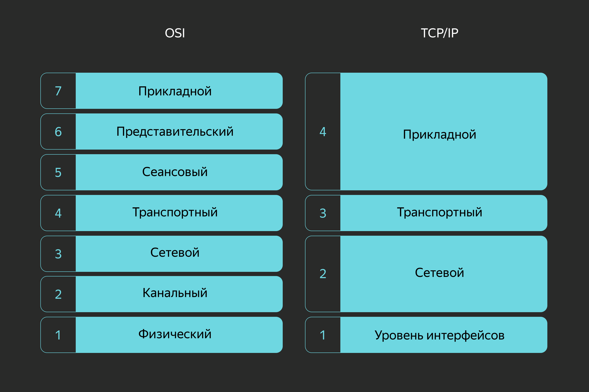
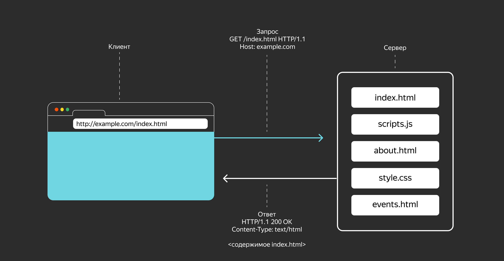
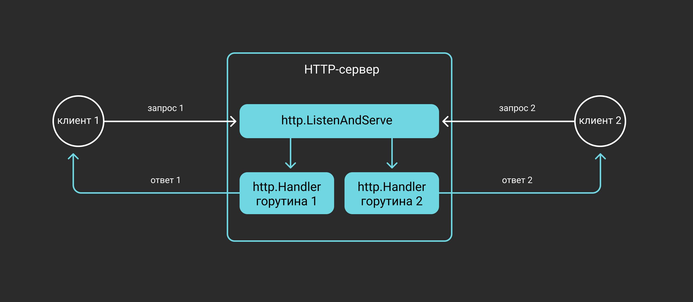
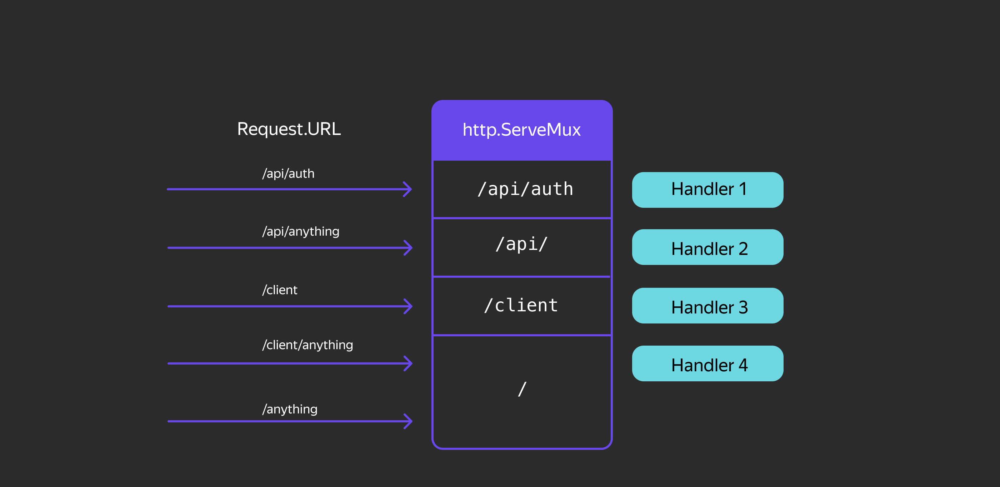

# Пакет net/http. Работа с HTTP

## Структура проекта


Мем, основанный на реальных событиях. Чтобы не оказаться в такой ситуации, нужно серьёзно подойти к архитектуре проекта.

Вы приступаете к теме `net/http` — одной из самых объёмных и сложных в программе. От вас потребуется максимум концентрации, чтобы изучить теорию и в первых кодовых инкрементах реализовать поставленные задачи. В этой теме вы создадите HTTP-сервер на Go и заложите фундамент вашего проекта.

Вначале вы познакомитесь с принципами организации Go-пакетов — это поможет правильно сформировать структуру проекта. Затем вы узнаете, как отправлять HTTP-запросы и обрабатывать ответы, — это пригодится при тестировании HTTP-сервера. В конце вы перепишете первую версию сервиса, используя сторонний HTTP-пакет, и добавите набор тестов для проверки работоспособности кода.

Итого вы реализуете клиентскую и серверную часть для HTTP-протокола, а также:
- изучите основы тестирования Go-программ и напишете первые тесты;
- научитесь тестировать сервер с помощью пакета `httptest`;
- перепишете тесты, используя стороннюю библиотеку `testify`;
- узнаете, как работать с клиентскими и серверными HTTP-библиотеками.

В этом уроке речь пойдёт о файловой структуре проекта на Go. Расскажем, как выстраивать иерархию директорий и где размещать исходные файлы.

Структура проекта может быть следующей:

### metrics
```bash
> tree ./go-musthave-metrics-trainer
./go-musthave-metrics-trainer
├── README.md
├── cmd
│   ├── agent
│   │   ├── main.go
│   │   └── main_test.go
│   └── server
│       ├── gzip.go
│       ├── handler.go
│       ├── main.go
│       ├── main_test.go
│       └── router.go
├── go.mod
├── go.sum
├── internal
│   ├── agent
│   │   ├── interfaces.go
│   │   ├── keymap.go
│   │   ├── scope.go
│   │   └── stats.go
│   ├── misc
│   │   └── env.go
│   └── store
│       ├── file.go
│       ├── sql.go
│       └── store.go
└── models
    └── metrics.go

9 directories, 20 files
```

### shortener
```bash

> tree ./go-musthave-shortener-trainer
./go-musthave-shortener-trainer
├── README.md
├── cmd
│   └── shortener
│       ├── README.md
│       ├── gzip.go
│       ├── main.go
│       ├── main_test.go
│       ├── router.go
│       └── router_test.go
├── go.mod
├── go.sum
├── internal
│   ├── app
│   │   ├── README.md
│   │   ├── app.go
│   │   ├── handler.go
│   │   └── handler_test.go
│   ├── auth
│   │   ├── codec.go
│   │   ├── codec_test.go
│   │   └── context.go
│   ├── config
│   │   └── config.go
│   └── store
│       ├── errors.go
│       ├── file.go
│       ├── memory.go
│       ├── sql.go
│       └── store.go
└── models
    └── shorten.go
```

Это базовый шаблон для организации проектов, разработанных на языке Go в рамках этого курса. Он не является официальным стандартом, установленным командой разработчиков Go, но соответствует исторически сложившимся практикам организации проектов в экосистеме. Некоторые из этих практик могут быть более распространёнными, чем другие.

В этом шаблоне также есть несколько улучшений, включая дополнительные директории, которые используются в крупных реальных проектах.

Если вы только начинаете изучать Go или создаёте небольшой учебный проект для личного использования, то этот шаблон может показаться избыточным. Начните с чего-то простого, например, с одного файла `main.go`. Когда ваш проект начнёт расти, подумайте о важности структурирования кода, чтобы избежать беспорядка и скрытых зависимостей. А когда над проектом будут работать другие люди, вам понадобится ещё более тщательная структуризация.

В этот момент важно определить стандартный способ организации пакетов и библиотек. Если вы разрабатываете проект с открытым исходным кодом или знаете, что ваш код будет использоваться в других проектах, то вам нужно понимать важность создания личных (internal) пакетов и кода. Клонируйте репозиторий, используйте только то, что вам нужно, и удалите всё остальное! Наличие «всего остального» не означает, что это обязательно использовать.

Обратите внимание, что ни один из этих шаблонов не является обязательным для использования в каждом проекте. Даже шаблон для организации зависимостей не универсален для всех случаев.

---

Почему важно разбивать проект на несколько пакетов, а не писать всё в одном файле?
~~Разделение кода на логические модули облегчает навигацию, тестирование и рефакторинг.~~

---

В спецификации языка Go нет жёстких требований к структуре директорий. Но команды, которые начинаются с `go ...`, например `go get`, в их текущей реализации работают только с репозиториями, где соблюдается ряд условий.

В репозитории обычно размещают не больше одного модуля, а в корневой директории этого модуля — файл `go.mod`.

В модуль включают один или несколько пакетов, и для каждого пакета создают свою директорию с файлами. Имя пакета должно быть идентично имени директории — для исполняемых приложений в исходных файлах достаточно внутреннего именования `package main`. 

Команда `go build`, запущенная без аргументов, собирает пакет из файлов той директории, в которой вызвана, — это основное правило. Если вы пишете черновик или совсем маленький пакет, то вполне можете обойтись одной директорией.

Директория пакета может содержать поддиректории с другими пакетами. Например, в директории пакета `net` исходников стандартной библиотеки находится поддиректория `http`. Соответственно, их пути импорта — `net` и `net/http`. Файлы пакета `net/http` не могут использовать функции пакета `net`, не импортировав его, — и наоборот.

## Директория cmd

В директорию `cmd` помещают пакеты исполняемых команд. Если вы откроете директорию с установленным Go, то в `src/cmd` вы найдёте, к примеру, пакеты команд `go` и `gofmt`.

## Директория internal

В директории `internal` размещают внутренние пакеты проекта.

Из этой директории можно импортировать только в те пакеты, которые расположены в соседних директориях, то есть у соседей должен быть общий с `internal` родитель. Например, пакет `/a/b/c/internal/d/e/f` можно импортировать только из `/a/b/c` и `/a/b/c/...` и нельзя из `/a/b/g`.

Начиная с версии Go 1.4, пакеты `internal` нельзя импортировать во внешние репозитории. Это сделано для гранулированного доступа и «подчистки» API в большой базе кода. Например, в директории `net/internal` в исходниках Go лежит непубличный пакет `socktest`, функции которого используют пакеты `net/http` и `net/http/httputil`.

Если вы опубликуете свой проект на GitHub, учитывайте, что пакеты из директории `internal` не будут доступны для импорта в другие Go-проекты.

## Директория vendor

В корневой директории модуля иногда создают поддиректорию `vendor` и сохраняют туда локальные копии зависимостей. Копии нужны для того, чтобы обезопасить свой проект от удаления или некачественной поддержки внешних библиотек. Если внешние репозитории вдруг станут недоступны, это не вызовет проблем при сборке проекта. Вы можете воспользоваться командой `go mod vendor` и создать такую директорию.

___
Может ли pkg2 импортировать util при такой структуре, если util лежит в internal?
```bash
— MyProject
    |
    — pkg1
         |
         — internal
               |
               — util
    — pkg2
```
~~Нет, internal доступен только для пакетов внутри pkg1.~~
___

Вы можете организовать структуру вашего проекта с учётом приведённых выше особенностей и ограничений. Вот один из возможных примеров:
```bash
— project
    |
    — go.mod
    — cmd
        |
        — client
            |
            — main.go
            — main_test.go
        — server
            |
            — main.go
            — main_test.go
    — internal
        |
        — handlers
            |
            — handlers.go
        |
        — util
            |
            — util.go
```

Кроме технических условий, которые должны соблюдаться для правильной работы команд, есть принятые в Go-сообществе соглашения по организации проектов. Они описаны на странице [Standard Go Project Layout](https://github.com/golang-standards/project-layout/blob/master/README_ru.md). Единообразие в структуре проектов облегчает их понимание и поддержку. Но не все разработчики используют предложенные шаблоны, так как эта инициатива носит рекомендательный, а не обязательный характер.

___
Могут ли файлы одного пакета лежать в разных директориях?
~~Нет, не могут. Все файлы пакета должны лежать в одной директории.~~

Зачем в Go используют cmd/ для главных приложений?
~~Чтобы чётко отделить точку входа от библиотечного кода. Например, cmd/server и cmd/cli могут использовать общие пакеты из /pkg.~~
___

Чтобы лучше представлять себе, как выглядит структура директорий в Go, изучите несколько популярных проектов:
- [project-layout](https://github.com/golang-standards/project-layout/blob/master/README_ru.md) — Стандартный макет Go проекта.
- [Syncthing](https://github.com/syncthing/syncthing) — приложение для синхронизации файлов. Заметьте, что для служебных пакетов вместо `internal` используется директория `lib`.
- [Kubernetes](https://github.com/kubernetes/kubernetes) — программное обеспечение для развёртывания и управления контейнерами. Пакеты размещены в директории `pkg`, что позволяет использовать их в других проектах.
- [Rclone](https://github.com/rclone/rclone) — программа для синхронизации файлов с облачными хранилищами. Есть директория cmd с командами приложения и lib со служебными пакетами.

Эти примеры подтверждают отсутствие единого стандарта: структура в них совпадает разве что на 10%. Старайтесь планировать структуру вашего проекта так, чтобы расположение файлов и директорий было понятно другим разработчикам и не требовало от них много времени на поиски и исследования.

*Но изучение Go этим не ограничивается. Для погружения в специфику языка можно читать блоги и статьи, смотреть отрывки из выступлений на конференциях, слушать авторитетных разработчиков и лидеров Go-сообщества. А это целый мир! И да, многие из этих материалов на английском — заодно и в нём можно практиковаться. Так или иначе, большая часть русскоязычных материалов по Go — это переводы статей англоязычных коллег. Читать первоисточник всегда лучше.*

*А ещё в Go очень хорошо написана стандартная библиотека — если вы откроете исходники, то увидите адекватный читаемый код. Его полезно изучать, чтобы, во-первых, лучше понимать, как работают библиотечные функции. А во-вторых, чтобы знать приёмчики по написанию Go-шного кода, ведь изменения в стандартной библиотеке контролируются Go-сообществом, поэтому там, можно сказать, эталонный код. Навык поиска, навигации и чтения документации будет большим плюсом в вашем резюме.*

## Дополнительные материалы

- [go.dev | Go Modules Reference. Vendoring](https://go.dev/ref/mod#vendoring) — о директории `vendor` на официальном сайте Go.
[Dave Cheney's Blog | Use internal packages to reduce your public API surface](https://dave.cheney.net/2019/10/06/use-internal-packages-to-reduce-your-public-api-surface) — о том, зачем нужна директория `internal`, на сайте одного из самых известных Go-разработчиков. Советуем добавить блог Дейва Чейни в избранные и следить за его публикациями и выступлениями.
[GitHub | Standard Go Project Layout](https://github.com/golang-standards/project-layout/blob/master/README_ru.md) — рекомендации по структуре проектов от Go-сообщества.

## Создание HTTP-сервера

Когда-то каждый производитель оборудования разрабатывал свои собственные протоколы — наборы семантических и синтаксических правил для обмена информацией между устройствами. Но предприятиям, которые организовывали первые компьютерные сети, вскоре потребовалось наладить взаимодействие с системами других предприятий. И вот тут возникла проблема: обмениваться данными по сети могли только устройства одного производителя. 

Несовместимость оборудования вынудила производителей договориться о единой системе протоколов. Так появилось две модели:
- **Сетевая модель взаимодействия открытых систем (Open Systems Interconnection — OSI)**, разработанная Международной организацией по стандартизации (International Organization for Standardization — ISO).
- **Сетевая модель TCP/IP (Transmission Control Protocol/Internet Protocol — TCP/IP)**, разработанная учёными в области информатики, которых называют отцами интернета: Винтоном Серфом (Vinton Cerf) и Робертом Каном (Robert Kahn). Модель получила своё название от двух протоколов: протокола управления передачей (TCP) и интернет-протокола (IP).



В сетевой модели OSI выделяют семь уровней. Каждому уровню соответствуют свои протоколы.

Уровень модели OSI:	Протоколы
- Прикладной: DNS, DHCP, FTP, HTTP, HTTPS, LDAP, NTP, IMAP, POP, SSH, SMTP, NFS
- Представления: JPEG, MIDI, MPEG, TIFF, GIF, SSL, ASCII, Unicode
- Сеансовый: SOCKS, RPC, NetBIOS, PAP
- Транспортный: TCP, UDP
- Сетевой: ICMP, IGMP, IPsec, IPv4, IPv6, IPX, RIP
- Канальный: ARP, HDLC, SLIP, PPP, ATM, CDP, FDDI, MPLS, STP
- Физический: Bluetooth, Ethernet, DSL, ISDN, 802.11, Wi-Fi

Например, уровень представления содержит кодировки, алгоритмы сжатия данных и шифрования, а сеансовый уровень позволяет приложениям взаимодействовать друг с другом длительное время, поддерживая сеанс связи. Разработчикам интересны протоколы прикладного уровня HTTP и HTTPS. Большая часть контента в сети, будь то статьи на Хабре или картинки с гоферами, передаётся по этим протоколам.

Они базируются на транспортном протоколе TCP, который, в свою очередь, использует протокол сетевого уровня IP. Протокол IP позволяет адресовать устройства в сети. А TCP гарантирует отправителю, что «посылки» (пакеты данных) дойдут до адресата, причём в том порядке, в котором были отправлены. Этого уже достаточно для информационного обмена.

Протокол HTTP, используя гарантии TCP/IP, формализует стороны обмена схемой «клиент-сервер» (client–server), а сам обмен данными — схемой «запрос-ответ» (request–response).
- Роль клиента — отправлять запросы и получать ответы. Можно вспомнить утилиты `wget` и `curl` из мира Unix. Да и браузер — это клиент сетевого взаимодействия.
- Роль сервера — принимать запросы и возвращать валидные ответы. Сервер необязательно должен обладать огромной вычислительной мощностью, это просто роль в протоколе обмена данными.

Когда браузер делает HTTP-запрос к серверу, он отправляет данные по определённому адресу и порту. 

**HTTP-сервер** — это программа, которая прослушивает порт компьютера со статическим или динамическим IP-адресом и отвечает на входящие HTTP-запросы по тому же соединению.



В стандартной библиотеке Go есть всё для того, чтобы создать сервер любой сложности. Но начнём с простого: в этом уроке рассмотрим лишь самое необходимое для реализации HTTP-сервера.

В первую очередь будем использовать пакет `net/http` стандартной библиотеки, который позволяет не только создавать HTTP-сервер, но и выполнять HTTP-запросы от лица клиента.

## Принцип работы HTTP-сервера

Реализация HTTP-сервера на Go включает в себя сам сервер, который слушает порт и принимает запросы, поступающие от HTTP-клиентов, и одну или несколько функций-обработчиков, которые отвечают на эти запросы. Функции-обработчики называются **хендлерами (handlers)**.



Чтобы запустить HTTP-сервер, достаточно вызвать функцию `http.ListenAndServe(addr string, handler Handler) error`. Она начинает слушать сетевой порт по указанному адресу, разбирает запросы и передаёт их обработчикам `http.Handler`. Запросы могут обрабатываться параллельно: для каждого из них создаётся отдельная горутина. 

Параметр `addr` содержит IP-адрес компьютера, на котором будет создан сервер, и номер порта. Записывается в формате `IP-адрес:порт` — например, `127.0.0.1:8080` или `192.168.1.101:55121`. Вместо `127.0.0.1` можно указать `localhost`, который по умолчанию будет перенаправлять на этот IP-адрес. Поскольку у компьютера обычно несколько IP-адресов и нужно, чтобы сервер был доступен с каждого из них, лучше указать `0.0.0.0:порт` или просто `:порт`. 

В случае успешного запуска сервера `http.ListenAndServe()` останавливает выполнение текущего потока до момента, пока не возникнет ошибка или программа не завершит свою работу. В случае неудачного запуска функция возвращает ошибку — `error`. Например, указанный порт уже прослушивается другим приложением.

Скопируйте пример кода на свой компьютер и запустите:
```go
package main

import "net/http"

func main() {
    err := http.ListenAndServe(`:8080`, nil)
    if err != nil {
        panic(err)
    }
}
```
**Прослушивать порт по определённому адресу может только одна программа (сервер). Если вы запустите вторую копию этого примера, то получите ошибку `panic: listen tcp :8080: bind: address already in use` — «адрес уже используется».**

Чтобы проверить, работает ли созданный сервер, достаточно открыть в браузере `http://localhost:8080`. Страница должна показать `404 page not found`. Это значит, что сервер работает, но, так как отсутствуют обработчики запросов, он пока не может ответить ничего толкового.


___
Допустим, есть две программы. Одна из них запускает `http.ListenAndServe("127.0.0.1:3000", nil)`, а другая — `http.ListenAndServe("192.168.1.101:3000", nil)`, где 192.168.1.101 — другой IP-адрес этого же компьютера. Будут ли эти программы работать одновременно?
~~Да, потому что указаны разные IP-адреса.~~

Представьте, что запущен HTTP-сервер вызовом `http.ListenAndServe("localhost:8090", nil)`. Выберите URL, на которые он ответит.
- `http://localhost:8090`
- `http://127.0.0.1:8090` (`127.0.0.1` эквивалентен `localhost`)
___

## Обработка HTTP-запросов

Теперь добавим к серверу обработчик — хендлер.

Тип `http.Handler` — это интерфейсный тип с единственной функцией `ServeHTTP(...)`. Она будет вызвана для обработки любого HTTP-запроса.

Обработчику нужно передать:
- `http.ResponseWriter` — интерфейс потоковой записи, куда обработчик может писать ответные данные для клиента;
- `http.Request` — данные запроса.
```go
type Handler interface {
    ServeHTTP(ResponseWriter, *Request)
}
```

В первом параметре передаётся переменная интерфейсного типа `ResponseWriter`. Здесь методы `Header` и `WriteHеader` используются для работы с заголовками, а метод `Write` выводит тело ответа:
```go
type ResponseWriter interface {
    Header() Header
    Write([]byte) (int, error)
    WriteHeader(statusCode int)
}
```

Второй параметр — типа `*Request` — это указатель на структуру, которая содержит информацию о заголовках HTTP-запроса и данные, отправленные клиентом.

Добавим обработчик в пример и соберём всё вместе:

```go
package main

import "net/http"

type MyHandler struct{}

func (h MyHandler) ServeHTTP(res http.ResponseWriter, req *http.Request) {
    data := []byte("Привет!")
    res.Write(data)
}

func main() {
    var h MyHandler

    err := http.ListenAndServe(`:8080`, h)
    if err != nil {
        panic(err)
    }
}
```

Сейчас сервер выводит `Привет!`. Недостаток в том, что эта строка выводится в ответ на любой запрос: `http://localhost:8080/`, `http://localhost:8080/api`, `http://localhost:8080/users/cabinet`. А можно сделать так, чтобы ответ был разным в зависимости от пути, указанного в запросе.

## Маршрутизация запросов

Если использовать один `Handler` для всех запросов, обработчик сильно разрастётся и его трудно будет поддерживать. Чтобы этого избежать, применяют маршрутизацию запросов.

Запросы расходятся к разным обработчикам в соответствии с совпадениями в URL. За маршрутизацию отвечает структура `http.ServeMux`. Метод `ServeHTTP()` для этой структуры прописан в стандартной библиотеке. 

`http.ServeMux` — это одновременно обработчик и мультиплексор, распределяющий задачи обработки другим `http.Handler`. Он смотрит на URL запроса, ищет совпадения в списке зарегистрированных URL (паттерн) и вызывает соответствующий обработчик.

Примерно так мы обычно вспоминаем местоположение наших вещей, когда в спешке собираемся на работу.


По умолчанию в Go доступен маршрутизатор `http.DefaultServeMux`, который имеет тип `*http.ServeMux`. Например, в том коде, где вы запускали `ListenAndServe()` с параметром `nil`, работает именно этот маршрутизатор.

Добавить маршруты и функции-обработчики к `http.DefaultServeMux` можно функцией `http.HandleFunc(pattern string, handler func(ResponseWriter, *Request))`.

```go
package main

import "net/http"

func mainPage(res http.ResponseWriter, req *http.Request) {
    res.Write([]byte("Привет!"))
}

func apiPage(res http.ResponseWriter, req *http.Request) {
    res.Write([]byte("Это страница /api."))
}

func main() {
    http.HandleFunc(`/api`, apiPage)
    http.HandleFunc(`/`, mainPage)

    err := http.ListenAndServe(`:8080`, nil)
    if err != nil {
        panic(err)
    }
}
```

Запросы `http://localhost:8080/api` будет обрабатывать функция `apiPage()`. Все остальные запросы будут приходить обработчику по умолчанию `mainPage()`, так как у него указан маршрут `/`. 

**Вызываемый обработчик определяется по максимально совпадающему пути маршрута, но есть одна тонкость. Обратите внимание: в первом `HandleFunc()` указан маршрут `/api` без слеша в конце. Это значит, что запросы `http://localhost:8080/api/` и `http://localhost:8080/api/getid` будет обрабатывать функция mainPage.**

**Если вместо `/api` указать маршрут `/api/`, то эти запросы придут функции `apiPage()` — из-за последнего слеша этот маршрут будет перехватывать маршруты с префиксом `/api/`. При этом запрос `http://localhost:8080/api` будет перенаправляться на `http://localhost:8080/api/` и тоже обрабатываться функцией `apiPage()`.**

Регистрация разных обработчиков с одинаковым паттерном будет пропущена компилятором, но вызовет панику на этапе выполнения.

```go
    // иcпользование этого фрагмента приведёт к ошибке
    // panic: http: multiple registrations for /api
    http.HandleFunc(`/api`, apiPage)
    http.HandleFunc(`/`, mainPage)
    http.HandleFunc(`/api`, mainPage)
```

В маршруте, который указывается в `HandleFunc()`, нельзя использовать регулярные выражения и маски, так как маршрутизатор стандартной библиотеки не проводит их разбор. 

Порядок определения шаблонов для маршрутизатора неважен.

```go
    // этот вариант будет работать так же, 
    // как вариант в примере
    http.HandleFunc(`/`, mainPage)
    http.HandleFunc(`/api`, apiPage)
```



Поэтому на практике не рекомендуется использовать `http.DefaultServeMux`. Лучше создать свою переменную-маршрутизатор функцией `NewServeMux() *ServeMux` и вызвать для неё методы `HandleFunc()` с маршрутами и обработчиками.

```go
mux := http.NewServeMux()
mux.HandleFunc(`/api/auth`, authHandler)
mux.HandleFunc(`/api/`, apiHandler)
// ...
err := http.ListenAndServe(`:8080`, mux)
// ...
```

___
Перепишите предыдущий пример, используя свой маршрутизатор `*http.ServeMux`. Измените маршрут для обработчика `apiPage` таким образом, чтобы он обрабатывал запросы `/api/`, `/api/getid` и подобные.

Скопируйте себе пример, выполните задание, затем вернитесь в урок, чтобы сравнить свой вариант с предлагаемым решением.

```go
package main

import "net/http"

func mainPage(res http.ResponseWriter, req *http.Request) {
    res.Write([]byte("Привет!"))
}

func apiPage(res http.ResponseWriter, req *http.Request) {
    res.Write([]byte("Это страница /api."))
}

func main() {
    http.HandleFunc(`/api`, apiPage)
    http.HandleFunc(`/`, mainPage)

    err := http.ListenAndServe(`:8080`, nil)
    if err != nil {
        panic(err)
    }
}
```

Решение:
```go
package main

import "net/http"

func mainPage(res http.ResponseWriter, req *http.Request) {
    res.Write([]byte("Привет!"))
}

func apiPage(res http.ResponseWriter, req *http.Request) {
    res.Write([]byte("Это страница /api."))
}

func main() {
    mux := http.NewServeMux()
    mux.HandleFunc(`/api/`, apiPage)
    mux.HandleFunc(`/`, mainPage)

    err := http.ListenAndServe(`:8080`, mux)
    if err != nil {
        panic(err)
    }
}
```

Верные утверждения:
+ В паттернах маршрутизации нельзя использовать регулярные выражения. (Маршрутизатор стандартной библиотеки не проводит разбор регулярных выражений)
+ Если URL запроса частично совпадает с несколькими маршрутами, вызывается обработчик с максимально длинным совпадающим паттерном. (Вызывается обработчик, в маршруте которого максимальное количество символов совпадает с URL запроса)

Неверные утверждения:
- Обработчик запросов с маршрутом `/assets` будет вызываться и при запросе `/assets/`.
(Путь `/assets/` длиннее, чем `/assets`, на один слеш).
- Во время поиска обработчика маршруты перебираются в порядке их определения в коде до первого подходящего. (Порядок определения не играет роли, ищется обработчик с максимально подходящим паттерном)
___

## Структура http.Request

Метод `Handler.ServeHTTP()` и функции типа `http.HandlerFunc` принимают параметрами запрос `http.Request` и поток записи ответа `http.ResponseWriter`. Покажем, как с ними работать.

Детальную информацию о запросе обработчик получает из полей и методов структуры `http.Request`. 
```go
type Request struct {
    // указаны некоторые поля структуры
    Method        string
    URL           *url.URL
    Header        Header
    Body          io.ReadCloser
    ContentLength int64
    Host          string
    // ...
}
```

Так, поле `Method` содержит метод HTTP-запроса. Чтобы избежать ошибок, лучше использовать предопределённые константы пакета `net/http`:
```go
const (
    MethodGet     = "GET"
    MethodHead    = "HEAD"
    MethodPost    = "POST"
    MethodPut     = "PUT"
    MethodPatch   = "PATCH"
    MethodDelete  = "DELETE"
    MethodConnect = "CONNECT"
    MethodOptions = "OPTIONS"
    MethodTrace   = "TRACE"
)
```
```go
func GetHandler(w http.ResponseWriter, r *http.Request) {
   // этот обработчик принимает только запросы, отправленные методом GET
   if r.Method != http.MethodGet {
      http.Error(w, "Only GET requests are allowed!", http.StatusMethodNotAllowed)
       return
   }
   // продолжаем обработку запроса
   // ...
}
```

Заголовки запроса лежат в поле `Header` в виде мапы `map[string][]string`. Так как заголовок может содержать несколько значений, то используется мапа слайсов, а не строк:
- метод `(h Header) Values(key string) []string` возвращает слайс значений указанного заголовка;
- метод `(h Header) Get(key string) string` возвращает первое значение.

Полный URL запроса хранится в поле `URL`. 

Получить параметры GET-запроса можно методом Q`uery() url.Values`, который возвращает значение типа `type Values map[string][]string`. Метод `(v Values) Get(key string) string` возвращает первое значение. Если запрашиваемый параметр не был указан, то `Get()` вернёт пустую строку.

```go
package main

import (
    "fmt"
    "net/http"
)

func mainPage(res http.ResponseWriter, req *http.Request) {
    body := fmt.Sprintf("Method: %s\r\n", req.Method)
    body += "Header ===============\r\n"
    for k, v := range req.Header {
        body += fmt.Sprintf("%s: %v\r\n", k, v)
    }
    body += "Query parameters ===============\r\n"
    for k, v := range req.URL.Query() {
        body += fmt.Sprintf("%s: %v\r\n", k, v)
    }
    res.Write([]byte(body))
}

func main() {
    mux := http.NewServeMux()
    mux.HandleFunc(`/`, mainPage)

    err := http.ListenAndServe(`:8080`, mux)
    if err != nil {
        panic(err)
    }
}
```

Запустите эту программу и посмотрите, что отобразится в браузере, например, при таком запросе: `http://localhost:8080/?id=12345&name=John%20Doe&filter=town&filter=country`.

Параметры POST-запроса можно получить методом `(r *Request) FormValue(key string) string`. Чтобы получить все значения параметра, используйте поле `Form`, которое имеет тип `url.Values`. В этом случае нужно предварительно вызвать метод `(r *Request) ParseForm() error`.

Тело запроса хранится в поле Body io.ReadCloser и читается стандартными методами — например, body, err := io.ReadAll(req.Body). Вызывать Body.Close() не нужно, так как это автоматически делает сервер.